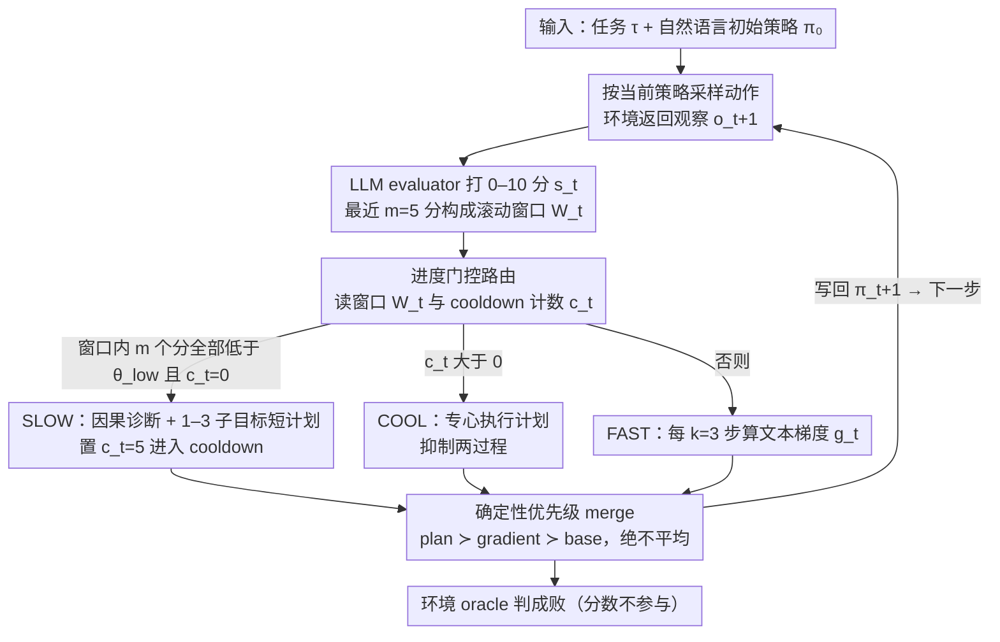

# ReflexGrad: Within-Episode Failure Recovery in LLM Agents via Progress-Gated Dual-Process Routing

**会议**: ICML 2026 Workshop (FoGen)  
**arXiv**: [2511.14584](https://arxiv.org/abs/2511.14584)  
**代码**: https://github.com/qpiai/reflexgrad (有)  
**领域**: LLM Agent / 失败恢复 / 推理时学习  
**关键词**: 双过程架构、进度门控路由、TextGrad、Reflexion、ALFWorld

## 一句话总结
ReflexGrad 把 TextGrad 的"每 3 步局部梯度精调"作为快过程、把 Reflexion 风格的"连续低分触发的因果重规划"作为慢过程，用一条进度门控路由规则在**同一个 episode 内**无示范地切换两者，在 ALFWorld 134 任务上把 Qwen-3-8B 从 35.1% 拉到 75.4%（+40.3pp），并在算力对等条件下击败 1-shot 的 LATS / ToT / Self-Refine。

## 研究背景与动机

**领域现状**：LLM agent 在 ALFWorld 这类 long-horizon 文本环境上的主流改进路线分两类——一类是 Reflexion 系（包括 ReflAct），靠"跑完一整 trial → 写自我反思 → 下一轮再带着反思重试"做策略级纠错；另一类是 TextGrad / DSPy / OPRO 系，把自然语言策略当成可优化参数，用"文本梯度"在 session 内做局部细化；以及 ToT / LATS 这类推理时搜索方法，在每一步扩宽动作空间但**从不更新策略本身**。

**现有痛点**：实际跑下来一个非常典型的失败模式是——agent 在 episode 早期就承诺了一条错误路线（例如想用 stove 而非 microwave 去 heat），环境反馈又是模糊的"什么都没发生"，于是它在错误策略下做着微调直到 step budget 耗尽。换句话说，**逃出循环所需要的信息已经写在失败后的轨迹里了**，但 Reflexion 要等到下一个 trial 才能用上，TextGrad 只会把错误策略调得更精确，搜索方法则根本不更新策略。

**核心矛盾**：策略级纠错（slow，需要因果诊断）和战术级纠错（fast，局部即可）发生在不同的时间尺度上，但既有方法只在其中一个尺度上工作，且 Reflexion 的策略级纠错还绑死了"必须重开 trial"和"必须有示范 bootstrap"两个前提条件。

**本文目标**：构造一个**单 episode 内、零示范、训练自由**的失败恢复机制，需要解决三个子问题：(i) 什么时候该从战术微调升级到策略重规划？(ii) 升级以后，新策略和旧梯度怎么合并才不会互相打架？(iii) 怎么让升级触发对评估器噪声鲁棒？

**切入角度**：作者观察到"错误策略 + 持续局部精调"在轨迹上有一个非常具体的签名——**连续 m 个低进度分**，这恰好可以作为切换 fast→slow 的门控信号，比固定 cadence 或随机切换更有针对性。

**核心 idea**：用一条进度门控路由 `R_t`，让 fast (TextGrad) 在高分时持续做局部梯度，让 slow (Reflexion) 仅在 m 个连续低分时触发一次因果诊断 + 短计划，并用一个 cooldown 窗口保护计划执行不被新梯度污染。

## 方法详解

### 整体框架
ReflexGrad 想解决的是 LLM agent 在 long-horizon 任务里"一条道走到黑"的失败模式——早早承诺了错策略，然后在错策略上越调越精直到耗尽步数。它的做法是把两种时间尺度的纠错合进同一个 episode：一个快过程负责局部战术微调，一个慢过程负责策略级因果重规划，再用一条进度门控路由规则决定每一步该让谁出手。

具体地，输入是一条自然语言任务 $\tau$ 和一个同样是自然语言字符串的初始策略 $\pi_0$。每一步 agent 从环境拿到观察 $o_t$，按 $a_t \sim \pi_{t-1}(o_t, \tau_{\text{act}}, M_t)$ 采样动作（$M_t$ 是大小为 10 的最近交互窗口），环境返回 $o_{t+1}$；一个 LLM evaluator $E$ 给每个 transition 打 0-10 分 $s_t = E(o_t, a_t, o_{t+1}, \tau)$，最近 $m=5$ 个分数构成滚动窗口 $W_t$。路由器读 $W_t$ 和 cooldown 计数器 $c_t$，每一步**选恰好一个**模式：FAST（约 85% 的步）、SLOW（约 15%）、COOL（计划执行期）。两个过程的输出都经过一个固定优先级 merge 函数写回 $\pi_{t+1}$，再喂给下一步。最终成败由环境 oracle 判定，**evaluator 的分数只用来路由，不参与判成败**。

### 关键设计

**1. 进度门控路由：用"连续 m 个低分"当切换信号**

这是整个架构"在该出手时才出手"的总开关，针对的痛点是固定 cadence / 随机切换都看不见 fast 过程"卡在错策略上"的结构性签名。作者的观察是：TextGrad 的梯度是局部的，会把错误策略调得越来越精，唯一可观测的痕迹就是"连续低分但仍在做局部精调"。于是路由规则写成——若 $c_t = 0$ 且窗口 $W_t$ 中所有 $s_i < \theta_{\text{low}}$ 则 SLOW；若 $c_t > 0$ 则 COOL；否则 FAST。关键是**判据是"m 个分数全部低于阈值"而非"窗口平均低"**：单个噪声低分不会误触发，必须连续 m 个都掉到阈值以下，才认定局部已经收敛进死胡同。一旦 SLOW 触发，$c_t \leftarrow c = 5$ 进入 5 步 cooldown，期间两个过程都被抑制，专心执行新计划。

为什么这个门对评估器噪声鲁棒，作者给了一个 union bound：若 evaluator 假阳性率 $\eta_{\text{fp}} \approx 3\%$，那么连续 $m=5$ 次独立误触发的概率上界是 $\leq m\,\eta_{\text{fp}} \approx 15\%$，而 GPT-5 实测误触发为 0。敏感性 sweep 也显示规则对三个阈值都不敏感，最差配置仍有 84.3%。

**2. Fast / Slow 双过程 + cooldown 保护：两种时间尺度各管一摊**

fast 解决"局部可修的小错"（避开某个死动作），slow 解决"策略层面跑偏"（heat 该用 microwave 而不是 stove），单独哪一个都不够。FAST 时每 $k=3$ 步算一次文本梯度 $g_t = \text{LLM}_{\text{grad}}(\pi_t, W_t[-k:], \{(o_i, a_i, o_{i+1})\}_{i=t-k+1}^t)$，产出一段"这里改那里改"的自然语言修正建议。SLOW 触发时跑一次因果诊断 $\rho_t = \text{LLM}_{\text{diag}}(\pi_t, W_t, \{(o_i, a_i, o_{i+1}, s_i)\}_{i=t-m+1}^t)$，输出一个含 1-3 个子目标的短计划，明确写出"怀疑的根因 + 纠正动作序列"；每次 SLOW 激活都强制产出三个可审计产物——可复现的触发条件、因果诊断 $d_t$、验证过的修复 $\rho_t$。

cooldown 是衔接两者的关键：刚换上新计划时，前几步往往还看着失败轨迹的残余低分，如果不抑制 fast，它会基于"这步还是低分"立刻写一个梯度回来，把刚换上的计划又改掉。把这一段保护好，才有消融里的超加性——GPT-5 上 fast-only 69.4%、slow-only 53.0%、合起来 88.1%，两者相加的预期增益只有 29.8pp，实际拿到 41.8pp，**超加性协同 +12.0pp**。

**3. 确定性优先级 merge：永不平均自然语言指令**

两个自然语言更新最朴素的合并方式是拼接或让 LLM 取平均，但拼接会让 $\pi_t$ 线性膨胀直到 context 溢出，取平均会把"去 microwave"和"继续用 stove"揉成一句不可执行的胡话。ReflexGrad 改用固定优先级覆盖：$\pi_{t+1} = \text{Merge}(\pi_t, \text{plan}=\rho_t)$（SLOW）/ $\text{Merge}(\pi_t, \text{grad}=g_t)$（FAST 且 $t \bmod k = 0$）/ $\pi_t$（其他），优先级 plan ≻ gradient ≻ base policy——**冲突时丢掉低优先级那条，绝不平均**。

为了控制策略 drift，长度由四个机制共同封顶：工作记忆窗口固定为 10 限制梯度可见步数；每次 fast 更新都基于当前 $\pi_t$、新梯度自然覆盖旧指令而不追加历史；SLOW 触发时直接用计划替换累积的梯度漂移；最终实测策略文本从第 1 步 ~150 token 增长到第 15 步 ~380 token、最大 520，不会爆炸。

### 一个完整示例：heat tomato（Appendix D）
拿一个 "heat the tomato" 任务走一遍就能看清三个模块怎么串。agent 早期承诺用 stove 加热，环境反馈模糊（"什么都没发生"），于是 FAST 在这条错路线上连续做局部梯度——调整抓取姿势、换放置位置，但每步分数都低。连续 4 步低分累积满 $m$ 窗口后路由切到 SLOW：诊断器读完带分数的轨迹，给出因果结论"在 ALFWorld 里 heat 要用 microwave 而非 stove"，并产出一个短计划（找 microwave → 放入 tomato → 启动）。SLOW 把 $c_t$ 置为 5 进入 cooldown，接下来 5 步专心执行计划、不被 fast 干扰，最终成功加热。整条 trace 留下了可复现触发条件、因果诊断、验证修复三个产物，可直接搬给安全/合规场景做 post-hoc 解释。

### 损失函数 / 训练策略
**完全训练自由**。所有更新都发生在推理时，没有任何参数被梯度下降优化；"文本梯度"是 LLM 生成的自然语言修正字符串，不是 PyTorch 意义上的梯度。固定超参（两个模型通用）：$k=3$、$m=5$、$\theta_{\text{low}}=4$、$c=5$、working memory 10、max_steps 15。10 个固定种子 $\{42, 123, 456, 789, 1024, 1337, 2025, 3141, 5926, 7531\}$ 用于可复现性。

## 实验关键数据

### 主实验

**跨模型消融（ALFWorld 134 任务，10 seeds，无示范）**：

| 方法 | GPT-5 | Qwen-3-8B | Δ vs zero-shot |
|------|-------|-----------|----------------|
| Zero-shot | 46.3±1.5 | 35.1±1.5 | — |
| Reflexion-only | 53.0±2.0 | 42.5±2.2 | +6.7 / +7.4 |
| TextGrad-only | 69.4±2.2 | 61.2±1.5 | +23.1 / +26.1 |
| **ReflexGrad** | **88.1±2.0** | **75.4±2.2** | **+41.8 / +40.3** |

两个模型上的架构增益差 1.5pp（Welch's $t \approx 1.60$, $p \approx 0.13$），不显著，作者解读为"增益来自架构而非模型规模"。超加性协同：GPT-5 上 fast + slow 单独合 29.8pp、合起来 41.8pp（**+12.0pp synergy**）；Qwen-3-8B 上 33.5 → 40.3pp（+6.8pp synergy）。

**算力对等对比（Qwen-3-8B）**：

| 方法 | Demos | Calls/Task | Success |
|------|-------|-----------|---------|
| ReAct | 1-shot | ~10 | 65.7 |
| Self-Refine | 1-shot | ~55 | 68.7±1.9 |
| Tree of Thoughts | 1-shot | ~100 | 69.7±2.2 |
| LATS | 1-shot | ~140 | 72.7±2.0 |
| **ReflexGrad** | **None** | **~100** | **75.4±2.2** |
| ReflAct | 1-shot | ~10 | 80.6 |

零示范的 ReflexGrad 在算力低 30% 的情况下击败 1-shot LATS +2.7pp（$p \approx 0.01$），击败 ToT +5.7pp（$p < 10^{-4}$）、Self-Refine +6.7pp（$p < 10^{-5}$）。未追平 ReflAct（80.6%），5.2pp 的缺口被定位到 Heat / Examine 两个需要"verb-receptacle 世界知识"的子类——这正是一条 demonstration 直接传递的隐式知识。

### 消融实验

**路由阈值敏感性 sweep（GPT-5）**：

| 参数 | 测试范围 | 结果区间 |
|------|---------|---------|
| Gradient window $k$ | $\{2, 3, 5\}$ | 85.8% – 88.1% |
| Trigger threshold $m$ | $\{3, 5, 7\}$ | 84.3% – 88.1% |
| Score cutoff $\theta_{\text{low}}$ | $\{3, 4, 7\}$ | 84.3% – 88.1% |

跨三个 sweep 的最大波动 3.8pp，最差配置（$m=3$ 过度触发）仍有 84.3%，远高于 zero-shot 的 46.3%。Step budget scaling 显示 15 步是甜点：5→10 步 +20.1pp，10→15 步 +12.0pp，15→20 步只剩 +2.2pp，说明剩余失败主要被"模型缺世界知识"而非"步数不够"卡住。

### 关键发现
- **协同最大的不是模块本身而是 cooldown + 路由的衔接**：fast / slow 各自单跑都只能解决一半问题，关键是"在 fast 卡死的瞬间切到 slow，并用 cooldown 让计划走完前几步"，这才出来 +12pp 的超加性增益。
- **路由门"连续 m 个低分"而不是"平均低"是设计的灵魂**：union bound 给出假阳性上界 $\leq m \eta_{\text{fp}} \approx 15\%$，实测 GPT-5 是 0，对 evaluator 噪声极其鲁棒。
- **失败模式 33 例中 21 例是 verb-receptacle 世界知识缺失、8 例是导航预算不够、4 例是 evaluator 假阳性**——前两类原则上可通过更长 budget 或 retrieval 救回，最后一类是 LLM evaluator 校准的天花板。
- **同样 100 calls/task，零示范 ReflexGrad > 1-shot ToT**：架构通过持续提供 TextGrad 梯度 + slow 诊断 + 进度分数，**部分替代了 demonstration 的作用**，但不能替代隐式世界知识。

## 亮点与洞察
- **把 fast / slow 双过程的切换条件做成可观测的连续低分流**，比"AdaPlanner 用 plan 成功/失败二值切换"更平滑，也比"DPT-Agent 学习一个路由策略"更便宜；这种"看进度信号曲线决定何时升级"的范式可以直接迁到任何带 step-wise reward signal 的 agent 任务。
- **拒绝平均自然语言指令、强制走优先级覆盖**是个非常工程师的设计，但确实回答了"NL 策略累积更新会不会互相打架"这个挥之不去的疑问，policy token 从 150 增长到 380 但不爆炸正是这个机制的功劳。
- **每次 slow 激活强制吐三个产物（trigger + diagnosis + plan）让架构变成可审计的**：Appendix D 的"heat tomato"trace 就是一个非常漂亮的例子，stove 失败 4 步后 slow 诊断出"heat 在 ALFWorld 要 microwave"，cooldown 期间完成 fix，可直接搬给安全/合规场景做 post-hoc 解释。
- **Section 3.9 的 C1 / C2 条件分析**虽然没法在自然语言空间证明，但作者把它写成"可证伪假设"——"若 $|\mathcal{T}_{\text{stuck}}|$ 在更强模型上更大，则协同应随模型规模增长"——并用跨模型数据 (+12.0pp on GPT-5 vs +6.8pp on Qwen-3-8B) 给出经验支持，这种"理论作为可证伪 hypothesis"的写法值得借鉴。

## 局限与展望
- 作者承认的局限：(i) 跨域只有 TextWorld (9) + OSWorld (20) 的探针，不是统计意义上的 benchmark-wide claim；(ii) GPT-5 闭源不可复现，可证伪贡献依赖 Qwen-3-8B；(iii) 跟 demo-bootstrapped 的 ReflAct 不在同一个 operating point，不能直接同轴比 accuracy。
- 自己发现的局限：(i) 路由规则的关键超参（$m=5$、$\theta_{\text{low}}=4$、$c=5$）虽然在 sweep 内鲁棒，但都是在 ALFWorld 这种"环境反馈密集"的 benchmark 上调出来的，迁到 WebShop / Mind2Web 这种 reward 更稀疏的任务上 trigger 条件可能完全失效；(ii) evaluator 假阳性率 ~3% 是当前架构的天花板，没有给出独立校准/学习 evaluator 的方案；(iii) cooldown 长度 $c=5$ 是硬编码常数，自适应（按计划长度动态调整）应能再榨出几个点。
- 改进思路：把 Section 3.9 的 C1 / C2 条件做成在线诊断器（实时估计 $\Delta_{\text{loc}}$ 和 $\Delta_{\text{glob}}$，主动预测什么时候该触发 slow），就能从"被动等连续 5 低分"变成"主动检测策略 plateau"，省下 5 步空转预算。

## 相关工作与启发
- **vs Reflexion**：Reflexion 在 trial 之间做策略级反思 + 需要 2-shot demo bootstrap，本文把同样的因果诊断机制塞进单 episode、零示范，并加了进度门控避免每步都调；Reflexion 在 12 trial 上拿 97%，本文在 1 trial / 0 demo 拿 88.1%，是不同 regime 的比较。
- **vs TextGrad**：TextGrad 在 session 内做局部梯度，本文每 $k=3$ 步用同样机制做战术循环，但额外加了 slow 路由解决"梯度把错误策略调得更精"的死循环。
- **vs AdaPlanner**：最近邻先验工作，同样在单 episode 内 in-plan/out-of-plan 切换，但 AdaPlanner 用 plan 成功/失败的二值信号，本文用连续 progress score + consecutive-low-score trigger，实现"先战术后策略"的渐进升级。
- **vs ReflAct**：ReflAct 用 1-shot demo 拿 80.6%，本文零示范拿 75.4%，5.2pp 缺口被作者诚实地归到 Heat / Examine 这种需要 demo 直传隐式世界知识的子类，明确不 claim parity。
- **vs CogRouter / DuSAR / ExpRAG / DPT-Agent / LEAFE / AgentDebug**：作者列出的并发工作（全部 2025），架构 motivation 高度相似（dual-process / progress-gated / failure recovery），但没有一篇同时落在"training-free + within-episode + progress-gated + dual-process + single-model + demo-free"这六维交集上，positioning 拿捏得很清楚。

## 评分
- 新颖性: ⭐⭐⭐⭐ 进度门控 + 双过程 + 零示范的具体组合是首个，但每个零件都来自既有工作（TextGrad / Reflexion / AdaPlanner 的切换思想），属于"对的组合"而非"新原语"。
- 实验充分度: ⭐⭐⭐⭐⭐ 跨模型 (GPT-5 + Qwen-3-8B) + 算力对等 baselines + 三参数 sweep + step budget scaling + 33 例失败 trace + 跨域探针，每个 claim 都配 isolation test (Table 1)，10 seeds + Welch's $t$ 检验，做得很扎实。
- 写作质量: ⭐⭐⭐⭐⭐ Section 3.9 把"为什么这架构 work"明确写成可证伪 C1/C2 条件 + 经验证据，Table 1 把"哪个数字对应哪个 confound"罗列得一清二楚，positioning 段对并发工作的处理也很专业。
- 价值: ⭐⭐⭐⭐ Workshop 级别工作，机制简单可复现，对做 LLM agent 失败恢复 / 推理时学习 / dual-process 路由的研究者有直接借鉴价值，对工业 agent 部署也有可审计性收益；天花板在于完全 text-only + 依赖密集 progress signal。

<!-- RELATED:START -->

## 相关论文

- [\[AAAI 2026\] DEPO: Dual-Efficiency Preference Optimization for LLM Agents](../../AAAI2026/llm_agent/depo_dual-efficiency_preference_optimization_for_llm_agents.md)
- [\[ICML 2026\] Process Reward Agents for Steering Knowledge-Intensive Reasoning](process_reward_agents_for_steering_knowledge-intensive_reasoning.md)
- [\[ACL 2025\] Leveraging Dual Process Theory in Language Agent Framework for Real-time Simultaneous Human-AI Collaboration](../../ACL2025/llm_agent/dpt_agent_dual_process.md)
- [\[AAAI 2026\] ProBench: Benchmarking GUI Agents with Accurate Process Information](../../AAAI2026/llm_agent/probench_benchmarking_gui_agents_with_accurate_process_infor.md)
- [\[ICLR 2026\] WebArbiter: A Principle-Guided Reasoning Process Reward Model for Web Agents](../../ICLR2026/llm_agent/webarbiter_a_principle-guided_reasoning_process_reward_model_for_web_agents.md)

<!-- RELATED:END -->
