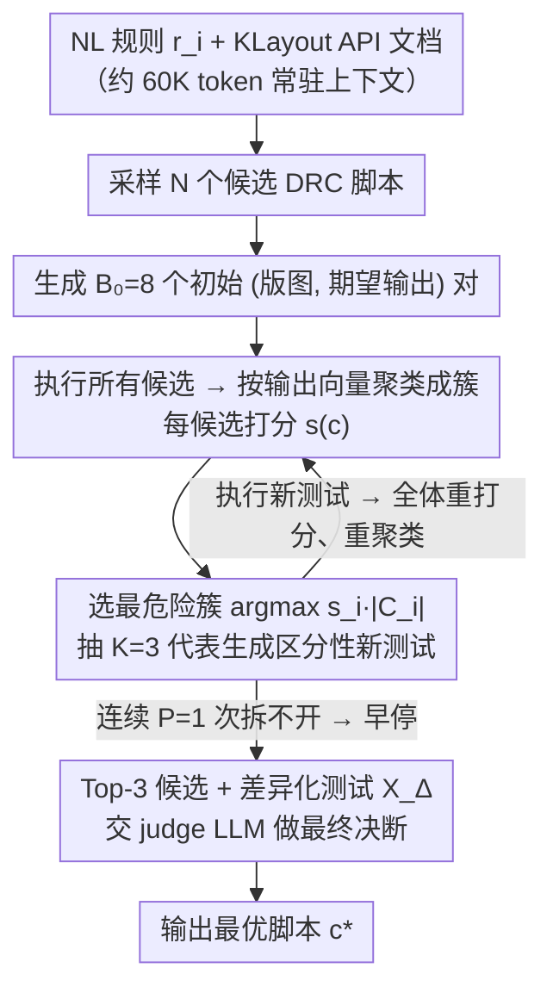

# Rule2DRC: Benchmarking LLM Agents for DRC Script Synthesis with Execution-Guided Test Generation

**会议**: ICML 2026  
**arXiv**: [2605.15669](https://arxiv.org/abs/2605.15669)  
**代码**: https://github.com/snu-mllab/Rule2DRC (有)  
**领域**: LLM Agent / 代码生成 / EDA / 测试生成  
**关键词**: DRC脚本合成, KLayout, Best-of-N选择, 测试驱动聚类, 芯片设计自动化

## 一句话总结
作者构建了 Rule2DRC —— 一个含 1000 条自然语言设计规则、13921 个评测版图的大规模 EDA 基准，通过 KLayout 引擎做执行级别打分而非代码相似度对比，并提出 SplitTester：把 N 个候选 DRC 脚本按"在当前测试下是否输出一致"做聚类，每轮挑「分数 × 簇大小」最大的簇生成新版图把它拆开，最后让 judge LLM 在 Top-3 候选与其差异化测试上选最优。

## 研究背景与动机

**领域现状**：芯片在流片前必须通过数千条几何设计规则（Design Rule Checking, DRC）的约束。每条规则同时以"自然语言（NL）说明 + 可执行 DRC 脚本"两种形式由代工厂发布，DRC 引擎（KLayout、SVRF 等）通过执行脚本判断版图是否违规。最近一波工作开始用 LLM 把 NL 规则翻译成可执行 DRC 脚本，例如基于 BERT 的关键词抽取（DRC-SG）、基于 AST 检索增强的微调（AST-Guided SVRF），以及多模态的 DRC-Coder。

**现有痛点**：作者列举了两类相互独立但都很致命的问题。一类来自基准本身：已有评测集普遍小（DRC-SG 仅 200 条、AST-Guided 74 条、DRC-Coder 7 条），且大多数用「代码相似度」打分。但同一条规则可以用 `separation`、`sized` 加减、`interacting` 等多种 KLayout 语法写出语义等价但字符串完全不同的脚本（论文 Figure 3 给了三种等价写法），导致代码相似度会把正确解判错。另一类来自方法：要么完全不利用 DRC 引擎的执行反馈（DRC-SG、AST-Guided），要么需要把带 ground-truth 违规标签的评测版图喂给 agent 作为输入（DRC-Coder），后者在真实场景中几乎不可能拿到 —— 因为这些标签本身就要靠 ground-truth 脚本或资深工程师人工产生。

**核心矛盾**：DRC 任务天然适合 Best-of-N（BoN）—— 采 N 个候选脚本、用执行结果选最好的那个。但在该领域真正能拉开候选差距的 corner-case 版图很难生成，且模型自己生成的"期望输出标签"也常常出错。已有的选择型 tester agent 在 corner-case 上各有短板：CodeMonkey 先粗暴砍到 Top-3 再造测试，可能在区分性测试出现前就把正确解扔掉；S* 则把新测试的生成焦点放在"已经被区分开的候选"上，对仍然纠缠在一起的高质量候选反而不投入。

**本文目标**：(1) 提供一个足够大、严格按执行结果评分、且不向 agent 暴露评测版图的 benchmark；(2) 设计一个 BoN 选择器，专门针对"目前还无法被任何已有测试区分开"的候选群组生成新测试。

**切入角度**：观察到 LLM 生成测试时的真正瓶颈不是"造的测试不够多"，而是"测试集对当前候选池没有区分力"。如果把当前 N 个候选按"在已有测试上的输出向量"聚类，每个簇内部的脚本在当前测试下完全不可区分；只要不断把最危险的簇（既大、平均分又高）打散，最终留下的差异化测试就足够 judge LLM 决断。

**核心 idea**：用执行级别打分代替代码相似度作为评估指标，用"在不可区分的高分簇上做定向 split"代替"在已区分候选间补测试"作为 BoN 选择策略。

## 方法详解

### 整体框架
这篇论文是"一个 benchmark + 一个 BoN 选择算法"的组合。Benchmark 端（Rule2DRC）把 NL 设计规则→可执行 DRC 脚本这件事，定义成一个对 agent 私有评测版图、只按执行结果打分的任务；算法端（SplitTester）则在采样得到 $N$ 个候选脚本后，自己造测试版图、执行所有候选、把它们聚类，再定向地把最危险的簇拆开，最后让一个 judge LLM 在窄证据集上选出最优脚本。要看懂 SplitTester，关键是先把它工作的输入输出协议想清楚：每个任务是四元组 $\langle r_i, c_i, \{x_{ij}\}_{j=1}^{m_i}, \{\phi(x_{ij}, c_i)\}\rangle$，其中 $r_i$ 是 NL 规则、$c_i$ 是 ground-truth DRC 脚本、$\{x_{ij}\}$ 是该任务的私有评测版图、$\phi(\cdot, \cdot) \in \{0,1\}$ 是 DRC 引擎给出的"是否违规"判定函数；agent $f(\cdot)$ 只看到 NL 规则 $r_i$、KLayout API 文档以及自己生成或调用得到的中间产物，输出脚本 $f(r_i)$。成功率是对所有评测版图都满足 $\phi(x_{ij}, f(r_i)) = \phi(x_{ij}, c_i)$ 的任务比例，错误率是生成脚本编译或运行报错的任务比例。SplitTester 就在"不接触 ground-truth 标签和这批私有评测版图"的前提下，从 $N \in \{10, 15, 20\}$ 个候选 $\mathcal{C} = \{c_1, \dots, c_N\}$ 里挑出 $c^*$。

### 关键设计

**1. Rule2DRC 基准：执行级打分 + 评测版图私有**

针对的痛点是已有 DRC 基准既小又评不准——DRC-SG 仅 200 条、AST-Guided 74 条、DRC-Coder 7 条，且多数用代码相似度判分，而同一条规则用 `separation`、`sized` 加减、`interacting` 能写出语义等价但字符串完全不同的脚本（Figure 3 给了三种等价写法），代码相似度会把这些正确解判错；DRC-Coder 更是把带 ground-truth 标签的评测版图直接喂给 agent，鼓励它过拟合一组固定版图。作者的做法是把规模做大并改判分口径：310 条规则取自真实开源的 SkyWater130 PDK，为覆盖 7nm 以下节点的多层级联约束又用 GPT-5.2 起草、人工逐条复核 490 条多层规则，再补 200 条"专门触发出现次数 <5 的语法构造"的规则以覆盖 KLayout DSL 全谱，合计 1000 个翻译任务 + 13921 个评测版图。每个任务的版图集合里既有"应通过"也有"应违规"的样例，并尽量塞进"违规幅度卡在阈值边缘"的硬负样本。打分用 $\text{SuccessRate}(f) = \frac{1}{n}\sum_i s_i$，$s_i = 1$ 当且仅当 $\forall j: \phi(x_{ij}, f(r_i)) = \phi(x_{ij}, c_i)$，任何代码相似度都不参与。这样"执行级打分 + 评测版图对 agent 私有"是该领域第一次同时落地，既不会把等价写法误判，也不会让 agent 靠看标签作弊。

> ⚠️ GPT-5.2 系模型名以原文为准。

**2. SplitTester：把测试预算定向投到最不可区分的高分大簇**

DRC 任务天然适合 Best-of-N，但真正能拉开候选差距的 corner-case 版图很难生成。已有选择器各有短板：CodeMonkey 先粗暴砍到 Top-3 再造测试，可能在区分性测试出现前就把正确解扔掉；S* 把新测试聚焦在已经被分开的簇之间，对仍纠缠在一起的高质量候选反而不投入。SplitTester 的观察是——瓶颈不是测试造得不够多，而是测试集对当前候选池没有区分力。于是它先让 LLM 生成 $B_0$ 个初始 (版图, 期望输出) 对，执行所有候选后按"输出向量是否完全相同"把候选聚成簇 $\{C_i\}$，每个候选打分 $s(c) = \frac{1}{|T|}\sum_{(x,\phi^*) \in T} \mathbb{1}[\phi(x, c) = \phi^*]$，即它在所有测试上与期望输出一致的比例。随后迭代：每轮挑

$$i^* = \arg\max_i s_i |C_i|$$

这个"既高分又大"的簇，从中随机抽 $K{=}3$ 个代表喂给 test generator，专门生成能让这 3 个代表行为分化的新测试；执行新测试 → 加进 $T$ → 全体重打分并重聚类 → 继续。之所以盯着 $s_i |C_i|$ 最大的簇：$s_i$ 大说明这个簇大概率是正确解扎堆的地方，$|C_i|$ 大说明簇内混入错解的可能性更高，把测试预算投到这里能让每条新测试的边际信息量最大化。$K = 3$ 是为了控制 prompt 长度，整簇都塞给 test generator 反而分散注意力。若连续 $P{=}1$ 次没能把目标簇拆开就早停，避免在生成不出区分版图的卡点上空耗预算。

**3. 期望标签 + 最终 judge LLM 的两阶段决断，外加 API 文档常驻上下文**

前一步用来打分聚类的"期望输出"$\phi^*(x)$ 是 LLM 自己生成的，本身可能有噪声，直接按分数取 Top-1 不稳。SplitTester 的处理是把决断拆成两阶段：全程用期望标签提供持续的打分信号让聚类有方向，但最终判决不取分数最高者，而是把 Top-3 候选 + 它们之间真正存在差异的那部分测试

$$X_\Delta = \{x : \exists c_a, c_b \in C_3, \phi(x, c_a) \neq \phi(x, c_b)\}$$

一起喂给 judge LLM，让它在更窄、更有针对性的证据集上做最后选择。消融显示两者互补且都有效：去掉 final judge 成功率从 58.0% 掉到 55.5%，去掉期望标签掉到 57.1%——judge LLM 抵御期望标签的噪声，期望标签给聚类提供方向。此外作者把 KLayout 官网爬下来预处理成约 60K token 的 API 文档塞进所有 LLM 调用的上下文，单这一项就让 GPT-OSS-120B 的 pass@1 提升 20+ 百分点、pass@20 提升 40+ 百分点——等于承认 DRC DSL 太小众、纯参数化记忆靠不住，必须把权威语法手册当工具书放在手边。

### 损失函数 / 训练策略
本工作不涉及训练，所有 LLM 都直接调用现成 checkpoint（Qwen3-30B-A3B-Instruct-2507、GPT-OSS-20B、GPT-OSS-120B，后两者推理 effort 设为 medium）。SplitTester 没有可学习参数，超参为初始测试预算 $B_0 = 8$、追加预算 $B = 8$、簇代表数 $K = 3$、早停阈值 $P = 1$。

## 实验关键数据

### 主实验
基准为 Rule2DRC 全 1000 任务，BoN-N 表示从 $N$ 个候选中选 1 个，所有结果三次平均。

| 模型 | 设置 | LLM-as-Judge | Generated Tests (8) | CodeMonkey | SplitTester (本文) | Oracle@N |
|------|------|--------------|---------------------|------------|---------------------|----------|
| GPT-OSS-120B | BoN-10 成功率 | 37.6 | 54.5 | 56.9 | **58.0** | 63.0 |
| GPT-OSS-120B | BoN-20 成功率 | 37.6 | 59.4 | 62.7 | **63.8** | 72.1 |
| GPT-OSS-20B | BoN-20 成功率 | 28.0 | 39.0 | 41.1 | **44.4** | 53.8 |
| GPT-OSS-20B | BoN-20 错误率 | 54.9 | 14.0 | 14.1 | **12.6** | 11.6 |
| Qwen3-30B-A3B | BoN-20 成功率 | 16.0 | 17.3 | 17.2 | **18.0** | 23.7 |
| Qwen3-30B-A3B | BoN-20 错误率 | 65.2 | 38.5 | 38.6 | **35.1** | 29.5 |

GPT-OSS-120B 单次采样的 baseline 是 32.5% 成功率，加 BoN-20 + SplitTester 直接拉到 63.8%。在 GPT-OSS-20B 上对 CodeMonkey 拿到了最大的 +3.3pp 绝对提升。

### 消融实验（GPT-OSS-120B，BoN-10）
| 配置 | 成功率 (%) | 错误率 (%) | 说明 |
|------|-----------|-----------|------|
| SplitTester 全配置 | **58.0** | 9.1 | 完整方法 |
| - 去掉 final judge LLM | 55.5 | 9.1 | 仅靠分数取 Top-1 → 掉 2.5pp |
| - 去掉期望标签 | 57.1 | 9.1 | 用 Top-3 簇轮询代替分数 → 掉 0.9pp |
| - 仅保留 Top-3 候选池 | 57.4 | 9.1 | 类 CodeMonkey 但用 SplitTester 的测试生成 → 掉 0.6pp |
| Sample-1 (单次采样) | 32.5 | 48.5 | 不做 BoN |
| Oracle@10 | 63.0 | 8.5 | BoN-10 的理论上限 |

### 关键发现
- **上下文工程一次性吃掉一大块红利**：把 60K token 的 KLayout API 文档塞进 prompt，GPT-OSS-120B 的 pass@1 提升 20+ 百分点、pass@20 提升 40+ 百分点，远超后续任何 BoN 算法收益。说明 DRC DSL 这种长尾语法，必须把权威手册当外部记忆。
- **「保留全候选池」比「砍到 Top-3」重要**：消融中只用 Top-3 候选的变体掉 0.6pp，说明 CodeMonkey 早期粗砍策略确实会丢掉"现在看起来弱、但在新测试下会脱颖而出"的正确解。
- **期望标签和 judge LLM 互补**：单去掉任一项都掉点（-0.9 / -2.5pp），但 judge LLM 贡献更大。这暗示 LLM 自生成的期望标签噪声不可忽视，需要由另一个 LLM 在窄证据集上"复核"。
- **Pareto 前沿优势随模型规模收敛**：在 GPT-OSS-120B 上 SplitTester 对 CodeMonkey 只赢 1.1pp，错误率几乎打平；越强的模型留给 selection 算法的空间越小，但 oracle 上限（72.1%）说明 BoN 选择本身远未饱和。

## 亮点与洞察
- **「在不可区分簇上 split」是个干净的目标函数**：$\arg\max_i s_i |C_i|$ 同时编码"这个簇大概率是正确解扎堆的高分簇"和"这个簇里候选多、所以混入错解的可能性也大"，把 BoN 选择中"在哪里花测试预算"的问题转成一个非常具体的 cluster 选择问题。这个套路可以迁到任何「候选输出可枚举聚类」的 code selection 场景。
- **执行级评测 + 私有评测版图**是该领域第一次成立的协议组合：它一刀切掉了 DRC-Coder 那种"把标签喂给 agent 反过来导致过拟合"的隐患，把整个 task 拉到真实工程师的工作设置（你只有 NL 规则，自己写脚本）。
- **早停参数 $P$ 的小细节很值钱**：作者发现当 test generator 连续 $P$ 次拆不开目标簇时，继续硬刚反而浪费预算 —— 这是个非常工程化的观察，让方法在 cost 维度也站上 Pareto 前沿。
- **API 文档 = 工具书**这一招提醒大家：很多"模型不会写"的领域不是能力问题而是知识问题，把 60K token 文档塞进 context 比任何 prompt trick 都有效。

## 局限与展望
- 仅评测了 KLayout 一种 DRC 引擎与 DSL，工业界主流的 Calibre SVRF 没有跑通；但 SkyWater130 是开源 PDK，这是版权/工具链共同决定的现实约束，迁移到 SVRF 需要重新做基准与上下文文档。
- 490 条多层级联规则与 200 条语法补足规则由 GPT-5.2 起草、人工复核，意味着 benchmark 分布本身可能带有 GPT 起草的"系统偏差"，对该类 LLM 在生成阶段就有隐式利好。
- SplitTester 没有 code-edit 阶段（CodeMonkey 与 DRC-Coder 都有），所有提升都来自更聪明的"选"而不是"改"。把 split 信号反过来引导候选脚本的修正（例如把目标簇拆出来的差异化测试当作 next-iteration 的 critique）应该能再吃一段红利。
- 对最强的 GPT-OSS-120B，错误率几乎被任何 BoN 方法拍平到 4–9%，意味着剩下的失败大多是"全部 N 个候选都错且都报同样的错"这种 hard case，单靠 selection 解决不了，需要从 sampler 端做 diversity 或调用工具自修。

## 相关工作与启发
- **vs DRC-SG / AST-Guided SVRF (Zhu et al. 2022/2023; Abdelmalak et al. 2025)**：他们用 BERT 抽取关键词或 AST 检索做一阶段翻译，完全不用执行反馈，且评估靠代码相似度。本文证明执行级评测能反推出他们的代码相似度评分会高估正确率，并且把 selection 推到 LLM agent 框架。
- **vs DRC-Coder (Chang et al. 2025)**：他们用 VLM + LLM 框架，但要求把标注好违规的评测版图作为 agent 输入，本质是"用标签训练/蒸馏"。本文则严格规定 agent 看不到评测版图，逼出真正的 NL→脚本翻译能力。
- **vs CodeMonkey (Ehrlich et al. 2025)**：CodeMonkey 在 selection 阶段先砍到 Top-3 再迭代编辑单个测试，本文用全候选池 + 簇级 split 替代，证明粗砍会丢正确解。
- **vs S\* (Li et al. 2025)**：S\* 把新测试焦点放在已被区分开的簇之间，本文反其道而行 —— 把焦点放在还没被区分的高分大簇上，把每条测试的边际信息量最大化。
- **vs CodeT (Chen et al. 2023) / Dynamic Scaling (Ma et al. 2025)**：CodeT 用"正确性 + 一致性"双信号做 reranking，Dynamic Scaling 研究 unit-test 数量与性能的 scaling；本文把这条线推到"测试生成本身要带方向"，而方向由当前候选池的聚类拓扑决定。

## 评分
- 新颖性: ⭐⭐⭐⭐ 「在不可区分簇上 split」的 BoN 选择策略，把 cluster topology 当作测试生成的导航信号，是干净的新设计；benchmark 端则是第一次把执行级评测 + 私有版图同时落地到 DRC 领域。
- 实验充分度: ⭐⭐⭐⭐ 三个模型、三个 BoN 规模、四个强基线、Pareto 成本曲线、三项消融、Oracle 上限都给齐，唯一可惜的是没在工业 SVRF 引擎复现。
- 写作质量: ⭐⭐⭐⭐ 问题动机一路顺下来，Algorithm 1 写得清楚，Figure 3 用三种等价写法直观说服读者"代码相似度评估不可信"。
- 价值: ⭐⭐⭐⭐ 给 EDA × LLM 这个具体方向铺了真正能跑、能复现、能 push SOTA 的开源基准，对落地芯片厂的 DRC 自动化有直接意义；SplitTester 的思想也能迁到任何"候选执行输出可聚类"的 code selection 任务。

<!-- RELATED:START -->

## 相关论文

- [\[ICML 2026\] Recovering Policy-Induced Errors: Benchmarking and Trajectory Synthesis for Robust GUI Agents](recovering_policy-induced_errors_benchmarking_and_trajectory_synthesis_for_robus.md)
- [\[ICLR 2026\] The Tool Decathlon: Benchmarking Language Agents for Diverse, Realistic, and Long-Horizon Task Execution](../../ICLR2026/llm_agent/the_tool_decathlon_benchmarking_language_agents_for_diverse_realistic_and_long-h.md)
- [\[ACL 2025\] METAL: A Multi-Agent Framework for Chart Generation with Test-Time Scaling](../../ACL2025/llm_agent/metal_a_multi-agent_framework_for_chart_generation_with_test-time_scaling.md)
- [\[ICML 2026\] Towards Feedback-to-Plan Decisions for Self-Evolving LLM Agents in CUDA Kernel Generation](towards_feedback-to-plan_decisions_for_self-evolving_llm_agents_in_cuda_kernel_g.md)
- [\[ICML 2026\] Scaling, Benchmarking, and Reasoning of Vision-Language Agents for Mobile GUI Navigation](scaling_benchmarking_and_reasoning_of_vision-language_agents_for_mobile_gui_navi.md)

<!-- RELATED:END -->
