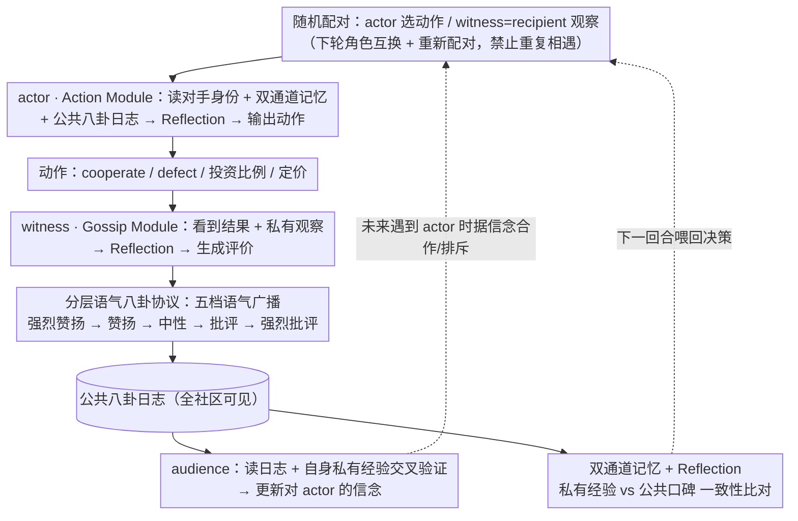

# Talk, Judge, Cooperate: Gossip-Driven Indirect Reciprocity in Self-Interested LLM Agents

**会议**: ICML 2026  
**arXiv**: [2602.07777](https://arxiv.org/abs/2602.07777)  
**代码**: https://github.com/shuhui-zhu/ALIGN  
**领域**: 多智能体 / LLM Agent / 合作博弈  
**关键词**: 间接互惠, 八卦协议, 多智能体合作, 声誉机制, 自利 LLM

## 一句话总结
本文提出 ALIGN，让一群完全自利、去中心化的 LLM 智能体通过五档语气的公开"八卦"消息互相评价、形成声誉、惩罚背叛，从而在无中心监管的捐赠博弈、投资博弈和电商市场中稳定地建立间接互惠合作，并发现推理型 LLM 比 chat 型 LLM 更能按博弈论激励"该合作时才合作"。

## 研究背景与动机

**领域现状**：随着 LLM agent 被大规模部署，多 agent 之间在混合动机（mixed-motive）场景下的合作问题成为 AI 安全焦点。经典博弈论用直接互惠（Tit-for-Tat）和间接互惠（image score、leading-eight norms）来解释合作的涌现，但这些方案假定固定规范和**中心化**的声誉监控。

**现有痛点**：把这些机制搬到 LLM 上时，要么需要人为植入"利他"种子 agent（Ren et al., 2025），要么假设所有 agent 都能直接看到他人完整历史（Vallinder & Hughes, 2024）。一旦回到真正去中心化、自利、无重复配对的设定，agent 既看不到他人行为也不能在未来从同一对手处获得回报，**直接互惠失效**，自利推理直接推导出"全员背叛"是唯一子博弈完美均衡。

**核心矛盾**：要让自利 agent 合作，必须有声誉系统；但去中心化系统里没有任何 agent 能担任"中心权威"，传统 image score 也只能传递二元标签，缺少规范语境和对抗噪声/谎言的能力。

**本文目标**：在不引入利他先验、不假设中心化监控的前提下，回答两个问题——(1) 公开八卦能否在理论上支撑间接互惠均衡？(2) 完全自利的 LLM agent 在实践中能否真的利用八卦达成合作，而不是退化到全员背叛？

**切入角度**：作者从人类社会学观察入手——人类靠语言"八卦"（gossip）维持合作、执行规范，且负面口碑本身就是一种"零成本的口头惩罚"。如果让 LLM agent 之间也允许这种开放式、带情感色彩的评价广播，理论上可以构造一个**不完美公开监控**（imperfect public monitoring）模型，把"接收者向公众广播对捐赠者的评价"作为公共信号。

**核心 idea**：用"分层语气的开放式八卦协议 + 自利 LLM 的推理能力"替代静态二元声誉评分，让 agent 通过自己阅读公共八卦日志来推断他人是否值得合作，并把合作/背叛的长期收益自行算清楚。

## 方法详解

### 整体框架
ALIGN 想解决的核心问题是：一群完全自利、彼此不会重复相遇的 LLM agent，在没有任何中心权威的去中心化环境里，能否仅靠互相"说闲话"建立起合作。它的做法是把每一回合的互动拆成三种信息可见性各异的角色——**actor** 选动作，只有与它直接交互的 **witness** 看得到结果，其余所有 **audience** 都看不到 actor 行为；witness 用 LLM 生成一段带语气的公开八卦广播给整个社区，所有人把消息累积进一份公共八卦日志。后续轮次每个 agent 拿到对手身份后，就综合"自己私有的互动记忆 + 公共八卦日志"自行决定合作还是背叛。整个框架不依赖任何中心评估器，也不注入"应该利他"的先验，只给一句话目标"最大化你自己的长期累计收益"，剩下的合作是否涌现完全交给 LLM 自己算。

每个 agent 内部由两个并列的 LLM 模块构成（图 3）：作为 witness 时调用 **Gossip Module**，输入私有观察 + 公共八卦日志 + 经验记忆，输出一段落在五档语气之一的评价文本；作为 actor 时调用 **Action Module**，输入对方身份、私有记忆、公共八卦日志和可选的均衡先验（默认关闭，5.3 节消融），输出当前动作（cooperate / defect、投资比例、商品定价等）。两个模块产出前都额外做一步 reflection（见关键设计 3）。理论侧（第 3 节）作者用重复捐赠博弈（Definition 3.1）刻画问题：两 agent 随机配对，donor 付代价 $c$ 让 recipient 得收益 $b>c$，下一轮强制角色互换再随机重配，任意一对 agent 不会反复相遇，**直接互惠被刻意禁用**。在此之上证明：有限期、以及无限期+私有监控下唯一 SPE 都是全员背叛；无限期+完美公开监控下只要折扣因子 $\gamma \geq c/b$，"对未背叛者合作、对背叛者惩罚"的条件策略就构成 SPE。关键的命题 3.5 把这一结论扩展到**只有 recipient 广播一条公开消息**的不完美监控：$\gamma \geq c/b$ 时合作 SPE 仍存在，但"全员背叛"也仍是 SPE——理论只保证合作"可能"，到底落到哪个均衡就看 LLM 的推理能力。

### 关键设计

**1. 分层语气八卦协议：把惩罚信号编码进 LLM 听得懂的自然语言**

前面理论说二元公开信号已足够支撑合作均衡，但真把经典 image score 那种 $\{+1, -1\}$ 标签丢给 LLM，它缺少规范语境、也分不清噪声和谎言。ALIGN 的做法是要求 witness 的广播必须落在五档离散语气之一——强烈赞扬 → 赞扬 → 中性 → 批评 → 强烈批评（图 4）——但具体措辞由 LLM 自由生成。这样一条八卦一次性编码了"动作信息 + witness 的规范判断 + 情感强度"三层信号：负面语气在没有任何执法机构的前提下天然成了"低成本口头惩罚"，一个 agent 一旦预期会被打上强烈批评，就会预期未来被社区排斥（ostracism），从而把背叛的感知成本顶上去，把博弈论里抽象的"惩罚阶段"具象成自然语言压力。它有效的直接证据来自消融（5.3 节）：把协议退化成二元信号、又不告诉 agent"1 表示好、0 表示坏"的约定时，多数 LLM 合作率断崖下跌；即便补上约定，仍明显低于完整 ALIGN——说明分层语气提供的规范语境本身是合作能否稳住的关键。

**2. 三角色去中心化决策流程：用信息削弱换来对谎言的抗性**

相比"完美公开监控"基线那种人人可见完整历史的设定，三角色结构（actor 选动作、witness 私下看到并广播、audience 只能读公共日志）严格削弱了信息——连 actor 自己也只能透过别人的八卦反推社区共识，没有任何 agent 拥有上帝视角。这恰恰是它的价值：audience 在未来遇到某 actor 时，必须拿"自己有限的私有经验"和"公共八卦"做交叉验证，于是一条被多份亲身经历反驳的恶意八卦会被理性 agent 自动折扣掉，ALIGN 因此对**单点谎言**天然有抗性（5.2 节抗串谋实验里互吹的 collusive 攻击者最终被识破）。同时把 witness 设成**接收者本人**也有讲究——被坑的人最有动机如实报告，这正契合命题 3.5 里"recipient 广播信号"的理论设定，也才逼真还原了电商平台、自治社区这类没有中心声誉值的去中心化生态。

**3. 私有经验 + 公共八卦双通道记忆 + Reflection 自适应：在不微调的前提下内化长程权衡**

agent 不能 fine-tune，要让它把 $\gamma \geq c/b$ 这种"为长期收益忍下当下代价"的贴现权衡真正算进去，就得给它一个能反复消化历史、并写下推理过程的载体。ALIGN 给每个 agent 维护两条独立滚动记忆：自己经历过的回合（对方身份、动作、收益）和公共八卦日志（谁用什么语气评价了谁）。双通道让 agent 能把外部口碑和亲身经历做一致性比对——"对方公共评价良好但自己被它背叛过"时会调低对公共评价的权重，"自己没接触过但公共日志一致批评"时则提前防备。每轮决策前还插一步 reflection：让 LLM 先写一段"我观察到 X、对方过去被 Y 评价过、所以我应该 Z"，结果存回记忆，等价于让它在线学策略而无须梯度更新——5.1.2 节对比合作型与背叛型 agent 的反思文本，发现前者明确提到"声誉 / 信任 / 长期收益"，后者只算单步收益。消融（Appendix D.8）显示去掉 reflection 后较弱模型掉点明显、强推理模型几乎不变，说明它是个"补差"机制而非主驱动。

### 一个完整示例
以一轮捐赠博弈走一遍：agent A 被随机配为 donor、B 为 recipient。A 调用 Action Module，读到公共日志里"B 上一轮当 donor 时被打了强烈批评"，于是反思"B 名声差、合作未必有回报"后选择 defect，B 没拿到收益。此时 B 作为 witness 调用 Gossip Module，结合自己刚被坑的私有观察，广播一条"批评 A：在我守规矩时却背叛我"的负面八卦，全社区把它写进公共日志。下一轮 A 当 recipient 遇到 agent C，C 读日志看到 A 被批评，又比对自己没和 A 直接交手过，便倾向不合作——A 的一次背叛通过八卦传播变成了后续多轮的集体冷遇。这正是图 8 里 always-defect greedy agent 合作率随交互次数被压到接近 0 的微观机制；而若 B 是恶意攻击者乱发批评，其他 agent 会用各自的私有经验把这条孤立差评折扣掉，攻击因此失效。

### 损失函数 / 训练策略
**完全不训练**。所有 LLM 用现成权重、温度 0、固定 prompt，仅靠上下文中的记忆与八卦日志做策略选择。每个场景跑 5 个随机种子取均值方差，默认折扣因子 $\gamma = 0.99$。

## 实验关键数据

### 主实验

无限期捐赠博弈下，**无八卦** vs **ALIGN 八卦**的对比（指标：合作率 / 折扣回报，节选 Table 1 + Table 2）：

| 模型 | 类型 | 无八卦 合作率 | ALIGN 合作率 | 无八卦 折扣回报 | ALIGN 折扣回报 |
|------|------|--------------|--------------|------------------|------------------|
| DeepSeek-V3.1 Chat | Chat | 0.00 | 0.94 | 0.00 | 14.40 |
| GPT-4o Mini | Chat | 0.36 | 0.99 | 5.55 | 15.23 |
| Gemini 2.5 Flash-Lite | Chat | 0.08 | 0.60 | 1.32 | 9.32 |
| LLaMA 4 Maverick | Chat | 0.00 | 0.94 | 0.00 | 14.45 |
| DeepSeek-V3.1 Reasoner | Reasoning | 0.00 | **1.00** | 0.00 | **15.44** |
| o4-mini | Reasoning | 0.00 | 0.98 | 0.00 | 15.11 |
| Qwen3-235B-Instruct | Reasoning | 0.00 | 0.69 | 0.00 | 10.71 |
| Kimi-K2-Instruct | Reasoning | 0.00 | 0.73 | 0.00 | 11.21 |

关键观察：所有推理型 LLM 在无八卦时合作率 = 0（精确踩中 SPE 预测），加入 ALIGN 后跃升到 0.69–1.00；DeepSeek-V3.1 Reasoner 达到 100% 合作 + 0 Gini，是全场最理性也最合作的样本。Chat 模型如 GPT-4o Mini 即便没八卦也会"非理性合作"（0.36），加上 ALIGN 后继续涨到 0.99。

### 消融实验

| 配置 | 关键指标变化 | 说明 |
|------|--------------|------|
| Full ALIGN | 合作率 0.69–1.00 | 五档语气 + reflection + 双记忆 |
| 八卦退化为二元信号（无约定） | 合作率显著下跌 | 多数 LLM 不再能稳定合作（图 14） |
| 二元信号 + 显式"1 好 0 坏"约定 | 合作率部分回升但仍低于 ALIGN | 二元标签缺少规范语境 |
| 去掉 reflection 记忆（D.8） | 弱模型掉点明显，强推理模型基本不变 | reflection 是补差机制 |
| 去掉 equilibrium 先验（D.7） | 影响有限 | 强模型自己能推出 $\gamma \geq c/b$ |
| 引入 always-defect greedy agent | ALIGN 对其合作率随交互次数下降至接近 0 | 负面八卦传播 → 集体排斥（图 8） |
| 引入 2 个串谋互吹的恶意 agent | 多数 LLM 对其平均收益仍正向（图 9） | 理性 agent 用私有经验交叉验证，折扣假评价 |

### 关键发现
- **推理 ≠ 不合作**：与 Piedrahita et al. (2025) "更强推理导致更少合作"的结论相反，本文发现推理型 LLM 在 ALIGN 下反而更接近博弈论最优——它们会在该背叛时（有限期、低 $\gamma$）干净利落地背叛，在该合作时（无限期、$\gamma \geq c/b$ 且有八卦）则坚定合作；chat 模型反而经常"非理性过度合作"，把短期收益让出去。
- **折扣因子 $\gamma$ 的敏感性**：图 7 显示推理模型的合作率随 $\gamma$ 平滑提升，反思文本中显式出现"discount factor"的推理；chat 模型的合作率与 $\gamma$ 几乎无关——它们其实没在算长程收益。
- **语气分布出卖背叛动机**：图 5 表明所有 LLM 都倾向赞扬合作；但面对背叛时，推理模型主要给"批评 / 强烈批评"，chat 模型则倾向中性评论，这解释了为什么 chat 模型对欺诈攻击的威慑力较弱。

## 亮点与洞察
- **把"语气"当一等公民**：以前 LLM-agent 合作研究要么用数值 reward，要么用二元 cooperate/defect 标签，本文把"五档语气"硬编码进协议，让 LLM 把自己擅长的"措辞强度"变成博弈论里的惩罚信号，是一种很巧妙的能力对齐。
- **理论与实证的双向校验**：作者先在不完美公开监控下证明合作均衡存在但全员背叛也存在（命题 3.5），然后实证表明"哪个均衡被选中"恰好由 LLM 的推理强度决定，把理论上的多均衡问题转成"模型能力问题"，给后续研究开了一扇门。
- **可迁移设计**：分层语气 + 双通道记忆 + reflection 这套模板可以直接搬到任何"多 agent 协调 + 没有中心评估器"的场景，例如分布式 RAG、AutoGen 风格的多 agent 编程、电商评价网络等；只要把语气词表换成场景相关的评价维度即可。

## 局限与展望
- **作者承认的局限**：仿真环境与真实部署差距大；公开八卦可能引发隐私、回音室和恶意诋毁问题；ALIGN 在弱推理模型上仍会出现合作崩溃和谎言报告（Appendix D.9）。
- **自己看到的局限**：(1) 所有实验温度 0 + 5 个种子，统计效力较弱，标准误经常高于均值差异；(2) 没有评估"prompt 注入式攻击"——如果攻击者直接在八卦消息里注入指令而非简单串谋互吹，cross-validation 是否依然奏效未知；(3) 八卦日志长度上限和 LLM 上下文窗口的关系没有讨论，长程社区中日志爆炸如何处理是个开放问题。
- **改进思路**：把八卦语气从 5 档扩成连续标量（confidence-weighted gossip）；引入"八卦的八卦"（meta-gossip）评估广播者本身的可信度；用强化学习 fine-tune 一个专门的 gossip module，看能否让弱模型也达到强推理模型的均衡选择能力。

## 相关工作与启发
- **vs Ren et al. (2025)**：他们在 LLM 群体中**注入利他 agent**作为合作种子，本文坚持全员自利，更接近"无监督"涌现合作。
- **vs Vallinder & Hughes (2024)**：他们假设**中心化的完美历史可见**，本文严格只允许不完美公开监控，与真实去中心化网络更契合。
- **vs 经典 leading-eight norms (Ohtsuki & Iwasa, 2006)**：经典工作给出静态规则，本文用 LLM 自适应生成规范并通过自然语言传播，可跨任务（matrix game / 投资 / 电商）泛化。
- **vs Generative Agents (Park et al., 2023)**：Park 等用 LLM agent 模拟社区行为但不研究博弈均衡，本文把社会学涌现现象与博弈论命题挂钩。

## 评分
- 新颖性: ⭐⭐⭐⭐⭐ 把分层语气八卦协议引入 LLM 多 agent 博弈，首次系统验证"完全自利 LLM + 不完美公开监控 → 间接互惠"的可行性。
- 实验充分度: ⭐⭐⭐⭐ 8 个 LLM × 4 个 testbed + 抗恶意 + 抗谎言 + 多组消融，但每组只 5 个种子，统计稳健性略弱。
- 写作质量: ⭐⭐⭐⭐ 理论命题与实证结果之间的对照非常清晰，附录组织也好，主文偶有公式与图表布局不直观。
- 价值: ⭐⭐⭐⭐⭐ 给"如何让 LLM agent 在去中心化生态中维持社会福利"提供了可复用的实证 + 理论基线，对 AI 安全与多 agent 系统设计有直接指导意义。

<!-- RELATED:START -->

## 相关论文

- [\[ICML 2026\] EvolveR: Self-Evolving LLM Agents through an Experience-Driven Lifecycle](evolver_self-evolving_llm_agents_through_an_experience-driven_lifecycle.md)
- [\[ICML 2026\] On Information Self-Locking in Reinforcement Learning for Active Reasoning of LLM Agents](on_information_self-locking_in_reinforcement_learning_for_active_reasoning_of_ll.md)
- [\[ICML 2026\] Towards Feedback-to-Plan Decisions for Self-Evolving LLM Agents in CUDA Kernel Generation](towards_feedback-to-plan_decisions_for_self-evolving_llm_agents_in_cuda_kernel_g.md)
- [\[ICLR 2026\] Judge Reliability Harness: Stress Testing the Reliability of LLM Judges](../../ICLR2026/llm_agent/judge_reliability_harness_stress_testing_the_reliability_of_llm_judges.md)
- [\[ICML 2026\] SE-GA: Memory-Augmented Self-Evolution for GUI Agents](se-ga_memory-augmented_self-evolution_for_gui_agents.md)

<!-- RELATED:END -->
