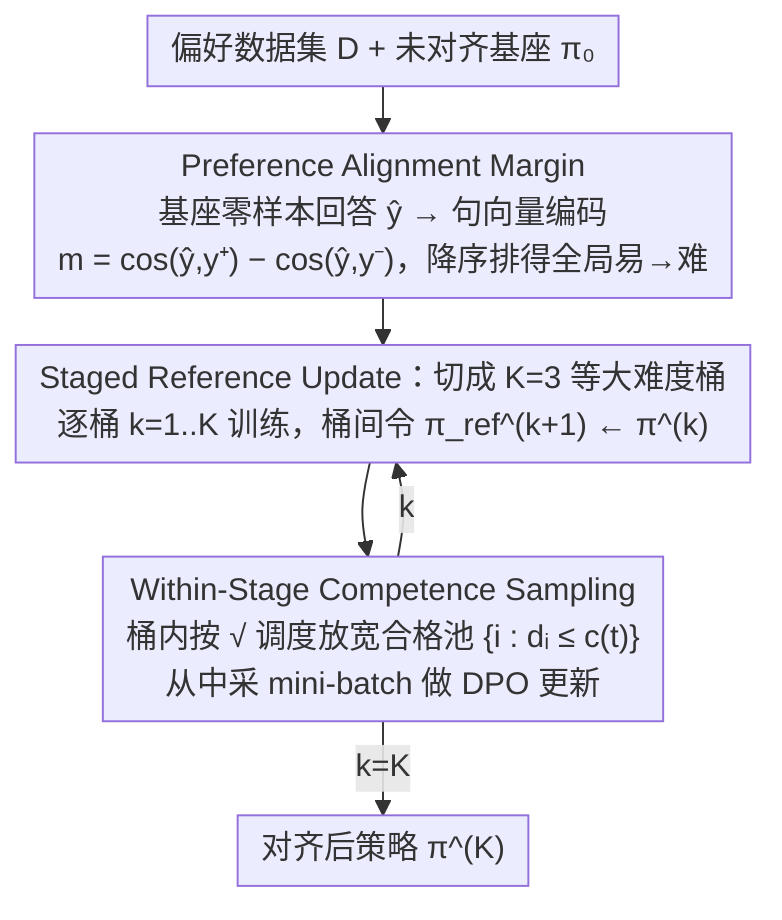

# Curriculum Learning for Safety Alignment

**会议**: ICML 2026  
**arXiv**: [2605.26315](https://arxiv.org/abs/2605.26315)  
**代码**: https://github.com/Sandeep5500/curriculum-learning-for-safety  
**领域**: 对齐RLHF / LLM安全  
**关键词**: DPO、安全对齐、课程学习、OOD 鲁棒性、越狱攻击

## 一句话总结
本文提出 Staged-Competence —— 一个把"模型自身的偏好对齐 margin"作为难度分、再用"分阶段更新参考模型 + 阶段内 competence-based 采样"双重课程的 DPO 安全对齐框架，在三种 8B 量级 LLM 上把 OOD 有害回答率平均降 16%、越狱攻击成功率降 20%，同时几乎不损伤通用能力与不引入过度拒答。

## 研究背景与动机

**领域现状**：当前 LLM 安全对齐的主流路线是用 DPO 在「安全/不安全」偏好对 $(x, y^+, y^-)$ 上微调，免去训练奖励模型的代价。

**现有痛点**：DPO 安全对齐被多篇工作证明是"浅表"的——安全行为基本集中在回复的前几个 token，prefill / GCG 这类越狱攻击只要绕过开头就能让模型继续输出有害内容；对分布外 (OOD) 的有害 prompt 也泛化很差。

**核心矛盾**：标准 DPO 把所有偏好对当作同等难度随机采样，但偏好对的"难度"不是语言学层面的复杂度，而取决于**未对齐的基座模型本身**有多大程度上已经能区分安全/不安全回答；忽略这种模型相关的难度差，就把宝贵的梯度信号都浪费在"模型本来就分得清"的简单样本上。

**本文目标**：(1) 设计一个模型相关的、可全局比较的难度分；(2) 设计一个在 DPO 框架内能把这个难度真正用起来的训练算法；(3) 在不改 DPO loss、不引入新超参家族的前提下显著提升 OOD 与越狱鲁棒性。

**切入角度**：作者借用课程学习 (Bengio 2009) 的"先易后难"思想，但发现已有的两条线各有缺陷——competence-based curriculum (Sqrt-Competence) 只有一个阶段、参考模型从不更新；Curri-DPO 虽然更新参考模型，但每个阶段内退化成随机洗牌，浪费了课程顺序。两者应该被融合而不是二选一。

**核心 idea**：用"基座模型的零样本回答嵌入到 $y^+$ 与到 $y^-$ 的余弦相似度之差"作为全局难度分，把数据排序后切成 $K=3$ 桶，桶之间更新参考模型 $\pi_\text{ref}$、桶内用 $\sqrt{\cdot}$ competence 调度逐步放宽样本池——课程在"宏观分阶段"和"微观分步"两个尺度同时发力。

## 方法详解

### 整体框架
Staged-Competence 是一个套在标准 DPO 外层的两阶段 pipeline，全程不碰 DPO loss 本身，只改"用哪些样本、按什么顺序喂、参考模型怎么变"。第一阶段 (Scoring) 先用待对齐的基座模型 $\pi_0$ 给每条 prompt 生成零样本回答 $\hat y_i$，再用轻量句向量编码器 (all-MiniLM-L6-v2) 把 $\hat y_i, y_i^+, y_i^-$ 编码后算出一个全局难度分，据此把整个数据集从易到难排序。第二阶段 (Training) 把排序后的数据均匀切成 $K=3$ 个难度递增的桶 $\mathcal B_1, \mathcal B_2, \mathcal B_3$ 依次训练：桶内不是随机洗牌，而是按 competence 函数动态放宽可采样的样本池；每个桶训完，本阶段的策略 $\pi^{(k)}$ 直接接棒成为下阶段的参考模型。整条流水线输入偏好数据集 $\mathcal D = \{(x_i, y_i^+, y_i^-)\}$ 与未对齐基座 $\pi_0$，输出对齐后的策略 $\pi^{(K)}$。

### 关键设计

**1. Preference Alignment Margin：把难度做成全数据集可比的标量**

标准 DPO 把所有偏好对当同等难度随机采样，问题是偏好对的"难"不是语言复杂度，而取决于基座本身已经多大程度上分得清安全/不安全。本文用一个很便宜的办法把这件事量化：先让未对齐的基座对 prompt $x_i$ 输出零样本回答 $\hat y_i$，再用句向量编码器算 $m_i = \cos(e_{\hat y_i}, e_{y_i^+}) - \cos(e_{\hat y_i}, e_{y_i^-})$——$m_i$ 越大说明基座的自发回答本来就更靠近安全答，是"简单样本"，反之是模型还分不清的难样本，降序排列就得到全局课程顺序。关键在于这个 margin 让**任意两条偏好对**都能直接比大小，而 Curri-DPO 那种"每个 prompt 内 4 个候选回答的成对质量差"只能在 prompt 内部局部排序、跨 prompt 没法比；正是这个全局可比性，才让源自机器翻译的 competence-based 采样能搬到 DPO 上来，而且全程只需一个小 sentence encoder + 一次零样本生成，不依赖外部 GPT-4 judge 打分。

**2. Staged Reference Update：让参考模型跟着课程一起进化**

固定参考模型的标准 DPO 有个隐患：训到后期，梯度会被那些"模型早就学会的简单对"反复稀释，难样本得不到足够信号。本文把全局排序后的数据切成 $K=3$ 个等大桶，第 $k$ 阶段用参考模型 $\pi_\text{ref}^{(k)}$ 在桶 $\mathcal B_k$ 上跑 $E$ 个 epoch 的 DPO，跑完就令 $\pi_\text{ref}^{(k+1)} \leftarrow \pi^{(k)}$——参考模型不再是钉死的基座，而是沿课程逐级往前挪，每个阶段都"以上一阶段的成果为锚"重新定义什么算进步，避免回头重学简单样本。这套递推参考的有效性在 reward margin 曲线上看得很直接：每次切换阶段、更新参考的那一刻，margin 都出现明显跳变 (Fig. 2)，说明每次更新都给优化注入了一批新的有效梯度。

**3. Within-Stage Competence Sampling：桶内也按 $\sqrt{\cdot}$ 由易到难放样本**

光做阶段切分还不够——Curri-DPO 在每个桶内部完全随机洗牌，桶内本来就有的难度梯度被白白丢掉。本文在桶 $\mathcal B_k$ 内重新做一次归一化排序得到 $d_i \in [0,1]$，再用 competence 函数 $c(t) = \sqrt{(1-c_0^2)\,t/T + c_0^2}$（$c_0=0.01$）随训练步 $t$ 算出当前难度阈值，只从合格池 $\{i \in \mathcal B_k : d_i \le c(t)\}$ 里采 mini-batch：开局只放桶内最简单的一小撮，之后按平方根速率逐步把更难的样本纳进来。$\sqrt{\cdot}$ 这个形状的好处是让难样本以**递减**速率加入，给模型留足消化时间。它和上一条设计互补——阶段切分加参考更新负责"宏观承前启后"，competence 池负责"微观由易到难"，两个尺度方向一致地推进课程；这也是全文最关键的实证发现：Sqrt-Competence 单用甚至不如 baseline、Curri-DPO 单用只是中等，两者拼起来才出现质变。

### 损失函数 / 训练策略
DPO loss 原样不动：$\mathcal L_\text{DPO} = -\mathbb E\,[\log \sigma(\beta(\log\frac{\pi_\theta(y^+|x)}{\pi_\text{ref}(y^+|x)} - \log\frac{\pi_\theta(y^-|x)}{\pi_\text{ref}(y^-|x)}))]$，$\beta=0.1$。训练用 LoRA ($r{=}16, \alpha{=}32$，q/v 投影)，lr $5{\times}10^{-5}$，有效 batch 32，序列长 1024；staged 方法 $K{=}3$ 阶段，每阶段 5 epoch (Yi-1.5-9B 改 4 epoch 避免过优化)。单卡 A6000 (48GB) 即可跑完。

作者还顺手清洗了数据：发现 PKU-SafeRLHF 中 82.2% 的 "chosen" 实际是不安全的，HH-RLHF 中 87.2% 的 "rejected" 实际是更安全的，用 GPT-4o-mini judge 重新过滤合并出 Cleaned-PKU-HH-SafeRLHF 数据集随论文一起发布。

## 实验关键数据

### 主实验：OOD 安全与越狱攻击

| 模型 | 指标 | Standard DPO | Curri-DPO | Staged-Competence | 提升 (vs DPO) |
|--------|------|------|----------|------|------|
| LLaMA-3-8B | OOD 有害率均值 ↓ | 23.6% | 17.1% | 11.4% | -12.2 pp |
| Qwen3-8B | OOD 有害率均值 ↓ | 32.9% | 23.0% | 4.0% | -28.9 pp |
| Yi-1.5-9B | OOD 有害率均值 ↓ | 8.8% | 4.5% | 1.7% | -7.1 pp |
| LLaMA-3-8B | Prefill/GCG 攻击均值 ↓ | 35.1% | 27.0% | 16.3% | -18.8 pp |
| Qwen3-8B | Prefill/GCG 攻击均值 ↓ | 39.3% | 27.3% | 12.3% | -27.1 pp |
| Yi-1.5-9B | Prefill/GCG 攻击均值 ↓ | 19.2% | 13.8% | 5.4% | -13.8 pp |

跨三模型平均：OOD 有害率降 16%、攻击成功率降 20%；通用能力 (MMLU/HellaSwag) 基本不变，XSTest 过度拒答率接近零。

### 消融与对照

| 配置 | 关键效果 | 说明 |
|------|---------|------|
| Standard DPO | baseline | 随机采样、单阶段、固定参考 |
| Sequential | OOD -5~11 pp | 仅按难度排序顺序喂入，单阶段固定参考 |
| Sqrt-Competence | 在 Qwen3 上 +0.5 pp（反而变差）| 单阶段 competence 采样，无参考更新 |
| Curri-DPO | OOD -4~10 pp | 多阶段+参考更新，但阶段内随机洗牌 |
| **Staged-Competence** | OOD -7~29 pp，攻击 -14~27 pp | 阶段内 competence + 阶段间参考更新 |
| 数据效率：75% 数据 | 在 LLaMA-3/Qwen3 上匹配甚至超过 100% Standard DPO | 同等安全水平省 25% 偏好数据 |
| Scaling：Qwen3 1.7B→4B→8B | 优势从 1.5pp 扩到 29pp | 模型越大 baseline 越差，课程价值越大 |

### 关键发现
- **Reward margin 比 reward accuracy 更能说明问题**：ID 准确率 Staged-Competence 与 baseline 接近 (88–91%)，但 reward margin 涨到 baseline 的约 3×，且在每次阶段切换处出现明显跳变——直接验证了参考模型更新的有效性。
- **安全对齐"变深了"**：按 token 位置 $t$ 计算 $\delta(t) = \log\pi_\text{unaligned}(y_t|\cdot) - \log\pi_\text{aligned}(y_t|\cdot)$，Staged-Competence 在前 128 个 token 的几乎每一位都把不安全 token 压制得更狠，累计抑制量约为 Standard DPO 的 3×。这从机制上解释了 Prefill 攻击成功率为何掉得最猛——攻击绕过开头后，深层仍有持续抵抗。
- **课程红利随规模放大**：Qwen3 系列从 1.7B 到 8B，Standard DPO 的 OOD 有害率从约 6.5% 一路恶化到 32.9%，而 Staged-Competence 始终稳在 2–8%；越大的模型"对齐失败"越危险，课程的边际价值反而越高。

## 亮点与洞察
- **难度分要"模型相关"才管用**：用零样本回答嵌入对 $y^+/y^-$ 的余弦差当 margin，把"对当前基座的难度"做成全局可比的标量，是把 competence-based curriculum 跨域迁移到偏好优化的关键一步——非常便宜（一个小 sentence encoder + 一次零样本生成）且通用，可直接拼到其他 DPO 变体上。
- **课程要在两个尺度同时推进**：宏观阶段 + 参考更新负责"承前启后"，微观 step + competence 池负责"细粒度由易到难"；本文最有价值的实证就是 Sqrt-Competence 单用甚至不如 baseline，Curri-DPO 单用也只是中等，二者拼起来才出现质变。这是一个可迁移的"两层课程"设计范式。
- **数据集清洗本身是独立贡献**：发现 PKU-SafeRLHF 中 82% 的 chosen 是不安全的、HH-RLHF 中 87% 的 rejected 实际更安全——这意味着此前用这两个数据集"原样"做 DPO 安全对齐的工作都在被噪声标签污染；Cleaned-PKU-HH-SafeRLHF 可以直接成为后续工作的新默认数据集。
- **不改 loss 这一点很重要**：方法与 KTO、IPO、Dual-Objective DPO、Safe-DPO 等改 loss 的方向正交，可以叠加使用。

## 局限与展望
- **只测了 8B 量级 + LoRA**：作者承认全参微调和更大模型 (70B/MoE) 留给未来工作；课程红利随规模扩大的曲线只有 Qwen3 一家，是否在 LLaMA / Mistral 家族同样单调放大仍未知。
- **依赖 GPT-4o-mini 作为 judge**：数据清洗和有害率评估都用它，可能引入 judge 自身的偏置；尤其在 HEx-PHI 这种含 biosecurity 的细分类目上，单一 judge 的可靠性需要更系统的人评对照。
- **难度分依赖句向量编码器**：all-MiniLM-L6-v2 是通用语义编码器，未必能区分"细微但安全相关"的差异（例如同样表面礼貌的回答中一个含隐含指令）；换成 safety-specific 的编码器或者直接用基座 LM 的隐状态可能进一步提升排序质量。
- **阶段数 $K$ 与 epoch 数没有系统扫**：$K{=}3$ 沿用 Curri-DPO 设定，但 Yi-1.5-9B 已经观察到 5 epoch 过优化，说明 $K$ 与 epoch 强耦合且有 model-specific 的最佳点；自动调度（如基于 margin 变化率切换阶段）值得探索。

## 相关工作与启发
- **vs Curri-DPO (Pattnaik 2024)**：都用 $K=3$ 阶段 + 参考模型递推；区别是 Curri-DPO 难度是"prompt 内 4 个候选的成对质量差"只能局部排序，阶段内随机洗牌；本文用模型相关的全局 margin，阶段内再叠一层 competence 采样。在所有三个模型的 OOD 与攻击指标上都领先 Curri-DPO 9–11pp。
- **vs Sqrt-Competence (Platanios 2019, NMT 原版)**：本文继承 $\sqrt{\cdot}$ 调度函数和合格池设计，但把它从机器翻译 RNN 时代迁到 LLM DPO，并配合阶段切分与参考更新——单独搬过来无效（Qwen3 上反而比 baseline 差 0.5pp），必须与 staged reference 联用。
- **vs Qi et al. 2024 (shallow safety alignment)**：Qi 等人指出标准对齐只作用在前几个 token；本文的 per-token suppression 实验直接对话这条工作，证明课程化训练能把抑制延伸到整段回复，从机制层面解释 Prefill 攻击鲁棒性的提升。
- **vs KTO / Safe-DPO / Dual-Objective DPO**：那些工作改 loss，本文改数据顺序与参考策略，两条路完全正交，可叠加。

## 评分
- 新颖性: ⭐⭐⭐⭐ 在 DPO 安全对齐里第一个系统做课程学习，但核心组件 (Sqrt-Competence、staged reference) 都是借来的，创新点在融合方式和模型相关 margin。
- 实验充分度: ⭐⭐⭐⭐⭐ 三模型家族 × 三 OOD 安全基准 × 两越狱攻击 + 数据效率 + 跨规模 + token 级机制分析 + 数据集清洗，组合非常完整。
- 写作质量: ⭐⭐⭐⭐ 故事线清晰（baseline 缺陷 → 两条已有路线 → 融合），Fig. 2 的阶段跳变和 Fig. 3 的 token 级抑制是亮点；个别 Appendix 才有的细节在正文略简。
- 价值: ⭐⭐⭐⭐⭐ 方法即插即用、不动 loss、单卡可跑、附带清洗数据集，对安全对齐社区是高 ROI 贡献。

<!-- RELATED:START -->

## 相关论文

- [\[ICML 2026\] Towards Context-Invariant Safety Alignment for Large Language Models](towards_context-invariant_safety_alignment_for_large_language_models.md)
- [\[ICML 2026\] Implicit Safety Alignment from Crowd Preferences](implicit_safety_alignment_from_crowd_preferences.md)
- [\[ICLR 2026\] Superficial Safety Alignment Hypothesis](../../ICLR2026/llm_alignment/superficial_safety_alignment_hypothesis.md)
- [\[ICML 2026\] MESA: Improving MoE Safety Alignment via Decentralized Expertise](mesa_improving_moe_safety_alignment_via_decentralized_expertise.md)
- [\[AAAI 2026\] Differentiated Directional Intervention: A Framework for Evading LLM Safety Alignment](../../AAAI2026/llm_alignment/differentiated_directional_intervention_a_framework_for_evading_llm_safety_align.md)

<!-- RELATED:END -->
