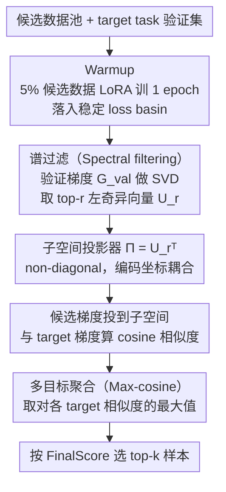

# GIST: 用梯度子空间投影做 instruction tuning 的 targeted 数据选择

**会议**: ICML 2026  
**arXiv**: [2602.18584](https://arxiv.org/abs/2602.18584)  
**代码**: https://github.com/GuanghuiMin/GIST  
**领域**: 数据选择 / LLM 指令微调 / 优化几何  
**关键词**: targeted data selection, instruction tuning, LoRA, gradient subspace, SVD

## 一句话总结
GIST 把"为 target task 挑 instruction tuning 数据"看作 gradient subspace alignment——证明 LESS 等用 Adam states 当 diagonal preconditioner 在 LoRA 上失效（cross-parameter 耦合 + 低秩 task subspace），改用 validation gradients SVD 抽 task-specific 低秩子空间 + cosine similarity 选样本；在 MMLU/TydiQA/BBH 上匹配或超越 LESS，只用 0.29% 存储和 25% 计算时间。

## 研究背景与动机

**领域现状**：Instruction tuning 是 LLM 对齐主流，但越来越多研究（LIMA、AlpaGasus）发现数据质量比数量重要，"less is more"刺激了 automated data selection 研究。Targeted instruction tuning 进一步在限定 budget 下挑数据最大化 target task 性能。现有方法分三类——hard example mining（按 loss/PPL）、similarity-based（embedding 检索）、optimizer-based（用 Adam states 做 diagonal preconditioner，代表是 LESS）。

**现有痛点**：LESS 等用 Adam 的 diagonal preconditioner 当 surrogate of update geometry 是 LLM 时代 scalable 的选择，但在 PEFT（特别 LoRA）下结构性失效——(1) LoRA 的 bilinear $W = W_0 + BA$ 引入 cross-block curvature（$A, B$ 之间天然耦合），diagonal preconditioner 无法表达；(2) Validation gradient 在 LLM 上有低秩结构（rank 150 就 95% variance），axis-aligned diagonal 完全忽略 rotated low-rank subspace。两件事一起意味着 diagonal 不仅近似差还系统性偏。

**核心矛盾**：要 sample efficiency 就要 PEFT；PEFT 引入 coupling；diagonal 没法表达 coupling；要表达 coupling 又得 full Hessian（intractable）。中间需要一个 non-diagonal 但 tractable 的 surrogate。

**本文目标**：建一个 (a) non-diagonal、(b) 在 LoRA 上对 cross-parameter coupling 鲁棒、(c) LLM 规模可计算 的 data scoring 框架。

**切入角度**：观察到 task-specific update directions 集中在低维子空间（rank 150 / 95% variance），所以不需要全 Hessian——只要从 validation gradients SVD 抽 task-relevant 子空间投影器 $\boldsymbol{\Pi}$，再用 cosine alignment 当 scoring，就自然 capture coupling 且 scalable。

**核心 idea**：(1) Validation gradient matrix $\mathbf{G}_{\text{val}}$ SVD 得 top-$r$ left singular vectors $\mathbf{U}_r$；(2) projector $\boldsymbol{\Pi} = \mathbf{U}_r^\top$ 把 candidate gradient 投到 task subspace；(3) cosine similarity in subspace 当 scoring，max over multiple target examples 得 final score；(4) top-$k$ 选样本。整套 0.29% 存储 + 25% 计算 of LESS。

## 方法详解

### 整体框架

GIST 要在限定 budget 下为某个 target task 挑出最有用的 instruction tuning 数据，核心是把"挑数据"重新表述成"梯度子空间对齐"。整条流水线三步走：先用 5% 候选数据 LoRA 训 1 个 epoch 当 warmup，让模型落进一个稳定的 loss basin；再在这个 checkpoint 上对 validation 样本求梯度、SVD 抽出一个低秩的 task 子空间投影器 $\boldsymbol{\Pi}$；最后把每个候选样本的梯度投到这个子空间，跟 target 梯度算 cosine 相似度做打分，取 top-$k$。难点不在"对齐"本身，而在用什么 metric 对齐——LESS 用 Adam diagonal preconditioner，本文论证它在 LoRA 上系统性失效（关键设计 1、2 即这套理论），并给出 SVD 子空间这个 non-diagonal 又 tractable 的替代（关键设计 3、4 把它落成可执行流程）。下图是这条可执行流程：

> 关键设计 1、2 是这条流程背后的理论支撑（论证"为什么不用 diagonal、可以用 SVD 子空间"），不对应单独的流程节点；关键设计 3「谱过滤」对应 C→D，关键设计 4「多目标聚合」对应 F。

### 关键设计

**1. 统一理论框架：把三类数据选择都还原成 Hessian-preconditioned gradient alignment**

以前 hard example mining、similarity-based、optimizer-based 三类方法各讲各的动机，没人说清它们到底差在哪。本文从一阶 Taylor 展开加 Hessian preconditioning 出发，把一个候选样本对 validation loss 的影响写成 $\Delta \mathcal{L}_{\text{val}}(\boldsymbol{z}) \approx -\eta \nabla_{\boldsymbol{\theta}} \mathcal{L}(\mathcal{D}_{\text{val}})^\top \mathbf{H}_{\text{val}}^\dagger \nabla_{\boldsymbol{\theta}} \ell(\boldsymbol{z})$，于是选数据的目标统一成 $\max_{S} \nabla \mathcal{L}_{\text{val}}^\top \mathbf{H}_{\text{val}}^\dagger \nabla \mathcal{L}(S)$（Theorem 3.1）。在这个框架下三类方法各自是对 $\mathbf{H}_{\text{val}}^\dagger$ 的不同 surrogate：hard mining 假设 cosine 角恒定、退化成按梯度范数选；similarity-based 拿 representation kernel 替掉参数空间的 metric；LESS 用 diagonal Adam states 当 $\mathbf{H}_{\text{val}}^\dagger$、隐含假设各坐标独立。统一成同一个 objective 后，"diagonal 够不够"就从经验争论变成一个可分析的代数问题，为下面两点铺路。

**2. LoRA cross-block curvature 定理：证明 diagonal preconditioner 在 LoRA 上注定漏掉耦合**

LESS 之所以可疑，是因为 LoRA 的 $W = W_0 + BA$ 是 bilinear 参数化，$A$ 和 $B$ 天然耦合，而 diagonal 假设各坐标独立。Theorem 3.2 把这点严格化：LoRA 参数的混合二阶导 $\frac{\partial^2 \mathcal{L}}{\partial B_{ik'} \partial A_{kj}} = \langle \mathbf{H}_W [B_{:k} e_j^\top], e_i A_{k':} \rangle_F + \delta_{kk'} (\mathbf{G}_W)_{ij}$ 含显式的 cross-block 项，尤其 $k = k'$ 时那个 $(\mathbf{G}_W)_{ij}$ 直接来自 bilinear 结构——也就是说哪怕原始权重的 $\mathbf{H}_W$ 本身是 diagonal，投到 LoRA 参数上也会长出 off-diagonal。再配上一句距离下界 $\|\mathbf{H} - \mathbf{D}\|_F^2 \ge 2\rho^2$（$\rho$ 是 off-diagonal 强度），说明任何 diagonal preconditioner $\mathbf{D}$ 跟真实 Hessian 之间都有一个抹不掉的 irreducible error floor。这把"diagonal 在 PEFT 上不够"从经验观察升级成代数定理，是对 LESS 这一类方法的理论否定。

**3. Spectral filtering：用 validation 梯度的 SVD 抽低秩 task 子空间，替掉 full Hessian**

既然 diagonal 不行、full Hessian 又算不动，就需要一个中间档。做法是定义梯度协方差代理 $\widehat{\mathbf{F}}_{\text{val}} = \mathbf{G}_{\text{val}} \mathbf{G}_{\text{val}}^\top$——它 PSD 且 non-diagonal，天然 encode 了坐标间耦合。Theorem 3.3 在 NLL 目标下（此时 Hessian 有 Gauss-Newton 分解）证明 $\widehat{\mathbf{F}}$ 的 top-$r$ 特征子空间跟真实 Hessian 的 top-$r$ 特征子空间的 principal angle $\le C \varepsilon_t$，$\varepsilon_t$ 衡量残余曲率加 proxy 失配；warmup 让 loss 进入低值 basin 后 $\varepsilon_t$ 变小，子空间近似就 tight——这也正是"为什么 warmup 训一会就够"的理论支撑。再由 Eckart-Young-Mirsky 定理，SVD 给出的 projector $\boldsymbol{\Pi} = \mathbf{U}_r^\top$（$\mathbf{U}_r$ 是 top-$r$ left singular vectors）是 rank-$r$ 下的最优重构，不是随便挑的。这个 projector 显式 non-diagonal、会 encode rotation，正好 capture 了 diagonal 漏掉的 coupled directions，而它能成立的现实前提是"task 梯度本身就低秩"——Figure 1 实测 rank 150 即可吃下 95% variance。

**4. Multi-Task Aggregation：多目标时用 max-cosine 而非平均，保住 specialist 样本**

实际 target 往往不是单条，而是一组 $\{\boldsymbol{z}_{\text{val}}^{(1)}, \dots, \boldsymbol{z}_{\text{val}}^{(M)}\}$。若把候选样本对各 target 的相似度一平均，一个只对单个 target 极有用的 specialist（比如一条数学样本碰上 coding target）会被稀释埋没。GIST 改取最大值——$\text{FinalScore}(\boldsymbol{z}_i) = \max_j \text{Sim}_t(\boldsymbol{z}_i, \boldsymbol{z}_{\text{val}}^{(j)})$（Maximum Relevance）——只要候选对任一 target 强相关就保留，这对 multi-task instruction tuning 下保住专才样本很关键。

## 实验关键数据

### 主实验：MMLU/TydiQA/BBH（k=5%, Llama2-7B）

GIST vs LESS 性能持平或超越，但：

| Metric | LESS | **GIST** |
|--------|------|----------|
| 存储 | baseline | **0.29% of LESS** |
| 计算时间 | baseline | **25% of LESS** |
| Performance | baseline | match or better |

### Spectral 分析（Figure 1）

Llama2-7B 在 MMLU 上 validation gradient matrix SVD：
- Rank 150 捕获 95% explained variance（rapid spectral decay）
- 大部分 variance 集中在 low-dim subspace
- 验证 "task gradient is intrinsically low-rank" 的核心 empirical assumption

### 关键发现

- **0.29% 存储 + 25% 计算**：GIST 只存 SVD 后的低秩 projector + cosine score，LESS 要存全 candidate gradient features；这个 storage gap 在大规模 candidate pool（270K）下是 orders of magnitude 节省。
- **PEFT 下 diagonal 必然失败**：Theorem 3.2 + Eq. 10 给出 $\|\mathbf{H} - \mathbf{D}\|_F^2 \ge 2\rho^2$ 的 irreducible error，所以 LESS 在 LoRA 上有 systematic error；GIST 用 rotation-capable projector 修正。
- **Warmup 短就够**：5% candidate + 1 epoch LoRA warmup 就足够让 loss 进入 stable basin，eigenspace stability 给 SVD subspace 有意义的 task signal。
- **Max aggregation 优于 mean**：multi-target 任务用 max-cosine 而非 average-cosine 让 specialist candidate（仅对一个 target 有用）被保留，对 multi-task instruction tuning 重要。
- **跨 benchmark stable**：MMLU（multiple choice）、TydiQA（extractive span）、BBH（generative reasoning）三种 output format 都涨，方法 robust。

## 亮点与洞察

- **统一三类方法 + 严证 diagonal 缺陷**：把 hard mining / similarity / optimizer-based 都归到 $\mathbf{H}_{\text{val}}^\dagger$ 不同 surrogate，给 data selection 一个 unified geometric view，是方法学层面的整理性贡献。
- **LoRA cross-block curvature 定理**：Theorem 3.2 用代数严证 PEFT 下 diagonal 必有 $\rho^2$-irreducible error，是对 LESS 类方法的理论否定。
- **Low-rank task subspace 的 empirical fact + 理论 stability**：Figure 1 实证 + Theorem 3.3 理论让"SVD 是好 surrogate"既 empirical 又 theoretical solid。
- **Eckart-Young-Mirsky 的优雅应用**：$\boldsymbol{\Pi} = \mathbf{U}_r^\top$ 不是随便选 projector，而是 rank-$r$ 最优；选了 SVD 就锁死最优性。
- **0.29% 存储不是数字游戏**：270K 候选 × $d$ 维 LoRA gradient features 存储数 GB；GIST 只存 $r$-维 projector + score，从工程上让 data selection 在更大 pool 上可行。
- **Max aggregation 的实用性**：跟 LESS 的 multi-task aggregation 一致但更严格说理，对 multi-task instruction tuning 是 reproducible recipe。

## 局限与展望

- **rank $r$ 选择**：实验用"capture 95% variance"，但 95% 是 heuristic；不同任务最优 $r$ 可能不同，自动选 $r$ 没研究。
- **Warmup 仍要训 1 epoch on 5% data**：5% × 1 epoch 在 270K 样本上还是 13.5K LoRA training steps，对超大 pool 仍有成本。
- **NLL 假设**：Theorem 3.3 在 NLL 目标下严格，对其他 loss（如 contrastive、RL）的理论需要 separate analysis。
- **Static $\boldsymbol{\Pi}$**：projector 在 warmup checkpoint 算一次后固定；动态更新 projector 跟随训练 trajectory 应该更好但成本高。
- **没 compare data selection methods 跨 LLM 尺度**：Llama2-7B 之外没在 70B/Mistral/Gemma 上验证 GIST 的优势是否 scale。
- **TydiQA 上提升较小**：相比 MMLU/BBH 的明显提升，TydiQA（extractive span）GIST 仅匹配 LESS，可能 extractive task 的 gradient structure 跟 generative 不同。

## 相关工作与启发

- **vs LESS (Xia et al. 2024)**：直接对手，LESS 用 Adam diagonal preconditioner；GIST 证明 diagonal 在 LoRA 上不行，改用 SVD subspace。同 storage budget 下 GIST 性能匹配/超越，但存储/计算大幅优化。
- **vs RDS / RDS+**：similarity-based 用 representation kernel，但 kernel 跟 parameter-space metric 不匹配；GIST 在 gradient parameter space 直接做。
- **vs LIMA / AlpaGasus**：data quality 重要性的 inspired work，但 LIMA 等用人工筛选；GIST 自动化。
- **vs Influence Functions (Koh & Liang 2017)**：经典理论框架，本文用低秩 SVD 让 influence-style scoring 在 LLM 上可行。
- **vs Gradient Coverage / Coresets**：classical 数据选择，本文是 LLM-specific subspace alignment。
- **启发**：(1) 任何"在 LLM/PEFT 上用 Hessian-preconditioned scoring"的工作都应 revisit diagonal 假设；(2) Low-rank SVD on validation gradients 是 task subspace 的 universal tool，可推广到 few-shot prompt selection、active learning、curriculum learning；(3) Max aggregation > mean aggregation 在 multi-task setting 是 underrated practical insight。

## 评分

- 新颖性: ⭐⭐⭐⭐⭐ 统一三类 selection methods + LoRA cross-block curvature 严证 + SVD subspace projector 三件创新组合，方法学全面。
- 实验充分度: ⭐⭐⭐⭐ MMLU/TydiQA/BBH + storage/compute analysis + spectral analysis 扎实；缺跨模型 scale 验证和动态 projector 消融。
- 写作质量: ⭐⭐⭐⭐⭐ Theorem 3.1-3.3 + Eq. 10 的代数推导清晰，Figure 1 spectral analysis 直击 motivation，整体读起来 mathematically rigorous yet intuitive。
- 价值: ⭐⭐⭐⭐⭐ 直接服务 LLM instruction tuning 数据选择实际痛点（LESS 已被广泛用），GIST 100× 存储节省 + 4× 速度让 data selection 在 production pipeline 中可行；开源代码降低门槛。

<!-- RELATED:START -->

## 相关论文

- [\[ACL 2025\] JsonTuning: Towards Generalizable, Robust, and Controllable Instruction Tuning](../../ACL2025/llm_alignment/jsontuning_towards_generalizable_robust_and_controllable_instruction_tuning.md)
- [\[ACL 2025\] Rethinking Table Instruction Tuning](../../ACL2025/llm_alignment/rethinking_table_instruction_tuning.md)
- [\[ACL 2026\] SFTMix: Elevating Language Model Instruction Tuning with Mixup Recipe](../../ACL2026/llm_alignment/sftmix_elevating_language_model_instruction_tuning_with_mixup_recipe.md)
- [\[AAAI 2026\] Importance-Aware Data Selection for Efficient LLM Instruction Tuning](../../AAAI2026/llm_alignment/importance-aware_data_selection_for_efficient_llm_instruction_tuning.md)
- [\[ICML 2026\] SPARD: Defending Harmful Fine-Tuning Attack via Safety Projection with Relevance-Diversity Data Selection](spard_defending_harmful_fine-tuning_attack_via_safety_projection_with_relevance-.md)

<!-- RELATED:END -->
