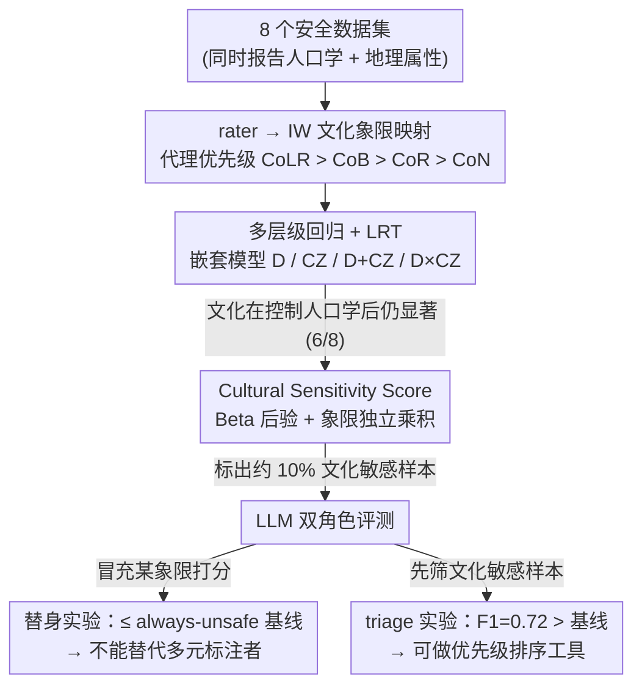

# Quantifying the Salience of Geo-Cultural Values for Pluralistic Safety Alignment

**会议**: ICML 2026  
**arXiv**: [2606.00369](https://arxiv.org/abs/2606.00369)  
**代码**: https://github.com/asaakyan/culture-safety  
**领域**: 对齐 / AI 安全 / Pluralistic Alignment  
**关键词**: 多元对齐, 文化价值观, 安全标注, 标注者分歧, 多层级建模

## 一句话总结
作者用 Inglehart-Welzel 文化地图把标注者按"文化区/象限"重新分层，在 8 个安全数据集上用多层级回归（multilevel modeling）证明文化区在控制完人口学（年龄/性别/族裔）之后仍显著解释安全评分的方差（6/8 数据集 $p<0.05$），并提出 Bayesian 的"cultural sensitivity score"量化得出：当前数据集中约 10% 的样本若忽略某一文化象限就会被错标为 safe；进一步实验表明 LLM 当 rater 替身不靠谱，但当"文化敏感样本"的 triage 工具是可行的。

## 研究背景与动机

**领域现状**：当前 AI 安全对齐（RLHF、constitutional AI、LLM-as-a-judge）严重依赖人类标注者的安全评分，但主流数据集（Anthropic HH、Bai et al. 2022、Glaese et al. 2022 等）的 rater pool 地理来源极度集中（多为 US/UK 众包工人）。少数 geo-diverse 数据集（PRISM、DICES、CREHate）开始引入"国家"作为属性，但多停留在描述性可视化层面。

**现有痛点**：（i）大部分安全数据集根本不报告地理/文化变量，导致无法回头分析；（ii）报告了的也只把"年龄/性别/族裔"等人口学变量与"国家"分开分析，没有联合控制——容易把文化效应误归因为人口学差异，反之亦然；（iii）业界正在大规模用 LLM-as-a-Judge 替代人类标注，但从未在文化维度上验证过 LLM 是否真能模拟不同文化群体的判断。

**核心矛盾**：人类价值多元（pluralistic alignment）要求覆盖跨文化差异，但现有"按人口学分层"的标注协议是否已足够？还是说文化作为独立于人口学的因素必须额外分层？此前没有方法论框架可严格回答这个问题。

**本文目标**：定量回答三个子问题——（1）why：geo-cultural 因素在控制人口学后是否仍显著？（2）where：具体哪些数据样本会因为缺乏文化覆盖而被错标？（3）how：能否用 LLM 缓解高昂的全球标注成本？

**切入角度**：作者借用政治学界 Inglehart 与 Welzel 基于世界价值观调查（WVS）提出的两条主轴——Traditional vs Secular、Survival vs Self-Expression——它们能解释 WVS 跨国差异的 70%+，并把世界各国划分到若干"文化区"。这给了一个理论驱动的、低维的文化代理变量，避免直接把 200 多个国家做 one-hot 导致的过拟合与稀疏。

**核心 idea**：把"文化区/文化象限"作为多层级模型里的固定效应，与人口学固定效应、rater/item 随机效应联合拟合，再用 likelihood ratio test (LRT) 严格比较"加文化"和"不加文化"的模型拟合优度；并在象限层面构造一个 Bayesian 后验，量化"忽略某一象限时会被错过的 unsafe 样本比例"。

## 方法详解

### 整体框架
这篇论文要回答一个看似已有定论的问题：安全标注里"按年龄/性别/族裔分层"够不够，还是文化必须作为独立因素单列。作者把答案拆成三段递进来做——先用元分析筛出 8 个同时报告人口学与地理属性的安全数据集（DIVE、CulturalFrames、PRISM、DICES-990、NLPositionality、D3、CREHate、Severity），再把每个 rater 映射到 Inglehart-Welzel 文化象限后跑多层级回归，严格检验"文化"在控制完人口学后是否仍有解释力，最后用 Bayesian 后验量化"忽略某象限会漏标多少 unsafe 样本"，并测试 LLM 能否替这件昂贵的全球标注工作分担一部分。其中"rater → 文化象限"的映射是后续一切分析的前置脚手架：数据集只报告国家代理（居住/出生/国籍），作者用 CoLR > CoB > CoR > CoN 的优先级把它折算成 IW 象限，再喂进下面三个核心分析。

### 关键设计

**1. 多层级回归 + LRT：把"文化"和"人口学"的贡献干净解耦**

文化效应很容易被误归因——一个看似"东欧 rater 更严格"的差异，可能只是因为这批人恰好偏年长。要分清，就得在同一个模型里联合控制两类因素。作者以 Likert 评分 $H_{ij}$ 为响应，base 模型只放 rater/item 随机效应 $H_{ij}=\beta_0+u_i+v_j+\epsilon_{ij}$（$u_i\sim\mathcal{N}(0,\sigma_{\text{rater}}^2)$、$v_j\sim\mathcal{N}(0,\sigma_{\text{item}}^2)$），然后逐层叠加固定效应：人口学向量 $\mathbf{E}_i,\mathbf{A}_i,\mathbf{G}_i$（族裔/年龄/性别 one-hot）、文化区 one-hot 向量 $\mathbf{C}_i$、以及交互项 $\mathbf{C}_i\times\mathbf{E}_i$，构成 D、CZ、D+CZ、D×CZ 四个嵌套模型。检验靠 likelihood ratio test 比较嵌套对（Benjamini-Hochberg 校正多重检验），再用 $\Delta\text{AIC}$ 和 rater 方差减少比例 $\%\Delta\sigma_{\text{rater}}^2$（伪 $R^2$）量化增益。之所以不用传统 IRR，是因为后者靠 bootstrap 和分层子样本，碰到稀疏的"文化区 × 人口学"格子根本跑不动；多层级模型联合建模 item、rater、group 三层变异，天然吃得下不平衡数据，还能让两类固定效应各自占自己那部分方差、不互相吸收。

**2. Cultural Sensitivity Score：用 Bayesian 后验量化"忽略某象限"的代价**

证明了文化显著之后，下一步是定位——具体哪些样本会因为缺文化覆盖而被错标。作者给每个样本 $i$ 与象限 $q$ 定义一个分数 $S_{iq}\in[0,1]$，表示"只有第 $q$ 象限判它 unsafe、其余象限都判 safe"的概率，$S_{iq}>0.5$ 即标为 culturally sensitive。计算时先统计该象限的总票数 $n_{iq}$ 与 unsafe 票数 $k_{iq}$，以均匀先验 Beta(1,1) 得后验 $\text{Beta}(1+k_{iq},1+n_{iq}-k_{iq})$，算出该象限多数派判 unsafe 的概率 $H_{iq}=P(\theta_{iq}>0.5)$，再在象限独立假设下取

$$S_{iq}=H_{iq}\cdot\prod_{q'\neq q,\,q'\text{ valid}}(1-H_{iq'}).$$

为防人口学混淆，还加了 validity filter：每个象限至少 3 票、且不能由单一性别/族裔/年龄段全包。用原始投票比例做点估计会被 $n_{iq}=3$ 这种小样本噪声主导，Bayesian 后验天然做了平滑与不确定性量化；而乘积形式恰好把"少数派 unsafe + 多数派 safe"这个最危险的盲点情景写成一个可计算、可解释的联合概率，直接回答"若不招某象限会漏标多少"。这个指标在 6 个数据集上稳定算出约 10% 的文化敏感率（阈值收紧到 $S_{iq}>0.7$ 时约 3%）。

**3. LLM 双角色评测：rater 替身做不到，sensitivity triage 做得到**

既然全球标注昂贵，自然要问 LLM 能不能顶上——但"顶上"有两种期待，作者把它们分开各做一套最干净的 head-to-head 测试。替身实验问的是"能不能直接冒充某象限打分"：把任务建成 4-label 多标签分类，用 masked binary cross-entropy（只在已知象限上回传梯度）fine-tune DeBERTa-Large 与 Gemma-3-4B，并 prompt Gemini-3 Flash、GPT-5 Nano，以"始终预测 unsafe"为 baseline（理论 F1 为 $\frac{2\cdot\text{prevalence}}{\text{prevalence}+1}$）。triage 实验问的是"能不能帮人类先筛出文化敏感样本"：在 D3 上各采 485 个 unanimously-safe、unanimously-unsafe、culturally-sensitive 样本，分别训"safe vs unsafe"与"safe vs sensitive"两版二分类器，看后者掉多少点、是否仍显著高于 baseline。这样设计既能给出否定结论（LLM 不能替代多元标注者），又能给出建设性结论（它可以做优先级排序的 triage），而不是简单地一句"LLM 不行"。

### 损失函数 / 训练策略
- 多层级回归通过 lme4/lmer 风格的极大似然估计拟合；对 Likert 评分还用 cumulative link mixed model 复核，仅因收敛问题未作为主报告。
- LLM 替身实验：10 个随机种子 × 5 epochs，按平均 validation F1 选 checkpoint；masked binary cross-entropy 只对有标注的象限累加。
- triage 实验：970 个样本按 65/15/20 切分，无 item 重叠。

## 实验关键数据

### 主实验：文化区是否在控制人口学后仍显著（Table 2 & 3 摘要）

| 数据集 | D vs Base $p$ | CZ vs Base $p$ | D+CZ vs D $p$ | $\Delta$AIC (D+CZ vs D) |
|--------|---------------|----------------|---------------|--------------------------|
| DIVE | $<0.001$ | $0.003$ | $0.581$ | $+8.35$（无增益）|
| CulturalFrames | $0.134$ | $<0.001$ | $<0.001$ | $-41.19$ |
| PRISM | $<0.001$ | $0.003$ | $0.012$ | $-3.97$ |
| DICES-990 | $<0.001$ | $0.004$ | $0.005$ | $-5.86$ |
| D3 | $<0.001$ | $<0.001$ | $<0.001$ | $-179.88$ |
| CREHate | $<0.001$ | $0.203$ | $0.008$ | $-5.12$ |
| Severity | $0.001$ | $<0.001$ | $<0.001$ | $-40.95$ |
| NLPositionality | $0.069$ | $0.344$ | $0.271$ | $+3.62$ |

结论：6/8 数据集中，加入文化区在控制完人口学后仍显著改善拟合（$\Delta$AIC 平均 $-46$，rater 方差平均额外解释 4.64%）；不显著的两个（DIVE、NLPositionality）分别是文化失衡或样本极少导致。

### 文化敏感样本比例（Table 5 摘要）

| 数据集 | 文化敏感样本数 | 占比（$S_{iq}>0.5$）| 有效样本数 |
|--------|--------------|---------------------|------------|
| DIVE | 123 | 13.9% | 887 |
| DICES-990 | 130 | 13.1% | 990 |
| D3 | 485 | 10.9% | 4453 |
| CREHate | 174 | 11.1% | 1562 |
| Severity | 2 | 3.0% | 66 |

把阈值从 $S_{iq}>0.5$ 收紧到 $>0.7$ 后整体降到约 3%，证明结论对阈值有合理的稳健性。

### 消融 / LLM 自动化实验

| 配置 | 关键指标 | 说明 |
|------|---------|------|
| Always-Unsafe baseline | F1 $\approx 2p/(p+1)$ | 文化象限替身任务下界 |
| DeBERTa-Large fine-tune (替身) | 在 D3 的 Q II/Q IV 上 ≤ baseline | 不能可靠模拟多文化判断 |
| Gemma-3-4B fine-tune (替身) | 与 DeBERTa 相当 | 放大模型未带来稳定增益 |
| Gemini-3 Flash / GPT-5 Nano (prompted) | 同样不及 baseline | reasoning LM 也救不回来 |
| Gemma-3-4B (triage, safe vs sensitive) | F1 = 0.72, $p=0.044$ | 显著优于 baseline |
| DeBERTa-Large (triage) | F1 = 0.71, $p=0.071$ | 趋势一致 |
| Safe-vs-unsafe → safe-vs-sensitive | 约 -14% ~ -16% F1 | 文化敏感分类显著更难 |

### 关键发现
- 文化区在 6/8 数据集中即使控制完年龄/性别/族裔仍显著贡献预测力，说明"只按人口学分层就够"的默认假设站不住脚；最大效应在 D3（$\Delta$AIC $=-179.88$），与该数据集是唯一在每个文化区内做人口学平衡的设计有关。
- D3 是唯一在"文化区 × 人口学"交互上也显著的数据集，提示要检测出"老 + 拉美 vs 老 + 儒家"这种细粒度差异，必须在 within-zone 上也做人口学平衡。
- "约 10% 的安全数据集样本是文化敏感的"是一个稳定的、跨任务/跨模态的结论，意味着当前主流 RLHF 数据可能系统性地把约一成对某文化群体危险的内容标成 safe。
- LLM 不能替代文化多元的标注者：fine-tune 与 prompt 的 reasoning 模型在 D3 的 Q II/Q IV 上甚至不如"全标 unsafe"基线；但 fine-tune 的 LLM 可以作为 culturally sensitive items 的 triage 工具，达到 0.72 F1，且 safe-vs-sensitive 任务训练可以迁移到 safe-vs-unsafe，反之不行，提示"敏感样本"包含更丰富的不安全表征。

## 亮点与洞察
- 把社会科学里成熟的 Inglehart-Welzel 文化地图引入安全对齐，给"文化"一个低维、理论驱动、跨数据集统一的代理变量，避免了"国家 one-hot 太稀疏""主观选维度"的两难，是非常聪明的跨学科借用。
- 用 Bayesian 后验 + 象限独立性假设构造的 cultural sensitivity score 把"忽略某文化群体的代价"翻译成一个可计算的概率值，比传统 IRR/卡方更稳健，特别适合小样本格子，且把"漏标 unsafe"这一最严重的安全失效模式直接显式建模。
- "LLM 不能当 rater 替身，但能当 triage 工具"是一个建设性而非破坏性的负面结论：它既给业界 LLM-as-a-Judge 趋势踩了刹车，又给资源有限的团队提供了一条可落地的优先级排序方案；safe-sensitive → safe-unsafe 单向迁移的现象暗示"文化敏感样本"是更高密度的训练信号，这条 trick 可迁移到其他长尾安全场景。
- 优先级 CoLR > CoB > CoR > CoN 的"国家代理变量层级"是个被忽视但很实用的工程经验：CoR 受新移民污染，CoN 受众包工人多国籍策略性申报污染，CoLR/CoB 更接近真实文化习得，这条建议对任何招募 global rater 的实践都直接可用。

## 局限与展望
- 文化区/象限本身是粗粒度的简化，IW 地图无法表达细致的地区性（如同一象限里的儒家与东欧东正教文化差异巨大），可能高估或低估真实文化分歧；象限内仍残留人口学混淆，validity filter 只缓解不能消除。
- 元分析只覆盖了 8 个英文为主的数据集，WVS 也并非所有国家都有最新波次数据，整体分析向欧美与已被调查国家倾斜。
- LLM 实验只做了文本模态；多模态（图文）安全任务上的结论需要后续验证，且 fine-tune triage 模型本身需要少量目标数据集的标注，对全新数据集冷启动有限。
- 未来可以收集真正在"文化象限 × 人口学"上做完全平衡的多元安全数据集，并用本文的多层级框架做更细的交互项分析；也可以把 cultural sensitivity score 接入主动学习管线，把人类标注预算精准投向最 culturally sensitive 的样本。

## 相关工作与启发
- **vs DICES (Aroyo et al., 2023)、PRISM (Kirk et al., 2024)**：两者率先引入跨国 rater 池但分析停留在描述与简单回归；本文用 multilevel + LRT 给出严格的统计证据，并把"文化 vs 人口学"的相对贡献彻底解耦。
- **vs D3 (Davani et al., 2024)**：D3 是先前唯一用 multilevel regression 的工作，但只把人口学变量逐一作为固定效应，未联合控制；本文不仅联合控制还加入文化区与交互项，并复现验证 D3 是唯一显示文化×人口学交互显著的数据集。
- **vs CREHate (Lee et al., 2024)、Severity (Jiang et al., 2021)**：它们采用 geo-stratified 设计但只做均值/多数票或 IRR；本文证明在这两个数据集上文化区仍是显著预测变量，从而把它们的方法学短板补齐。
- **vs LLM-as-a-Judge 范式 (Bai 2022b、Inan 2023、Yuan 2025)**：本文给出了第一份在文化维度上的反例证据——即便是 reasoning LM 也无法模拟多文化人类判断，这对 Constitutional AI、Llama Guard 等依赖 LLM 评判的工程实践是一个直接告警。
- **vs Sorensen et al. (2024) 的 pluralistic alignment 框架**：那篇是概念性 taxonomy，本文则是其"geo-cultural pluralism"维度上的方法学落地与定量证据。

## 评分
- 新颖性: ⭐⭐⭐⭐ 把 IW 文化地图 + multilevel modeling + Bayesian sensitivity score 三件套打包成一个可复用的文化多元安全分析框架，方法论原创性强；不足是核心统计工具均为成熟方法的迁移。
- 实验充分度: ⭐⭐⭐⭐⭐ 横跨 8 个数据集、4 类模型、多种阈值与 baseline，结论稳健且自相印证；LLM 部分覆盖 fine-tune + prompted、encoder + decoder、替身 + triage 两套独立实验。
- 写作质量: ⭐⭐⭐⭐ 结构非常清晰（meta-analysis → 显著性 → 量化 → 自动化 → 实践建议），统计细节完整，公式与表格交代到位；少数符号在不熟悉 multilevel modeling 的读者面前需要补背景。
- 价值: ⭐⭐⭐⭐⭐ 直接挑战"按人口学分层就够""LLM 可替代多元标注者"两个业界默认假设，并给出"招募时按 CoLR/CoB 分文化象限 + 用 fine-tune LLM 做 triage"的具体工程 takeaway，对所有做安全数据集与 RLHF 的团队都有立即可用的指导意义。

<!-- RELATED:START -->

## 相关论文

- [\[ICML 2026\] PICACO: Pluralistic In-Context Value Alignment of LLMs via Total Correlation Optimization](picaco_pluralistic_in-context_value_alignment_of_llms_via_total_correlation_opti.md)
- [\[ICML 2026\] Curriculum Learning for Safety Alignment](curriculum_learning_for_safety_alignment.md)
- [\[ICML 2026\] Implicit Safety Alignment from Crowd Preferences](implicit_safety_alignment_from_crowd_preferences.md)
- [\[ICML 2026\] MESA: Improving MoE Safety Alignment via Decentralized Expertise](mesa_improving_moe_safety_alignment_via_decentralized_expertise.md)
- [\[ICML 2026\] Towards Context-Invariant Safety Alignment for Large Language Models](towards_context-invariant_safety_alignment_for_large_language_models.md)

<!-- RELATED:END -->
