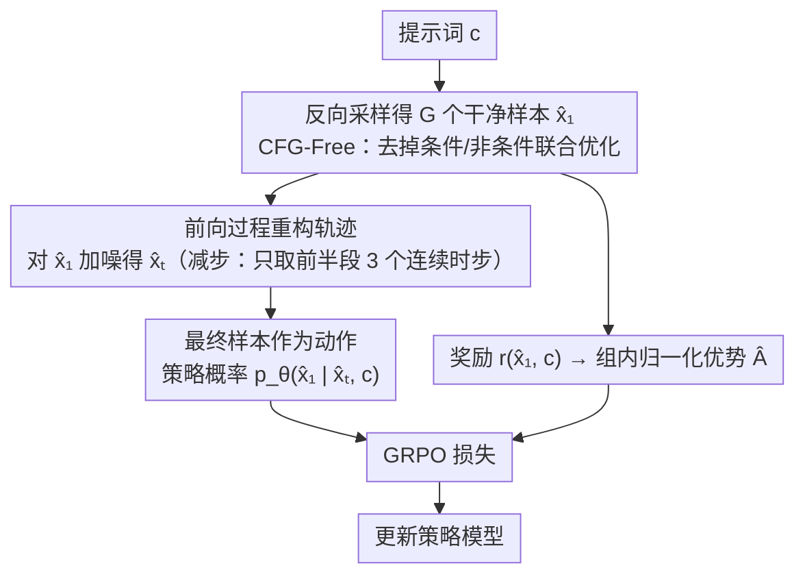

# UDM-GRPO: 统一离散扩散模型的稳定高效 GRPO

**会议**: ICML 2026  
**arXiv**: [2604.18518](https://arxiv.org/abs/2604.18518)  
**代码**: https://github.com/Yovecent/UDM-GRPO  
**领域**: 扩散模型 / 文本图像生成 / 强化学习对齐  
**关键词**: 离散扩散模型, 策略优化, 文本生成图像, 训练稳定性

## 一句话总结
通过将最终干净样本定义为动作并使用前向过程重构轨迹——首次成功将 GRPO 集成到离散扩散模型中，解决训练不稳定问题，在 GenEval 等多个基准上达到 SOTA。

## 研究背景与动机

**领域现状**：扩散模型在文本图像生成中表现卓越。GRPO 在 LLM 推理能力增强中已证明高效，近期 Flow-GRPO 成功将其应用于连续扩散模型。

**现有痛点**：将 GRPO 直接应用于 Uniform Discrete Diffusion（UDM）模型时，训练表现出严重不稳定性——奖励在前 500 步上升后大幅震荡，KL 散度急剧增长导致完全崩溃。

**核心矛盾**：一是中间时步的预测信号嘈杂不可靠不应作为 RL 优化目标；二是模型自生成的反向轨迹与预训练时的前向分布存在严重偏移导致 OOD 训练。

**本文目标**：开发首个 UDM-GRPO 框架，实现对离散扩散模型的稳定且高效的 RL 优化。

**切入角度**：从 UDM 采样过程的特殊结构出发，提出通过统一定义最终干净样本为动作、使用前向过程重构轨迹来消除这两个问题。

**核心 idea**：用最终干净样本替代中间嘈杂预测作为 RL 动作，并用模型生成的干净样本的前向过程而非反向过程构建训练轨迹。

## 方法详解

### 整体框架
这篇要解决的是：直接把 GRPO 套到 Uniform Discrete Diffusion（UDM）上会训崩——奖励涨了 500 步就剧烈震荡、KL 爆炸。UDM-GRPO 保留 GRPO 的组内相对优势骨架，只动两个最关键的环节：把每个时步的「动作」从嘈杂的中间预测 $x_1^t$ 换成最终干净样本 $\hat{x}_1$，再把用于优化的「轨迹」从模型自己跑出来的反向过程 $\mathcal{X}_{\text{backward}}$ 换成由 $\hat{x}_1$ 倒推的前向过程 $\mathcal{X}_{\text{forward}}$。这两刀分别堵住了「优化目标嘈杂」和「训练状态 OOD」两个不稳定源头，再叠上减步与 CFG-Free 两个工程加速。

### 关键设计

**1. 最终样本作为动作：让 RL 优化的目标和预训练目标对齐**

崩溃的第一个源头是中间时步的预测信号不可靠——早期时步预测熵高、噪声大，若把这些中间预测 $x_1^t$ 当成 RL 动作去优化，等于逼模型学一堆错误信号。UDM-GRPO 把所有时步的动作统一定义为最终干净样本 $a_t \triangleq \hat{x}_1$，优化时让模型最大化 $p_\theta(\hat{x}_1|\hat{x}_t,c)$。这样做之所以稳，是因为标准扩散预训练的目标本来就是干净图像，而奖励也是对干净图像打分——动作、奖励、预训练目标三者天然指向同一个对象，优化信号精确落在奖励定义的目标上，不再被中间噪声带偏。

**2. 前向过程轨迹重构：把训练状态拉回预训练分布**

第二个源头是分布偏移：模型自生成的反向采样轨迹会累积预测误差，跑出来的中间状态严重偏离预训练时见过的前向分布，等于让模型在 OOD 状态下做 RL，自然不稳。UDM-GRPO 不再用反向过程的中间态，而是先拿到生成的干净样本 $\hat{x}_1$，再对任意噪声时步 $t$ 用前向扩散重新采样 $\hat{x}_t \sim p_t(x|\hat{x}_1)$ 来构造训练轨迹。由于 $\hat{x}_t$ 直接由前向过程加噪得到，轨迹分布严格服从预训练中的前向分布，模型始终在「见过」的状态上更新，OOD 问题被消除。

**3. 减步优化（Reduced-Step）：把梯度集中到高噪声时步**

前两项保证了稳定，后两项管效率。第一个效率瓶颈是梯度分散——在全部扩散时步上均匀优化，会把梯度摊薄到整条去噪轨迹，收敛很慢。作者观察到去噪过程的随机性随时步递减：早期高噪声时步熵高、探索空间大、预测误差也最大，是回报最高的优化区间；后期时步已接近确定性，再优化收益甚微。于是对每个样本只从扩散前半段随机选取 3 个连续时步做策略优化，把算力压在最值得优化的高噪声阶段，显著加速收敛。

**4. CFG-Free 训练：省掉条件/非条件双目标的算力开销**

第二个效率瓶颈来自 classifier-free guidance（CFG）：主流 Diffusion-RL 方法训练时要同时优化条件与非条件两个模型，复杂度和算力开销都翻倍。UDM-GRPO 在训练阶段直接去掉 CFG，只训练单目标。代价是初期生成质量会有一段明显下降，但这是暂时的——随训练推进模型会恢复，最终性能甚至反超基于 CFG 的常规训练。

## 实验关键数据

### 主实验

| 模型 | GenEval | PickScore | OCR |
|------|---------|-----------|-----|
| URSA（基础） | 0.69 | 21.79 | 0.08 |
| SD3.5-L | 0.71 | 22.91 | 0.68 |
| FLUX.1-Dev | 0.66 | 22.84 | 0.59 |
| URSA + UDM-GRPO | **0.96** | **23.81** | **0.57** |

### 消融实验

| 模型 | 动作定义 | 轨迹来源 | GenEval | PickScore | OCR |
|------|---------|---------|---------|-----------|-----|
| 基础 URSA | - | - | 0.69 | 21.79 | 0.08 |
| 直接适配 | $x_1^t$ | backward | 0.84 | 21.99 | 0.23 |
| 改进动作 | $\hat{x}_1$ | backward | 0.89 | 23.10 | 0.23 |
| 改进轨迹 | $\hat{x}_1$ | forward | 0.94 | 23.51 | 0.34 |
| 完整方法 | $\hat{x}_1$ | forward+CFG-Free | 0.96 | 23.81 | 0.57 |

### 关键发现
- 前向轨迹相比反向轨迹的 FID 一致低于预训练分布，验证分布对齐假设。
- GenEval 在六大单项指标均达到 0.95 以上。
- OCR 精度从 8% 提升到 57%。

## 亮点与洞察
- **问题根源的深度诊断**：通过熵可视化和 FID 定量分析精确定位两个不同来源的不稳定因素。
- **设计的优雅统一性**：用最终干净样本作为统一的动作定义既解决中间预测噪声问题又自然对齐 RL 目标与预训练目标。

## 局限与展望
- 方法仍需 32 个 A100 GPU 进行训练，计算成本较高。
- CFG-Free 策略虽改善稳定性但初期性能下降明显。
- 仅在 T2I 任务评估，其他离散生成任务（文本、音频等）适用性待验证。

## 相关工作与启发
- **vs Flow-GRPO**：针对连续扩散设计，直接应用于离散模型导致不稳定。
- **vs DDPO**：DDPO 在多步 MDP 设定下操作整个反向轨迹；本文统一为最终样本动作。

## 评分
- 新颖性: ⭐⭐⭐⭐⭐  首次成功解决 UDM-GRPO 集成难题。
- 实验充分度: ⭐⭐⭐⭐⭐  三大任务、多个基准、完整消融。
- 写作质量: ⭐⭐⭐⭐  问题诊断清晰，实验可复现。
- 价值: ⭐⭐⭐⭐⭐  为离散生成与 RL 结合树立新范式。

<!-- RELATED:START -->

## 相关论文

- [\[ICML 2026\] F-TIS: Harnessing Diverse Models in Collaborative GRPO](f-tis_harnessing_diverse_models_in_collaborative_grpo.md)
- [\[AAAI 2026\] LaF-GRPO: In-Situ Navigation Instruction Generation for the Visually Impaired via GRPO with LLM-as-Follower Reward](../../AAAI2026/llm_alignment/laf-grpo_in-situ_navigation_instruction_generation_for_the_visually_impaired_via.md)
- [\[ACL 2026\] Mitigating Selection Bias in Large Language Models via Permutation-Aware GRPO](../../ACL2026/llm_alignment/mitigating_selection_bias_in_large_language_models_via_permutation-aware_grpo.md)
- [\[ICLR 2026\] Group-Relative REINFORCE Is Secretly an Off-Policy Algorithm: Demystifying Some Myths About GRPO and Its Friends](../../ICLR2026/llm_alignment/group-relative_reinforce_is_secretly_an_off-policy_algorithm_demystifying_some_m.md)
- [\[ACL 2026\] Taming Extreme Tokens: Covariance-Aware GRPO with Gaussian-Kernel Advantage Reweighting](../../ACL2026/llm_alignment/taming_extreme_tokens_covariance-aware_grpo_with_gaussian-kernel_advantage_rewei.md)

<!-- RELATED:END -->
