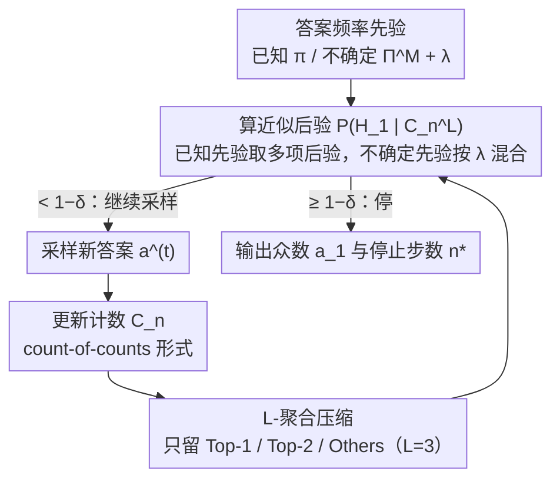

# Optimal Bayesian Stopping for Efficient Inference of Consistent LLM Answers

**会议**: ICML 2026  
**arXiv**: [2602.05395](https://arxiv.org/abs/2602.05395)  
**代码**: https://github.com/jh9959-afk/Paper (有)  
**领域**: LLM 效率 / 测试时计算 / 自适应自洽性  
**关键词**: 自适应采样, 自洽性, 贝叶斯停止, 序贯假设检验, 测试时扩展

## 一句话总结
本文把"自洽性 (Self-Consistency) 多次采样选众数"问题建模为带先验信息的贝叶斯最优停止问题，并提出一种只跟踪"出现次数最多 / 次多 / 其他合计"三类计数的 $L$-聚合后验近似，从理论上证明 $L=3$ 即可在 $\delta \to 0$ 时达到与精确后验完全一致的渐近最优停止时间，实验上以约 1.4 倍 ASC 的速度在 GSM8K / CommonsenseQA 上节省 30%–80% 的 LLM 调用。

## 研究背景与动机

**领域现状**：在数学和推理任务上提升 LLM 准确率的主流轻量手段是 Self-Consistency (SC) —— 对同一道题采样多个 CoT 路径，按多数投票决定最终答案。这种"采样-投票"方法已经成为标准的测试时扩展配方，但代价是固定预算（如每题 40 次采样），算力浪费严重。为了缓解这点，Aggarwal et al. 2023 的 Adaptive Self-Consistency (ASC) 用 Beta 后验做无信息先验下的停止判定，"一旦领跑答案足够强就停"。

**现有痛点**：ASC 这一类工作忽略了一个明显的可用信号 —— 同一个 LLM 在同分布问题上的答案分布形状本身就是可学习的先验。容易题的答案分布是"尖峰"型（最大概率近 1），难题是"平坦"型；这种 shape 完全可以从历史回答里估出来，但 ASC 整套贝叶斯更新里完全没用上。

**核心矛盾**：直接把"答案频率向量 $\pi$"作为先验插进贝叶斯框架，再算"模式 $a_1$ 已识别"的后验，会撞上一个组合爆炸 —— 因为我们观察不到答案标签本身、只能看到"两两是否相同"，所以要把所有 $K$ 个不同答案到隐标签的单射 $\psi \in \mathfrak{S}_{M(n)}$ 都枚举一遍。精确后验的复杂度是 $\mathcal{O}(K!)$，在开放推理任务中 $K$ 一大就完全失效。

**本文目标**：(i) 在已知 / 不确定先验两种设定下，给出一个统计上能严格压过 ASC、计算上又能实时跑的最优停止规则；(ii) 把它的渐近停止时间和先验无关的下界做严格比较。

**切入角度**：作者把观察压缩成"出现次数的次数" $\mathcal{C}_n = \{(v_i, c_i)\}$（如 $\{(10,1),(3,2),(2,1)\}$ 表示"一个答案出现 10 次、两个答案各 3 次、一个答案出现 2 次"），并进一步只保留 Top-$(L-1)$ 频次、剩下全合并成"其他"，得到 $L$-聚合状态 $\mathcal{C}_n^L$。这样后验复杂度从 $\mathcal{O}(K!)$ 降到 $\mathcal{O}(K^L \cdot \bar n^2)$。

**核心 idea**：用 $L=3$（只看 Top-1、Top-2、Others 三个计数）近似 Bayesian 后验 —— "three is all you need"，在 $\delta \to 0$ 时仍与精确后验 $L=K$ 的渐近停止时间逐字相等，而推理时延几乎与 $L=2$ 持平。

## 方法详解

### 整体框架

这篇论文要解决的是"自洽性采样到底该停在第几次"的问题：给同一道题反复采样答案，目标是在尽量少的采样里、以 $1-\delta$ 的置信度断定"当前出现次数最多的答案就是真模式 $a_1$"。整套流程是个在线循环——每来一个新答案 $a^{(t)}$，就更新一组计数 $\mathcal{C}_n$，把它压成只保留头部信息的 $L$-聚合状态 $\mathcal{C}_n^L$，再算一次近似后验 $\mathbb{P}(H_1 \mid \mathcal{C}_n^L)$；一旦这个后验越过阈值 $1-\delta$ 就停手，输出此刻的众数和停止步数 $n^{\star,L}$。输入侧除了答案序列还要给一个答案频率先验：先验已知时直接给 $\pi$，先验不确定时给一组候选 $\Pi^M = \{\pi^1, \dots, \pi^M\}$ 和超先验权重 $\lambda_m$。

### 关键设计

**1. 从精确后验到 $L$-聚合压缩：把 $\mathcal{O}(K!)$ 的后验砍成可实时跑的 $\mathcal{O}(K^L)$**

直接套贝叶斯框架算"模式已识别"的后验会撞上组合爆炸：因为只能观察到"两两答案是否相同"、看不到答案标签本身，精确后验 $\mathbb{P}(H_1 \mid \mathcal{C}_n) = \frac{\sum_{\psi: \psi(1)=1} \prod_j p_{\psi(j)}^{n_j}}{\sum_{\psi \in \mathfrak{S}_{M(n)}} \prod_j p_{\psi(j)}^{n_j}}$ 要把所有 $K$ 个答案到隐标签的单射 $\psi$ 都枚举一遍，复杂度 $\mathcal{O}(K!)$。作者的做法是只显式保留 Top-$(L-1)$ 个频次，剩下 $K-L+1$ 个答案的多项分配 $\mathbf{r}^{-\psi}$ 不再逐个枚举、而是用一个汇总量 $\tilde S_\psi = \sum_{\mathbf{r}^{-\psi}} w(\mathbf{r}) \cdot \frac{\bar n!}{\prod r_j!} \prod p_j^{r_j}$ 一次性求和，其中权重 $w(\mathbf{r}) = \binom{c_d' + m(\mathbf{r})}{c_d'}^{-1}$ 专门修掉"边界频次的答案被任意划进头部或尾部"造成的重复计数。这之所以不丢精度，关键在恒等式 $\mathbb{P}(H_1 \mid \mathcal{C}_n^L) = \mathbb{E}[\mathbb{P}(H_1 \mid \mathcal{C}_n) \mid \mathcal{C}_n^L]$——聚合后的后验只是精确后验的无偏粗化，不引入系统性偏差。本质上这是一个"统计代价 vs 计算代价"的开关：精确后验的瓶颈在 $K!$ 而非样本数，只要把头部信号原样留下、尾部用一个统计量 $\bar n_{L(n)}$ 概括，就能在保住判别力的同时把复杂度从阶乘压成 $K$ 的指数 $L$。

**2. "三足够"渐近最优定理：$L=3$ 就是 sweet spot**

聚合到底压到多狠才不亏？作者在 $\delta \to 0$ 极限下给了精确刻画。$L=2$（只看 Top-1）的渐近停止率是 $\lim \mathbb{E}[n^{\star,2}] / \log(1/\delta) = 1/D_{\mathrm{KL}}(p_1 \| p_2)$，而所有 $L \ge 3$ 都收敛到同一个更快的速率 $\lim \mathbb{E}[n^{\star,L}] / \log(1/\delta) = 1 / ((p_1 - p_2) \log(p_1/p_2))$，和精确后验 $L=K$ 逐字相等。再和无先验基线 $n^{\star,f}$（其速率分母是对称化的 Jensen-Shannon 散度，对应 Shah et al. 2020 / Jain et al. 2022 的 PPR 鞅置信序列下界）对比，就能排出 $\mathbb{E}[n^{\star,f}] > \mathbb{E}[n^{\star,2}] > \mathbb{E}[n^{\star,3}] = \cdots = \mathbb{E}[n^{\star,K}]$。直觉很清楚："Top-1 频次"衡量领跑者强度，"Top-1 与 Top-2 之差"衡量它对二号位的优势——只要这两个统计量都跟到，就抓住了贝叶斯证据的本质，$L=4,5$ 不过是冗余。$L=2$ 之所以慢，是因为只看 Top-1 等于把比较退化成 Bernoulli 假设检验，丢掉了"次大答案到底有多大"这个关键判别力。在不确定先验场景下作者进一步证明 $L=3$ 仍严格优于 ASC，唯一会让优势接近消失的情形是候选池里恰好存在某个 $\pi^{m^\dagger}$ 满足 $p_{1,m^\dagger} \approx p_{2,m^\dagger} \approx (p_{1,m^\star}+p_{2,m^\star})/2$。

**3. 不确定先验下的层次贝叶斯扩展：把"逐题先验"换成离线攒的候选池**

"已知逐题 $\pi$"是上帝视角，真实部署里拿不到，所以作者把它放宽成"$\pi$ 以概率 $\lambda_m$ 从候选集 $\Pi^M$ 中随机抽取"。对应地，后验推广成按 $\lambda_m$ 加权的混合形式 $\mathbb{P}_{\Pi^M}(H_1 \mid \mathcal{C}_n^L) = \frac{\sum_m \lambda_m \sum_{\psi:\psi(1)=1} (\prod p_{\psi(j),m}^{n_j}) \tilde S_\psi^m}{\sum_m \lambda_m \sum_\psi (\prod p_{\psi(j),m}^{n_j}) \tilde S_\psi^m}$，每个候选 $\pi^m$ 贡献一份 $\tilde S_\psi^m$，复杂度只多乘一个 $M$ 因子。候选池的构造非常工程化：把数据集按 70/30 划分，用训练集每道题的 40 次 LLM 采样得到经验分布，全部塞进 $\Pi^M$，$\lambda_m$ 取均匀分布——没有任何参数化建模，也没有新模型要训。这之所以站得住，是因为难题/易题/选择题/开放题的答案分布"形状"在分布层面是稳定的，可以拿同一 LLM 的历史回答当候选库；而且即便 $\Pi^M$ 不包含真值，混合后验也能保持渐近下界严格优于无先验 ASC。

### 损失函数 / 训练策略

没有训练损失。算法层面：(i) 用 Algorithm 1（论文附录 C 全式）维护 $\mathcal{C}_n \to \mathcal{C}_n^L$ 与 $\tilde S_\psi$ 的动态规划计算；(ii) 用 $L=3$ 作为默认配置；(iii) 阈值置信度 $1-\delta$ 由用户根据"想要的模式估计准确率"指定，论文实验里用 $1-\delta \in \{0.7, 0.8, 0.9, 0.95, 0.975, 0.99\}$。

## 实验关键数据

### 主实验

合成数据集（$\pi = (0.5, 0.2, 0.1, 0.1, 0.05, 0.03, 0.01, 0.01)$，$K=8$，重复 10000 次）下，$L$ 聚合方案与精确后验、无先验 ASC 在 $1-\delta = 0.99$ 时的对比：

| 方法 | 模式准确率 | 平均采样数 | 后验计算时延 (ms) |
|------|-----------|------------|-------------------|
| $L=2$ | 99.5% | 22.43 | 9.0 |
| $L=3$ | 99.2% | 18.07 | 14.2 |
| $L=4$ | 99.2% | 18.11 | 37.4 |
| Exact ($L=K=8$) | 99.2% | 18.13 | 29.8 |
| ASC（无先验） | 100.0% | 44.07 | — |

$L=3$ 把样本数从 ASC 的 44.07 砍到 18.07（**节省 ~59%**），而后验计算时延只比 $L=2$ 多 ~5 ms，比 $L=4$ 快 ~2.6×。

FEval-TTC 真实数据集 CommonsenseQA 上、Qwen-2.5-72B / $1-\delta = 0.99$：

| 方法 | 答案准确率 | 模式准确率 | 平均采样数 |
|------|-----------|------------|-----------|
| $L=3$（已知先验） | 88.0% | 99.4% | 4.24 |
| $L=3$（不确定先验） | 88.1% | 99.5% | 6.23 |
| ASC | 87.6% | 100.0% | 8.04 |

不确定先验下仍比 ASC 节省 ~22% 调用且答案准确率持平。

### 消融实验

| 配置 | 关键发现 |
|------|---------|
| $L = 2$ vs $L = 3$ | 已知先验下 $L=2$ 在 $1-\delta=0.99$ 多采 24%（22.43 vs 18.07）；不确定先验下 $L=2$ 退化更严重，理论上甚至可能差于 ASC |
| $L = 3$ vs $L = K$（精确） | 渐近相等，在所有 $\delta$ 下两者样本数差异 ≤ 0.1，但 $L=3$ 后验快 ~2× |
| 先验已知 vs 不确定 | 不确定先验下 $L=3$ 在 Qwen-2.5-72B 上多采 ~50%（6.23 vs 4.24），但仍优于 ASC |
| $1-\delta = 0.95$ 极端情形 | 不确定先验 $L=3$ 在 GPT-4o mini 上首次采样就停，**节省 ~80% 调用**且模式准确率 96.9% |

### 关键发现
- $L=3$ 是 "sweet spot"：从 $L=2 \to L=3$ 多花 5 ms 后验计算就能换 ~25% 采样节省；从 $L=3 \to L=4$ 时延翻倍但样本数几乎不变。
- ASC 对置信度 $1-\delta$ 校准不准：高置信度下过采（$1-\delta=0.99$ 用 44 次而本文只要 18 次），低置信度下又激进早停。本文的贝叶斯框架天然校准。
- 一个反直觉但有用的副产品：在 CommonsenseQA 上，真答案在 Top-2 候选里的概率是 93.3%，远高于"严格等于众数"的 87.6%。$L=3$ 的早停策略偶尔会停在"Top-2 仍模糊"的状态，反而抓住了 Top-2 是正确答案的少数情形，导致答案准确率不降反升。

## 亮点与洞察
- **把 LLM 自洽性变成序贯假设检验的新案例**：之前的 mode identification 文献（Shah et al. 2020；Jain et al. 2022）默认无先验，因为"知道每个答案的概率就是泄露众数本身"。本文巧妙地把先验定义在"Top-1/Top-2/.../Top-K 频率"上、而不是"具体答案上"，绕开了这个泄露问题，开辟了一类新的可解 Bayesian mode identification 问题。
- **"三足够"是个干净的渐近相变结论**：从 $L=2$ 到 $L=3$ 是质变（KL 散度 → JS 形式的下界跳到精确下界），从 $L=3$ 到 $L=K$ 是量变（完全相等）。这种"低维充分统计量"思想可以迁移到任何需要在线粗化后验的场景，比如 best-arm identification、A/B 测试早停、推荐系统冷启动探索。
- **不确定先验的"候选池"构造非常工程化**：直接用 70% 训练集每题的 40 次采样得到的经验分布作为候选库，没有任何参数化建模。这对实战部署友好 —— 没有新模型要训。

## 局限与展望
- **冷启动问题**：完全没有历史数据的新域 / 新任务，方法退化成 ASC，没有任何收益。作者承认。
- **先验偏差下的鲁棒性未给保证**：定理 4.1 在 $\Pi^M$ 至少包含真值 $\pi^{m^\star}$ 时成立；如果候选池系统性地偏掉（如全是难题但新问题简单），渐近界还能成立吗？没有给。
- **众数 ≠ 正答时的处理**：作者实验里观察到的"Top-2 反而是真答案"现象其实暗示了一个问题：mode identification 本身不是正确的优化目标。如何把"先验 + 真值反馈"耦合起来，让框架去识别真答案而不是众数，是个有意思的开放方向。
- **$K$ 在长开放生成里可能非常大**：虽然 $\mathcal{O}(K^3)$ 比 $\mathcal{O}(K!)$ 好得多，但 $K$ 上百时仍重；论文实验的 $K=8$ 偏温和。

## 相关工作与启发
- **vs ASC (Aggarwal et al. 2023)**：ASC 用 Beta(无信息先验) 后验做停止；本文用任意（已知/不确定）先验下的多项后验。本文严格 Pareto 优势（更少样本、更校准），代价是要离线攒一个先验候选池。
- **vs Shah et al. 2020 / Jain et al. 2022（PAC mode identification）**：他们建立了无先验下 PPR 鞅停止的渐近最优性，是 ASC 文献的理论基石。本文证明引入先验后能严格压过这条下界。
- **vs MCMC / 正态近似（Gelman et al. 1995）**：通用贝叶斯近似方法计算上不适合实时推理，且对离散计数数据结构不友好。$L$-聚合 + DP 是为本问题定制的轻量近似。
- **vs 困难度感知采样（Wang et al. 2025 / Wan et al. 2025a）**：他们也想"按题难度调采样数"，但启发式判定停止；本文用统一的贝叶斯准则，理论上有刻画。

## 评分
- 新颖性: ⭐⭐⭐⭐ "Top-1/Top-2/Others" 三计数 + "三足够"渐近结论很干净，把一个看似难解的组合爆炸贝叶斯问题降到实时可跑。
- 实验充分度: ⭐⭐⭐⭐ 合成 + FEval-TTC 三 LLM × 三数据集 × 多置信度，先验已知/不确定双场景，覆盖度好；缺一个"先验池故意 mis-specified"的对抗实验。
- 写作质量: ⭐⭐⭐⭐ 推导严谨、动机讲得清楚；定理 4.1 的细节稍密但有 remark 给直觉。
- 价值: ⭐⭐⭐⭐ 直接为 SC / self-consistency 类测试时扩展省 30–80% 调用，落地价值高且开源；不确定先验设定也匹配真实部署。

<!-- RELATED:START -->

## 相关论文

- [\[ICML 2026\] OBCache: Optimal Brain KV Cache Pruning for Efficient Long-Context LLM Inference](obcache_optimal_brain_kv_cache_pruning_for_efficient_long-context_llm_inference.md)
- [\[ICML 2026\] Training-Inference Consistent Segmented Execution for Long-Context LLMs](training-inference_consistent_segmented_execution_for_long-context_llms.md)
- [\[ICML 2026\] DOT-MoE: 用可微 optimal transport 把 dense LLM 转成 MoE](dot-moe_differentiable_optimal_transport_for_moefication.md)
- [\[ICML 2026\] Theoretically Optimal Attention/FFN Ratios in Disaggregated LLM Serving](theoretically_optimal_attentionffn_ratios_in_disaggregated_llm_serving.md)
- [\[ICML 2026\] Ekka: Automated Diagnosis of Silent Errors in LLM Inference](ekka_automated_diagnosis_of_silent_errors_in_llm_inference.md)

<!-- RELATED:END -->
