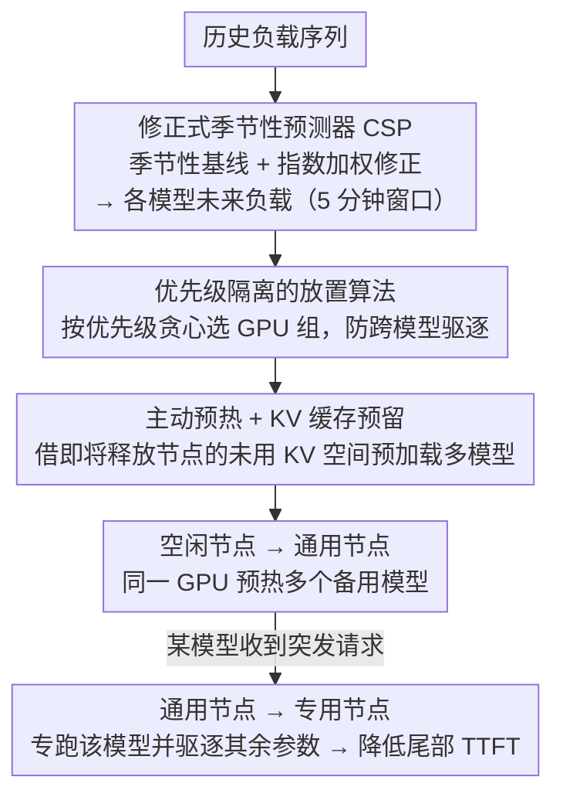

# WarmServe：一次加载多模型的 GPU 预热机制

**会议**: ICML 2026  
**arXiv**: [2512.09472](https://arxiv.org/abs/2512.09472)  
**代码**: https://github.com/LLMServe/WarmServe  
**领域**: LLM 效率 / 多模型服务  
**关键词**: GPU 预热, 多 LLM 服务, 工作负载预测, 冷启动, 资源效率

## 一句话总结
WarmServe 通过分析 LLM 服务工作负载的长期周期性规律，主动将多个模型参数预加载到 GPU，配合优化的放置算法和动态 KV 缓存预留策略，使系统能在请求突发时快速启动新实例——尾部 TTFT 相比现有系统降低 50.8 倍。

## 研究背景与动机

**领域现状**：多 LLM 服务系统需在共享 GPU 集群中并发部署多模型以提高资源利用率。主流方案有两类——（1）自动扩展：根据当前负载动态创建实例但冷启动延迟大；（2）GPU 共享：在同一 GPU 上并置多模型但严重受限 KV 缓存容量。

**现有痛点**：自动扩展在请求突发时需现场加载模型参数，导致严重 TTFT；GPU 共享虽避免初始化延迟，但每个模型分到的 KV 缓存极少。

**核心矛盾**：现有系统缺乏对未来工作负载特征的感知——自动扩展只能被动响应，GPU 共享的放置策略必须随时间保持稳定。

**关键观察**：虽然短期请求到达具有随机性，但实际生产环境中 LLM 服务的长期统计特性表现出强周期性——峰值负载在 5 分钟窗口内可以以平均 7.3% 相对误差精度预测。

**切入角度**：充分利用这种可预测性，采用主动式预热策略——在预测到未来负载突增前主动将备用模型副本加载到空闲 GPU 上。

**核心 idea**：引入"一次加载多模型"机制——将多个模型参数同时加载到单个 GPU 内存中；某模型遇请求突发时立即利用已预热参数启动活跃实例，然后快速驱逐其他模型参数。驱逐权重比按需加载快得多。

## 方法详解

### 整体框架
WarmServe 要解决的是多 LLM 服务的冷启动难题：请求一突发就现场加载上百 GB 的模型参数，尾部 TTFT 被拖垮。它的做法是先预测、再预热、最后快速切换。系统把 GPU 集群里的工作节点分成三类——空闲（idle）、通用（universal）、专用（dedicated）：预测器算出未来各模型的负载后，放置算法挑空闲节点把多个备用模型一次性预热进去，让它升级为通用节点；某个预热模型一旦收到突发请求，所在节点立刻升级为专用节点专跑这个模型、同时驱逐其余模型的参数；此外即将释放的专用节点也会被借来，用它未用的 KV 缓存空间潜伏式地预热下一批模型。

### 关键设计

**1. 修正式季节性预测器（CSP）：把"短期随机、长期周期"的负载变成可预测信号**

主动预热的前提是"知道未来要扩谁"，但 LLM 请求短期到达是随机的，无法直接预测。WarmServe 的观察是：长期统计特性有强周期性，于是它把预测拆成两部分——季节性基线 $P_{k,i} = \frac{1}{D}\sum_{d=1}^{D}L_{k-d,i}$ 取过去 $D$ 天同一时段 $i$ 的平均负载，再叠一个修正项 $\Delta_{k,i} = \frac{\sum_{w=1}^{\min(i,N)}(L_{k,i-w}-P_{k,i-w})\cdot 2^{w-1}}{2^{\min(i,N)}-1}$ 把当天最近几个窗口的实际偏差按 $2^{w-1}$ 指数加权（越近的误差权重越高），最终预测 $\hat{L}_{k,i} = P_{k,i} + \Delta_{k,i}$。基线吃住周期规律、修正项快速跟住当天趋势漂移，两者相加在 5 分钟窗口下做到峰值负载 92.7% 的预测精度，给后续预热提供了可靠的提前量。

**2. 优先级隔离的放置算法：避免一个 GPU 被释放就连锁驱逐一片模型**

预测出要预热哪些副本后，难点是放在哪。LLM 跨多 GPU 张量并行，单个 GPU 一被抢走就会迫使整组模型下线，形成"跨模型干扰"——次要模型的扩容可能把重要模型的预热成果连带砸掉。算法给每个待预热副本算一个优先级分数（综合预期负载与当前实例数的差距、冷启动延迟等），按分数降序处理；对每个副本贪心地选一组 GPU，优先选那种"高分副本不会被低分副本驱逐"的组合，从而用优先级把重要模型保护起来。这样既维持了贪心的运行时低开销（无需在线求解整数规划），又把干扰约束在不破坏关键模型的范围内。

**3. 主动预热 + KV 缓存预留：把超大检查点的 I/O 藏进 GPU 还在运行的闲置期**

LLM 检查点动辄 128GB+，临到突发再加载、几十秒的窗口根本来不及，这是传统预热常失败的根因。WarmServe 反过来利用"负载下降、实例即将关闭"的时机：自动扩展器要回收某些实例时，它们通常还留着大量未用的 KV 缓存空间，正好拿来潜伏式地预加载下一批模型参数。为保证在用请求不被挤掉，系统先按 $R = \max(C \cdot Q/B, T + C/B)$ 算出必须保留给现有请求的 KV 缓存（取"满足排队请求"与"满足吞吐"两个约束的上界），剩余空间才用于预热；一旦空间吃紧就动态驱逐已预热的权重让位给真实负载。等于把 128GB 的搬运成本拉长到 GPU 仍在服务的空闲带宽里，而不是堵在突发那一刻。

## 实验关键数据

### 主实验

| 系统 | P95 TTFT(s) | P99 TTFT(s) | 相对改进 | 最大 RPS |
|------|-----------|-----------|--------|--------|
| SLLM-GPU | 1.23 | 3.45 | - | 10 |
| MuxServe | 0.89 | 2.34 | - | 6 |
| WarmServe（无主动预热） | 0.18 | 0.31 | 6.8×-11.1× vs SLLM | 20 |
| WarmServe（完整） | 0.17 | 0.29 | 7.2×-11.9× vs SLLM / 5.2× vs MuxServe | 25 |

在 15 RPS、$\alpha$=0.5 设置下，WarmServe 相比 SLLM-GPU 实现 1.53-50.79× P99 TTFT 降低。

### 消融实验

| 配置 | 100ms 内 TTFT 比例 | 说明 |
|------|---------------|------|
| 完整模型 | 100% | baseline |
| 去掉模型预热 | 15% | 性能崩溃 |
| 去掉放置算法 | 29% | 干扰剧增 |
| 去掉主动预热 | 88% | 仍改进但比完整差 32.87× |
| 预热窗口 3 分钟 | 46% | 窗口过小预测不稳定 |
| 预热窗口 40 分钟 | 30% | 窗口过大无法捕捉短期变化 |

### 关键发现
- 模型预热提供数十倍 TTFT 改进。
- 主动预热策略带来改进最显著（高达 32 倍）。
- 放置算法在高负载下防止模型干扰雪崩。
- 5 分钟预热窗口最优。
- 工作负载预测：5 分钟窗口下平均负载预测精度 94.7%，峰值 92.7%。

## 亮点与洞察
- **发现 LLM 工作负载的长期周期性**：打破"LLM 请求完全不可预测"的认知。
- **一次加载多模型的创新**：完美结合资源效率与性能优势。
- **KV 缓存的双重用途**：将 KV 缓存从单纯激活值存储拓展为预热的临时存储。
- **贪心放置算法的优先级隔离思想**：简单高效，运行时无需求解复杂整数规划。

## 局限与展望
- 工作负载预测的适用边界——对完全新模型或特殊业务事件可能失效。
- 多数据中心/多租户场景缺失。
- 模型尺寸差异的处理不足——并置 7B + 70B 时效果有限。
- 改进：融合在线学习；多模型集成预测；详细分析预热失败率和能耗影响。

## 相关工作与启发
- **vs ServerlessLLM/MuxServe**：WarmServe 通过预热中间层在两者之间找到新的设计空间。
- **vs serverless 预热**：WarmServe 特化于 LLM 的三大挑战（跨多 GPU 依赖、极端模型尺寸、KV 缓存）。
- **vs KV 缓存优化**：利用缓存未用空间作为预热临时存储，体现"充分利用系统资源"哲学。

## 评分
- 新颖性: ⭐⭐⭐⭐⭐  识别 LLM 工作负载长期可预测性，创新的一次加载多模型机制。
- 实验充分度: ⭐⭐⭐⭐  单机 + 大规模模拟 + 消融 + 预测精度验证。
- 写作质量: ⭐⭐⭐⭐⭐  逻辑清晰，动机递进自然。
- 价值: ⭐⭐⭐⭐⭐  50× TTFT 改进具实际部署价值。

<!-- RELATED:START -->

## 相关论文

- [\[ICML 2026\] OServe: Accelerating LLM Serving via Spatial-Temporal Workload Orchestration](oserve_accelerating_llm_serving_via_spatial-temporal_workload_orchestration.md)
- [\[ICML 2026\] Stochastic Sparse Attention for Memory-Bound Inference](stochastic_sparse_attention_for_memory-bound_inference.md)
- [\[ICML 2026\] SiameseNorm: Breaking the Barrier to Reconciling Pre/Post-Norm](siamesenorm_breaking_the_barrier_to_reconciling_prepost-norm.md)
- [\[ICML 2026\] Beyond Sunk Costs: Boosting LLM Pre-training Efficiency via Orthogonal Growth of Mixture-of-Experts](beyond_sunk_costs_boosting_llm_pre-training_efficiency_via_orthogonal_growth_of_.md)
- [\[ICML 2026\] Sparser Block-Sparse Attention via Token Permutation](sparser_block-sparse_attention_via_token_permutation.md)

<!-- RELATED:END -->
