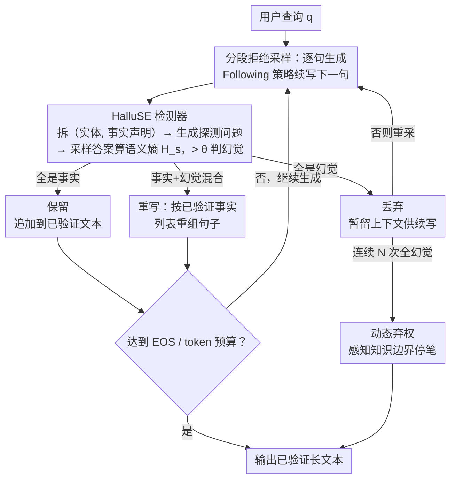

# Building Reliable Long-Form Generation via Hallucination Rejection Sampling

**会议**: ICML 2026  
**arXiv**: [2606.03628](https://arxiv.org/abs/2606.03628)  
**代码**: https://github.com/TreeLLi/hallucination-rejection-sampling  
**领域**: LLM评测  
**关键词**: 幻觉缓解, 推理时计算, 语义熵, 拒绝采样, 长文本生成  

## 一句话总结

提出 SHARS 框架，在推理时逐句检测并拒绝幻觉内容、仅保留经验证的事实段落继续生成，配合改进的语义熵检测器 HalluSE，在 FactScore 上将事实精度提升约 20–26%，同时保持甚至增加生成中的事实信息量。

## 研究背景与动机

**领域现状**：大语言模型在开放式长文本生成中表现出色，但幻觉问题严重影响可靠性。现有缓解方法主要分为训练时方法（如 DPO 偏好优化、FactAlign 句级奖励）和推理时方法（如 DoLa 层间对比解码、RAG 检索增强）。

**现有痛点**：长文本生成中存在 **幻觉雪球效应**（hallucination snowballing）——早期生成的错误会传播并放大后续输出中的错误。现有推理时方法要么需要外部知识库（RAG），要么仅在 token 级别干预（DoLa），无法有效阻断错误的逐句累积。

**核心矛盾**：开放式问题通常有无限多的有效回答信息，但模型实际只使用其中有限子集。如果能过滤掉幻觉内容并引导模型探索剩余信息空间中的真实内容，就能打破错误链式传播。

**本文目标**：设计一个通用的推理时框架，能够 (1) 逐段检测并拒绝幻觉内容，(2) 仅在已验证的事实基础上继续生成，(3) 不依赖外部知识库即可工作。

**切入角度**：作者观察到推理时计算扩展（inference-time compute scaling）范式在事实性方面尚未被充分探索，且用户在高风险场景中愿意用更多推理时间换取更可靠的输出。

**核心 idea**：用分段拒绝采样（segment-wise rejection sampling）逐句过滤幻觉，仅在已验证的事实上继续生成，从源头阻断幻觉雪球效应。

## 方法详解

### 整体框架

SHARS 把"逐句生成—逐句验证"拧成一个闭环：给定查询 $q$，模型每吐出一句话就立刻交给幻觉检测器 HalluSE 验真，根据结果保留、重写或丢弃，然后只在已经过验证的文本上继续往下写。直到模型生成 EOS、撞上最大 token 预算、或连续 $N$ 次采样都是幻觉时才停笔。这样错误在刚冒头的那一句就被拦下，不会顺着上下文滚雪球。

### 关键设计

**1. 分段拒绝采样：把整篇拒绝拆到每一句**

长文本幻觉最棘手的地方在于雪球效应——早期写错一个事实，后面会顺着这个错误越编越多。传统 best-of-N 是整篇生成完再挑一个最好的，粒度太粗，错误早已蔓延。SHARS 改成对**每一句**动态做拒绝采样：当前句生成后，检测器先把它拆成一组事实声明并逐个判真伪，然后分三种情况处理——整句全是幻觉就直接丢；事实与幻觉混在一起就让 LLM 重写、只保留被验证的部分；全是事实就原样留下。重写时有个反直觉的细节：与其"告诉模型删掉这些幻觉",不如"把验证过的事实列给模型让它重新组句"，实验发现后者在中小模型上明显更稳。采样下一句时用 **Following 策略**——把已识别的幻觉句临时留在上下文里让模型接着写，借模型自身的内容规划能力避免反复生成同类知识；但这些幻觉句不参与后续的语义熵计算，以免污染检测信号。在最早的那一句就干预，正是阻断雪球的最高效切口。

**2. HalluSE 检测器：给语义熵补上三个长文本场景的漏洞**

朴素语义熵在长文本上不够准，HalluSE 针对性地补了三处。其一，把文本拆成 (实体, 事实声明) 对而非单纯的事实声明，避免探测时实体指代歧义；其二，为每个事实生成 $Q$ 个探测问题，用改进的提示确保问题的预期答案唯一不含糊；其三，对每个问题采样 $A$ 个答案时显式要求 LLM 列出所有有效答案，堵住"多个正确答案被误判为高熵"这个虚高来源。最后对各问题算语义熵再取平均，超过阈值 $\theta$ 即判为幻觉。语义熵定义为 $H_s = -\sum_i p(C_i) \log p(C_i)$，其中 $C_i$ 是把语义等价的答案聚到一起的语义簇，$p(C_i) = \sum_{y \in C_i} p(y)$——一个事实如果模型确信，多次采样的答案会聚成一簇、熵低；若是编造，答案会发散、熵高。

**3. 动态弃权：让模型自己感知知识边界**

当连续 $N$ 次重采新句都被判成全幻觉时，SHARS 就终止生成、选择弃权。这种弃权既可能发生在开头（模型对整个问题一无所知），也可能发生在中途（模型把确信的部分写完后及时收笔）。它不需要额外校准，纯粹是反复采样失败后的自然停止，本质上就是对模型参数化知识边界的感知。更妙的是，调节检测阈值 $\theta$ 就能平滑地在"响应率"和"事实精度"之间滑动——$\theta$ 收紧则更保守、宁可不答也不错答，放宽则多答但精度略降，把这个 trade-off 的旋钮交到了使用者手里。

## 实验关键数据

### 主实验

在 FactScore 基准上的无长度约束评测（Qwen3-32B）：

| 方法 | 响应率(%) | 不支持事实数 | 支持事实数 | 事实精度(%) |
|------|-----------|-------------|-----------|------------|
| Greedy | 99.5 | 8.8 | 9.7 | 52.4 |
| DoLa | 95.6 | 9.3 | 8.2 | 53.1 |
| ChatProtect | 98.9 | 8.1 | 6.8 | 54.4 |
| Self-Endorse | 91.8 | 4.9 | 8.4 | 63.2 |
| **SHARS-Info** | **92.9** | **4.2** | **11.7** | **73.5** |
| **SHARS-Prec** | **82.4** | **3.1** | **11.1** | **78.4** |

FactualBio 幻觉检测评测（Qwen3-32B，Major+Minor）：

| 方法 | AUROC | AURAC | Acc@0.8 | Acc@0.9 |
|------|-------|-------|---------|---------|
| Self-Check | 57.6 | 69.3 | 73.5 | 73.5 |
| P(True) | 69.8 | 73.3 | 70.0 | 70.0 |
| Naive SE | 66.2 | 73.1 | 70.5 | 70.5 |
| **HalluSE** | **72.9** | **77.3** | **75.4** | **72.8** |

### 消融实验

| 采样策略 | 重写 | 响应率(%) | 事实精度(%) | 相对耗时 |
|----------|------|-----------|------------|---------|
| Following | 是 | 91.8 | 69.4 | 1.00× |
| Temperature | 是 | 95.6 | 64.8 | 1.01× |
| Following | 否 | 54.4 | 73.5 | 1.60× |
| Temperature | 否 | 40.1 | 76.2 | 1.55× |

### 关键发现

- **SHARS 框架与检测器均有贡献**：即使将语义熵替换为朴素 token 级熵（Ours-NE），事实精度仍达 70.1%，超过最强 baseline Self-Endorse（63.2%），说明框架本身的分段拒绝策略是有效的
- **与训练时方法互补**：在 FactAlign 基础上叠加 SHARS，事实精度从 53.1% 提升至 80.6%（无长度约束），说明推理时和训练时方法可以协同
- **小模型同样有效**：Qwen3-4B 上获得 +16–24% 精度提升，表明方法不依赖强指令跟随能力
- **重写对响应率至关重要**：关闭重写后响应率从 91.8% 骤降至 54.4%，因为混合型句子被整体丢弃导致大量弃权；Following 策略比 Temperature 策略在支持事实数和精度上均更优

## 亮点与洞察

- **推理时事实性扩展的新范式**：首次系统展示了推理时计算扩展在开放式生成事实性上的 scaling 特性——在合理范围内增加推理计算量可以持续提高事实精度，且效率远优于 Self-Endorse 等方法（相同精度下计算量低 2–3 倍）
- **正面示例重写优于负面删除**：发现让 LLM 根据经验证的事实列表重组句子，比给出原句加标注让其删除幻觉部分效果更好，这一发现在中小模型上尤为显著，对其他 LLM 后处理任务也有借鉴意义
- **知识边界的自发感知**：弃权机制不需要额外的校准，模型在反复采样失败后自然停止，本质上实现了对自身参数化知识边界的感知

## 局限与展望

- 方法不引入外部知识，若模型对某主题完全无知，拒绝采样无法产生新的正确信息，仅能选择弃权
- 推理时计算开销仍较高（约 10–50× Greedy），虽然优于同精度的 baseline，但在延迟敏感场景下仍有挑战
- 当前仅用于英文事实性评测，跨语言和非事实性幻觉（如逻辑不一致）场景尚未验证
- 可改进方向：(1) 与 RAG 结合弥补模型知识盲区；(2) 蒸馏检测器为轻量探针降低开销；(3) 探索更高效的批量句子级检测方法

## 相关工作与启发

- **Semantic Entropy** (Farquhar et al., 2024)：HalluSE 的基础方法，本文针对长文本场景做了实体分解、提示改进和多有效答案三方面改进
- **FactAlign** (Huang & Chen, 2024)：训练时句级事实奖励方法，与 SHARS 正交互补
- **DoLa** (Chuang et al., 2024)：层间对比解码，token 级干预粒度较细但无法阻断句级错误传播
- **Self-Endorse** (Wang et al., 2024)：自一致性验证方法，精度较高但计算开销更大

<!-- RELATED:START -->

## 相关论文

- [\[ACL 2025\] Atomic Calibration of LLMs in Long-Form Generations](../../ACL2025/llm_evaluation/atomic_calibration_of_llms_in_long-form_generations.md)
- [\[ICML 2026\] Automatic Layer Selection for Hallucination Detection](automatic_layer_selection_for_hallucination_detection.md)
- [\[ICML 2026\] When Hallucination Costs Millions: Benchmarking AI Agents in High-Stakes Adversarial Financial Markets (CAIA)](when_hallucination_costs_millions_benchmarking_ai_agents_in_high-stakes_adversar.md)
- [\[ICLR 2026\] How Reliable is Language Model Micro-Benchmarking?](../../ICLR2026/llm_evaluation/how_reliable_is_language_model_micro-benchmarking.md)
- [\[ACL 2025\] Pap2Pat: Benchmarking Outline-Guided Long-Text Patent Generation with Patent-Paper Pairs](../../ACL2025/llm_evaluation/pap2pat_benchmarking_outline-guided_long-text_patent_generation_with_patent-pape.md)

<!-- RELATED:END -->
