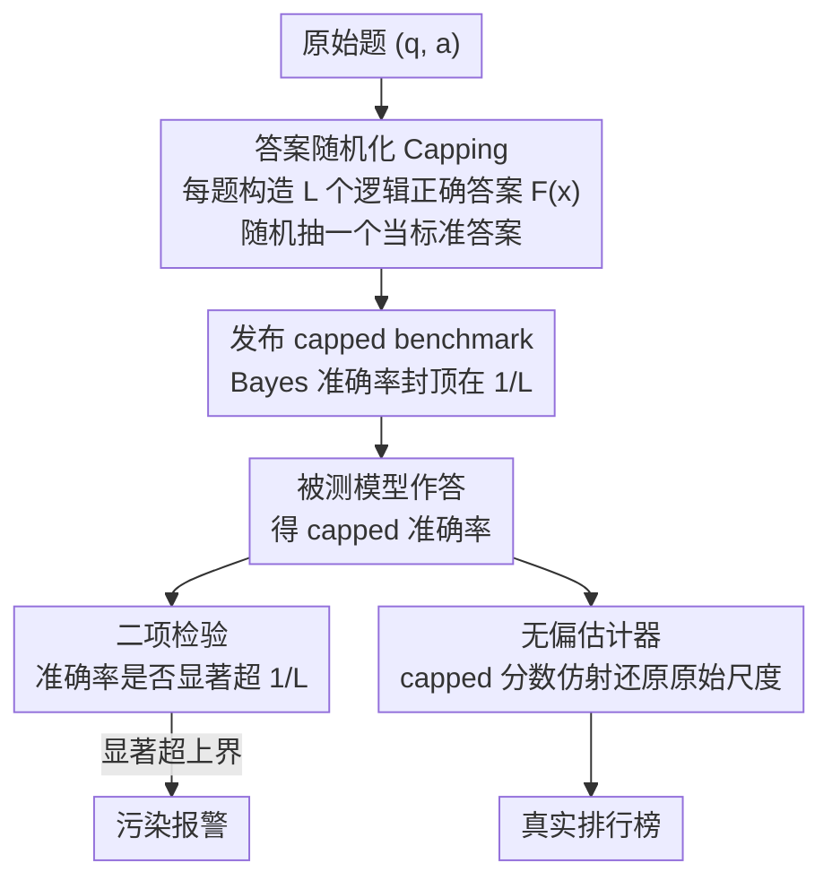

# CapBencher: Give Your LLM Benchmark a Built-in Alarm for Test-Set Overfitting

**会议**: ICML 2026  
**arXiv**: [2505.18102](https://arxiv.org/abs/2505.18102)  
**代码**: https://github.com/TakashiIshida/capbencher  
**领域**: LLM评估  
**关键词**: LLM基准测试, 数据污染检测, Bayes准确率, 测试集过拟合, 排行榜攻防  

## 一句话总结
CapBencher 通过为每道题注入随机性（生成多个逻辑正确答案并随机选一个作为标准答案），将 benchmark 的 Bayes 准确率降到可控水平（如 50%），从而在公开发布 benchmark 的同时实现数据污染的黑盒统计检测——任何准确率显著超过 Bayes 上界的模型都被判定为存在污染。

## 研究背景与动机

**领域现状**：构建现代 LLM benchmark 越来越昂贵——FrontierMath 需要 60+ 位专业数学家（含 IMO 金牌和 Fields 奖得主），Humanity's Last Exam 汇集了 50 个国家的 1000+ 专家贡献者。这些高投入的 benchmark 一旦在互联网公开答案，就可能被有意或无意地纳入 LLM 训练数据。

**现有痛点**：主流应对策略是"私有评测"：保持 benchmark 私有，参赛者提交模型或预测到评测服务器。但这种方式仍无法抵御通过反复提交（repeated queries）的排行榜攻击（leaderboard hacking），且缺乏有效的统计检测手段。现有污染检测方法（如 Min-k%/Min-k%++）要么需要访问模型 logits（对闭源模型不可用），要么使用 canary string（可被恶意删除），且不支持严格统计检验。

**核心矛盾**：公开发布 benchmark 利于社区开放评测，但公开答案会导致数据污染和测试集过拟合——"开放性"和"评测安全性"之间存在根本矛盾。

**本文目标**：设计一种 benchmark 发布协议，在不完全暴露真实答案的前提下，既保留开放评测能力，又提供内置的污染检测机制。

**切入角度**：作者观察到，如果我们能控制 benchmark 的 Bayes 准确率上界，那么任何超过该上界的模型表现就构成了污染的统计证据。关键洞察是：我们作为 benchmark 设计者，可以主动降低 Bayes 准确率。

**核心 idea**：为每道题准备多个逻辑正确的答案，随机选一个作为标准答案，从而将 Bayes 准确率"封顶"（cap），使 benchmark 同时具备评测功能和污染报警功能。

## 方法详解

### 整体框架
CapBencher 的核心想法是：与其事后被动检测污染，不如在发布 benchmark 时就主动把"标准答案"做成随机的，让任何记住答案的模型反而暴露破绽。它分两阶段运转——**发布阶段**对原始 benchmark 每道题 $(q,a)$ 注入随机性，生成一个真实答案被混淆的 capped 版本 $(q',a')$ 公开发布；**检测阶段**对任意被测模型，用单侧二项检验判断它的准确率是否显著超过一个由设计者预设的 Bayes 上界，超过即判定为污染。三个关键设计分别回答了"怎么造随机答案"、"怎么把超标判成污染"、"混淆了答案还能不能排名"这三件事。

### 关键设计

**1. 答案随机化（Capping）：把 Bayes 准确率主动封顶**

公开答案会被训练数据吸收，根源在于每道题只有一个确定的标准答案——模型一旦记住就能拿满分。CapBencher 的做法是给每道题 $x$ 构造一个含 $L$ 个**逻辑都正确**的答案集合 $F(x)$，然后均匀随机抽一个当作官方标准答案 $Y'$。比如把"3×6=?"改写成"从 $[1,5]$ 随机选一个数加到答案上"，于是正确答案可能是 17、19 而不再固定是 18。这样一来，即便一个模型完全掌握了底层知识，它也无从知道这次抽中的是哪个，期望命中率被"封顶"在 $1/L$——这就是设计者主动设定的 Bayes 准确率上界。$L$ 是一个旋钮：调大它检测越灵敏（合理性能离上界越远），但 capped 分数方差也越大、排名越糊。落地上分两种策略，**Obfuscation**（真实答案被彻底隐藏，用于直接回答题和选择题）和 **Disclosure allowed**（真实答案可见、只附加随机标签，用于较良性的威胁模型）。

**2. 二项检验：把"超过上界"翻译成严格的污染证据**

有了 $1/L$ 这个上界，污染判定就变成一个干净的假设检验问题。零假设设为"模型真实性能不超过 Bayes 准确率 $\alpha$"；在该假设下，$n$ 道题里答对的数目服从二项分布 $\text{Binom}(n,\alpha)$，于是观测到答对 $k$ 题的单侧 p 值就是

$$p = \sum_{i=k}^{n}\binom{n}{i}\alpha^{i}(1-\alpha)^{n-i}.$$

p 值足够小就拒绝零假设、判定污染。由 Karlin–Rubin 定理，这个单侧检验是一致最优势检验（UMP），也就是同等显著性水平下检测力最强；而当精确 Bayes 准确率未知时，可直接用 Corollary 1 给出的上界 $1/L$ 代入 $\alpha$。相比 Min-k% 之类需要在验证集上调 AUC 阈值的方法，二项检验给的是精确 p 值、小样本也成立，且全程只用模型的对错结果、不碰任何 logits 或模型内部。

**3. 无偏估计器：混淆了答案仍能还原真实排名**

随机化答案带来一个副作用——capped 分数不再等于模型在原 benchmark 上的真实分数，直接拿它排名会失真。作者证明二者之间是一个干净的仿射关系：

$$s_{\text{capped}}(X) = \Big(\frac{1}{L} - \frac{L-1}{L(K-1)}\Big)\,s_{\text{orig}}(X) + \frac{L-1}{L(K-1)},$$

其中 $K$ 是选项数、$L$ 是随机答案数。既然是线性变换，就能反解出原始分数的无偏估计器 $\hat{A}$，把 capped 分数"翻译"回原始尺度。代价只是方差温和上升（如 MMLU 上标准差从 0.003 升到 0.012），实测排名相关性 Kendall's $\tau=0.92$，几乎不损失排序信息。正是这层仿射关系，让 CapBencher 在隐藏答案的同时仍保有一个可靠的排行榜。

## 实验关键数据

### 主实验：污染检测

在 12 个 benchmark 上用多个模型家族（Llama、Qwen、DeepSeek）进行持续预训练污染实验：

| 模型 | Benchmark | 未污染准确率 | 污染后准确率 | Bayes 上界 | 检测结果 |
|------|-----------|------------|------------|-----------|---------|
| Qwen 2.5-14B | GSM8K | ~40% | >50% | 50% | ✅ 检测到（更少 epoch） |
| Qwen 2.5-3B | GSM8K | ~35% | >50% | 50% | ✅ 检测到（更多 epoch） |
| Llama 3.2-3B-Instruct | GSM8K (α=50%) | — | >50% | 50% | ✅ epoch 6 检测到 |
| Llama 3.2-3B-Instruct | GSM8K (α=25%) | — | >25% | 25% | ✅ epoch 5 检测到 |
| Llama 3.2-3B-Instruct | GSM8K (α=10%) | — | >10% | 10% | ✅ epoch 4 检测到 |

### 与 baseline 方法对比

| 检测方法 | 需要模型内部 | 可被绕过 | 支持统计检验 | 全 benchmark 检测成功 |
|---------|------------|---------|------------|-------------------|
| CapBencher | ❌ | 部分（RE） | ✅ 精确 p 值 | ✅ 所有 dataset |
| Canary String | ✅ (log prob) | ✅ (删除 canary) | ❌ 近似 | ✅ 但不稳定 |
| Min-k% | ✅ (logits) | — | ❌ 无阈值理论 | ❌ (GPQA 失败) |
| Min-k%++ | ✅ (logits) | — | ❌ 无阈值理论 | ❌ (GPQA 失败) |

### 排行榜攻击检测（模型合并）

| 模型 | 准确率 (%) | 是否检测到 |
|------|-----------|-----------|
| Qwen 2.5-7B-Instruct | 39.87 ± 2.32 | — |
| DeepSeek-R1-Distill-Qwen-7B | 40.02 ± 2.01 | — |
| Qwen 2.5-Math-7B-Instruct | 41.02 ± 2.12 | — |
| 合并模型 (1+2+3) | 56.52 ± 2.04 | ✅ 显著超过 50% |

### 关键发现
- 更大的模型在更少的 epoch 内即可被检测到污染（与 Carlini et al. 2023 一致），说明 CapBencher 对大模型更灵敏
- 降低 Bayes 准确率（如从 50% → 10%）可提前检测污染，但会增加排名估计方差——存在灵敏度 vs 精度的 trade-off
- 跨语言实验中，MMLU-ProX 上所有语言均可检测污染；GSM8K（无推理链）仅欧洲语言可检测——推理过程的加入显著降低了跨语言污染的可检测性
- 逆向工程（RE）实验表明，即使向模型提供混淆答案和随机化规则，当前前沿模型也无法可靠恢复真实答案（如 HLE-MC 上 RE 准确率远低于 50%）

## 亮点与洞察
- **benchmark 的主动防御设计**：不同于被动检测污染，CapBencher 让 benchmark 设计者在发布时就植入检测机制——"给 benchmark 装一个内置报警器"。这种主动防御思维可迁移到其他数据泄露场景（如私有数据集的水印设计）
- **从经典统计借力**：利用 Bayes 错误率的经典概念，但创新地将"估计 Bayes 错误率"翻转为"控制 Bayes 准确率"，使原本被动的理论工具变成主动的设计参数
- **仿射变换保排名**：capped 和原始分数之间的仿射关系不仅支持无偏恢复，还天然保证了模型排名的单调性，这一理论保证使方法实用价值大增

## 局限与展望
- 随机化答案仍会泄露弱信号（如答案 19 暗示真值可能是 18 或 20），未来更强的模型可能利用这一线索逆向工程
- 对于 open-ended 生成任务（如自由文本、长文档生成），构造多个"逻辑正确答案"集合 $F(x)$ 较为困难，限制了适用范围
- capped 分数的方差随 $L$ 增大而增大，在小规模 benchmark（如 GPQA-diamond, $n=198$）上排名相关性明显下降（$\tau$ 降至 0.67）
- 未来方向包括更强的混淆策略、零知识证明等密码学扩展、以及针对更强 RE 攻击者的鲁棒性评估

## 相关工作与启发
- **数据污染检测**：Min-k%/Min-k%++（需要 logits）、canary string（可被删除）；CapBencher 统一了"防御"和"检测"
- **动态 benchmark**：如 LiveBench、DynaBench，通过持续生成新题目避免污染，但受限于可自动生成解的领域；CapBencher 适用于无高效算法的专家级问题
- **Bayes 错误率估计**：经典统计中估计 Bayes 错误率的工作（Fukunaga & Hostetler 1975 等）为本文提供理论基础，但本文独特之处在于"设计"而非"估计"Bayes 准确率

<!-- RELATED:START -->

## 相关论文

- [\[AAAI 2026\] LLM-as-a-Judge for Scalable Test Coverage Evaluation](../../AAAI2026/llm_evaluation/llm-as-a-judge_for_scalable_test_coverage_evaluation_accuracy_operational_reliab.md)
- [\[ACL 2026\] MultiFileTest: A Multi-File-Level LLM Unit Test Generation Benchmark and Impact of Error Fixing Mechanisms](../../ACL2026/llm_evaluation/multifiletest_a_multi-file-level_llm_unit_test_generation_benchmark_and_impact_o.md)
- [\[NeurIPS 2025\] Your Pre-trained LLM is Secretly an Unsupervised Confidence Calibrator](../../NeurIPS2025/llm_evaluation/your_pre-trained_llm_is_secretly_an_unsupervised_confidence_calibrator.md)
- [\[ACL 2026\] How Hypocritical Is Your LLM Judge? Listener–Speaker Asymmetries in the Pragmatic Competence of Large Language Models](../../ACL2026/llm_evaluation/how_hypocritical_is_your_llm_judge_listener-speaker_asymmetries_in_the_pragmatic.md)
- [\[ICML 2026\] REAL：把回归感知奖励塞进 RL，让 LLM-as-a-Judge 学会"差一分也是差"](real_regression-aware_reinforcement_learning_for_llm-as-a-judge.md)

<!-- RELATED:END -->
