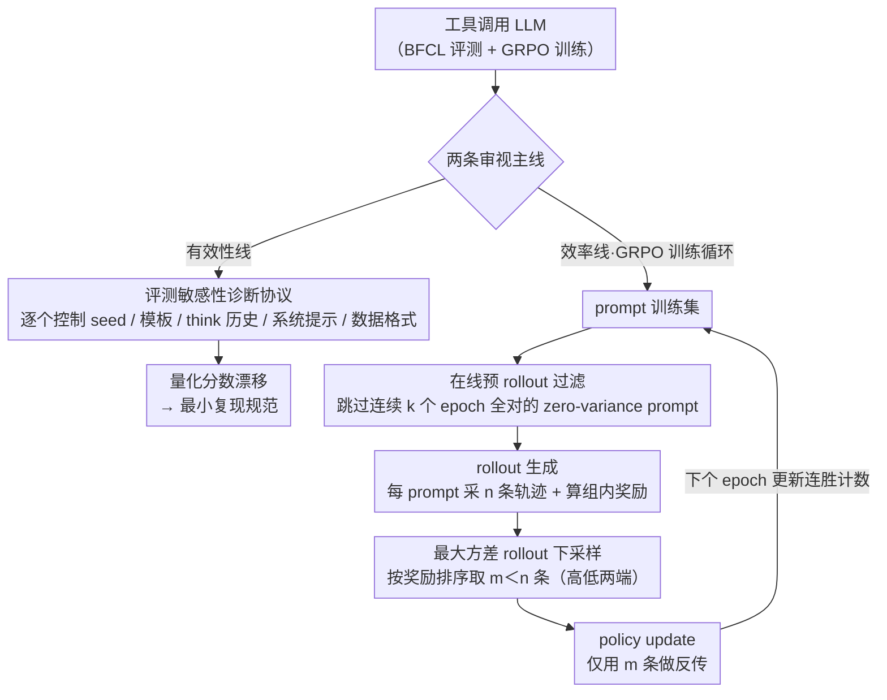

# On Effectiveness and Efficiency of Agentic Tool-calling and RL Training

**会议**: ICML 2026  
**arXiv**: [2606.00135](https://arxiv.org/abs/2606.00135)  
**代码**: 待确认  
**领域**: LLM Agent / 工具调用 / 强化学习  
**关键词**: 工具调用、BFCL、GRPO、评测复现性、RL效率

## 一句话总结
作者从「评测有效性」和「训练效率」两条主线系统审视 LLM 工具调用：一方面用 BFCL 作为案例证明随机种子、多轮模板、思考历史、系统提示等"小细节"能让排行榜分数大幅漂移，使跨论文比较不可靠；另一方面定位 RL（GRPO）训练中 rollout 和 policy update 两个阶段的浪费，提出"在线预 rollout 过滤 + 最大方差 rollout 下采样"两件套，在单轮/多轮工具调用上实现 1.7× 和 2.6× 端到端加速且性能不降。

## 研究背景与动机

**领域现状**：工具调用（function calling）已成为现代 LLM agent 的核心能力，社区围绕 BFCL、Tau-bench 等 benchmark 排名次第，并普遍采用 PPO/GRPO 等 RL 方法做 post-training 来提升调用准确率与鲁棒性。

**现有痛点**：一边是评测口径混乱——绝大多数工具调用论文只跑一个 seed、用各自的多轮拼接方式、各自的系统提示，却在 leaderboard 上比绝对分数；另一边是 RL 训练吃算力凶猛——多轮工具调用的上下文极长（含工具 schema、对话历史、tool I/O），policy update 阶段壁钟时间甚至能比 rollout 还高 3–5×。

**核心矛盾**：评测端的"隐式自由度"和训练端的"沉默浪费"同时存在却被忽视。前者让方法的真实增量被淹没在评测噪声里；后者让 RL 训练把大量算力花在零梯度的样本上。两者叠加导致"看起来涨了 5 个点"既可能是真增益、也可能只是换了个 prompt 或多跑了几个 seed，社区难以判断哪些方向真正值得投入。

**本文目标**：(1) 系统量化 BFCL 这类工具调用评测对实现细节的敏感度，给出最低限度的复现规范；(2) 定位 RL 工具调用训练中两个具体的浪费源，给出几乎无侵入的加速方案。

**切入角度**：评测侧，作者把"管道里的每一个未文档化选择"当成独立变量做控制实验（seed、template、history、prompt、训练数据格式）。训练侧，作者把 GRPO 拆开看每一步的 rollout 奖励方差和壁钟时间分布，发现 "zero-variance prompts" 高达 80% 且具有显著时间稳定性——这条经验观察直接催生了在线过滤策略。

**核心 idea**：工具调用的进步要建立在受控评测之上；而 RL 训练的算力应当优先花在"还能学到东西"的 prompt 和"奖励对比最强"的 rollout 上。

## 方法详解

### 整体框架
论文不提单一新模型，而是沿两条线索给工具调用"做体检"：有效性线在 BFCL 上对 5 个常用模型（Qwen3-4B/8B、Qwen2.5-7B-Instruct、Llama3.1-8B-Instruct、Llama3.2-3B-Instruct）逐项控制实验，量化随机种子、多轮模板、思考历史、系统提示、单/多轮数据格式这些"隐式选项"到底能让分数漂多少；效率线在 VERL 框架内用 GRPO 训练 Qwen2.5-3B-Instruct（单轮）和 Qwen3-4B（多轮），把 rollout 与 policy update 两阶段的计算和壁钟时间拆开看，找出浪费再各给一个近乎无侵入的补丁。

两条线共用同一套 GRPO 形式化：对样本 $s_{i,k}$ 采样 $n$ 条 rollout $\{y_{i,k+1,j}\}$，得到奖励后做组内归一化 $A_{i,k+1,j}=(r_{i,k+1,j}-\bar r_{i,k+1})/\sigma_{i,k+1}$，再以裁剪重要性比 $\rho_{i,k+1,j}=\pi_\theta/\pi_{\text{old}}$ 进入裁剪目标。当某 prompt 的所有 rollout 奖励相同时 $\sigma=0$、$A\equiv 0$，称为 **zero-variance prompt**——它对梯度毫无贡献，却照样耗掉一整轮 rollout，是后文所有效率优化的靶点。

### 关键设计

**1. 评测敏感性诊断协议：把"我们用 BFCL 评测"这句话背后的隐式选项逐个拎出来量化**

工具调用论文几乎都只跑一个 seed、用各自的多轮拼接方式和系统提示，却在 leaderboard 上比绝对分数。作者的做法是固定模型、每次只动一个变量做控制实验：(a) 跑 10 个 seed 看方差，发现单轮稳定但多轮波动显著，于是后文统一报告 3-seed 平均；(b) 对比 native template（按官方 chat template 逐 turn 拼）与 context template（把整段对话塞进单个 user turn），同样的信息只是换了拼法，native 在 Qwen3-8B/4B、Qwen2.5-7B 上就稳定领先 $6\text{–}8\%$；(c) 是否保留 `<think>` 段，Qwen3 留着思考历史多 $3\text{–}5\%$；(d) 只手工往系统提示里加几条多轮专用指令，Qwen3-4B 的多轮分提升幅度就和整套 RL 训练相当；(e) 在固定 0.7k 数据预算下对比纯单轮 vs 纯多轮训练，反直觉地发现纯多轮反而把多轮 BFCL 从 22.7 拉到 15.9。

这套协议之所以重要，是因为它直接证明"排行榜数字 ≠ 模型能力"：当一个 prompt 改写就能制造出与 RL 持平的增益，那么不报告 seed/template/history/system prompt 的 leaderboard 比较就基本失去意义。它顺带给出工具调用评测必须固定的最小集合，并暗示多轮数据本身可能是"噪声训练信号"——错误在 trajectory 中累积，早期被标成"正确"的 turn 很可能编码了次优决策。

**2. 在线预 rollout 过滤：在掏钱生成 rollout 之前，先把近期一直全做对的 prompt 跳过**

zero-variance prompt 的优势恒为零，为它生成 rollout 纯属浪费，而早期这类 prompt 占比高达 $80\%$。能不能一次性提前过滤掉？不行——prompt 的"难度"会随策略演化漂移，本来全对的后来可能全错，静态过滤会误删尚有学习信号的样本。作者的关键观察是这种"全对"具有时间稳定性：条件概率 $P(\text{仍全对}\mid\text{连续 }k\text{ 个 epoch 全对})$ 在 $k=1$ 时单轮已 $>0.8$、多轮 $>0.9$。于是给每个 prompt 维护一个"连胜计数" $c_{i,k+1}^{(e)}$，上个 epoch 全对就加一、否则清零，当 $c \ge k$ 时本 epoch 临时把它剔出训练集 $\mathcal{D}^{(e)}=\{s : c_{i,k+1}^{(e)} < k\}$。

在线、滑窗、保守三个特性合在一起，既大幅砍掉 rollout 计算又几乎不误伤。和数学推理里需要较长窗口判难度漂移不同，工具调用的 zero-variance 时间稳定性足够强，$k=1$ 或 $2$ 的极短窗口就够安全，实现也比复杂调度简单得多。

**3. 最大方差 rollout 下采样：照样生成 $n$ 条 rollout，但只挑 $m<n$ 条做反传**

作者剖析 VERL 上每步壁钟时间，发现工具调用的瓶颈和数学推理截然不同：policy update 时间随 $n$ 涨得比 rollout 快得多，即便 $n=4$ 时 update 也已主导总时长——根源是序列里塞满了工具 schema、多轮 context 和 tool I/O，反传 token 数远大于纯数学题。既然 rollout 需要 $n$ 大才能拿到稳的组内基线、而 update 又被序列长度卡死，那就"生成多、更新少"：沿用 Xu et al. 2025 的思路，把 $n$ 条 rollout 按奖励排序，取 $m'$ 条最低奖励 + $m-m'$ 条最高奖励组成子集 $\mathcal{S}^*$ 使组内奖励方差最大（二值奖励 + 偶数 $m$ 时就退化成高/低各取 $m/2$），policy update 计算量随之近似按 $n/m$ 倍下降。

直觉上，对比最强的那对 rollout 携带最强的学习信号，扔掉中间"差不多"的样本对优势估计几乎没损失。它把两阶段的算力按各自瓶颈重新分配，恰好对症工具调用这种长上下文场景，也和设计 2 天然正交——一个剪 prompt 维度、一个剪 rollout 维度，可以直接叠加。

### 损失函数 / 训练策略
- RL 算法：GRPO，目标式同公式 (3)，clip 阈值 $\epsilon$ 使用 VERL 默认。
- 训练框架：VERL；单轮模型 Qwen2.5-3B-Instruct，多轮 Qwen3-4B；数据预处理后单轮 2.3k、多轮 2.6k（多轮后续扩到 6k 做 ACEBench）。
- 在线过滤超参：$k=1$ 或 $2$，按每 epoch 滚动更新连胜计数。
- 下采样超参：从 $n$ 条 rollout 中选 $m$ 条（论文实验典型 $n=8, m=4$ 量级），按高低奖励两端取。
- 评测：BFCL 默认 3 seed 平均，user simulator 用 Claude 4 并额外注入"以用户身份回答"约束；ACEBench 报告英文全类别 overall accuracy。

## 实验关键数据

### 主实验

BFCL 上与代表性开/闭源模型对比（Qwen3-4B 基线 + 强化版系统提示 + 本文 RL 训练，3 seed 平均）：

| 模型 | Multi-turn | Single-turn | Avg. |
|------|-----------:|------------:|-----:|
| Claude Sonnet 4.5 (FC) | 61.4 | 84.9 | 73.2 |
| Gemini-3-Pro-Preview (FC) | 63.1 | 83.8 | 73.4 |
| GPT-4.1-2025-04-14 (FC) | 38.9 | 76.4 | 57.7 |
| Qwen3-235B-A22B-Instruct-2507 (FC) | 45.4 | 53.2 | 49.3 |
| Qwen3-4B w. BFCL default prompt | 22.7±0.9 | 83.9±0.5 | 53.3±0.5 |
| Qwen3-4B w. stronger prompt | 37.2±1.4 | 84.8±0.7 | 61.0±0.8 |
| **Qwen3-4B-RL (ours)** | **39.4±0.7** | **84.8±0.9** | **62.1±0.5** |

ACEBench（英文全类别 overall accuracy）：本文 RL 训练把 Qwen3-4B 从 65.4 提到 77.5（+12.1），超过 Nova-1-Lite（73.4）与若干 24B+ 开源模型。

### 消融实验

| 配置 | BFCL Multi-turn | 说明 |
|------|----------------:|------|
| Qwen3-4B base | 22.7 ±0.9 | 默认 prompt + native template |
| → 改用 context template | ↓ ~6–8% | 同样信息，仅换拼接方式 |
| → 丢弃 `<think>` 历史 | ↓ ~3–5% (Qwen3) | 思考历史显著影响多轮一致性 |
| → 改用强化系统提示 | 37.2 ±1.4 | 仅 prompt 改动，涨幅与 RL 相当 |
| 纯单轮训练（0.7k 控制预算） | 20.2 ±0.6 | 多轮基本持平、单轮微升 |
| 纯多轮训练（0.7k 控制预算） | 15.9 ±0.4 | 多轮反而下降，提示多轮监督噪声大 |

效率消融（Qwen3-4B 多轮）：在相同壁钟预算下，vanilla GRPO vs GRPO + 两项加速，达到同等性能所需时间——单轮 1.7× 加速，多轮 2.6× 加速；下游通用任务（HellaSwag/MMLU/TruthfulQA/Winogrande）未见退化（如 MMLU 68.3→68.3、Winogrande 65.8→66.5）。

### 关键发现
- **评测脆弱性可与方法增益同量级**：单纯改写系统提示带来的多轮提升，能匹敌甚至超过 RL 训练带来的提升。这意味着不报告 prompt/template/seed 设置的 leaderboard 比较高度不可靠。
- **"多轮数据更好"是错觉**：在控制数据量的对照实验里，纯多轮训练反而降低多轮 BFCL 成绩——作者推测多轮 trajectory 含累积错误与歧义标签，"正确"早期 turn 可能编码了次优决策。这把社区对"多轮数据稀缺导致瓶颈"的默认假设打了个问号。
- **zero-variance prompt 占主导且具时间稳定性**：早期约 80% prompt 不产生梯度信号；连续 1 个 epoch 全对后近期继续全对的概率单轮 >0.8、多轮 >0.9，因此短窗在线过滤几乎无误伤即可大幅省 rollout。
- **工具调用 RL 的计算瓶颈在 update 而非 rollout**：与数学推理不同，工具调用即便 $n=4$ 时 policy update 已主导壁钟，根源是工具 schema + 多轮 context 把反传 token 数撑大。

## 亮点与洞察
- **把"评测自由度"当成一等公民来量化**：常被一句"我们使用 BFCL 评测"带过的所有隐式选项被一一控制实验，给出可比较的漂移幅度。这种把工程细节升格为研究对象的姿态对整个工具调用社区是必要的"打脸"。
- **诊断驱动设计的优雅范例**：两项加速都不是先有方法再找问题，而是先观察出"80% rollout 无梯度 + update 主导壁钟"，再各自给出最简单可行的对策（数计数 + 排序取两端），改动量极小却拿到 1.7×/2.6× 加速。这种"用经验测量约束算法搜索空间"的做法值得直接迁移。
- **"挑奖励方差最大子集"是普适 trick**：在所有用 group-based advantage 的 RL 算法（GRPO 家族）里，update 成本主导时都可以这样下采样。它和在线过滤天然正交——前者剪 prompt 维度，后者剪 rollout 维度，可以叠加。
- **对"多轮监督一定更好"的反证**：很多 agent 数据集投入大量人力收多轮轨迹，本文提示先关注质量而非数量。

## 局限与展望
- 评测侧主要以 BFCL（外加 ACEBench）为例，对 Tau-bench、Web/GUI agent 等更复杂的多轮场景未做完整复刻，结论的普适性需要后续验证。
- 训练侧只在 3B 与 4B 两个尺度、Qwen 系列上验证，未在 8B+ 或 Llama 系上系统复测；附录 G 提及更大模型有类似趋势，但缺端到端加速曲线。
- 在线过滤是"全对剔除"型，对"全错"prompt 的处理（同样零方差但有潜在课程学习价值）未深入讨论；保守窗口 $k$ 的取值对长训练的最终累计影响也只跑了短跨度。
- "多轮训练反而掉点"的解释停留在"标签噪声/错误累积"的定性层面，未给出数据质量与多轮收益曲线的清晰刻画；如何系统性提升多轮 trajectory 质量是公开问题。
- 评测中沿用 Claude 4 作为 user simulator 本身就引入了 simulator 偏置，与"勿让方法增益被实现细节淹没"的主张存在张力。

## 相关工作与启发
- **vs ToolRL / Tool-N1（工具调用 RL 训练）**: 两者关注"用什么数据 + 什么奖励训出更强工具调用"，本文则正交地审视"训练过程本身在哪里浪费、评测是否可信"。本文揭示 ToolRL 设置里 ~2.5% 多轮、Tool-N1 ~1.1% 多轮的混入策略很难严格归因，且指出他们汇报的多轮提升可能与 prompt/template 漂移混淆。
- **vs Hochlehnert et al. 2025（数学推理评测复现性）**: 同样关注"标准化评测降分"现象，本文把这一关切首次系统迁移到工具调用领域，并新增了多轮特有的 template/history 因素。
- **vs Xu et al. 2025（max-variance rollout 下采样）**: 本文复用了下采样思路并验证其对工具调用尤为有效——因为工具调用的 update 阶段比数学推理更主导壁钟；同时新加在线 pre-rollout 过滤一项，两者叠加。
- **vs Zheng et al. 2025（数学推理的 prompt 过滤）**: 数学推理需要较长窗口判断 prompt 难度漂移，本文凭对工具调用 zero-variance 时间稳定性的实证观测，证明 $k=1$/$2$ 已足够，简化了实现。

## 评分
- 新颖性: ⭐⭐⭐⭐ 评测侧的系统化诊断在工具调用领域是首次；训练侧两件套属于"组合现有 idea 但用对了场景"，工程价值显著。
- 实验充分度: ⭐⭐⭐⭐ 多 seed、多模型敏感性分析 + 控制变量数据消融 + BFCL/ACEBench 双 benchmark 验证 + 下游 4 任务不退化检查，覆盖到位；缺更大模型尺度。
- 写作质量: ⭐⭐⭐⭐ 双轴结构清晰，图 1–8 直接服务论证，公式与算法描述精准；附录细节充分。
- 价值: ⭐⭐⭐⭐⭐ 评测复现性指南可直接被社区采纳；加速方案对所有用 GRPO 训练工具调用 agent 的团队都立刻能用，且与训练目标解耦，落地门槛极低。

<!-- RELATED:START -->

## 相关论文

- [\[ICML 2026\] Toward Training Superintelligent Software Agents through Self-Play SWE-RL](toward_training_superintelligent_software_agents_through_self-play_swe-rl.md)
- [\[ICML 2026\] REAL：把回归感知奖励塞进 RL，让 LLM-as-a-Judge 学会"差一分也是差"](real_regression-aware_reinforcement_learning_for_llm-as-a-judge.md)
- [\[ICML 2026\] Agent World Model: Infinity Synthetic Environments for Agentic Reinforcement Learning](agent_world_model_infinity_synthetic_environments_for_agentic_reinforcement_lear.md)
- [\[ACL 2026\] Rethinking Meeting Effectiveness: A Benchmark and Framework for Temporal Fine-grained Automatic Meeting Effectiveness Evaluation](../../ACL2026/llm_evaluation/rethinking_meeting_effectiveness_a_benchmark_and_framework_for_temporal_fine-gra.md)
- [\[ICML 2026\] Beyond Trajectory-Level Attribution: Graph-Based Credit Assignment for Agentic Reinforcement Learning](beyond_trajectory-level_attribution_graph-based_credit_assignment_for_agentic_re.md)

<!-- RELATED:END -->
