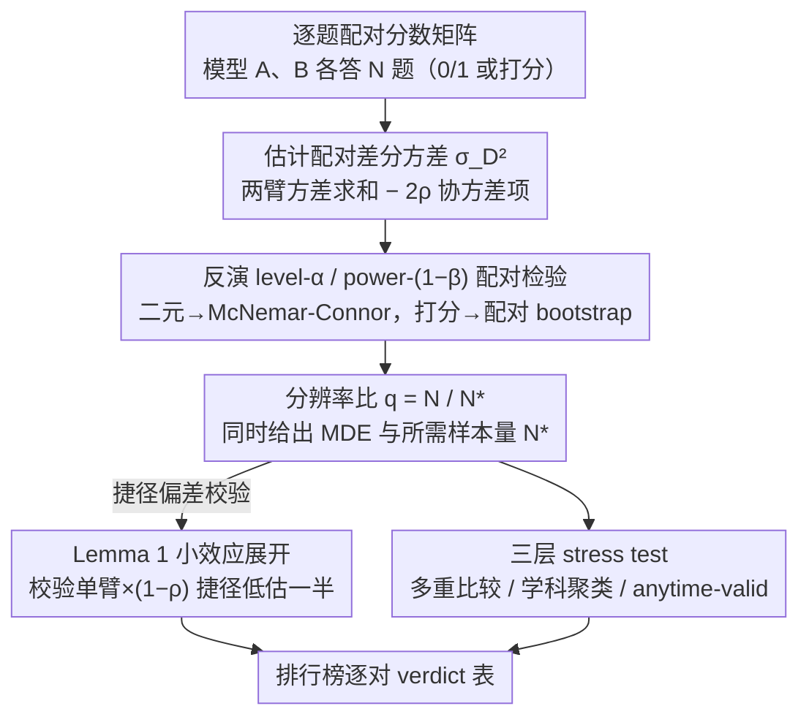

# Resolution Diagnostics for Paired LLM Evaluation

**会议**: ICML 2026  
**arXiv**: [2605.30315](https://arxiv.org/abs/2605.30315)  
**代码**: https://github.com/akotawala10/llm-power  
**领域**: LLM 评测 / 假设检验 / 排行榜统计  
**关键词**: 配对检验、McNemar、分辨率比、最小可检测效应、排行榜多重比较

## 一句话总结
本文把 LLM 排行榜上"A 比 B 高 0.X pp"的排名当作配对假设检验问题,通过反演 level-α / power-(1-β) 检验定义"分辨率比" $q=N/N^\star$,并证明常用计算器把单臂 Cohen-$h$ 公式乘 $(1-\rho)$ 这种捷径在小效应下会系统性低估所需样本量一倍,实测发现 Open LLM Leaderboard v1 有 11/40 对、MMLU-Pro top-10 相邻对有 4/9 在 $(\alpha,1-\beta)=(0.05,0.8)$ 下根本"分辨不出来",再叠加多重比较、真实学科聚类、anytime-valid 后这个数还会涨到 6/9。

## 研究背景与动机

**领域现状**:现代 LLM 排行榜把"模型 A 在某 benchmark 上得 78.3%,模型 B 得 77.5%"这样 0.8 pp 的微小差距直接转成头条和产品决策。学界对应的统计工具其实是经典的:二元正确率用 McNemar 配对检验 + Connor 1987 的样本量公式,连续打分用配对 $t$ 或配对 bootstrap。

**现有痛点**:Miller (2024) 给出的闭式 required-$N$ 公式是按非配对高斯写的;NLP/LLM 工作普遍直接套这个,或者拿 Cohen 1988、G*Power、R 的 `pwr` 包算非配对样本量再乘 $(1-\rho)$ 当配对校正用。结果是一堆排行榜上被宣称"显著"的相邻名次,在真正的配对设计下其实达不到 0.8 power 的目标分辨率。

**核心矛盾**:配对设计的真正方差是 $\sigma_D^2 = p_A q_A + p_B q_B - 2\rho\sqrt{p_A q_A p_B q_B}$,这是差分 $X^A-X^B$ 的方差,带两个臂的方差求和;而 $(1-\rho)$ 这种"通用配对调整"只是把单臂方差 $p(1-p)$ 缩了一下。把单臂结果乘 $(1-\rho)$,差了一个 $\text{Var}(X^A)+\text{Var}(X^B)$ 带来的因子 2。

**本文目标**:(1) 给排行榜评测一个标准化的"分辨率报告"协议;(2) 严格刻画上面那个捷径的偏差;(3) 在真实公开排行榜上跑一遍,看看到底有多少名次站不住脚。

**切入角度**:把"benchmark 大小 + 显示差距"当成一个假设检验设计参数,反演经典 Wald/McNemar-Connor 公式得到三个量——MDE(当前 $N$ 下的最小可检测效应)、$N^\star$(目标效应下所需配对样本量)、分辨率比 $q=N/N^\star$。$q\ge 1$ 才算"这个排行榜真的支撑得起这条结论"。

**核心 idea**:用 $q=N/N^\star$ 作为排行榜每对比较的一句话诊断量,并配一个尖锐的小效应展开引理 + 一个 pip 包 `llm-power`,把"配对检验该走多大样本"这件事从经验黑话变成可复核的标准报告。

## 方法详解

### 整体框架
框架接收任意配对 benchmark 上两个模型的逐题分数矩阵 $\{(X_i^A, X_i^B)\}_{i=1}^N$,输出三件事:(i) 当前 $N$ 下能区分的最小效应 $\delta_{\mathrm{MDE}}$;(ii) 给定目标效应 $\delta$ 所需的最小配对样本量 $N^\star$;(iii) 对已观测到的差距 $\hat\delta$ 计算 $q=N/N^\star(\hat\delta)$。所有量都通过反演双侧 level-$\alpha$、power-$(1-\beta)$ 配对 Wald 检验得到,二元情形对应 McNemar-Connor 公式,连续/打分情形对应配对 bootstrap。其中算对 $N^\star$ 是整条诊断的命门——本文用 Lemma 1 严格刻画了"拿单臂 Cohen-$h$ 公式乘 $(1-\rho)$ 当配对样本量"这个流行捷径在小效应下会系统性低估一半的偏差,防止诊断量本身被算错。最后整条流水线还能套上 Bonferroni/Holm/BH 多重比较、design effect 聚类校正、anytime-valid e-process 三种 stress test,组合成单个排行榜家族的端到端 verdict 表。

### 关键设计

1. **分辨率比 $q=N/N^\star$ 作为统一诊断量**:

    - 功能:把"这条排名靠不靠谱"压缩成一个无量纲数,$q\ge 1$ 表示当前 benchmark 大小足够支撑这条比较达到 $(\alpha,1-\beta)$ 分辨率,$q<1$ 表示分辨不出来。
    - 核心思路:反演 Wald 公式得 $N^\star(\delta;\alpha,\beta) = ((z_{1-\alpha/2}+z_{1-\beta})\sigma_D/|\delta|)^2$,把观测 $\hat\delta$ 代入算 $N^\star(\hat\delta)$,再和实际 $N$ 求比。单对情形下 $q$ 与 Wald 统计量平方一一对应($q\ge 1 \Leftrightarrow |T_N| \ge z_{1-\alpha/2}+z_{1-\beta}\approx 2.80$),所以单对没多余信息;真正的 value-add 在于聚合层——多重比较、聚类、anytime-validity 在 $q$ 尺度上的组合远比在 $p$ 值尺度上自然。
    - 设计动机:$q$ 明确表态"我不是说 A=B,我是说这个 benchmark 没有分辨这种差距的统计能力",规避了 Hoenig & Heisey (2001) 批评的"在观测效应上算 power"的误用陷阱;同时给排行榜维护方一个可直接挂在每行后面的 one-liner。

2. **小效应展开引理(Lemma 1)——量化"单臂公式乘 $(1-\rho)$"捷径的偏差**:

    - 功能:在 $p$ 附近、$\rho$ 在 Hoeffding 容许区间内,给出 $n_h/N^\star - 1/2$ 的显式二阶常数 $C(p,\rho)$,告诉你这个捷径什么时候差到不能用。
    - 核心思路:把 $h^2$(Cohen $h$ 的反正弦差)和 $\sigma_D^2$ 都在 $p_A=p+\delta/2$、$p_B=p-\delta/2$ 中点处 Taylor 展开,利用 $\arcsin\sqrt{\cdot}$ 的对称性消掉线性项,合并 $O(\delta^2)$ 修正得到 $n_h/N^\star = 1/2 - (\delta^2/2)[(1+\rho)(1-2p)^2/(16(1-\rho)u^2) - 1/(6u)] + O(\delta^4)$,其中 $u=p(1-p)$。常数 $C(p,\rho) = (1/2)|(1+\rho)(1-2p)^2/(16(1-\rho)p^2(1-p)^2) - 1/(6p(1-p))|$;在 $p=1/2$ 处 $(1-2p)^2$ 项消失,$C(1/2,\rho)=1/3$ 与 $\rho$ 无关。推论 1 给出可用的 $\delta^\star(p,\rho,\epsilon)=\sqrt{\epsilon/C(p,\rho)}$,告诉用户"小到什么程度时这个捷径还能用"。
    - 设计动机:工业界的统计软件(Cohen 1988 教科书公式、G*Power 3.1、R 的 `pwr::pwr.2p.test`)默认返回单臂 $K/h^2$ 样本量,用户自己乘 $(1-\rho)$ 当配对结果。本引理把这个长期模糊的"差不多翻倍"严格写成 $O(\delta^2)$ 阶可计算偏差,既给理论支撑也给一个 pre-screen 工具——在排行榜相邻对 $|\hat\delta| \le 5$ pp 这种 close-comparison regime,捷径稳定地把 $N^\star$ 低估一半,verdict 会从"分辨不出来"翻成"显著"。论文实测 5 个常用计算器中 3 个(Cohen / G*Power / R pwr)中招,只有 `statsmodels.NormalIndPower` 用 $2K/h^2$ 约定和作者自己的 `llm_power` 直接算 $\text{Var}(\Delta)/\delta^2$ 不踩坑。

3. **多重比较 / 聚类 / anytime-valid 三层 stress test 联合堆叠**:

    - 功能:在同一个排行榜家族上同时报告 fixed-$n$、Bonferroni/Holm、真实学科聚类、anytime-valid 四种范式下的"未分辨对数",看 verdict 在哪些层面被收紧。
    - 核心思路:多重比较把 $\alpha$ 换成 $\alpha/m$(Bonferroni)或 BH 调整后的 $\alpha'$,$N^\star$ 乘 $((z_{1-\alpha'/2}+z_{1-\beta})/(z_{1-\alpha/2}+z_{1-\beta}))^2$;聚类把 IID $N^\star$ 乘 design effect $\mathrm{DE}=1+(\bar m-1)\mathrm{ICC}(D)$,在 MMLU-Pro 的 14 个学科类别上用 ANOVA 估计 $\mathrm{ICC}(D)$;anytime-valid 用配对 Bernoulli 混合 e-process 把固定 $z_{1-\alpha/2}$ 换成时齐边界 $u(n)$(Howard 等 2021)。三项都会让 verdict 单向收紧,不会让原本未分辨的对回退成已分辨。
    - 设计动机:fixed-$n$ verdict 是必要不充分条件,真实排行榜面对(a) 一次显示几十对比较 → 家族错误率失控,(b) benchmark 题目按学科聚类 → 设计效应膨胀,(c) 持续更新 / 后验决定停止 → 必须 anytime-valid。这三层加在一起才是 LLM 排行榜的真实统计处境,论文用 Table 5 把四列 verdict 并排展示,清楚告诉读者"你即使只在乎其中一层,数字也已经够难看了"。

### 损失函数 / 训练策略
本文不涉及训练,所有数值都是公开 lm-evaluation-harness dump + OLL details 仓库的逐题 0/1 分数,在 OLL v1(5 个 7–8B 开源模型 × 4 个任务,40 对比较)和 OLL v2 MMLU-Pro top-10($N=12{,}032$,9 个相邻对)上跑统计推断。校准实验在 $p\in\{0.5,0.7,0.9\}\times \rho_z\in\{0,0.4,0.8\}$、$n=500$ 的合成配对 Bernoulli 上做,$M=1500$ trials/cell。

## 实验关键数据

### 主实验

OLL v1 上 40 对配对比较,按 $|\delta|$ 分桶后的未分辨比例:

| $\|\delta\|$ 桶 | 对数 | 未分辨 | $r=N^\star/N$ 中位 | 最差 |
|---|---|---|---|---|
| $\le 1\%$ | 3 | 3 (100%) | 94 | 1,892 |
| 1–2% | 4 | 4 (100%) | 4.2 | 6.8 |
| 2–5% | 10 | 4 (40%) | 0.75 | 2.8 |
| 5–15% | 17 | 0 (0%) | 0.15 | 0.65 |
| >15% | 6 | 0 (0%) | 0.03 | 0.07 |
| **all** | **40** | **11 (28%)** | **0.16** | **1,892** |

分辨率边界落在 $|\delta|\approx 5\%$ 附近——所有 $|\delta|\le 2\%$ 的对全部未分辨,所有 $|\delta|>5\%$ 的对全部分辨。配对 McNemar 相对 Miller (2024) 非配对公式的效率增益中位 2.15×(IQR [1.60, 2.75]),与教科书预测 $1/(1-\rho)$ 吻合(残差均值 −0.009)。前瞻验证:挑 3 对 $|\delta|\in[6.3, 10.1]$ pp 的实跑,$N^\star$ 处实测 power 0.796–0.827,在 $\pm 2.7$ pp 内命中目标 0.80。

### 消融实验 / Stress test

MMLU-Pro top-10 的 9 个相邻对在 4 种范式下的未分辨数:

| 范式 | OLL v1 (40 对) | MMLU-Pro (9 对) | 说明 |
|---|---|---|---|
| Fixed-$n$ | 11/40 | 4/9 | 基础 verdict,IID 假设 |
| Bonferroni / Holm | 14/40 | 4/9 | 家族多重比较,$N^\star$ 膨胀约 2.11× |
| Anytime-valid | 14/40 | 5/9 | 时齐 e-process,阈值膨胀约 2.15× |
| 真实学科聚类 | n/a | 6/9 | DE 按 14 个 MMLU-Pro 学科算,$\bar m\approx 859$ |

聚类那一栏里 rank 4 vs 5 从 IID $N^\star=432$(本来很稳)直接翻到 cluster $N^\star=13{,}621$(>$N$),因为模型差距集中在特定学科,$\mathrm{ICC}(D)=0.036$、$\mathrm{DE}=31.5$。类别 bootstrap($B=1000$)显示未分辨数在 99.9% 的重采样里落在 5–6/9,只有 1/1000 次回到 IID 的 4/9。

### 关键发现
- **Lemma 1 在数据上抠得很死**:OLL v1 上 $n_h/N^\star$ 中位 0.5002,IQR [0.4999, 0.5035],极差 [0.487, 0.562];close-comparison 子集($|\hat\delta|\le 2\%$)在四位小数上稳定命中 1/2。MMLU-Pro 上即使 $\rho$ 横跨 [0.45, 0.99] 仍然落在 [0.496, 0.500]。捷径就是稳定低估一半。
- **HellaSwag 边界对很说明问题**:gemma-7B vs Llama-3-8B 在 $N=10{,}042$ 上 $\hat\delta=+0.46$ pp,渐近 $\chi^2_1$ 给 $p=0.049$ 显著,但精确条件二项 $p=0.054$ 不显著,配对 bootstrap 95% CI 跨 0;$q\approx 1/2$,刚好走到分辨率目标的一半。"显著"和"分辨得出来"不是同一件事。
- **聚类 verdict 对类别数 $K=14$ 不敏感**:LOSO(每次去掉一个学科)在 11/14 次保持 6/9,剩下 3 次落到 5/9;难度四分位、学科二分(28 类)等替代聚类下未分辨数落在 [5,9]/9,头条 6/9 居中;随机聚类(null check)回到 4/9。

## 亮点与洞察
- **把"小效应捷径偏差"写成可复核的引理**:这是统计软件圈大家"嘴上都知道、纸上没写清"的事;论文给出 $C(p,\rho)$ 的显式表达和 $\delta^\star = \sqrt{\epsilon/C(p,\rho)}$ 这个 pre-screen 阈值,把抽屉知识变成可挂在 docstring 里的硬条件,$p=1/2$ 处与 $\rho$ 无关的 $C=1/3$ 是漂亮的副产品(很多 benchmark 准确率刚好在 0.5 附近)。
- **$q=N/N^\star$ 的工程化价值**:单对情形下 $q$ 与 $p$ 值一一对应,但 $q$ 在聚合层(family-wise、design effect、anytime-valid)上组合更自然——三种膨胀都体现为"$N^\star$ 乘以某个系数",而 $p$ 值组合则要回到分布上做联合调整。这是个把"统计正确性"打包成"工程量"的好抽象,可以直接迁移到任何配对评测场景(推荐系统 A/B、医学影像配对诊断、code benchmark)。
- **三层 stress test 的合力**:Table 5 那种"无论你只信哪一层数字都已经够难看"的展示方式很有说服力,远比单点 verdict 有冲击力——这是给 reproducibility / benchmark 设计领域的一个 reporting protocol 模板。

## 局限与展望
- 作者承认的局限:实证只覆盖二元正确率(headline benchmark 的实际显示量);连续打分和成对偏好(Chatbot Arena 风格)只在方法层用 Definition 2 的配对 bootstrap 处理,Beta(4,2) 合成数据上验证到 4–6%。
- MMLU-Pro 聚类只有 $K=14$ 个学科,虽然 LOSO + 类别 bootstrap 都支撑头条 4/9→6/9,但更细粒度的自然聚类(题目模板、知识点)能进一步收紧设计效应估计。
- 自己看到的局限:论文把"分辨率"与"建构效度"(benchmark 到底测了什么)显式分开,这是诚实的,但也意味着 $q\ge 1$ 是必要不充分条件——一个 benchmark 可以分辨率充足但根本没在测目标能力。
- 改进思路:(i) 把 Lemma 1 推广到不等边际和多臂 power;(ii) 给重叠模型的排行榜家族搞 PRDS-aware $N^\star$;(iii) 接入逐题级 cluster bootstrap 替代 design effect;(iv) Bradley–Terry e-process 把诊断搬到 Arena 风格的 pairwise preference leaderboard。

## 相关工作与启发
- **vs Miller (2024)**:Miller 给的是非配对高斯 required-$N$,适用于独立样本;本文把同一份 OLL v1 数据上的配对/非配对效率比量化为中位 2.15×,实证验证 $1/(1-\rho)$ 教科书公式。本文优势是把"配对效率增益"从口头共识变成可挂在每对比较后面的数字。
- **vs Card et al. (2020) / Dror et al. (2018)**:Card 等指出 NLP 比较普遍 underpowered,Dror 等给出 NLP 检验选择 survey 含 McNemar。但这两份工作都没在同一份数据上把配对/非配对 required-$N$ 并排比较,也没给排行榜级的 per-pair 报告协议。本文是这两条线的实操闭环。
- **vs Madaan et al. (2024) / Jo & Wilson (2025)**:Madaan 等测 13 个任务的 benchmark variance,Jo & Wilson 给 ability estimation 的 clustered bootstrap;这都是估计方差的语句,与检验 power 不同。本文显式说明 design effect 校正与他们的工作是互补的两个测度。
- **vs Howard et al. (2021) / Ramdas et al. (2023)**:anytime-valid 工具是现成的,本文的贡献是首次把混合 e-process 应用到公开 LLM 排行榜并展示"多 1 个 verdict 翻转"的具体数字。

## 评分
- 新颖性: ⭐⭐⭐⭐ Lemma 1 是新的显式常数,$q$ 框架是已知工具的系统化整合;胜在 close the loop。
- 实验充分度: ⭐⭐⭐⭐⭐ 两个公开排行榜 + 5 个常用计算器对账 + 5-cell 校准 + LOSO + cluster bootstrap + 前瞻 power 验证,饱和度很高。
- 写作质量: ⭐⭐⭐⭐ 把统计软件圈的暗知识写得很清楚,Table 5 的范式并排很有冲击力;只是 sub-section 切得有点碎。
- 价值: ⭐⭐⭐⭐⭐ 直接给 benchmark 设计者和 leaderboard 维护方一个可用的 pip 包 + 报告协议;在"很多论文 0.X pp 提升"的当下,这种"先证明你测得出来"的工具非常稀缺。

<!-- RELATED:START -->

## 相关论文

- [\[ACL 2026\] Beyond Reproduction: A Paired-Task Framework for Assessing LLM Comprehension and Creativity in Literary Translation](../../ACL2026/llm_evaluation/beyond_reproduction_a_paired-task_framework_for_assessing_llm_comprehension_and_.md)
- [\[ICML 2026\] Discovering Ordinary Differential Equations with LLM-Based Qualitative and Quantitative Evaluation](discovering_ordinary_differential_equations_with_llm-based_qualitative_and_quant.md)
- [\[AAAI 2026\] ConInstruct: Evaluating Large Language Models on Conflict Detection and Resolution in Instructions](../../AAAI2026/llm_evaluation/coninstruct_evaluating_large_language_models_on_conflict_detection_and_resolutio.md)
- [\[AAAI 2026\] LLM-as-a-Judge for Scalable Test Coverage Evaluation](../../AAAI2026/llm_evaluation/llm-as-a-judge_for_scalable_test_coverage_evaluation_accuracy_operational_reliab.md)
- [\[ICLR 2026\] BiasScope: Towards Automated Detection of Bias in LLM-as-a-Judge Evaluation](../../ICLR2026/llm_evaluation/biasscope_towards_automated_detection_of_bias_in_llm-as-a-judge_evaluation.md)

<!-- RELATED:END -->
