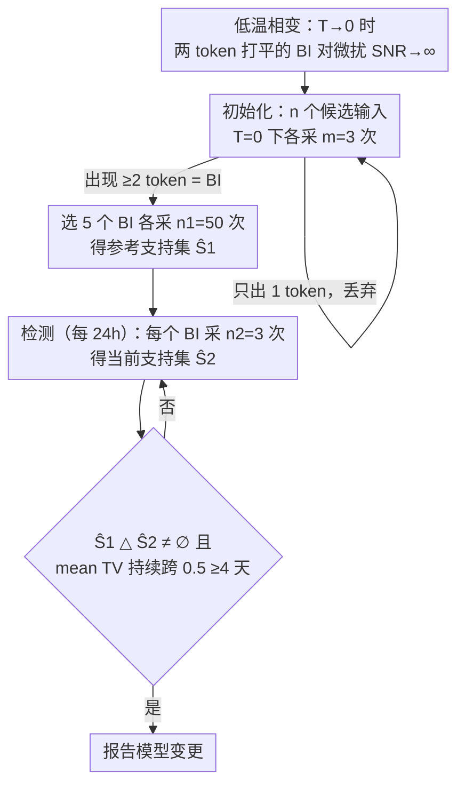

# Token-Efficient Change Detection in LLM APIs

**会议**: ICML 2026  
**arXiv**: [2602.11083](https://arxiv.org/abs/2602.11083)  
**代码**: https://github.com/timothee-chauvin/token-efficient-change-detection-llm-apis  
**领域**: LLM 可信部署 / 模型变更检测  
**关键词**: 黑盒变更检测, 边界输入 BI, 低温相变, Local Asymptotic Normality, B3IT

## 一句话总结
作者证明在低温采样下，"两个 token logit 几乎打平"的特殊输入（Border Inputs）对参数微扰极度敏感——理论上 SNR 在 $T\to 0$ 时发散，于是只观测输出 token（严格黑盒）就能用极少请求做 LLM API 变更检测；提出的 B3IT 在 TinyChange benchmark 上以 1/30 的成本匹敌灰盒 logprob 方法，并在 93 个商用端点上 23 天连续监控发现 8 次真实模型替换。

## 研究背景与动机
**领域现状**：LLM API 提供商会悄悄换模型（量化、新版本、回滚），但用户无法知道；2025 年 Anthropic、Grok 都发生过未公告变更影响数百万请求的事故。已有变更检测方法分三档：白盒（ESF、TRAP，要权重/梯度）、灰盒（LT，要 logprob）、黑盒（MET、MMLU-ALG，只看输出 token 但请求量大、成本高）。

**现有痛点**：白盒要求模型开放，对闭源 API 不适用；灰盒要 logprob，但很多 API（包括 OpenRouter 上的多数端点）不返回 logprob；黑盒方法 MET 跨多 token 比较输出分布，靠 MMD 测距，需要海量请求做连续监控成本极高（DailyBench 仅 5 个端点 40 天后停摆）。

**核心矛盾**：黑盒变更检测要兼顾 (i) 严格只观测输出 token、(ii) 低成本可持续监控、(iii) 高灵敏度能检测微小变化（量化、单步 fine-tune）。这三者看似不可兼得——直觉上，token 输出是 logit 经过 argmax/softmax 的 lossy 压缩，应该对小扰动不敏感。

**本文目标**：(i) 给"输出 token 黑盒变更检测"建立理论基础，找出在什么条件下能高敏感地检测；(ii) 把理论转化为可实操的算法；(iii) 同时在受控 benchmark 和真实生产 API 上验证。

**切入角度**：从 Neyman-Pearson 最优检测出发，用 Local Asymptotic Normality (LAN) 框架分析"小扰动 + 多次采样"机制下的最优 SNR。作者发现 SNR² 是一个关于 Fisher 信息和模型 Jacobian 的二次形式，且在低温极限下，"输出分布坍缩到单个 token"和"两个 token 打平"两个 case 表现出尖锐的二分——前者 SNR→0（检测不到），后者 SNR→∞（极易检测）。这种"相变"启发了 Border Input 概念。

**核心 idea**：在低温下专门找"恰好两个 token 几乎打平"的输入，用它们的输出 token 分布（uniform on $\{1, \dots, k\}$）作为模型指纹；任何参数微扰都会让 BI 退化为单一 token 输出，从而检测变得几乎免费。

## 方法详解

### 整体框架
B3IT 想在严格黑盒（只看输出 token）下廉价地监控某个 API 端点是否被偷偷换了模型。它分两阶段跑：先做一次 **Initialization**，在低温 $T=0$ 下对 $n$ 个候选输入各采样 $m=3$ 次，挑出那些会冒出 ≥2 个不同输出 token 的"边界输入"（Border Input, BI），再选 5 个 BI 各采 $n_1=50$ 次存成参考分布；之后进入周期性 **Detection**，每天对每个 BI 只采 $n_2=3$ 次得到当前支持集 $\hat S_2$，与参考支持集 $\hat S_1$ 一比，只要一边冒出另一边从没见过的 token（$\hat S_1 \triangle \hat S_2 \ne \emptyset$）就判模型变了。每个 BI 单次检测只花 3 个输出 token，这就是"token-efficient"的由来。

### 关键设计

**1. Border Input 与低温相变：把 BI 从经验 trick 抬成数学最优解**

直觉上输出 token 是 logit 经过 argmax/softmax 的 lossy 压缩，对参数小扰动应该很迟钝，黑盒检测看似没戏。作者用 Local Asymptotic Normality 框架正面回应这个疑虑：对参数微扰 $\theta \mapsto \theta + \epsilon h$，Neyman-Pearson 最优检测的 Type-II 误差完全被一个标量 $\text{SNR}^2(h) = h^T J^T F(\mathbf p_0)^{-1} h$ 主导（$J$ 是输出分布对参数的 Jacobian，$F$ 是 Fisher 信息）。沿 Transformer 末层结构展开后变成 $\text{SNR}^2(h) = \frac{1}{\tau^2} h^T J_z^T \Sigma(\mathbf p^{(\tau)}) J_z h$，温度 $\tau$ 以平方反比放大信号。关键的二分出现在 $\tau \to 0$：若 logits 有唯一最大值（$k=1$），输出退化成 Dirac，SNR$\to 0$ 检测不到；若有 $k \ge 2$ 个 logit 并列最大（这正是 BI），SNR$\to +\infty$，检测几乎免费——这是一个尖锐的相变（Theorem 3.3）。换句话说 BI 是 logit 空间的"奇异点"：温度趋零时 softmax 等价于 argmax，任何让并列 logit 排序改变的微扰都会让输出 token 直接跳变。这就把"黑盒为什么能高敏感检测"从直觉升级成了硬核证明，也指明了该专门去找哪种输入。

**2. 黑盒 BI 发现 + 支持集差检测：不碰权重，把检测降成集合比较**

理论指向 BI，但要在不接触权重的前提下找到它们。作者的办法是对 $n$ 个随机输入各在 $T=0$ 下采 $m=3$ 次：BI 因为受推理非确定性 + 浮点舍入影响，3 次采样大概率落出 ≥2 个不同 token，而非 BI 永远吐同一个 token，于是"出现 ≥2 token"就是 BI 的判据。$T=0$ 下 BI 的输出恰好是支持集上的均匀分布 $\text{Unif}(S_1)$，这让检测从"估计分布距离"塌缩成最朴素的支持集差检验：$H_0: S_1=S_2$ vs $H_1: S_1\ne S_2$，拒绝域就是 $\mathcal R = (\hat S_1 \setminus \hat S_2) \cup (\hat S_2 \setminus \hat S_1) \ne \emptyset$——只要冒出从没见过的 token 就报警。漂亮之处在于：作者证明在 $k=2,\ n_1=n_2=n$ 的典型情形下，这个五行代码级别的测试到常数因子就是 Neyman-Pearson 最优（Theorem 4.3），还给出非渐近保证 Type-I $\le k e^{-n_1/k} + k e^{-n_2/k}$、Type-II $\le p_1^{n_1} p_2^{n_2}$。这等于把采样次数的需求压到极低，是 B3IT 省钱的核心。

**3. $m=3$ 与多 prompt 聚合：把成本压到最低、把准确率拉到最高**

成本是黑盒方法的命门，这点专攻两个工程旋钮。一是 BI 搜索时每候选采几次：目标只是判"会不会出 ≥2 token"，附录 C 的信封背估算给出当 BI 比例 < 75% 时 $m=3$ 是最优的 BI/请求比，既数学最省又工程最便宜。二是检测时怎么用 token 预算：与其在单个 prompt 上深采，不如把 5 个 prompt 各自的 TV 距离取平均当检测统计量——同样的 token 预算下，5 prompts × 10 samples 的 ROC AUC 明显高于 1 prompt × 50 samples。这印证了一个统计直觉："宽而浅"地铺开多个独立 BI 比"窄而深"地死磕一个更划算。

### 训练策略
方法完全 training-free，无需任何梯度或权重访问。落地检测协议固定为：BI 数 = 5、参考采样 $n_1=50$、检测采样 $n_2=3$、检测间隔 = 24 小时；判定上要求 mean TV 从 $<0.5$ 跨到 $>0.5$ 且持续 ≥4 天才算 persistent change，以滤掉短暂抖动造成的误报。

## 实验关键数据

### 主实验
TinyChange in-vitro 评估（9 个 0.5B-9B 模型 × 多种扰动）：

| 方法 | 类型 | ROC AUC | 年成本 |
|---|---|---|---|
| LT（灰盒，要 logprob） | 灰盒 | ~0.95 | <$1 |
| **B3IT (ours)** | **黑盒** | **0.90** | **$2.2** |
| MET ($T=0$) | 黑盒 | 0.61→0.88 | $2.2→$67 |
| MMLU-ALG | 黑盒 | 远低 | 高 |

对极弱扰动（单步 fine-tune）B3IT 仍达 ROC-AUC 0.87。

In-vivo 商用端点评估（93 endpoints, 64 models, 20 providers, 23 天）：

| 指标 | 数值 |
|---|---|
| $T=0$ 端点 BI 存在率 | 62% |
| $T>0$ 端点 BI 存在率 | 80% |
| 无法找 BI 端点数 | 18（多为 reasoning 模型禁用 reasoning 失败） |
| 持久变更检测数 | 8 endpoints（含 Together AI 公告的 Mistral-7B → Ministral-3-14B 替换） |
| 平均 BI 监控成本 | $0.52 / endpoint / year（每小时一次） |
| 初始化成本 | $0.0045 / endpoint（可忽略） |

### 消融实验

| 配置 | 关键发现 | 含义 |
|---|---|---|
| prompts × samples 帕累托扫描 | 5×10 优于 1×50 | 多 prompt 聚合更佳 |
| $m=1$ vs $m=3$ vs $m=10$ | $m=3$ 最高效 | 信封背估算成立 |
| $T=0$ vs $T>0$ | $T>0$ 找到更多 BI 但 BI 质量下降 | 相变随温度增大被弱化 |

### 关键发现
- 实际中 BI 大量存在（62% 端点 $T=0$ 下），原因是浮点精度有限 + 推理非确定性导致"严格意义零概率"的 logit 打平事件频繁发生。
- 商用端点上 8 次检测到的"持久变更"中，有 1 次能直接对应 Together AI 公告（Mistral-7B-Instruct-v0.3 被悄悄换成 Ministral-3-14B-Instruct-2512），证明方法在真实世界确实抓得到模型替换。
- 18 个端点找不到 BI——主要是 reasoning 模型默认不能关 reasoning、输出 token 长度受限，是方法局限。

## 亮点与洞察
- **从理论现象命名方法的范例**：BI 不是"试出来的 trick"，而是 LAN + 低温极限分析自然蹦出的奇异点。这种"先推导理论再命名工程概念"的做法把工程性研究升级为科学性研究，极具示范意义。
- **支持集差 = $k=2$ 时的 Neyman-Pearson 最优**：把复杂的分布距离检验降级为"看有没有新 token"，简单到能写进 5 行代码却被证明到常数因子最优——非常漂亮的"最简模型解决最难问题"。
- **浮点精度 + 推理非确定性是 BI 的物理来源**：作者承认理论上 logit 严格打平概率为 0，实际却频繁出现，原因是 GPU 推理的 batch-size 依赖性 + FP16/BF16 rounding——这把"硬件非确定性"从 bug 变成 feature。

## 局限与展望
- 只用第一个输出 token；多 token 输出之间的依赖被忽略，丢失了大量信号。
- BI 是模型 + 提供商基础设施的联合产物，提供商换 GPU 或 CUDA 版本也会改变 BI 分布，可能误报为"模型变更"（虽然广义上确实是 "deployment 变更"）。
- 对 reasoning 模型完全失效（reasoning 不能关 → 输出第一 token 太晚 / 不可读）；这是 2025 年起越来越多 reasoning 模型部署后的硬伤。
- 对抗性提供商可故意让 BI 永远输出同一 token（如加 sticky-mode 系统提示），从而欺骗 B3IT。
- 改进方向：扩展到多 token 序列（用 Markov 链或 hidden Markov 模型建模 token 依赖）；与 LT (logprob-based) 联合做混合检测器；研究对抗性变更下的鲁棒检测。

## 相关工作与启发
- **vs MET (Gao et al. 2025)**：MET 用 MMD + Hamming kernel 比较多 token 输出分布，成本高（B3IT 30 倍便宜）；B3IT 用相变 + 支持集差，理论上和工程上都更精炼。
- **vs LT (Chauvin et al. 2026)**：LT 要 logprob，限于少数支持 logprob 的 API；B3IT 不要 logprob 性能仅略低，覆盖面广得多。
- **vs ESF / TRAP (白盒)**：白盒要模型权重，对闭源 API 不适用；B3IT 严格黑盒可用于任何商用 endpoint。
- **vs LLM fingerprinting (Pasquini et al. 2025)**：fingerprinting 求"在小变化下保持稳定"以识别模型，B3IT 反过来求"对任何小变化都敏感"以触发警报，两者目标互补。

## 评分
- 新颖性: ⭐⭐⭐⭐⭐ 把变更检测的"低温相变"从纯数学现象转化为可实操的 BI 概念，是该领域少见的"理论驱动算法"工作。
- 实验充分度: ⭐⭐⭐⭐ 9 个开源模型 in-vitro + 93 个商用 endpoint in-vivo + 真实事故验证，覆盖度极高；仅缺对抗性场景的实验。
- 写作质量: ⭐⭐⭐⭐⭐ 从相变定理一路推到 5 行代码的检测器，理论与工程衔接得近乎完美。
- 价值: ⭐⭐⭐⭐⭐ 1/30 成本的黑盒变更监控对任何依赖 LLM API 的生产系统都是刚需，且方法已用真实事故验证。

<!-- RELATED:START -->

## 相关论文

- [\[CVPR 2025\] The Change You Want To Detect: Semantic Change Detection In Earth Observation With Hybrid Data Generation](../../CVPR2025/llm_nlp/the_change_you_want_to_detect_semantic_change_detection_in_earth_observation_wit.md)
- [\[ICML 2026\] 结构化广义线性 token mixing：用 SND + Kronecker 在复杂度与表达力之间换挡](trading_complexity_for_expressivity_through_structured_generalized_linear_token_.md)
- [\[ACL 2025\] AgentDropout: Dynamic Agent Elimination for Token-Efficient and High-Performance LLM-Based Multi-Agent Collaboration](../../ACL2025/llm_nlp/agentdropout-dynamic-agent-elimination-for-multi-agent-collaboration.md)
- [\[ICML 2026\] YAQA: 端到端 KL 最小化的 LLM 自适应权重量化](model-preserving_adaptive_rounding.md)
- [\[ICML 2026\] Universal Reasoner: 冻结 LLM 的可组合即插即用推理器](universal_reasoner_a_single_composable_plug-and-play_reasoner_for_frozen_llms.md)

<!-- RELATED:END -->
