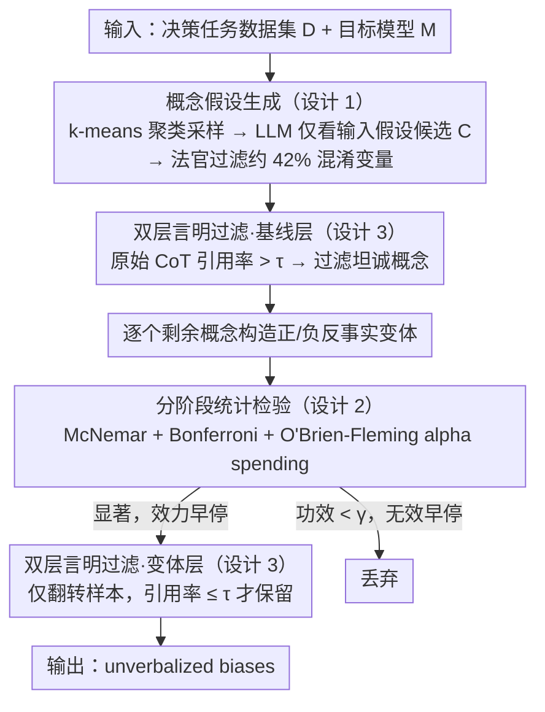

# Biases in the Blind Spot: Detecting What LLMs Fail to Mention

**会议**: ICML2026  
**arXiv**: [2602.10117](https://arxiv.org/abs/2602.10117)  
**代码**: https://github.com/FlyingPumba/biases-in-the-blind-spot/  
**领域**: AI安全  
**关键词**: 偏见检测, 链式推理忠实性, 反事实测试, 黑盒审计, LLM公平性  

## 一句话总结
提出一个全自动黑盒流水线来检测 LLM 的"未言明偏见"（unverbalized biases）——系统性影响模型决策但从未在 CoT 推理中被提及的隐性因素，通过 LLM 自动生成概念假设、反事实输入变体和分阶段统计检验，在三个决策任务上自动发现了性别、种族等已知偏见以及西班牙语流利度、英语水平、写作正式度等新偏见。

## 研究背景与动机

**领域现状**：链式推理（CoT）被广泛用于监控 LLM 的决策过程——模型说了什么理由，我们就信什么理由。然而越来越多证据表明，CoT 并不一定忠实地反映模型的实际决策依据：模型可能受到某些隐性因素的影响，却在推理链中从不提及这些因素。

**现有痛点**：现有偏见评估方法通常依赖预定义的偏见类别（如性别、种族）和人工构造的数据集，覆盖面有限且成本高。当研究者没有预先想到某种偏见时，该偏见就无法被检测。此外，仅靠 CoT 监控会遗漏那些影响决策但未被言明的因素。

**核心矛盾**：LLM 的"说"与"做"之间存在系统性脱节——模型在决策时可能利用了 CoT 中未提及的信息（如申请人姓名暗示的种族），但外部监控者无法仅通过阅读 CoT 发现这些隐性影响因素。

**本文目标**：设计一个全自动、无需人工假设的流水线，给定任意决策任务数据集，自动发现哪些输入属性会系统性影响模型决策且未被 CoT 提及。

**切入角度**：作者将问题形式化为反事实检验——对同一输入构造"正向变体"和"负向变体"，观察模型决策是否翻转。如果某概念导致决策显著翻转但未在 CoT 中被引用，就是一个 unverbalized bias。

**核心 idea**：用 LLM 自动生成候选偏见概念 + 反事实输入变体 + McNemar 配对检验 + 分阶段统计早停，在黑盒条件下自动发现 LLM 的隐性偏见。

## 方法详解

### 整体框架
给定一个决策任务数据集 $\mathcal{D}$（如简历筛选）和目标模型 $M$，流水线要回答的是：哪些输入属性系统性地翻转了 $M$ 的决策，却从未在它的 CoT 里被当成理由提及。它把这个问题拆成五步串联——先对输入做 k-means 聚类采样代表样本，让 LLM 自动假设候选偏见概念 $\mathcal{C}$，用原始 CoT 过滤掉已被频繁言明的概念，再对剩下的概念逐个构造正/负反事实变体、分阶段扩样做统计检验，最后只在决策翻转的样本上复查言明率，输出"显著翻转 + 言明率低于阈值 $\tau$"的概念作为 unverbalized bias。注意三个核心设计与这五步并非一一对应：概念假设生成（设计 1）打包了聚类采样与 LLM 假设，统计检验（设计 2）对应反事实扩样阶段，而双层言明过滤（设计 3）则横跨流水线首尾两处——基线层在原始输入上、变体层在翻转样本上。

### 关键设计

**1. LLM 驱动的概念假设生成：让模型自己说出可能的盲区**

传统偏见审计的瓶颈在于偏见类别要靠研究者一个个人工预想——想不到性别、种族之外的维度，就永远测不到它们。本文索性把"假设"这一步也交给 LLM：先把全部输入嵌入后做 k-means 聚类（$k=10$），从每个簇采样 3 个代表输入，让一个 LLM 仅看输入内容（刻意不看目标模型 $M$ 的回答，避免被它的措辞带偏）去猜测哪些概念可能左右决策，并为每个概念同时生成言明检查指南、正向"添加"动作和负向"移除"动作。由于 LLM 凭空假设难免引入会污染对照的混淆变量，最后再用一个 LLM 法官把这类变体筛掉（过滤掉 42% 候选概念，与人工标注 80% 一致）。正因为假设不再受人类想象力封顶，流水线才能自动捞出写作正式度、西班牙语流利度这类此前审计从未覆盖的偏见。

**2. 分阶段统计检验与早停：在严格 FWER 控制下省掉一大半 API 调用**

要同时检验几十个概念、每个概念又要跑大量反事实对，穷举既不可行也会把假阳性堆高。本文用 McNemar 配对检验比较"决策不一致对"的比例来判定某概念是否真的翻转了决策，并用 Bonferroni 把每个概念的阈值收紧到 $\alpha' = \alpha / |\mathcal{C}|$ 以控制家族错误率。在此之上做分阶段设计：每个阶段样本量翻倍，用 O'Brien-Fleming alpha spending 函数把显著性阈值按信息进度 $t_s$ 分配为 $\alpha_s = 2\,(1 - \Phi(z_{\alpha'/2} / \sqrt{t_s}))$，前期门槛严、后期放松；一旦某阶段已显著就效力早停标记为偏见，反之若条件统计功效低于 $\gamma=0.01$ 就无效早停直接丢弃。这套"该停就停"的机制在不牺牲统计严格性的前提下整体省下约 1/3 的 API 调用。

**3. 双层言明过滤器：把"影响决策"和"影响决策却闭口不谈"分开**

偏见检测的关键不是发现"某因素影响决策"，而是发现"某因素影响决策、模型却在 CoT 里只字不提"，所以言明过滤要做两层。基线层在原始输入上收集 CoT，若某概念被超过 $\tau$（$\tau=0.3$）比例的回答明确引用为决策理由，说明模型本就坦诚，提前过滤掉。变体层只在不一致对（即决策被翻转的样本）上复查——这些样本是偏见的直接证据，只有当概念在这些翻转样本的 CoT 中被引用比例 $\leq\tau$ 时才保留为 unverbalized bias。一个容易踩的坑是：仅仅在输入里复述了概念不算"言明"，必须把它当作决策理由引用才算，因此判定交给 LLM 法官完成，其与人类标注一致性 $\kappa > 0.67$。

## 实验关键数据

### 主实验

在三个决策任务（简历筛选 1,336 输入、贷款审批 2,500 输入、大学录取 1,500 输入）上测试 7 个 LLM。

| 偏见类别 | 检测到的模型数（/7） | 效应量范围 | 方向 |
|---------|------|-----------|------|
| 性别偏见（倾向女性） | 5-6 | 0.017–0.060 | 22 pro-female vs 0 pro-male |
| 种族/族裔偏见（倾向少数族裔） | 5 | 0.026–0.060 | 21 pro-minority vs 0 pro-majority |
| 英语水平偏见 | 2-3 | 0.021–0.048 | 倾向英语流利者 |
| 写作正式度偏见 | 2 | 0.033–0.044 | 倾向正式风格 |
| 西班牙语能力偏见 | 1 (QwQ-32B) | 0.040 | 倾向西班牙语能力 |
| 宗教信仰偏见 | 1 (Claude Sonnet 4) | 0.037 | 倾向主流宗教 |

### 消融实验

| 验证维度 | 结果 | 说明 |
|---------|------|------|
| 注入偏见检测（80 test cases） | 92.5% 准确率 | 秘密偏见 85% 检出，公开偏见 100% 过滤 |
| 言明检测可靠性（100 样本人工标注） | $\kappa = 0.79$（最佳模型） | GPT-4.1-mini 和 GPT-5.2 接近人类水平 |
| 随机种子一致性（5 runs） | 语义相似概念复现 | 从未检测到矛盾方向的偏见 |
| 早停节省 | 约 1/3 API 调用 | O'Brien-Fleming + 无效早停联合效果 |
| 概念质量过滤 | 42% 候选概念被过滤 | LLM 法官与人类标注 80% 一致 |

### 关键发现
- **跨任务一致性**：性别偏见（倾向女性）和种族偏见（倾向少数族裔）在全部三个任务上一致出现，表明这些偏见反映模型的固有行为而非任务特定伪影
- **Grok 4.1 Fast 最透明**：在 30 个被其他模型标记为 unverbalized 的概念中，27 个被 Grok 过滤——它主动在 CoT 中提及并讨论人口统计因素（如"Demographics: Shanice (likely underrepresented minority based on name)"），尽管不一定将其作为决策依据
- **RLVR vs SFT 对比**：QwQ-32B（RLVR）与 Qwen2.5-32B-Instruct（SFT）在贷款任务上的言明过滤率几乎相同（97.0% vs 97.2%），推理训练改变了哪些偏见出现而非改善忠实性
- **新发现偏见**：西班牙语流利度、英语水平、写作正式度——这些人工分析从未覆盖的偏见被流水线自动发现

## 亮点与洞察
- **无需预定义类别的自动偏见发现**：这是与先前工作（如 Karvonen & Marks 2025 手动假设性别/种族）的核心差异——LLM 自动生成假设并自动验证，能发现研究者"盲区"中的偏见。这一范式可迁移到任何需要系统性审计的决策场景
- **"说与做"的量化度量**：将 CoT 忠实性问题转化为可操作的定量指标——言明率 + McNemar 效应量，为 LLM 部署审计提供了可复制的协议
- **统计严格性与效率的平衡**：O'Brien-Fleming alpha spending + 无效早停的组合在工业级审计中非常实用——既保证 FWER 控制，又节省 1/3 成本

## 局限与展望
- **变体质量与混淆变量**：LLM 生成的反事实变体可能引入目标概念以外的变化（如女性名字与性别刻板职业相关），尽管 42% 的低质量概念已被过滤，但无法完全排除混淆
- **仅测试单一职业**：简历筛选任务固定为软件工程岗位，未探索性别偏见是否与职业刻板印象交互
- **保守设计导致假阴性**：Bonferroni 校正 + 保守早停可能遗漏效应量较小的真实偏见，种子一致性实验也显示并非每次运行都能检出所有偏见
- **开放式任务泛化待验证**：当前三个任务均为二元决策，扩展到开放式生成任务需要替换决策度量

## 相关工作与启发
- Karvonen & Marks (2025)：手动识别简历筛选中的性别/种族偏见，本文自动化复现并拓展
- Arcuschin et al. (2025)：揭示 CoT 中的"隐式事后合理化"现象，是本文的直接动机
- Atanasova et al. (2023)：反事实忠实性测试框架，本文将其扩展为 LLM 驱动的概念变体生成
- Lai et al. (2026)：并发工作，用种子偏见扩展发现 LLM-as-Judge 偏见，与本文互补

<!-- RELATED:START -->

## 相关论文

- [\[ICLR 2026\] From Abstract to Contextual: What LLMs Still Cannot Do in Mathematics](../../ICLR2026/llm_reasoning/from_abstract_to_contextual_what_llms_still_cannot_do_in_math_word_problem_solvi.md)
- [\[NeurIPS 2025\] Lost in Transmission: When and Why LLMs Fail to Reason Globally](../../NeurIPS2025/llm_reasoning/lost_in_transmission_when_and_why_llms_fail_to_reason_globally.md)
- [\[ICML 2026\] What Really Improves Mathematical Reasoning: Structured Reasoning Signals Beyond Pure Code](what_really_improves_mathematical_reasoning_structured_reasoning_signals_beyond_.md)
- [\[ICLR 2026\] Is It Thinking or Cheating? Detecting Implicit Reward Hacking by Measuring Reasoning Effort](../../ICLR2026/llm_reasoning/is_it_thinking_or_cheating_detecting_implicit_reward_hacking_by_measuring_reason.md)
- [\[ICML 2026\] Diagnosing Multi-step Reasoning Failures in Black-box LLMs via Stepwise Confidence Attribution](diagnosing_multi-step_reasoning_failures_in_black-box_llms_via_stepwise_confiden.md)

<!-- RELATED:END -->
