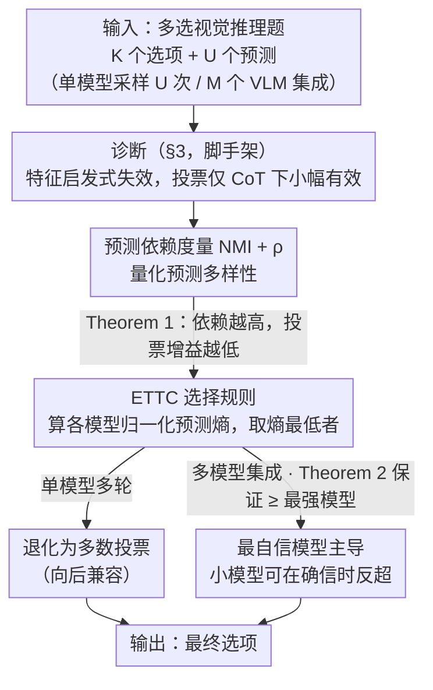

# Diversity Matters: Revisiting Test-Time Compute in Vision-Language Models

**会议**: ICML2026  
**arXiv**: [2605.30713](https://arxiv.org/abs/2605.30713)  
**代码**: https://github.com/nanfang-wuyu/Diversity-Matters  
**领域**: LLM推理 / 多模态VLM  
**关键词**: 测试时计算, 多数投票, 熵选择, VLM集成, 预测多样性

## 一句话总结
本文系统研究了 test-time compute (TTC) 策略在视觉-语言模型上的有效性，从理论上证明多数投票的收益受预测多样性限制，并提出基于预测熵选最自信模型的 ETTC，使小模型能反过来增益大模型，在 7 个 VLM、6 个基准上平均比投票高 +2.8%、超过最强单模型。

## 研究背景与动机

**领域现状**：在 LLM 上 TTC（test-time compute）被证明能在不改参数的前提下显著提升推理质量，主流做法分两类：基于特征的 Best-of-N（用 pivot word、回答长度、词汇多样性等启发式打分）和基于置信度的聚合（self-consistency / 多数投票）。这些方法被视为「轻量提点」的标配，但在 VLM 上是否同样有效几乎没人系统验证过。

**现有痛点**：直接把 LLM 的 TTC 套到 VLM 上有三重隐患：（1）视觉感知本身就出错率高且模型间差异大；（2）跨模态对齐不完美，会产生细微不一致；（3）在 LLM 上用来判断推理质量的文本线索（如「alternatively」「let me check」等 pivot word、CoT 长度），并不能反映视觉理解是否正确——感知崩了再漂亮的推理链也救不回来。

**核心矛盾**：投票的本质是用「多样性 + 平均正确率 > 1/K」放大正确信号，但 VLM 在采样时输出高度趋同，多样性不足；同时多模型集成虽然天然多样，但标准投票把所有模型同等加权，弱模型会拖累强模型，反而比最强单模型还差。

**本文目标**：拆成三个子问题——(i) TTC 在 VLM 上到底什么时候有效？(ii) 投票收益和预测多样性的定量关系是什么？(iii) 在多模型集成下能否设计一种「自动信任最强专家」的聚合策略，让小模型反过来增益大模型？

**切入角度**：作者从一个朴素观察出发——「同一个模型连续答 16 次错的是同一个，投票没用；不同模型错的方式不同，投票才有救」。这把投票有效性归结到「预测之间的统计依赖」，可以用 NMI 和相关系数 ρ 量化；进一步在多模型场景下，「最确信的模型最可能对」可以用归一化预测熵作为选择信号。

**核心 idea**：用「选最低熵的模型作为该题答案」取代「数票数」，单模型场景下退化为多数投票，多模型场景下让强模型主导，弱模型可在它确信时反超大模型。

## 方法详解

### 整体框架
论文不是一个单一新方法，而是一条「诊断 → 理论 → 改进」的完整链路。输入：一道多选视觉推理题，K 个候选答案，U 个预测（可以来自一个模型采样 U 次，也可以来自 M 个不同 VLM × 多次采样）。输出：聚合后的最终选项。中间分三阶段：(1) 在 7 个 VLM × 6 个基准上系统跑特征启发式（Pivot Word / CoT Length / Feature-All）与多数投票，确认特征类失败、投票仅在用 CoT 时小幅有效（§3）；(2) 用信息论度量 NMI 与相关系数 ρ 刻画预测依赖性，证明投票增益 $\Delta A_{MV}(U)$ 关于 ρ 和 NMI 单调递减（§4，Theorem 1）；(3) 提出 ETTC，按预测熵选最自信模型，理论证明在弱假设下严格优于投票（§5，Theorem 2）。

### 关键设计

**1. 预测依赖度量（NMI + ρ）：先量出多样性，再决定值不值得投票**

投票之所以在 VLM 上经常白做，是因为采样出来的 U 个预测高度雷同——错的总错在同一个地方，再多票也救不回来。作者想要一个**模型无关、不需要 ground-truth** 的指标来提前判断这件事。具体用两套度量：在答案选项层面，对任意一对预测算归一化互信息 $\mathrm{NMI}(X;X') = I(X;X') / \min\{H(X), H(X')\}$，再对全部 $C(U,2)$ 对取平均；在正确性层面，定义二元指示子 $Z_u = \mathbb{I}\{X_u = Y\}$，用相关系数 $\rho(Z,Z') = (E[ZZ'] - p^2) / (p(1-p))$ 同样取对均值。Theorem 1 把这两个量和投票收益直接挂钩：若所有对的依赖水平一致，则投票增益 $\Delta A_{MV}(U)$ 关于 ρ 和 NMI **单调递减**——ρ=1（完全相关）时增益归零，而 ρ=0 且平均正确率 $p > 1/K$ 时，$U \to \infty$ 投票准确率趋近 1。这就把「投票什么时候有用」从直觉变成一个可测、可预筛的判据：大模型 ρ 高，别浪费算力投票；小模型 ρ 低，投票才划算。

**2. Entropy-based TTC（ETTC）选择规则：让模型按确信度发言，而不是数票**

标准投票把所有模型当等权选民，在多模型集成里会出问题——一群弱但彼此相关的模型抱团，能把强模型的正确答案直接投没。ETTC 改成「谁最确信就听谁的」：对每个模型 $u$，从它对 K 个选项的预测分布 $p_u(\cdot)$ 算归一化熵 $\tilde{H}_u = -\frac{1}{\log K}\sum_k p_u(k)\log p_u(k) \in [0,1]$ 和 top-1 预测 $\hat{y}_u = \arg\max_k p_u(k)$，最终取熵最低那个模型的预测 $\hat{y}_{u^*}$，其中 $u^* = \arg\min_u \tilde{H}_u$。这个规则有两个漂亮的性质：单模型多轮时，对多轮分布求平均再取 argmax 恰好**退化成多数投票**，可以无缝替换现有 self-consistency pipeline、零 regression 风险；多模型时则切换成「最强专家独裁」，强模型确信时它说了算，弱模型偶尔真的确信对了也能反超。它之所以成立，靠的是 Assumption 1（Entropy-Accuracy Monotonicity，低熵 ⇒ 高准确率）在实测中大体满足，于是熵就成了「谁是专家」的廉价代理。

**3. ETTC 优于投票的理论保证（Theorem 2）：相关性越高，ETTC 赢得越多**

要回答「为什么 VLM 集成里 ETTC 一定比投票强」，作者建了一个耦合模型来刻画错误相关：以概率 λ，所有非最优模型抱团给出同一个相关错误预测 W（其平均准确率 $\bar{c}$）；以概率 1-λ，它们彼此独立。记 $c^*$ 为最强模型在该题上的准确率，$A_{MV}(0)$ 为完全独立时投票的基准准确率，则投票准确率为 $A_{MV}(\lambda) = \lambda \bar{c} + (1-\lambda) A_{MV}(0)$，而 ETTC 准确率满足 $A_{\min H} \ge c^*$。两者之差
$$A_{\min H} - A_{MV}(\lambda) = \lambda(c^* - \bar{c}) + (1-\lambda)\big(A_{\min H} - A_{MV}(0)\big)$$
只要 λ>0 且 $\bar{c} < c^*$ 就严格为正。关键在于：VLM 之间共享大量预训练语料和架构，错误天然相关（λ 非零），所以这条定理恰好对准了真实场景——它从结构上堵掉了投票的「集体偏见」漏洞，相关性越强（λ 越大），ETTC 相对投票的优势就越明显。

### 损失函数 / 训练策略
本文是纯 inference-time 方法，不训练任何模型也不需要 reward model。所有实验用 stochastic decoding（HuggingFace 默认采样设置）+ 零样本一阶段提示，CoT 和 Direct Answer 两种提示模板分别评估；单模型设置下采样数 $U = 16$（依据 §4.2 显示 NMI 与 ρ 在 $U \approx 12$ 就收敛），多模型集成用 4 个模型每个采样多次。

## 实验关键数据

### 主实验

| 数据集 | 指标 | Vanilla 最强单模型 | 多数投票 | ETTC | 提升 (ETTC vs Voting) |
|--------|------|--------------------|----------|------|-----------------------|
| MathVista (cross-family) | Acc% | 72.08 (Qwen-7B) | 68.33 | **75.93** | +7.60 |
| MathVision (cross-family) | Acc% | 31.84 (Gemma) | 32.05 | **35.57** | +3.52 |
| TQA (cross-family) | Acc% | 78.86 (Gemma) | 83.65 | **83.90** | +0.25 |
| MMMU (cross-family) | Acc% | 52.49 (Gemma) | 53.66 | **58.63** | +4.97 |
| Average (cross-family, 6 datasets) | Acc% | 61.30 (Qwen-7B) | 63.75 | **66.56** | +2.81 |
| Average (same-family Qwen 3B/7B/32B/72B) | Acc% | 69.90 (Qwen-72B) | 68.84 | **71.68** | +2.84 |

亮点：在 same-family Qwen 系列中，投票（68.84）甚至比 Qwen-72B 单模型（69.90）还低，验证了「投票稀释强模型」的理论预测；而 ETTC（71.68）反超最强单模型 1.78 个点，说明 Qwen-3B/7B/32B 偶尔能以高确信反超 72B。

### 消融与诊断实验

| 配置 / 观察 | 关键指标 | 说明 |
|-------------|----------|------|
| Direct Answer + 多数投票 | <1% 提升 | 不用 CoT 时 VLM 16 次采样输出几乎相同，多样性为零，投票无效 |
| CoT + Pivot Word / CoT Length / Feature-All | ≈ 0% 提升 | 文本启发式在 VLM 上完全失效，因感知瓶颈使文本风格与正确性脱钩 |
| CoT + 多数投票 | 2–4% 提升 | 仅 CoT 下投票有小幅一致提升，但被预测依赖性卡住 |
| ∆A_MV(16) vs NMI / ρ | 显著负相关 (Fig. 3) | 跨 7 模型 × 6 数据集验证 Theorem 1：依赖越高、投票增益越低 |
| U=2…16 的 NMI/ρ 收敛 | U≈12 后稳定 | 给出 16 采样的实用上限 |
| 模型规模 vs 多样性 | Qwen-3B/LLaMA 多样性高、投票收益大；Qwen-72B/Pixtral 输出趋同、几乎无收益 | 实践原则：投票该用在小模型上 |

### 关键发现
- 多数投票在 VLM 上「中看不中用」的根本原因是采样输出高度相关；这条结论用 NMI 和 ρ 给出了可量化、可预测的判据，是本文最实用的工具。
- ETTC 不仅打败投票，还能反超最强单模型——意味着小模型在它「真的会」的题上比大模型还自信，把这种少数派意见挑出来用，是「smaller models enhance larger ones」的关键。
- 文本启发式（pivot word、长度、词汇多样性）在 VLM 上全军覆没，提示 VLM 的推理质量主要由视觉感知决定，而文本表面特征已经测不出感知是否成功。
- Entropy-Accuracy Monotonicity（Assumption 1）在 §C.2 的实测中大体成立，是 ETTC 跨架构泛化的经验基础。

## 亮点与洞察
- **把投票收益和统计依赖性挂钩**：以前大家只把投票当工程 trick，本文用 NMI 和 ρ 给出「投票能不能涨点」的理论判据 + 经验拟合，相当于给 TTC 装了个「值不值得跑」的预算器，跨任务、跨模型都能用，不需要标签。
- **ETTC 的「单模型退化」性质很优雅**：在单模型多轮场景下数学上等价于多数投票，所以可以无缝替换现有 self-consistency pipeline，没有 regression 风险；只在多模型集成时启动「最强专家独裁」模式，工程友好度极高。
- **「小模型反过来增益大模型」的反直觉结论**：传统集成默认大模型应该主导，本文用 Qwen-3B 偶尔比 72B 还自信对了，证明「逐题选专家」比「逐模型选专家」更细粒度，给低成本集成提供了新方向——只要小模型在小部分题上能确信对，就能整体反超巨模型。
- **理论与实证的紧耦合**：Theorem 1 给「voting 何时无效」、Theorem 2 给「ETTC 何时优于 voting」，两条定理都对应着 §4–§5 的可视化实验图，论证链非常干净，这种「先量化失败再设计解决」的范式可以迁移到 RAG、self-refine、Best-of-N 评分器等其他 inference-time 方法的诊断上。

## 局限与展望
- 仅在多选题（MCQ）场景验证，K 个选项让熵能够直接归一化到 $[0,1]$；在开放式生成（自由回答、代码生成、长文 QA）上如何定义「答案分布的熵」并不显然，可能需要额外的聚类或语义等价判断。
- Assumption 1（低熵 ⇒ 高准确率）只是「aggregate」意义下成立，文中也承认单实例可能不严格；对那些「自信地错」的模型（calibration 差的 VLM）ETTC 可能反而被误导，需要配合 calibration 矫正或温度调节。
- 集成成本被刻意淡化——多模型 + 每模型多次采样的总 inference 开销是单模型的数十倍；论文未与「同等算力用于训练更大模型 / 更长 CoT」做公平对比，TTC 的「轻量」定位在多模型场景下其实并不轻。
- 没有探索把 ETTC 和 process reward model、self-refinement、tree search 等更复杂的 TTC 组合起来的可能性，未来可作为一个 unified entropy-based 选择层接到这些 pipeline 中。

## 相关工作与启发
- **vs Self-Consistency / 多数投票 (Wang et al., 2023)**: 这是 LLM 上的标准 TTC 基线，本文实测它在 VLM 上仅 2-4% 增益且依赖 CoT；ETTC 在单模型场景下与之数学等价，但在多模型集成下严格更优，是「投票」的天然超集。
- **vs 特征/启发式 Best-of-N (Chang et al., 2025; Fu et al., 2023; Jin et al., 2024)**: 这类方法在 LLM 上靠 pivot word、长度、词汇多样性给 reasoning trace 打分，本文证明它们在 VLM 上「全军覆没」，因为视觉感知瓶颈让文本表面线索失去判别力——这是一个对 reward-model-free 方法的强烈反例。
- **vs 学习型 reward model / verifier**: 这些方法需要额外训练评分器，而 ETTC 完全 training-free 且模型无关，部署成本远低；但牺牲了 reward model 可能学到的任务专属信号，因此在「弱 calibration + 强 reward model」的场景下可能仍然劣于学习方法。
- **启发**: 「用预测熵作为模型质量代理」的思路可以扩展到 RAG（在多个 retriever-augmented 答案中按熵选）、agent 多路径推理（按熵选 trajectory）、speculative decoding（按熵切换 draft / verifier），凡是有多个候选输出的 inference-time 场景都值得套这条公式试试。

## 评分
- 新颖性: ⭐⭐⭐⭐ 把「投票多样性」从直觉变成可测量定理，并基于熵设计了 backward-compatible 的 ETTC，思路清晰但单点创新不算大。
- 实验充分度: ⭐⭐⭐⭐ 7 VLM × 6 基准 × 两种集成配置（跨家族 + 跨规模），理论与实证耦合紧密，但缺开放式任务与算力 trade-off 分析。
- 写作质量: ⭐⭐⭐⭐ 「why → when → how」三段式叙事流畅，定理 + 直觉解释 + 图表互相支撑，读起来很舒服。
- 价值: ⭐⭐⭐⭐ 「不要在大模型上做投票，要在多模型集成里按熵选」这条工程结论可立刻落地，对 VLM 推理服务、低成本集成都有实际价值。

<!-- RELATED:START -->

## 相关论文

- [\[ICLR 2026\] Efficient Test-Time Scaling for Small Vision-Language Models](../../ICLR2026/llm_reasoning/efficient_test-time_scaling_for_small_vision-language_models.md)
- [\[NeurIPS 2025\] Provable Scaling Laws for the Test-Time Compute of Large Language Models](../../NeurIPS2025/llm_reasoning/provable_scaling_laws_for_the_testtime_compute_of_large_lang.md)
- [\[ACL 2026\] Scaling Test-Time Compute to Achieve IOI Gold Medal with Open-Weight Models](../../ACL2026/llm_reasoning/scaling_test-time_compute_to_achieve_ioi_gold_medal_with_open-weight_models.md)
- [\[ICML 2026\] Stabilizing Recurrent Dynamics for Test-Time Scalable Latent Reasoning in Looped Language Models](stabilizing_recurrent_dynamics_for_test-time_scalable_latent_reasoning_in_looped.md)
- [\[NeurIPS 2025\] Towards Thinking-Optimal Scaling of Test-Time Compute for LLM Reasoning](../../NeurIPS2025/llm_reasoning/towards_thinking-optimal_scaling_of_test-time_compute_for_llm_reasoning.md)

<!-- RELATED:END -->
