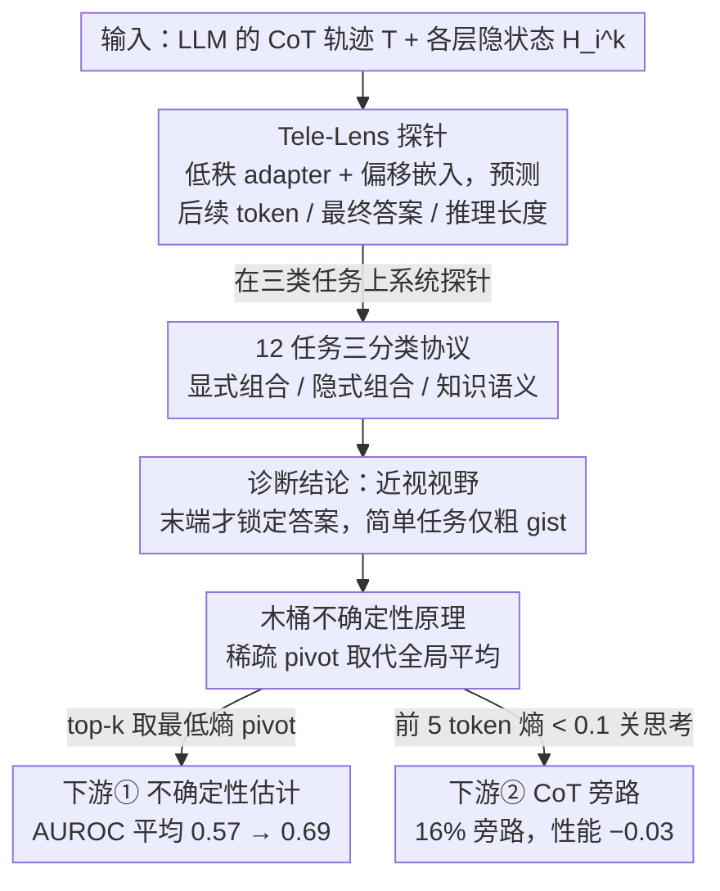

# How Far Ahead Do LLMs Plan? Uncovering the Latent Horizon in Chain-of-Thought Reasoning

**会议**: ICML 2026  
**arXiv**: [2602.02103](https://arxiv.org/abs/2602.02103)  
**代码**: https://github.com/lxucs/tele-lens (有)  
**领域**: LLM 推理 / CoT 可解释性  
**关键词**: Chain-of-Thought、隐状态探针、规划视野、不确定性估计、CoT 旁路

## 一句话总结
本文用一个叫 Tele-Lens 的低秩 adapter 探针在 12 个跨域任务上系统度量 LLM 隐状态对"未来推理"的预测能力，发现 LLM 的内部规划是**近视**（myopic）的——只在 CoT 末端才精确锁定答案，并据此提出"木桶原理"用稀疏 pivot 位置的不确定性代表整条 CoT，可显著改善不确定性校准并实现 16% 的 CoT 旁路。

## 研究背景与动机

**领域现状**：CoT 已经成为引出 LLM 多步推理的标配范式，DeepSeek-R1 等模型通过 RL 进一步放大了"长链思考"的能力。

**现有痛点**：但围绕"CoT 到底是不是必需"的研究出现了两派对立的证据。一派（Pal et al. 2023、Azaria & Mitchell 2023 等）发现**早期隐状态就已编码后续推理与最终答案**，似乎 CoT 只是回放预先算好的轨迹；另一派从 Transformer 表达能力理论出发（Merrill & Sabharwal 2023、Abbe et al. 2024 等）证明只有显式中间步才能解组合推理与长度泛化，因此"提前知道答案"在结构化任务上不可能成立。

**核心矛盾**：现有证据多来自单一领域、单一探针维度，结论彼此冲突却没人拉到同一个尺度上对齐。LLM 到底在 CoT 开始前就有"全局蓝图"，还是只是一步一步走的"局部贪心"？这个问题不仅关乎可解释性，还直接影响 GPT-5、Claude 的 adaptive thinking 与 early-exit 类工作的设计前提。

**本文目标**：分解为两个子问题——Q1：隐状态在多大程度上编码全局推理蓝图，而非仅支持局部增量转移？Q2：规划视野如何反过来影响 CoT 的不确定性与必要性估计？

**切入角度**：作者认为之前矛盾是因为大家**只看一个维度（多数是"早期能不能预测最终答案"）、只在一类任务上看**。如果系统地在多维度（最终答案 / 后续 token / 总长度）× 多任务类型（显式组合 / 隐式组合 / 知识语义）上探针，矛盾就能调和。

**核心 idea**：训一个"教学透镜"Tele-Lens——把每层隐状态低秩投影后接 LM head，去预测后续 token、最终答案、推理长度三类"目的论"信号；再据此提炼出"木桶不确定性"原理，把它落到 CoT 校准与必要性估计两个下游问题上。

## 方法详解

### 整体框架
全文围绕"先诊断、后利用"的双段结构展开：第 2 节用探针做诊断回答 Q1，第 3 节把诊断结论落到下游任务回答 Q2。诊断侧喂进 LLM 在 12 个任务上的完整 CoT 轨迹 $T=\{t_1,\dots,t_n\}$ 及其各层隐状态 $H_i^k\in\mathbb{R}^d$，输出是三类探针在各位置、各层的准确率/相关度曲线，"近视视野"这一关键现象就是从这些曲线里读出来的；应用侧再把"真正的信号只集中在少数 pivot 位置"这条直觉，分别落到不确定性 AUROC 和 CoT 旁路两个任务上。整套实验在两个 backbone 上并行：即开即用、自带思考模式的 Qwen3-32B，以及一个用 GRPO 在 Qwen2.5-7B-Instruct 上训出的 In-Domain LLM——后者推理更干净，作为减少混淆变量的"上界"参照。

### 关键设计

**1. Tele-Lens 探针：用一个低秩 adapter 同时窥探三类"未来"**

之前的隐状态探针各看各的——有的只盯最终答案、有的只在最后一层做，结论自然彼此打架。Tele-Lens 想用一套统一框架覆盖三个语义不同的"目的论"维度：对 CoT 任意位置 $i$、任意层 $k$ 的隐状态 $H_i^k$，同时预测后续 $m$ 个 token、最终答案、以及剩余推理总长度。它沿用 Logit Lens 把中间层直连冻结 LM head $L$ 的传统，但插一个 bottleneck adapter 抗过拟合：$\widetilde{H}_i^k = \operatorname{GeLU}\big((H_i^k + \operatorname{Emb}^k(\delta))A^k\big)B^k$，其中 $A^k\in\mathbb{R}^{d\times r}$、$B^k\in\mathbb{R}^{r\times d}$ 是秩 $r=256$ 的低秩矩阵，输出 $\mathcal{P}_i^k=\operatorname{Softmax}(\widetilde{H}_i^k L)$。关键在那个**偏移嵌入** $\operatorname{Emb}^k(\delta)$：给定 $\delta=1,2,\dots,m$ 就能指定要预测的是"下一个 token"还是"下 8 个 token"，于是多步预测被收进同一个 adapter；预测最终答案时把 $\operatorname{Emb}^k$ 去掉，预测推理长度时则换成单层回归头。因为是按层分别训练，最后能画出"哪一层、哪个位置、哪个维度"的三维全景图，把之前一个个孤立的单点结论摆到同一张图上对齐——这正是调和矛盾的前提。

**2. 12 任务三分类协议：把"组合 vs 知识"放进同一张比较图**

之前研究之所以打架，根子在任务分布不同——只看 CSQA 容易得出"答案早就被编码了"，只看 Parity 又会得出"必须靠 CoT"。本文索性把任务系统地切成三类一起测：**显式组合**（Parity / Cycle / Subsum，需要严格多步算法）、**隐式组合**（GSM8K / MATH / AIME / MuSR / Zebra，语义里藏着多步推理）、**知识语义**（CSQA / MMLU / QuALITY / GPQA，靠世界知识与模式匹配）。为了让 final-answer 探针只需在固定的 20 个标签 token 上预测，所有任务都用 GPT-4.1 自动造干扰项转成固定答案空间的多选题，每任务按 4000/100/500 切分，三个生成式任务直接合成数据、完全可控。三类任务挤进同一探针后，"近视视野 + 简单任务能感知粗略 gist"这一统一解释才浮得出来。

**3. 木桶不确定性原理：用 sparse pivot 取代全局平均**

诊断里有个直接发现：CoT 中绝大多数 token 是高置信度的"句法填充"（token 密度分布印证了这点），真正决定推理对错的只是少量"逻辑跨越点"。既然信号是稀疏的，把它放进全局平均自然会被一堆"水货 token"稀释——这正是 perplexity / entropy 对长 CoT 不敏感的病根。木桶原理把"取最短木板"直接翻译到 CoT 上：从一条路径里按指标极值挑出 top-$k$ 个 pivot 位置（用 Tele-Lens 的 final-answer entropy 时选最低的，用通用 perplexity / entropy / Self-Certainty 时选最不确定的），只对这 $k$ 个位置取平均作为整条路径的不确定度。其中 Self-Certainty 定义为 $\operatorname{SC}(X)=-\frac{1}{N|\mathcal{V}|}\sum_{i}\sum_{w\in\mathcal{V}}\log(|\mathcal{V}|\cdot P(w|x_{<i}))$。CoT 旁路则更激进：对前 5 个 token 算归一化熵 $\bar{\mathrm{H}}(\mathbf{p})=-\sum_{i=1}^{C}p_i\log p_i / \log C$，只要任一位置低于阈值 0.1 就直接关掉 thinking 模式出答案。整套设计与"近视视野"诊断闭环——既然全局规划薄弱、信号只集中在几个点，topk 选 pivot 就是最自然的推论，而且零训练成本、即插即用。

### 损失函数 / 训练策略
每个探针维度、每一层各训一个独立 adapter，约 5K 步、dev set 早停、秩固定 $r=256$。作为"上界"参照的 In-Domain LLM 用 GRPO（Shao et al. 2024）在 Qwen2.5-7B-Instruct 上做任务感知 RL，产出的 CoT 平均仅 ~1K 字符（对比 Qwen3 的 10K+），决策更干净、混淆更少。

## 实验关键数据

### 主实验：Tele-Lens 探针揭示近视视野

**Final-answer 探针随 CoT 位置的演化**（In-Domain LLM，Parity 任务，随机猜测 0.5）：

| CoT 位置（距末端） | -4 | -3 | -2 | -1 | 0（末端） |
|---|---|---|---|---|---|
| In-Domain LLM | 0.49 | 0.51 | 0.51 | 0.97 | 0.99 |
| Off-the-Shelf Qwen3 | 0.50 | 0.52 | 0.51 | 0.94 | 0.97 |

结论一目了然：直到倒数第二步答案概率都贴着随机基线，倒数第一步突然飙到 ≥94%——经典的"近视尾部突变"。Cycle 任务呈现同样模式，只在完整观察到一条路径或环之后概率才跳起。

**早期粗信号 vs 真 CoT vs 无 CoT**（Off-the-Shelf Qwen3-32B，越接近 100 越好）：在几乎所有任务上，靠初始位置 final-answer 探针出来的 "early planning" 准确率均低于 w/o CoT 直接答题，更远低于 w/ CoT；说明早期"似乎能看答案"的现象只是模式匹配的粗糙直觉，不是预先排好的推理。

### 不确定性估计 AUROC（值越接近 1 越好）

In-Domain LLM 上用 Tele-Lens 信号做木桶：

| 方法 | GSM8K | Zebra | MMLU | GPQA | 平均 |
|---|---|---|---|---|---|
| Perplexity（全局平均） | 0.70 | 0.58 | 0.53 | 0.50 | 0.57 |
| Entropy（全局平均） | 0.72 | 0.60 | 0.52 | 0.50 | 0.58 |
| Self-Certainty | 0.76 | 0.67 | 0.53 | 0.51 | 0.60 |
| **Tele-Lens Top-5** | **0.87** | **0.77** | **0.73** | **0.56** | **0.69** |
| Tele-Lens Top-10 | 0.81 | 0.75 | 0.72 | 0.56 | 0.68 |
| Tele-Lens Top-50 | 0.78 | 0.69 | 0.56 | 0.47 | 0.64 |

Off-the-Shelf Qwen3-32B 上直接对通用指标做 top-100 选择（平均 CoT >7K token）：Perplexity 0.72 → 0.78，Entropy 0.72 → 0.75，Self-Certainty 0.65 → 0.70；最大改进 6% absolute，最小处也是 3+%。

### CoT 旁路（Qwen3-32B，阈值 0.1）

| 任务 | Parity | CSQA | MMLU | GPQA | 平均 bypass | 性能变化 |
|---|---|---|---|---|---|---|
| 旁路比例 | 0% | 16.2% | 12.4% | 1.2% | 2.8% | **-0.03** |
| 阈值 0.2 时 | 0% | 28.8% | 20.2% | 3.2% | 6.2% | -0.37 |

关键之处：旁路机制**正确地保留了 Parity 这类必须靠 CoT 的任务（0% 旁路）**，同时在 CSQA / MMLU 上拿到两位数旁路率，整体准确率几乎无损。

### 关键发现
- **5 个 pivot 就够了**：Top-5 是 Tele-Lens 最佳 $k$，比 Top-50 反而高 5 个点——再多 pivot 反而稀释信号，进一步印证"木桶取最短"的直觉。
- **中间层最强而非末层**：In-Domain LLM 最好探针在第 21 层（共 28 层），Off-the-Shelf Qwen3 在第 48 层（共 64 层），与 Reif et al. 2019、Skean et al. 2025 关于中间层语义最丰富的发现一致。
- **shortcut 警示**：Parity 与 Subsum 的"reasoning length 可预测"是被"输入长度"这一捷径混淆了，Cycle 任务（推理长度只与路径长度相关、与输入无关）一对照就露馅，说明"看似全局规划"的相关性其实来自表层启发式。
- **pivot 分布差异**：Tele-Lens 选出的 pivot 集中在 CoT 末端，通用熵选出的 pivot 散布全程；两者互补，提示后续可以做信号融合。

## 亮点与洞察
- **一锤子把矛盾敲到同一频道**：之前"hidden states 早就编码答案"和"Transformer 必须靠中间步"两派各执一词，本文用"近视视野 + 简单任务的粗略 gist"这一双层叙事干净地调和了两边——前者只对应"末端突变"，后者只对应"早期 pattern match"，本质上不矛盾。
- **诊断→应用的闭环很优雅**：木桶原理不是凭空拍出来的，而是从"final-answer entropy 的尖峰只出现在少数位置"这张诊断图直接推出的——一旦认定"信号是稀疏的"，topk 选 pivot 就成了最自然的推论；这种"诊断指明利用方式"的论证逻辑可以直接复用到任何 latent signal 分析工作。
- **CoT 旁路的可迁移性**：把"前 5 个 token 的探针熵 < 阈值"作为是否需要长思考的开关，几乎零代价就拿到 16% 旁路率，对应的工程含义是——adaptive thinking 路由器（GPT-5 / Claude Code 那一类）可以用一个 5-token 的 probe 而非另一个分类模型来做，门槛极低。
- **可迁移 trick**：top-$k$ pivot 选择策略可以与任何 token-level confidence 指标组合（perplexity / entropy / SC 都试了都涨），无需重新训模型，只是在 inference 时改一下聚合函数。

## 局限与展望
- **必要性估计依赖固定答案空间**：CoT 旁路用的是固定 20 token 的 label set 上算熵，对开放生成任务（编程、长文撰写）不直接适用，作者自己也明确说这是 proof-of-concept。
- **In-Domain LLM 只有 7B**："上界"模型用 Qwen2.5-7B GRPO 训出来，未必能代表更强的 30B+ 思考模型的真实 ceiling——可能更大模型其实具备更强的全局规划而被低估。
- **Tele-Lens 需要训练**：相比纯 logit lens，adapter 要在每层、每维度各训一个，部署成本仍然不低；并且训出来的探针针对 12 任务训练集，OOD 任务能否迁移没系统评测。
- **改进思路**：把 Tele-Lens pivot 与通用 entropy pivot 做加权融合或学习式融合（论文 Figure 8 已经暗示二者分布互补，但没真做融合实验）；把"木桶原理"反过来用作训练信号，对 RL 优化时只对 pivot 位置加 reward shaping 可能比对全序列加更高效。

## 相关工作与启发
- **vs Logit Lens / Tuned Lens (Belrose et al. 2023)**：传统 lens 只做"层间可解释性"，预测当前 token；Tele-Lens 加上偏移嵌入 $\operatorname{Emb}^k(\delta)$ 把目标推向 $m$ 步之后，并加 bottleneck 提速，是 lens 家族向"前瞻性预测"方向的自然扩展。
- **vs 早期答案探针类工作 (Azaria & Mitchell 2023, Gottesman & Geva 2024, Afzal et al. 2025)**：他们都得到"早期就能预测答案"的结论，本文把这些结论放回多任务图谱后揭示：只在知识 / 语义类任务成立，在严格组合任务上完全失效，原本被解读为"全局规划"的现象其实只是浅层模式匹配。
- **vs CoT early-exit (Yong et al. 2025, Yang et al. 2026)**：他们从模型本身的中间输出做退出判断，本文的旁路则是在 thinking 模式都没开之前就决定"要不要思考"，处于更前置的决策点；木桶 pivot 与 early-exit 的层选择思路相通，未来可结合。
- **vs Wooden Barrel 之于 RLHF reward shaping (Wang et al. 2025b, Li et al. 2026b)**：他们指出 LLM 大多数 token 是低熵填充，本文则把这一观察转成 calibration 的具体算法，可视作把"信息集中在 sparse pivot"这一观察工具化的一次升级。

## 评分
- 新颖性: ⭐⭐⭐⭐ 探针方法是 lens 家族的小扩展，但"近视视野"的统一叙事与"木桶 pivot"应用都是新提法，把诊断与利用打通成完整闭环。
- 实验充分度: ⭐⭐⭐⭐⭐ 12 任务三分类、两个 backbone（含自训的 GRPO 上界）、三类探针维度、不确定性 + 旁路双下游全跑齐，附录还有逐层逐任务的完整图。
- 写作质量: ⭐⭐⭐⭐ 双子问题驱动结构清晰，Wooden Barrel 这一比喻起到了凝聚全文的作用；偶有冗长的探针动机段。
- 价值: ⭐⭐⭐⭐ 直接服务于 adaptive thinking、early-exit、CoT 压缩三类热门工程方向，木桶 trick 即插即用零训练成本，落地价值很高。

<!-- RELATED:START -->

## 相关论文

- [\[ICML 2026\] When to Re-Plan: Subgoal Persistence in Hierarchical Latent Reasoning](when_to_re-plan_subgoal_persistence_in_hierarchical_latent_reasoning.md)
- [\[ICML 2026\] A Formal Comparison Between Chain of Thought and Latent Thought](a_formal_comparison_between_chain_of_thought_and_latent_thought.md)
- [\[ACL 2026\] How Chain-of-Thought Works? Tracing Information Flow from Decoding, Projection, and Activation](../../ACL2026/llm_reasoning/how_chain-of-thought_works_tracing_information_flow_from_decoding_projection_and.md)
- [\[ICML 2026\] Dynamics Within Latent Chain-of-Thought: An Empirical Study of Causal Structure](dynamics_within_latent_chain-of-thought_an_empirical_study_of_causal_structure.md)
- [\[NeurIPS 2025\] Latent Chain-of-Thought for Visual Reasoning](../../NeurIPS2025/llm_reasoning/latent_chain-of-thought_for_visual_reasoning.md)

<!-- RELATED:END -->
