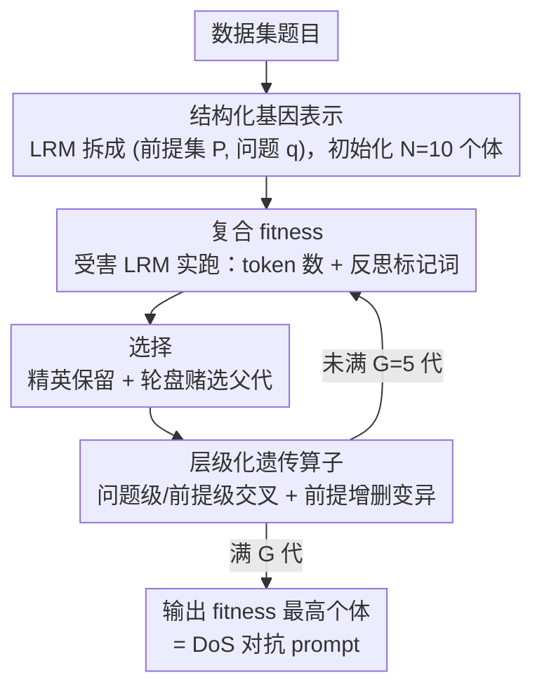

# Inducing Overthink: Hierarchical Genetic Algorithm-based DoS Attack on Black-Box Large Language Reasoning Models

**会议**: ICML 2026  
**arXiv**: [2605.13338](https://arxiv.org/abs/2605.13338)  
**代码**: 无  
**领域**: LLM推理 / AI安全 / 对抗攻击  
**关键词**: 过度思考, DoS 攻击, 遗传算法, 推理模型, 黑盒攻击

## 一句话总结
本文针对大型推理模型 (LRM) 易被"逻辑残缺输入"激发过度思考的弱点，提出一个层级化遗传算法 (HGA)，在纯黑盒条件下把结构化分解后的题目当成基因，通过句子级/问题级交叉和增删变异搜索逻辑断裂的对抗样本，最高可在 MATH 上把响应长度放大 26.1 倍，制造低成本 DoS 攻击。

## 研究背景与动机

**领域现状**：DeepSeek-R1、GPT-o3、Qwen3-Thinking 等推理模型已被广泛部署，token 数直接决定推理延迟和能耗成本（Gao et al. 2024）；同时社区发现推理模型存在"overthinking"现象：面对前提缺失或逻辑断裂的输入会反复 self-reflect、生成超长 CoT（Chen 2024, Fan 2025）。

**现有痛点**：(i) 现有 DoS / energy-latency 攻击（GCG, Engorgio）大多依赖白盒梯度，对商用闭源 API 不可用；(ii) 黑盒 AutoDoS 类方法靠拉长 prompt 长度堆 token，对推理模型的"思考"机制利用不足；(iii) Fan et al. 的 Missing-Premise (MIP) 数据集靠人工构造，没法自动化也没法对抗优化；(iv) OverThink 攻击靠人手设计 decoy task，覆盖窄。

**核心矛盾**：能利用推理链特殊性的方法靠人工，能自动化的方法又不利用推理链——黑盒、推理感知、可自动化三者尚无方法同时满足。

**本文目标**：(i) 在纯黑盒、纯文本接口下，设计一个能自动放大 LRM 推理 token 的攻击；(ii) 攻击信号要直接命中"过度思考"行为而不仅是"输出更长"；(iii) 攻击样本要能跨模型迁移，把搜索成本从昂贵商用 API 转嫁到开源代理模型。

**切入角度**：把题目视作"前提集合 + 最终问题"的结构化基因，而不是不可拆分的字符串。这样就能在"前提-问题"配对层面做交叉变异，生成语义可读但逻辑链断裂的扰动题，正好踩中 LRM"前提不全/前后不一致就疯狂反复思考"的弱点。

**核心 idea**：用层级化遗传算法在 (前提集, 问题) 空间搜索，配合"长度 + 反思标记词"的复合 fitness，自动演化出能诱发过度思考的题目。

## 方法详解

### 整体框架
攻击要解决的问题是：在只能调文本 API 的纯黑盒条件下，自动找到能让推理模型疯狂拉长 CoT 的题目。整体把每道题当成可演化的"基因"来搜索——先让 LRM 把题面拆成结构化的 $(\mathbf{P}, q)$（前提列表 + 最终问题），用 $N=10$ 个个体初始化种群；每一代让受害模型实际跑一遍、按输出 token 数和反思标记词频率打 fitness，再用精英保留 + 轮盘赌选父代，做问题级交叉、前提级交叉、前提删除、前提添加四种操作生成子代；跑满 $G=5$ 代后留下 fitness 最高的个体作为对抗样本。

### 关键设计

**1. 结构化基因表示：把题面拆成可操作的逻辑积木**

以往 GCG 这类白盒攻击在字符 / token 层面加后缀扰动，结果既破坏可读性、又没踩到推理逻辑的痛处。本文换了个粒度：把每道题表示成个体 $x = (\mathbf{P}, q)$，其中 $\mathbf{P} = [p_1, \ldots, p_n]$ 是一组前提、$q$ 是最终问题，整个搜索空间是 $\mathcal{X} = \{(\mathbf{P}, q)\mid \mathbf{P}\subseteq\mathcal{S}, q\in\mathcal{S}\}$，初始种群由 Qwen3-Thinking 把数据集题目分解得到。拆成"逻辑积木"之后，遗传算子就能在前提-问题这个结构层面做交叉变异，生成的样本语义仍然可读、但因果链被打断——而前提不全、前后矛盾正是 LRM 陷入反复 self-reflect 的触发点。

**2. 复合 fitness：长度叠加反思标记词**

如果只优化输出长度，搜索很容易停在"靠堆 padding 把回答撑长"的局部最优，并没有真正激发过度思考。本文给 fitness 加了第二个目标：一边用 $\text{score}_1(x) = |R(x)|$ 数 CoT 的 token 数量化篇幅，一边用 $\text{score}_2(x) = \sum_{w\in\mathcal{V}}\text{Count}(w, R(x))$ 统计 "Wait/But/However/Hmm" 这类反思标记词的出现次数——后者相当于在黑盒下对"模型有多纠结"的可观察代理。两项按代内 z-score 归一化后线性组合：

$$f(x) = \alpha \cdot \hat{\text{score}}_1 + (1-\alpha)\cdot\hat{\text{score}}_2$$

实验里 $\alpha=0.5\sim 0.7$ 明显优于纯长度（$\alpha=1$）或纯反思（$\alpha=0$），反思标记词像一个指南针，把搜索引向真正让模型陷入自我怀疑循环的题目，跨模型迁移时也更稳（迁到 DeepSeek-R1 时 $\alpha=0.7$ 仍稳赢 $\alpha=1.0$）。

**3. 层级化遗传算子：在两个粒度上撕开逻辑**

破坏逻辑结构不能只有一种方式，所以算子分两个层级。交叉以概率 $p_c$ 触发：问题级交叉直接把两个父代的 $q$ 互换，让前提集和问题张冠李戴；前提级交叉则随机互换一条前提。变异以概率 $p_m$ 触发：删除一条前提让推理链缺料，或从别的个体借一条前提塞进来注入无关条件。问题级算子专攻"前提-问题契不契合"，前提级算子在内部制造矛盾，二者刚好覆盖"问题失配"和"前提冲突"两类逻辑断裂。这里不追求语义自然反而是优势——题目越读越糊涂，LRM 就越要反复推理。

### 损失函数 / 训练策略
没有任何可训练参数，全程是无梯度黑盒搜索：种群 $N=10$、进化 $G=5$ 代、$p_c=0.8$、$p_m=0.2$，每代每个个体调一次 API 评 fitness，单模型总 budget 约 60 次查询，最终输出 fitness 最高的个体作为 DoS 攻击 prompt。

## 实验关键数据

### 主实验

| 数据集 | 模型 | BASE Avg-len | MIP Avg-len | HGA Avg-len | Max-len 放大 |
|--------|------|--------------|-------------|-------------|--------------|
| SVAMP | Qwen3-Thinking | 634 | 2231 | 5447 | 7906 (6.9×) |
| SVAMP | GPT-o3 | 239 | 620 | 3346 | 6562 (8.5×) |
| GSM8K | DeepSeek-R1 | 343 | 3093 | 4121 | 9068 (18.1×) |
| MATH | Qwen3-Thinking | 3618 | 7184 | 13007 | 22303 (2.5×) |
| MATH | Gemini-2.5-Flash | 2889 | 8043 | 12147 | 18011 (2.7×) |

HGA 全面碾压 BASE 和 MIP；MATH 上最大放大达到 26.1×（论文 Table 2 总结）。

### 消融实验

| 设置 | 关键指标 | 说明 |
|------|---------|------|
| $\alpha=1.0$（纯长度） | MATH Max-len 14132 / Avg 6258 | 退化为简单堆字符 |
| $\alpha=0.5$（平衡） | MATH Max-len 32019 / Avg 16826 | 双目标互补，最佳 |
| $\alpha=0.7$ | MATH Max-len 26576 / Avg 18315 | 反思加权高，平均更长 |
| 迁移 $\alpha=0.7$→DeepSeek-R1 (MATH) | Max 31998 / Avg 10893 | 复合 fitness 跨模型仍稳赢纯长度 |
| Qwen3-14B 代理 → GPT-o3 (SVAMP) | Avg 提升 7.1× | 小开源模型上演化的 prompt 直接打商用 API 仍生效 |

### 关键发现
- $\alpha$ 中间值最优：纯长度目标会停在"局部冗长"局部极值，加入反思标记词作为指南针能引导到真正诱发自我怀疑循环的样本，且这一结论在迁移到 DeepSeek-R1 时依然成立。
- 高效率：MATH 上 HGA 仅用 99 个 input token 就把 DeepSeek-R1 output 推到 32768 上限，而 AutoDoS 需要 2652 input token 才到 16009——说明攻击力来自逻辑扰动而非堆字符。
- 迁移性强：用开源 Qwen3-14B 作 fitness 评估代理，演化出来的 prompt 平均把 GPT-o3 放大 7.1×、Qwen3-Thinking 8.1×，说明"overthinking"是 LRM 跨架构共性弱点。
- 搜索 budget 边际递减：种群和代数从 5→30 的收益迅速饱和，小预算就能找到强对抗样本，攻击成本极低。

## 亮点与洞察
- **"逻辑残缺"作为黑盒攻击信号**：把扰动从字符层抬到逻辑层，等于把对抗样本的搜索空间从 token 词表换成了"可拼接的子句集合"，可读性、可扩展性、可迁移性都大幅提升，对未来 prompt-level 对抗攻击是一个范式提示。
- **反思标记词作为代理奖励**：直接把 "Wait/But/Hmm" 数量当作"思考强度"的可观察 proxy，绕过了"如何在黑盒下估计内部计算量"这一难题，作者甚至建议把这一项移植到白盒方法的 loss 里。
- **代理模型迁移攻击**：把昂贵的 fitness 评估外包给开源 14B，搜索成本降一两个数量级，cold-start 直接打商用 API 这一点对防御方非常有警示意义。
- **首次把过度思考和 DoS 攻击连起来**：把一个"效率问题"重新定义为"安全问题"，开了一个新的研究方向。

## 局限与展望
- 攻击仍依赖反复查询受害模型，单题 60 次评估在高 QPS 限频或带速率检测的 API 上会被识别。
- 反思标记词词表手工选，对会用其他自然语言（中文、代码思考）的模型可能失效。
- 仅在数学推理 benchmark (GSM8K / SVAMP / MATH) 验证，对代码生成、多轮 agent 等场景的迁移没测。
- 防御侧讨论很少，只笼统建议"行为监测 + 鲁棒训练"，没给具体 baseline。
- 攻击主要把推理链拉长，但不强制错答；如果防御方设计 early-stop + answer cache 可能直接绕过。

## 相关工作与启发
- **vs GCG (Zou 2023)**：GCG 白盒、做 token 后缀优化，本文黑盒、做逻辑结构扰动；表 1 中本文是唯一同时满足"黑盒 + 推理感知 + 自动化"的方法。
- **vs AutoDoS / Crabs (Zhang 2025b)**：AutoDoS 通过构造 "DoS Attack Tree" 拉长 prompt 长度，输入 token 数比 HGA 大 20×+；HGA 走结构化扰动路线，输入少、输出长，更隐蔽更高效。
- **vs OverThink (Kumar 2025)**：OverThink 靠人手插 decoy 任务，本文用 GA 自动演化，规模化优势大。
- **vs Deadlock (Zhang 2025a)**：Deadlock 强行触发"Wait/But"循环让模型陷入无限思考，HGA 不用强插 token，靠题目本身的逻辑破绽让模型自发陷入循环，更不易被启发式过滤识别。

## 评分
- 新颖性: ⭐⭐⭐⭐ 把"逻辑结构基因 + 反思标记词 fitness"组合提出来是新角度，跨模型迁移结论也很有冲击力。
- 实验充分度: ⭐⭐⭐⭐ 4 个 SOTA 推理模型 × 3 个数据集 × BASE/MIP/AutoDoS 三类 baseline，加 $\alpha$、代理迁移、搜索 budget 三个 ablation，覆盖较全。
- 写作质量: ⭐⭐⭐⭐ 三段动机（scope/quality/automation）+ 对比 Table 1 把 positioning 讲得很清晰；方法部分公式略密但分层清楚。
- 价值: ⭐⭐⭐⭐ 揭示了 LRM 一个普适且容易被利用的弱点，对部署侧的限流、cost cap、思考长度上限设计有直接推动作用。

<!-- RELATED:START -->

## 相关论文

- [\[ICML 2026\] DecepChain: Inducing Deceptive Reasoning in Large Language Models](decepchain_inducing_deceptive_reasoning_in_large_language_models.md)
- [\[ACL 2026\] Merlin's Whisper: Enabling Efficient Reasoning in Large Language Models via Black-box Persuasive Prompting](../../ACL2026/llm_reasoning/merlin39s_whisper_enabling_efficient_reasoning_in_large_language_models_via_blac.md)
- [\[ICML 2026\] Modeling Hierarchical Thinking in Large Reasoning Models](modeling_hierarchical_thinking_in_large_reasoning_models.md)
- [\[ICML 2026\] Diagnosing Multi-step Reasoning Failures in Black-box LLMs via Stepwise Confidence Attribution](diagnosing_multi-step_reasoning_failures_in_black-box_llms_via_stepwise_confiden.md)
- [\[ICML 2026\] Internalizing Safety Understanding in Large Reasoning Models via Verification](internalizing_safety_understanding_in_large_reasoning_models_via_verification.md)

<!-- RELATED:END -->
