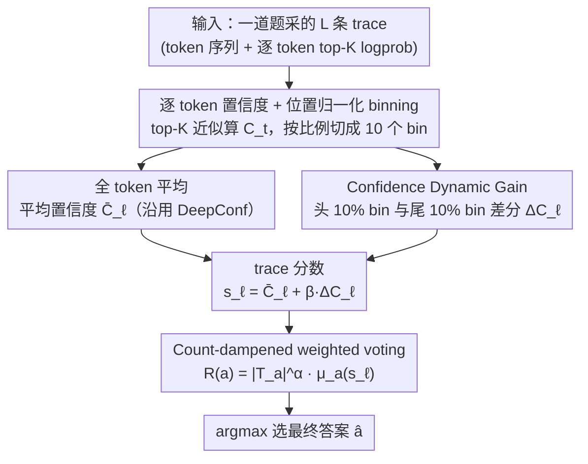

# Inference Time Optimization with Confidence Dynamics

**会议**: ICML2026  
**arXiv**: [2605.25244](https://arxiv.org/abs/2605.25244)  
**代码**: https://github.com/Accenture/CDG.git  
**领域**: LLM推理  
**关键词**: 置信度动态、Best-of-N、投票聚合、GRPO、推理时缩放

## 一句话总结
作者发现在 LLM 多次采样推理中，正确轨迹的置信度沿 reasoning chain 系统性上升而错误轨迹衰减或下降，据此提出 CDG（Confidence Dynamic Gain）投票——把"尾段置信度 − 头段置信度"作为额外判别信号嵌入 Best-of-N 加权投票，在四个开源推理模型 × 四个数学奥赛 benchmark 上平均较 majority voting 提升 5.4%、较 DeepConf 提升 1.7~4.8%。

## 研究背景与动机

**领域现状**：当前提升 LLM 推理准确率的主流路线是 Best-of-N 采样——对同一道题采 $L$ 条 reasoning trace，再用聚合函数挑出最终答案。最简单的 Self-Consistency 直接做 majority voting；近期的 DeepConf、Self-Certainty 等工作把模型置信度（序列级 perplexity、top-K log-prob 平均）作为投票权重，进一步压榨样本利用率。

**现有痛点**：上述基于置信度的方法都把一条 trace 的置信度**压成一个标量**——要么全 token 平均（DeepConf-Mean），要么只看尾段固定 2048 token（DeepConf-Tail）。这种静态聚合丢失了"置信度沿生成过程怎么演化"这一维信息：一条最后几 token 高置信、但中间一路打怵的 trace，和一条全程稳步爬升的 trace，在静态指标下完全等价。

**核心矛盾**：reasoning trace 是个时间序列，而现有 voting 把它当成 i.i.d. token 包。位置/动态信息（attention sink、lost-in-the-middle 等其他工作已经验证过其影响）在 inference-time scaling 里几乎没被用过。

**本文目标**：(1) 描述并量化置信度沿 reasoning trajectory 的演化是否对"正确 / 错误"有区分力；(2) 把这个动态信号嵌入 Best-of-N 投票；(3) 给一个机理解释——为什么 GRPO 训出的模型会有这种现象。

**切入角度**：作者在 4 个开源推理 LLM（DeepSeek-R1-8B / gpt-oss-20B / Gemma-3-27B / QwQ-32B）× AIME 2025 上做了一个简单实验：把每条 trace 按位置归一化切成 10 个 bin，画各 bin 的平均置信度曲线，按正确 / 错误分组对比，发现**正确组曲线尾部明显高于头部，错误组要么平、要么向下倾斜**，且统计显著（Appendix Table 5）。

**核心 idea**：定义"尾段置信度 − 头段置信度"为 Confidence Dynamic Gain $\Delta C_\ell$，作为对 trace 的一个额外打分项，与原有平均置信度线性组合后送入 count-dampened weighted vote。

## 方法详解

### 整体框架
CDG 要解决的是 Best-of-N 投票里"怎么从 $L$ 条 reasoning trace 里挑出对的那个答案"。它的输入是对一道题采的 $L$ 条 trace，每条带着 token 序列 $y_{\ell,1:T}$ 与逐 token 的 top-K log-prob；输出是投票选出的最终答案 $\hat{a}$。整条流水线先把每条 trace 的逐 token 置信度按位置归一化切成 10 个 bin，一路取全 token 平均得到平均置信度 $\bar{C}_\ell$、另一路量出"尾段比头段自信多少"这个标量 $\Delta C_\ell$，把两者线性组合成 trace 分数 $s_\ell$，最后用一个带频数阻尼的加权投票把分数聚到答案级取 argmax。整套方法完全 training-free，唯一额外开销是从推理栈把 token logprob 留下来。

### 关键设计

**1. 逐 token 置信度 + 位置归一化 binning：把任意长度的 trace 对齐成固定维度的曲线**

reasoning trace 长短差异巨大——短的几百 token、长的上万，按绝对位置切窗口根本对不齐，没法在群体层面比较头尾。CDG 先沿用 DeepConf 的 top-K 近似算逐 token 置信度 $C_t = -\frac{1}{K}\sum_{j\in\mathcal{K}_t}\log p(y_t=j)$（取 $K=20$，本质是 top-K log-prob 与均匀分布的 KL），再把 $T$ 个 token 等分成 $N=10$ 个 bin $\mathcal{B}_{\ell,n}$，bin 内取平均得 $\bar{C}_\ell^{(n)}$，于是每条 trace 都被映射成同样的 10 维向量 $(\bar{C}_\ell^{(1)},\ldots,\bar{C}_\ell^{(N)})$。正是这步位置归一化，让作者能把成百上千条长短不一的 trace 叠在同一张图上，看出"正确组尾部上扬、错误组尾部下挫"的统计模式（Figure 2）。

**2. Confidence Dynamic Gain $\Delta C_\ell$：用头尾差分把"越推越自信还是越推越虚"压成一个判别信号**

DeepConf-Tail 已经验证"尾段置信度"有用，但只盯尾部会混淆两类截然不同的 trace——"模型一上来就有把握的简单题"和"靠推理一步步获得把握的难题"在尾段绝对值上可能一样高。CDG 的关键动作是做减法：取头部 $P\%$ 与尾部 $P\%$ 的 bin 集合，定义 $\Delta C_\ell = \frac{1}{|T_{\text{tail},P}|}\sum_{n\in T_{\text{tail},P}}\bar{C}_\ell^{(n)} - \frac{1}{|T_{\text{head},P}|}\sum_{n\in T_{\text{head},P}}\bar{C}_\ell^{(n)}$（默认 $P=10$，即头 10% 与尾 10% 的 bin 之差），正值表示越推越自信、负值表示开局虚张声势但越想越没底。减去头部置信度等价于给每条 trace 做了一次 baseline 校准，奖励"推理过程中确实长见识"的 trace，惩罚"虎头蛇尾"的 trace。这个差分信号随后线性叠进 trace 分数 $s_\ell = \bar{C}_\ell + \beta\cdot\Delta C_\ell$，权重 $\beta$ 按模型校准：$\beta\in[0.5 r_b, 1.5 r_b]$，其中 $r_b = \mu_C / \Delta_\mu$，分母是正确 / 错误 trace 的平均 CDG 差，用几条 calibration 题估出。消融里若只用尾部不减头部（"No Start"）平均掉 4.4 个点、HMMT 上更掉 13.3 个点，说明真正起作用的是"置信度爬升幅度"而非"尾段绝对值"。

**3. Count-dampened weighted voting：压住频数项，让置信度信号真正进入决策**

有了 trace 分数还得聚到答案级，而朴素 majority voting 会让置信度信号被淹没——raw count 的量级远大于置信度均值那点微小差异。CDG 用 $R(a) = |\mathcal{T}_a|^\alpha \cdot \mu_a(s_\ell)$ 聚合，其中 $\mathcal{T}_a$ 是给出答案 $a$ 的 trace 集合、$\mu_a(s_\ell)$ 是该集合内 $s_\ell$ 的均值，最终答案 $\hat{a} = \arg\max_a R(a)$。指数 $\alpha\in[0,1]$（默认 0.5）专门用来给频数项降权：只有 $\alpha<1$ 时置信度均值才拉得动决策，消融中 $\alpha=1$（不阻尼）即便加上 $\Delta C_\ell$ 也被频数压倒、掉 1.7 个点。这个公式还顺手把已有方法写成了特例——$\alpha=1,\beta=0$ 退化为 DeepConf，$\alpha=1,\mu_a(s_\ell)=1$ 退化为 majority voting，于是 CDG 成了它们的严格泛化。

### 损失函数 / 训练策略
**无训练**。CDG 完全运行在已训好模型的 inference 阶段，只需要在推理时把 top-K log-prob 留下来。超参 $\alpha=0.5, P=10\%$ 全程固定；$\beta$ 按模型校准（DeepSeek-R1-8B、gpt-oss-20B 取 10；Gemma-3-27B、QwQ-32B 取 3），用一个 benchmark 校准、其余三个 benchmark 测试，做轮换式 cross-benchmark calibration。

## 实验关键数据

### 主实验
四个开源推理 LLM × 四个数学奥赛 benchmark（AIME 2024 / AIME 2025 / BRUMO 2025 / HMMT 2025），每题采 $L=512$ 条 trace。

| 模型 | Pass@1 | Majority | DC-Mean | DC-Tail | CDG (本文) | vs Majority |
|------|--------|----------|---------|---------|------------|-------------|
| DeepSeek-R1-8B | 75.8 | 84.2 | 84.2 | 88.3 | **90.8** | +6.6 |
| Gemma-3-27B | 25.7 | 35.0 | 35.0 | 40.0 | **41.7** | +6.7 |
| gpt-oss-20B | 66.5 | 82.5 | 84.2 | 85.0 | **85.8** | +3.3 |
| QwQ-32B | 69.7 | 75.0 | 75.9 | 78.3 | **80.0** | +5.0 |
| **整体平均** | 59.4 | 69.2 | 69.8 | 72.9 | **74.6** | **+5.4** |

CDG 在所有模型上的平均都拿到最高分；相对 DeepConf-Mean 提 4.8 个点，相对 DeepConf-Tail 提 1.7 个点。在更难的 AIME 2025 上提升最明显（DeepSeek-R1-8B 从 83.3 → 93.3，+10）。

### 消融实验

| 配置 | 整体平均 (%) | 说明 |
|------|-------------|------|
| Full CDG | 74.6 | $\alpha=0.5, \beta\in\{3,10\}$, 头尾差分完整 |
| D-CDG ($\beta=0$) | 70.0 | 去掉动态信号，仅 count 阻尼，等价 DeepConf-Mean |
| D-CDG ($\alpha=1$) | 72.9 | 去掉 count 阻尼，频数压倒置信度 |
| "No Start" | 70.2 | 不减头部，只用尾部置信度（−4.4） |

### 关键发现
- **头尾差分 ($\Delta C_\ell$) 不可省**：去掉头部 baseline 后 DeepSeek-R1 掉 6.6、HMMT 任务上掉 13.3，远大于"只换尾段长度"的差距——说明真正起作用的是"置信度爬升幅度"而非"尾段绝对值"。
- **Count 阻尼不可省**：$\alpha=1$ 时频数项淹没置信度信号，掉 1.7 个点。CDG 的两个杠杆 $\alpha, \beta$ 缺一不可。
- **\boxed{} token 不背锅**：作者专门做了去掉 \boxed{} 答案 token 后重算 CDG 的对照实验，结果选答案有 99% 一致、平均准确率差 0.0%，说明信号不是来自答案格式 token 的高置信度，而是真实的推理动态。
- **小样本仍优**：在 $L\in\{8,16,...,256\}$ 的 budget 扫描下 CDG 曲线全程压过 majority 与 DeepConf，且在小 $L$ 上提升曲线更陡，对预算敏感场景更友好。
- **方向统计验证机理**：在多数 (model, dataset) 组合上，正确 trace 的 $\Delta C_\ell > 0$ 占绝对多数、错误 trace $\Delta C_\ell < 0$ 占多数（Figure 4d）；Gemma 上虽然 wrong trace 仍有不少正 CDG，但幅度被压低，定性吻合理论。

## 亮点与洞察
- **"动态 > 静态"是个被低估的维度**：reasoning trace 自带时间结构，但 inference-time scaling 文献几乎只在"均值/尾段"两种聚合上打转。这篇用一个简单的"减法"就拿到 5 个点，说明 trajectory dynamics 这个赛道很空，可以扩展到 entropy gain、perplexity slope、attention entropy 演化等其他动态量。
- **从 GRPO 训练动力学反推推理时模式**：作者用 GRPO 的 group-normalized advantage $A_{\text{correct}} = \sqrt{(G-k)/k}, A_{\text{incorrect}} = -\sqrt{k/(G-k)}$ 加上"正确答案在尾部高度集中、推理路径在头部高度分散"这一组假设，推出"正确 trace tail-to-head logit 增益比 $M$、错误 trace 比 $\gamma M < M$"，进而 $\mathbb{E}[\Delta C_\ell|\text{correct}] - \mathbb{E}[\Delta C_\ell|\text{incorrect}] \geq c\cdot\eta_{\text{eff}}\sqrt{k(G-k)}(\gamma M - 1/M) > 0$。这把"经验现象"和"训练算法"拧到一根因果链上，结论自然外推到任何 advantage-weighted policy gradient + verifiable reward。
- **优雅泛化已有方法**：$R(a) = |\mathcal{T}_a|^\alpha \cdot \mu_a(\bar{C}_\ell + \beta\Delta C_\ell)$ 这一个公式同时把 majority voting、DeepConf-Mean、CDG 写成不同 $(\alpha,\beta)$ 的特例，方便后续工作在同一坐标系内消融。
- **可复用的 trick**：position-normalized bin（按比例切窗口）这个表示对任何"沿生成过程做统计"的下游任务都适用，例如可以拿来做生成早停、speculative decoding 的 verifier 信号、或 RL reward shaping。

## 局限与展望
- **依赖 token-level top-K logprob**：闭源 API（OpenAI 部分模型、Anthropic）不一定给完整的 top-K 分布，限制了在商用模型上的部署。
- **$\beta$ 是模型相关的**：作者给了 $\beta \in [0.5 r_b, 1.5 r_b]$ 的缩放规则，但仍需一小批 calibration 样本估 $r_b$，对新模型/新任务不是即插即用。
- **理论假设较强**：理论解释依赖 (A1) 正确 trace 在末位收敛到唯一 ground truth、(A2) reasoning 路径多样、(A3) 错误 trace 的尾部集中度低于正确 trace 这三个假设；对开放式生成（代码、长文写作）这些假设是否成立有待验证。作者排除了 Qwen-3（因为 post-RL 阶段有 entropy control 显式破坏 confidence trajectory）就是一个旁证：这套理论强依赖训练算法形态。
- **Benchmark 范围窄**：主结果全是数学奥赛，仅 Appendix 有 GPQA-Diamond 的部分结果。代码生成（LiveCodeBench）、通用推理（MMLU-Pro/BBH）、开放生成上的迁移性留作 future work。
- **Best-of-N 本身的代价**：$L=512$ 的开销不可忽视；虽然 CDG 在 $L=8$ 已经压过 majority，但延迟敏感场景仍不适合。后续可以与 DeepConf 的 on-the-fly 剪枝结合，做"早判 + 动态信号"的混合方案。

## 相关工作与启发
- **vs DeepConf-Mean / DeepConf-Tail (Fu et al. 2025)**：两者都把 trace 置信度压成标量（全段平均 / 尾 2048 token 平均），CDG 把它当成时间序列做头尾差。论文用同一公式 $R(a)$ 写出泛化关系：DeepConf-Mean 是 $\alpha=1,\beta=0$，CDG 是 $\alpha<1,\beta>0$。实验上 CDG 平均较 DC-Tail 提 1.7 个点，且小 $L$ 优势更明显。
- **vs Self-Certainty (Kang et al. 2025b)**：Self-Certainty 用全 trace KL(U‖p) 做投票权重，本质仍是静态置信度，等价于 DeepConf-Mean 的另一种归一化；CDG 的差分信号与之正交，理论上可以叠加。
- **vs Majority Voting / Self-Consistency (Wang et al. 2022)**：当 $\mu_a(s_\ell)\equiv 1$、$\alpha=1$ 时 $R(a) = |\mathcal{T}_a|$ 即 majority；CDG 在保持 majority "可解释"的同时引入 dampening + dynamic gain，比 majority 平均高 5.4 个点。
- **vs 过程奖励模型 (PRM, Uesato et al. 2022; Lightman et al.)**：PRM 需要训练一个外部 verifier 给每步打分，CDG 完全用现成模型自己的 logit 序列，无需训练数据/标注。CDG 提供的"自信度爬升"信号可视为"poor man's PRM"。
- **vs Ranked Voting (Wang et al. 2025) / Dynamic Voting (Xue et al. 2023)**：这些方法在 trace 数量层面动手脚（更少 trace 达到同精度），CDG 在分数函数层面动手脚，二者正交，可以叠加。
- **启发**：把 trajectory 看成时间序列、用"差分 / 斜率 / 曲率"作为额外信号，可以迁移到 (1) self-speculative decoding 的 verifier、(2) RLHF 中的过程奖励 shaping、(3) agent loop 里"何时停止思考"的早停信号、(4) 多智能体辩论中给每个 agent 的发言加权。

## 评分
- 新颖性: ⭐⭐⭐⭐ 现象观察（confidence gain 区分对错）确实是首次系统报告，方法本身相对 DeepConf 是一处巧妙的加项，不算颠覆但点子精准。
- 实验充分度: ⭐⭐⭐⭐ 4 模型 × 4 数据集 × 多种 ablation（α、β、L、P%、trace length、\boxed{} token），唯一缺憾是任务局限在数学奥赛、缺代码 / 长文 / 通用推理。
- 写作质量: ⭐⭐⭐⭐ 故事线清晰（观察 → 方法 → 理论 → 实验），公式与算法伪代码齐备，理论部分把假设、定理、解释分得很干净。
- 价值: ⭐⭐⭐⭐ Training-free、可与所有 reasoning LLM 复用、给后续 trajectory-dynamics 方向开了头，但 $\beta$ 校准与 logprob 依赖让"即插即用"打了点折扣。

<!-- RELATED:START -->

## 相关论文

- [\[ICLR 2026\] Fixing the Broken Compass: Diagnosing and Improving Inference-Time Reward Modeling](../../ICLR2026/llm_reasoning/fixing_the_broken_compass_diagnosing_and_improving_inference-time_reward_modelin.md)
- [\[ICML 2026\] Stabilizing Recurrent Dynamics for Test-Time Scalable Latent Reasoning in Looped Language Models](stabilizing_recurrent_dynamics_for_test-time_scalable_latent_reasoning_in_looped.md)
- [\[NeurIPS 2025\] Inference-Time Chain-of-Thought Pruning with Latent Informativeness Signals](../../NeurIPS2025/llm_reasoning/inference-time_chain-of-thought_pruning_with_latent_informativeness_signals.md)
- [\[ACL 2025\] Enhancing Retrieval Systems with Inference-Time Logical Reasoning](../../ACL2025/llm_reasoning/enhancing_retrieval_systems_with_inference-time_logical_reasoning.md)
- [\[ICML 2026\] Diagnosing Multi-step Reasoning Failures in Black-box LLMs via Stepwise Confidence Attribution](diagnosing_multi-step_reasoning_failures_in_black-box_llms_via_stepwise_confiden.md)

<!-- RELATED:END -->
