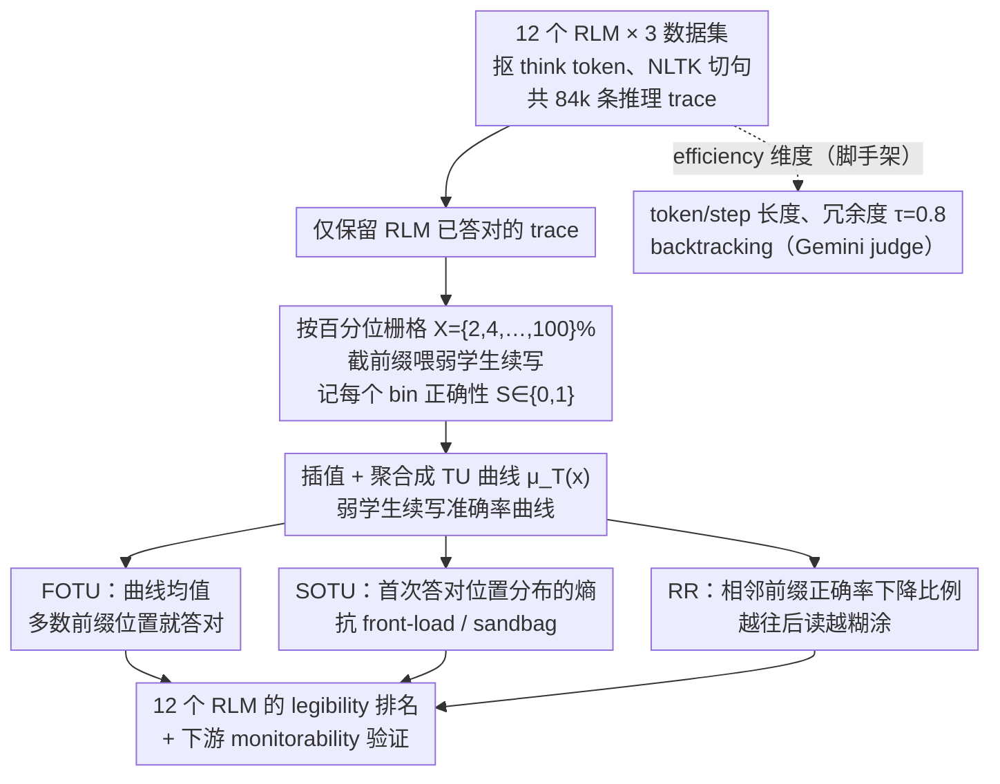

# Measuring Weak-to-Strong Legibility of Reasoning Models

**会议**: ICML 2026  
**arXiv**: [2603.20508](https://arxiv.org/abs/2603.20508)  
**代码**: 论文未公开 (作者承诺 code release)  
**领域**: LLM推理 / 可扩展监督 / 多智能体协作  
**关键词**: weak-to-strong legibility, transfer utility, reasoning trace, 弱监督, 推理可读性

## 一句话总结
本文提出 **Transfer Utility (TU)** ——把强推理模型 (RLM) 写出的中间推理 trace 按百分位前缀喂给一个弱学生模型，用弱学生续写出正确答案的能力来度量 trace 的"弱到强可读性"；在 12 个开源 RLM × 3 个数据集 × 85k 条 trace 上发现：**当前最准、最简洁的 RLM (如 GPT-OSS-120B) 的 trace 在 TU 排名中反而垫底**，说明 RLVR 训练把推理 trace 变成了"只对强模型有用"的工件。

## 研究背景与动机

**领域现状**：以 GPT-OSS、DeepSeek-R1、Kimi-K2-Thinking 为代表的推理模型 (RLMs) 主要用 RLVR (Reinforcement Learning with Verifiable Rewards) 训练，奖励信号只看最终答案对不对，中间推理 trace 被当作"附属产物"——能短就短、能扔就扔。

**现有痛点**：在可扩展监督 (scalable oversight)、模型蒸馏、agent 协作、trace caching 这些场景里，弱模型需要去"读懂"强模型的 trace。但现有 legibility 度量 (Kirchner et al. 2024 的 prover-verifier、Samineni et al. 2025 的 coherence、各种基于 token/step 长度的 efficiency 指标) 都偏向"简洁性"，没法刻画 trace 的"完备性 (thoroughness)"。一条"答案是 5"的 trace 在 efficiency 上完美，但显然不可用。

**核心矛盾**：legibility 既要**简洁**又要**完备**——简洁是省 token、降认知负载；完备是把关键推理步骤留给弱模型继续推。RLVR 优化只奖励正确性，结果在 efficiency 和 transfer 之间陷入了 trade-off，而现有度量根本看不到 transfer 这一维。

**本文目标**：(i) 给出一个不依赖强 LLM judge、不依赖人类标注的 legibility 度量；(ii) 用这个度量系统刻画 12 个主流 RLM 在 weak-to-strong 维度上的表现；(iii) 验证该度量能否预测下游弱监督 (monitorability) 的实际效果。

**切入角度**：legibility 本质是"弱模型能否把强模型的推理接下去"。作者把这个直觉操作化为一个交互实验——拿 RLM 已经答对的题，把它的 trace 截成前 $x\%$ 喂给一个弱模型 (Phi-3-Mini 3.8B / Llama-3.2-1B)，看弱模型能否接着写出正确答案。

**核心 idea**：用"弱学生从 trace 前缀续写的准确率曲线 $\mu_T(x)$"作为 legibility 的可测量代理，并从这条曲线衍生出三个互补的标量 (FOTU / SOTU / Regression Rate)，把"trace 是否对弱模型友好"这一性质量化下来。

## 方法详解

### 整体框架
Pipeline 三步走：

1. **生成 trace**：12 个 RLM 在 MATH / GPQA / LSAT 三个数据集上做题，按 think token 抠出推理 trace，NLTK 切句得到步骤序列，共 84,396 条 trace。
2. **算 efficiency 维度**：每条 trace 算 token/step 长度、句向量冗余度 ($\tau=0.8$ 阈值)、LLM-judge (Gemini 2.5-Flash) 标注的 backtracking 次数。
3. **算 transfer 维度 (本文核心)**：只对 RLM 已答对的题，按 $X=\{2,4,\ldots,100\}\%$ 的栅格把 trace 前缀喂给弱学生 $W$，弱学生最多再写 1024 token、强制给答案，记下每个 bin 的正确性 $S(R_p^{(x)})\in\{0,1\}$；trace 级曲线 $f_p(x)$ 用线性插值补齐，teacher 级曲线 $\mu_T(x)$ 是 trace 加权均值再在学生间均值。再从这条曲线衍生出 FOTU / SOTU / RR 三个互补标量，即下面的三个关键设计——它们共享同一条 TU 曲线，只是从均值、信息密度、局部劣化三个角度去刻画它。

### 关键设计

**1. Transfer Utility 曲线 $\mu_T(x)$ 与 FOTU：把"读懂 trace"换成弱模型的续写准确率**

可读性本来是个需要人类或强 LLM 主观评判的属性，prover-verifier 那套又是对抗式的、还得训练弱模型，循环依赖严重。作者干脆把它操作化成一条曲线：对老师模型 $T$ 的每条正确 trace $R_p$，每 3 步采一个前缀、归到最近的右边界 bin，喂给一个固定的弱学生看它能否续写出正确答案；trace 级正确性序列线性插值成 $f_p(x)$，再在 teacher 层面聚合成 $\mu_T(x)=\frac{1}{|\mathcal{S}|}\sum_{W\in\mathcal{S}}\frac{1}{|P_x|}\sum_{p\in P_x}f_p^{(W)}(x)$。一阶 transfer utility 就是这条曲线在所有 bin 上的均值 $\text{FOTU}(T)=\frac{1}{|X_T|}\sum_{x\in X_T}\mu_T(x)$，值越高表示"弱学生在 trace 的多数前缀位置就能接着写对"。之所以用百分位 bin 而非绝对步数，是为了让不同长度的 trace 可比；之所以用固定弱模型的下游成功率，是为了把一个主观属性换成客观、可重复、对评判者要求极低的代理量。

**2. Second-Order TU (SOTU)：用熵当"信息密度正则化器"防 reward hacking**

FOTU 单看有个漏洞——一条把答案塞在第一步 (front-load) 或拖到最后一步才暴露 (sandbag) 的 trace，照样能刷出虚高的 FOTU。SOTU 用"弱学生首次答对的位置分布"的熵来堵这个漏洞：对每条 trace、每个学生 $W$，记 $\tau_p^{(W)}=\min\{x:f_p^{(W)}(x)=1\}$ 为首次答对的 bin，统计成经验分布 $h_{T,W}(x)$，SOTU 即其归一化熵 $\text{SOTU}(T)=\frac{1}{|\mathcal{S}|}\sum_W \frac{-\sum_x h_{T,W}(x)\log h_{T,W}(x)}{\log|X|}\in[0,1]$。分布越均匀 (有用信息均匀铺开) SOTU 越高，越集中 (答案突然蹦出来) SOTU 越低，相当于强制 trace 把推理增量"分散摊开"而不是一次性甩出答案。实测里 FOTU 和 SOTU 呈负相关 ($\rho=-0.50$)，正好互为一对正交维度，这个"用首次达标位置的熵抗 front-load/sandbag"的套路也可迁移到任何按位置累积奖励的评测里。

**3. Regression Rate (RR)：度量"越往后读弱模型越糊涂"**

FOTU、SOTU 都是位置级的整体性质，看不出"加了更多 step 反而把弱学生带偏"这种局部劣化。RR 直接把每条 trace 在采样前缀上的正确性序列 $y_1,\ldots,y_K$ 当时序看，统计相邻位下降的比例 $\text{rr}(p,W)=\frac{1}{K-1}\sum_{i=1}^{K-1}\mathbb{1}[y_{i+1}<y_i]$，teacher 级再在正确 trace 上求均值、跨学生平均。RR 低说明几乎每一步都是正贡献，RR 高说明 trace 里藏着矛盾或误导性步骤。它和 efficiency 维度里的 backtracking 互补——backtracking 是 trace 自身的特征，RR 是同一个特征落到弱学生身上的下游后果。

### 评测协议
本文不训练任何模型，是纯**评测框架**。Efficiency 端的 redundancy 阈值 $\tau=0.8$ 由人工 sweep 选定，backtracking 用 Gemini 2.5-Flash 当 judge 并人工校验；transfer 端弱学生固定为 Phi-3-Mini (3.8B) 和 Llama-3.2-1B，并额外用 OLMo-3-7B-Instruct 做稳定性 check。

## 实验关键数据

### 主实验：12 个 RLM 在 6 个 legibility 维度上的排名

| 模型 (Acc%) | Token Len | Redund | Backtrack | FOTU | SOTU |
|---|---|---|---|---|---|
| GPT-OSS-120B (81) | 4 | **1** | 4 | 10 | 5 |
| GPT-OSS-20B (76) | 5 | 2 | 7 | 8 | 4 |
| Kimi-K2-Thinking (70) | 10 | 11 | 8 | **1** | 8 |
| DeepSeek-R1 (70) | 11 | 8 | 6 | 3 | 10 |
| DeepSeek-R1-Distill-32B (68) | 6 | 8 | 10 | 11 | 6 |
| Qwen3-8B (57) | 7 | 10 | 10 | 6 | 9 |
| Magistral-S (62) | 2 | 4 | 3 | 12 | 3 |
| Gemma-3-27B-it (53) | 2 | 5 | 2 | 8 | **1** |
| OpenReasoning-32B (58) | 12 | 7 | 5 | 2 | 12 |
| Gemma-3-12B-it (49) | **1** | 3 | **1** | 7 | 2 |

**关键观察**：(i) GPT-OSS-120B 准确率第 1，FOTU 排名第 10——**最强的模型 trace 反而对弱学生最不友好**；(ii) Gemma-3-12B-it 准确率倒数第 2，但 efficiency 三项全是第 1 名级别；(iii) Kimi-K2 / DeepSeek-R1 / QwQ-32B 走 "trace 又长又啰嗦但对弱学生友好" 路线 (3.8k–4.8k token，redundancy 16–31%)。accuracy 与 FOTU 的 Spearman $\rho=-0.35$。

### 下游验证：FOTU 能否预测弱监督 (monitorability)？

| 数据集 | 条件 | $\rho$(FOTU, Precision) | $\rho$(FOTU, F1) | $\rho$(FOTU, F1\|Len) |
|---|---|---|---|---|
| MATH | Sabotage | **+0.900***  | +0.845** | +0.745** |
| MATH | Natural (shared failure) | **+0.873***  | +0.809** | +0.582† |
| LSAT | Sabotage | +0.818** | +0.664* | +0.482 |
| LSAT | Natural | +0.664* | +0.591† | +0.082 |
| GPQA | Sabotage | +0.770** | +0.064 | -0.173 |
| GPQA | Natural | -0.305 | -0.709* | -0.436 |

**结论**：在 MATH 这类"过程可验证"任务上，FOTU 强烈预测 Phi-3-Mini 作为弱监督员的 precision；LSAT 上 precision 信号也在，但 recall 不行；GPQA (研究生级科学题) 上信号在长度 partialling 后崩塌——因为科学事实知识超出了 1B/3B 模型能力边界，trace 再可读也补不了 domain gap。

### 关键发现
- **Accuracy-Efficiency-Transfer 三角 trade-off**：现役 RLM 全在这三角的某条边上做选择，没人能三项都进 top 3，说明 RLVR 的单目标优化正在把推理 trace 变成"对强模型有用、对弱模型不友好"的工件。
- **Length 不是全部解释**：FOTU vs. FOTU\|Length 的 rank correlation 高达 +0.728，说明 FOTU 抓到的"内容结构"超越了"内容多少"。
- **Reward model 看不见 legibility**：Skywork、Llama-3.1-8B-RM-RB2、Qwen2.5-Math-PRM-7B 三个 reward model 与 FOTU 的相关性在 controlling for accuracy 后基本为 0 ($\rho \approx -0.08$)，说明当前 RM 训练目标里没有 legibility 这一维。

## 亮点与洞察
- **"用弱模型续写"作为 legibility 操作化定义** 是个非常聪明的设计——它把"可读性"这个本来需要人类或强 LLM 评判的主观属性，换成了一个客观可重复、对评判者要求很低的下游成功率。Kirchner 等人的 prover-verifier 框架是对抗式的，本文把它改成非对抗的协作式，反而打通了 legibility 在 safety / distillation / caching 上的统一度量。
- **SOTU 用熵抗 reward hacking** 的设计可以迁移到任何"按位置/时间累积奖励"的评测场景——只要担心被评测对象会把信号 front-load 或 sandbag，就可以用首次达标位置的熵作为"信息密度正则化器"。
- **"高准确率模型 trace 反而最差"的反直觉发现** 给 scalable oversight 社区敲了警钟：当大家都在卷 benchmark 准确率时，模型的"教学价值"在悄悄退化，而这正是 weak supervisor 监督强模型时最依赖的属性。

## 局限与展望
- **作者承认的局限**：(i) 单轮静态评测，未覆盖多轮 agent 场景；(ii) 闭源模型 (GPT-5/Claude-4.5/Gemini-3) 只能拿到 trace 摘要，被排除；(iii) 未做人类评测，model-to-model legibility 不等于 human legibility；(iv) backtracking 依赖 LLM judge，redundancy 阈值是人工挑的。
- **自己发现的局限**：(i) 弱学生选型集中在 1B–3.8B，没探索"中等弱学生" (~7B) 上 FOTU 排名是否会再变；(ii) 只评测正确 trace 的前缀，错误 trace 的 transfer 行为没系统刻画，但错误 trace 才是 oversight 真正关心的；(iii) MATH 的强信号可能部分来自"题型分布单一+可形式化验证"，跨更多 domain 的可推广性需要进一步证据；(iv) 没给出"如何把 TU 融入训练目标"的实操方案，只在 conclusion 提了一句 multi-objective reward。
- **具体改进思路**：把 FOTU 直接做成 RL 训练时的过程级辅助奖励——用弱学生作为 cheap critic 给 rollout 打分，与最终答案奖励加权融合，强迫模型同时优化 transfer。

## 相关工作与启发
- **vs Kirchner et al. 2024 (Prover-Verifier Games)**：他们用 weak verifier 训练 strong prover 抵抗 misaligned 输出，是对抗式 + 训练时；本文是非对抗的纯评测，目标从"对抗 robustness"扩到"协作 utility"，且不需要训练弱模型。
- **vs Samineni et al. 2025 (RLM 优化 coherence 而非 validity)**：他们指出 RLM trace 局部一致但全局可能有漏洞；本文进一步证明这种"局部光滑、全局不可教"的 trace 在 FOTU 上确实排名垫底，给 coherence-validity gap 提供了下游量化证据。
- **vs Hong et al. 2025 (embedding-based redundancy)**：本文直接复用其 sentence embedding cosine similarity 思路当 efficiency 维度之一，并把它与 transfer 维度并列，证明 redundancy 高 ≠ transfer 差 (DeepSeek-R1 redundancy 高但 FOTU 排名 3)。
- **启发**：任何"评测 trace 质量"的工作 (代码生成的 chain-of-thought、tool-use trajectory、agent planning) 都可以套这个"弱学生续写"范式——只要找得到一个能力明显较弱的同模态续写器，就能把一条 trace 的"教学价值"廉价量化出来。

## 评分
- 新颖性: ⭐⭐⭐⭐⭐ Transfer Utility 把 weak-to-strong generalization 从训练阶段搬到评测阶段，并给出 FOTU/SOTU/RR 三件套，是真正"换了一个视角看 reasoning trace"。
- 实验充分度: ⭐⭐⭐⭐ 12 模型 × 3 数据集 × 84k trace、3 个弱学生交叉验证、length partialling、bin 粒度 sweep、reward model decoupling 都做了，但缺中型 (7B) 弱学生和错误 trace 的系统分析。
- 写作质量: ⭐⭐⭐⭐ 把"为什么需要 transfer"的论证写得很顺，公式定义清晰；表 1 的 rank-with-delta 呈现把核心反直觉发现一眼能看到。
- 价值: ⭐⭐⭐⭐⭐ 给 scalable oversight、cooperative AI、RLVR 训练目标三件事同时提了实操级 critique，并把 legibility 推上 "first-class property" 的位置，对后续 RLM 评测范式有引领性。

<!-- RELATED:START -->

## 相关论文

- [\[ICLR 2026\] The Illusion of Diminishing Returns: Measuring Long Horizon Execution in LLMs](../../ICLR2026/llm_reasoning/the_illusion_of_diminishing_returns_measuring_long_horizon_execution_in_llms.md)
- [\[ICLR 2026\] Is It Thinking or Cheating? Detecting Implicit Reward Hacking by Measuring Reasoning Effort](../../ICLR2026/llm_reasoning/is_it_thinking_or_cheating_detecting_implicit_reward_hacking_by_measuring_reason.md)
- [\[ICML 2026\] Are Large Reasoning Models Interruptible?](are_large_reasoning_models_interruptible.md)
- [\[ICML 2025\] Putnam-AXIOM: A Functional & Static Benchmark for Measuring Higher Level Mathematical Reasoning in LLMs](../../ICML2025/llm_reasoning/putnam-axiom_a_functional_and_static_benchmark_for_measuring_higher_level_mathem.md)
- [\[ICML 2026\] Verifying Meta-Awareness via Predictive Rewards in Reasoning Models](verifying_meta-awareness_via_predictive_rewards_in_reasoning_models.md)

<!-- RELATED:END -->
