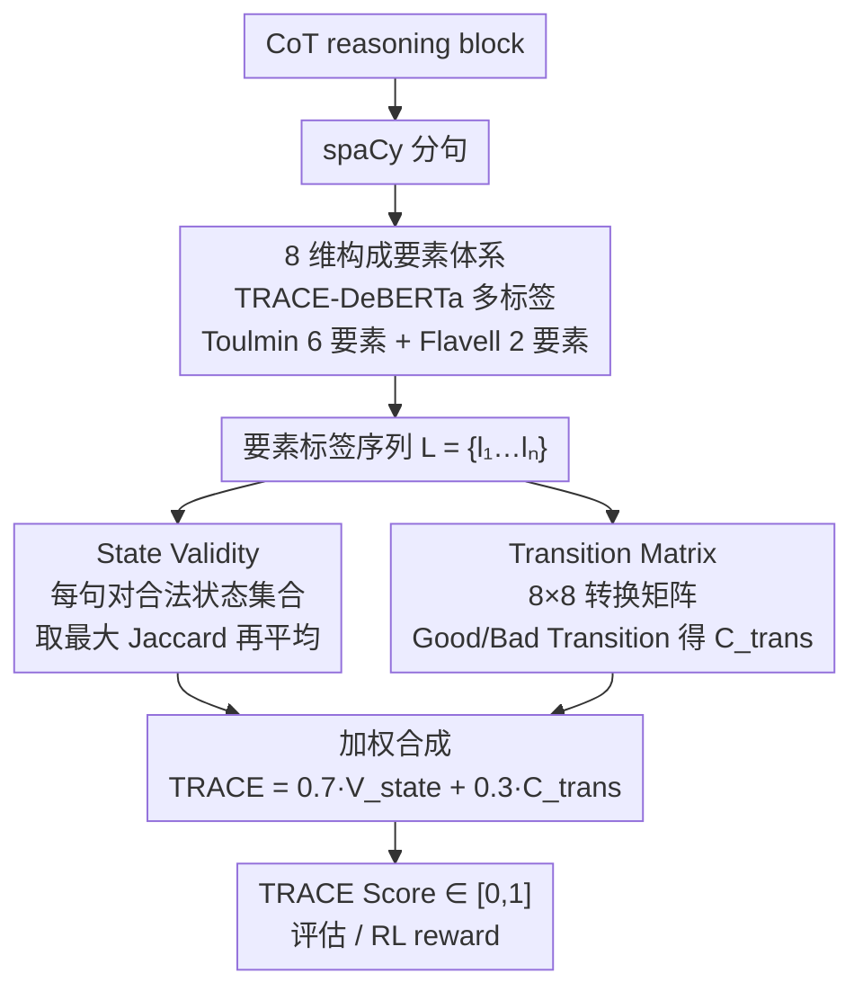

# TRACE: 用 Toulmin 论证模型评 LLM CoT 推理过程质量

**会议**: ICML 2026  
**arXiv**: [2605.29656](https://arxiv.org/abs/2605.29656)  
**代码**: https://github.com/hyyangkisti/trace  
**领域**: LLM 评估 / 推理分析 / 论证挖掘  
**关键词**: CoT 评估, Toulmin 论证, 元认知, 参考无关指标, RL reward

## 一句话总结
TRACE 是个参考无关的 CoT 质量评估指标，把 Toulmin 论证模型（Claim/Data/Warrant/Backing/Qualifier/Rebuttal）+ Flavell 元认知（Monitoring/Evaluation）合成 8 个构成要素，用 DeBERTa 多标签识别每句推理的要素，再算"State Validity + Transition Coherence"加权和；在 26.3K QA × 7 模型上与 benchmark accuracy 相关 $r=0.741$，且能当 RL reward 让 GSM8K 提升 +9.9%。

## 研究背景与动机

**领域现状**：LLM 现在依赖 CoT 做多步推理，但评估仍倒退到 outcome-based（准确率、exact match）或表面统计（困惑度、MTLD），拿不出"模型怎么想"的质量。LLM-as-judge 虽能评但是 black-box 且难以定位具体推理 flaw；ProcessBench/PRM 等步级标注法需 ground-truth verifier，scalability 差。

**现有痛点**：(1) outcome 指标把推理过程当黑盒，不能定位"哪一步错了"；(2) 表面统计（perplexity、length）跟实际推理质量解耦，长 CoT 不等于好 CoT；(3) LLM-as-judge 有 verbosity bias 和 position bias，且 prompt 工程化严重；(4) step-level 标注法依赖人工 ground truth 或 heavy verifier 模型，不能 scale。

**核心矛盾**：要"过程评估"得有结构化的"推理结构"定义，但 CoT 是自由文本，怎么从文本里抽出可量化的推理结构？以前的工作要么用 LLM 当 judge（不透明），要么用 step correctness 标注（贵）。

**本文目标**：找一个 reference-free、轻量、可解释的 CoT 评估指标，能对 LLM 的推理过程给打分，并能反馈给训练（如 RL reward）。

**切入角度**：哲学的论证理论（Toulmin 1958）和认知科学的元认知理论（Flavell 1979）几十年前就在研究"什么样的论证算合格"。Toulmin 把论证拆成 Claim/Data/Warrant/Backing/Qualifier/Rebuttal，是 domain-agnostic 的；Flavell 把元认知拆成 Monitoring（监控）和 Evaluation（评估）。这俩理论合起来正好覆盖 CoT 的"事实+逻辑+自省"三个维度。

**核心 idea**：把每句 CoT 用 DeBERTa 多标签分类到 8 个要素，定义"合法状态集合 $\mathcal{S}_{\mathrm{allowed}}$"（如 Claim、Backing+Evaluation 是合法组合，Qualifier+Claim 是 hedged 弱组合），算每句的 Jaccard 相似度作为 State Validity；再用 transition matrix 区分 Good Transition（Evidence→Claim）和 Bad Transition（Monitoring→Qualifier），算 Transition Coherence；最终 $\mathrm{TRACE} = 0.7 V_{\mathrm{state}} + 0.3 C_{\mathrm{trans}}$。

## 方法详解

### 整体框架

TRACE 想解决的是"怎么不靠标准答案就给一段 CoT 的推理过程打分"。它把这件事拆成两步走：先把 reasoning block 用 spaCy 分句，逐句送进 TRACE-DeBERTa 做 8 维多标签分类，得到一条要素标签序列 $L = \{l_1, l_2, \dots, l_n\}$；再在这条序列上算两个互补的量——每句结构合不合法（State Validity）、句与句之间转得顺不顺（Transition Coherence），最后加权合成一个 $[0,1]$ 的 TRACE Score。整条 pipeline 不碰 ground-truth，所以对没有标准答案的开放任务也能用。

分类器是 DeBERTa-v3-base 加一个 8 维 sigmoid 多标签头。训练数据靠 GPT-5.1 和 Claude 4.5 Sonnet 交替少样本生成 100k 句子（喂进 Toulmin/Flavell 的要素定义当 few-shot），评测集则是 3 位 senior NLP researcher 在 400 句上人工标注、Cohen's κ=0.672。最终 Macro F1=0.666 已经贴着这条人类一致性上限，说明剩下的误差主要是任务本身的歧义而非分类器拉胯。

### 关键设计

**1. Toulmin + Flavell 的 8 维构成要素体系：把"推理质量"从感觉变成可量化的标签向量**

痛点是 CoT 本身是自由文本，没有可量化的"推理结构"定义，过去要么交给 LLM 黑盒打分、要么标 step correctness。TRACE 的做法是直接借两套现成的理论框架：Toulmin 论证模型给 6 个要素——Claim（断言）、Data/Evidence（证据）、Warrant（推断规则）、Backing（背景支撑）、Qualifier（限定词）、Rebuttal（反驳）；Flavell 元认知补 2 个——Monitoring（检查自己思路）、Evaluation（评估结论合理性）。每句 CoT 用 sigmoid 多标签，可以同时挂多个标签，例如 "By Pythagorean theorem (Warrant), since 3² + 4² = 9 + 16 = 25 (Data), the hypotenuse is 5 (Claim)" 就被标成 {Warrant, Data, Claim}。这套之所以站得住，是因为 Toulmin 在哲学界用了 60 多年、本来就是 domain-agnostic 的，math/sci/law/写作都能套；Flavell 那两个元认知要素恰好对应现代 LLM 常见的 "wait, let me reconsider" 自检风格。维度定在 8 个也是实验调出来的——少于 8 区分不开推理风格，多于 8 标注一致性会掉到 < 0.5。

**2. State Validity + Allowed States：用合法状态集合惩罚结构上站不住的句子**

光有标签还不够，得判断每句是不是一个"合法论证单元"。TRACE 手工定义了一个合法状态集合 $\mathcal{S}_{\mathrm{allowed}}$：单独的 Claim/Data/Warrant/Backing 都算合法，复合状态如 Backing+Evaluation（既给背景又作评价）也合法，但 Qualifier+Claim 这种带过度限定的弱断言只给 $J=0.5$。对每句的标签集合 $l_i$，取它跟所有合法状态的最大 Jaccard 相似度，再对全篇取平均：

$$V_{\mathrm{state}} = \frac{1}{N} \sum_i \max\{J(l_i, s) : s \in \mathcal{S}_{\mathrm{allowed}}\}$$

这样一来，孤立的 Monitoring（"Hmm, let me think again"）或者堆一串 Qualifier（"maybe, perhaps, I think"）都会被扣分。它把"好推理 = 一连串合法论证单元"这个直觉变成了可量化的指标，同时允许复合状态又让风格丰富的句子不至于被冤枉。

**3. Transition Matrix：区分 Good/Bad 推理流，看的是句子之间转得顺不顺**

State Validity 只盯单句，会漏掉"每句都合法但流程不顺"的失败，所以还需要一个看转换的维度。TRACE 建了个 $8 \times 8$ 的 transition matrix，预定义哪些是 Good Transition（如 Evidence → Claim、Warrant → Claim、Monitoring → Evaluation）、哪些是 Bad Transition（如 Monitoring → Qualifier 意味着"既不确定又只能加 hedge"，Qualifier → Qualifier 意味着"反复犹豫"），再算实际转换概率分布跟 good-weighted 理想分布的接近程度得到 $C_{\mathrm{trans}}$。Figure 1 的 heatmap 直观印证了这点：Kimi-K2-Thinking 的 Good Transition 明显比 Qwen-Turbo 多、Bad Transition 显著少，跟人类对"谁推理结构更好"的直觉对得上。

最终分数把两维加权合成：

$$\mathrm{TRACE} = \alpha \cdot V_{\mathrm{state}} + (1-\alpha) \cdot C_{\mathrm{trans}}, \quad \alpha=0.7$$

State 拿 0.7 的更大权重，理由是"先有合法单元，才谈得上单元间衔接"；$\alpha=0.7$ 也是在多个 benchmark 上跑出来对 accuracy 相关性最大的取值。分数范围 $[0,1]$，越高代表推理过程结构越好。

## 实验关键数据

### TRACE-DeBERTa 分类性能（vs 人类）

| Label | Precision | Recall | F1 |
|------|-----------|--------|-----|
| Claim | 0.696 | 0.634 | 0.662 |
| Data/Evidence | 0.774 | 0.588 | 0.663 |
| Warrant | 0.602 | 0.544 | 0.547 |
| Backing | 0.780 | 0.612 | 0.685 |
| Qualifier | 0.865 | 0.783 | 0.821 |
| Rebuttal | 0.712 | 0.549 | 0.619 |
| Monitoring | 0.803 | 0.585 | 0.675 |
| Evaluation | 0.610 | 0.711 | 0.654 |
| **Macro Avg** | **0.730** | **0.626** | **0.666** |

Macro F1 0.666 接近 inter-annotator agreement Cohen's κ=0.672，说明剩余误差主要是任务本身的歧义而非系统性失败。Qualifier 因为表面词汇明显（maybe/perhaps）F1 最高 0.821；Warrant（隐含推断规则）F1 最低 0.547。

### TRACE Score vs Accuracy 相关性（7 LLMs × 39 benchmarks）

| 模型 | AIME 平均 Acc/TRACE | GSM8K Acc/TRACE | ARC 平均 Acc/TRACE | MMLU 多列 |
|------|---|---|---|---|
| GPT-OSS 120B | 82% / 0.641 | 99% / 0.751 | 98% / 0.711 | TRACE 0.66-0.75 |
| DeepSeek R1 | 92% / 0.581 | 97% / 0.591 | 97% / 0.640 | TRACE 0.55-0.65 |
| Kimi K2 Thinking | 85% / 0.628 | 98% / 0.646 | 81% / 0.672 | TRACE 0.64-0.68 |
| Qwen Turbo | 67% / 0.559 | 99% / 0.620 | 97% / 0.559 | TRACE 0.55-0.60 |
| Claude 3.7 Sonnet | 32% / 0.582 | 95% / 0.701 | 98% / 0.679 | TRACE 0.62-0.70 |

跨 26.3K reasoning block 对 Pearson 相关性 $r=0.741$，是 reference-free 指标里少见的强相关。

### Arena-Hard-v2.0 对齐 LLM-as-judge

| 类别 | TRACE 与 GPT-judge 一致率 |
|------|---|
| MATH | 64% |
| Reasoning | ~60% |
| 整体 | ~58% |

虽不如 LLM judge 高但作为零成本指标足够；MATH 一致率最高说明 TRACE 在严格逻辑任务上更可靠。

### RL Reward 应用：GSM8K

| 训练信号 | GSM8K Acc |
|---------|----------|
| Base (Qwen2.5-7B) | 71.5 |
| RL with accuracy-only reward | 76.2 |
| **RL with accuracy + TRACE reward** | **81.4** |

TRACE 当 RL reward 信号（与 accuracy 组合）让 GSM8K 提升 +9.9%（vs accuracy-only 提升 +4.7%），说明"过程奖励 + 结果奖励"组合比单纯结果奖励有更好的 reasoning 引导。

### 关键发现

- **TRACE 与 accuracy 强相关 ($r=0.741$)**：这个相关性比 perplexity（~0.3）和长度（~0.1）等表面指标高一个量级，证明"逻辑结构"才是真正的 quality proxy。
- **DeepSeek R1 准确率高但 TRACE 略低**：92% Acc 但 0.581 TRACE 显示"对的答案不一定推理过程优"——R1 经常用大量 Monitoring 反复检查得到正确答案，State Validity 被扣。
- **Kimi-K2-Thinking 比 Qwen-Turbo 多 Good Transition**：Figure 1 heatmap 直观显示，对"哪个模型推理结构更好"提供质化解释。
- **Warrant 最难标**：Warrant 是隐含推断规则（如"by definition X，所以..."），表面词不强，DeBERTa F1=0.547；inter-annotator 在 Warrant 上也最分歧。
- **RL with TRACE 提升 +9.9%**：证明 TRACE 不只是诊断工具，可直接闭环训练。

## 亮点与洞察

- **从哲学/认知科学借力做 ML 指标**：Toulmin 论证模型 1958 年提出，Flavell 元认知 1979 年提出，这些"古老"框架第一次被严肃拿来评 LLM 推理，且效果好——给跨学科借鉴提供范例。
- **8 维 multi-label 比 single category 更细**：以前 reasoning step 评估常用单分类（这步对/错），TRACE 让一句话可能同时是 Data + Warrant + Claim，更贴合人类推理。
- **State + Transition 双维度**：单看 State（结构合法性）会漏掉"句子都合法但流不顺"的失败；单看 Transition 会漏掉"流顺但内容空洞"的失败。两者乘起来更鲁棒。
- **可解释 + 可视化**：Figure 1 的 transition heatmap 让人类一眼看出"这个模型常犯什么类型的推理错"，对 LLM 调试和后训练指导有直接价值。
- **零监督需求**：不需要 ground-truth answer，对没有标准答案的开放任务（写作、对话）也适用。
- **既是诊断工具又是训练信号**：能当 reward 闭环优化，比纯静态评估指标价值大一档。

## 局限与展望

- **Warrant F1=0.547**：最重要的"推断规则"识别最差，意味着 TRACE 对"逻辑链 well-formed but 推断步骤跳跃"的失败（典型的人类犯错模式）敏感度不够。
- **手工 Allowed States 集合**：$\mathcal{S}_{\mathrm{allowed}}$ 是手动设计的（24+ 组合），跨语言、跨领域是否需要重新设计未验证。
- **$\alpha = 0.7$ 是 dataset-tuned**：在不同领域可能最优 $\alpha$ 不同（数学题可能 State 更重要，对话可能 Transition 更重要）。
- **8 个要素的完备性**：哲学论证理论之外还有其他维度（如因果推理、类比推理）可能没被覆盖。
- **RL reward 训练的"goodhart 风险"**：用 TRACE 当 reward 训练后模型可能学会"刷 TRACE 分数"而非真改善推理——RL 实验没有 long-horizon 训练后 hold-out 评估。
- **依赖句子级分割**：spaCy 中文/代码分句质量不一，跨语言 robustness 需验证。

## 相关工作与启发

- **vs LLM-as-judge (Zheng et al. 2023)**：他们用 GPT-4 当 judge 但黑盒、贵且有 bias；TRACE 用 100M 参数 DeBERTa 加规则，便宜、透明、可定位错误。
- **vs ProcessBench / PRM (Khalifa et al. 2025)**：他们需要 step-level correctness 标注；TRACE 完全无监督，可 scale 到任意领域。
- **vs Perplexity / MTLD**：表面指标与 accuracy 相关性 ~0.3；TRACE 达 0.74，说明"结构信息"才是关键。
- **vs MR-GSM8K / CofCA**：这些把推理分解成 step 评 correctness；TRACE 评 structural quality 不依赖正确答案。
- **启发**：跨学科借鉴（哲学论证 + 认知科学）给"过程评估"提供完整框架；这种"先有结构理论再落到 ML 指标"的方法可推广到对话评估、写作评估、教学评估等领域。

## 评分

- 新颖性: ⭐⭐⭐⭐⭐ 首次把 Toulmin + Flavell 用在 LLM CoT 评估上，是跨学科创新，且实现机制（8-element + State + Transition）原创且可复现。
- 实验充分度: ⭐⭐⭐⭐⭐ 7 LLM × 39 benchmark × 26.3K reasoning block 的相关性研究 + Arena-Hard 对齐 + RL reward 应用 + 人类标注校验，覆盖诊断和应用两端。
- 写作质量: ⭐⭐⭐⭐ 框架介绍清晰，heatmap 视觉效果好；少数 trade-off 选择（如 $\alpha=0.7$、Allowed States 集合）的设计动机偏经验。
- 价值: ⭐⭐⭐⭐⭐ 对 LLM 评估社区直接可用，对 LLM 训练（RL reward）有实证价值，开源代码降低门槛。

<!-- RELATED:START -->

## 相关论文

- [\[ICML 2026\] LatentChem: From Textual CoT to Latent Thinking in Chemical Reasoning](latentchem_from_textual_cot_to_latent_thinking_in_chemical_reasoning.md)
- [\[ICML 2026\] Many-Shot CoT-ICL: Making In-Context Learning Truly Learn](many-shot_cot-icl_making_in-context_learning_truly_learn.md)
- [\[ACL 2026\] Self-Consistency from Only Two Samples: CoT-PoT Ensembling for Efficient LLM Reasoning](../../ACL2026/llm_reasoning/self-consistency_from_only_two_samples_cot-pot_ensembling_for_efficient_llm_reas.md)
- [\[ACL 2025\] CoT-based Synthesizer: Enhancing LLM Performance through Answer Synthesis](../../ACL2025/llm_reasoning/cot-based_synthesizer_enhancing_llm_performance_through_answer_synthesis.md)
- [\[ICML 2026\] R2-Router: A New Paradigm for LLM Routing with Reasoning](r2-router_a_new_paradigm_for_llm_routing_with_reasoning.md)

<!-- RELATED:END -->
