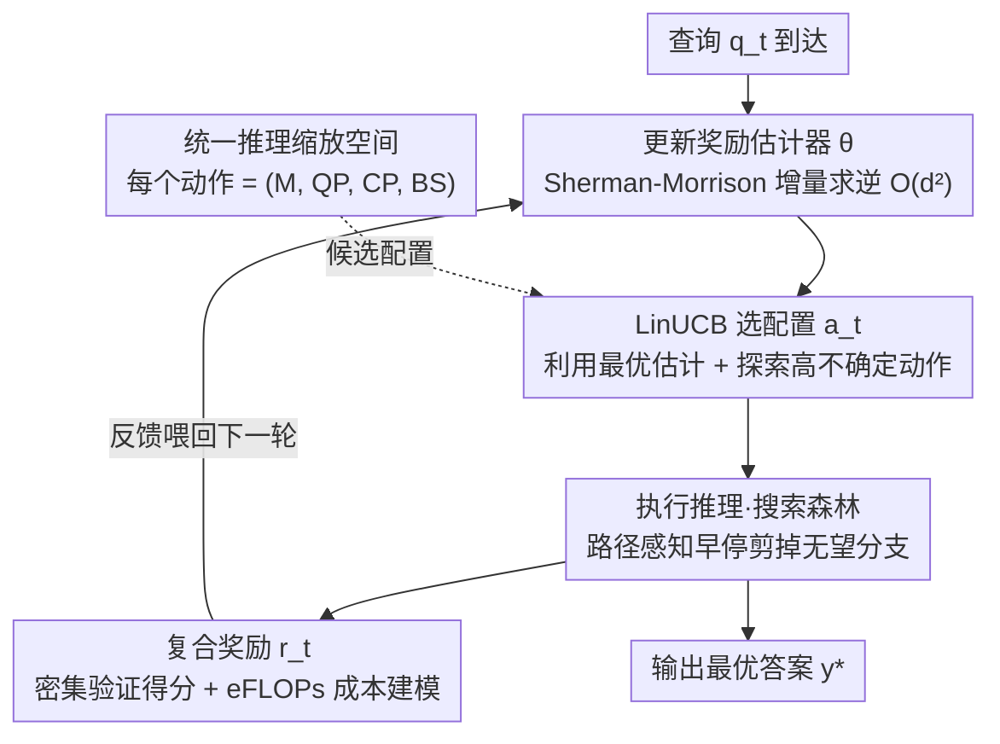

# UniScale：通过模型路由与测试时缩放在线联合优化的自适应统一推理缩放

**会议**: ICML 2026  
**arXiv**: [2605.30898](https://arxiv.org/abs/2605.30898)  
**代码**: 待确认  
**领域**: LLM 推理  
**关键词**: 模型路由, 测试时缩放, 联合优化, LinUCB, 上下文多臂老虎机

## 一句话总结
提出 UniScale 框架——将模型路由和测试时缩放统一到一个决策空间，通过 LinUCB 上下文多臂老虎机在线学习自适应推理策略，解决 LLM 部署中质量-成本的精细权衡问题。

## 研究背景与动机

**领域现状**：LLM 部署需在推理质量和计算成本间权衡。现有方法沿两个独立维度——模型路由（在不同规模模型间切换）和测试时缩放（TTS，在固定模型内增加推理时计算）。

**现有痛点**：模型路由仅支持离散切换，性能变化粗粒度；单模型 TTS 受模型固有容量限制，计算增加后收益递减；两种机制独立设计，无法在动态环境中协同工作。

**核心矛盾**：如何在保持计算效率的同时，提供从模型规模到推理深度的连续、精细的质量-成本权衡？

**本文目标**：构建统一推理缩放（UIS）范式，将模型选择和 TTS 参数作为单一优化空间的配置，支持在线自适应。

**切入角度**：将 UIS 配置选择建模为上下文多臂老虎机问题，捕捉查询复杂度与系统能力的对齐，支持环境漂移下的连续策略调整。

**核心 idea**：联合优化模型路由和 TTS，让两者相互弥补——TTS 缩小离散模型间的性能差距，路由在 TTS 收益递减时提供更大的模型。

## 方法详解

### 整体框架
UniScale 想解决的是 LLM 部署里"选大模型还是多搜索"这两件事一直被分开调的问题，把它们拧成一个在线闭环来联合决策。系统每来一个查询就转一圈：先用历史反馈更新奖励估计器，再用 LinUCB 获取函数从统一的配置空间里挑一个最优配置，接着执行推理并用路径感知早停砍掉没希望的分支，最后把验证器打分和算力成本揉成一个复合奖励喂回去优化策略。换句话说，模型选多大、搜索铺多宽，都是同一个老虎机在线学出来的。

### 关键设计

**1. 统一推理缩放空间：把模型路由和测试时缩放塞进同一个决策变量**

传统做法里模型路由只能在几个离散规模间跳，性能台阶粗；单模型 TTS 加算力又很快撞到模型容量天花板，收益递减。UniScale 的解法是把一次推理直接参数化成联合配置 $(M, QP, CP, BS)$——$M$ 是选哪个基础模型，$QP$（问题并行度）、$CP$（候选并行度）、$BS$（束大小）三个则刻画在这个模型上怎么铺测试时搜索。这样一来，离散模型之间留下的性能空隙可以靠加大搜索强度去填，而当搜索强度铺到平台、再加也没用时，就换上更大的 $M$ 越过这道墙。两套机制因此互为补充，共同张出一条连续、精细的质量-成本前沿，而不是各调各的。

**2. 基于 LinUCB 的在线适应学习：让配置选择自己在部署中学**

有了连续配置空间，难点变成"对当前这个查询该挑哪个配置"，而且线上环境会漂移、不能离线一锤定音。UniScale 把它建成上下文多臂老虎机：先把查询和候选动作编码成联合语义表示 $\mathbf{x}_{t,a}$，用线性预测器 $\hat{r}_t = \langle \mathbf{x}_{t,a}, \boldsymbol{\theta} \rangle$ 估计这个配置能拿多少奖励，再按 LinUCB 获取函数选

$$a_t = \arg\max_{a \in \mathcal{A}}\left(\hat{\boldsymbol{\theta}}_t^\top \mathbf{x}_{t,a} + \alpha\sqrt{\mathbf{x}_{t,a}^\top \mathbf{A}_t^{-1} \mathbf{x}_{t,a}}\right)$$

前一项是利用当前最优估计，后一项是给没怎么试过的配置加探索奖励，$\alpha$ 控制两者的平衡。这样既能捕捉"什么复杂度的查询配什么强度的系统"这层对齐，又能在非平稳环境里快速收敛；更新协方差矩阵 $\mathbf{A}_t$ 时用 Sherman-Morrison 公式做增量逆，把每步复杂度从 $\mathcal{O}(d^3)$ 压到 $\mathcal{O}(d^2)$，保证在线推理时这层开销可以忽略。

**3. 路径感知早停 + 密集验证 + 成本建模：把推理变便宜，把奖励信号变密**

搜索铺得宽就费算力，而老虎机要学得快又得有信息量足够的反馈，这一组三件套同时解决这两头。路径感知早停在搜索过程中动态掐掉没前途的分支——只要一条路径走到第 $j$ 步时，其乐观上界仍低于当前最优阈值，就提前放弃：

$$\frac{j \cdot V(p_{i,j}) + (H_{\max}-j) \cdot v_{\sup}}{H_{\max}} < V_{\max}$$

其中 $V(p_{i,j})$ 是已走部分的验证得分，$(H_{\max}-j)\cdot v_{\sup}$ 是剩余步数按最乐观分值的补足，整体即便最好也比不过 $V_{\max}$ 就剪掉，从而显著压低各配置的推理成本。密集验证反馈则不再只看最终答案对错，而是把二值正确性和验证器的连续得分一起纳入；成本建模用等价 FLOPs（eFLOPs）把计算和内存开销折算到同一把尺子上。三者最后汇成喂给 LinUCB 的复合奖励

$$r_t = w_1 \cdot \text{Correct}(a_t) + w_2 \cdot \text{Score}(a_t) + w_3 \cdot (1-\tilde{C}_{\text{UIS}}(a_t))$$

正确性、过程质量、归一化成本三项加权——既保证省下来的算力不以掉质量为代价，也给策略学习提供了比"对/错"丰富得多的训练信号。

## 实验关键数据

### 主实验对比

| 方法 | 成本敏感模式奖励 | 成本敏感模式准确率 | 质量优先模式奖励 | 质量优先模式准确率 |
|------|------------|------------|------------|------------|
| Random | 0.5731 | 55.00% | 0.6175 | 52.88% |
| Greedy | 0.5589 | 45.00% | 0.5780 | 52.88% |
| k-NN | 0.6590 | 41.38% | 0.5807 | 46.75% |
| **UniScale (TTS)** | **0.7184** | **43.75%** | **0.6184** | **46.50%** |
| **UniScale (路由)** | **0.5873** | **34.12%** | **0.5459** | **50.00%** |
| **UniScale (UIS)** | **0.5589** | **45.00%** | **0.5780** | **52.88%** |

### 消融实验

| 配置 | 完整模型奖励 | 去掉路径感知早停 | 去掉密集验证 | 去掉成本模型 |
|------|---------|----------|---------|---------|
| UIS 完整 | 0.6590 | -8.2% | -5.7% | -4.3% |
| 仅 TTS | 0.7184 | -6.1% | -3.9% | -2.8% |

### 关键发现
- UIS 相比单独 TTS 和路由分别提升 8.2% 和 12.1% 奖励，验证联合优化的有效性。
- 路径感知早停贡献最大消融（-8.2%），其次密集验证反馈（-5.7%）。
- 成本敏感和质量优先模式下均表现最优，展示方法的泛适应性。

## 亮点与洞察
- **创新的问题重构**：将独立的模型路由和 TTS 融合为统一决策空间。
- **高效的在线学习**：LinUCB+Transformer 编码器的组合既保证快速收敛又降低计算开销。
- **工程上的完整性**：三层机制（早停、验证、成本模型）紧密配合每层都解决实际部署的具体痛点。

## 局限与展望
- 成本建模假设——eFLOPs 映射在异构硬件上仍有偏差。
- 验证器依赖——性能上界受验证器质量限制。
- 改进方向：融入模型定量调优与动态 verifier 更新；扩展到流式/多轮对话场景。

## 相关工作与启发
- **vs 模型集成路由**：传统路由离散切换，本文连续缩放。
- **vs 单模型 TTS**：TTS 在固定模型下受容量限制，本文通过路由突破。
- **vs 强化学习方法**：LinUCB 提供理论保证（regret 界）且在线效率高。

## 评分
- 新颖性: ⭐⭐⭐⭐⭐  统一框架设计原创度高。
- 实验充分度: ⭐⭐⭐⭐  覆盖 TTS、路由、UIS 三个维度，对比基线可更丰富。
- 写作质量: ⭐⭐⭐⭐⭐  逻辑清晰，问题引入自然。
- 价值: ⭐⭐⭐⭐⭐  直接解决 LLM 部署实际需求，框架易推广。

<!-- RELATED:START -->

## 相关论文

- [\[ICML 2026\] Beyond Two-Stage Training: Cooperative SFT and RL for LLM Reasoning](beyond_two-stage_training_cooperative_sft_and_rl_for_llm_reasoning.md)
- [\[ICML 2026\] Verifying Meta-Awareness via Predictive Rewards in Reasoning Models](verifying_meta-awareness_via_predictive_rewards_in_reasoning_models.md)
- [\[ICML 2026\] When to Re-Plan: Subgoal Persistence in Hierarchical Latent Reasoning](when_to_re-plan_subgoal_persistence_in_hierarchical_latent_reasoning.md)
- [\[ICML 2026\] Conformal Thinking: Risk Control for Reasoning on a Compute Budget](conformal_thinking_risk_control_for_reasoning_on_a_compute_budget.md)
- [\[ICML 2026\] A Formal Comparison Between Chain of Thought and Latent Thought](a_formal_comparison_between_chain_of_thought_and_latent_thought.md)

<!-- RELATED:END -->
