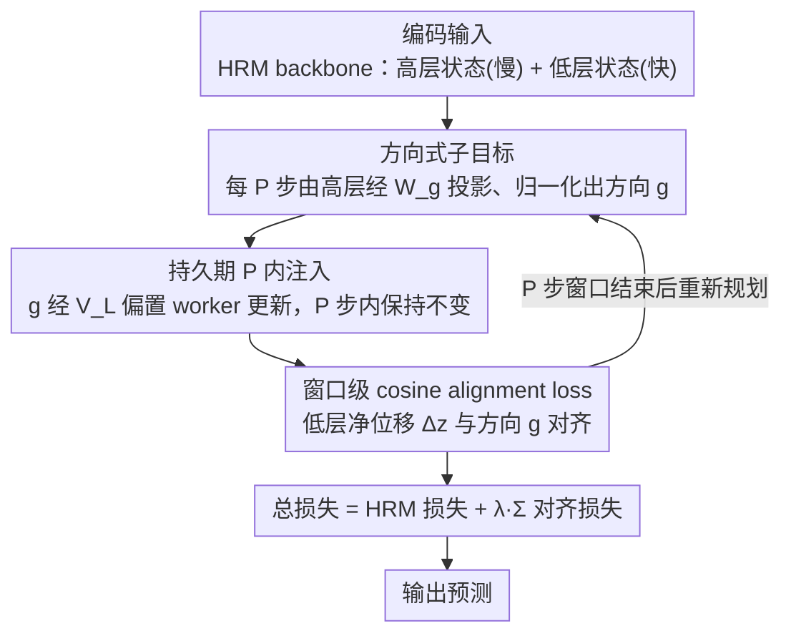

# When to Re-Plan: Subgoal Persistence in Hierarchical Latent Reasoning

**会议**: ICML 2026  
**arXiv**: [2606.03741](https://arxiv.org/abs/2606.03741)  
**代码**: 无公开代码  
**领域**: LLM 推理 / 潜变量推理架构  
**关键词**: 层级推理, 潜变量计算, 子目标持久性, HRM, 规划稳定性  

## 一句话总结
这篇论文在 Hierarchical Reasoning Model 中加入 manager-worker 式持久子目标，发现潜变量推理里的关键不是单纯注入子目标，而是子目标应该持续 $P=3$ 到 $6$ 个低层更新步，过快重规划会破坏组合结构，过强 alignment 又会干扰任务学习。

## 研究背景与动机
**领域现状**：长程推理系统通常有两条路线。一条是显式 chain-of-thought，把推理写成 token 序列；另一条是 latent reasoning，把多步计算压进隐藏状态，在模型内部做迭代更新。HRM 这类层级潜变量架构用慢速高层状态和快速低层状态实现更深的内部计算。

**现有痛点**：显式 token 推理天然有“每个 token 约束后续 token”的时间结构，而 latent reasoning 的 hidden state 更新没有这种外部承诺。高层状态可以每一步都改主意，也可以长时间不改；架构本身没有告诉我们中期意图应该持续多久。

**核心矛盾**：如果子目标每一步都重发，worker 还没来得及围绕它形成多步计算，目标就被覆盖；如果子目标持续太久，worker 的隐藏状态已经漂移，旧目标会变僵硬。也就是说，latent planner 需要在稳定性和适应性之间找到合适的重规划周期。

**本文目标**：作者想经验性刻画 subgoal persistence 的作用：在 HRM 中显式加入 feudal-style 子目标，系统扫描 manager period $P$ 和 alignment weight $\lambda$，回答什么时候该重新规划。

**切入角度**：论文把 reinforcement learning 中 option / feudal hierarchy 的“承诺时间”概念移植到 latent reasoning。这里的 action 不是环境动作，而是低层隐藏状态更新；manager 输出的目标是 latent space 中的方向向量。

**核心 idea**：让高层模块每隔 $P$ 个 micro-steps 发出一个归一化方向子目标 $g$，在这 $P$ 步内持续偏置低层更新，并用 cosine alignment loss 让低层净位移朝这个方向前进。

## 方法详解
方法叫 Subgoal-Augmented HRM。它保留 HRM 原本的慢速高层状态 $z^H$ 和快速低层状态 $z^L$，在两者之间加一个显式子目标接口。高层状态不再只通过 recurrent coupling 隐式影响低层，而是周期性投影出一个方向向量，让 worker 在接下来多个更新步中沿这个方向组织内部计算。

### 整体框架
HRM backbone 有两个 latent states：低层状态每个 micro-step 更新，高层状态每 $T$ 个低层步更新一次。Subgoal-Augmented HRM 额外引入 manager period $P$。在 $t_k=kP$ 时刻，高层状态通过 $W_g$ 输出 $\tilde g_k=W_g z^H_{t_k}$，再归一化成 $g_k=\tilde g_k/(\|\tilde g_k\|_2+\epsilon)$。这个 $g_k$ 在接下来 $P$ 个低层更新中保持不变。

低层更新时，子目标通过投影 $V_L$ 加到输入或低层更新中，形成持续的 steering term。为了避免子目标只是一个无约束 bias，论文还在每个 commitment window 上计算低层状态净位移 $\Delta z^L_k=z^L_{t_k+P}-z^L_{t_k}$ 与 $g_k$ 的 cosine alignment loss。整条流水线可概括为：高层状态周期性发出方向子目标 → 在 $P$ 步窗口内持续注入偏置 worker → 用窗口对齐损失约束 worker 真朝该方向前进 → 窗口结束后重新规划。

### 关键设计
**1. 方向式子目标而非目标状态**：要给 latent reasoner 一个中期意图信号，最直接的做法是让 manager 指定一个该到达的绝对 hidden state，但 latent hidden dynamics 本身非平稳，worker 状态一直在漂移，硬追一个固定终点会很脆弱。论文改成输出单位方向：manager 在 $t_k$ 时刻把高层状态经 $W_g$ 投影、再 L2 归一化成 $g_k=\tilde g_k/(\|\tilde g_k\|_2+\epsilon)$，表达“接下来往哪里走”而不是“必须走到哪”。还可选一个 commitment gate $\alpha_k=\sigma(w_\alpha^\top z^H_{t_k})\in(0,1)$，在高层状态不确定时软化承诺强度。方向是让 manager 承诺中期意图、又不过度规定执行细节的最小结构，因此能提供规划先验而不锁死 worker。

**2. 持久期 $P$ 控制稳定性-适应性折中**：架构本身并不规定一个 latent 意图该持续多久——这正是本文要回答的核心 knob。论文让发出的方向在 $t\in[t_k,t_k+P)$ 这 $P$ 个低层 micro-step 内保持不变（$g(t)=g_k$），并经学习投影 $V_L$ 作为加性 bias 持续注入低层更新：$z^L_{t+1}=f_L(z^L_t,z^H_t,\tilde x_t+\alpha(t)V_Lg(t);\theta_L)$（可选地也经 $V_H$ 注入高层更新）。$P=1$ 表示每步重规划，$P$ 越大承诺越久。核心假设是 compositional latent computation 需要至少几个连续更新步围绕同一意图累积；没有持久性，manager-worker 架构就只有形式、没有功能——这一点被“$P=1$ 反而比无子目标 baseline 还差”的负结果直接验证。

**3. 窗口级 cosine alignment loss**：持续注入只是在每一步给 worker 加 bias，并不保证 worker 的整段轨迹真的朝子目标方向前进。论文为每个承诺窗口取净位移 $\Delta z^L_k=z^L_{t_k+P}-z^L_{t_k}$，用 cosine 对齐损失 $\mathcal{L}_{align}^{(k)}=1-\cos(\Delta z^L_k,g_k)$ 奖励位移与方向一致，总损失 $\mathcal{L}=\mathcal{L}_{HRM}+\lambda\sum_k\mathcal{L}_{align}^{(k)}$（由于 HRM 在 segment 间 detach state，对齐损失也只在 segment 内反传）。这把子目标从“附加输入特征”升级为约束 worker 几何走向的“内部先验”。但权重 $\lambda$ 不能太大，否则方向约束会与任务梯度竞争——实验中 $\lambda\approx0.05$ 像轻量先验最优，$\lambda\ge0.20$ 明显有害。

### 损失函数 / 训练策略
训练目标是 HRM 原始任务损失与 ACT halting loss，加上子目标窗口的 alignment loss。实验固定 HRM backbone：hidden size 512，4 层 high-level transformer、4 层 low-level transformer，8 heads，最大 16 个内部 steps，并用 AdamATan2、base learning rate $10^{-4}$、weight decay 0.1 训练。

论文报告两组实验制度：主研究用 CPU、global batch size 768、arc-aug-1000 数据，扫描 $P$ 和 $\lambda$；干扰消融用单张 NVIDIA L4、batch size 64、较小 augmentation，在 $\lambda=0.10,P=4$ 下比较 full、baseline 和 random directions。作者强调不同制度的绝对 loss 不可横向比较，只比较同一制度内部差异。

## 实验关键数据

### 主实验
主实验在 ARC-AGI 和 ConceptARC 派生的 arc-aug-1000 训练集上评估，主要指标是 train LM loss，同时观察 token-level accuracy、exact accuracy、alignment loss 和 ACT halting depth。最关键的自变量是子目标持久期 $P$ 和 alignment 权重 $\lambda$。

| 设置 | 指标 | 结果 | 对照 | 提升 |
|--------|------|------|----------|------|
| 无子目标 baseline | LM loss ↓ | 1.640 | HRM 原始结构 | 参考线 |
| $P=1,\lambda=0.05$ | LM loss ↓ | 1.674 | baseline 1.640 | 更差，说明每步重规划有害 |
| $P=2,\lambda=0.05$ | LM loss ↓ | 1.638 | baseline 1.640 | 只有极小改善 |
| $P=3,\lambda=0.05$ | LM loss ↓ | 1.544 | baseline 1.640 | 下降 0.096，最佳单点 |
| $P=3$ 到 $P=8$ | LM loss 区间 | [1.544, 1.590] | baseline 1.640 | 中等过度承诺仍可接受 |
| ConceptARC-mini | LM loss ↓ | 2.308 | baseline 2.316 | 方向一致但幅度小 |

### 消融实验
论文的关键消融是：当 $\lambda=0.10$ 已经过了最佳点时，性能下降到底来自架构容量、辅助损失，还是 learned direction 本身？作者在相同训练制度下比较三个 cell。

| 配置 | 关键指标 | 说明 |
|------|---------|------|
| A_full | Train LM loss 1.327，vs baseline +0.100 | 学习方向 + 注入 + alignment loss 全开，过强方向造成干扰 |
| B_baseline | Train LM loss 1.227 | 关闭注入和 alignment，退化为 vanilla HRM |
| E_random | Train LM loss 1.230，vs baseline +0.003 | 随机单位方向几乎等于 baseline |
| A_full vs E_random | 差距 0.097 | 干扰主要来自 learned directional content，而非额外模块或辅助 loss 本身 |
| $\lambda$ sweep | $\lambda\approx0.05$ 最优，$\lambda=0.10$ 接近 baseline，$\lambda\ge0.20$ 更差 | alignment 更像软先验，不适合作为强约束 |

### 关键发现
- 持久性是必要条件。$P=1$ 比无子目标还差，说明“有 manager、有 goal vector、有 injection”本身不够，goal 必须持续足够长才能组织多步 latent computation。
- 最佳区间是不太短但也不太硬的 $P\in[3,6]$。从 $P=3$ 到 $P=8$ 衰减很慢，说明 stale subgoal 的坏处小于无承诺的坏处。
- alignment loss 的最佳权重很窄。$\lambda=0.05$ 像轻量规划先验，$\lambda=0.10$ 开始与任务目标竞争，$\lambda\ge0.20$ 明显有害。
- 随机方向消融非常关键。它说明过强 alignment 的问题不只是“多了一个 loss”，而是 learned direction 真的在争夺 representational capacity。

## 亮点与洞察
- 论文的问题问得很精准：latent reasoning 不是只要“多算几步”，还要决定内部意图多久更新一次。这个时间尺度问题在显式 CoT 中被 token 序列天然掩盖，在 latent computation 中必须显式设计。
- $P=1$ 失败是很有说服力的负结果。它直接排除了“只是多一个子目标模块就有帮助”的解释，把贡献压到 persistence 机制上。
- 随机方向消融也很漂亮。E_random 与 baseline 几乎一样，说明 learned subgoal 不是装饰；它既能在合适权重下帮助，也能在过强时伤害。

## 局限与展望
- 评估主要是 ARC/ConceptARC 风格任务，且主指标是 train LM loss。它能说明机制行为，但还不足以证明在更广泛推理任务上的泛化。
- 最强结论是经验性和行为性的，缺少 representation-level 分析，例如子目标是否真的对应可解释的子问题或中间程序结构。
- 消融实验中的 past-sweet-spot 分析使用单 seed，虽然差距远大于主实验 seed 方差，但更稳妥的多 seed 消融仍有必要。
- 方法引入了额外超参数 $P$ 和 $\lambda$。实际部署中，如果不同任务需要不同持久期，可能还需要自适应或可学习的重规划机制。

## 相关工作与启发
- **vs Chain-of-Thought**: CoT 用显式 token 形成推理轨迹和承诺，本文研究 hidden-state 内部的承诺时间，对低延迟 latent reasoning 更相关。
- **vs 原始 HRM**: HRM 有高低层循环和 halting，但没有显式中期意图信号；本文把高层状态转化为持久方向目标。
- **vs Feudal RL / Options**: 本文借用 manager-worker 和 temporal abstraction 思想，但把 action 从环境动作换成 hidden-state updates，适配潜变量推理。
- **可迁移启发**: 未来的 latent planner 可以学习何时 re-plan，而不是固定 $P$；也可以把 subgoal direction 与可解释中间任务、程序片段或检索目标对齐。

## 评分
- 新颖性: ⭐⭐⭐⭐☆ 把子目标持久性作为 latent reasoning 的核心变量来研究，角度新且机制简单。
- 实验充分度: ⭐⭐⭐☆☆ 扫描和消融能支撑机制结论，但任务范围和主指标仍偏窄。
- 写作质量: ⭐⭐⭐⭐☆ 论文围绕稳定性-适应性 tradeoff 展开，叙述清楚，负结果和消融都解释得好。
- 价值: ⭐⭐⭐⭐☆ 对构建内部规划型推理模型有启发，尤其提醒 latent reasoning 架构要显式处理重规划时间尺度。

<!-- RELATED:START -->

## 相关论文

- [\[ICML 2026\] How Far Ahead Do LLMs Plan? Uncovering the Latent Horizon in Chain-of-Thought Reasoning](how_far_ahead_do_llms_plan_uncovering_the_latent_horizon_in_chain-of-thought_rea.md)
- [\[ICLR 2026\] $\textbf{Re}^{2}$: Unlocking LLM Reasoning via Reinforcement Learning with Re-solving](../../ICLR2026/llm_reasoning/textbfre2_unlocking_llm_reasoning_via_reinforcement_learning_with_re-solving.md)
- [\[ICLR 2026\] When Shallow Wins: Silent Failures and the Depth-Accuracy Paradox in Latent Reasoning](../../ICLR2026/llm_reasoning/when_shallow_wins_silent_failures_and_the_depth-accuracy_paradox_in_latent_reaso.md)
- [\[ICML 2026\] Modeling Hierarchical Thinking in Large Reasoning Models](modeling_hierarchical_thinking_in_large_reasoning_models.md)
- [\[ICML 2026\] The Deterministic Horizon: When Extended Reasoning Fails and Tool Delegation Becomes Necessary](the_deterministic_horizon_when_extended_reasoning_fails_and_tool_delegation_beco.md)

<!-- RELATED:END -->
