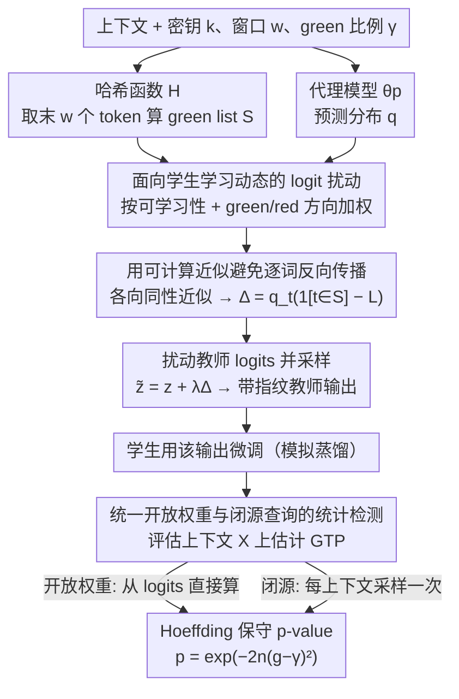

# Antidistillation Fingerprinting

**会议**: ICML2026  
**arXiv**: [2602.03812](https://arxiv.org/abs/2602.03812)  
**代码**: https://github.com/YixuanEvenXu/antidistillation-fingerprinting  
**领域**: LLM安全  
**关键词**: 模型指纹, 反蒸馏, 文本水印, 蒸馏检测, 统计假设检验  

## 一句话总结
这篇论文提出 Antidistillation Fingerprinting (ADFP)，用代理学生模型估计哪些水印 token 最容易被蒸馏过程吸收，从而在几乎不牺牲教师输出质量的情况下，更可靠地检测第三方模型是否训练过教师模型输出。

## 研究背景与动机
**领域现状**：前沿 LLM 的训练成本极高，模型拥有者通常只能通过 API 或有限发布方式开放能力；与此同时，第三方可以用教师模型输出微调较小的学生模型，以较低成本复制教师行为。已有文本水印方法，尤其是 red-and-green-list watermark，会用密钥和哈希函数把候选 token 分成 green list 与 red list，再在采样时提升 green token 的概率。后续如果学生模型也表现出更高的 green-token 偏好，就可以把这种偏好当成蒸馏痕迹。

**现有痛点**：传统水印把所有 green token 近似一视同仁地加 logit 偏置。它能让教师输出带有统计信号，但并不关心学生模型在微调时会如何更新参数。结果是，想让指纹真正进入学生模型，往往需要把教师输出扰动得很强；扰动一强，推理质量、对话自然度或代码正确率就会下降，甚至出现重复、格式混乱等可见异常。

**核心矛盾**：指纹检测依赖学生模型微调后仍保留密钥相关的 green-token 偏好，而普通水印优化的是教师当前输出是否偏向 green list，两者目标并不完全一致。也就是说，一个 token 是否是 green token 还不够，关键是训练在这个 token 上是否会把学生模型推向“以后更容易生成 green token”的方向。

**本文目标**：作者希望把“输出水印”改造成真正面向蒸馏检测的“模型指纹”：一方面，在开放权重和闭源查询两种学生模型评估场景下给出统计上可解释的 p-value；另一方面，在数学推理、开放对话和代码生成任务中，以更小的教师质量损失换来更强的检测置信度。

**切入角度**：论文借用了 antidistillation sampling 的思想：如果能用一个代理学生模型近似真实学生的学习动态，就可以选择那些更容易影响学生未来行为的 token，而不是机械地放大所有 green token。这个代理模型不需要等同于真实学生，只要能提供有用的优化方向。

**核心 idea**：把水印采样的目标从“让当前教师输出更绿”改成“采样会让学生微调后更绿的 token”，用代理模型的 logit-space 梯度构造面向蒸馏学习动态的指纹扰动。

## 方法详解
ADFP 的核心不是另起一个新检测器，而是重写水印采样阶段的扰动方式。检测端仍然使用 red-and-green-list 系列方法熟悉的密钥哈希和 green-token 统计，但生成端不再均匀偏置 green list，而是让扰动幅度依赖代理学生模型的预测分布。

### 整体框架
方法包含两个阶段。第一阶段是带指纹的教师采样：模型拥有者选择哈希函数 $H$、密钥 $k$、窗口大小 $w$ 和 green-list 比例 $\gamma$；在每一步生成时，根据上下文最后 $w$ 个 token 计算 green list $S=H(x_{-w:},k)$，再用代理模型 $\theta_p$ 的预测分布为教师 logits 加上 ADFP 扰动并采样下一个 token。这样得到的教师输出会被潜在的学生模型拿去微调。

第二阶段是蒸馏检测：模型拥有者准备一组评估上下文 $X$，用同一个密钥 $k$ 统计学生模型在这些上下文后生成 green token 的平均概率，也就是 GTP (average green-list token probability)。如果学生没有训练过带该密钥指纹的数据，GTP 应围绕 $\gamma$ 波动；如果训练过，GTP 会系统性偏高。论文用 Hoeffding 不等式给出保守 p-value：当观测到 $g_{obs}>\gamma$ 时，$p=\exp(-2n(g_{obs}-\gamma)^2)$，其中 $n$ 是去重后的评估上下文数量。

检测时分两类场景。若学生是开放权重模型，可以直接从 logits 计算每个上下文的 green-token 概率；若学生是闭源模型，只能对每个上下文采样一次 next token，再统计 green-token 频率。两者都共享同一套零假设：学生生成与密钥无关。

### 关键设计
**1. 面向学生学习动态的 logit 扰动：让扰动对准“学生学得进去”的 token**

传统 red-and-green-list 对所有 green token 一视同仁地加同一个 logit 偏置，它只管教师这一步输出是否偏绿，却完全不管这个 token 在学生微调时会不会被真正学进去——结果想让指纹内化就得粗暴加大扰动，质量随之崩坏。ADFP 改成让扰动幅度随 token 的“可学习性”变化：设代理模型在当前上下文的预测分布为 $q$、green list 为 $S$、当前 green-token 总概率为 $L=\sum_{t\in S}q_t$，则对 token $t$ 的扰动为 $\Delta^{ADS}_t=q_t(\mathbf{1}[t\in S]-L)$。式中 $q_t$ 让方法聚焦于代理认为更可能被采到的高概率 token（它们也最可能成为学生训练里的有效监督），$\mathbf{1}[t\in S]-L$ 则是一个 advantage 基线：green token 得到正向放大、red token 被压低，把学生推离非指纹方向。这样指纹优化的目标从“教师当前是否采到 green token”前移成“训练后学生是否更绿”，在更小的质量代价下让指纹被内化。

**2. 用可计算近似避免逐词反向传播：把梯度内积化成一次代理前向的闭式分数**

上面这个扰动若按 antidistillation sampling 的原始定义 $\Delta_t=\langle\nabla_{\theta_p}\log q_t,\nabla_{\theta_p}L\rangle$ 计算，需要对词表里每个 token 各做一次 backward pass，在线 decoding 根本跑不动。论文把梯度投影到 logit 空间，并令 logits 对参数梯度的 Gram 矩阵近似为各向同性的 $K\approx cI$；在这个近似下与 token 无关的常数项会在采样归一化时抵消，化简后剩下的正是 $q_t(\mathbf{1}[t\in S]-L)$——只需代理模型一次前向的 softmax 概率即可算出。作者进一步证明：若代理模型只有最后一层线性适配层可训练，这个各向同性结论可以精确成立。正是这步近似把方法降到能直接插进常规 LLM 采样流程的复杂度。

**3. 统一开放权重与闭源查询的统计检测：把模型归因写成保守的假设检验**

检测端不依赖拿到学生权重，而是统计学生在一组评估上下文 $X$ 后生成 green token 的平均概率 GTP。论文先按最后 $w$ 个 token 对 $X$ 去重，使不同上下文对应的 green list 在密钥随机性下近似独立。开放权重学生可直接从 logits 平均 green-token 概率；闭源学生只能对每个上下文采样一次、构造 Bernoulli 指示变量。两种场景在零假设（学生生成与密钥无关）下，每一项都是 $[0,1]$ 中均值为 $\gamma$ 的独立随机变量，于是能用同一条 Hoeffding 上界给出保守 p-value：观测到 $g_{obs}>\gamma$ 时 $p=\exp(-2n(g_{obs}-\gamma)^2)$。把归因写成概率统计问题，比“看学生是否复现某些训练样本”更稳健，也更适合水印信号被蒸馏稀释、且只能 API 查询学生的现实场景。

### 损失函数 / 训练策略
ADFP 自身不是训练一个新模型，而是在教师生成时改变采样分布。Algorithm 1 中的采样分布可以理解为在教师 log probability 上叠加 $\lambda\Delta^{ADS}$，再按温度 $\tau$ 归一化采样；$\lambda$ 控制指纹强度，越大通常指纹越明显，但也越可能损害教师输出质量。

实验中的学生微调用 LoRA 模拟蒸馏：GSM8K 与 OASST1 微调 1 个 epoch，MBPP 因训练样本较少微调 3 个 epoch；优化器为 AdamW，学习率 $1e^{-4}$，batch size 8，LoRA rank 128，$\alpha=128$，dropout 0.05。论文还在附录测试了 full fine-tuning 1/3 epoch 与 8-bit、4-bit QLoRA，检查指纹是否只对一种微调方式有效。

## 实验关键数据

### 主实验
论文评估三个任务域：GSM8K 数学推理、OASST1 开放对话、MBPP 代码生成。教师、代理和学生模型刻意不总是相同：GSM8K/OASST1 使用 DeepSeek-R1-Distill-Qwen-7B 作为教师、Qwen2.5-3B 作为代理，学生可以是 Qwen2.5-3B 或 Llama-3.2-3B；MBPP 使用 Qwen2.5-Coder-7B-Instruct 教师、Qwen2.5-Coder-3B-Instruct 代理，学生同样包含匹配和不匹配两类。主图展示的是 p-value 与教师输出质量之间的 Pareto 曲线。

| 评估维度 | ADFP 结果 | Red-and-Green-List 基线 | 说明 |
|----------|-----------|--------------------------|------|
| GSM8K 无监督检测 | 在相同教师 answer-forced accuracy 下取得更低 p-value；论文举例从约 0.09 降到 0.01 | 需要更强扰动才能得到同等检测置信度 | 数学推理场景中，ADFP 用更小质量损失换来接近一个数量级的误报上界改善 |
| OASST1 无监督检测 | 在 NLL 接近原教师的区域保持更低 p-value | 强水印会更快拉高 NLL | 对话任务说明 ADFP 不只适用于短答案推理 |
| MBPP 无监督检测 | 在执行通过率相近时 p-value 明显更低 | 质量-指纹曲线整体落后 | 代码生成对扰动敏感，仍能看到 ADFP 的 Pareto 优势 |
| GSM8K 学生微调后准确率 | 指纹强时仍能保持较好的学生 accuracy，代理等于学生时退化很小 | 强扰动更容易损害学生最终 accuracy | 说明 ADFP 的指纹更隐蔽，不只是让学生学坏 |

### 消融实验
附录没有用“去掉某模块”的传统 ablation 命名，但给出了几个关键分析：替换学生微调方式、改变指纹数据占比、比较 supervised/unsupervised 检测，以及用 ROC/AUC 测真阳性与误报。最有信息量的是替代微调设置表，因为它直接检验 ADFP 是否依赖主实验里的 LoRA 设定。

| 学生微调设置 | 开放权重无监督 log p-value: ADFP | 开放权重无监督 log p-value: RGL | 闭源无监督 log p-value: ADFP | 闭源无监督 log p-value: RGL |
|--------------|----------------------------------|----------------------------------|--------------------------------|--------------------------------|
| LoRA 原设定 | -4.013 ± 1.054 | -1.134 ± 0.638 | -3.478 ± 1.206 | -1.740 ± 1.477 |
| Full FT, 1 epoch | -1.439 ± 0.681 | -0.201 ± 0.257 | -1.871 ± 1.456 | -0.281 ± 0.220 |
| Full FT, 3 epochs | -7.914 ± 1.719 | -1.064 ± 0.733 | -8.239 ± 2.805 | -1.601 ± 0.655 |
| QLoRA, 8-bit | -3.385 ± 1.076 | -0.746 ± 0.584 | -3.533 ± 1.178 | -0.661 ± 0.643 |
| QLoRA, 4-bit | -3.393 ± 1.041 | -0.753 ± 0.541 | -4.000 ± 1.209 | -0.556 ± 0.518 |

| 分析项 | 关键设置 | 观察结论 | 对方法的含义 |
|--------|----------|----------|--------------|
| 部分指纹数据 | GSM8K, ADFP $\lambda=256$, RGL $\delta=7$, 教师准确率约 52% vs 47% | 指纹数据占比 $\alpha$ 下降时两者都会变弱，但 ADFP 在多数 $\alpha$ 区间仍更强 | 真实攻击者可能混合多来源数据，ADFP 的信号不是只能在全量污染时出现 |
| Supervised evaluation | 检测集就是学生训练数据 | p-value 比无监督更强，ADFP 多数设置 Pareto 更优，MBPP 上与 RGL 接近 | 若拥有者能拿到训练样本，上限更高；但论文主张仍以无监督为更现实设置 |
| ROC/AUC | GSM8K, ADFP $\lambda=140$, RGL $\delta=6$, 教师准确率约 67% vs 66% | 所有设置 ADFP AUC 都更高；最现实的闭源、无监督、代理不等于学生场景下，FPR=0 时 TPR 为 55% vs 24% | ADFP 的优势集中在低误报区间，这正是模型归因最需要谨慎的地方 |
| p-value 校准 | 100 次非指纹学生 trial | 经验 FPR 被理论 p-value 上界覆盖 | 统计检测不是只看曲线好看，而有保守误报解释 |

### 关键发现
- ADFP 的优势主要来自“同样质量下更强指纹”，而不是单纯把扰动调得更大。GSM8K、OASST1、MBPP 三个域的无监督主图都显示 ADFP 曲线在质量-检测 trade-off 上支配或显著优于基线。
- 代理模型不等于真实学生时，优势仍然存在但会变弱。这个现象符合方法假设：代理越能近似学生学习动态，$\Delta^{ADS}$ 越准确；但即使架构未知，代理仍能提供比 uniform green boost 更有用的方向。
- 开放权重检测比闭源检测更省样本，但两者趋势一致。论文强调闭源检测需要更多查询才能达到同等统计功效，但仍可以用相同 p-value 框架。
- 定性样例显示强指纹下 RGL 更容易出现重复、公式和格式崩坏；ADFP 在相近教师准确率下通常更连贯。这支持“指纹更隐蔽”的说法，但样例也显示非常强的 ADFP 仍会损害输出质量。

## 亮点与洞察
- 论文最重要的洞察是把水印从“输出分布偏置”提升到“学习动态偏置”。如果目标是检测蒸馏，那么采样策略就应该优化学生训练后的统计信号，而不是只优化教师当前这一步是否采到了 green token。
- ADFP 的公式很简洁：$q_t(\mathbf{1}[t\in S]-L)$ 同时包含 token 可学习性和 green/red 方向。这个形式解释力强，高概率 token 更像有效训练标签，低概率 token 即使被标成 green，也未必值得强推。
- 统计检测部分处理得比较稳。论文没有把模型归因包装成确定性判决，而是通过 Hoeffding bound 输出保守 p-value，这对减少误告非常关键。
- 这套思路可以迁移到其他“希望训练后留下痕迹”的场景。例如 benchmark contamination detection、API 数据授权审计，甚至数据集发布方的来源标记，都可以考虑把标记设计成下游训练更容易内化的信号。

## 局限与展望
- 方法依赖代理模型近似学生学习动态。论文展示了 proxy 不等于 student 时仍有效，但优势会收窄；面对更大规模、更异构训练流程、多教师混合或复杂数据清洗时，代理误差可能进一步放大。
- ADFP 仍然需要扰动教师输出。虽然比 RGL 更省质量，但强指纹设置下定性样例仍会出现错误或重复；对于高风险生产 API，何时启动指纹、如何自适应调节 $\lambda$ 仍需要工程策略。
- 检测假设要求评估上下文的最后 $w$ 个 token 去重，并依赖哈希 green list 的独立性。真实 API 查询中，如何构造足够多、足够自然且不被学生服务过滤的上下文，是落地难点。
- 实验规模主要是 3B/7B 级模型和三个 benchmark。更大教师、更强学生、指令混合训练、RLHF 后处理、去水印攻击或输出 paraphrase 对指纹保留的影响，都值得后续系统评估。
- 论文讨论的是模型拥有者保护知识产权的正当用途，但同一技术也可能被用于不可见地标记用户交互数据。因此实际部署需要配合透明政策、密钥管理和误报申诉机制。

## 相关工作与启发
- **vs Red-and-Green-List Watermark**: 传统方案把 green list token 统一加偏置，检测时统计 green-token 频率；ADFP 保留同一检测框架，但生成端按代理学生的学习收益加权，因此在相同质量损失下更容易被学生内化。
- **vs Watermarking Makes Language Models Radioactive**: radioactive watermark 证明了输出水印可以迁移到下游学生，提供了“水印可作为指纹”的基础现象；ADFP 进一步问如何设计更适合蒸馏迁移的水印扰动。
- **vs Antidistillation Sampling**: 原 ADS 目标更像防御性地破坏被蒸馏学生的性能；本文把同一梯度思想转为可检测、统计化的指纹植入，强调保留教师质量和学生可用性。
- **vs Membership Inference / Memorization 检测**: MIA 常问某个具体样本是否在训练集中，LLM 场景下噪声很大；ADFP 问的是学生是否吸收过某个密钥控制的分布级信号，判别对象从单样本记忆变成统计偏差。

## 评分
- 新颖性: ⭐⭐⭐⭐⭐ 把 antidistillation 的学习动态思想用于水印指纹，问题定义和公式都比较干净。
- 实验充分度: ⭐⭐⭐⭐ 覆盖数学、对话、代码、开放/闭源、proxy 匹配/不匹配和多种微调设置，但还缺更大模型与主动规避攻击评估。
- 写作质量: ⭐⭐⭐⭐ 主线清晰，理论推导和实验图互相支撑；不足是主文以曲线为主，部分关键数值需要去附录表格和图注中拼起来。
- 价值: ⭐⭐⭐⭐⭐ 对模型蒸馏归因和 API 知识产权保护很有现实价值，也给“训练后可内化水印”提供了更一般的设计范式。

<!-- RELATED:START -->

## 相关论文

- [\[AAAI 2026\] iSeal: Encrypted Fingerprinting for Reliable LLM Ownership Verification](../../AAAI2026/llm_safety/iseal_encrypted_fingerprinting_for_reliable_llm_ownership_verification.md)
- [\[ICML 2026\] FedTreeLoRA: Reconciling Statistical and Functional Heterogeneity in Federated LoRA Fine-Tuning](fedtreelora_reconciling_statistical_and_functional_heterogeneity_in_federated_lo.md)
- [\[ICML 2026\] Beyond Procedure: Substantive Fairness in Conformal Prediction](beyond_procedure_substantive_fairness_in_conformal_prediction.md)
- [\[ICML 2026\] Position: Retire the "Positive Backdoor" Label -- Secret Alignment Requires Strict and Systematic Evaluation](position_retire_the_positive_backdoor_label_--_secret_alignment_requires_strict_.md)
- [\[ICML 2026\] Anchored Decoding: Provably Reducing Copyright Risk for Any Language Model](anchored_decoding_provably_reducing_copyright_risk_for_any_language_model.md)

<!-- RELATED:END -->
