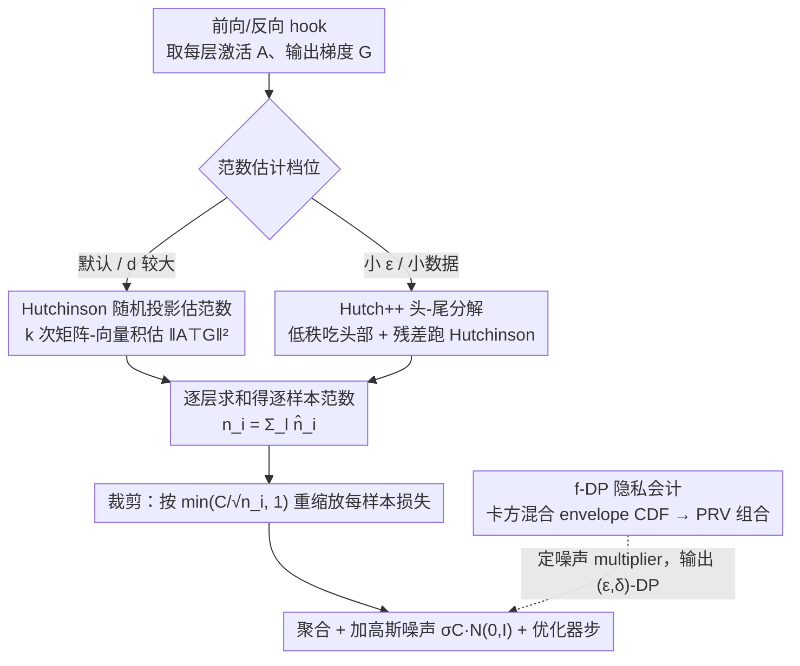

# Efficient DP-SGD for LLMs with Randomized Clipping

**会议**: ICML 2026  
**arXiv**: [2605.24879](https://arxiv.org/abs/2605.24879)  
**代码**: 无  
**领域**: LLM安全 / 差分隐私 / 高效训练  
**关键词**: DP-SGD、随机裁剪、随机迹估计、Hutchinson、长上下文 LLM

## 一句话总结
本文提出 DP-SGD-RC，用 Hutchinson / Hutch++ 随机迹估计代替 DP-SGD 中的精确逐样本梯度范数计算，把长上下文 LLM 训练的裁剪内存开销从 $O(B\min\{T^2,d^2\})$ 降到 $O(BkT+kp)$，配套给出基于卡方混合 envelope CDF 的紧 $f$-DP 分析，在 Llama-3.2-1B 长上下文微调上保持精度、最大线性层峰值显存降低约 40%、FLOPs 节省约 2×。

## 研究背景与动机

**领域现状**：DP-SGD 是给 LLM 训练加可证明隐私保护的事实标准，它在普通 SGD 基础上加了两件事——逐样本梯度裁剪 + 加高斯噪声。为了避免朴素实现里 $O(BLd^2)$ 的天文显存，社区主流靠 Fast Gradient Clipping（FGC，$O(Bd^2)$）和 Ghost Clipping（GC，对 linear-like 层做到 $O(B)$）撑住，让 DP-SGD 的算力接近非私有训练。

**现有痛点**：上面的省显存只对"非序列"输入成立。对于序列长度 $T$ 的文本输入，FGC 和 GC 中最优者的内存复杂度退化为 $O(B\min\{d^2,T^2\})$。前沿 LLM 的上下文动辄 $O(100\text{K})$，这种"二次"开销直接顶到显卡上限，连 1B 模型做 4K 上下文微调都开始紧张。

**核心矛盾**：DP-SGD 的瓶颈不在加噪，而在"算出精确的逐样本梯度范数 $\|A_i^\top G_i\|_F^2$"——这一步要么显式存梯度（$d^2$），要么显式存 $AA^\top$ 或 $GG^\top$（$T^2$）。只要继续追求"精确范数 + 严格裁剪"，序列长度上的二次项就摆脱不掉。

**本文目标**：把长上下文 DP-SGD 的内存与算力开销从 $T^2/d^2$ 量级降到与非私有训练同阶 $O(BkT)$，且不付出明显的隐私 / 效用代价。这需要同时解决三件事：(i) 找一个数学上等价、显存上更省的范数计算方式；(ii) 给"随机化"后的裁剪做新的隐私分析；(iii) 把分析塞进一个能跑的数值会计器里。

**切入角度**：作者把范数计算改写成迹估计——$\|A^\top G\|_F^2 = \mathrm{trace}(G^\top AA^\top G)$。一旦看成迹，就可以借用经典的随机迹估计器（Hutchinson、Hutch++）只用 $k$ 次"矩阵-向量积"近似算出来，把存储压到 $O(k(T+d+p))$，并且 $k\approx 32$ 已经够用。

**核心 idea**：把 DP-SGD 的"精确范数 + 确定性裁剪"换成"随机迹估计的范数 + 同样的裁剪规则"，再用 $f$-DP 形式分析这种"裁剪尺度随机化"带来的隐私损失，最后用基于 PRV 的数值会计器输出标准 $(\varepsilon,\delta)$-DP。

## 方法详解

### 整体框架
DP-SGD-RC 不重造 DP-SGD，而是只在最贵的那一步动刀。原版 DP-SGD 走的是"第一次反向算出每个样本的梯度范数 → 按 $\min(C/\sqrt{n_i},1)$ 重缩放每样本损失 → 第二次反向聚合 + 加噪 + 优化器步"，它的显存全卡在"精确算范数"上。本文把这一步换成随机迹估计：对每个 linear-like 层，前向 hook 拿到激活 $A\in\mathbb{R}^{B\times T\times d}$、反向 hook 拿到输出梯度 $G\in\mathbb{R}^{B\times T\times p}$，调用范数估计例程（默认 Hutchinson，小 $\varepsilon$ 切 Hutch++）返回近似 $\hat n_i^{(l)}$，逐层求和得到 $n_i=\sum_l \hat n_i^{(l)}$，其余流程原封不动。整套实现走 forward/backward hook、每层只过一遍，总成本是 1 次 forward + 2 次 backward，和 FGC 同档，但单层峰值显存被压下来——并配一套新的 $f$-DP 隐私会计把"裁剪尺度随机化"带来的隐私损失算清楚、反过来给训练设定噪声 multiplier。

### 关键设计

**1. Hutchinson 随机投影估范数：把"算精确范数"摊薄成 $k$ 次矩阵-向量积**

DP-SGD 二次显存的根子在于精确算单层范数 $\|A^\top G\|_F^2$——要么显式存 $d\times p$ 的逐样本梯度（$O(d^2)$），要么显式存 $T\times T$ 的中间矩阵（$O(T^2)$），长上下文下两者都顶天。本文的关键观察是：DP-SGD 真正需要的只是"范数"这个标量，而标量不必精确算。把范数改写成迹 $\|A^\top G\|_F^2 = \mathrm{trace}(G^\top AA^\top G) = \mathrm{trace}(O)$ 后，就能套 Hutchinson 随机迹估计器 $\widehat{n} = \mathrm{trace}(P^\top OP) = \|(P^\top G^\top)^\top A\|_F^2$，其中投影矩阵 $P\in\mathbb{R}^{p\times k}$、$P_{uv}\sim\mathcal{N}(0,1/k)$。实现上先算 $Y = A^\top(GP)$ 再取 $\|Y\|_F^2$，全程既不显式构造逐样本梯度也不显式构造 $T\times T$ 矩阵，每层中间存储从 $O(\min\{d^2,T^2\})$ 降到 $O(k(T+d+p))$。经典分析保证 $k=O(\log(1/\beta)/\alpha^2)$ 就能拿到 $(1\pm\alpha)$ 相对精度，实验里 $k=32$ 已足够。这一刀同时打掉了序列长度 $T$ 和层宽 $p,d$ 两个二次项，让长上下文 LLM 的 DP 训练首次和非私有训练同阶。

**2. Hutch++ 头-尾分解：$k$ 不变、方差大降，专守小 $\varepsilon$ 区间**

小 $\varepsilon$ 时噪声多、对范数误差更敏感，单纯 Hutchinson 的方差就成了短板。Hutch++ 把 $O=(A^\top G)(A^\top G)^\top$ 的特征谱拆成"头 + 尾"两块分治：先用一组随机矩阵 $S$ 估出 $\mathrm{Col}(OS)$ 的正交基 $Q$ 做低秩近似 $\mathrm{trace}(Q^\top OQ)$ 精确吃掉"头部"，再只对残差子空间 $(I-QQ^\top)$ 上的"尾部"跑 Hutchinson，最终估计为 $\|(QG^\top)A\|_F^2 + \|(PG^\top)A - (((PG^\top)A)Q)Q^\top\|_F^2$。理论上误差从 Hutchinson 的 $O(\log(1/\beta)/\alpha^2)$ 改进到 $O(\sqrt{\log(1/\beta)}/\alpha)$，已逼近 matrix-vector query 模型的下界。代价是多 3× 的矩阵-向量乘和一次 QR 分解，因此它不是默认档：当 $d$ 较大时 Hutch 与 Hutch++ 的隐私 envelope 几乎重合（噪声 multiplier 没差），省时省算的 Hutch 更划算；但在 BBC 这类小数据 + $\varepsilon=0.7$ 的极端场景，Hutch++ 因方差更小、相当于一种温和正则化，把准确率从 64.3% 拉到 70.6%，是低预算下值得切换的备选档。

**3. 基于卡方混合 envelope 的 $f$-DP 隐私会计：让随机裁剪也能接进现成会计器**

裁剪尺度一旦随机化，加噪部分虽仍是高斯但"尺度"是随机的，传统 RDP/PRV 会计无法直接套。本文的做法是把这个随机性显式化：单步隐私分析归结为 trade-off 函数 $T(Z,\mathcal{N}(Z/\sigma,1)\,\|\,Z,\mathcal{N}(0,1))$，其中 $Z=\|Q_0\|/R(Q_0)$ 是"真实范数除以估计范数"。对 Hutch 而言 $Z^2(\lambda)\sim \|\lambda\|_1 / \sum_i\lambda_i\chi^2(k)$ 依赖差异样本梯度的特征谱 $\lambda$；借随机序与 majorization 工具，作者证明在单纯形 $\lambda\in\Delta^{d-1}$ 上 envelope CDF 恰有三段结构——左端是 $\chi^2$ 等权混合、中间窄区间是两元素混合 $\frac{\lambda}{ik}\chi^2(ik)+\frac{1-\lambda}{jk}\chi^2(jk)$、右端是单个 $\chi^2$——并给出 $x_+\in[1,2]$ 的二分查找算法把分界点定下来。一旦 $Z$ 的分布（envelope CDF）显式可算，问题就退化成"在已知 CDF 上算两个 $\Phi$ 加权积分"：会计阶段把高斯单步内核按 envelope CDF 做 Riemann–Stieltjes 加权积分得到 $\alpha(t),\beta(t)$，再走 PRV / 子采样放大 / 多步组合输出标准 $(\varepsilon,\delta)$-DP，直接对接 Opacus 体系。推导过程中作者还发现 Székely–Bakirov 2003 关于卡方混合 envelope 的旧定理证明有 bug，给出了反例与修正。

### 损失函数 / 训练策略
训练目标和 DP-SGD 完全一致：原任务损失（分类交叉熵 / 生成 NLL）加上逐样本梯度的 $\ell_2$ 裁剪到阈值 $C$，再加各向同性高斯噪声 $\sigma C\cdot\mathcal{N}(0,I)$。优化器用 SGD 或 Adam。实验里 $\delta\in\{10^{-5},10^{-6}\}$、$\varepsilon\in\{0.7,2,9\}$、$k=32$、上下文长度固定为 4096，覆盖 full fine-tuning 与 LoRA 两种模式。

## 实验关键数据

### 主实验

Llama-3.2-1B 全参微调，3 个随机种子的均值与标准差：

| 数据集 (任务) | 指标 | 非私有 | DP-SGD (FGC) $\varepsilon=9$ | DP-SGD-RC ($k=32$) $\varepsilon=9$ | DP-SGD $\varepsilon=2$ | DP-SGD-RC $\varepsilon=2$ |
|---|---|---|---|---|---|---|
| BBC (分类) | Acc ↑ | 95.20±0.51% | 96.33±0.59% | 96.40±0.22% | 94.06±0.12% | 95.60±0.37% |
| BillSum (摘要) | ROUGE-1 ↑ | 0.4928±0.0027 | 0.4882±0.0011 | 0.4864±0.0013 | 0.4831±0.0005 | 0.4796±0.0018 |
| HotpotQA (QA) | EM ↑ | 61.06±0.39% | 61.44±0.05% | 61.42±0.08% | 61.35±0.03% | 61.31±0.09% |

LoRA 微调上同样持平：BBC 掉 < 0.4%、BillSum ROUGE 掉 0.005，量级与全参一致。

### 消融实验

低预算 $\varepsilon=0.7,\delta=10^{-5}$ 下 Hutch vs Hutch++（BBC 全参微调）：

| 方法 | 投影维 $k$ | 噪声 multiplier | Accuracy (%) |
|---|---|---|---|
| DP-SGD（FGC） | N/A | 4.073 | 67.07±5.26 |
| DP-SGD-RC w/ Hutch | 32 | 4.354 | 64.29±6.77 |
| DP-SGD-RC w/ Hutch++ | 32 | 4.354 | **70.59±3.49** |

效率消融（Llama-3.2-1B 最大线性层 $8192\times 2048$，$T=4096$，$k=32$，相对 DP-SGD 基线）：

| 指标 | Hutch 节省 | Hutch++ 节省 |
|---|---|---|
| 峰值显存（含输入） | 39.18% | 38.57% |
| 峰值显存（不含输入） | 99.22% | 97.65% |
| FLOPs（最大层 / 最小层） | 98.05% / 92.19% | 92.17% / 68.69% |
| 延迟（A100 80GB） | ≈3× 快于 Hutch++ | — |

### 关键发现
- **范数估计精度并不是越准越好**：在小 $\varepsilon$ 区间，Hutch++ 比 Hutch 估得准一个数量级（Fig. 11），但作者认为带噪范数本身充当了一种正则化，因此 Hutch++ 在 $\varepsilon=0.7$ 上反而比 Hutch 高 6 个百分点；当 $\varepsilon\ge 2$、$d\gtrsim 128$ 时两者 envelope 几乎重合，省时省算的 Hutch 更划算。
- **省显存的天花板由投影矩阵自身决定**：$k$ 增大到 4096 时随机投影矩阵 $P\in\mathbb{R}^{p\times k}$ 反过来吃显存，节省率归零；作者指出换成 $\{-1,+1\}$ 1-bit 投影矩阵（Achlioptas 风格）能进一步压，但需要重证隐私。
- **越大的层越能从中受益**：$8192\times 2048$ 层得到约 40% 峰值显存节省，而 $2048\times 512$ 小层只剩约 15%；这意味着方法在 frontier-scale LLM（更大的 $p,d,T$）上收益会更显著。

## 亮点与洞察
- **"逐样本范数"重新看作"迹估计"**：把 DP-SGD 长期被当作工程瓶颈的"per-sample gradient norm"翻译成 trace estimation，立刻可以套用 30 年的随机线代工具箱，这种"把私有 ML 子问题映射到线代问题"的视角很可复用——例如逐样本曲率、Fisher 信息、影响函数都能照搬同样的解耦思路。
- **随机化裁剪的紧 $f$-DP 分析模板**：他们给出的"envelope CDF + PRV 数值积分"流程是通用的——只要替换 $Z$ 的分布，就能把"加噪部分仍是高斯但尺度随机"的任意机制塞进现成会计器，这对后续做 sketched-gradient、低秩 DP-SGD 之类的方法是直接的脚手架。
- **顺带修了 Székely–Bakirov 2003 的一个老 bug**：作者在附录 B.6 里用模拟反例指出旧定理对中间区间 envelope 的简洁刻画并不成立，并给出三区间的正确形式——纯随机变量论上的副产物，但凡需要"卡方凸组合极值分布"的工作以后都会受益。

## 局限与展望
- **Hutch++ 的隐私分析做了让步**：为了可处理，作者假设攻击者已知头部低秩估计的中间状态，因此实践中（大 $d$）噪声 multiplier 偏保守；放宽这个假设可能让 Hutch++ 在中等 $\varepsilon$ 也胜出。
- **只对 linear-like 层有省显存收益**：attention、卷积、线性层享 $O(k(T+d+p))$，但 RMSNorm / element-wise / 自定义算子仍要走"显式构造逐样本梯度"路径，对未来非典型架构（Mamba、MoE）可能要重新评估。
- **投影矩阵自身是 Achilles 之踵**：$k\ge 4096$ 时随机矩阵自己就把显存吃满；作者把 $\{\pm1\}$ 1-bit 投影、稀疏哈希投影留给 future work，但这需要把 envelope CDF 重新算一遍。
- **实验规模仍偏小**：仅在 Llama-3.2-1B / 上下文 4096 上做评估，未触及 70B+ 或上下文 100K 的"真·长上下文"场景；而方法的优势恰恰应在 $T\gg d$ 时最大化，缺一个 frontier-scale 验证。

## 相关工作与启发
- **vs DP-SGD-JL (Bu et al., 2021)**：DP-SGD-JL 在 $T=1$、单层 linear 上对 flattened gradient 做 $\mathbb{R}^{dp}\to\mathbb{R}^k$ 的 JL 投影，需要 $k+1$ 次 forward（JVP 模式）；本文针对 $T>1$ 的序列输入，在因子化形式 $A^\top G$ 上做 $\mathbb{R}^{p\times d}\to\mathbb{R}^{k\times d}$ 投影，仅 1 forward + 2 backward。当 $d=1$ 时退化为 DP-SGD-JL，可以视作其在序列数据 + 多输出维上的严格推广。
- **vs Fast Gradient Clipping (FGC, Lee & Kifer 2021)**：FGC 通过 rescaling loss 避开显式逐样本梯度，但仍要按层物化梯度，长上下文下显存为 $O(BTd^2)$；DP-SGD-RC 进一步把"按层物化"也省掉，把序列与宽度的二次项一起干掉。
- **vs Ghost Clipping (GC, Li et al. 2021) / Mixed-Ghost + Book-keeping (Bu et al. 2023)**：GC 把 linear-like 层的范数算到 $O(BT^2)$，长上下文反而吃亏；Mixed-Ghost 在 FGC/GC 间挑省的那一个，本质仍是"精确范数"路线。DP-SGD-RC 是正交方向——用近似换显存——可以与 Book-keeping 等"少一次 backward"的工程优化叠加进一步压低算力。
- **vs 低秩 DP-SGD（Yu et al. 2022 等）**：那条线把私有更新限制在低秩子空间以省噪声预算和参数量，本文则不动更新的秩，只在"算范数"这一步压资源；两者可以组合（先低秩参数化，再用随机迹估计算 LoRA 权重的范数）。

## 评分
- 新颖性: ⭐⭐⭐⭐⭐ 把 DP-SGD 的逐样本范数计算映射到随机迹估计，是长上下文 DP-LLM 训练上首个去掉 $T^2/d^2$ 项的方法。
- 实验充分度: ⭐⭐⭐⭐ Llama-3.2-1B + 3 个真实长上下文任务 + 多 $\varepsilon$ + LoRA/全参 + 显存/FLOPs/延迟全套消融，唯一缺的是 frontier-scale 验证。
- 写作质量: ⭐⭐⭐⭐ 算法/分析/会计/实验四块各自独立又衔接顺畅，附录还顺手修了一个老定理的 bug；隐私分析公式密度较高，初读需要背景。
- 价值: ⭐⭐⭐⭐⭐ 直接松动了长上下文 DP-LLM 的工程瓶颈，且 envelope-CDF + PRV 的会计模板对未来"随机化"DP 机制有高复用价值。

<!-- RELATED:START -->

## 相关论文

- [\[ACL 2026\] Fast-MIA: Efficient and Scalable Membership Inference for LLMs](../../ACL2026/llm_safety/fast-mia_efficient_and_scalable_membership_inference_for_llms.md)
- [\[ICML 2026\] Memory as a Markov Matrix: Sample Efficient Knowledge Expansion via Token-to-Dictionary Mapping](memory_as_a_markov_matrix_sample_efficient_knowledge_expansion_via_token-to-dict.md)
- [\[ICML 2026\] PipeSD: An Efficient Cloud-Edge Collaborative Pipeline Inference Framework with Speculative Decoding](pipesd_an_efficient_cloud-edge_collaborative_pipeline_inference_framework_with_s.md)
- [\[ICML 2026\] Multilingual Unlearning in LLMs: 转移、动力学与可逆性](multilingual_unlearning_in_llms_transfer_dynamics_and_reversibility.md)
- [\[ICML 2026\] Gradient Transformer: Learning to Generate Updates for LLMs](gradient_transformer_learning_to_generate_updates_for_llms.md)

<!-- RELATED:END -->
