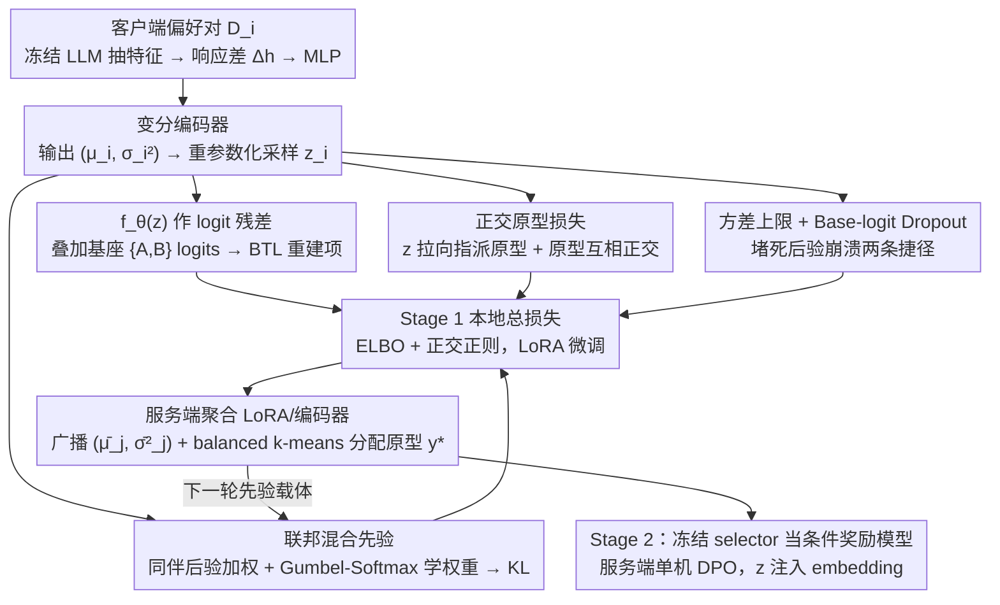

# Federated Variational Preference Alignment with Gumbel-Softmax Prior for Personalized User Preferences

**会议**: ICML 2026  
**arXiv**: [2605.30873](https://arxiv.org/abs/2605.30873)  
**代码**: 待确认  
**领域**: 对齐 RLHF / 联邦学习 / LLM 个性化  
**关键词**: 联邦偏好对齐、变分推断、Gumbel-Softmax 混合先验、后验崩溃、个性化 RLHF

## 一句话总结
本文提出 FedVPA-GP：在联邦学习的隐私约束下，用"客户端混合先验 + Gumbel-Softmax 可学习权重 + 正交原型损失"把每个客户端的偏好建模成一个连续隐变量 $z$，从根上修掉了把 VPL 直接搬到 FL 时遭遇的"后验崩溃"，使一个奖励模型可以在 helpful 与 harmless 这两种冲突偏好之间动态切换。

## 研究背景与动机
**领域现状**：当前主流的 LLM 对齐路线（RLHF / DPO / IPO / KTO）都假设可以把偏好数据集中起来训练一个全局奖励模型；为绕开隐私和合规约束，最近出现了 FedDPO、FedBiscuit 这类联邦化方案，让 RLHF 在客户端本地完成、只交换梯度或轻量 selector。

**现有痛点**：所有这些联邦方案都默认人类偏好可以被一个单一（monolithic）奖励函数拟合。但 HH-RLHF 这类数据集已经表明，"乐于助人 (helpful)" 与 "无害 (harmless)" 这两种诉求在很多场合是直接冲突的——把跨客户端的异质偏好平均成一个共识模型，相当于强行制造一个并不存在的"公约数"，结果就是两个目标谁也满足不好。

**核心矛盾**：要做个性化就得为每个用户/客户端建一个偏好表征；但联邦设定下，每个客户端样本极少且分布高度异质（极端情况下只能看到 helpful 或 harmless 一种偏好），如果照搬集中式的变分偏好学习 (VPL)，KL 正则项会压倒重建项，把后验分布拉回到 $\mathcal{N}(0, I)$，导致经典的"后验崩溃"——隐变量 $z$ 失去信息，个性化机制失效（如图 2(a) 所示，FedVPL 的 $z_{\text{VPL}}$ 完全粘成一团）。

**本文目标**：在不交换原始偏好数据的前提下，让每个客户端的本地变分推断 (a) 稳定（不被数据稀疏击穿）、(b) 可解耦（不同偏好模式在隐空间里清晰分离）。

**切入角度**：作者注意到，"局部稀疏"本质上是"缺少全局上下文"，而 FL 的群体分布恰好可以充当 dynamic prior——不传原始数据，但传后验统计量 $(\bar\mu_j, \bar\sigma_j^2)$，让每个客户端把"别人的后验"当成自己的先验。再叠加一个"显式让原型互相正交"的几何约束，就能反过来逼着 encoder 把不同偏好放到不同子空间。

**核心 idea**：用「同伴后验加权混合」替代标准高斯先验，并用 Gumbel-Softmax 让混合权重对每个客户端可学习；再用正交原型损失把"helpful 模式"和"harmless 模式"强行钉在隐空间的正交方向上，从而同时治好"训练不稳"和"后验崩溃"。

## 方法详解

### 整体框架
FedVPA-GP 沿用 FedBiscuit 的两阶段范式（先联邦训一个轻量选择器，再在服务端做条件化 RLHF），但把核心选择器换成一个变分模块：基座 LLM (Qwen-2 0.5B / Gemma-2B) 全程冻结，可训部分仅约 0.18% 参数，把每个客户端的偏好编码成连续隐变量 $z$。整套方法的命门是后验崩溃，靠三个相互咬合的设计——联邦混合先验、正交原型损失、方差上限 + Base-logit Dropout——在稀疏又异质的联邦数据上同时稳住训练并分开冲突偏好。

### 关键设计

**1. 联邦混合先验 + Gumbel-Softmax 可学习权重：让"别人的后验"当我的先验**

VPL 的固定标准高斯先验 $\mathcal{N}(0,I)$ 搬到 FL 里相当于"没有任何全局指引"，本地数据一稀疏，KL 项就把后验直接拍回原点。FedVPA-GP 把先验改写成同伴后验的加权混合 $p_{\text{mixture}}^{(i)}(z) = \sum_{j \in \mathcal{S}} w_j \mathcal{N}_j(z)$，其中每个 $\mathcal{N}_j$ 是同伴 $j$ 上一轮上传的后验——只交换 $(\bar\mu_j, \bar\sigma_j^2)$ 共 256 字节，远比 LoRA 适配器小。权重不能简单平均，否则冲突偏好的客户端会被混到一起互相拖累；于是用 Gumbel-Softmax 重参数化 $w_j = \mathrm{softmax}((\log\pi_j + g_j)/\tau)$，让 $\pi_j$ 跟 KL 一起端到端学，并且每个客户端独自维护一份 $\{\pi_j\}$、不参与联邦平均，从而保留"我该信哪几个同伴"这一本地策略。这样相同偏好模式的客户端互相提供先验、不同模式之间互相屏蔽，自动实现"邻居筛选"；KL 项 $\mathbb{D}_{KL}(q_i \,\|\, p_{\text{mixture}}^{(i)})$ 通过 log-sum-exp 稳定求值。

**2. 正交原型损失：给连续隐空间钉一副离散骨架**

单靠 KL 正则没法保证冲突模式分得开——FedVPL 的 t-SNE 显示所有 $z$ 缠成一团。本文维护 $M$ 个可学习原型 $\{\mathbf{p}_m\}_{m=1}^M$，用 QR 分解初始化保证一开始就严格正交且远离原点；服务端每轮聚合后用 balanced $k$-means 在客户端均值上聚类，给每个客户端打一个原型标签 $y_i^*$（HH-RLHF 里 $M=2$，对应 helpful/harmless 两轴）。本地多加一项 $\mathcal{L}_{\text{ortho}}(z) = \|z - \mathbf{p}_{y_i^*}\|_2^2 + \gamma\|\mathbf{P}\mathbf{P}^T - \mathbf{I}_M\|_F^2$，第一项把当前样本的 $z$ 拉向被指派的原型，第二项防止原型互相塌缩。这等于把"偏好模式是有限离散结构"的先验显式注入原本连续的隐空间：既给 encoder 一个明确的几何吸引子来对抗后验崩溃，又给 Stage 2 的条件策略提供了清晰可寻址的 $z$；$M$ 后续放大即对应更细粒度的偏好谱。

**3. 方差上限 + Base-logit Dropout：堵死后验崩溃的两条逃逸路径**

变分自编码器社区早就观察到 KL 是个"最容易找捷径"的目标——只要 $q$ 等于 $p$，KL 就为 0，对应 $z$ 完全不携带信息。本文在公式之外从工程上再加双保险：一是对编码器输出的 log-variance 做硬截断 $\log\sigma_i^2 \leftarrow \min(\log\sigma_i^2, \log\sigma_{\max}^2)$，禁止 encoder 靠简单把 $\sigma$ 吹大来"廉价匹配先验"；二是当基座 LLM 已经对 $\{A,B\}$ 有较强先验信号时（Qwen-2 0.5B 这类小模型），对基座 choice-logit 做伯努利 dropout（$p_{\text{logit}}=0.5$），逼着 $f_\theta(z)$ 在那些步上独自承担预测责任、把梯度真正逼回 $z$；Gemma-2B 因为基座信号本身较弱，故置 $p_{\text{logit}}=0$。这两招分别堵住"加大方差"和"反正基座就能猜对"两条捷径，与前两个设计层层叠成完整的防崩溃体系。

### 一个完整示例
以 HH-RLHF 的 Non-IID 场景（一半客户端只见 helpful、一半只见 harmless）走一遍数据流。**Stage 1（联邦选择器训练）**：客户端 $i$ 持有偏好对 $\mathcal{D}_i=\{(s_A, s_B, y)\}$，本地流程是冻结 LLM 抽特征 → 取响应差 $\Delta h = h_{\text{chosen}} - h_{\text{rejected}}$ → 特征提取 MLP → 变分编码器输出 $(\mu_i, \sigma_i^2)$ → 重参数化采样 $z_i$ → 把 $f_\theta(z_i)$ 作为 logit 残差加到基座 $\{A,B\}$ logits 上 → 算 BTL 偏好似然得重建项；本地总损失是 ELBO 加正交正则，KL 把 $q_i$ 推向上面那个联邦混合先验。一轮结束后服务端聚合 LoRA/编码器参数，把所有参与客户端的 $(\bar\mu_j, \bar\sigma_j^2)$ 打包广播给下一轮（混合先验的载体），并用并行的 balanced $k$-means 给每个客户端分配正交原型索引 $y_i^*$。**Stage 2（条件化 RLHF）**：选择器训完后冻住，当作条件奖励模型 $\text{logits}(s_A, s_B \mid z)$；服务器单机用 DPO 训一个以 $z$ 为条件的策略——$z$ 经 z-to-embedding 注入 input embedding，on-policy 生成两条回答，由 selector 在给定 $z$ 下打分得到 (chosen, rejected) 做 DPO 更新。这步只用 prompt、不再触碰任何用户偏好标签，因此把"昂贵的联邦生成"完全甩到服务端单机完成。

### 损失函数 / 训练策略
本地总损失见 Eq. (10)：

$\mathcal{L}_i(\theta, \phi) = \mathcal{L}_{\text{recon}} + \beta \cdot \mathbb{D}_{KL}(q_\phi(z\mid\mathcal{D}_i) \,\|\, p_{\text{mixture}}^{(i)}(z)) + \lambda \cdot \mathcal{L}_{\text{ortho}}(z)$

其中 $\mathcal{L}_{\text{recon}}$ 是 BTL 偏好的负对数似然（输入是基座 logits 加 $f_\theta(z)$ 后的条件 logits）。Stage 1 用 LoRA 微调 + FedAvg 聚合 LoRA/编码器参数（$\pi_j$ 不聚合）；Stage 2 在服务器单机跑 DPO，把 $z$ 通过加性 embedding 注入策略，并用 frozen selector 的 $\text{logits}(s_A, s_B \mid z)$ 作即时奖励。HH-RLHF 实验里 $K\in\{10,50,100\}$，每轮采样 5 或 10 个客户端；$M=2$，对应 helpful/harmless 两轴。

## 实验关键数据

### 主实验
HH-RLHF 上的 GPT-4o 评判 Win-rate (%)，Non-IID 划分（50% 客户端只见 helpful，50% 只见 harmless）。

| Base | 方法 | 10 客户端 H/Hm | 50 客户端 H/Hm | 100 客户端 H/Hm |
|------|------|----------------|----------------|------------------|
| Qwen-2 0.5B | FedDPO | 48.12 / 77.34 | 43.05 / 69.22 | 41.48 / 67.15 |
| Qwen-2 0.5B | FedBiscuit | 48.85 / 75.12 | 44.21 / 71.45 | 42.33 / 69.42 |
| Qwen-2 0.5B | FedVPL（naive） | 62.24 / 84.56 | 54.18 / 78.12 | 53.05 / 77.34 |
| Qwen-2 0.5B | **FedVPA-GP** | **66.45 / 89.21** | **58.32 / 84.05** | **55.18 / 82.31** |
| Gemma-2B | FedDPO | 52.34 / 83.12 | 44.15 / 78.45 | 41.22 / 75.33 |
| Gemma-2B | FedBiscuit | 51.65 / 82.45 | 46.21 / 78.12 | 43.44 / 76.05 |
| Gemma-2B | FedVPL（naive） | 66.82 / 89.15 | 56.41 / 84.34 | 53.25 / 80.42 |
| Gemma-2B | **FedVPA-GP** | **73.21 / 96.34** | **64.48 / 95.12** | **60.15 / 92.45** |

FedVPA-GP 在两个模型、三个客户端规模上都取得 Pareto 改进（不是用一个目标换另一个）；随着客户端数量增大、本地数据更稀疏，所有 baseline 都明显掉点，而本文方法的掉点幅度最小，验证了混合先验的"对抗稀疏"效果。

### 消融实验

| 配置 | 关键指标 | 说明 |
|------|---------|------|
| FedVPL（naive） | 62.24 / 84.56 (Qwen, N=10) | 标准高斯先验 + 无正交，作为下界 |
| FedVPL + Ortho | 介于 FedVPL 与全模型之间 | 只加正交损失，已能缓解后验崩溃 |
| FedVPL + GB Prior | 介于 FedVPL 与全模型之间 | 只加混合先验，稳定稀疏数据下训练 |
| Full FedVPA-GP | 66.45 / 89.21 (Qwen, N=10) | 两者协同得到最佳 trade-off |

未见客户端泛化（20 客户端，10 训 / 10 测）：FedVPA-GP 在 Unseen 上为 63.16 / 91.23，几乎与 Seen (65.28 / 94.25) 持平；而 FedVPL 在 Unseen 上从 56.23 / 83.82 大幅掉到 49.25 / 75.21，说明本文学到的隐空间是连续且语义化的，可仅靠推断就适配新用户。

不平衡客户端比例（H/Hm 取 70/30、30/70、80/20、20/80，Qwen N=10）：FedVPA-GP 全程领先 FedBiscuit 约 17–20 点 helpful、12–17 点 harmless——Gumbel-Softmax 混合权重会自动给"少数派同伴"加权，避免少数偏好模式被多数派淹没。

### 关键发现
- **后验崩溃的可视化验证**：Figure 3 的 t-SNE 显示 FedVPL 训练全过程中红蓝点混在一起，而 FedVPA-GP 在几轮内就把两类隐变量分到正交原型 (∗) 周围，验证了"混合先验提供全局上下文 + 正交损失提供几何骨架"的协同作用。
- **个性化几乎零代价部署**：变分模块仅约 0.9M 参数（基座的 0.18%），单轮通信只多 256 字节（$\bar\mu, \bar\sigma^2$ 各 32 维），训练时延仅 1.18× FedDPO——这意味着任何用 LoRA 的联邦对齐 pipeline 都可以直接替换 selector 接入本方法。
- **monolithic 奖励模型的系统性缺陷**：FedDPO/FedBiscuit 在 Qwen-2 上 helpful win-rate 随着客户端数量增加而停滞甚至下降，本质上是被异质偏好"互相抵消"，证明在偏好冲突场景下"先求平均"是错的范式。

## 亮点与洞察
- **把 FL 的"软肋"变成"先验"**：FL 通常被视作 VPL 的灾难场（局部稀疏 + 异质），本文反过来把"群体后验"当成最自然的 dynamic prior——既不需要交换原始数据，又恰好补上单客户端的全局视野缺失，是非常优雅的"以毒攻毒"。
- **Gumbel-Softmax 用在"先验混合权重"上**：这一招把"该相信哪几个同伴"做成了端到端可学的离散选择，等价于在变分推断内部嵌了一层"软聚类"，比手工指定相似度（如 cosine 或客户端聚类）更鲁棒，可迁移到任何需要"个性化挑邻居"的联邦任务（个性化推荐、跨域 federated meta-learning）。
- **正交原型损失 + balanced $k$-means**：作者其实在显式声明"偏好空间是有限离散模式叠加连续微调"的归纳偏置，正交原型保证模式之间相互独立，连续 $z$ 则在原型周围捕捉个体差异。这种"离散骨架 + 连续填充"的设计可以原样搬到多目标对齐、多任务个性化场景。
- **双保险防崩溃**：方差截断 + base-logit dropout 是看起来不起眼但极其重要的工程细节，提醒我们做变分模型时一定要从"目标函数能被哪些 trivial 解满足"反向找漏洞。

## 局限与展望
- HH-RLHF 上 $M=2$ 恰好对应 helpful/harmless 两个干净轴，作者没有充分验证 $M$ 较大、偏好维度更细时 balanced $k$-means 标签分配是否仍稳定；当偏好谱真实是连续流形而非离散簇时，正交原型可能变成过强先验。
- 隐变量 $z$ 是 32 维的"黑箱方向"，论文没有给出"如何在部署期为新用户选 $z$"的统一接口——Algorithm 1 提到三种选 $z$ 方式（取均值/取 $\bar\mu_i$/在线 $q_\phi$ 推断），但缺少线上 latency 与隐私权衡分析。
- 实验只在两个 ≤2B 的基座上做，70B 级别基座下基座 logit 已经极强，$p_{\text{logit}}$ 是否要进一步增大、KL 与正交项的 $\beta, \lambda$ 是否要重新搜索，作者没有验证。
- 隐私层面只论述"不传原始数据"，但传 $(\bar\mu_j, \bar\sigma_j^2)$ 仍可能泄露偏好统计；想用到强隐私 (DP-FedAvg) 场景需在 $\bar\mu, \bar\sigma^2$ 上加噪声并重新分析其与 KL 项的耦合。
- 作者在 Impact Statement 里也承认"极端个性化可能放大用户偏见 / 形成 filter bubble"，这一点在 LLM 对齐里是真问题——需要把 harmless 这类公共安全约束放到"不可个性化"白名单里。

## 相关工作与启发
- **vs FedBiscuit (Wu et al., 2024)**：同样训"轻量二元 selector + 冻结基座 + 两阶段 RLHF"，但 FedBiscuit 仍是 monolithic 奖励，本文把 selector 升级为条件化变分模型，思路完全兼容并可作为 FedBiscuit 的 drop-in 替换。
- **vs FedDPO (Ye et al., 2024)**：FedDPO 联邦化的是 DPO 梯度，本文则把联邦化的目标对象换成"偏好潜变量的后验"，把昂贵的策略 DPO 留在服务端做——这个解耦比"全联邦 DPO"在通信与稳定性上都明显占优。
- **vs Variational Preference Learning (Poddar et al., 2024)**：原始 VPL 假设有 pooled 数据，可以稳定估后验；本文回答了"VPL 怎么活在 FL 里"，把后验稳定性问题归因为"先验缺失"并给出工程化解法。
- **vs Multi-objective alignment (Rame et al., 2023) / 多模型 weight merging (Jang et al., 2023)**：那些方法都需要在权重或目标维度做组合，本文则在 latent 维度做组合，参数代价更小、且天然支持"同一个策略按 $z$ 切换偏好"。
- **vs 变分自编码器后验崩溃工作 (Bowman et al., 2016; Alemi et al., 2018)**：后验崩溃在 VAE/语言建模社区研究已久（KL annealing、free bits 等），本文把"几何正交原型"和"群体混合先验"作为新的对症工具引入 FL 偏好对齐场景，是一次很合时宜的迁移。

## 评分
- 新颖性: ⭐⭐⭐⭐ 把 VPL 适配到 FL 并提出混合先验 + 正交原型的组合方案，是 well-posed 的新颖工作；但单看每个组件（mixture prior / orthogonal proto / Gumbel-Softmax）在各自社区都有先例。
- 实验充分度: ⭐⭐⭐ 主表横跨 2 模型 × 3 规模，含未见客户端泛化与不平衡比例消融，但只用 HH-RLHF 一个数据集、$M$ 只取 2、缺更大基座验证。
- 写作质量: ⭐⭐⭐⭐ 动机推导清晰（"posterior collapse 是 FL+VPL 的根问题"叙事很顺），算法伪代码完整，可复现性较强。
- 价值: ⭐⭐⭐⭐ 同时回答了"联邦对齐怎么处理冲突偏好"与"变分推断怎么在 FL 里不崩"两个核心问题，对走向"个性化 + 隐私保护"LLM 对齐有直接借鉴意义。

<!-- RELATED:START -->

## 相关论文

- [\[ICML 2026\] Differentially Private Preference Data Synthesis for Large Language Model Alignment](differentially_private_preference_data_synthesis_for_large_language_model_alignm.md)
- [\[NeurIPS 2025\] A Systematic Evaluation of Preference Aggregation in Federated RLHF for Pluralistic Alignment of LLMs](../../NeurIPS2025/llm_safety/a_systematic_evaluation_of_preference_aggregation_in_federated_rlhf_for_pluralis.md)
- [\[ICML 2026\] From Volume to Value: Preference-Aligned Memory Construction for On-Device RAG](from_volume_to_value_preference-aligned_memory_construction_for_on-device_rag.md)
- [\[ICML 2025\] Reward-Augmented Data Enhances Direct Preference Alignment of LLMs](../../ICML2025/llm_safety/reward-augmented_data_enhances_direct_preference_alignment_of_llms.md)
- [\[ICML 2026\] Decoupled Training with Local Reinforcement Fine-Tuning in Federated Learning](decoupled_training_with_local_reinforcement_fine-tuning_in_federated_learning.md)

<!-- RELATED:END -->
