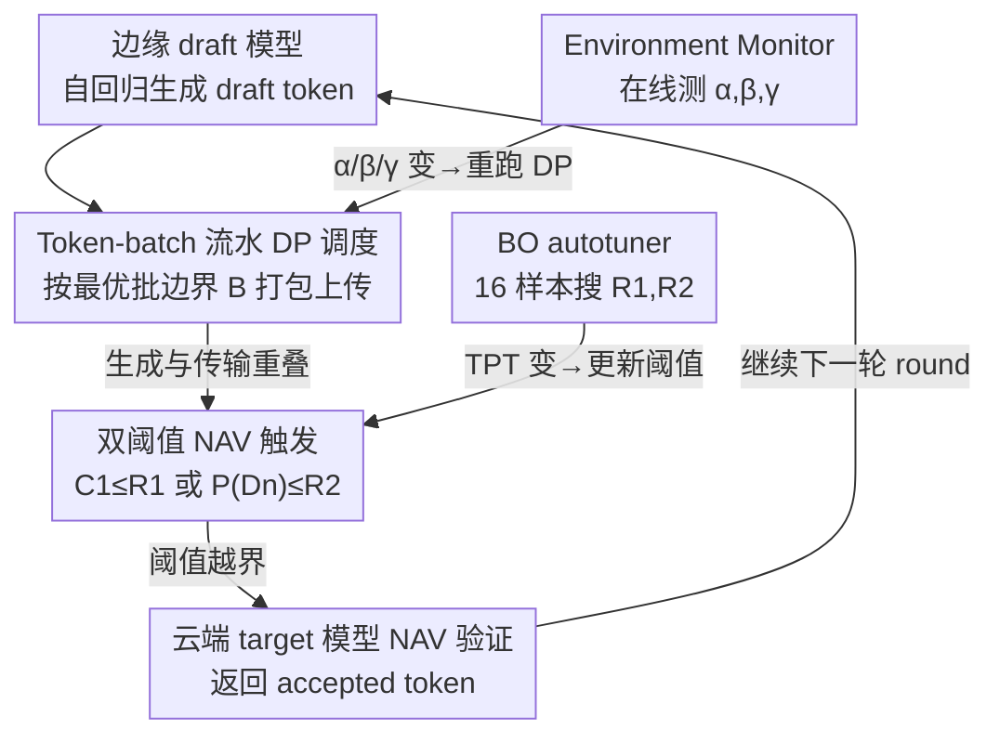

# PipeSD: An Efficient Cloud-Edge Collaborative Pipeline Inference Framework with Speculative Decoding

**会议**: ICML 2026  
**arXiv**: [2605.13319](https://arxiv.org/abs/2605.13319)  
**代码**: [anonymous.4open.science/r/PipeSD](https://anonymous.4open.science/r/PipeSD)  
**领域**: LLM 推理系统 / 端云协同 / 投机解码  
**关键词**: Speculative Decoding、Cloud-Edge、Pipeline Scheduling、Bayesian Optimization、动态规划

## 一句话总结
本文提出 PipeSD：把投机解码（speculative decoding）从端云顺序执行改成 token-batch 流水线，并用双阈值 NAV 触发 + 贝叶斯自动调参替代固定 draft 长度，在 5G 带宽的真实端云测试床上拿到 1.16×–2.16× 加速、14–25% 云端能耗下降。

## 研究背景与动机
**领域现状**：大模型推理瓶颈在自回归生成的串行依赖。投机解码用「小 draft 模型生成 N 个 token → 大 target 模型一次性 NAV 验证」打破串行，端云协同部署天然适配：draft 在边缘节能 + 保隐私，target 在云算力强大。已有 HSL、HAT、SpecEdge 等端云投机解码框架。

**现有痛点**：(1) 现有框架是「先全部生成 draft → 再整体上传 → 再 NAV」的顺序流水，导致边缘等 NAV 反馈、云等 draft 上传，带宽和算力双双闲置；(2) NAV 触发要么固定 draft 长度（HSL 用 $N=6$），要么用单一置信度信号（HSL 看单 token 置信度、EdgeLLM 看累积序列置信度），不能联合反映 token 难度，要么过早触发浪费算力，要么过晚触发导致大段回滚。

**核心矛盾**：通信启动开销 $\alpha$ 很大，因此每生成一个 token 就立刻发送（极端流水）反而比批量发送更慢；但完全顺序又浪费等待时间——需要找到「合并多少 token 一起发」的最优批策略。同时 NAV 触发既要看「整段是否还可信」（序列置信度），又要看「某个 token 是不是已经离谱」（单 token 置信度），单信号一定会偏。

**本文目标**：(1) 形式化 token 生成-通信流水调度并求最优批边界；(2) 用双阈值 NAV 兼顾序列与单 token 信号；(3) 在边缘自动调阈值以适应动态网络与算力。

**切入角度**：通信启动开销 $\alpha$ 与每 token 传输时间 $\beta$、每 token 算力 $\gamma$ 可在线测量，整个调度问题就是经典 DAG 调度，可以用 DP 在 $O(\hat N^2)$ 时间内求最优；阈值对 TPT 的影响虽不可解析但样本廉价，可用贝叶斯优化 16 个样本内逼近最优。

**核心 idea**：用「DP-最优 token-batch 流水 + 双阈值 NAV + BO 自动调参」三件套，把端云投机解码的算力/带宽利用率推到接近 Pareto 前沿。

## 方法详解

### 整体框架
PipeSD 想解决的是端云投机解码里「边缘等 NAV、云等 draft 上传」的双向空转。它的一个 speculative round 这样转：边缘 draft 模型一边自回归吐 token，一边由 Token-batch Pipeline Scheduler 按 DP 算出的批边界 $\mathbb B=(b_1,\dots,b_K)$ 即时打包上传，让传输和生成重叠；同时 Dual-threshold NAV Trigger 盯着单 token 置信度和累积序列置信度，任一越界就发起 NAV，云端 target 模型验证后返回 accept/reject。所有自适应逻辑都压在边缘：Environment Monitor 持续测量 $(\alpha,\beta,\gamma)$ 触发 DP 重跑，BO autotuner 周期性更新触发阈值。系统用 llama-cpp-python（边）+ PyTorch + FastAPI（云）实现。

### 关键设计

**1. Token-batch 流水的 DP 最优调度：在通信启动开销不可忽略时，求「凑几个 token 一起发」的最优批边界**

痛点很直接：现有框架要么全部生成完再整体上传（边缘空等），要么每个 token 即时发（被启动开销 $\alpha$ 拖死），都不在 Pareto 前沿。PipeSD 把它形式化成 DAG 调度——批 $k$ 的通信时长是 $t_c^{(k)}=\alpha+\beta\cdot(b_{k+1}-b_k)$、生成时长是 $t_{ag}^{(k)}=\gamma\cdot(b_{k+1}-b_k)$，而某批的通信必须等「上一批通信结束 且 本批生成结束」，于是有递推 $\tau_c^{(k)}=\max\{\tau_c^{(k-1)}+t_c^{(k-1)},\tau_{ag}^{(k)}+t_{ag}^{(k)}\}$，总时长目标为 $\min T=\tau_c^{(K)}+t_c^{(K)}-\tau_{ag}^{(1)}$。算法 1 用 $dp[j]$ 记前 $j$ 个 token 的最优时长，枚举上一批起点 $i<j$ 递推

$$dp[j]=\min_{i<j}\big\{\max(dp[i],\,\gamma j)+\alpha+\beta(j-i)\big\},$$

回溯即得批边界 $\mathbb B$，复杂度只有 $O(\hat N^2)$，文中证明该方案全局最优（Theorem 4.1）。它之所以比朴素 batching 好，是因为同时把 $\alpha$ 的摊销和「生成时长能掩盖多长通信窗口」算进去了，能动态决定凑 2 个还是 3 个 token 一起发更划算。

**2. 双阈值 NAV 触发：让序列信号和单 token 信号互补，堵住两类触发失败**

单信号触发一定会偏：只看单 token 置信度 $P(D_n)$（如 HSL），碰到「每个 token 都中等可信」时永远不触发，白白 over-generation；只看累积序列置信度（如 EdgeLLM），又会被均摊掩盖单点崩坏、延迟检错。PipeSD 同时维护累积序列置信度 $C_1=\prod_{n}P(D_n)$（已生成但未验证 token 的概率乘积）和单 token 置信度 $P(D_n)$：每吐一个新 token 先算暂定值 $C_1^*=C_1\cdot P(D_n)$，只要 $C_1^*\le R_1$ 或 $P(D_n)\le R_2$ 任一成立就发起 NAV，并 reset $C_1=1$。两个阈值各管一类失败模式，叠在一起能在「整段是否还可信」和「某个 token 是不是已经离谱」之间取最大覆盖。

**3. 贝叶斯自动调参 + 动态调度窗口：把阈值和窗口都做成边缘端在线自适应，不依赖云端框架**

阈值对 TPT 的映射既不可解析又随任务难度、网络抖动漂移，没法手调。BO autotuner 把目标设为最小化平均 TPT，采样 $(R_1,R_2,\text{TPT})$ 三元组，用高斯过程预测下一个最优查询点，16 个样本内就逼近近优——比网格/随机搜索省样本，符合「边缘端必须轻量」的约束。两套重跑触发分工明确：TPT 显著变化（监控触发）时重跑 BO，$(\alpha,\beta,\gamma)$ 变化时重跑 DP。调度窗口 $\hat N$ 取最近 100 个 draft 序列长度的滑动平均（初始 20），再配两条重叠规则：NAV 触发时未发的 token 立刻凑成一个 batch 发出去，等待 NAV 期间仍继续生成下一窗口的 draft。把所有自适应逻辑都留在边缘，PipeSD 就能即插即用地兼容 vLLM、TensorRT-LLM 等任意云端推理后端。

### 损失函数 / 训练策略
PipeSD 是纯推理框架，无训练损失。关键参数都在线确定：DP 的输入 $(\hat N,\alpha,\beta,\gamma)$ 由 Environment Monitor 实时测，BO autotuner 默认 16 次采样收敛，NAV 阈值 $(R_1,R_2)$ 由 BO 在 0–1 区间内搜索；实测 draft 长度均值在编程任务约 6、数学任务约 4。

## 实验关键数据

### 主实验
4 个场景（场景 1 笔记本 + 静态 20/200Mbps；场景 2/3 模拟手机/IoT 算力 2.5/1.2 GHz；场景 4 动态带宽 10–80 Mbps）、2 对模型（DeepSeek-Coder 1.3B→6.7B、TinyLlama 1.1B→Llama-2 7B）、2 数据集（HumanEval、GSM8K），对比 Vanilla / HSL / EdgeLLM：

| 场景 | 数据集 | Vanilla TPT(ms) | HSL | EdgeLLM | PipeSD | 相比 Vanilla |
|------|--------|------|------|---------|--------|--------------|
| 1 | HumanEval | 194 | 155 | 153 | 129 | 1.50× |
| 1 | GSM8K | 193 | 174 | 169 | 145 | 1.33× |
| 3 (IoT) | HumanEval | 306 | 244 | 201 | 152 | 2.01× |
| 3 (IoT) | GSM8K | 402 | 296 | 231 | 186 | 2.16× |
| 4 (动态带宽) | HumanEval | 160 | 132 | 127 | 108 | 1.48× |

云端能耗（场景 1，每 100 个 accepted token）：

| 数据集 | Vanilla(J) | HSL | EdgeLLM | PipeSD | 相比 EdgeLLM 降低 |
|--------|------|------|---------|--------|------|
| HumanEval | 68 | 71 | 75 | 56 | 25.3% |
| GSM8K | 98 | 102 | 100 | 84 | 16.0% |

### 消融实验
**BO 调参对比（HumanEval 场景 1，TPT ms）：**

| 调参策略 | HumanEval | GSM8K |
|----------|-----------|-------|
| BO Autotuner | 129 | 145 |
| Grid Search | 139 | 155 |
| Random Search | 148 | 162 |

**带宽敏感性（HumanEval 场景 1，PipeSD vs Vanilla）：** 10 Mbps 1.32×、20 Mbps 1.47×、40 Mbps 1.45×、80 Mbps 1.34×；80 Mbps 后通信不再是瓶颈，加速比饱和。

### 关键发现
- 算力越弱（IoT 场景）加速比越高（2.16×），印证「pipeline 主要从 hide communication 中获益」的直觉——边缘越慢，生成时间能覆盖的通信窗口越大。
- DP 重跑开销 < 总时间的 0.013%，几乎免费；BO 仅 16 次采样收敛，自调参代价可忽略。
- 双阈值机制是 ECS 降低的主要贡献者：减少了无效 NAV 请求（云端真正算 target 模型的次数减少），所以同等吞吐下能耗下降比 TPT 比例还高。

## 亮点与洞察
- **把端云投机解码彻底变成调度问题**：之前的工作各自打补丁（HSL 改触发、HAT 改精度约束），PipeSD 把它形式化为 DP 流水 + BO 自适应，是一个完整的系统级抽象。
- **DP 算法虽简单但定位准**：复杂度 $O(\hat N^2)$、$\hat N\sim 20$，完全可在线运行；这种「廉价精确算法 + 在线监控触发重跑」的模式特别适合系统优化里参数缓慢漂移的场景。
- **双阈值思路可迁移**：任何「累积分数 + 即时分数」的早停/触发问题都可借鉴——例如多步推理 chain-of-thought 的早停、长序列检索的截断。
- **BO 调参作为底层组件**：把贝叶斯优化做成边缘端通用的「阈值器」，比强化学习训 controller 更轻量、对新部署环境零冷启动。

## 局限与展望
- 只在单 draft-target 对 + 单客户端上做了系统实现；多客户端、多 draft 模型混排（heterogeneous batching）下 DP 公式需要重新推导。
- BO 用全局平均 TPT 作为目标，但不同任务（代码 vs 数学）draft 接受率天差地别，可能需要 per-task 阈值或多任务 BO。
- 边缘能耗仅做理论分析未实测；CPU 上 BO + DP 频繁触发对功耗的影响在电池受限场景仍待验证。
- 没有考虑安全/privacy 层面：dual-threshold 暴露了 draft 模型的逐 token 置信度，可能成为 side-channel 推断隐私数据的渠道，文中未讨论。

## 相关工作与启发
- **vs HSL (hao2024)**：HSL 单 token 置信度触发，固定 draft 长度，没 pipeline；本方法双阈值 + DP 流水，TPT 在场景 3 上加速 1.61×。
- **vs EdgeLLM (xu2025)**：EdgeLLM 用累积序列置信度 + 等待 NAV 时继续生成，PipeSD 在此基础上加 token-level 阈值和 DP 最优批；ECS 降 16–25%。
- **vs HAT、SpecEdge**：HAT 关注精度约束、SpecEdge 关注多边缘协作，与 PipeSD 正交，可以叠加。
- **vs Medusa、EAGLE（云端 SD）**：这些工作改进 draft 头本身的 acceptance rate，PipeSD 改进部署与触发，可以互补叠加用于端云场景。

## 评分
- 新颖性: ⭐⭐⭐⭐ DP 流水调度 + 双阈值 + BO autotuner 的组合是端云投机解码的第一个 Pareto 完整框架
- 实验充分度: ⭐⭐⭐⭐ 真实端云测试床、4 场景 × 2 模型 × 2 数据集 + 带宽扫描 + 能耗
- 写作质量: ⭐⭐⭐⭐ 从瓶颈分析到 DP 推导到系统实现一以贯之，公式记号清晰
- 价值: ⭐⭐⭐⭐ 5G 时代手机/IoT 端云协同推理的可直接复用框架，开源代码加分

<!-- RELATED:START -->

## 相关论文

- [\[AAAI 2026\] PRISM: Privacy-Aware Routing for Adaptive Cloud-Edge LLM Inference via Semantic Sketch Collaboration](../../AAAI2026/llm_safety/prism_privacy-aware_routing_for_adaptive_cloud-edge_llm_inference_via_semantic_s.md)
- [\[ACL 2026\] Fast-MIA: Efficient and Scalable Membership Inference for LLMs](../../ACL2026/llm_safety/fast-mia_efficient_and_scalable_membership_inference_for_llms.md)
- [\[ICML 2026\] dgMARK: Decoding-Guided Watermarking for Diffusion Language Models](dgmark_decoding-guided_watermarking_for_diffusion_language_models.md)
- [\[ICML 2026\] Efficient DP-SGD for LLMs with Randomized Clipping](efficient_dp-sgd_for_llms_with_randomized_clipping.md)
- [\[ICML 2026\] COFT: Counterfactual-Conformal Decoding for Fair Chain-of-Thought Reasoning in Large Language Models](coft_counterfactual-conformal_decoding_for_fair_chain-of-thought_reasoning_in_la.md)

<!-- RELATED:END -->
