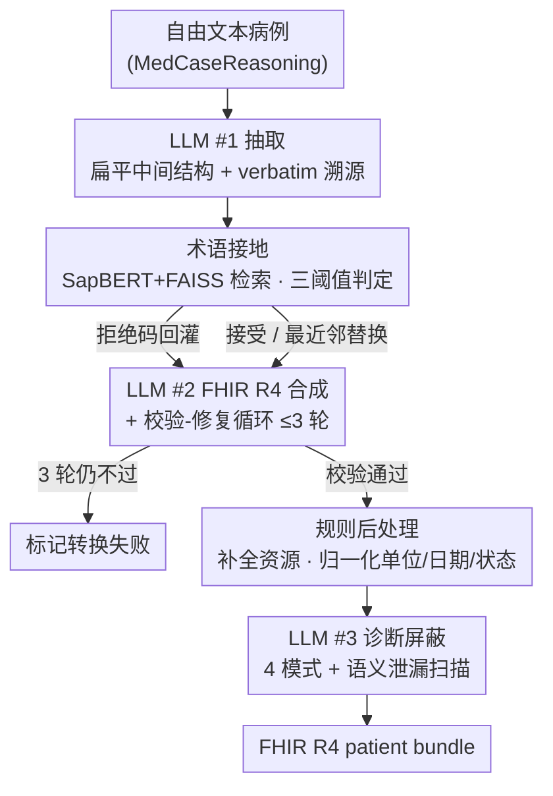

# MedCase-Structured: A Text-to-FHIR Dataset for Benchmarking Diagnostic Reasoning in Clinically Realistic EHR Settings

**会议**: ICML2026  
**arXiv**: [2605.30295](https://arxiv.org/abs/2605.30295)  
**代码**: https://github.com/SystemInternal/MedCase-Structured (有)  
**领域**: 医疗NLP
**关键词**: FHIR、临床决策支持、术语接地、合成 EHR、诊断推理

## 一句话总结
作者提出一个把自由文本病例转成符合 HL7 FHIR R4 标准的"分阶段 LLM + 术语接地 + 修复循环"流水线，并据此从 MedCaseReasoning 构造出 1408 条结构化合成病例数据集 MedCase-Structured（成功率 82.5%），实验显示 GPT-5.4 / Gemini-3.1-Pro / Claude-Opus-4.6 在结构化 FHIR 输入上的诊断准确率比纯文本输入一致下降 4–23 个点。

## 研究背景与动机

**领域现状**：基于 LLM 的临床决策支持系统（CDSS）越来越多被讨论，标准评测要么用 MedQA 之类的纯文本 QA，要么用 MIMIC-IV 这类受限的真实 EHR；现代医院系统普遍以 HL7 FHIR 资源对象在不同模块之间交换患者数据。

**现有痛点**：现成 benchmark 与真实部署形态不匹配——(1) 纯文本病例没法测模型在结构化、互操作格式上的鲁棒性；(2) MIMIC-IV-FHIR 是离线"逆向映射"，分布单一且受隐私限制；(3) Synthea 基于规则模板生成，临床多样性有限、压力测试维度不够；(4) FHIR-GPT/Infherno 之类的 text→FHIR 方法目标是"忠实重建"已有病例，而不是生成可控、可批量产出的评测样本。

**核心矛盾**：要做"部署对齐"的 CDSS 评测，必须有大批量、结构化、可控难度、且免隐私的合成 FHIR 病例；但直接让 LLM 写 FHIR 又会大量产出**幻觉的医学编码**（LOINC / RxNorm / SNOMED 编不出来就瞎编）和**结构不合规**的资源对象，质量不可用。

**本文目标**：拆成两件事——(a) 建一条能从自由文本可控生成临床真实 FHIR R4 bundle 的流水线，把幻觉编码和结构错误压住；(b) 用这条流水线把 MedCaseReasoning 转成一个公开数据集 MedCase-Structured，并比较 LLM 在"纯文本病例"与"结构化 FHIR 病例"两种输入下的诊断准确率差异。

**切入角度**：观察到自由生成 FHIR 的失败模式集中在两类——"幻觉/不规范的标准术语码"和"资源之间的结构/语义不一致"。前者可以靠**确定性的术语库 + 嵌入检索**来 ground，后者可以靠**多阶段拆分 + 校验-修复循环**来约束。

**核心 idea**：把 text→FHIR 拆成"信息抽取 → 术语接地 → FHIR 合成与校验 → 诊断屏蔽"四段，LLM 只在三个固定锚点出手（抽取、合成、语义泄漏扫描），中间用 SapBERT+FAISS 的术语库做硬性接地与三阈值的接受/替换/拒绝判定，并在合成阶段接入最多 3 轮的"校验失败 → LLM 重写"修复循环。

## 方法详解

### 整体框架
这条流水线要解决的是"让 LLM 把一份自由文本病例可控地写成合规 FHIR，又不让它瞎编医学编码"。输入一份英文自由文本病例（来自 MedCaseReasoning），输出一个通过校验的 HL7 FHIR R4 patient bundle，可选地按诊断屏蔽模式剔除诊断结论供下游评测。它把任务拆成串联的四段：先由 LLM #1 把文本抽成扁平中间结构（人口学/症状/体征/生命体征/化验/用药/操作/既往史，每条保留原文 verbatim 引用做溯源）；再用内部术语库对所有编码做确定性接地；接着由 LLM #2 按 R4 模板组装成 FHIR 资源并跑校验-修复循环；最后由 LLM #3 按配置屏蔽诊断结论。全程统一用 Claude (claude-sonnet-4-20250514)、temperature 0 以求可复现——LLM 只在抽取、合成、语义扫描三个固定锚点出手，其余约束都交给检索与规则。

### 关键设计

**1. 术语接地：用 SapBERT + FAISS + 三阈值判定把幻觉码当场钉死**

作者在 Table 2 里报告失败案例的最大头就是术语幻觉——LOINC 幻觉 183 例、RxNorm 幻觉 126 例、药物粒度过粗 103 例，让 LLM 自由写 SNOMED CT / LOINC / RxNorm / CVX 编码完全压不住。做法是把"这码合不合法"从概率生成问题改成可调阈值的检索匹配问题：先对 LLM 抽出的每个编码按关键词检索候选，再用 SapBERT 把待修候选与内部术语库（聚合 OMOP + SNOMED CT / LOINC / RxNorm / CVX）中所有 preferred term 的嵌入一并索引到 FAISS，按三档余弦相似度阈值分别判"原码可接受 / 用最近邻替换 / 直接拒绝交回修复循环"。SapBERT 本身是生物医学实体的强基线嵌入，配 FAISS 又能把语义检索的时延压住，所以这一步既能把瞎编的码挡掉、又能把近义码自动归一到术语库里真实存在的那条。

**2. 三段固定锚点 + 校验-修复闭环：拿可调试性换 agent 的灵活性**

与 Infherno 那类让 LLM 自己动态决定何时调工具的 agent 风格相反，本文把 LLM 的调用次数和次序写死成三次（抽取、合成、语义泄漏扫描），中间夹的"确定性术语接地 + 结构/临床一致性校验 + 规则后处理"都不经 LLM。关键的闭环在合成阶段：LLM #2 组装出 bundle 后跑 FHIR 校验器，把失败的校验项当作错误清单显式回灌给 LLM 重写，至多 3 轮，超出仍不过就把该病例标为转换失败；校验通过后再用规则补全缺失资源、归一化单位/日期/状态字段。固定锚点配 temperature 0 让整条管线可复现、可逐段调试，也把"语法/术语是否合规"这种确定性约束从 LLM 手里收回交给规则与术语库，让 LLM 只干"自然语言↔结构化表示"这件它擅长的映射。

**3. 四模式可配置诊断屏蔽 + 第三段 LLM 语义泄漏扫描：堵住 narrative 字段里的答案残留**

CDSS 评测的可信度全靠"输入里不能藏答案"，而 FHIR bundle 的 narrative 字段恰恰是诊断信息最容易借缩写、同义词残留的地方。屏蔽按 NONE / HIDDEN / EXPLICIT / FULL 四档配置——NONE 删全部诊断结论、HIDDEN 只删主诊断、EXPLICIT 只留患者自述的状况、FULL 全保留。NONE/HIDDEN 两档先按编码 + 子串做硬过滤，但硬过滤抓不到缩写、暗示性结论、未列入同义词表的近义说法这些隐性泄漏，于是再让 LLM #3 在所有 narrative 字段上做一遍语义扫描把它们 redact 掉。这套"硬过滤兜底确定性、LLM 兜底语义"的两段式，本质上是承认规则 redact 在自然语言层一定有漏，必须再借一次模型的语义理解补缺。

### 训练策略
本文不训练任何模型：全程用现成 Claude 闭源 API + 现成 SapBERT 嵌入 + 现成 FAISS 索引，温度固定为 0 保证可复现，没有微调、没有 RLHF，整套系统是"LLM + 检索 + 规则校验"的合成数据流水线。

## 实验关键数据

### 主实验

数据集构造结果——把 MedCaseReasoning 原始 14,489 条病例先按规则过滤（去掉非人类、多患者、依赖影像细节的样例），再过流水线：

| 数据集划分 | 原始总数 | 影像类剔除 | 编码错误剔除 | 其它剔除 | 最终 |
|---|---|---|---|---|---|
| Train | 13,092 | 11,568 | 232 | 28 | 1,263 |
| Val | 500 | 438 | 10 | 2 | 50 |
| Test | 897 | 777 | 14 | 11 | 95 |
| 合计 | 14,489 | 12,783 | 256 | 41 | 1,408 |

进入流水线的样例最终成功生成 FHIR bundle 的比例为 **82.5%**。

LLM 诊断准确率对比——把同一批病例分别以"纯文本（MCR）"与"结构化 FHIR（MCS）"两种形态喂给同一模型，比较 zero / 1-shot / 5-shot 设置：

| 模型 | 设置 | MCR (%) | MCS (%) | Δ |
|---|---|---|---|---|
| GPT-5.4 | zero-shot | 65.26 | 61.05 | −4.21 |
| GPT-5.4 | 1-shot | 74.74 | 51.58 | −23.16 |
| GPT-5.4 | 5-shot | 74.74 | 53.68 | −21.06 |
| Gemini-3.1-Pro | zero-shot | 58.95 | 52.63 | −6.32 |
| Gemini-3.1-Pro | 1-shot | 65.26 | 53.68 | −11.58 |
| Gemini-3.1-Pro | 5-shot | 63.16 | 57.89 | −5.28 |
| Claude-Opus-4.6 | zero-shot | 68.42 | 53.63 | −14.79 |
| Claude-Opus-4.6 | 1-shot | 69.47 | 54.74 | −14.73 |
| Claude-Opus-4.6 | 5-shot | 66.32 | 58.95 | −7.37 |

三家模型在所有 shot 设置下都是"结构化 FHIR 输入显著差于纯文本"，最猛的一档（GPT-5.4 + 1-shot）掉了 23 个点。

### 失败模式分析（替代消融）

本文没做传统意义的消融，但报告了流水线在 MedCaseReasoning 上的细粒度失败模式（数量级即变相说明哪一步最吃紧）：

| 类别 | 失败类型 | 数量 | 举例 |
|---|---|---|---|
| 术语错误 | LOINC 幻觉 | 183 | "septic workup"、"pharmacological challenge test" |
| 术语错误 | RxNorm 幻觉 | 126 | 修复后又幻觉成无效码 |
| 术语错误 | 药物粒度过粗 | 103 | "oral antibiotics"、"topical corticosteroid paste" |
| 术语错误 | CVX 同义词缺口 | 12 | "Moderna booster"、"fully immunized" |
| 语义映射 | 描述过于具体 | 32 | "loosening of lower teeth requiring dental implants" |
| 语义映射 | SNOMED 类别错配 | 33 | 操作码被赋给临床发现 |
| 排除 | 缺人口学 | 4 | 原文没年龄 |
| 排除 | 多患者 | 9 | 一份病例多名患者 |
| 排除 | 非人类 | 25 | 兽医病历 |

### 关键发现
- 即使加了 3 轮校验-修复循环，**术语幻觉（LOINC + RxNorm + 粒度过粗）依然是最大瓶颈**（>410 例码级错误，远多于结构/语义错误），说明 SapBERT+FAISS 检索接地解决"瞎编一个看起来像样的码"已经有用，但解决不了"描述太宽泛根本对不上任何具体码"。
- "结构化 FHIR 比纯文本难"的 gap 在 **few-shot 上不缩反扩**：GPT-5.4 加 1-shot/5-shot 时 MCR 涨到 74.74%，但 MCS 还在 51–53% 徘徊——示例无法把模型对 FHIR 资源对象的不熟悉补回来。
- 影像类病例在 MedCaseReasoning 里占比极大（13,092 中有 11,568 被先验剔除，88%），因为本文流水线没建模 ImagingStudy/DiagnosticReport-imaging 资源；这是数据集留下的最大"未来工作面"。

## 亮点与洞察
- **"LLM 锚点 + 检索式术语库 + 校验修复循环"是给非自然语言结构化生成兜底的标准范式**：让 LLM 只承担它擅长的"叙述→中间表示"映射，把"是不是合法码 / 资源结构合不合规"这种确定性约束交回给规则与检索，是结构化 EHR 之外（法律合同、报税单、配置文件、API schema 生成）都可以直接复用的模板。
- **诊断屏蔽的"硬过滤+LLM 语义扫描"两段式**是被低估的设计——naive 评测往往直接用编码黑名单做屏蔽，但 FHIR 的 narrative/text 字段会通过缩写、隐含结论、同义词把答案泄回去；这套两段式可以直接搬到其它"屏蔽答案做评测"的合成数据场景（法律/财报/考试题反推）。
- **"评测分布对齐部署形态"这件事的实证 ROI 很高**：同一批病例只是换个表示就让 GPT-5.4 掉 20+ 点，意味着学界刷的 MedQA / MedCaseReasoning 排行榜与"模型真上 EHR 系统能不能用"几乎是两件事——这给后续 clinical LLM 的评测设计提供了硬证据。

## 局限与展望
- 流水线只覆盖了 10 类 FHIR 资源（Patient / Encounter / Condition / Observation / MedicationRequest / Procedure / DiagnosticReport / FamilyMemberHistory / AllergyIntolerance / Immunization），关键的 ImagingStudy / Specimen / ServiceRequest / Goal 等没有，影像类病例（占原始数据 88%）整体被排除。
- 没建模真正的纵向轨迹（同一患者多次就诊的时间序列），只用"日期感知的重复资源"代替，不能评测时间推理。
- 术语接地仍是最大瓶颈：粒度过粗的描述（"oral antibiotics"）、英文同义词缺口（"Moderna booster"）这两类失败靠现有 SapBERT+FAISS 解决不了，需要更强的上下文感知校验或更宽的术语扩展。
- 评测只用了三家闭源模型 + MedCaseReasoning 单一上游，未与 MIMIC-IV-FHIR、Synthea 直接做"同一模型在不同数据源"的对比；MCS 与 MCR 的 gap 里有多少来自"FHIR 难"、多少来自"作者的合成 bundle 引入了额外噪声"，没有充分解耦。
- 全管线用 Claude-Sonnet-4 自评（合成、屏蔽、并在评测里也是被测对象之一），存在轻度自家模型先验泄漏的可能；可加一个跨家族 LLM 用于合成、再用其它模型评测的交叉实验。

## 相关工作与启发
- **vs Synthea**：Synthea 是规则模板生成，覆盖广、临床真实但多样性不足，且无法从一份给定的自由文本病例生成对应 FHIR；本文是 text-driven，临床复杂度可控但需要 LLM + 术语库的复杂工程。两者互补——做"分布广 / 大规模训练数据"用 Synthea，做"针对特定疑难病例做诊断推理评测"用本文方法。
- **vs FHIR-GPT / Infherno**：这两条线把 text→FHIR 当成"忠实重建已有患者记录"的任务，目标是临床信息系统集成；本文把它当成"评测样本生产管道"，强调可控性、诊断屏蔽、批量产出和评测对齐，定位差异显著。
- **vs FHIR-AgentBench / EHRStruct**：这两个 benchmark 给出了"LLM 在 FHIR / 结构化 EHR 上能力如何"的评测，但用的是固定数据集，没法对临床复杂度、模糊性、屏蔽方式做可控扰动；MedCase-Structured 是把"数据集"升级为"可由文本驱动按需生成的样本工厂"，跟这两个 benchmark 是上下游互补关系。
- 给后续研究的启发：(a) 把 ImagingStudy 资源补上、与放射报告生成模型联动，能把数据集规模放大 5 倍以上；(b) "结构化 vs 文本" 的 gap 在 few-shot 上反而扩大，是个值得单独研究的 in-context learning 问题；(c) 这一套合成+屏蔽流水线可以直接拷贝到 OMOP-CDM、openEHR 等其它医疗数据标准上。

## 评分
- 新颖性: ⭐⭐⭐⭐ "从自由文本可控生成评测用 FHIR" 这个定位是新的，关键组件（术语接地、修复循环、语义泄漏扫描）单看都不新，但拼起来解决一个真问题。
- 实验充分度: ⭐⭐⭐ 流水线产出统计 + 失败模式分类做得细，但只测了 3 家闭源模型、未与 Synthea / MIMIC-IV-FHIR 做平行对比，缺消融。
- 写作质量: ⭐⭐⭐⭐ 动机—瓶颈—方法—失败模式—评测的逻辑链很顺，Table 1/2/3 信息密度高，便于复述。
- 价值: ⭐⭐⭐⭐ 1408 条样例 + 公开仓库 + 可控屏蔽模式，对做临床 LLM 评测的人是直接可用的；同时给出了"评测要对齐部署形态"的硬数据，影响面不小。

<!-- RELATED:START -->

## 相关论文

- [\[ACL 2026\] Dr. Assistant: Enhancing Clinical Diagnostic Inquiry via Structured Diagnostic Reasoning Data and Reinforcement Learning](../../ACL2026/medical_nlp/dr_assistant_enhancing_clinical_diagnostic_inquiry_via_structured_diagnostic_rea.md)
- [\[ACL 2026\] RePrompT: Recurrent Prompt Tuning for Integrating Structured EHR Encoders with Large Language Models](../../ACL2026/medical_nlp/reprompt_recurrent_prompt_tuning_for_integrating_structured_ehr_encoders_with_la.md)
- [\[ICLR 2026\] From Conversation to Query Execution: Benchmarking User and Tool Interactions for EHR Database Agents](../../ICLR2026/medical_nlp/from_conversation_to_query_execution_benchmarking_user_and_tool_interactions_for.md)
- [\[ICLR 2026\] BiomedSQL: Text-to-SQL for Scientific Reasoning on Biomedical Knowledge Bases](../../ICLR2026/medical_nlp/biomedsql_text-to-sql_for_scientific_reasoning_on_biomedical_knowledge_bases.md)
- [\[ACL 2026\] MultiDx: A Multi-Source Knowledge Integration Framework towards Diagnostic Reasoning](../../ACL2026/medical_nlp/multidx_a_multi-source_knowledge_integration_framework_towards_diagnostic_reason.md)

<!-- RELATED:END -->
