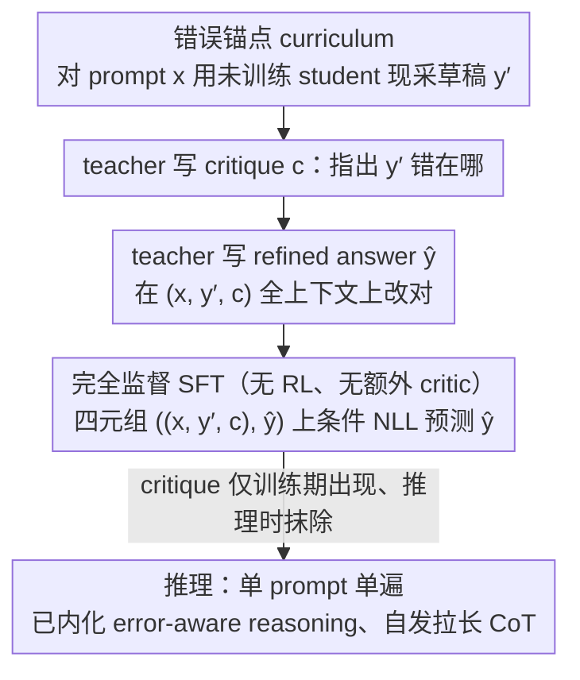

# Critique-Guided Distillation for Robust Reasoning via Refinement

**会议**: ICML 2026  
**arXiv**: [2505.11628](https://arxiv.org/abs/2505.11628)  
**代码**: 论文未公开仓库链接  
**领域**: 模型压缩 / 知识蒸馏  
**关键词**: 知识蒸馏, 数学推理, Critique, 自纠错, 监督微调  

## 一句话总结
让 student 在训练时**消费**而不是**生成** teacher 的 critique——以 (prompt, student 自答, teacher critique) 为条件预测 teacher 的 refined answer，推理时只需一遍 prompt 就能产出更长更准的推理链，且不像 CFT 那样把指令跟随能力毁掉。

## 研究背景与动机

**领域现状**：把小模型从大 teacher 处蒸馏出强推理能力的主流配方是 SFT/Distilled-SFT——直接模仿 teacher 在同一 prompt 上的 gold answer 或 CoT；少数工作（CFT, Self-Refine, Reflexion）则尝试引入"critique"信号来逼模型学会自我修正。

**现有痛点**：(i) 单纯 SFT 是"只学结论不学为什么"，OOD 与困难题上很快塌陷；(ii) Self-Refine/Reflexion 这一类把 critique 放在 inference 时跑多遍，推理成本翻倍；(iii) Wang 2025 的 Critique Fine-Tuning（CFT）把 critique 生成搬到训练时，把 student 训成"生成 critique"——结果出现严重的 output-format drift：LLaMA3.1-8B 的 IFEval 从 76.9% 暴跌到 55.6%，通用能力被吃掉一大块。

**核心矛盾**：critique 本身确实能教模型"哪里错了、怎么错的"，但**让 student 学着输出 critique** 和**让 student 学着按 critique 改答案**是两件事——前者修改了 student 的输出分布与格式，后者只是把 critique 当训练期的额外条件。把这两件事搅在一起，CFT 才会"赢了 math、输了 IFEval"。

**本文目标**：在保持单遍 inference、不动模型架构的前提下，把 critique 的好处全部留下来、把 critique 生成带来的副作用全部剥掉。

**切入角度**：critique 在训练中只承担"semantic scaffold"的角色——它告诉 student 当前这答案哪里错了，但 student 学的目标只有一个：把这种错误改对。Inference 时既不喂 critique 也不喂 student 自己的草稿，模型在内部"内化"了 error-aware reasoning。

**核心 idea**：**Decouple critique consumption from critique generation**——训练时 student 看到自己写的烂答案 + teacher 的 critique，但只被监督去预测 teacher 的 refined answer；推理时只输入 prompt，单遍生成。

## 方法详解

### 整体框架
CGD 想解决的事很具体：让小 student 从大 teacher 处学到"从错改对"的推理能力，但又不像 CFT 那样把 student 训成只会输出 critique、连指令跟随都丢了。它的做法是一个三步数据合成 + 一次性 SFT 的极简 pipeline，不引入新模块也不动 prompt 格式——先让未训练的 student $S_{\theta_{\text{init}}}$ 对每个 prompt $x$ 现采样一个"很可能有错"的草稿 $y' \sim S_{\theta_{\text{init}}}(\cdot \mid x)$，再让 teacher $T_\phi$ 看着 $(x, y')$ 写出文本 critique $c \sim T_\phi(\cdot \mid x, y')$ 指出错在哪，最后 teacher 在 $(x, y', c)$ 全上下文上产出 gold-standard 改写 $\hat{y} \sim T_\phi(\cdot \mid x, y', c)$；最终只拿 $((x, y', c), \hat{y})$ 这条四元组把 student 训一遍。关键在于：critique 只在训练期当条件出现，推理时只喂 prompt 单遍生成。

### 关键设计

**1. 以 student-specific 错误为锚点的 curriculum：让 critique 永远对着 student 真会犯的错**

标准 distilled SFT 的毛病是"无论 student 犯什么错都喂同一份 teacher solution"，等于用 teacher 想象的通用错误来教。CGD 把这一点反过来：草稿 $y'$ 不是预先生成一次复用，而是**对每个 prompt 用 $S_{\theta_{\text{init}}}$ 现采样**——于是 critique 和 refined answer 都被绑定到这个具体 checkpoint 的真实失败模式上，自动得到一份"按 student 弱点定制"的训练课程。作者把这个属性叫 "specificity and relevance of feedback"，并认为它是 CGD 增益的直接驱动力：消融里一旦把 critique 换成占位或无关文本、让它与 student 实际错误不匹配，增益就显著缩水，说明涨点不是简单"多看了一段上下文"，而是 specific feedback 真的在塑造学习信号。

**2. 训练时四元组条件、推理时单 prompt 单遍：把 critique 当只在训练期存在的"语义脚手架"**

这一条直接针对 CFT 的崩溃来设计。CFT 的目标是 $-\log S_\theta(c \mid x, y')$，逼 student 去生成 critique，结果输出分布被拉向 critique 风格、通用任务格式漂移（IFEval 76.9→55.6）。CGD 的目标始终是标准条件 NLL $\mathcal{L}(\theta) = \mathbb{E}_{(x, y', c, \hat{y})}\big[-\log S_\theta(\hat{y} \mid x, y', c)\big]$——监督的永远是"给 prompt 写出对的答案"，输出分布不被污染。而 inference 时模型只看到 $x$，单遍前向直接生成，不加特殊 token、不改 prompt 模板。妙处在于：critique 虽然在推理时被彻底抹除，但 student 内部表征已经把"从错改对"的映射内化了，所以即使没看到 critique，也会**自发**拉长推理链（AIME 上达 4.4×）。

**3. 训练目标完全监督、不引入 RL 或额外 critic：用最朴素的 SFT 拿到接近 RL 系的自纠错效果**

teacher 一个人同时充当 critic 与 refiner，给的是文本 critique 而非标量奖励，正好契合 "effective feedback must be specific and actionable" 的经验观察。比起同类自纠错路线，CGD 砍掉了一切重活：与 GRACE/QCRD 相比不用训判别器、与 CTRL/Shepherd 相比不用单独的 critic 模型、与 Self-Refine 相比不用多轮 decoding。代价就只剩一次普通 SFT——100K 样本在 16 张 A100 上 8 GPU-hour 跑完，落地成本远低于带 reward model 和采样回路的 RL pipeline，却拿到了接近 SCoRe、RL4F 的自纠错行为。

### 损失函数 / 训练策略
唯一损失即 Eq. (1) 的条件 NLL；所有 baseline（SFT、Distilled SFT、CFT）共享相同 100K 样本、batch size 64、1 epoch，从而 step 数完全对齐，单次训练约 8 A100·h。Teacher 用 LLaMA3.3-70B Instruct（LLaMA 家族）或 S1.1-32B（Qwen 家族）。

## 实验关键数据

### 主实验

| Student | 方法 | Math Reasoning Avg ↑ | General Reasoning Avg ↑ | 代表性收益 |
|---------|------|---------------------|------------------------|------------|
| LLaMA3.1-8B-Instruct | base | 41.3 | 29.9 | — |
| LLaMA3.1-8B-Instruct | Distilled SFT | 43.7 | 31.9 | — |
| LLaMA3.1-8B-Instruct | CFT | 41.5 | 32.4 | AMC23 22.5 |
| LLaMA3.1-8B-Instruct | **CGD** | **46.9** | **36.7** | **AMC23 37.5 (+15.0)**, OlympiadBench 23.7 (+8.0) |
| S1.1-3B | base | 35.4 | 17.9 | — |
| S1.1-3B | Distilled SFT | 41.7 | 33.5 | — |
| S1.1-3B | CFT | 38.9 | 29.5 | MATH500 49.6 |
| S1.1-3B | **CGD** | **46.1** | **33.4** | **MATH500 61.8 (+12.2)**, Minerva-Math +6.9 |

跨家族验证：Qwen2.5-Math-7B 上 CGD 拿到 +22.6% 相对 base，8 A100·h 训练成本。

### 消融实验

| 评测维度 | 指标 | LLaMA3.1-8B base | + CFT | + CGD | 解读 |
|---------|------|------------------|-------|-------|------|
| IFEval（指令跟随） | acc | 76.9 | **55.6 (-21.3)** | ≥76.9 | CFT 灾难性退化，CGD 保留 |
| MUSR / TruthfulQA / BBH / HumanEval | 综合 | baseline | 下降明显 | 持平或上升 | CGD 不损通用能力 |
| AIME（greedy/Pass@1） | acc | 弱 | 弱 | 显著更强 | 低采样预算下增益最大 |
| 推理链长度（AIME） | tokens | 1× | — | **4.4×** | inference 时无 critique 也会自发拉长 CoT |

### 关键发现
- **critique 的"具体性"是因果驱动力**：作者通过控制 critique 与 student 真实错误的相关性做了消融，相关性下降时增益显著缩水——说明涨点不是简单的"多看了一段文本上下文"，而是 specific feedback 真的在塑造学习信号。
- **AMC23 +15.0 / MATH500 +12.2 集中在低 Pass@k**：意味着 CGD 提升的是"每次采样的推理质量"，不是靠扩 sample budget；Pass@k 随 $k$ 还能继续涨说明分布并未塌缩。
- **CFT 的崩溃是目标层面的，不是超参数问题**：作者明确指出这是"训练目标改成生成 critique"带来的根本性副作用，调超参救不回来——这从侧面证明了 decouple 的必要性。
- **可跨家族迁移**：LLaMA、Qwen、S1.1、Mixtral、OLMo 五个家族都拿到 5-7% math reasoning 提升；甚至对纯 math 训练数据的 CGD 仍能迁移到 HumanEval 代码生成。

## 亮点与洞察
- "decouple consumption from generation"这个观点本身就很值得记——很多 self-improvement / self-refine 类工作把"会判断"和"会输出判断"耦在一起，CGD 干净地把"会用 feedback"留下、把"会生成 feedback"扔掉，正好绕开 format drift，工程上零额外推理开销。
- 用 student-specific 错误做 curriculum 在概念上接近 RLHF/DPO 的"on-policy"思想，但实现完全是 supervised 的，没有 reward model 也没有采样回路，是一种"伪 on-policy"——把 RL 系的好处用 SFT 的成本拿到。
- "训练时塞富信息、推理时只看 prompt"的范式可以非常自然地推广到其他领域：例如训练时给 student plan/scratchpad/工具调用轨迹，推理时让它单遍内化。CGD 等于把这一类方法的最小可行配方做实了。
- IFEval 76.9→55.6 这个数据点非常有教育意义——它解释了为什么很多"reasoning-enhanced"模型在通用 chatbot 评测上反而变差，并把症结定位到训练目标本身，而不是数据规模或学习率。

## 局限与展望
- Teacher 写错 critique 时学生会被引偏：作者承认在 hard math 上 LLaMA3.3-70B 的 critique 质量本身就是瓶颈，没有给出对 critique 错误率的鲁棒性曲线。
- 评测主要集中在数学/推理 benchmark，OOD 实验是 HumanEval；多模态、长上下文、对话安全等场景没有触及。
- 训练样本中包含与评测集的 <0.1% 模糊重叠（作者已移除），但 web-crawled 指令数据的污染风险长期存在，对 +12%/+15% 这种大幅增益需要谨慎归因。
- 与 RL 类自纠错方法（SCoRe、RL4F）的直接比较在正文较少，论文把这部分放到附录而非主表里，工程上想把 CGD 作为 RL 的初始化 checkpoint 还需要额外验证。

## 相关工作与启发
- **vs Critique Fine-Tuning (CFT, Wang 2025)**：CFT 训练目标是预测 critique，CGD 训练目标是预测 refined answer——同一份 (x, y', c) 数据但条件方向完全相反；本文实验显示 CGD 在 math reasoning 上同时压过 CFT 5-7%、并完全避免 IFEval 灾难。
- **vs Self-Refine / Reflexion (Madaan/Shinn 2023)**：那些方法把 critique 放在 inference loop 里多轮跑，CGD 把 critique 收编进训练数据、inference 单遍——同等推理预算下 CGD 的等价 latency 更低。
- **vs On-policy distillation (GKD/SKD)**：GKD/SKD 用 teacher 概率或 reward 提供隐式信号，CGD 给的是文本 critique 这种显式语义信号；二者可以叠加——CGD 数据 + GKD 损失或许能再涨一档。
- **vs SCoRe / RL4F**：RL 系需要 reward model 与采样循环，CGD 用同质数据拿到接近的自纠错行为而成本只剩一次 SFT。

## 评分
- 新颖性: ⭐⭐⭐⭐ "Decouple consumption from generation"作为概念很清晰，但单技术点更像是 CFT 的目标条件改写，朴素 SFT 框架本身没新东西。
- 实验充分度: ⭐⭐⭐⭐ 五个模型家族、两个数据集、math+general+OOD 三类评测、IFEval 反例都齐全，但 critique 质量鲁棒性、与 RL 的正面对照只在附录。
- 写作质量: ⭐⭐⭐⭐⭐ 问题动机定位极准（CFT 输了 IFEval 这一痛点直接成立论卖点），算法用 11 行伪代码 + 一个公式说尽，行文干净。
- 价值: ⭐⭐⭐⭐⭐ 8 GPU-hour 拿到 +22.6% 的 cross-family 增益、不动架构、单遍 inference——对中小模型推理蒸馏几乎是即插即用的强基线。

<!-- RELATED:START -->

## 相关论文

- [\[ICML 2026\] Toward Understanding Adversarial Distillation: Why Robust Teachers Fail](toward_understanding_adversarial_distillation_why_robust_teachers_fail.md)
- [\[ICLR 2026\] STAR: Similarity-guided Teacher-Assisted Refinement for Super-Tiny Function Calling Models](../../ICLR2026/model_compression/star_similarity-guided_teacher-assisted_refinement_for_super-tiny_function_calli.md)
- [\[AAAI 2026\] Efficient Reasoning for Large Reasoning Language Models via Certainty-Guided Reflection Suppression](../../AAAI2026/model_compression/efficient_reasoning_for_large_reasoning_language_models_via_certainty-guided_ref.md)
- [\[ACL 2025\] LLMSR@XLLM25: Less is More: Enhancing Structured Multi-Agent Reasoning via Quality-Guided Distillation](../../ACL2025/model_compression/llmsrxllm25_less_is_more_enhancing_structured_multi-agent_reasoning_via_quality-.md)
- [\[ECCV 2024\] Adversarially Robust Distillation by Reducing the Student-Teacher Variance Gap](../../ECCV2024/model_compression/adversarially_robust_distillation_by_reducing_the_student-teacher_variance_gap.md)

<!-- RELATED:END -->
