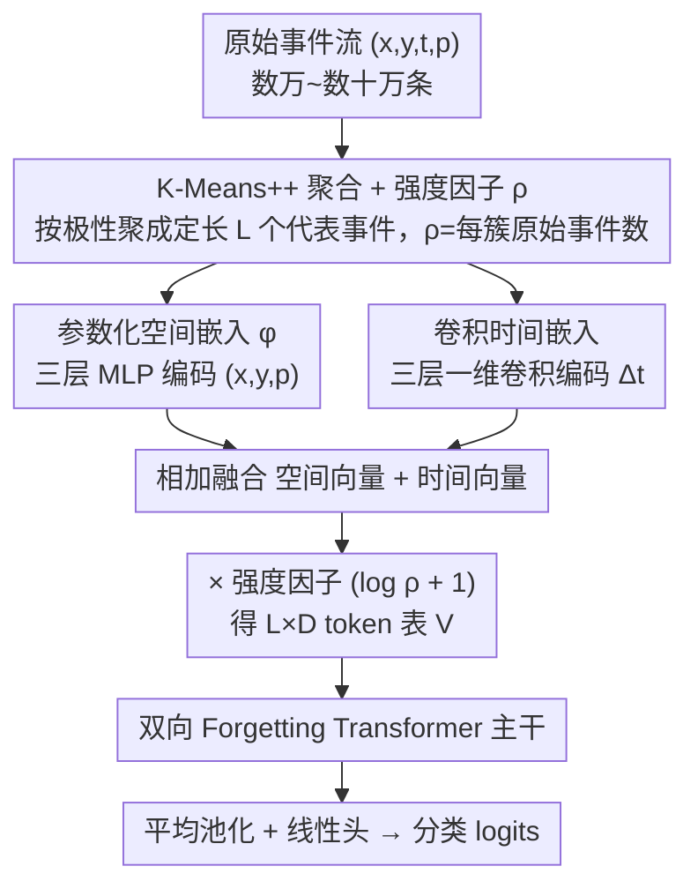

# Event2Vec: Processing Neuromorphic Events Directly by Representations in Vector Space

**会议**: ICML 2026  
**arXiv**: [2504.15371](https://arxiv.org/abs/2504.15371)  
**代码**: https://github.com/Intelligent-Computing-Lab-Panda/event2vec  
**领域**: 神经形态计算 / 事件相机 / 表示学习  
**关键词**: event camera, event2vec, Transformer, 空间嵌入, K-Means 聚合  

## 一句话总结
仿照 word2vec 的思路，把事件相机产生的稀疏异步事件 $(x,y,t,p)$ 直接嵌入到向量空间，用参数化空间嵌入 + 卷积时间嵌入 + K-Means++ 聚合，让标准 Transformer 既能保留事件的稀疏异步特性，又能在 GPU 上高吞吐运行，参数量只有以往 SOTA 的 $\tfrac{1}{2.8} \sim \tfrac{1}{816}$。

## 研究背景与动机

**领域现状**：事件相机（DVS、ATIS 等）以 AER 格式输出 $(x,y,t,p)$ 元组——空间坐标 + 微秒级时间戳 + 二值极性，具备超高时间分辨率、低功耗与高动态范围。目前主流处理方式分两派：一派把事件累加成稠密 voxel/frame 给 CNN/SNN 吃，一派用 GNN、Sparse CNN、PointNet 等不规则模型直接处理事件流。

**现有痛点**：稠密化路线丢掉了事件的稀疏性与微秒级时间分辨率，且大量零像素白白消耗算力；不规则路线则与 GPU 并行架构不匹配——SNN 在 GPU 上反而要同步模拟、训练慢且推理-训练存在 gap；Sparse CNN 难以充分利用 GPU；GNN 需要小心调超参且存在过平滑；PointNet-style 方法用置换不变假设，把时间戳降格为坐标，反而抹掉了事件的因果序。

**核心矛盾**：稀疏-异步性 vs. GPU-同步密集架构之间的根本不兼容。要么牺牲数据特性迁就硬件，要么牺牲硬件效率迁就数据。

**本文目标**：找一种表示，让事件流既能保留稀疏异步的本质，又能直接喂给 GPU 上跑得飞快的 Transformer。

**切入角度**：作者注意到事件和 NLP 单词存在高度类比关系——（1）都由"索引 + 位置"组成（事件用 $(x,y,p)$ 当索引、$t$ 当位置；单词用 vocab id + 序号）；（2）索引集都是有限的（DVS128 共 $2\times128\times128$ 个地址）；（3）都存在天然顺序（单词按句序、事件按时间戳）；（4）单个元素都需要上下文才有完整语义。既然 word2vec 把离散单词嵌入到连续向量空间后 NLP 起飞了，事件也应该能用类似套路。

**核心 idea**：用 event2vec 把每个事件嵌入成 $D$ 维向量 $\mathbf{v} = \text{Embed}_s(x,y,p) + \text{Embed}_t(\Delta t)$，事件流就变成 $L \times D$ 的 token 序列，可以直接被任何 Transformer 当 NLP 序列处理。

## 方法详解

### 整体框架
原始事件流动辄数万到数十万条，先被采样或 K-Means++ 聚合压到定长 $L$（聚合时同步记下每簇的强度因子 $\rho$），得到一条长度为 $L$ 的事件序列 $\{(x_i, y_i, t_i, p_i)\}$。这 $L$ 个事件经参数化空间嵌入、卷积时间嵌入两路并行编码、相加、再乘上强度因子 $(\log\rho+1)$，就变成一张 $L\times D$ 的 token 表 $\mathbf{V}$，剩下的重活全部交给一个现成的双向 Forgetting Transformer 主干（平均池化 + 线性头出分类 logits）。换句话说，event2vec 只负责把稀疏异步的事件"翻译"成 Transformer 看得懂的序列，把所有重活都甩给成熟的 NLP 主干生态。

### 关键设计

**1. 参数化空间嵌入 $\phi$：用连续函数替掉查找表，把"邻近像素相似"写进先验**

NLP 的标准做法是一张查找表 $\mathbf{W}_s \in \mathbb{R}^{(PHW)\times D}$，索引 $i$ 与 $i+1$ 之间不带任何先验关系——这对单词成立（vocab id 只是按频率分配的非语义标识），但搬到事件上就别扭：像素 $(x,y)$ 与 $(x+1,y)$ 在物理上高度相关，查找表却逼模型从零学这件本该免费的事。作者干脆把表换成一个连续函数：先把坐标归一化到 $[-1,1]$ 得到 $(\bar x, \bar y, \bar p)$，再过三层 MLP $\phi$（维度 $3 \to D/4 \to D/2 \to D$，每层 LayerNorm + ReLU），输出 $D$ 维稠密向量。因为 $\phi$ 连续可微，一阶泰勒展开直接给出 $\phi(x+\Delta x, y+\Delta y, p) - \phi(x,y,p) = J_\phi^{x,y} \cdot [\Delta x, \Delta y]^\top + o(\|\cdot\|)$——坐标越近、嵌入差越趋于 0，"空间邻近 → 嵌入相近"成了函数本身的性质而非要学的目标。这条归纳偏置后来被证明是精度跃升的关键。

**2. 基于 $\Delta t$ 的一维卷积时间嵌入：把连续非均匀时间戳变成"局部密度"信号**

事件的时间戳是连续且非均匀的，而 NLP 流行的 RoPE / ALiBi 都假定离散等间距索引，硬套并不合适。作者改用时间差当输入：先归一化 $\tilde t = t/\max(t)$，取一阶差分 $\Delta t_i = \tilde t_i - \tilde t_{i-1}$（首项补 0 对齐长度），再喂三层一维卷积（核大小 3、步长 1，通道 $1 \to D/4 \to D/2 \to D$，后两层 depthwise）。拿 $\Delta t$ 而非 $t$ 做输入相当于一次"时间预条件化"（思路接近残差学习），让网络直接看到瞬时事件密度；三点卷积又顺带带来时移不变、邻域上下文一致、对单个噪声事件局部平滑三重好处——卷积窗内 $\Delta t$ 求和恰好等于一段局部时间窗的累计时长，物理意义正是"局部事件密度"。消融里也能看到：只有当空间侧也用了 $\phi$、两个邻域偏置协同时，这条卷积时间编码才真正发力。

**3. 批量 K-Means++ 聚合 + 强度因子 $\rho$：把数十万事件压到定长 $L$，还把密度信息留下**

原始事件流动辄数万到数十万条，必须压到固定长度 $L$ 才好喂 Transformer。最简单的 baseline 是随机采样 $L$ 条，但在 DVS-Lip 唇读这种复杂任务下信息损失太大。进阶做法是按极性独立做 K-Means 聚类得到 $L$ 个代表事件，每簇统计原始事件数当作强度因子 $\rho_i$，token 写成 $\mathbf{V}[i] = (\log(\rho_i)+1)\cdot(\text{Embed}_s + \text{Embed}_t)$——这样既保住了空间分布，又把"这块区域很活跃"显式喂给 Transformer，而 $\log$ 压缩防止极少数高密度簇压倒整条序列。为了不让聚类成为 GPU 流水线外的瓶颈，作者把 K-Means++ 的逐步初始化改成批量版本：用多步 batch 计算近似单步采样，并增量更新最近中心距离，使整个预处理也能吃满 GPU 并行。

### 损失函数 / 训练策略
分类用标准交叉熵；DVS-Lip 上先在聚类事件上做自监督预训练再 fine-tune（细节见附录 A.5）。主干用双向参数共享版本的 Forgetting Transformer（线性注意力如 Gated Linear Attention 也可，精度略降）。

## 实验关键数据

### 主实验
三个神经形态分类基准：DVS Gesture（手势）、ASL-DVS（手语字母）、DVS-Lip（唇读）。

| 数据集 | 之前 SOTA（方法 / 参数量 / 精度） | Event2Vec（参数量 / 精度） | 参数压缩比 |
|--------|----------------------------------|---------------------------|------------|
| DVS Gesture | Max-Former / 1.45 MB / 98.60% | 0.52 MB / 97.57±1.31% | 2.79× |
| ASL-DVS | GNN+Transformer / 220.30 MB / 99.60% | 0.27 MB / 99.91±0.05% | 815.93× |
| DVS-Lip | Spiking ResNet18+BiGRU / 223.63 MB / 75.30% | 18.30 MB / 75.88%（K-Means 聚合） | 12.22× |

精度在三个数据集上分别"持平 / 最高 / 最高"，但参数量被压到原来的几百分之一。

### 消融实验
DVS Gesture 上对空间嵌入（标准 lookup vs. 参数化 $\phi$）× 时间嵌入（sinusoidal on $t$ vs. Conv on $\Delta t$）做交叉消融，并比较吞吐 / 延迟。

| 配置 | DVS Gesture 精度 | 备注 |
|------|------------------|------|
| 标准 lookup + Sinusoidal$(t)$ | 偏低 | 双向都缺乏邻域归纳偏置 |
| 标准 lookup + Conv$(\Delta t)$ | **最低** | 空间无邻域偏置反过来拖累卷积时间编码 |
| 参数化 $\phi$ + Sinusoidal$(t)$ | 中等 | 空间补上但时间仍套用离散等间距假设 |
| 参数化 $\phi$ + Conv$(\Delta t)$（完整模型） | **最高** | 两个邻域偏置协同 |

吞吐与延迟（见原文 Table 2）：训练吞吐相对前 SOTA 分别 4.21× / 11.96× / 35.36×；推理吞吐 2.69× / 62.67× / 5.70×；单流端到端延迟降到原来的 68.55% / 11.12% / 14.68%；显存降到 72.18% / 15.08% / 68.35%。

### 关键发现
- 空间嵌入是上限：把标准 lookup 换成参数化 $\phi$ 是精度跃升的关键。没有空间邻域偏置时，卷积时间编码反而比 sinusoidal 更差——印证了"两个邻域偏置必须协同"的设计直觉。
- 参数效率的来源：事件天然稀疏 + 嵌入函数共享空间结构，使得网络不需要像 CNN 那样为每个像素位置分配独立卷积参数。
- K-Means 聚合显著优于随机采样：DVS-Lip 上从 70.62% 提升到 75.88%（+5.26%），且推理时聚合可借助批量 K-Means++ GPU 实现，避免了 PointNet-style 的远点采样延迟。
- 在极低事件数 / 极低空间分辨率下仍鲁棒，适合实时神经形态视觉。

## 亮点与洞察
- 把"word2vec 给 NLP 解锁的范式"完整搬运到事件相机：先把离散稀疏符号嵌入到连续向量空间，剩下的全部交给现成的 Transformer 生态。这种"换轨道"思路比"在原轨道上修修补补"（针对 SNN 改训练算法、给 GNN 加 trick）格局更大。
- 用连续可微 MLP 替代离散 lookup 表，并用一阶泰勒展开直接证明邻域归纳偏置——一个简洁优雅的形式化论证，可推广到任何"索引空间存在拓扑结构"的场景（如 3D voxel、雷达点等）。
- $\rho \to \log(\rho)+1$ 的强度因子是一个小却关键的细节：既保留密度信息，又防止聚合事件压倒非聚合 token，可直接被点云 / 草图 / 图采样等任务复用。
- 批量 K-Means++ 把传统迭代算法改造成 GPU-friendly，是把"预处理瓶颈"也拉进 GPU 流水线的实用工程范式。

## 局限与展望
- 主干仍依赖 Forgetting Transformer 这个相对新的注意力变体，线性注意力替代后会掉点；如果想跑在 LLM 标准 Flash-Attention 上还需要适配。
- 序列长度 $L$ 被预先固定，意味着自适应剪裁 / 扩张事件量需要重训；动态长度方案没有展示。
- 仅在分类任务上验证；事件相机的核心 killer app（光流、HDR 重建、SLAM、目标跟踪）下 event2vec 的表现还未知。
- 强度因子 $\rho$ 仅做 $\log$ 压缩，没探索可学习的密度编码；同时聚类数 $L$ 的最优值没系统扫。

## 相关工作与启发
- **vs EventNet（Sekikawa 2019）**：两者都把事件解耦成"空间-极性地址 + 相对时间"。EventNet 用 lookup 表 $h(\mathbf{e})$ + 手工设计的复杂时间编码函数，配 PointNet 风格 max 聚合，目标是 CPU 上的异步递归推理；event2vec 用可学习连续 $\phi$ + 卷积处理一阶 $\Delta t$，目标是 GPU 上的同步 Transformer 训练 / 推理。前者偏神经形态硬件部署，后者偏现代深度学习算力榨干。
- **vs Sparse CNN / GNN / PointNet-style**：它们直接处理不规则数据但 GPU 利用率低；event2vec 把不规则数据先映射到规则的 $L\times D$ 张量空间，再交给 Transformer 端到端处理，吃满 GPU 并行红利。
- **vs Event-Frame（Max-Former、SNN+Frame 等）**：稠密化方法精度高但参数量大、丢时间分辨率；event2vec 保留微秒级时间戳，参数效率高出 1~3 个数量级。

## 评分
- 新颖性: ⭐⭐⭐⭐ 类比 word2vec 把事件嵌入向量空间，并配套提出参数化空间嵌入 + 卷积时间嵌入，思路新颖但有 EventNet 等前作铺垫
- 实验充分度: ⭐⭐⭐⭐ 三个主流神经形态基准 + 吞吐 / 延迟 / 显存全维度对比 + 多种空时嵌入组合消融
- 写作质量: ⭐⭐⭐⭐ 用 word↔event 四点类比作为故事主线，方法部分公式与图示协同清晰
- 价值: ⭐⭐⭐⭐ 为事件相机 + Transformer 生态打开通道，参数压缩 2~800 倍的实用工程意义显著

<!-- RELATED:START -->

## 相关论文

- [\[ICML 2026\] MIC: Maximizing Informational Capacity in Adaptive Representations via Isotropic Subspace Alignment](mic_maximizing_informational_capacity_in_adaptive_representations_via_isotropic_.md)
- [\[ICML 2026\] Exploiting Weight-Space Symmetries for Approximating Curvature](exploiting_weight-space_symmetries_for_approximating_curvature.md)
- [\[ICML 2026\] ArcVQ-VAE: A Spherical Vector Quantization Framework with ArcCosine Additive Margin](arcvq-vae_a_spherical_vector_quantization_framework_with_arccosine_additive_marg.md)
- [\[ICLR 2026\] LLM DNA: Tracing Model Evolution via Functional Representations](../../ICLR2026/model_compression/llm_dna_tracing_model_evolution_via_functional_representations.md)
- [\[ICML 2026\] xKV: Cross-Layer KV-Cache Compression via Aligned Singular Vector Extraction](xkv_cross-layer_kv-cache_compression_via_aligned_singular_vector_extraction.md)

<!-- RELATED:END -->
