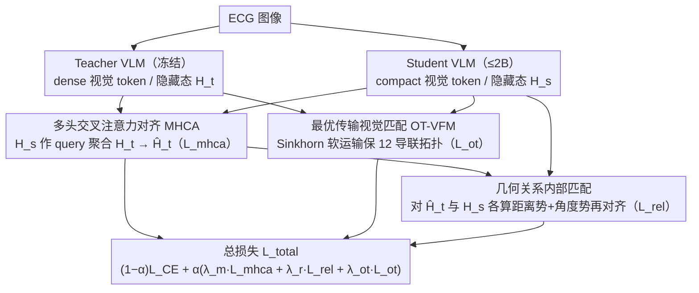

# EVL-ECG: Efficient ECG Interpretation With Multi-Aspect Heterogeneous Knowledge Distillation

**会议**: ICML 2026  
**arXiv**: [2605.29977](https://arxiv.org/abs/2605.29977)  
**代码**: 待确认  
**领域**: 医学图像 / VLM 蒸馏 / ECG 解读  
**关键词**: ECG 基础模型, 跨架构知识蒸馏, 多头交叉注意力, 最优传输, 几何关系匹配

## 一句话总结
EVL-ECG 针对 ECG 解读的 VLM 蒸馏问题（teacher 与 student 在视觉 token 数量、tokenizer、序列长度上都异构），引入"多头交叉注意力对齐 + 最优传输视觉特征匹配 + 几何关系内部匹配"三模块的跨架构蒸馏框架，把 2B 学生模型推到 SOTA，AUC 比已有 KD 高 2.4%、临床准确率高 1.1%。

## 研究背景与动机

**领域现状**：基于 VLM 的 ECG 解读已经从简单分类进入生成式临床报告阶段（Khunte 2024、Liu 2024b 等）。但 frontier VLM 体量大、推理慢，在病床边 / 边缘部署不现实。知识蒸馏（KD）是常规压缩方案，已有 cross-tokenizer / cross-modal KD 工作（Boizard 2025、Feng 2025）。

**现有痛点**：把巨型 VLM teacher 蒸到小 LM student 时面临两个独立但纠缠的障碍：
- **tokenizer 异构**：teacher / student 的词表不同，输出概率不能直接对齐
- **视觉 token 数量不均衡**：teacher 的视觉编码器吐出 dense token（如 ViT-L 输出 256 token），student 用更轻量编码器只有 64 token，序列长度对不齐
- 已有 KD 方法把这两个问题**孤立处理**，限制了使用现代高效 SLM 做 backbone 的可能性

**核心矛盾**：ECG 解读特别在意细粒度形态（P-QRS-T 间隔、ST 偏移、电轴方向），dense 与 sparse 视觉 token 之间的硬一一对齐既不可能（长度不对）也不正确（语义不一一对）；同时 ECG 的全局空间拓扑（12 导联布局）也不能丢——pointwise alignment 会把 V1-V6 胸导联和 I-III 肢体导联弄混。

**本文目标**：（1）解 tokenizer / 视觉 token 双重异构；（2）保留 ECG 的全局空间结构（导联布局、波形拓扑）；（3）压到 ≤ 2B 参数实现 SOTA。

**切入角度**：把蒸馏分三层——pointwise（特征级，多头交叉注意力做自适应聚合）、distributional（视觉特征级，最优传输做软分布对齐）、relational（结构级，几何距离 + 角度关系匹配）。三层互补，每层针对 ECG 的不同诊断维度。

**核心 idea**：用 MHCA 让 student 把自己的 query 投到 teacher 的 dense 表征上自适应聚合；用 entropic OT 在视觉 token 上做软对齐保全局拓扑；用 distance / angle 关系匹配保 teacher 的内在诊断"几何流形"。

## 方法详解

### 整体框架

EVL-ECG 要把一个体量巨大的 frontier VLM teacher 压进 ≤2B 的小学生，难点在于两边的视觉表征天生不对齐——teacher 吐 dense 的 $L_t$ 个视觉 token、student 只有 compact 的 $L_s$ 个，tokenizer 和序列长度都异构，没法直接逐位对齐。它的解法是把蒸馏拆成三层互补信号同时作用：特征级让 student 自适应聚合 teacher 上下文（MHCA）、分布级用最优传输软对齐视觉 token 保住 12 导联拓扑（OT-VFM）、关系级匹配隐藏态之间的几何结构保住 teacher 的诊断流形（Geometric Relation）。三者连同常规交叉熵合成总损失

$$\mathcal{L}_{\text{total}} = (1-\alpha)\mathcal{L}_{\text{CE}} + \alpha\big(\lambda_m \mathcal{L}_{\text{mhca}} + \lambda_r \mathcal{L}_{\text{rel}} + \lambda_{\text{ot}}\mathcal{L}_{\text{ot}}\big),$$

三个 KD 项各盯一个诊断粒度，缺一就掉点。

### 关键设计

**1. 多头交叉注意力对齐（MHCA）：在长度不等时让 student 自己摘取 teacher 信息**

最直接的痛点是 $L_s \neq L_t$，硬做一一对齐根本不可行，截断或 padding 又会丢信息。MHCA 的做法是让 student 隐藏态 $H_s$ 当 query、teacher 隐藏态 $H_t$ 当 key/value，把 teacher 的 dense 表征注意力加权地"投影"成与 student 等长的版本：$\hat H_t = \text{Concat}(\text{head}_1, \dots, \text{head}_h) W^O$，每个 head 算 $\text{Softmax}\big((H_s W_i^Q)(H_t W_i^K)^\top/\sqrt{d_k}\big)(H_t W_i^V)$，再用 $\mathcal{L}_{\text{mhca}} = \frac{1}{B \cdot L_s}\sum \|H_s - \hat H_t\|_2^2$ 把 student 拉向这个聚合上下文。这样 student 不是被动接受固定映射，而是按自己的 query 动态"摘取"对自己最有用的 teacher 信息（如局部异位搏动、细微 ST 偏移）。论文进一步指出，这个注意力聚合在数学上等价于熵正则化 OT 的 barycentric projection——也正因此它是三模块里贡献最大的特征级基础。

**2. 最优传输视觉特征匹配（OT-VFM）：用软运输保住 12 导联的全局拓扑**

ECG 图像里位置本身就是诊断信息——V1 贴近右房、V5/V6 反映左室——所以逐点匹配很危险，长度不齐时容易把胸导联误对到肢体导联，把空间拓扑搅乱。OT-VFM 把 teacher / student 的视觉 token 各看成均匀经验分布 $\mu, \nu$，解一个 entropic OT 求最优运输方案 $\mathbf{P}^\star_\varepsilon = \arg\min_\mathbf{P} \langle \mathbf{P}, C\rangle - \varepsilon \mathcal{H}(\mathbf{P})$（Sinkhorn 迭代），再以 $\mathcal{L}_{\text{ot}} = \sum_{i,j} P^\star_{\varepsilon, ij} \|t_i - s_j\|_2^2$ 做蒸馏。软运输方案天然允许两边 token 数不同，又隐含地编码了"哪个 student token 该承接哪块 teacher 区域"，于是既解决了长度不匹配，又把全局空间结构整体保留下来。

**3. 几何关系内部匹配（Geometric Intra-Architecture Relation）：对齐结构而非单点，保住诊断流形**

ECG 诊断本质上靠结构拓扑和时序关系——P→QRS 间隔、ST 朝向、各段比例——单纯重建每个 token 会把这些全局几何丢掉。这一模块不直接对齐隐藏态本身，而是在每个架构内部各算一套逐对关系，再对齐两套关系。对隐藏态序列 $H$ 定义两个关系势：距离势 $\psi_D$（均值归一化的逐对欧氏距离）和角度势 $\psi_A$（逐对余弦相似度），按 $\mathcal{L}_k = \frac{1}{B \cdot L_s^2} \sum \|\psi_k(\hat H_t^{(i)}, \hat H_t^{(j)}) - \psi_k(H_s^{(i)}, H_s^{(j)})\|^2$（$k \in \{D, A\}$）匹配，合成 $\mathcal{L}_{\text{rel}} = \tfrac{1}{2}(\mathcal{L}_D + \mathcal{L}_A)$。距离和角度恰好对应临床上的"间隔时长"和"电轴朝向"，于是 teacher latent space 里类似心律失常的聚类几何（哪些样本该靠近、朝哪个方向）被原样搬到 student 上，复杂多段心律失常（如房颤叠加 LBBB）的识别因此明显受益。

## 实验关键数据

### 主实验：跨 ECG 基准

| 数据集 | 指标 | Random | GPT-4o | Claude 3.5 | LLaVA-Med | **EVL-ECG (2B)** |
|------|------|-------|--------|----------|----------|--------------|
| PTB-XL-Super | AUC | 50.3 | 55.6 | 54.0 | 67.3 | **75.4** |
| PTB-XL-Super | F1 | 33.2 | 28.3 | 27.5 | 45.6 | **51.2** |
| CODE-15% | AUC | 48.8 | 59.9 | 58.3 | 70.1 | **78.6** |
| ECG-QA | Accuracy | 16.2 | 35.2 | 34.2 | 47.5 | **51.8** |
| MMMU-ECG | Accuracy | 24.2 | 43.5 | 42.0 | 51.3 | **55.8** |

2B 参数的 EVL-ECG 在所有基准上超过 GPT-4o / Claude 3.5 等通用 frontier VLM 以及 LLaVA-Med 等开源医学 VLM。

### 三模块消融（PTB-XL-Super AUC）

| 配置 | AUC | Δ |
|------|------|---|
| 完整 EVL-ECG | 75.4 | – |
| − MHCA | 71.8 | −3.6 |
| − OT-VFM | 73.2 | −2.2 |
| − Geometric Relation | 73.6 | −1.8 |
| 仅 CE（基线 student）| 68.3 | −7.1 |

三模块都不可或缺；MHCA 贡献最大（特征级对齐是基础），OT 和关系匹配是后续精修。

### 与已有 KD 方法对比

| KD 方法 | AUC | 临床准确率 |
|---------|------|----------|
| Vanilla KL | 71.0 | 64.1 |
| TinyBERT | 72.2 | 64.7 |
| Cross-tokenizer KD (Boizard 2025) | 73.0 | 65.4 |
| **EVL-ECG** | **75.4** | **66.5** |

比最强 baseline +2.4 AUC，+1.1 临床准确率，达到论文摘要承诺。

### 关键发现
- **三层 KD 互补**：特征级 MHCA、分布级 OT、关系级 Geometric 各管一个粒度，缺一明显掉点
- **2B 学生超 frontier VLM**：在 ECG 这种专业任务上，小模型 + 好 KD 可以超过通用大模型
- **OT 保全局拓扑**：消融 OT 后 12 导联位置混淆（论文有定性 case）
- **关系匹配捕捉诊断 reasoning**：去掉后某些复杂多段心律失常（房颤 + LBBB）识别明显下降

## 亮点与洞察
- **三层互补 KD 设计是一般化范式**：MHCA（pointwise）+ OT（distributional）+ Relation（structural）这套分层蒸馏可迁移到任何"老师/学生异构 + 任务需要保留多种粒度结构"的场景
- **OT 解视觉 token 数不匹配的优雅性**：以往要么截断要么 pad，都丢信息；OT 的软运输让两边长度不同也能完整对齐
- **关系匹配的诊断意义清晰**：distance + angle 直接对应 ECG 临床的"间隔时长 + 电轴朝向"，理论与临床一致
- **MHCA = 熵正则化 barycentric projection 的洞察**：把 attention 重新解释为 OT 投影，给出 KD 设计的统一数学视角

## 局限性 / 可改进方向
- 仅在 ECG 二维图像表示上验证（把 ECG 当图像处理）；原始一维信号 + 时间序列 backbone 的 KD 是否同样有效未测
- 三个损失权重 $\lambda$ 是 grid search 的，自适应权衡（如 GradNorm）应该更省调参
- teacher 模型是闭源 frontier VLM；如果 teacher 也是开源 ECG 专用模型，可能不同设计选择更优
- 2B 学生仍偏大，更激进的压缩到 < 1B 时三模块的失败模式未研究
- 缺少与其他生理信号（如 EEG）的迁移测试，方法通用性待验证

## 相关工作与启发
- **vs 传统 KD（vanilla KL / TinyBERT）**：那些在同质架构上工作，对异构 tokenizer + 视觉 token 都失效
- **vs cross-tokenizer KD（Boizard 2025）**：只解决 tokenizer 异构没考虑视觉 token；EVL-ECG 同时处理双重异构
- **vs RKD（Relational KD, Park 2019）**：本文的几何关系匹配是 RKD 在 ECG 场景的实例化，加上了角度势（电轴特性专门设计）
- **启发**：医学 VLM 的部署普遍受 frontier 模型大小限制，本文的三层 KD 范式可推广到放射学、病理、皮肤镜等其他医学影像 VLM 蒸馏

## 评分
- 新颖性: ⭐⭐⭐⭐ MHCA + OT + Geometric Relation 的组合是新的；单模块都有先例
- 实验充分度: ⭐⭐⭐⭐⭐ 7 个 ECG 基准 + 与 frontier VLM 比 + 三模块消融 + 与已有 KD 比，覆盖完整
- 写作质量: ⭐⭐⭐⭐ 框架图清晰，三模块描述配公式；MHCA = barycentric projection 的理论洞察值得点赞
- 价值: ⭐⭐⭐⭐⭐ 病床边 ECG 解读是高价值临床场景，2B 模型 SOTA 直接可部署到边缘设备

<!-- RELATED:START -->

## 相关论文

- [\[ICCV 2025\] Fuse Before Transfer: Knowledge Fusion for Heterogeneous Distillation](../../ICCV2025/model_compression/fuse_before_transfer_knowledge_fusion_for_heterogeneous_distillation.md)
- [\[ICCV 2025\] Perspective-Aware Teaching: Adapting Knowledge for Heterogeneous Distillation](../../ICCV2025/model_compression/perspective-aware_teaching_adapting_knowledge_for_heterogeneous_distillation.md)
- [\[AAAI 2026\] Error Correction in Radiology Reports: A Knowledge Distillation-Based Multi-Stage Framework](../../AAAI2026/model_compression/error_correction_in_radiology_reports_a_knowledge_distillation-based_multi-stage.md)
- [\[CVPR 2025\] Multi-modal Knowledge Distillation-based Human Trajectory Forecasting](../../CVPR2025/model_compression/multi-modal_knowledge_distillation-based_human_trajectory_forecasting.md)
- [\[ICML 2026\] Towards Resource-Efficient LLMs: End-to-End Energy Accounting of Distillation Pipelines](towards_resource-efficient_llms_end-to-end_energy_accounting_of_distillation_pip.md)

<!-- RELATED:END -->
