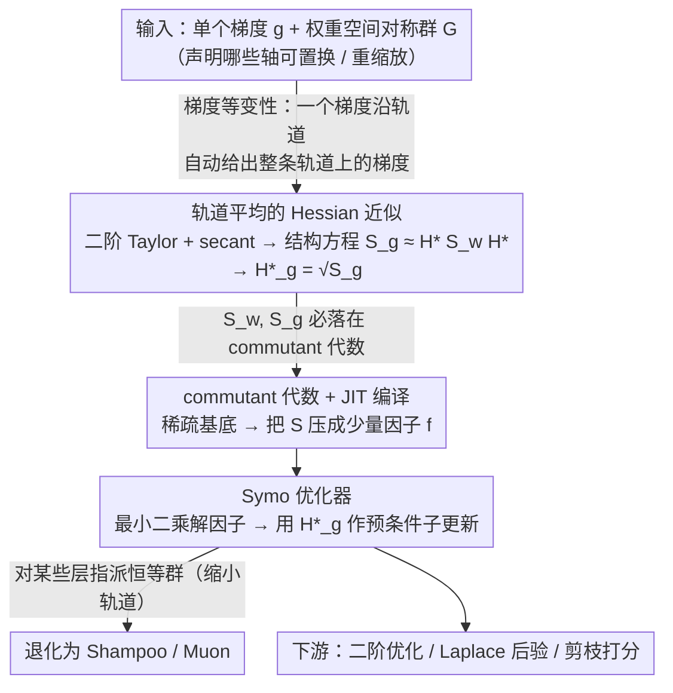

# Exploiting Weight-Space Symmetries for Approximating Curvature

**会议**: ICML 2026  
**arXiv**: [2606.00442](https://arxiv.org/abs/2606.00442)  
**代码**: https://github.com/mtkresearch/symm_opt  
**领域**: 优化 / 二阶优化器 / 几何与代数  
**关键词**: Hessian 近似, 权重空间对称性, 轨道平均, Shampoo, Muon  

## 一句话总结
本文证明只要利用神经网络损失对参数重排/重缩放等"权重空间对称群"的不变性、对单个梯度做轨道平均，就能从一次梯度计算里解析地导出一个高度结构化、可廉价存储与求逆的 Hessian 近似；并且 Shampoo / Muon 恰好对应"对某些层指派恒等群"的特例，从而把这两类经验型优化器纳入统一的对称-曲率框架。

## 研究背景与动机
**领域现状**：从二阶优化（precondition 梯度加速收敛）、贝叶斯深度学习（Laplace 后验）、连续学习（保护重要方向）到剪枝/压缩（用曲率打分），机器学习的很多子领域都把"高效估计损失的（逆）曲率"当作核心组件；工程上主流靠 KFAC、Shampoo、Soap 这类"块对角 + Kronecker 分解"的近似来把存储/求逆控制到可行规模。

**现有痛点**：这些方法之所以"好用"，背后的解释一直是事后拼凑的——有人说 Shampoo 是 Gauss-Newton 的近似，有人说它等价于 spectral descent；但没有一个统一的原理告诉我们：什么结构应该出现在 Hessian 近似里、能省掉多少参数、为什么这样省是合理的。

**核心矛盾**：神经网络的损失对很多权重变换是显式不变的（隐藏层神经元的任意置换、tanh 网络的符号置换、自编码器输入输出同步置换等等），这种"看似显然"的不变性其实在曲率估计里几乎没有被利用过。Kunin (2020)、Ziyin (2023) 证明过临界点的 Hessian 会继承对称性，但没人把这种结构搬到"训练中任意一点的 Hessian 近似"里去。

**本文目标**：从权重空间对称群出发，构造一个仅用单个梯度就能算、能廉价存储/求逆、且能用对称群大小连续调节精度-成本权衡的 Hessian 近似器，并用它把 Shampoo/Muon 解释为框架中的特例。

**切入角度**：损失不变性 $\mathcal{L}(\bm w)=\mathcal{L}(A\bm w)$ 直接蕴含梯度等变性 $\nabla\mathcal{L}(A\bm w)=A\nabla\mathcal{L}(\bm w)$；因此一个梯度沿着群轨道就"自动告诉"了我们整条轨道上的所有梯度，曲率信息天然嵌在轨道里，只需要把它"解析地萃取"出来。

**核心 idea**：用 secant 条件结合二阶 Taylor 展开，在群轨道上做平均得到结构方程 $S_{\bm g}\approx H^\star S_{\bm w}H^\star$，并证明这个解是 commutant 代数里一个低维基底的线性组合，因此可以只存"因子"而不存矩阵。

## 方法详解

### 整体框架
本文要解决的问题是：怎样只用一次梯度计算，就得到一个既准、又能廉价存储和求逆的 Hessian 近似，而不必像 KFAC/Shampoo 那样靠经验去拍 Kronecker 结构。整条逻辑链是「损失对称群 ⇒ 梯度等变性 ⇒ 轨道平均得到结构方程 ⇒ commutant 代数给出稀疏基底 ⇒ 最小二乘求因子 ⇒ 套 secant 条件得到 PSD 近似 ⇒ 换群就退化成 Symo / Shampoo / Muon」，全程用 Schur-Weyl 对偶把「群」和「代数」挂钩。

具体地，设网络参数 $\bm w=[\text{vec}(B);\text{vec}(C);\dots]$，每个张量沿自己的若干轴接受群作用 $\bm v\to(\bigotimes_k A_{i(k)})\bm v$。作者定义一阶轨道平均 $\mathcal{R}_1(\bm v,\mathcal{G})\equiv\mathbb{E}_{\mathcal{G}}[(\bigotimes_k A_{i(k)})\bm v]$ 与二阶轨道平均 $\mathcal{R}_2(\bm v,\bm v',\mathcal{G})\equiv\mathbb{E}_{\mathcal{G}}[(\bigotimes_k A_{i(k)})\bm v{\bm v'}^\top(\bigotimes_k A_{i'(k)})^\top]$；前者收敛到 $\bm w$ 在轨道里的「中心」$\bm w^\star\equiv\mathcal{R}_1(\bm w,\mathcal{G})$，后者落在 commutant 代数里、由一小撮稀疏基张量加权而成。把二阶 Taylor 展开围绕 $\bm w^\star$ 做开、沿整条轨道平均，就把 secant 条件 $\bm g-\bm g^\star\approx H^\star(\bm w-\bm w^\star)$ 升级成结构方程 $S_{\bm g}\approx H^\star S_{\bm w}H^\star$，再解出唯一 PSD 解，或在 $S_{\bm w}\propto I$ 下化简为 $H^\star_{\bm g}=S_{\bm g}^{1/2}$。最后，「群越大轨道越长、但 commutant 维度越低」就是调节精度-成本的那个旋钮。

### 关键设计

**1. 轨道平均的 Hessian 近似 $H^\star_{\bm g}=S_{\bm g}^{1/2}$：从一次梯度解析地萃取曲率**

KFAC 这类方法要专门估计 $A$、$G$ 两个块对角项才能拼出近似曲率，工程繁琐。本文换了个路子：先把 Taylor 展开围绕轨道中心 $\bm w^\star\equiv\mathcal{R}_1(\bm w,\mathcal{G})$ 做开，对所有 $A\in\mathcal{G}$ 写出 $A(\bm g-\bm g^\star)\approx H^\star A(\bm w-\bm w^\star)$，外积再轨道平均就得到结构方程 $S_{\bm g}\approx H^\star S_{\bm w}H^\star$，它的正定解是 $H^\star_{\text{PD}}=S_{\bm w}^{-1/2}(S_{\bm w}^{1/2}S_{\bm g}S_{\bm w}^{1/2})^{1/2}S_{\bm w}^{-1/2}$。实际中 $S_{\bm w}$ 常常秩亏、求逆会被污染，作者经验上发现按 $S_{\bm w}\approx cI$ 简化几乎不掉精度、还只需估计 $S_{\bm g}$，于是主推 $H^\star_{\bm g}=S_{\bm g}^{1/2}$。之所以有效，是因为损失不变性 $\mathcal{L}(\bm w)=\mathcal{L}(A\bm w)$ 蕴含梯度等变性，一个梯度沿轨道就「自动告诉」了整条轨道上的所有梯度，曲率天然嵌在轨道里。Lemma C.1 给出 secant 误差被 $\tfrac{M}{2}\|\bm w-\bm w^\star\|^2$ bound 住，且 $\|\bm w-\bm w^\star\|$ 随群增大单调增加——这就是「群越大、轨道越长、近似越粗」的解析依据，等于把「曲率估计的精度-成本」这个工程问题，重写成了「如何选对称群」这个能被定理分析的代数问题。

**2. commutant 代数 + JIT 编译给出 $S_{\bm v\bm v'}$ 的稀疏分解：把要估的东西压到几个因子**

结构方程里的 $S_{\bm w}$、$S_{\bm g}$ 若按稠密矩阵存就退回到 $O(P^2)$，谈不上廉价。关键观察是 Lemma 3.1：$AS_{\bm v\bm v'}A^\top=S_{\bm v\bm v'}$ 对所有 $A\in\mathcal{G}$ 成立，所以 $S_{\bm v\bm v'}$ 必须落在该群的 commutant 代数里，而这个代数有一组天然的稀疏基（identity 张量与全 1 张量的 Kronecker 积，图示见 Sec. D.5）。于是 $S$ 被写成极少几个稀疏二值张量的线性组合，真正要从数据估计的只剩组合系数——因子 $f$。举例 toy MLP 的 $S_{\bm{cc}}$：朴素置换群下解是 $S_{mnop}=\delta_{mo}f^{(1)}_{np}+\bm{1}_{mo}f^{(2)}_{np}$（共 32 个因子）；换成 tanh 网络的符号置换群，基底坍缩成单项 $\delta_{mo}$，因子从 32 降到 16；再叠加自编码器输入-输出同步置换，因子降到 4。论文配套的 JIT 编译器把用户用符号写的对称声明自动翻成 PyTorch 计算图，意味着「哪种 Kronecker 结构合理」这个原本靠经验拍脑袋的问题，被换成「对称群决定 commutant 代数维数」这个有定理保证、可枚举的问题。

**3. Symo 优化器及其向 Shampoo / Muon 的退化：给两个经验优化器一个统一推导**

有了结构化曲率，就能用 $H^\star_{\bm g}$ 作预条件子构造 Symo 更新 $\bm w_{t+1}=\bm w_t-\eta (H^\star_{\bm g})^{-1}\bm g_t$。因子怎么求？Lemma 3.2 给最小二乘解 $\bm f^\star=\arg\min_{\bm f}\|S(\bm f)-\bm v{\bm v'}^\top\|_F^2$；以 $S_{mnop}=\delta_{mo}f_{np}$ 为例，最优解恰好是 $\mathcal{R}_2(\bm g,\bm g,\mathcal{G})=GG^\top\otimes I$。Lemma 3.3 再进一步：若某参数块的曲率取 $I\otimes F$ 或 $F\otimes I$ 形式，Symo 更新就化简为 $\sqrt{n}G(G^\top G)^{-1/2}$ 或 $\sqrt{m}(GG^\top)^{-1/2}G$，正是 whitened Shampoo / Muon——而要触发这个退化，只需「为某些层指派恒等群」（MLP 偶数层、Transformer 中走 embedding 维的所有层就是天然候选）。这给了 Shampoo / Muon 第三种解释：它们既不是「Gauss-Newton 近似」也不是「polar decomposition 等价」，而是在部分层主动放弃了可利用的对称、换取计算便宜，于是落在精度-成本的甜蜜点上。反过来也提示：Symo 框架里「还有更细的群」可挖，对应「比 Shampoo 更准、比块对角 KFAC 更便宜」的中间产品。

### 损失函数 / 训练策略
没有额外训练目标，本文只是把 Hessian 近似插进现有二阶预条件器；实验里用 Symo 跑 MLP / Transformer 的二阶优化、以及在一个小型语言模型上做对照。

## 实验关键数据

### Hessian 近似精度（secant 余弦相似度）
实验衡量在训练轨迹的不同点处，$\hat H(\bm w'-\bm w)$ 与真实差 $\bm g'-\bm g$ 的余弦相似度（理想为 1）；既测随机方向也测负梯度方向。论文配套 Fig. 4 报告"$H^\star_{\bm g}(\text{BD})$ 在梯度方向上与 Shampoo 完全重合"——这正是 Lemma 3.3 的实验对应物。

| 近似器 | 解析形式 | 存储/求逆量级 | 随机方向余弦 | 梯度方向余弦 |
|--------|----------|---------------|--------------|--------------|
| 真实 Hessian $H$ | $\nabla^2\mathcal{L}(\bm w)$ | $O(P^2)$ | 1.0（参考） | 1.0（参考） |
| 中心化 Hessian $H^\star$ | $\nabla^2\mathcal{L}(\bm w^\star)$ | $O(P^2)$ | 与 $H$ 接近 | 与 $H$ 接近 |
| $H^\star_{\text{PD}}$ (Eq. 10) | PSD 解 $S_{\bm w}^{-1/2}(S_{\bm w}^{1/2}S_{\bm g}S_{\bm w}^{1/2})^{1/2}S_{\bm w}^{-1/2}$ | $O$(因子数) | 与 $H^\star_{\bm g}$ 同档 | 优于 BD |
| $H^\star_{\bm g}$ (Eq. 11) | $S_{\bm g}^{1/2}$ | $O$(因子数) | 强 | 强 |
| $H^\star_{\bm g}(\text{BD})$ | 块对角版 | $O$(块和) | 中等 | 与 Shampoo 完全重合 |
| Shampoo | $L^{1/4}_t G_t R^{1/4}_t$ | $O(n^2+m^2)$ per block | 中等 | 与 $H^\star_{\bm g}(\text{BD})$ 完全重合 |

### 群大小与因子数对比（toy MLP $C\in\mathbb{R}^{3\times 4}$ 的 $S_{\bm{cc}}$）
作者用同一个玩具网络在不同对称群下的 commutant 维数演示了"群越大、因子越少"的核心权衡。

| 网络结构 / 对称群 | $S_{\bm{cc}}$ 解析形式 | 基底项数 | 因子总数 |
|------------------|------------------------|-----------|-----------|
| ReLU MLP，隐层置换群 $\mathcal{G}_1$ | $S_{mnop}=\delta_{mo}f^{(1)}_{np}+\bm{1}_{mo}f^{(2)}_{np}$ | 2 | 32 |
| tanh MLP，隐层符号置换群 | $S_{mnop}=\delta_{mo}f_{np}$（单项） | 1 | 16 |
| MLP 用作自编码器，输入-输出同步置换 + 隐层置换 | $\mathbb{E}_{A_1,A_2}[(A_1\otimes A_2)\bm c\bm c^\top(A_1\otimes A_2)^\top]$ | 多基稀疏 | 4 |

### 关键发现
- "群大小↔因子数"的换挡是连续可调的：从 32 → 16 → 4 的对称增强对应明确的存储下降，但 Lemma C.1 同时告诉我们 $\|\bm w-\bm w^\star\|$ 也单调增加，意味着近似在变粗，给工程上"按算力预算挑群"提供了原理性指导。
- 在 secant 余弦实验中，块对角版 $H^\star_{\bm g}(\text{BD})$ 与 Shampoo 在梯度方向上完全重合（与 Lemma 3.3 一致），说明 Shampoo / Muon 之所以在实践中能 work，是因为它们正好踩在"在不破坏对称结构前提下，把部分层指派恒等群"这个甜蜜点上。
- $H^\star_{\bm g}$ 比 $H^\star_{\text{PD}}$ 更便宜也几乎同精度：作者经验上发现 $S_{\bm w}$ 常常秩亏，按 $S_{\bm w}\approx cI$ 简化反而避免了求逆时的数值病；这是从理论的"完整版"过渡到工程的"实用版"时最关键的工程经验。
- Transformer 例子的 $\mathcal{R}_2(\bm g,\bm g,\mathcal{G})$ 在归一化后呈现出"每个块仅由少量颜色构成"的视觉模式（论文 Fig. 3），这一图像非常直接地证实了"轨道平均后曲率矩阵仍然保留大量结构、可以用少量因子刻画"这一论文核心论断。

## 亮点与洞察
- 把 Hessian 近似的工程问题"几何化"：选哪个 Kronecker 结构、为什么这样选，原本是各家优化器各凭直觉的事，本文把它升级成"选哪个对称群"——后者有 Schur-Weyl 对偶和 commutant 代数加持，理论上可以原理性地枚举可行结构，并按因子数预算挑选。
- 对 Shampoo / Muon 的"对称视角解释"很有冲击力：它们不是"近似 Gauss-Newton"或"等价于 polar decomposition"两种说法的折中，而是因为在某些层主动放弃了可利用的对称（指派恒等群），所以在精度-成本上落在了一个甜蜜点。这暗示我们：还有更细的群可挖，对应"比 Shampoo 更准、比块对角 KFAC 更便宜"的中间产品。
- 把 commutant 代数的稀疏基用 JIT 编译器自动落到 PyTorch 上是一个工程层面的巧思，意味着任意网络只要写得出符号化的对称声明，就能立刻拿到对应的 Hessian 近似实现，几乎零工程成本。
- 用同一套理论同时给出"PSD 完整解 $H^\star_{\text{PD}}$"和"实用简化 $H^\star_{\bm g}$"，让读者能看清"理论上的优雅解"和"工程上真正用的解"之间的取舍，是一种典型的"理论-工程双轨"写作范式，值得借鉴。

## 局限与展望
- 框架强假设"损失对作用群完全不变"，而真实网络（带偏置、residual、LayerNorm、attention scale 等组合）的对称群往往只是近似成立或被破坏；论文给出的 Transformer 例子默认通过 residual 让 embedding 维等同一性群，但这一断言对深层 / 复杂结构是否仍稳健没有充分实验验证。
- 对 $S_{\bm w}\propto I$ 的简化主要靠经验观察撑住，作者承认 $S_{\bm w}$ 经常秩亏；何时 $H^\star_{\bm g}$ 失效、与 $H^\star_{\text{PD}}$ 之间的差距能多大，论文没有给定量上界。
- 实验规模虽然涉及小语言模型，但与现代万亿参数模型的真实优化场景仍有差距；Symo 与 Shampoo / Muon 在大模型上的端到端时间、显存峰值、收敛曲线缺少全面对比。
- "Hessian 来自单梯度"的设定回避了批量噪声问题——真实训练里 $\bm g$ 本身是小批量近似，因此 $S_{\bm g}$ 也带噪声；这部分噪声如何与对称结构相互作用、是否会污染因子估计的最小二乘解，尚未被分析。
- 论文展示了用于二阶优化的应用，但在 Laplace 近似、连续学习、剪枝打分等其他需要曲率的下游任务上仅停留在前景描述，缺少实证；这些任务对 $H^\star_{\bm g}$ vs $H^\star_{\text{PD}}$ 的偏好可能与优化任务相反，需要单独验证。

## 相关工作与启发
- **vs Bernacchia (2025)**：那项工作用"对随机初始化的网络集合做平均"得到一种"全局曲率"，结构上与本文得到的轨道平均很像；但它的近似与初始化分布耦合，本文则在"单一模型、任意训练点"上推导，理论解耦更彻底，并把对象从 MLP 扩展到 Transformer。
- **vs (E)KFAC / Shampoo / Soap**：这些方法在工程上预先固定"块对角 + Kronecker"结构，再去估各块的统计量；本文反过来从"哪些群让损失不变"出发，自动给出 commutant 代数下的所有合法结构，把"经验设计"变成"代数枚举"。
- **vs Morwani 等的 Gauss-Newton 解释 / Bernstein-Newhouse 等的 spectral descent 解释**：前两种解释把 Shampoo 当作另一个已有方法的近似，本文给出第三种解释——Shampoo 是"特定对称群选择"下的精确解，而不是任何近似；这个视角更原理性，且暗示了可挖的扩展空间（用更细的群得到更准的近似）。
- **vs Kunin (2020) / Ziyin (2023) 的对称-Hessian 结构定理**：这两项工作只在"对称临界点"上证明 Hessian 继承对称性，本文把同样的结构扩展到"训练过程中任意一点的 Hessian 近似"，并用 secant 条件给出可计算实现，迈出了从"存在性结论"到"算法工具"的一步。
- **vs L-BFGS / 经典 quasi-Newton**：经典 quasi-Newton 通过维护历史 $\{(\bm s_k,\bm y_k)\}$ 做低秩更新逼近 Hessian，需要多次梯度才能取得有用秩；本文只用一次梯度配合对称群轨道就能解析出结构化曲率近似，因此更适合大模型的在线优化场景。
- **vs SGD-with-momentum**：标准 SGD 完全不利用对称结构，只是沿着原始梯度方向走；本文从对称群直接导出了一种"廉价的二阶预条件子"，本质上是在不显式估计 Hessian 的前提下，用代数手段把对称结构换成预条件矩阵。

<!-- RELATED:START -->

## 相关论文

- [\[CVPR 2025\] Tripartite Weight-Space Ensemble for Few-Shot Class-Incremental Learning](../../CVPR2025/model_compression/tripartite_weight-space_ensemble_for_few-shot_class-incremental_learning.md)
- [\[ICML 2026\] Partial Fusion of Neural Networks: Efficient Tradeoffs Between Ensembles and Weight Aggregation](partial_fusion_of_neural_networks_efficient_tradeoffs_between_ensembles_and_weig.md)
- [\[ICML 2026\] Event2Vec: Processing Neuromorphic Events Directly by Representations in Vector Space](event2vec_processing_neuromorphic_events_directly_by_representations_in_vector_s.md)
- [\[NeurIPS 2025\] On the Hardness of Approximating Distributions with Tractable Probabilistic Models](../../NeurIPS2025/model_compression/on_the_hardness_of_approximating_distributions_with_tractable_probabilistic_mode.md)
- [\[ICLR 2026\] Revisiting Weight Regularization for Low-Rank Continual Learning](../../ICLR2026/model_compression/revisiting_weight_regularization_for_low-rank_continual_learning.md)

<!-- RELATED:END -->
