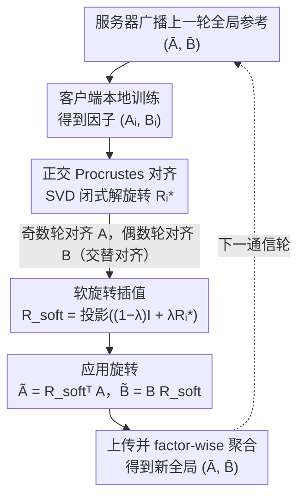

# FedRot-LoRA: Mitigating Rotational Misalignment in Federated LoRA

**会议**: ICML 2026  
**arXiv**: [2602.23638](https://arxiv.org/abs/2602.23638)  
**代码**: https://github.com/haoran-zh/FedRot-LoRA (有)  
**领域**: 联邦学习 / 参数高效微调 / LoRA  
**关键词**: 联邦学习, LoRA, Procrustes 对齐, 旋转不变性, 子空间对齐

## 一句话总结
本文指出联邦 LoRA 中朴素 factor-wise 平均的真正"敌人"是旋转不变性导致的潜在子空间错位，提出在客户端用正交 Procrustes 求解出旋转矩阵 $R_i^t$ 对齐 $A,B$ 因子后再聚合，理论与实验都证明能显著降低聚合误差且不增加通信开销。

## 研究背景与动机

**领域现状**：LoRA 把权重更新表示为 $\Delta W = BA$，$B\in\mathbb{R}^{d\times r}, A\in\mathbb{R}^{r\times d}$，参数量大幅下降，是 LLM 联邦微调最自然的载体 (FedIT、FFA-LoRA、FlexLoRA 等都基于此)。

**现有痛点**：理想聚合应该是 $\Delta W_{ideal}=\tfrac1N\sum B_i A_i$，但这个 rank 一般 $>r$，没法继续保持低秩；退而求其次的 factor-wise 平均 $\Delta W_{naive}=\bar B \bar A$ 又会引入交叉项 $B_i A_j$，造成训练不稳定。已有解法走三条路：参数冻结 (FFA-LoRA、RoLoRA) 损失表达力；SVD 投影 (FlexLoRA) 计算昂贵；高通信传残差 (FedEx-LoRA) 违背 LoRA 初衷。

**核心矛盾**：现有分析只看到"算子不可交换"的代数原因，忽视了 LoRA 因子分解本身的**旋转不变性**——对任意正交 $R\in\mathbb{R}^{r\times r}$，$(B_i R)(R^\top A_i)=B_i A_i$。这意味着语义等价的更新会被表示在不同的潜在子空间里，朴素平均时这些错位子空间相互"破坏性干涉"，比代数项造成的误差更大。

**本文目标**：在不增加通信、不冻参数、不做高维 SVD 的前提下，把"旋转误差"这一被低估的因素显式消掉。

**切入角度**：既然旋转 $R$ 不改变语义，那就主动选一个让所有客户端因子对齐到共同参考的 $R_i^t$；这个 $R$ 在正交群上有 $r(r-1)/2$ 自由度，刚好能对齐子空间，又能用 Procrustes 闭式解高效求得。

**核心 idea**：用前一轮全局 $\bar A^{t-1}/\bar B^{t-1}$ 当 reference，每个客户端解一个 Procrustes 问题得到旋转 $R_i^t$，再交替地对齐 $A$ 或 $B$，最后插值出"软旋转"避免早期 reference 噪声过大。

## 方法详解

### 整体框架
FedRot-LoRA 想解决的是"语义等价但表示在不同子空间里的 LoRA 因子被朴素平均时相互干涉"这件事，做法是在客户端上传前插一道"旋转对齐"工序。每个通信轮 $t$ 这样转：服务器把上一轮的全局因子 $(\bar A^{t-1}, \bar B^{t-1})$ 当参考广播下去，客户端本地训练得到 $(A_i^t, B_i^t)$，然后解一个 Procrustes 问题求出最优旋转 $R_i^{t,*}$ 把自己的子空间转到参考所在的方向（奇数轮对齐 $A$、偶数轮对齐 $B$），再用系数 $\lambda$ 在恒等矩阵和 $R_i^{t,*}$ 之间插值出"软旋转" $R_{i,\text{soft}}^t$，最后把对齐后的 $\tilde A_i^t=(R_{i,\text{soft}}^t)^\top A_i^t,\;\tilde B_i^t=B_i^t R_{i,\text{soft}}^t$ 上传聚合。整套流程不冻参数、不传残差、不做高维 SVD，只在 $r\times r$ 上多解一次旋转。

### 关键设计

**1. 正交 Procrustes 对齐：用闭式解的旋转矩阵消掉因式分解的旋转歧义**

前面说的根因是 $(B_iR)(R^\top A_i)=B_iA_i$ 这个旋转不变性让语义相同的更新落在不同子空间，朴素平均时就破坏性干涉。FedRot-LoRA 的对策是主动给每个客户端找一个旋转，把它的因子转到全局参考所在的子空间。奇数轮解 $\min_{R}\|R^\top A_i^t - A_{ref}\|_F^2,\;\text{s.t.}\;R^\top R=I,\det R>0$，这正是经典的正交 Procrustes 问题：对相关矩阵 $M=A_{ref}(A_i^t)^\top$ 做 SVD $M=U\Sigma V^\top$，就能闭式写出 $R_i^{t,*}=V\cdot\text{diag}(1,\dots,1,\det(UV^\top))\cdot U^\top$；偶数轮改成对齐 $B$，相关矩阵换成 $M=(B_{ref})^\top B_i^t$。之所以限定在正交群上，是因为作者证明 (Theorem 4.1) 标量缩放只有 1 个自由度、根本消不掉子空间错位，而完全不约束的可逆矩阵又会 ill-conditioned；正交矩阵恰好在两者之间——有 $r(r-1)/2$ 个自由度足够灵活对齐子空间，又始终保持良态。计算上它只需 $\mathcal{O}(dr^2+r^3)$，远比 FlexLoRA 在全参数空间做 $\mathcal{O}(d^3)$ SVD 便宜，也不增加任何通信量。

**2. 交替对齐 $A$ 与 $B$：让两个因子轮流被校准，避免一侧漂移**

如果每轮都只对齐同一个因子，另一侧会不受控地漂移。FedRot-LoRA 改成奇数轮把 $A$ 的语义钉到 $A_{ref}$、让 $B$ 跟随补偿，偶数轮反过来——每轮仍只解一次 SVD，但从全局看两个因子是轮流被"校准"的。这个交替很关键：消融显示只对齐 $B$ 时性能掉得很多（SST-2 上 0.879 对 0.954），原因是 $B$ 初始化范数小、早期对齐信号太弱；交替保证两个子空间都被定期校准、互相约束，避免单边对齐时另一边失控。

**3. 软旋转插值：early-stage 参考噪声大时不要硬拉**

训练早期全局模型还没收敛，参考本身就带很多噪声，这时直接套用硬 Procrustes 旋转容易做出剧烈的过度修正、破坏客户端的个性化收敛轨迹。FedRot-LoRA 的做法是先构造 $R'=(1-\lambda)I+\lambda R_i^{t,*}$、再投影回正交群得到 $R_{i,\text{soft}}^t$：$\lambda=0$ 退化成原始 FedIT、$\lambda=1$ 才是硬 Procrustes，中间则是按强度插值的"软对齐"。Lemma A.1 证明 $\|R_{\text{soft}}-I\|_F\le 2\lambda\|R-I\|_F$，也就是修正幅度被 $\lambda$ 线性 bound 住，相当于给"早期保守、后期自信"的对齐节奏一个可调的旋钮。实验里 $\lambda\in[0.2,0.8]$ 都比硬对齐好，最优常落在 0.4–0.6。

### 损失函数 / 训练策略
保留标准 FedIT 训练流程，仅在客户端上传前插入上面那道旋转步骤。论文配了非凸下的收敛分析 (Theorem 4.4)，把误差分解为初始 gap + 累积聚合误差 $\|E^t\|_F^2$ + $\mathcal{O}(\eta)$；Theorem 4.8 进一步证明对齐后的误差上界比 naive 严格更紧，紧性 gain 为 $\Gamma(\lambda)=(c_0-\tfrac{4\sqrt\tau\kappa\eta G_B}{\delta_A})\lambda - 4\kappa^2\lambda^2\tau$，由它的正区间反推出 $\lambda$ 的可行范围。

## 实验关键数据

### 主实验
在 RoBERTa-Large 上跑 GLUE 五任务，rank=4，三个客户端规模 $N\in\{3,10,50\}$。

| 任务/规模 | FedIT | FFA-LoRA | RoLoRA | FedRot-LoRA |
|--------|------|------|------|------|
| MNLI ($N=3$) | 0.866 | 0.862 | 0.868 | **0.876** |
| RTE ($N=3$) | 0.840 | 0.830 | 0.854 | **0.868** |
| GLUE Avg ($N=50$) | 0.768 | 0.772 | 0.824 | **0.873** |
| GSM8K (Llama 3-8B) | 0.429 | 0.436 | 0.344 | **0.444** |
| HumanEval pass@1 | 0.288 | 0.385 | 0.295 | **0.409** |

聚合误差降低尤其显著：MNLI 上 FedIT 误差 $3.98\times10^{-3}$，FedRot-LoRA 只有 $1.48\times10^{-4}$，整整一个数量级。

### 消融实验

| 配置 | MNLI Acc |
|------|---------|
| 不对齐 (FedIT) | 0.866 |
| 随机旋转 | 0.318 |
| 标量缩放对齐 | 0.865 |
| 只对齐 $A$ | 0.861 |
| 只对齐 $B$ | 0.862 |
| 交替 $A/B$ (Full) | **0.876** |
| reference = $W^{t-2}$ | 0.866 |
| reference = $W^{t-1}$ (默认) | **0.876** |

### 关键发现
- 标量缩放 (一维旋转) 在高维 LoRA 中几乎无效——证明 rank>1 时必须做子空间级 (正交) 对齐而不是范数调整。
- 随机旋转把性能砸到 0.318，说明对齐"方向有意义"才有效；这反过来排除了"FedRot-LoRA 的提升只是因为引入额外随机性"这种 trivial 解释。
- 越异质 (Dirichlet $h=0.5$、client 数 $N=50$) 优势越大；近 IID ($h=100$) 时 baseline 也都不错，FedRot-LoRA 仍能稳定领先 1-2 个点。

## 亮点与洞察
- **把"代数 trick 当作根因"翻成"几何 invariance 当作根因"**：之前的解法都在补救 $(B_i-B_j)(A_i-A_j)$ 这个代数项，本文指出真正的破坏者是潜在子空间的相对旋转，这种 reframe 让解法从"冻结/投影"变成"对齐"，思想转变非常优雅。
- **Procrustes 是 LoRA 联邦聚合的完美匹配工具**——闭式解、$\mathcal{O}(r^3)$ 复杂度、保正交、保语义、不增加通信，几乎所有 desiderata 一次满足。
- **软旋转 $\lambda$ 这个细节非常重要**：硬对齐在某些 setting 反而掉点，作者用 $\lambda\in[0,1]$ 插值控制对齐强度，是把理论上的"最优正交矩阵"工程化的关键。这种"训练初期保守、后期自信"的思路可以迁移到其他 federated/distributed scheme。

## 局限与展望
- 论文假设 reference 用前一轮全局模型，"如果客户端被选中频率不均"或"通信丢包"情况下 $W^{t-1}$ 可能严重过时，作者也实验了 $W^{t-2}$ 会掉点。
- $\lambda$ 是超参数，论文给的可行区间依赖 $c_0,\delta_A,\kappa,\tau$ 等难以估计的常数，实际只能 grid search。
- 没有验证 rank>24 或 $N>50$ 的极端规模——超大 rank 时 SVD 的 $\mathcal{O}(r^3)$ 会逐渐显著。
- 没和 FedSA-LoRA、FedEx-LoRA 在生成任务上直接对比，附录 Table 7 也只是综述性比较。

## 相关工作与启发
- **vs FedIT**: FedIT 是 baseline，直接 factor-wise 平均；本文加旋转对齐让聚合误差降一个数量级，几乎所有任务都涨点。
- **vs FFA-LoRA/RoLoRA**: 它们通过冻结一个因子实现线性聚合，本质上是"绕过"旋转歧义；本文是"主动解决"，参数空间不被砍。结果上 FedRot-LoRA 在 N=50 时领先 RoLoRA 5 个点。
- **vs FlexLoRA**: FlexLoRA 在 full-parameter 空间聚合然后 SVD 投影回低秩，代价是 $\mathcal{O}(d^3)$ SVD 且数值不稳定；本文 SVD 只在 $r\times r$ 上做，便宜得多。
- **启发**：任何低秩/分解类的分布式学习 (如 federated PCA、federated matrix factorization、federated diffusion adapter) 都可能有同款"分解不变性导致破坏性干涉"的问题，正交 Procrustes 都是值得首试的工具。

## 评分
- 新颖性: ⭐⭐⭐⭐⭐ "旋转不变性是真正根因"这一观察很犀利，把已有零散尝试统一在一个清晰几何框架下。
- 实验充分度: ⭐⭐⭐⭐⭐ GLUE 五任务 × 三规模 × 五 rank + GSM8K + HumanEval + 多种消融 + 标量缩放/随机旋转对照，覆盖很全。
- 写作质量: ⭐⭐⭐⭐⭐ Figure 1-2 把动机讲得非常直观，理论部分 Theorem 4.4 + 4.8 配以 Corollary 4.9 给出 $\lambda$ 可行域，结构清晰。
- 价值: ⭐⭐⭐⭐ 直接可用于现有联邦 LoRA 框架，只需替换聚合步骤；对工业部署很友好。

<!-- RELATED:START -->

## 相关论文

- [\[NeurIPS 2025\] Robust Federated Finetuning of LLMs via Alternating Optimization of LoRA](../../NeurIPS2025/model_compression/robust_federated_finetuning_of_llms_via_alternating_optimization_of_lora.md)
- [\[ICML 2026\] Geo-Expert: 用 LoRA 把 8B 模型微调成专家级地质推理 LLM](geo-expert_towards_expert-level_geological_reasoning_via_parameter-efficient_fin.md)
- [\[ACL 2025\] FedEx-LoRA: Exact Aggregation for Federated and Efficient Fine-Tuning of Large Language Models](../../ACL2025/model_compression/fedex_lora_federated_exact_aggregation.md)
- [\[ICML 2026\] Task-Driven Subspace Decomposition for Knowledge Sharing and Isolation in LoRA-based Continual Learning](task-driven_subspace_decomposition_for_knowledge_sharing_and_isolation_in_lora-b.md)
- [\[ICML 2026\] FedSDR: Federated Self-Distillation with Rectification](fedsdr_federated_self-distillation_with_rectification.md)

<!-- RELATED:END -->
