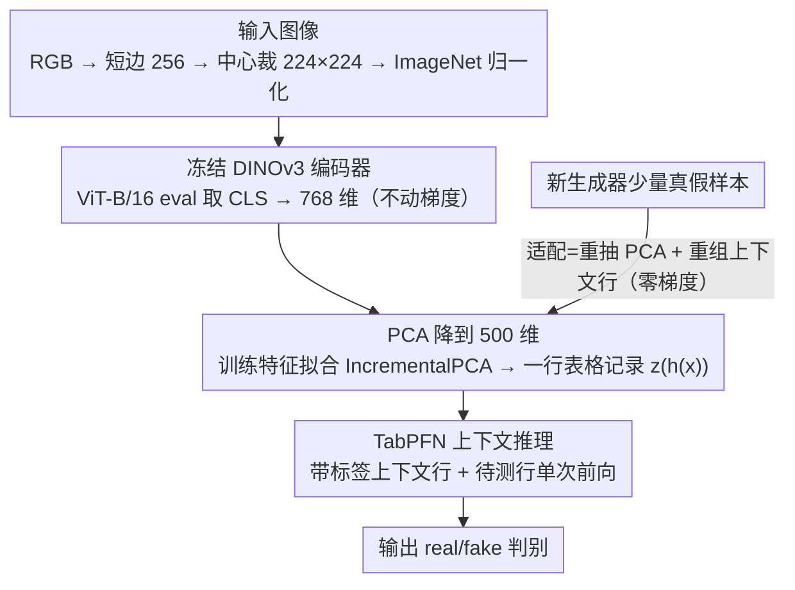

# Images as Tables: In-Context Learning with TabPFN for Low-Data Detection of AI-Generated Images

**会议**: ICML 2026  
**arXiv**: [2606.00872](https://arxiv.org/abs/2606.00872)  
**代码**: https://github.com/jpwalter30/Towards-Generalizable-Detection-of-AI-Generated-Images  
**领域**: AI 生成图像检测 / 表格基础模型 / 上下文学习  
**关键词**: AIGC 检测, TabPFN, DINOv3, 上下文学习, 跨生成器迁移  

## 一句话总结
作者把 AI 生成图像检测改写成"先用冻结的 DINOv3 把每张图压成 768 维 CLS 向量、再 PCA 降到 500 维当作一行表格、最后扔给 TabPFN 做上下文推断"的三段式流水线，从而把"换一个新生成器要重训分类头"变成"只换 TabPFN 上下文样本"，在 GenImage 低数据与跨生成器场景下相比强基线 LATTE 最高领先 8.2%，在 64 对生成器迁移里 54 对胜出。

## 研究背景与动机

**领域现状**：AI 生成图像检测被反复证明是一个"移动目标"问题：检测器在某个生成器（GAN 或 Diffusion）上训得很好，一旦换上新的 Midjourney、Stable Diffusion、wukong 等版本就会失效。当前主流方案仍然是图像域分类器——基于 CNN/ViT 主干训一个 real/fake 头，或者利用扩散去噪轨迹（LATTE）、CLIP 表征（Cozzolino 等）做专用检测，再用频域/指纹特征加 buff。这些方法在大数据 i.i.d 场景下表现强，跨生成器评估也已经成为标配。

**现有痛点**：(i) 适配新生成器仍需"换头/重训"，要么从头训分类器，要么在新数据上微调主干，对运维不友好；(ii) 在真实取证场景里能拿到的新生成器标签往往只有几十到几百条，远远低于训练 ViT 分类头所需的规模；(iii) 几乎所有现有检测器把"表征学习"与"判别学习"耦合在一起，新数据一来就动整套网络，既慢又容易过拟合到生成器特异指纹。

**核心矛盾**：检测能力主要来源于强视觉表征，而适配速度主要受限于判别头的训练范式；把两者绑死意味着每次只换一点点新标签都要把一整套深度模型走一遍梯度。

**本文目标**：(1) 把"图像 → 表格 → 上下文推理"作为 AIGC 检测的一种新范式跑通；(2) 在 GenImage 上系统对比四类生成器评估协议下的低数据/跨生成器表现；(3) 与当前 SOTA 扩散检测器 LATTE 正面对照，说明 TabPFN-上下文 vs 图像分类头之间在不同数据规模下的权衡边界。

**切入角度**：作者注意到 TabPFN 这种"先验数据拟合网络"在小表格分类上可以不训练、只靠上下文样本完成贝叶斯式推断；如果把每张图压成一行结构化特征，AIGC 检测就退化为标准的小数据表格分类问题，TabPFN 的低数据优势正好对得上"取证场景标签少"这条硬约束。

**核心 idea**：冻住 DINOv3 ViT-B/16 当视觉编码器，PCA 把 768 维 CLS 压到 500 维（恰好匹配本版 TabPFN 的 500 维特征上限），再让 TabPFN 用一组带标签的"上下文行"对每张测试图做 in-context 二分类——适配新生成器只需更新上下文里的少量带标签样本，编码器与分类器都不动。

## 方法详解

### 整体框架
DINOv3-PCA-TabPFN 想解决的是"换一个新生成器就要重训分类头"的痛点，办法是把检测拆成三段几乎零训练的转换链：先用冻结的视觉模型把每张图压成一个向量，再用 PCA 把它降成一行 500 维的"表格记录"，最后让通用表格基础模型 TabPFN 在不做梯度更新的情况下判 real/fake。换句话说，一张图被变成一行带标签的表格行，AIGC 检测就退化成了标准的小数据表格分类。

具体地，图像统一以 RGB 加载、短边缩到 256 像素再中心裁到 $224\times 224$、按 ImageNet 统计归一化后，喂给 eval 模式下的 DINOv3 ViT-B/16，取 CLS token 得到一个 $N\times 768$ 的特征矩阵（主干全程不动梯度）；接着在训练集特征上拟合 Incremental PCA，把 768 维压到结构化行 $z(h(x))\in\mathbb{R}^{500}$，测试集套用同一组主成分；最后把降维后的训练行（含 0/1 标签）和待测行一起塞进 TabPFN，由其先验数据拟合网络单次前向输出预测——本版 TabPFN 限制最多 10,000 行、500 维。整条 pipeline 的精髓不在哪个模块本身有多新，而在于它把"适配 = 换上下文行"彻底落地：遇到新生成器，只需在它的少量真假样本上重抽 PCA 系数、再把这些行塞进 TabPFN 的上下文集合，编码器和判别器都不必再走一遍梯度。

### 关键设计

**1. 冻结 DINOv3 当通用视觉编码器：把"表征学习"和"判别学习"彻底解耦**

取证文献早就发现，端到端训练的分类头特别容易过拟合到某个生成器的指纹，换生成器就失效。作者的应对是把表征这一侧完全交给自监督预训练——直接拿 DINOv3 ViT-B/16 的 CLS token 当全图表示，主干始终 eval、从不做任何 real/fake 微调，于是过拟合的风险被整体挪到了 TabPFN 那一侧的上下文里。这样即便新生成器与训练分布差异巨大，编码器输出的语义/纹理表征依然成立，只需用上下文样本告诉 TabPFN 新分布的判别边界即可。论文用消融验证了这个编码器的不可替代性：把 DINOv3 换成 DINOv2、或换成 DCT/FFT 频域手工特征，准确率/精度/召回/F1/AUC 五项都更弱，说明强语义自监督表征确实比频域指纹更可跨生成器迁移。

**2. PCA 降到 500 维：硬卡住 TabPFN 的输入上限，顺手去掉无关方差**

DINOv3 的 CLS 是 768 维，而本版 TabPFN 的特征上限恰好是 500 维，二者对不上。作者用 IncrementalPCA 在训练集特征上闭式拟合一个投影，把每张图压成 $z(h(x))\in\mathbb{R}^{500}$，再对测试集套用同一组主成分；评估时按四种生成器感知协议（Multi-Multi、Multi-Single、Single-Multi、Single-Single）构造平衡的训练/测试集，PCA 始终只在训练侧拟合以避免信息泄漏。关键在于，作者把"重抽一组 PCA 系数"也算进了"适配新场景"的成本里——这一步比训练分类头快几个数量级，又保证 TabPFN 的输入维度永远合法，使得后续 in-context 推理是"真正一步梯度都不走"的。

**3. TabPFN 上下文推理替代梯度训练判别头：把"训一个新头"换成"换一份上下文表格"**

TabPFN 是 Hollmann 2023 提出的先验数据拟合网络，给定"上下文集合 + 待测行"后用单次前向输出分类后验，本质上近似一次贝叶斯式表格推断，而不是传统意义上的训练。本文正是利用它在小数据上的这一特性：每个生成器只用 $k\in\{25,30,75,150,300,625\}$ 张的极小训练规模当上下文，测试集统一 10,000 张（5,000 真 + 5,000 假，或 5,000 真 + 8×625 假）。在小数据区间，"换上下文 vs 重训一个头"的优势差距是数量级级别的；落地上，添加新生成器从此变成一次轻量的特征提取 + 上下文拼装，整体跑通时间从分钟级降到秒级。

### 损失函数 / 训练策略
本文在视觉侧不做任何训练：DINOv3 与 TabPFN 都是 frozen 模型，PCA 是闭式拟合，所谓"训练"等价于"准备一份新的上下文表格"——这正是范式优势所在。作为对照，LATTE 等基线按各自协议正常训练，并在 $k\in\{150,300,625\}$ 下与本方法做公平对比。

## 实验关键数据

### 主实验
基准为 GenImage（ImageNet 真图 + ADM/BigGAN/GLIDE/Midjourney/SDv1.4/SDv1.5/VQDM/wukong 八个生成器），评估按 Multi-Multi（池化训测）、Multi-Single（池化训单测）、Single-Multi（单训池化测）、Single-Single（成对迁移）四种协议执行；指标以准确率（Accuracy）为主，并辅以精度/召回/F1/AUC。

| 协议 | 训练规模 $k$ | LATTE | DINOv3-PCA-TabPFN | 差值 |
|------|--------------|-------|-------------------|------|
| Multi-Multi 池化低数据 | $k=25$ | — | **78%** | 起步即 78 |
| Multi-Multi 池化中等 | 较小共享 $k$ | 落后 | TabPFN 领先最多 +8.2% | 本文最强区间 |
| Multi-Multi 池化高数据 | $k=625$ | 领先 +7.4% | 落后 | LATTE 在大数据下扳回 |
| Single-Single 成对迁移 | $k=625$ | — | 在 64 对中 54 对胜出 | 最大单对 +31.5% |

### 消融实验
| 配置 | 关键指标 | 说明 |
|------|---------|------|
| Full：DINOv3 + PCA-500 + TabPFN | Multi-Multi 五项指标全面最优 | 完整流水线 |
| 编码器替换为 DINOv2 + TabPFN | 各项指标一致更弱 | 验证 DINOv3 表征的差异化贡献 |
| 编码器替换为 DCT/FFT 频域特征 + TabPFN | 显著拉开差距 | 验证强语义表征比手工频域更可迁移 |
| 判别器替换为 MLP 训 DINOv3 特征 | 大数据下追平、小数据下明显落后 | 验证 TabPFN 在小上下文集时的优势 |
| 低数据 $k=25$（池化） | 78% | TabPFN 起步即 78%，比所有 MLP 训法都高 |

### 关键发现
- 强表征 + 上下文判别的组合优势集中在低数据/跨生成器区间，且 ICA 上 DINOv3 与 TabPFN 都是必要条件——把任何一边换掉（DINOv2 / MLP / 频域）都掉点。
- 在 64 对生成器的 Single-Single 协议下，DINOv3-PCA-TabPFN 在 54 对胜过 LATTE（最大领先 31.5%），但 $k$ 增大后部分跨对迁移精度反而下降，说明 TabPFN 也会随上下文集中而对生成器指纹产生轻微特化。
- 生成器之间难度差异显著：BigGAN/GLIDE 在 PCA 空间真假可分性高，少量上下文就能分；ADM/Midjourney/wukong 的真假分布在 DINOv3 空间高度重叠，需要更多上下文且收益更缓慢。
- LATTE 在 $k=625$ 池化设置下反超 7.4%，主要受限于本版 TabPFN 的 10,000 行硬上限——这意味着"上下文吃满"之后 TabPFN 没有继续提升的余地，与 LATTE 这种可持续训练的检测器在大数据区天然不可比。

## 亮点与洞察
- 把"通用视觉基础模型 + 通用表格基础模型"端到端拼接，提出"图像即表格"的判别范式：一旦图像被转成结构化行，所有针对小数据表格的工具（不仅是 TabPFN）原则上都能直接拿来用，这给 AIGC 检测打开了一类全新工具箱。
- 适配新生成器的代价被压缩到"重抽 PCA + 重组上下文集合"两步，整个 pipeline 不动梯度，把传统"训新分类头"的工程负担降到几乎为零，对真实取证流水线极友好。
- 论文非常清晰地划出了 TabPFN vs LATTE 的优势边界：低数据/跨生成器选 TabPFN，大数据池化场景选 LATTE，并不是简单宣称"全面超越"，给后续工作（如混合检测、随数据规模切换策略）留了可继续做的空间。
- "把模态先 frozen-encode 再接表格基础模型"这一两段式抽象，对取证之外的低数据视觉问题（医学、遥感小样本分类）也有直接可移植性。

## 局限与展望
- TabPFN 当前版本的 10,000 行 × 500 维硬上限决定了上下文集合规模，无法直接吃下大规模 GenImage 池化集合，这是 LATTE 在大数据区间反超的主要外因；新版 TabPFN-2.5 可能让这一边界外移，但需重新验证。
- 整套 pipeline 强依赖 DINOv3 的表征质量；如果未来生成器开始针对 DINOv3 表征做对抗，pipeline 缺乏图像域的额外鲁棒性（如频域防御），需要补充对抗鲁棒性实验。
- 实验局限在 GenImage 的真/伪二分类、未做退化（压缩、模糊、裁剪等）后的鲁棒性评估，作者自陈这是后续工作；同时 PCA 是线性降维，可能丢弃部分非线性可分信号，未来可换用更强的非线性投影。

## 相关工作与启发
- **vs LATTE (2025)**：LATTE 把扩散去噪潜变量轨迹当作判别信号，在大数据池化场景下达到峰值；本文不用任何扩散域专用信号，仅靠通用 DINOv3 + TabPFN 在低数据与跨生成器场景反超，且不需要训分类头。
- **vs CLIP-based 检测 (Cozzolino 2024)**：两者都依赖大型预训练视觉模型的表征，但 CLIP 检测器仍训一个分类头并按 i.i.d 训练，迁移成本高；本文把判别压成上下文推理，把 "训" 完全去掉。
- **vs TabPFN 原生表格用法**：原作 TabPFN 用于小型结构化数据集分类，本文把它迁出原生领域、把 DINOv3 表征当作结构化行，是把表格基础模型当成"通用低数据判别器"的一个具体落地案例，给跨模态结构化推断（如 THz/医学影像）提供了可借鉴样板。
- **vs 频域/指纹类检测 (Yu 2019, Cozzolino 2024)**：GAN/扩散指纹检测严重依赖生成器特异统计，跨生成器极易失效；本文用 DINOv3 自监督表征绕开了指纹依赖，把跨生成器迁移压力主要交给 TabPFN 的上下文集合，实验上 64 对生成器迁移有 54 对胜出。
- **vs 通用 in-context 多模态学习**：TabPFN 原本只处理表格，本文用 PCA 把视觉表征"行化"后送入，验证了"先把模态转成表格、再用通用表格基础模型推理"的工作流，对未来其它结构化输出任务（属性预测、低数据分类、跨域适配）都有可借鉴的工程套路。

<!-- RELATED:START -->

## 相关论文

- [\[CVPR 2026\] Towards Generalizable AI-Generated Image Detection via Image-Adaptive Prompt Learning](../../CVPR2026/model_compression/towards_generalizable_ai-generated_image_detection_via_image-adaptive_prompt_lea.md)
- [\[NeurIPS 2025\] AI-Generated Video Detection via Perceptual Straightening](../../NeurIPS2025/model_compression/ai-generated_video_detection_via_perceptual_straightening.md)
- [\[ICML 2026\] Easier to Judge Than to Find: Predicting In-Context Learning Success for Demonstration Selection](easier_to_judge_than_to_find_predicting_in-context_learning_success_for_demonstr.md)
- [\[ICML 2026\] Energy-Structured Low-Rank Adaptation for Continual Learning](energy-structured_low-rank_adaptation_for_continual_learning.md)
- [\[ECCV 2024\] SpaceJAM: a Lightweight and Regularization-free Method for Fast Joint Alignment of Images](../../ECCV2024/model_compression/spacejam_a_lightweight_and_regularization-free_method_for_fast_joint_alignment_o.md)

<!-- RELATED:END -->
