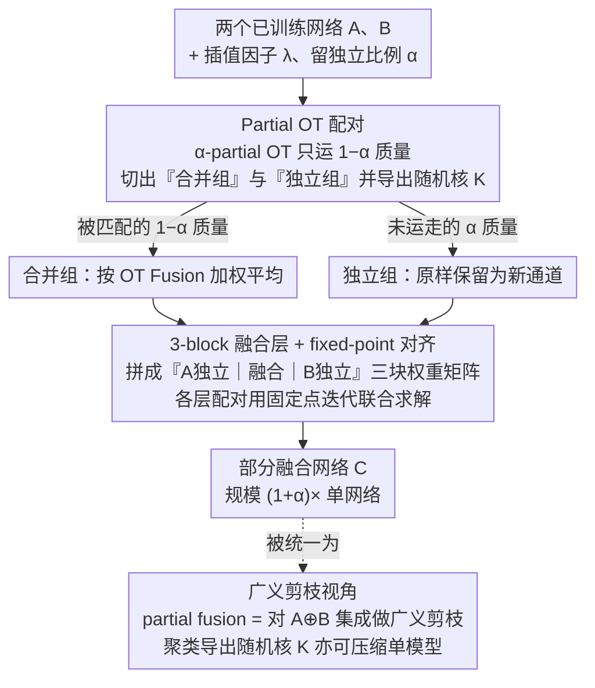

# Partial Fusion of Neural Networks: Efficient Tradeoffs Between Ensembles and Weight Aggregation

**会议**: ICML 2026  
**arXiv**: [2605.22350](https://arxiv.org/abs/2605.22350)  
**代码**: https://github.com/Fabian-Mor/partial_fusion_nn  
**领域**: 模型压缩  
**关键词**: 模型融合, 集成, 部分最优传输, 广义剪枝, 神经元相似性  

## 一句话总结
作者提出 **Partial Fusion**：用部分最优传输 (partial OT) 只合并两个网络中"最相似"的神经元、保留剩余神经元独立存在，从而在"权重聚合 (1× 参数量)"与"全集成 (2× 参数量)"之间得到一条平滑、单调、可调的精度–参数量曲线；并进一步把它统一到"对集成做广义剪枝"的视角，让同一套工具也能压缩单个模型。

## 研究背景与动机

**领域现状**：把多个独立训练的神经网络合二为一，目前主要有两条主流路线。一条是 **ensemble**：把所有模型都保留下来推理时取平均，鲁棒、精度高，但参数量和推理时间随模型数线性增长。另一条是 **weight aggregation / model fusion**：通过排列对齐 (Git Re-Basin、Ainsworth et al. 2023) 或最优传输对齐 (OT Fusion，Singh & Jaggi 2020) 把不同网络的神经元先对齐再做权重平均，得到一个和单网络等大的融合模型。

**现有痛点**：两条路线分别站在曲线的两端，**中间区域是空的**。集成代价高但精度足；融合便宜但精度往往逊于集成，尤其是当两个网络训练在异构数据切片上、神经元功能差异较大时，强行把所有神经元配对会把"功能并不重叠的神经元"也强行平均，造成不必要的精度损失。

**核心矛盾**：现有方法只能在"全配对 (融合)"或"全保留 (集成)"两种极端之间二选一，而最有信息量的，恰恰是"哪些神经元真的相似、值得合并；哪些其实功能独特、不该合并"这一**神经元级的差异性**。如果能利用这一差异，就能在精度和参数量之间画出连续光滑的 Pareto 曲线。

**本文目标**：(1) 给出一种能在 weight aggregation 和 ensemble 之间任意插值的融合方法；(2) 把它放到更一般的"对集成做广义剪枝"框架下，证明二者其实是同一件事；(3) 把同一框架反过来用到单个模型压缩。

**切入角度**：观察到把"最不相似的神经元"留下不合并，会让"被合并的那部分"平均相似度反而显著升高 (附录 L)；因此**只对最相似的子集做配对**、其它保留为独立分支，就能用少量额外参数换回大量精度。

**核心 idea**：用 **部分最优传输 (partial OT)** 只匹配 $(1-\alpha)$ 比例的神经元质量，剩下 $\alpha$ 比例的神经元在融合网络里以独立通道形式保留，得到大小为 $(1+\alpha)\times$ 单网络的"部分融合网络"——$\alpha=0$ 就是 OT Fusion，$\alpha=1$ 就是 ensemble。

## 方法详解

### 整体框架
给定两个 $L$ 层前馈网络 $A, B$、一个插值因子 $\lambda\in[0,1]$ 和一个"留独立比例" $\alpha\in[0,1]$，目标是产出一个**部分融合网络** $C$，其每层规模在单网络 ($\alpha=0$) 与集成 ($\alpha=1$) 之间连续可调。做法是：逐层把神经元看成概率测度上的支撑点，先用 $\alpha$-partial OT 自动切出"该合并"与"该独立"两组神经元，再把合并组按 OT Fusion 加权平均、独立组原样留作新通道，最后把整层权重拼成一个 3-block 矩阵（$A$ 独立块、融合块、$B$ 独立块），块间过渡用 OT 派生的随机核缝合；由于用权重列当特征时各层对齐相互耦合，所有层的配对再用**固定点迭代**联合求解。整套流程是 post-hoc 的权重重组，不需要重新训练。作者进一步把这件事统一到"用随机核把大网络（如集成）映射到小网络"的**广义剪枝**视角下——partial fusion 只是其上加了特定归纳偏置的特例，而把随机核换成聚类导出的版本，同一套工具也能压缩单个模型。

### 关键设计

**1. Partial OT 配对：用部分最优传输自动决定哪些神经元该合并**

痛点很直接：普通 OT Fusion 要求耦合 $\pi$ 把 $\mu^A$ 的质量**完整**运到 $\mu^B$，等于强行给每个神经元找配对，连功能根本不重叠的神经元也被迫平均，白白损失精度。本文把这条"必须运完"的约束松开：在概率测度视角下每个神经元是一个支撑点、相似度用特征向量（激活向量或权重列）的欧氏距离衡量，于是改求 $\alpha$-partial OT——把约束放成 $\sum_j \tilde\pi[i,j]\le\mu^A[i]$ 且总运输量只到 $\sum_{i,j}\tilde\pi[i,j]=1-\alpha$，解出 $\tilde\pi_\ell^{A,B}=\arg\min_{\pi\in\Pi_\alpha}\int\|x-y\|^2\,\pi(dx,dy)$。**没被运走的那 $\alpha$ 比例质量对应的神经元就是"独立神经元"**，被匹配的部分归一化后通过 $K_\ell^{A\to B}=(\pi^{A,B})^T/\mu^A$、$K_\ell^{B\to A}=\pi^{A,B}/\mu^B$ 转成随机核供后续融合使用。妙处在于"是否合并"被压成一个连续旋钮 $\alpha$，模型大小与精度的 tradeoff 在层级粒度上变得平滑可控，而 partial OT 的求解复杂度和普通 OT 完全一样、不增加额外难度。

**2. 3-block 融合层 + 全局 fixed-point 对齐：把"独立保留 + 加权融合"写进一张可计算的权重矩阵，并跨层联合解**

光有配对还不够，得把"独立通道"和"融合通道"在张量上同时表达出来、还不能让对齐各层各自为政。作者把层 $\ell\to\ell+1$ 的权重 $W_\ell^C$ 划成 $3\times3$ 块结构（对应 $A$ 独立、融合、$B$ 独立）：对角块直接拷原权重或按 $W_\ell^C=(1-\lambda)W_\ell^B+\lambda K_{\ell+1}^{A\to B} W_\ell^A[F,F] K_\ell^{B\to A}$ 做融合，非对角块靠随机核 $K$ 完成"独立分支 ↔ 融合分支"的过渡——这样独立通道既能与融合通道线性相加（走 $K$）又互不干扰，是把"集成"和"融合"在同一张权重里干净并存的关键。由于用权重列当特征时第 $\ell$ 层的对齐依赖第 $\ell+1$ 层，单层贪心解会漏掉跨层耦合，作者沿用 Ainsworth et al. (2023) 的思路把所有层对齐写成全局目标 $(\pi_\ell^{A,B})_\ell=\arg\min\sum_\ell\int\|x-y\|^2\pi_\ell(dx,dy)$，再用**固定点迭代**逐层更新：每步只优化一个 $\pi_\ell$、冻结其余，保证每步仍是一个 (部分) OT 子问题。实测 fixed-point 比 greedy 精度更高 (Figure 5(a) vs 5(b))。

**3. 广义剪枝视角与聚类实现：把模型融合、集成、剪枝统一成"用随机核把大网络映射到小网络"**

partial fusion 之所以重要，是因为它能被装进一个更一般的框架里。对任意过参数化大模型 $E$（比如 ensemble），引入到小模型 $S$ 的随机核 $K_\ell^{E\to S}\in\mathbb{R}^{n_\ell^S\times n_\ell^E}$ 与 $K_\ell^{S\to E}$，并令 $W_\ell^S:=K_{\ell+1}^{E\to S} W_\ell^E K_\ell^{S\to E}$——当 $K$ 取 0/1 行/列随机矩阵时就是标准剪枝。本文把它一般化成由**聚类**导出的随机核：求解 $\pi_\ell^{E,S}=\arg\min_{\pi\in\Pi(\mu^E,*_m)}\int\|x-y\|^2\,\pi(dx,dy)$，第二边际只支撑在最多 $m$ 个簇心上（均匀 $\mu^E$ 下即 K-means），簇内神经元被线性组合到同一簇心得到 $S$。这样剪枝就不只有"删除"一种原子操作，还多了"线性组合"——前者会丢处理步骤、后者会模糊处理步骤，两类误差在不同压缩率下代价不同，而聚类型剪枝同时拥有两种操作、能自动权衡，因此在 MLP-on-MNIST 上明显优于纯删除剪枝和剪枝+OT 后处理 (Figure 1(b))。作者进一步证明：partial fusion 正是把这套广义剪枝施加到 $A\oplus B$ 的 ensemble 上、再加"只合并跨网络神经元、最多两两组合"这一归纳偏置后的特例。实现上 Lloyd K-means 在相关压缩区间表现很差，改用**层次聚类**才得到更接近全局最优的解。

### 损失函数 / 训练策略
全过程**无需重新训练**：partial fusion 与广义剪枝都是 post-hoc 的权重重组。仅在 Section 3.2 的对比实验中，对融合后的模型用 1% MNIST 或 5% CIFAR-10 数据做**少量微调**，验证 fused 模型的进一步提升空间。$\alpha$ 与 $\lambda$ 是两个核心可调参数：$\lambda$ 控制两个网络在融合块中的权重，$\alpha$ 控制"留独立比例"，二者都在 $[0,1]$。

## 实验关键数据

### 主实验

异构数据切片 + 微调下的精度对比 (Table 1)：

| 模型 / 数据 | $\alpha=0.0$ (OT Fusion) | $\alpha=0.4$ | $\alpha=0.5$ | $\alpha=0.8$ | $\alpha=1.0$ (Ensemble) | 单模 A / B |
|---|---|---|---|---|---|---|
| MLP/MNIST 融合 (无微调) | 84.1 | 87.4 | 87.5 | 87.9 | 88.1 | 93.8 / 87.8 |
| MLP/MNIST 微调 (1% 数据) | 95.1 | 96.1 | 96.2 | 96.5 | 96.5 | 93.8 / 87.8 |
| ResNet-18/CIFAR-10 融合 | 66.4 | 83.4 | 87.4 | 90.6 | 91.3 | 79.8 / 76.7 |
| ResNet-18/CIFAR-10 微调 (5%) | 85.3 | 90.0 | 90.3 | 91.4 | 91.8 | 79.8 / 76.7 |

关键观察：(i) 精度随 $\alpha$ **单调**上升，曲线平滑无突变，验证了 partial fusion 确实在 OT Fusion 与 ensemble 之间提供了真正连续的插值；(ii) ResNet-18 上 $\alpha=0.4$ 就能恢复 83.4%，远高于 OT Fusion 的 66.4%、参数量却只是单模的 $1.4\times$ 左右；(iii) 微调后所有 $\alpha$ 均超越单模，说明独立神经元给优化器留出了用 1–5% 数据快速桥接两域分布的容量。

### 消融与对比实验

不同 partial fusion / 广义剪枝方法在 MLP-MNIST split 上的相对表现 (定性总结自 Figures 5、6)：

| 配置 | 关键现象 | 说明 |
|------|---------|------|
| Partial OT (weight feat., fixed-point) | 精度曲线最高、最单调 | 跨层联合对齐最佳；推荐配置 |
| Partial OT (weight feat., greedy) | 略低于 fixed-point | 单层贪心错过跨层耦合 |
| Partial OT (activation feat.) | 比 weight-based 低一档 | 激活特征噪声更大 |
| 广义剪枝 (Clustering) | 大 $\alpha$ 区间优于 Partial OT | NP-hard 聚类换更高精度 |
| Unstructured Pruning of Ensemble | **非单调**，$\lambda{=}0.3$ 反超 ensemble | 权重在输出+重要度上被双重计入，等效 $\lambda$ 偏移 |
| Single VGG11 剪枝 (clustering vs OT post-process) | 聚类略胜 | 模糊误差占主导时优势变小 |
| 固定 1/2/3 层为 ensemble 后融合其余层 | 固定 3 层时所有方法显著提升 | 不同层"可融合性"差异巨大 |

### 关键发现
- **核心机制成立**：留出最不相似的少数神经元独立存在，会显著抬高被合并那部分的平均相似度 (附录 L)，这是 partial fusion / 聚类剪枝有效的根因。
- **不同任务上的"哪个赢"不同**：CNN 上 partial OT 的归纳偏置 (只跨网络合并、最多两两线性组合) 更有用；MLP 上更灵活的聚类剪枝赢更多。
- **层异质性显著**：把宽度大的层留作 ensemble、窄层做 partial fusion，VGG11 仅增加 38% 通道就能超越两个单模性能；提示未来工作应做**逐层自动 $\alpha$**。
- 反例：unstructured pruning ensemble 出现非单调甚至超 ensemble 的反常曲线，作者指出是当前实现把 $\lambda$ 同时作用于输出权重和神经元重要度造成的双重缩放。

## 亮点与洞察
- **统一视角**：把 model fusion、ensemble、pruning、pruning+post-processing 都装到一个"用随机核 $K$ 把大网络 $E$ 映射到小网络 $S$"的框架里，partial fusion 是其上加了特定归纳偏置的特例。这种统一让人重新理解"剪枝 = 给随机核选 0/1 矩阵"的局限，把"线性组合"作为合法的剪枝原子操作。
- **Partial OT 这把锤子用得很准**：现有 OT Fusion 强行把所有质量运完，是数学惯性而非问题需要；放掉 $\alpha$ 部分质量正好对应"我不勉强匹配"，且求解复杂度不增加。这种"把数学约束跟语义松绑"的思路在很多对齐问题里可以套用。
- **MLP 上的"删除 vs 模糊"二分**：作者把剪枝误差拆成"丢处理步骤 (删除)"和"模糊处理步骤 (线性组合)"两类，并指出聚类剪枝同时拥有两种操作所以能在两种代价之间自动权衡。这是一个非常清爽、可迁移到 LLM 剪枝的认知框架。
- **层异质性提示**：Figure 7 的"固定 3 层即可大幅提升"暗示对大模型 (LLM/ViT) 而言，partial fusion / 广义剪枝的真正价值可能体现在按层粒度自适应配置 $\alpha$ 上，而不是全局一个 $\alpha$。

## 局限与展望
- **规模受限**：所有实验都在 MLP/MNIST、VGG11/ResNet-18/CIFAR-10 这种小架构小数据上完成，对 ViT/LLM 的可扩展性未验证；聚类剪枝走 NP-hard 路径，到亿级参数能否承受仍是开放问题。
- **相似度度量单一**：partial OT 与聚类都只用欧氏距离 + 排列不变性，作者也承认 CCA、Procrustes 等更丰富的相似度可能更合适。
- **逐层 $\alpha$ 缺自动准则**：固定 1/2/3 层为 ensemble 是人工选的，需要原则化的"哪层值得留 ensemble、哪层适合融合"的准则才能上规模。
- **Unstructured pruning 的非单调实现 bug** 暴露了"权重在多处被同时缩放"的隐患，未来扩展到广义剪枝其它实例时需小心对齐缩放语义。

## 相关工作与启发
- **vs OT Fusion (Singh & Jaggi 2020)**：本文是其严格泛化，$\alpha=0$ 就还原；并把 Ainsworth et al. (2023) 的 fixed-point 跨层联合优化首次嫁接到 OT 系列方法上。
- **vs Git Re-Basin (Ainsworth et al. 2023)**：Git Re-Basin 限定排列矩阵 (等大层)，本文用随机核可处理异构层、不等宽融合，且支持部分匹配。
- **vs Stoica et al. 2024 (ZipIt!)**：同样把"先拼接、再合并"作为统一视角；本文把这种思路严格形式化为"对集成做广义剪枝"，并明确给出 partial fusion 的归纳偏置位置。
- **vs Luenam et al. 2025**：后者也用了类似的聚类型聚合，但目标是多网络聚合而非剪枝；本文显式把它放进剪枝框架，并经验上证明聚类是优良的剪枝核。

## 评分
- 新颖性: ⭐⭐⭐⭐ 把 partial OT 引入模型融合并与"广义剪枝"完成数学统一，框架性贡献突出。
- 实验充分度: ⭐⭐⭐ 多任务多 backbone 但全部停在小规模 (MLP/VGG/ResNet-18 + MNIST/CIFAR-10)，缺大模型验证。
- 写作质量: ⭐⭐⭐⭐ 公式与图示节奏好，3-block 权重矩阵图把抽象设计讲得直观；附录补足了实现细节。
- 价值: ⭐⭐⭐⭐ 给"模型合并 ↔ 集成 ↔ 剪枝"提供了统一坐标系，理论价值大；工程价值看后续能否在 LLM 上规模化。

<!-- RELATED:START -->

## 相关论文

- [\[ICML 2026\] SURGE: Surrogate Gradient Adaptation in Binary Neural Networks](surge_surrogate_gradient_adaptation_in_binary_neural_networks.md)
- [\[ICML 2026\] Quantifying the Uncertainty of Foundation Models with Singular Value Ensembles](quantifying_the_uncertainty_of_foundation_models_with_singular_value_ensembles.md)
- [\[ICLR 2026\] Adaptive Width Neural Networks](../../ICLR2026/model_compression/adaptive_width_neural_networks.md)
- [\[NeurIPS 2025\] Synergy between the Strong and the Weak: Spiking Neural Networks Are Inherently Superior in Temporal Processing](../../NeurIPS2025/model_compression/synergy_between_the_strong_and_the_weak_spiking_neural_networks_are_inherently_s.md)
- [\[AAAI 2026\] Explore and Establish Synergistic Effects between Weight Pruning and Coreset Selection](../../AAAI2026/model_compression/explore_and_establish_synergistic_effects_between_weight_pruning_and_coreset_sel.md)

<!-- RELATED:END -->
