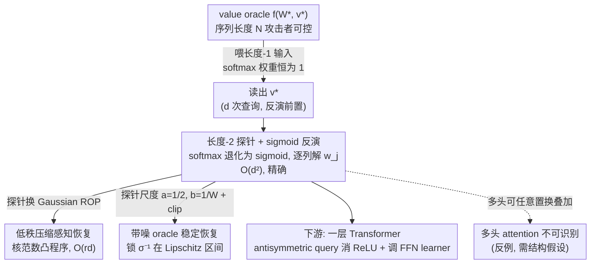

# Provably Learning Attention with Queries

**会议**: ICML 2026  
**arXiv**: [2601.16873](https://arxiv.org/abs/2601.16873)  
**代码**: 无  
**领域**: 学习理论 / 模型抽取 / Transformer 可学习性  
**关键词**: model stealing, value query, single-head attention, parameter recovery, compressed sensing

## 一句话总结
作者证明单头 softmax attention 在 value-query 访问下可以惊人简洁地被精确恢复 —— 只需 $O(d^2)$ 次查询，比同等结构的 ReLU MLP 容易得多；当头维 $r\ll d$ 时还能借压缩感知降到 $O(rd)$，并把结论扩展到带噪 oracle、membership query 以及多头不可识别性。

## 研究背景与动机
**领域现状**：Transformer 已是工业部署主力，模型抽取攻击（model stealing）由此成为安全研究核心。Tramèr 2016 起对前馈网的提取已经有大量实证与理论成果，最近 Carlini 2024 甚至能从生产级 LLM 抓取嵌入矩阵和宽度。但「能否在 API 黑盒访问下证明恢复 softmax attention 的参数」这一最基础的问题，居然没人正面回答过。

**现有痛点**：(1) 现有 query learning 理论几乎全部集中在 ReLU FFN，且需要 Gaussian input、参数线性无关、general position 等强假设；(2) 在 attention 上，无 query 的被动学习问题（passive learning）由于 softmax + 双线性 score 是非凸的，本身已经非常难，作者们经常要靠 token-selection / max-margin / SVM 等工具且只在受限情形下证明；(3) softmax 把 token-pair 的双线性 $x_i^\top W x_N$ 与跨位置加权耦合在一起，朴素方法看不到「怎么把 $W$ 一项一项解出来」。

**核心矛盾**：attention 的非线性看似比 MLP 复杂（多了 softmax 归一化 + 序列长度可变），但作者发现这种「相对软」的非线性其实给攻击者送了把好刀 —— 只要能控制序列长度 $N$，就能让 softmax 退化为可逆 sigmoid，从而把 attention 还原成线性方程组；这是 ReLU MLP 完全没有的便利。

**本文目标**：(1) 给出第一份单头 attention 参数恢复的多项式算法与查询复杂度；(2) 把它接到 ReLU FFN learner 上得到一层 Transformer 的可学习性；(3) 对低秩、噪声 oracle、membership query、多头不可识别性等更现实场景全部给出结果。

**切入角度**：从「长度可控」这一 attention 特有优势出发 —— $N=1$ 时 softmax 权重恒为 1，直接得到 $f(X)=x^\top v$，可独立恢复 $v$；$N=2$ 时 softmax 退化为 sigmoid，可由 oracle 输出 $y$ 反解出 $\sigma^{-1}(\cdot)$ 得到关于 $W$ 列的线性方程。

**核心 idea**：用「单 token 查询恢复 $v$」+「双 token 查询通过 sigmoid 反演逐列恢复 $W$」共 $d^2+d$ 次 query 精确恢复 $(W^\star,v^\star)$，并把同一思路与压缩感知 / Lipschitz clipping / antisymmetric query 等手段组合，覆盖低秩、带噪、含 ReLU FFN 等所有变体。

## 方法详解

### 整体框架
攻击者拿到的是 $f_{W^\star,v^\star}(X)=\text{softmax}(x_1^\top W^\star x_N,\dots,x_N^\top W^\star x_N)^\top(Xv^\star)$ 这个 value oracle，要从黑盒查询里把参数 $(W^\star,v^\star)\in\mathbb R^{d\times d}\times\mathbb R^d$ 一字不差地解出来。整套算法吃定了 attention 一个 MLP 没有的便利——序列长度 $N$ 攻击者说了算：先喂长度-1 的输入让 softmax 权重恒为 1，oracle 直接吐出 $v^\star$ 的各分量；再喂长度-2 的输入把 softmax 压成可逆的 sigmoid，逐列反解出 $W^\star$。这两步合起来 $d^2+d$ 次查询就能精确复原单头 attention，剩下的低秩、带噪、含 ReLU FFN 等变体都是在这条主线上换探针尺度、叠加压缩感知或对称化技巧的加工。

### 关键设计

**1. 长度-2 探针 + sigmoid 反演（Thm 4.1）：把非线性 attention 还原成一组线性方程**

softmax 的麻烦在于「全长归一」把所有 token 的双线性分数耦合在一起，看不出怎么单独解出 $W^\star$ 的某一项。本文的破法是固定要恢复的列 $j$，构造长度-2 输入 $X=[(u+e_j)^\top;\, e_j^\top]$：此时两个 score 是 $s_1=(u+e_j)^\top W^\star e_j$ 与 $s_2=e_j^\top W^\star e_j$，相减后 $s_1-s_2=u^\top w_j$ 恰好把碍事的 $e_j^\top W^\star e_j$ 项消掉，位置 1 的注意力权重退化成单变量 sigmoid $\alpha=\sigma(u^\top w_j)$。由于 $N=1$ 那步已经把 $v^\star$ 撇清，oracle 返回的 $y=v^\star_j+\alpha\,(u^\top v^\star)$ 里只剩 $\alpha$ 未知；只要 $u^\top v^\star\neq 0$，就能反推 $\alpha=(y-v^\star_j)/(u^\top v^\star)\in(0,1)$，再取全局可逆的 $\sigma^{-1}$ 得到一个线性约束 $u^\top w_j=\sigma^{-1}(\alpha)$。换 $d$ 个线性无关的 $u$（i.i.d. Gaussian 几乎必然满足）就凑齐一组满秩线性方程解出整列 $w_j$。复杂度按「$d$ 列 × 每列 $d$ 个探针」算正好 $O(d^2)$——这把 attention 的非线性当成了攻击者的朋友而非障碍。

**2. 低秩压缩感知恢复 $W^\star$（Thm 5.1）：用秩-1 快照把 $d^2$ 压到 $O(rd)$**

实际 LLM 的注意力是 $W^\star=K^\top Q$，头维 $r$（约 128）远小于宽度 $d$（约 4096），逐项查询整个 $d\times d$ 矩阵太浪费。本文不换算法只换探针：把上面的探针改成 i.i.d. Gaussian $a,b\sim\mathcal N(0,I_d)$、$X=[(a+b)^\top;\, b^\top]$，同样反解出 $\alpha=\sigma(a^\top W^\star b)$，但这回得到的是一个秩-1 测量 $t=\langle ab^\top,\, W^\star\rangle$——单次查询给出关于 $W^\star$ 的一个线性快照而非某一项。收集 $m=O(rd)$ 个这样的 ROP（rank-one projection）测量后，解凸程序 $\min\|W\|_\ast\ \text{s.t.}\ \langle a_kb_k^\top,W\rangle=t_k$，由 Cai-Zhang 2015 的 RUB 条件保证 $m\geq Cr(2d)$ 时高概率精确恢复。「直接换问题、接管现成的 compressed sensing 恢复理论」是这一步的方法学巧思。

**3. 带噪 oracle 下的稳定恢复（Thm 6.1）：把 logit 锁在 Lipschitz 区间再 clip**

真实 API 输出总带微小噪声，而 $\sigma^{-1}$ 在 $\alpha$ 接近 0 或 1 时斜率发散、根本不 Lipschitz，朴素反演会让误差爆炸。本文的对策是把探针尺度设计成天然把 logit 压在安全区：取 $a=1/2$、$b=1/W$，构造 $X=[(bu+ae_j)^\top;\, (ae_j)^\top]$，使 $|ab\,W^\star_{ij}|\leq 1/2$，于是 $\alpha^\star=\sigma(ab\,W^\star_{ij})$ 永远落在 $[\sigma(-1/2),\,1-\sigma(-1/2)]$ 这段 sigmoid 还光滑的区间里。估计时再对 $\hat\alpha$ 做 $\text{clip}(\hat\alpha;\tau_{\text{clip}},1-\tau_{\text{clip}})$ 防越界，由 Lemma A.1 的 $|\sigma^{-1}(\text{clip}(\hat\alpha))-\sigma^{-1}(\alpha^\star)|\leq 5|\hat\alpha-\alpha^\star|$ 把估计误差线性传递下去，最终只要噪声容差 $\tau=\mathcal O(\min\{\mu,\,\epsilon_v/\sqrt d,\,\mu\epsilon_W/(W^2 d)\})$ 就能达到 $\|\hat W-W^\star\|_F\leq\epsilon_W$、$\|\hat v-v^\star\|_2\leq\epsilon_v$。把光滑性分析直接嵌进探针的尺度设计、而不是事后修补，是这一步最值得借鉴的地方。

### 损失函数 / 训练策略
本文不训练，所有保证都围绕 query 复杂度与概率精度展开。低秩那步解的凸程序 $\min\|W\|_\ast$ 靠 nuclear norm 引导低秩解；多头不可识别性（Prop 7.1）则是反向构造——给出两组不同的 $\{(W_h,v_h)\}$ 诱导出完全相同的输入-输出映射，从而证明无附加结构假设时多头 attention 根本不存在恢复算法。一层 Transformer 的处理是用 antisymmetric query $\widetilde{\text{VQ}}(X)=\text{VQ}(X)-\text{VQ}(-X)$ 把偶性的 ReLU 抵消掉，转成纯 attention 问题后调用上面的 learner，FFN 部分则直接复用已有的 $\mathcal A_{\text{FFN}}$（如 Milli 2019 或 Daniely-Granot 2023）。

## 实验关键数据
本文为理论文章，无实证实验。主要"数据"是各种情形下的 query / 精度复杂度。

### 主实验

| 设定 | Query 复杂度 | 保证 | 假设 |
|------|-------------|------|------|
| 精确单头 attention 恢复 (Thm 4.1) | $O(d^2)$ | 精确 | $v^\star\neq 0$ |
| 低秩单头 attention (Thm 5.1) | $O(rd)$ | 精确，概率 $1-e^{-\Omega(m)}$ | $\text{rank}(W^\star)\leq r$, $v^\star\neq 0$ |
| 带噪 oracle (Thm 6.1) | $O(d^2)$ | $\|\hat W-W^\star\|_F\leq\epsilon_W$ | $\|W^\star\|_F\leq W$, $\min v^\star\geq\mu$ |
| 一层 Transformer (含 ReLU MLP) | $Q_{\text{FFN}}(d,m)+O(d^2)$ | 精确，依赖 $\mathcal A_{\text{FFN}}$ | $A^\star w_o^\star\neq 0$ |
| Multi-head attention | 不可识别 | 不存在算法 | 无额外结构 |

### 消融实验

| 变体 | 查询数 / 精度 | 备注 |
|------|--------------|------|
| Value query | $O(d^2)$, 精确 | 基线 |
| Membership query (App. B) | poly + bisection | 仅返回 ±1 标签，复杂度更高 |
| Antisymmetric query 消 ReLU | $2\times$ 单 query | 用于一层 Transformer 的 attention 部分 |

### 关键发现
- 同样含「一个非线性 + 一个矩阵 + 一个向量」的 single-head attention 与 single-hidden-layer ReLU MLP，前者 query 学习极其容易，后者至今仍需强假设 —— 来自 softmax 是全局可逆光滑函数而 ReLU 不是。
- 探针尺度的精心选择（low-rank 用 Gaussian、noisy 用 $b=1/W$）决定整套算法是否能闭合，是论文最实用的方法学经验。
- multi-head attention 由于 head 间可任意置换 + 线性叠加，存在无穷多参数化诱导同一函数，必须加结构假设（如 head 间正交）才能识别。
- 长度-1 query 直接读出 $v^\star$ 这一步看似平凡，但它是后续 sigmoid 反演的必要前置：没有 $v^\star$ 知道，从 $y$ 反推 $\alpha$ 缺少分母无从下手。
- 在 membership query（只返回二元标签）场景下，作者用 bisection 把 sigmoid 反演降级为多次比较 query，复杂度仍是多项式但常数显著放大。

## 亮点与洞察
- 「靠序列长度可控让 softmax 退化为 sigmoid」是 attention 才有的攻击面，把一层 Transformer 的安全性放在一个比 MLP 弱得多的位置 —— 对部署 LLM API 的厂商是个明确警示。
- 用 antisymmetric query $f(X)-f(-X)$ 把 ReLU 消掉，转化为线性等价问题，这一 trick 可复用于任何「奇变换 + 偶非线性」的网络结构分析。
- 把 model extraction 写在 PAC-style query complexity 框架下，给安全社区与学习理论社区搭起桥梁 —— 之前的 attack 论文绝大部分是实证派。
- 低秩场景下把 query 从 $O(d^2)$ 压到 $O(rd)$，对现代 LLM 头维 $r\sim 128$ vs 宽度 $d\sim 4096$ 的现实刚刚好 —— 意味着质量上可以抽取 SOTA 规模模型的注意力参数。
- 用探针尺度 $a=1/2, b=1/W$ 把 $\sigma^{-1}$ 锁定在 Lipschitz 区间上是「在算法设计深处嵌入光滑性分析」的典范，对一切涉及不稳定反函数的估计问题都有参考价值。

## 局限与展望
- 单头 + 线性 MLP 是最简版本，真实 Transformer 是多层多头 + LayerNorm + position encoding，理论与实际还差很多层抽象。
- 带噪情形需要 margin $\mu>0$，对 LLM 中常见的稀疏 / 接近零的权重不友好。
- Multi-head 的不可识别性只是给出反例，并未深入研究「正交头 / FFN gate 等结构假设下的可识别性边界」。
- 假设 $v^\star\neq 0$ —— 在 $v^\star=0$ 的退化情形 $W^\star$ 完全不可识别，但这一边界条件在实际抽取时如何检测论文未给出工程指南。

## 相关工作与启发
- **vs Chen et al. 2021 (Gaussian-input ReLU MLP)**：他们恢复 2 层 ReLU MLP 也是 query 模型，但需要 Gaussian input 和 distribution-dependent 论证；本文证明 attention 完全不需要分布假设。
- **vs Daniely-Granot 2023 (general position ReLU)**：本文一层 Transformer 的 FFN 子例程可直接调用其算法，是「现有 FFN learner + 我们的 attention learner」组合用法。
- **vs Carlini et al. 2024**：他们是工业级 LLM 上的实证抽取，本文是同问题的最小、可证明、被动版；两条线互补。

## 评分
- 新颖性: ⭐⭐⭐⭐⭐ 第一份 softmax attention 的可证明参数恢复结果，方法漂亮
- 实验充分度: ⭐⭐ 全理论，无任何实证或 toy demo
- 写作质量: ⭐⭐⭐⭐⭐ 主定理证明就在正文一两页内可读完，每个引理动机清楚
- 价值: ⭐⭐⭐⭐ 给 model extraction 安全研究与 attention 理论分析同时打开新工具

<!-- RELATED:START -->

## 相关论文

- [\[ICML 2026\] Token Sparse Attention: Efficient Long-Context Inference with Interleaved Token Selection](token_sparse_attention_efficient_long-context_inference_with_interleaved_token_s.md)
- [\[ICML 2026\] QHyer: Q-conditioned Hybrid Attention-mamba Transformer for Offline Goal-conditioned RL](qhyer_q-conditioned_hybrid_attention-mamba_transformer_for_offline_goal-conditio.md)
- [\[CVPR 2026\] BinaryAttention: One-Bit QK-Attention for Vision and Diffusion Transformers](../../CVPR2026/model_compression/binaryattention_one-bit_qk-attention_for_vision_and_diffusion_transformers.md)
- [\[ICLR 2026\] TurboBoA: Faster and Exact Attention-aware Quantization without Backpropagation](../../ICLR2026/model_compression/turboboa_faster_and_exact_attention-aware_quantization_without_backpropagation.md)
- [\[ICLR 2026\] FASA: Frequency-Aware Sparse Attention](../../ICLR2026/model_compression/fasa_frequency-aware_sparse_attention.md)

<!-- RELATED:END -->
