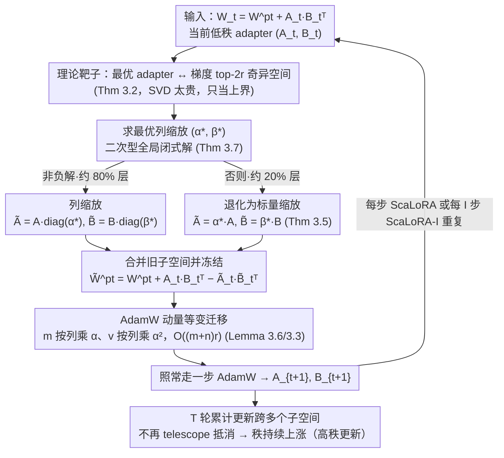

# ScaLoRA: Optimally Scaled Low-Rank Adaptation for Efficient High-Rank Fine-Tuning

**会议**: ICML 2026  
**arXiv**: [2510.23818](https://arxiv.org/abs/2510.23818)  
**代码**: 论文未明示（无）  
**领域**: 模型压缩 / 参数高效微调 / LoRA 变体  
**关键词**: LoRA、高秩更新、列缩放、AdamW moment 等变、ScaLoRA

## 一句话总结
作者证明 LoRA 累加更新被困在固定低秩子空间，提出 ScaLoRA：每步把旧 $AB^\top$ 合并到 $W^{pt}$ 后，**用一个可解析求得的最优"列缩放"** 重启 adapter，使 AdamW 一阶/二阶动量可以 $O((m+n)r)$ 等变传递 (不需要重置/warm-up)、累加更新自然变高秩——在 DeBERTaV3、LLaMA2-7B、LLaMA3-8B、Gemma3-12B 上一致打过 LoRA / MoRA / HiRA / ReLoRA / LoRA-GA。

## 研究背景与动机

**领域现状**：LoRA (Hu et al. 2022) 把全参数 $W = W^{pt} + AB^\top$ 中的更新约束在 $A \in \mathbb{R}^{m \times r}, B \in \mathbb{R}^{n \times r}$ 这两个瘦矩阵上，$r \ll m, n$，大幅省显存和算力。后续 DoRA、QLoRA、FourierFT、HiRA、MoRA、ReLoRA 等变体试图改进效果或拓展应用。

**现有痛点**：LoRA 跟 full fine-tuning 之间 **总存在效果 gap**，且 gap 随秩 $r$ 减小而加剧；本质原因是 $T$ 步累计更新 $\sum_t \Delta W_t = A_T B_T^\top - A_0 B_0^\top = A_T B_T^\top$ 永远落在固定的 rank-$r$ 子空间里——telescoping 把跨步信息全抵消了。已有"高秩 LoRA"方案各有毛病：

- **ReLoRA** 周期性把 $AB^\top$ 合并到 $W^{pt}$ 并随机初始化新 $AB^\top$，但每次合并都要 **重启优化器 + 重新 learning-rate warm-up**，收敛慢；
- **MoRA** 把 $A(B^\top X)$ 换成 $f_{decompress}(M f_{compress}(X))$ 非线性映射，得高秩但 $f_{compress/decompress}$ 设计极费工；
- **HiRA** 用 $W^{ft} = (AB^\top) \odot W^{pre}$ Hadamard 积得高秩，但每步反传通过 $m \times n$ Hadamard 积，**显存 $O(mn)$**，对超大 LLM 不可扩展。

**核心矛盾**：要"用低秩 adapter 实现高秩累积更新"，需要每步换一个不同子空间；但只要换子空间，AdamW 维护的 $(m_t, v_t)$ moment estimator 就失效，要么重启 (慢)、要么从零重算 (贵)。这两个要求看起来不兼容。

**本文目标**：找到"最优 adapter 更新"的解析表达；找到一种 adapter 变换形式，使得 moment estimator 能从旧 adapter $O((m+n)r)$ 等变映射到新 adapter，无需重启；最终在不增加显存的前提下做到高秩累积更新 + 快收敛。

**切入角度**：作者从 loss 的 Lipschitz 上界出发，证明每步最优 adapter 满足"等价于把 full FT 的梯度 $\nabla \ell(W_t) = U_t \Sigma_t V_t^\top$ 做截断 SVD 取前 $2r$ 个方向"，但 SVD 复杂度太高，又把"替换前后的 adapter 关系"约束到**列缩放** $\tilde{A} = A \cdot \text{diag}(\alpha), \tilde{B} = B \cdot \text{diag}(\beta)$ 这种简单变换——这是少数能让 AdamW moment 解析等变迁移的变换。

**核心 idea**：在 LoRA 子空间内寻找"对当前 loss 下降最优"的列缩放因子 (有解析全局最优解)，每步或每 $I$ 步用最优 $(\alpha^*, \beta^*)$ 缩放后把 $\tilde{A}_t \tilde{B}_t^\top$ 合并进 $\tilde{W}^{pt}_t$，随后继续训练新 $A_{t+1}, B_{t+1}$；列缩放让 moment 几乎免费等变迁移，于是累积更新越来越多个不同方向、秩自动上涨。

## 方法详解

### 整体框架
ScaLoRA 想让低秩 adapter 攒出高秩的累积更新，又不重启优化器。它仍写成 $W_t = W^{pt} + A_t B_t^\top$，但每步（或每 $I$ 步）把当前 adapter "虚拟合并 + 重启"成 $W_t = \underbrace{(W^{pt} + A_t B_t^\top - \tilde{A}_t \tilde{B}_t^\top)}_{\tilde{W}^{pt}_t,\,\text{合并并冻结}} + \underbrace{\tilde{A}_t \tilde{B}_t^\top}_{\text{可学}}$：先用解析公式算出最优"列缩放" $(\alpha^*_t, \beta^*_t)$，把旧子空间 $A_t B_t^\top$ 并进冻结部分 $\tilde{W}^{pt}_t$，新的可学部分换成 $\tilde{A}_t = A_t \text{diag}(\alpha^*_t)$、$\tilde{B}_t = B_t \text{diag}(\beta^*_t)$，再用列缩放天然的等变性把 AdamW 的动量从旧 $(A_t,B_t)$ 搬到新 $(\tilde{A}_t,\tilde{B}_t)$，最后照常走一步 GD/AdamW 得到 $A_{t+1}, B_{t+1}$ 进入下一轮。因为每轮落在不同的最优子空间，$T$ 轮累计权重 $\sum_t (A_{t+1} B_{t+1}^\top - \tilde{A}_t \tilde{B}_t^\top)$ 不再像原始 LoRA 那样 telescope 抵消，秩持续上涨。

### 关键设计

**1. 最优 adapter 的理论刻画：先找到该追的"理论靶子"**

LoRA 跟 full FT 总有 gap，但 gap 到底由什么决定？作者从 $L$-smooth 上界 $\ell(W_t + \Delta W_t) \leq \ell(W_t) + \langle \nabla \ell, \Delta W_t \rangle + \frac{L}{2}\|\Delta W_t\|_F^2$ 出发，最小化右端得到 full-FT 的理想更新 $\Delta W_t^* = -\frac{1}{L} \nabla \ell(W_t)$。再把 LoRA 一步更新展开成 $\Delta \tilde{W}_t = -\eta \nabla \ell\, \tilde{B}_t \tilde{B}_t^\top - \eta \tilde{A}_t \tilde{A}_t^\top \nabla \ell + O(\eta^2)$ 代入并配方，问题等价于"用低秩的 $\Delta \tilde{W}_t$ 去逼近 $\Delta W_t^*$"，即最小化 $\|\Delta W_t^* - \Delta \tilde{W}_t\|_F^2$。Theorem 3.2 证明：当 $\text{rank}(\nabla \ell(W_t)) \geq 2r$ 时，最优 $\tilde{A}_t^*, \tilde{B}_t^*$ 恰好等价于对 $\nabla \ell$ 做 rank-$2r$ 截断 SVD、取前 $2r$ 个左右奇异向量构成新 adapter。这就把"最优 adapter ↔ 梯度 top-$2r$ 奇异空间"挂上了钩，说明 LoRA 跟 full FT 的距离本质上由当前梯度的主奇异方向决定。但截断 SVD 每步要 $O(Smnr)$、还得重启优化器，太贵——它只能当理论上限，真正落地需要一个便宜得多的近似。

**2. 最优列缩放 + AdamW 动量等变：把"换 adapter"压成几乎免费的列缩放**

直接做 SVD 太贵的根因是"任意换子空间"会让 AdamW 维护的动量 $(m_t, v_t)$ 全部失效，只能重启。作者于是把搜索空间收紧到列缩放 $\tilde{A} = A \text{diag}(\alpha)$、$\tilde{B} = B \text{diag}(\beta)$——这是少数能让动量解析等变迁移的变换。在这个约束下，loss 上界变成关于 $(\alpha,\beta)$ 的二次型 $\|\frac{1}{L}\nabla\ell - \eta \nabla\ell\, B \text{diag}^2(\beta) B^\top - \eta A \text{diag}^2(\alpha) A^\top \nabla\ell\|_F^2$。Theorem 3.7 证明，只要线性系统 $[(S_t^{A\top} S_t^A) \odot (S_t^{B\top} S_t^B)]\, v_t = \lambda_t$ 有非负解（$S_t^A, S_t^B$ 是用当前梯度和 adapter 拼出来的小矩阵，实测 LLM 里约 80% 的层满足），全局最优就是闭式的 $[\alpha^*_t; \beta^*_t] = \pm \frac{1}{\sqrt{L\eta}} v_t^{\circ 1/2}$，只需 $O((m+n)r^2)$；非负条件不满足时退化到更简单的标量缩放（Theorem 3.5），同样有解析全局最优。动量等变则更直接：$\tilde{A} = A \text{diag}(\alpha)$ 是逐列缩放，AdamW 的一阶/二阶动量与 adapter 元素一一对应，于是 $m$ 按列乘 $\alpha$、$v$ 按列乘 $\alpha^2$ 即可，只要 $O((m+n)r)$，完全不必重启或重新 warm-up（Lemma 3.6）。换成行缩放或左右乘满秩矩阵都做不到这种等变——这正是选列缩放的理由。实现上 Lipschitz 常数 $L$ 不去真估，直接当超参 grid search。

**3. ScaLoRA 与摊销变体 ScaLoRA-I：拼成能上 12B 的可落地算法**

把上面两件事拼起来就是完整算法：每步若 Theorem 3.7 的非负条件成立，用列缩放 $\tilde{A}_t = A_t \text{diag}(\alpha^*_t),\ \tilde{B}_t = B_t \text{diag}(\beta^*_t)$ 配 Lemma 3.6 搬动量；否则退化到标量缩放 $\tilde{A}_t = \alpha^*_t A_t,\ \tilde{B}_t = \beta^*_t B_t$ 配 Lemma 3.3。合并 $A_t B_t^\top - \tilde{A}_t \tilde{B}_t^\top$ 是 in-place 写回 $W^{pt}$，额外空间只增 $O((m+n+r)r)$，总时间 $O(mnr + (m+n+r)r^2)$（$r$ 小时后项可忽略）。但 LLM 一层一矩阵、动辄上百个层，每步都缩放仍有开销，所以给出摊销版 **ScaLoRA-I**：每 $I$ 步才缩放-合并一次，单步开销降到 $1/I$。由于学习率 $\eta$ 小、最优缩放本就接近 1，频繁缩放的边际收益递减，$I=10$ 几乎无损。这一点是关键区别：MoRA/HiRA 的高秩约束是每步硬加、无法摊销，而 ScaLoRA 的"周期性最优缩放"能摊销，于是才能扩展到 Gemma3-12B 这种规模。

### 损失函数 / 训练策略
不改变 LLM 的训练损失（仍是任务 CE / language modeling loss），只改 LoRA 模块的优化逻辑：每步在 AdamW 更新前后插入缩放-合并。超参主要是 $L$（grid search 选）、$\eta$、缩放间隔 $I$、LoRA 秩 $r$；论文用 $r=4$（GLUE）和 $r=8$（LLaMA/Gemma 任务）验证小秩下提升最显著。代价是要保存合并后的 $W_t$ 而非小 adapter——disk 不是瓶颈，但跟标准 LoRA 仅 ship adapter 的部署方式不同。

## 实验关键数据

### 主实验
**DeBERTaV3-base on GLUE ($r = 4$)**：

| 方法 | CoLA | SST-2 | MRPC | STS-B | QQP | MNLI-m | QNLI | RTE | Avg |
|---|---|---|---|---|---|---|---|---|---|
| Full FT | 69.19 | 95.63 | 89.46 | 91.60 | 92.40 | 89.90 | 94.03 | 83.75 | 88.25 |
| LoRA | 68.10 | 95.49 | 89.46 | 91.09 | 91.86 | 90.25 | 94.30 | 84.48 | 88.13 |
| MoRA | 69.67 | 95.45 | 89.62 | 90.90 | 91.83 | 90.05 | 93.81 | 85.44 | 88.35 |
| HiRA | 68.82 | 95.53 | 89.95 | 91.15 | **92.19** | 90.24 | 94.15 | 85.68 | 88.46 |
| **ScaLoRA** | **69.86** | **95.83** | **90.28** | **91.47** | 92.10 | **90.36** | **94.34** | **87.61** | **88.98** |

ScaLoRA 8 个任务里 7 个最佳，平均比 HiRA 高 0.5+%，比 Full FT 还高 (因为 Full FT 在小数据集上过拟合)。

**LLaMA2-7B / LLaMA3-8B Commonsense Reasoning ($r = 8$)**：

| Model | LoRA | ReLoRA | LoRA-GA | MoRA | HiRA | ScaLoRA | ScaLoRA-I | LoRA $r=32$ |
|---|---|---|---|---|---|---|---|---|
| LLaMA2-7B Avg | 73.63 | 74.40 | 74.34 | 73.82 | 73.95 | 74.51 | **74.75** | 74.52 |
| LLaMA3-8B Avg | 76.83 | 77.26 | 77.22 | 77.27 | 77.46 | **77.85** | 77.57 | 77.54 |

ScaLoRA(-I) 在 $r=8$ 下**超过 LoRA $r=32$**——即用 1/4 参数达到更高效果。

数学推理 (MetaMathQA / GSM8K / MATH)、Gemma3-12B 上同样一致领先（论文具体数字在第 5+ 节，但篇幅有限不展开）。

### 消融实验

| 配置 | 现象 |
|---|---|
| Full ScaLoRA | baseline |
| 去掉列缩放，只剩标量缩放 (Thm 3.5) | 性能略降，但仍优于 LoRA——说明标量缩放就有正向贡献 |
| 每步都做 vs 每 10 步做 (ScaLoRA-I) | $I=10$ 几乎无损，证实"最优缩放接近 1"的论断 |
| 关掉 moment 等变传递，每次缩放后重新累积 moment | 严重降级，等同 ReLoRA 重启效果 |
| 不同秩 $r$ | $r=4, 8, 16, 32$ ScaLoRA 全面胜 LoRA；秩越小相对优势越大（高秩时 LoRA 自己已经够好） |
| Figure 2(b) on RTE | LoRA cumulative update rank = 4 (恒定)；ScaLoRA rank 累积上涨到 54 |
| Figure 2(c) | $\text{rank}(\nabla \ell(W_t)) \geq 2r$ 假设在 LLM 上几乎处处成立 |
| Figure 2(d) | ~80% LoRA 层每步满足非负条件，可用列缩放；20% 退化到标量缩放 |

### 关键发现
- LoRA 累积更新的秩**真的只是名义 $r$**——但只要每步换子空间，就能上涨到 50+ 而不增加单步参数。
- **小秩 + ScaLoRA > 大秩 + LoRA**：在低秩 budget 下 ScaLoRA 优势最显著（$r=8$ 时反超 $r=32$ LoRA），意味着在内存极紧时更有价值。
- 最优缩放 $\alpha^*, \beta^*$ 一般接近 1（因为 $\eta$ 小），所以摊销做缩放几乎无损——这是工程上能扩展到 12B 模型的关键。
- 跟 ReLoRA 的本质差异：ReLoRA 是 "merge + 随机重启 + warm-up"，ScaLoRA 是 "merge + 解析最优缩放 + moment 等变"——后者既理论最优又工程便宜。

## 亮点与洞察
- **"列缩放是少数 moment 等变的变换"** 这个观察非常聪明——多数研究只看变换的表达能力，忽略它跟 AdamW 状态的兼容性；本文把"变换 + optimizer state 一致性"作为联合设计目标，得到了优雅且实用的方案。
- **理论保证落地**：Theorem 3.2 给"最优 adapter"的 SVD 表示是经典推导，但作者把它当成"理论靶子"而非直接实现目标，再用列缩放做计算上可行的近似 + 解析全局最优，整套理论-工程衔接很顺。
- **可摊销性**：很多高秩 LoRA 变体 (MoRA/HiRA) 在每步硬塞高秩约束，无法摊销；ScaLoRA-I 用"周期性最优缩放"达到几乎相同效果但开销缩 1/$I$，让方法能跨到 12B 参数模型。
- 实证发现 "LoRA 累积更新的秩可以自然涨到 50+ 然后停下"，**逆向证明了 LoRA 原始假设的合理性**——最优 fine-tuning 更新确实在某个比 $r$ 高得多但仍然有限的流形上。

## 局限与展望
- **额外存储**：必须保存合并后的 $W_t$ 而非只保存 $A_t, B_t$，部署时不能像 LoRA 那样仅 ship adapter；论文说 disk 不是瓶颈，但在严格 adapter-only 部署 (例如多任务共享 base) 场景下是个限制。
- 计算复杂度 $O(mnr)$ 跟 HiRA 一样，比 vanilla LoRA 高常数倍；虽然 ScaLoRA-I 摊销了，但每 $I$ 步还是要算梯度乘 $B$/$A$ 这种 $O(mnr)$ 操作。
- 假设 $\text{rank}(\nabla \ell(W_t)) \geq 2r$，虽然实证几乎处处成立，但对极小 batch / 极高 $r$ 不一定。
- 只在 NLU/常识/数学 LLM 任务验证，对 multimodal / vision / RL 微调没测。
- 没讨论与 QLoRA (量化) 或 DoRA (magnitude-direction 分解) 的组合可能；理论上 ScaLoRA 的缩放-合并机制可以套到这些变体上，但论文没做。
- 缩放间隔 $I$ 是超参，需要调；可以考虑自适应（例如当 $\alpha^*$ 偏离 1 超过阈值时再缩放）。

## 相关工作与启发
- **vs LoRA (Hu et al. 2022)**：base case；ScaLoRA 用同样的 $A, B$ 参数化，但每步换子空间做高秩累积。
- **vs ReLoRA (Lialin et al. 2024)**：同样用"合并旧 adapter + 学新 adapter"思路，但 ReLoRA 重启优化器；ScaLoRA 用解析最优缩放 + moment 等变，避免重启。
- **vs MoRA (Jiang et al. 2024)**：MoRA 把 $A B^\top$ 换成 $f_{decompress}(M f_{compress}(\cdot))$ 非线性映射得高秩，需要 careful 手工设计；ScaLoRA 保持 LoRA 简洁结构。
- **vs HiRA (Huang et al. 2025)**：HiRA 用 $(AB^\top) \odot W^{pre}$ Hadamard 积得高秩，但显存 $O(mn)$；ScaLoRA 显存 $O((m+n+r)r)$。
- **vs LoRA-GA (Wang et al. 2024)**：Theorem 3.2 揭示 LoRA-GA 实际是本文最优条件在 $t=0$ + $P_0 = Q_0 = I_r$ 的特例（充分但不必要）。
- **vs Flora / FourierFT 等**：从结构修改/随机投影路径走的方法跟本文正交，可能可叠加。

## 评分
- 新颖性: ⭐⭐⭐⭐⭐ "把变换形式选为 AdamW moment 等变的列缩放 + 解析最优"是个独到且漂亮的设计，理论与工程结合得很自然。
- 实验充分度: ⭐⭐⭐⭐⭐ 覆盖 4 个 LLM 规模 (DeBERTa 184M → Gemma3 12B)、3 类任务 (GLUE/常识/数学)、5+ 个 LoRA 变体基线，还有合成数据可视化 + 假设验证 figure，extremely thorough。
- 写作质量: ⭐⭐⭐⭐ 理论推导清晰但密度大；表格信息量极大但有点拥挤。
- 价值: ⭐⭐⭐⭐⭐ LoRA 是 LLM 微调事实标准，能在不增加显存、保持 LoRA 简洁性的前提下稳定打过 LoRA 是非常实用的进展，会被快速广泛采用。

<!-- RELATED:START -->

## 相关论文

- [\[ICML 2026\] Energy-Structured Low-Rank Adaptation for Continual Learning](energy-structured_low-rank_adaptation_for_continual_learning.md)
- [\[ACL 2026\] Polynomial Expansion Rank Adaptation: Enhancing Low-Rank Fine-Tuning with High-Order Interactions](../../ACL2026/model_compression/polynomial_expansion_rank_adaptation_enhancing_low-rank_fine-tuning_with_high-or.md)
- [\[ICLR 2026\] LoFT: Low-Rank Adaptation That Behaves Like Full Fine-Tuning](../../ICLR2026/model_compression/loft_low-rank_adaptation_that_behaves_like_full_fine-tuning.md)
- [\[NeurIPS 2025\] RefLoRA: Refactored Low-Rank Adaptation for Efficient Fine-Tuning of Large Models](../../NeurIPS2025/model_compression/reflora_refactored_low-rank_adaptation_for_efficient_fine-tuning_of_large_models.md)
- [\[ICML 2026\] Finer Parameter Steps for Low-Rank PEFT: A Controlled Study with CP Tensor Adapters](finer_parameter_steps_for_low-rank_peft_a_controlled_study_with_cp_tensor_adapte.md)

<!-- RELATED:END -->
