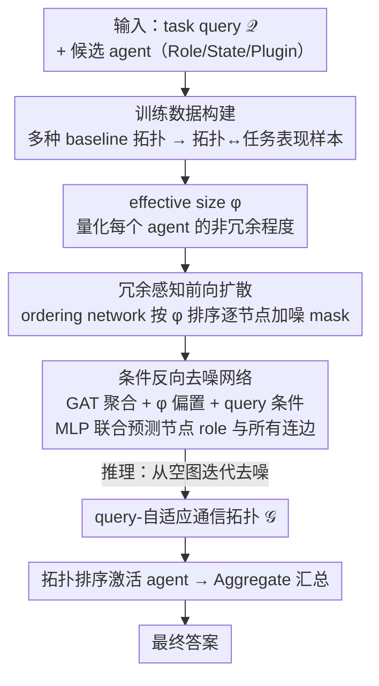

# RADAR: Redundancy-Aware Diffusion for Multi-Agent Communication Structure Generation

**会议**: ICML 2026  
**arXiv**: [2605.09907](https://arxiv.org/abs/2605.09907)  
**代码**: https://github.com/cszhangzhen/RADAR  
**领域**: 多智能体系统 / 图扩散模型 / LLM Agent  
**关键词**: 多智能体协作, 图扩散, 通信拓扑, effective size, 冗余感知

## 一句话总结
RADAR 把多 LLM-Agent 系统的通信拓扑设计建模为一个"冗余感知"的离散图扩散过程，用 effective size 作为指导信号一步步增量生成 query-自适应的协作图，在 6 个基准上同时拿到更高准确率、更低 token 消耗和更强鲁棒性。

## 研究背景与动机

**领域现状**：LLM-Agent 多智能体系统（LLM-Debate、MetaGPT、AutoGen 等）已经被证明能比单 agent 强得多，但它们的关键瓶颈在"通信拓扑"上——谁跟谁说话、按什么顺序说。早期方法用 chain / star / tree / fully-connected 这种手工固定结构，最近一年的工作（GPTSwarm、G-Designer、MaAS、ARG-Designer、GTD）开始转向"自动设计拓扑"。

**现有痛点**：自动化路线主要分三类，每类都有问题。一是 agentic profiling（用 meta-agent 协调），存在单点瓶颈；二是 search-based（启发式搜索拓扑空间），计算昂贵且不 scalable；三是 graph learning（用 VAE 之类一次性预测整张图），生成粒度太粗，无法捕捉细节依赖。更要命的是结构越复杂 token 消耗越离谱——论文引用的数据是复杂拓扑能比 chain 多消耗 $2 \sim 11.8\times$ tokens。AgentPrune / Wang 等做剪枝缓解，但只能在固定 agent 集合上做局部修改，是"post hoc"打补丁，不能从零开始按效率约束设计。

**核心矛盾**：表达力（拓扑要够复杂以应对难题）和效率（token 不能爆炸）之间的矛盾。已有方法要么牺牲一个，要么把两个目标当独立子问题分别处理。

**本文目标**：在通信图的生成过程中显式建模"冗余"，让结构形成与冗余控制 jointly 进行；同时支持 query-自适应，简单题用稀疏结构、难题用密集结构。

**切入角度**：作者借用社会网络分析里的 effective size（Burt 1992）——一个节点 ego network 中非冗余信息的比例。如果两个邻居本身互相高度连接，那它们提供的信息就有重叠，effective size 低。把这个概念塞进图扩散过程，就有了一个天然的"冗余度量"作为生成的引导信号。

**核心 idea**：把多 agent 通信拓扑设计 reformulate 成一个"effective size 引导 + query conditioned"的离散图扩散问题，逐步从空图 denoise 出最终拓扑。

## 方法详解

### 整体框架

RADAR 把"给一个 task query 设计多 agent 通信拓扑"当成一个条件图扩散问题来做：输入是 task query $\mathcal{Q}$ 和一组候选 agent（每个带 Role / State / Plugin），输出是一张有向图 $\mathcal{G} = (\mathcal{V}, \mathcal{E})$，$A_{ij} = 1$ 表示 agent $v_i$ 把信息传给 $v_j$；拿到图后按拓扑排序顺序逐个激活 agent，最后用 Aggregate 函数（多数投票 / 拼接 / 取最后一个 agent 输出）汇总成答案。训练时先用多种 baseline 拓扑（fully connected / mesh / star / layered / random，agent 数 3 或 4）在 50 个训练 query 上跑出一批"拓扑→任务表现"样本，用它们训练扩散模型；推理时面对新 query，denoising network 从一张空图开始迭代去噪，逐步长出一张专门为这个 query 定制的协作图。整套设计的灵魂是把社会网络里的 effective size 塞进扩散的每一步，让"结构越长越冗余"这件事在生成过程中就被持续压制。下面三个核心设计——effective size 作冗余度量、它引导的前向扩散加噪顺序、以及条件反向去噪网络——正好对应图中扩散管线的三个关键节点（脚手架：输入、训练数据构建、拓扑执行汇总不单列设计点）。

### 关键设计

**1. Effective size：把冗余变成一个可引导的几何量**

前面的痛点是，自动设计拓扑的方法只能拿 task accuracy 这种黑盒信号当反馈，稀疏又滞后，模型根本不知道"图的哪一块在做无用功"。RADAR 借来社会网络分析里的 effective size（Burt 1992），给当前图里的每个 agent 算一个标量，直接量化它邻接的非冗余程度。入向定义为 $\varphi^i(v_k) = |\mathcal{N}_i(v_k)| - \frac{\sum_{j,q \in \mathcal{N}_i(v_k)} A_{jq} \mathbb{I}[r(j) = r(q)]}{|\mathcal{N}_i(v_k)|}$：分子是 in-neighbor 的数量，分母则惩罚那些"角色相同又互相连着"的邻居对——两个同角色 agent 如果彼此还连通，它们提供的信息高度重叠，effective size 就被扣分。出向 $\varphi^o(v_k)$ 对称定义，再用 $\varphi(v_k) = (1-\beta) \varphi^i(v_k) + \beta \varphi^o(v_k)$ 加权合并。$\varphi$ 高意味着这个 agent 既接收得到多样输入、又能把信息分发到不重叠的路径上。它之所以好用，是因为它局部、随结构可算、且与冗余直接对应，可以在扩散的每一步给出细粒度的结构指导，而不是等任务跑完才知道好坏。

**2. Redundancy-aware forward diffusion：用 effective size 决定加噪顺序**

通用图扩散（Kong et al.、Chen et al.）前向加噪时用随机或固定顺序 mask 节点，把图特有的结构规则性也一起抹掉了，反向去噪学起来就乱。RADAR 改成让 effective size 来排加噪顺序：训练图 $\mathcal{G}_0$ 被逐步 mask 掉节点和它们的边，得到一串部分 mask 的中间图 $\mathcal{G}_1, \mathcal{G}_2, \dots$ 作为反向去噪的监督。决定每步 mask 谁的是 ordering network $q_\psi(\pi | \mathcal{G}_0, \varphi) = \prod_t q_\psi(\pi_t | \mathcal{G}_0, \varphi, \pi_{(<t)})$——先用 GNN 加位置编码算出节点嵌入 $h_t$，再按 $q_\psi(\pi_t | \cdot) \propto \exp(h_t + \varphi(v_t))$ 采样，于是 effective size 越高的节点越早被 mask。这样安排的好处是，effective size 高的图天然能拆成弱重叠的子结构，逆过来看就是"简单子结构先被还原、复杂依赖最后还原"，反向去噪的学习任务因此变得规整、好学。

**3. Conditional reverse denoising network：一次联合预测一个节点的角色和所有连边**

反向过程从空图出发，在 query $\mathcal{Q}$ 的条件下一步步把节点和它跟已生成节点的连接还原出来。denoising network $p_\theta(\mathcal{G}_t | \mathcal{G}_{t+1}, \mathcal{Q})$ 每层用 GAT 风格的注意力聚合邻居信息，$\alpha_{i,j} = \frac{\exp(\text{ReLU}(\mathbf{a}^\top [\mathbf{W h}_i^l \| \mathbf{W h}_j^l]))}{\sum_k \exp(\cdot)}$，并在最后一层把 effective size 作为偏置加回去 $\mathbf{h}_i^L \leftarrow \mathbf{h}_i^L + \varphi(v_i) \mathbf{1}$，让每一步生成都隐式偏向低冗余结构。拿到节点嵌入后用一个 MLP 同时预测新节点的 role 以及它与所有已 denoised 节点的连边，关键在于这些连边是用"混合多项式分布"联合推理出来的，而不是 ARG-Designer 那种逐边自回归——这一改把生成步数从 $\mathcal{O}(N^2)$ 压到 $\mathcal{O}(N)$，inference 时只比固定 workflow 方法多一点点开销，却换来了 query-adaptive 的能力。query conditioning 保证了拓扑能随任务难度伸缩，effective size 偏置保证了它在伸缩的同时不长出冗余。

### 损失函数 / 训练策略

denoising network 用加权 NLL 损失 $\nabla_\theta \mathcal{G} = \sum_{m,t} \sum_{k \in \pi(\leq t)} w_k^m \nabla \log p_\theta(\mathcal{G}_{v_k}^{\pi(>t)} | \mathcal{G}_{t+1}^m, \mathcal{Q})$ 训练，其中 $w_k^m$ 是 ordering network 给的概率权重。ordering network 因为输出是离散的，用 REINFORCE 训练，reward 取负的 NLL：$R^m = -\sum_t \sum_k w_k^m \log p_\theta(\cdot)$。

此外还有一个 task-utility 的 policy gradient 项 $\nabla_\theta \mathbb{E}[\mathcal{G}] \approx \frac{1}{\mathcal{B}} \sum_k u(\mathcal{G}^{(k)}(\mathcal{Q})) \nabla_\theta \log p_\theta(\mathcal{G}^{(k)} | \mathcal{Q})$，直接用任务准确率作为黑盒 reward。实践中只对部分生成图周期性评估 utility，省 API 钱。

## 实验关键数据

### 主实验

在 6 个基准（MMLU、GSM8K、MultiArith、SVAMP、AQuA、HumanEval）上对比 20+ baselines，全部用 gpt-4o-mini 作为 base LLM、5 个 agents。

| 方法 | MMLU | GSM8K | HumanEval | 平均 |
|------|------|-------|-----------|------|
| Vanilla（单 agent） | 78.54 | 87.45 | 87.08 | 85.92 |
| LLM-Debate | 80.56 | 89.47 | 88.68 | 87.46 |
| AgentPrune | 82.40 | 91.92 | 87.17 | 88.22 |
| MaAS | 82.32 | 91.13 | 89.57 | 88.50 |
| ARG-Designer | 79.10 | 91.25 | 89.19 | 88.57 |
| **RADAR** | **83.66** | **92.51** | **91.28** | **90.32** |

RADAR 比最强 learning-based baseline（ARG-Designer）平均高 1.75%，比单 agent 高 1.96%~6.59%。

### 消融实验

| 配置 | MMLU | GSM8K | MultiArith | 说明 |
|------|------|-------|------------|------|
| Full RADAR | 83.66 | 92.51 | 98.81 | 完整模型 |
| w/o ES | 81.05 | 91.22 | 98.31 | 同时去掉 ordering 和 denoising 的 effective size |
| w/o utility | 82.96 | 92.02 | 98.47 | 去掉 task-utility policy gradient |
| w/o query | 79.08 | 91.82 | 97.81 | denoising 不看 query，掉得最狠 |
| non-diffusion | 79.10 | 91.25 | 98.55 | 换成 ARG-Designer 风格自回归 |

### 关键发现
- query conditioning 影响最大（MMLU 掉 4.58），说明 task-adaptive 是核心增益来源
- effective size 系统性地降低性能，去掉后 MMLU 掉 2.61，验证冗余感知的有效性
- token 消耗上：GSM8K 上 RADAR 只用 $4.2 \times 10^6$ tokens，是 G-Designer 的一半，且准确率更高；对比 AFlow 的 $1.4 \times 10^7$ 和 AgentPrune 的 $1.1 \times 10^7$，RADAR 是 $6.5 \times 10^6$，token economy 显著
- 鲁棒性：在 MMLU 上对 2/5 agent 注入"liar prompt 攻击"，complete graph 掉 4.47%，ARG-Designer 掉 1.05%，RADAR 几乎不掉
- 生成图统计：RADAR 的 effective size 0.92 远高于 G-Designer (0.73) 和 ARG-Designer (0.68)，density 0.289 还略低，说明"少而精"
- 跨 base LLM 迁移性强：用 gpt-4o-mini 训练，部署到 DeepSeek-R1 / Qwen3-32B 都能用，DeepSeek-R1 上单 agent 90.81，RADAR 92.16

## 亮点与洞察
- **把社会网络的 effective size 搬到 LLM 多 agent 通信图**——这是一个非常 clean 的跨学科借用。Burt 1992 的经典概念在 1990 年代是用来分析人类社交网络中"结构洞"价值的，作者把"非冗余"的几何直觉无缝迁移到 agent 网络，作为可微的引导信号
- **iterative graph diffusion 而非 one-step generation** 是相对 G-Designer / MaAS / ARG-Designer 的关键 paradigm shift，让模型能"边生成边反思冗余"，而不是一锤子买卖
- 联合预测边（mixture of multinomial）把生成步数从 $\mathcal{O}(N^2)$ 压到 $\mathcal{O}(N)$，是 ARG-Designer 自回归方案的有效改进，inference 时只比 single workflow 方法多一点 overhead 但能 query-adaptive
- token cost 减半但准确率反而最高，强力说明"复杂拓扑 ≠ 好拓扑"，结构稀疏化在 LLM 多 agent 时代经济上是 first-class concern

## 局限与展望
- 训练需要"baseline 拓扑 + 任务表现"作为初始数据集，启动成本不低；新 task 需要重新 sample 50 个 query 跑 baseline 才能初始化
- inference 时每个 query 都要跑完整的多步 denoising，相比 AFlow 这种"一次学一个固定 workflow"在单 query latency 上劣势明显（17.55min vs 7.32min on GSM8K）
- 实验都在 5 agents 的小规模下，没探究 $N \gg 5$ 的 scaling 行为；effective size 的 $\mathcal{O}(N^2)$ 计算会成为瓶颈
- agent role 是固定 candidate 池里选，没考虑动态 role 生成，作者把它当 future work
- effective size 假设角色是离散类别，对连续 prompt-based 角色不太适用

## 相关工作与启发
- **vs ARG-Designer**：都是 generative 拓扑设计，但 ARG-Designer 自回归生成边，RADAR 用扩散过程联合生成边并显式建模冗余，效率和质量都更优
- **vs GTD**：GTD 也用条件离散图扩散，但没有 effective size 这种结构指标作为引导，所以生成的图可能在"冗余控制"上没有明确目标
- **vs AgentPrune**：AgentPrune 是 post-hoc 剪枝（在固定拓扑上去掉低贡献边），RADAR 是从零生成；前者上限受初始拓扑限制，后者能产出全新结构
- **vs MaAS**：MaAS 学一个连续架构分布做采样，但本质还是一次性生成；RADAR 的 step-by-step 让 fine-grained exploration 成为可能

## 评分
- 新颖性: ⭐⭐⭐⭐ 把 effective size 引入图扩散是漂亮的 cross-domain idea，但底层框架借鉴自 Kong et al. 的离散图扩散
- 实验充分度: ⭐⭐⭐⭐⭐ 6 数据集 + 20+ baseline + token 经济 + 鲁棒性 + 跨 LLM 迁移 + ablation，覆盖很全
- 写作质量: ⭐⭐⭐⭐ 公式密度合理，图示清晰；但 ordering network 和 denoising network 的细节略快，需要看附录补
- 价值: ⭐⭐⭐⭐ multi-agent LLM 这个方向 token 成本 + 鲁棒性都是真痛点，RADAR 给出的 solution 实用性强且易复现

<!-- RELATED:START -->

## 相关论文

- [\[AAAI 2026\] Assemble Your Crew: Automatic Multi-agent Communication Topology Design via Autoregressive Graph Generation](../../AAAI2026/multi_agent/assemble_your_crew_automatic_multi-agent_communication_topol.md)
- [\[ACL 2026\] BookAgent: Orchestrating Safety-Aware Visual Narratives via Multi-Agent Cognitive Calibration](../../ACL2026/multi_agent/bookagent_orchestrating_safety-aware_visual_narratives_via_multi-agent_cognitive.md)
- [\[AAAI 2026\] BAMAS: Structuring Budget-Aware Multi-Agent Systems](../../AAAI2026/multi_agent/bamas_structuring_budget-aware_multi-agent_systems.md)
- [\[NeurIPS 2025\] GauDP: Reinventing Multi-Agent Collaboration through Gaussian-Image Synergy in Diffusion Policies](../../NeurIPS2025/multi_agent/gaudp_reinventing_multi-agent_collaboration_through_gaussian-image_synergy_in_di.md)
- [\[NeurIPS 2025\] Thought Communication in Multiagent Collaboration](../../NeurIPS2025/multi_agent/thought_communication_in_multiagent_collaboration.md)

<!-- RELATED:END -->
