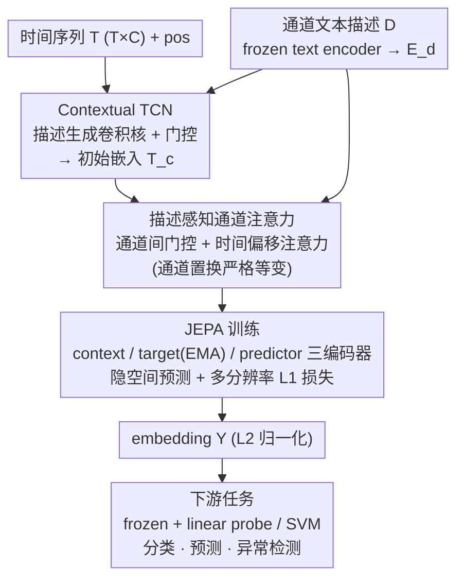

# CHARM: 用 Multimodal JEPA + 通道描述做时间序列 foundation embedding

**会议**: ICML 2026  
**arXiv**: [2605.31580](https://arxiv.org/abs/2605.31580)  
**代码**: 论文未提供  
**领域**: 时间序列 / Self-Supervised / Multimodal  
**关键词**: 时间序列基础模型, JEPA, 通道描述, equivariant attention, sensor embedding

## 一句话总结
CHARM 把通道文本描述（如"温度传感器 °C"）作为 inductive bias 注入时间序列 Transformer，用 JEPA 目标（latent prediction 而非 raw signal reconstruction）训练；得到的 embedding 在 anomaly detection、classification、forecasting 上用 linear probe 就能与 PatchTST/MOMENT/Moirai 等专用模型匹敌，且 channel-permutation 严格等变。

## 研究背景与动机

**领域现状**：时间序列模型在制造、能源、医疗、金融关键应用上很重要，但多数仍 narrow scope + task-specific。Foundation 模型在 NLP/CV/audio 大获成功，时间序列也开始有 forecasting foundation models（TimeFM、Moirai、Chronos），但 representation 仍 brittle、不适合 downstream 多任务。

**现有痛点**：(1) 多数 SSL 时间序列模型用 masked reconstruction 或 next-step prediction，要求 encoder impute raw signal——signal 噪声大、低分辨率、含 domain artifact，让 representation overfit sensor noise；(2) 几乎所有时间序列模型把 channels 当 uncategorized streams 处理，丢掉传感器 identity 这种关键 context；(3) UniTS 等扩展 reconstruction-based 思路但仍 ground 在 raw signal level。

**核心矛盾**：要 general-purpose embedding 就要 SSL；现有 SSL 目标（reconstruction）跟"我们想要 semantic representation"目标错位；要 sensor-aware 又要 channel order 不变。

**本文目标**：建一个 semantically grounded、channel-aware（用文本描述）、channel-order equivariant 的时间序列 foundation embedding 模型。

**切入角度**：(1) 用 JEPA 在 latent space 预测而非 raw signal，避免 reconstruction overfit noise；(2) 把每个 channel 的 text description 作为 inductive bias 通过 contextual TCN + attention gating 注入；(3) 设计 inter-channel time-offset attention 和 description-aware gating 保 channel permutation equivariance。

**核心 idea**：CHARM 把"sensor 给声音"——传感器文本描述参与 conv kernel 生成、attention 门控、time-offset embedding，让模型对 heterogeneous 传感器配置自适应；JEPA latent prediction + multi-resolution L1 loss 让 embedding 既细粒度又抽象稳健。

## 方法详解

### 整体框架

输入 tuple $\mathbf{t} = (\mathbf{T}, \mathbf{D}, \mathbf{pos})$ 其中 $\mathbf{T} \in \mathbb{R}^{T \times C}$ 是时间序列，$\mathbf{D}$ 是 $C$ 个 channel 的文本描述（frozen text encoder 编成 $\mathbf{E}_d$）。Contextual TCN 给 input 做 initial embedding $\mathbf{T}_c \in \mathbb{R}^{T \times C \times H}$；contextual attention layers 用 description-aware gating + inter-channel time-offset attention 融合时空通道信息；JEPA 三 encoder（context/target/predictor）做 latent prediction 训练。三个核心设计自上而下串成一条 pipeline——描述参与的卷积初始嵌入、描述感知的通道注意力、JEPA 隐空间预测，每一步都把"通道文本描述"作为贯穿全程的 inductive bias。

### 关键设计

**1. Contextual TCN：让传感器文本描述直接参与卷积核生成**

以前的 multivariate 时间序列模型用固定 patch 或简单卷积，换个 domain 就得手调感受野。CHARM 让通道描述来决定怎么卷：用 channel description embedding $\mathbf{E}_d$ 生成两样东西——Contextual Kernel Gating $\mathbf{G}_c = \mathrm{sigmoid}(\mathbf{E}_d \mathbf{W}_g)$ 对每层 conv 做 soft gating 控制有效感受野，以及 Contextual Kernels $\mathbf{G}_k = \mathbf{E}_d \mathbf{W}_k$ 直接从描述生成 conv filter。这样"温度传感器 °C"和"振动传感器"会拿到不同的卷积处理，卷积核跟传感器类型对齐，跨 domain transfer 不用再 retune。

**2. 描述感知的通道间注意力 + 时间偏移注意力：显式建模通道选择性交互和时滞，并保通道置换等变**

不同传感器之间该不该互相 attend、隔多久才相关，都该由传感器语义决定。CHARM 在 attention 层做三件事：(a) gating——算 pairwise 通道相似度 $\mathbf{S} = \mathbf{E}_d \mathbf{E}_d^\top$ 和阈值 $\mathbf{Z}[i,j] = \mathrm{sigmoid}(\mathbf{E}_d[i,:] \mathbf{W}_b \mathbf{E}_d[j,:]^\top)$，用门 $\mathbf{G}_d = \mathrm{ReLU}(\mathbf{Z} - \mathbf{S})$ 控制通道间能否 attend；(b) time-offset attention——用可学张量 $\boldsymbol{\Delta} \in \mathbb{R}^{C \times C \times 2T_{\max}}$ 显式表达通道间时滞，并对称构造 $\boldsymbol{\Delta}_{i,j,t} = \boldsymbol{\Delta}_{j,i,-t}$；(c) 把两者都塞进注意力 $\mathbf{A}_{[(i,p),(j,q)]} = \mathrm{Softmax}(\frac{\hat{\mathbf{Q}}\hat{\mathbf{K}}^\top}{\sqrt{D_e}} + \boldsymbol{\Delta}[i,j,q-p] - \lambda_G \mathbf{G}_d[i,j])$。这套设计的好处是通道置换严格等变（8 个数据集上随机打乱通道，输出最大差异 $<10^{-4}$），对传感器配置变化天然鲁棒，而对称 time-offset 张量也比 vanilla RoPE 更显式地刻画了通道间的 lag。

**3. JEPA 训练 + 多分辨率 L1 损失：在 latent 空间预测，躲开 raw signal 重建的噪声陷阱**

时间序列信号噪声大、分辨率低、含 domain artifact，用 masked reconstruction 当目标会让 encoder 去拟合传感器噪声。CHARM 改用 JEPA：三个 encoder——context（吃扰动数据）、target（吃干净数据，参数 EMA 更新）、predictor（窄版 context attention，预测被遮位置），SSL 任务分 causal prediction 和 smoothing 两种。损失用多分辨率 L1：per (channel, time) 细粒度 + per time 跨通道平均 + 跨通道跨时间全局平均，三个尺度都对齐，逼 embedding 同时学到细粒度和抽象结构；再加两个正则——$R_1$ 让通道相似度阈值偏稀疏、$R_2$ 对 time-offset 张量做 L2。在 latent 空间预测而非重建原始信号，既能滤掉传感器噪声、鼓励学高层时序结构，又避开了对比学习的负采样复杂度。消融里 JEPA 比 reconstruction 路线（MOMENT）在分类上高 7 个点，正是这一点的直接证据。

### 推理

学好后，CHARM 给 $\mathbf{Y} = \mathbf{E}_\theta(\mathbf{T}, \mathbf{D}, \mathbf{pos}) \in \mathbb{R}^{T \times C \times H}$（L2-normalized）。Downstream 任务用 frozen $\mathbf{Y}$ 接 linear probe / non-linear head 即可。

## 实验关键数据

### Forecasting：LSF benchmark（5 dataset × 4 horizon）

| Dataset | CHARM+LP | CHARM+NLH FT | Moirai-Large | Toto | TimeMixer++ | VisionTS |
|---------|----------|--------------|--------------|------|-------------|----------|
| Weather (MSE) | 0.230 | 0.222 | 0.226 | 0.242 | 0.269 | 0.228 |
| ETTm1 | 0.416 | 0.411 | 0.368 | 0.448 | 0.373 | 0.344 |
| ETTm2 | 0.220 | **0.208** | 0.269 | 0.322 | 0.281 | 0.259 |
| ETTh1 | 0.592 | 0.557 | 0.395 | 0.400 | 0.392 | 0.418 |
| ETTh2 | 0.323 | **0.316** | 0.339 | 0.341 | 0.333 | 0.352 |

CHARM 在 frozen embedding linear probe 下就在 ETTm2、ETTh2 上超过 billion-parameter Moirai-Large 和 Toto；fine-tune 后 3/5 ETT/Weather 上最低 MSE。

### Classification

| Method | Wins ↑ | Avg. Acc ↑ |
|--------|--------|------------|
| TS2Vec | 2 | 78.1 |
| T-Rep | 3 | 78.5 |
| MOMENT | 3 | 72.5 |
| MiniROCKET | 4 | 77.6 |
| **CHARM frozen+SVM** | **4** | **79.6** |

CHARM frozen + SVM 平均准确率最高 79.6%。

### 关键发现

- **Frozen embedding + Linear Probe 已 competitive**：在 ETTm2/ETTh2 击败 Moirai-Large，证明 channel-aware semantic representation 比 billion-parameter forecasting-specific 模型还好。
- **跨 task scalability**：anomaly + classification + forecasting 三大任务用同一组 embedding 都强，representation 真 general-purpose。
- **Channel Permutation Equivariance 严格验证**：max output difference < $10^{-4}$ 在 8 dataset 随机 permutation 测试。
- **JEPA > Reconstruction**：相比 MOMENT 用 reconstruction-based pretraining (Acc 72.5)，CHARM 用 JEPA latent prediction (79.6) 提升 7 个点，验证 latent prediction 比 raw signal reconstruction 更适合时间序列 representation。
- **Description 当 channel identifier**：作者明确"text descriptions serve as channel identifiers for cross-dataset generalization"——描述不是为了 language understanding 而是当 sensor type inductive bias。

## 亮点与洞察

- **从 NLP/CV 借 JEPA 到时间序列**：本文是第一个系统把 JEPA + latent prediction 移植到 multivariate time series，证明 cross-modal SSL transferability。
- **文本描述当 inductive bias 而非 caption**：以前 multimodal TS 把文字当 caption 学；本文把文字当"sensor type identifier"控制 conv kernel + attention，mechanistic 设计而非简单 concatenate。
- **Channel-permutation equivariance 通过 attention 设计实现**：symmetric time-offset tensor + description-aware gating 让模型对 sensor 顺序不变，可处理 heterogeneous fleet。
- **Multi-resolution L1 loss 防 representation collapse**：fine + coarse 双层对齐让 embedding 多 granularity 都有意义。
- **Frozen + Linear Probe 超过 billion-param Moirai**：parameter efficiency 的 striking demonstration，对工业部署很有 implication。
- **JEPA + 描述 + equivariance 三者协同**：单 JEPA 没 sensor-aware；单描述没 noise robustness；单 equivariance 没 semantic representation。三者组合才是 foundation embedding 真正缺的拼图。

## 局限与展望

- **依赖 channel description quality**：sensor description 写得不好（缺单位、语义模糊）会拖累 contextual TCN 和 attention gating；实际部署需要 description 工程化。
- **Cross-domain transferability**：实验在常见 LSF benchmark 验证，但 cross-industry transfer（如医疗 → 制造）的 representation reuse 没系统测。
- **JEPA EMA target 训练稳定性**：JEPA 在 vision 上 well-known 有 collapse 风险，时间序列上长 trajectory 训练是否稳定需要更多实证。
- **Time-offset tensor $\boldsymbol{\Delta}$ 内存**：$\mathbb{R}^{C \times C \times 2T_{\max}}$ 在 $C$ 大（如 500 sensor）时内存爆炸，需要 sparse 或 low-rank approximation。
- **没和 reconstruction-based foundation models 在 anomaly detection 上大规模比**：anomaly detection 是 reconstruction 的传统强项，CHARM 在这上的优势没充分量化。
- **Long-horizon forecasting (720) 上仍输 Moirai/Toto**：ETTh1 上 CHARM 0.592 vs Moirai 0.395，long-horizon 还有 gap；JEPA 学的是 semantic 而非 fine-grained signal，long-term precision 可能受限。

## 相关工作与启发

- **vs MOMENT / UniTS**：他们用 reconstruction-based pretraining 在 raw signal level；CHARM 用 JEPA latent prediction 更 noise robust，classification +7 个点。
- **vs Moirai / TimesFM / Chronos / TimeFM**：billion-parameter forecasting foundation models 专用 forecasting；CHARM 用 channel-aware embedding 做 general-purpose representation，frozen 也能 match 它们。
- **vs PatchTST / iTransformer**：他们 token 化 patches/channels；CHARM 用描述生成 conv kernel + attention gating，更细粒度 sensor-aware。
- **vs I-JEPA (Assran et al. 2023)**：vision 上的 JEPA 原型，本文是 multivariate TS 的 JEPA 移植 + 增强（multi-resolution loss + description-aware attention）。
- **vs CLIP for TS**：CLIP-style contrastive 把 text 当 caption；本文把 text 当 inductive bias，机制层面不同。
- **启发**：(1) "文本描述当 inductive bias 而非 caption"思路可推广到其他 heterogeneous data（点云、医学影像、多传感器融合）；(2) JEPA latent prediction 在 noisy/low-resolution 数据上比 reconstruction-based SSL 更适合；(3) Channel permutation equivariance 通过 symmetric tensor + description gating 实现是 reusable architectural pattern。

## 评分

- 新颖性: ⭐⭐⭐⭐⭐ JEPA 移植 + description-as-inductive-bias + channel-permutation equivariance 三件创新组合，方法学层面全面。
- 实验充分度: ⭐⭐⭐⭐ Forecasting + Classification + Anomaly Detection 三大任务 + 多基线对比扎实；缺 cross-industry transfer 实验和 multi-billion-parameter 公平比较。
- 写作质量: ⭐⭐⭐⭐ 架构 figure 清晰、loss 数学详细；少数设计选择（symmetric tensor 构造、multi-resolution L1）的 ablation 放 appendix 减弱主文论证。
- 价值: ⭐⭐⭐⭐ Frozen + Linear Probe 媲美 billion-param 模型让中小研究组也能用强 TS representation；channel description 思路对 industrial sensor fleet 部署有直接实战价值。

<!-- RELATED:START -->

## 相关论文

- [\[ICML 2026\] Text-Conditional JEPA for Learning Semantically Rich Visual Representations](text-conditional_jepa_for_learning_semantically_rich_visual_representations.md)
- [\[ICML 2025\] M3-JEPA: Multimodal Alignment via Multi-gate MoE based on JEPA](../../ICML2025/multimodal_vlm/m3-jepa_multimodal_alignment_via_multi-gate_moe_based_on_the_joint-embedding_pre.md)
- [\[ICML 2026\] Circle-RoPE: Cone-like Decoupled Rotary Positional Embedding for Vision-Language Models](circle-rope_cone-like_decoupled_rotary_positional_embedding_for_large_vision-lan.md)
- [\[CVPR 2026\] Scaling Spatial Intelligence with Multimodal Foundation Models](../../CVPR2026/multimodal_vlm/scaling_spatial_intelligence_with_multimodal_foundation_models.md)
- [\[ICLR 2026\] U-MARVEL: Unveiling Key Factors for Universal Multimodal Retrieval via Embedding Learning](../../ICLR2026/multimodal_vlm/u-marvel_unveiling_key_factors_for_universal_multimodal_retrieval_via_embedding_.md)

<!-- RELATED:END -->
