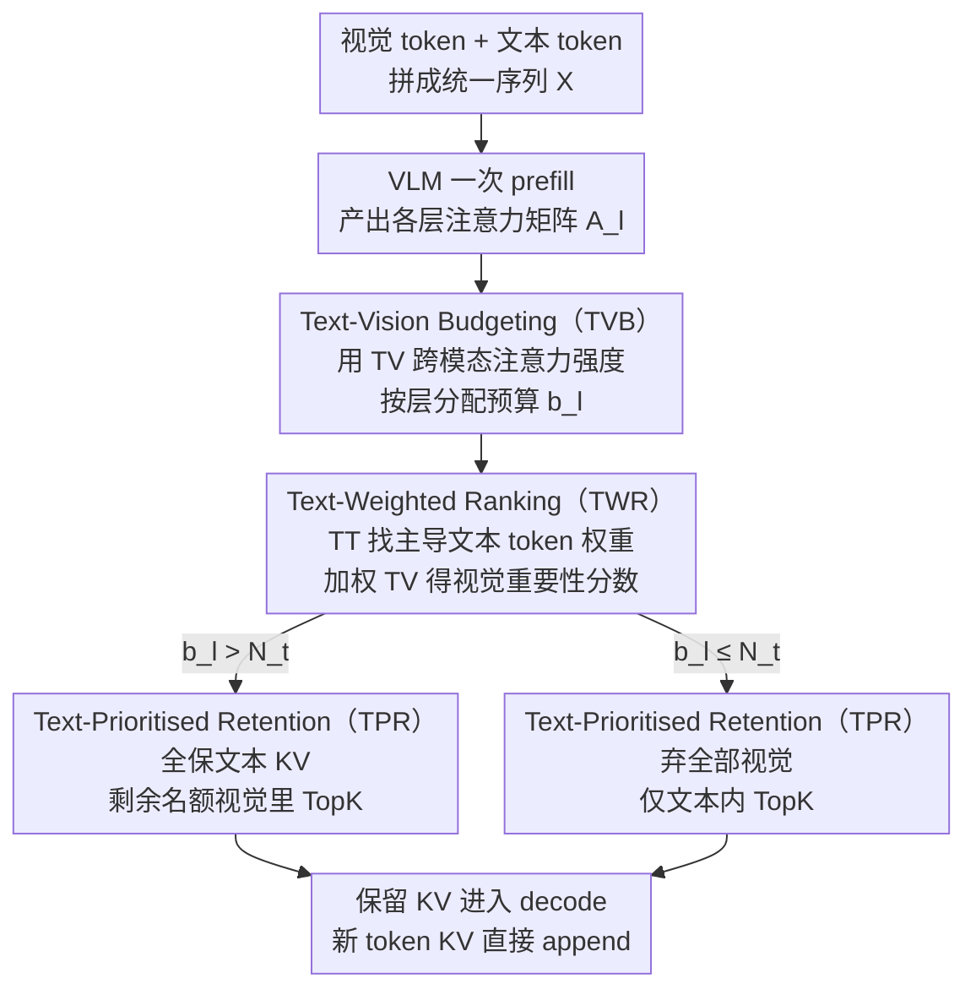

# TGV-KV: Text-Grounded KV Eviction for Vision-Language Models

**会议**: ICML2026  
**arXiv**: [2606.03075](https://arxiv.org/abs/2606.03075)  
**代码**: 论文中提供 "Code Link"，正式仓库待开源  
**领域**: 多模态VLM  
**关键词**: VLM 推理加速, KV cache eviction, 模态间注意力, 文本引导, 预算分配  

## 一句话总结
TGV-KV 通过"用文本注意力来支配视觉 KV"的三件套——按 text-vision 注意力分层预算、用主导文本 token 加权重排视觉重要性、并在驱逐时优先保住文本 KV——把为纯文本 LLM 设计的 KV eviction 思路成功迁移到 VLM，在 LLaVA-NeXT/Qwen3-VL 上 5% 保留率下仍能保住接近满 KV 的精度，吞吐量提升 52.6%。

## 研究背景与动机

**领域现状**：VLM 沿用了 LLM 的自回归生成范式，把所有历史 token 的 K/V 都缓存起来以避免重计算。然而高分辨率图像和长视频动辄占用上千甚至上万 token，KV cache 内存随上下文线性增长，是 VLM 推理的主要瓶颈。围绕 LLM 已经发展出一整套 KV cache eviction 方法，如 H2O、SnapKV、PyramidKV、Ada-KV 等，通过注意力分数或观察窗口来决定丢弃哪些 KV。

**现有痛点**：把这些 LLM 上验证过的 eviction 方法直接搬到 VLM 后，性能下降非常剧烈。论文用 LLaVA 上 5% 保留率的实验显示，SnapKV 在 ChartQA 上从 18.0 直接跌到 0.4，几乎完全失效。这说明 LLM 的 KV 重要性度量在 VLM 上根本不适用。

**核心矛盾**：作者把这种崩塌归因于 VLM 中显著的"模态鸿沟"，并用三张实验图证实：(1) 视觉 token 之间高度同质，文本 token 则非常多样化；(2) 文本-视觉跨模态注意力区域是一片"低注意力洼地"，单模态内的 attention 强度远高于跨模态；(3) 把全部层的累积注意力相加后，文本与视觉边界出现剧烈跳变，导致单纯按"累积 attention"排序时大多数文本 KV 会被先驱逐——而文本 KV 又是 VLM 中最脆弱的部分。

**本文目标**：在不微调模型的前提下，设计一套"原生为 VLM 服务"的 KV eviction 流水线，同时解决三个子问题——如何按层分配预算、如何度量跨模态的 KV 重要性、以及当预算紧张到只能舍弃一部分模态时该舍弃谁。

**切入角度**：作者通过系统性的注意力解构得到三条关键观察：层间预算应由 text-vision (TV) 跨模态注意力强度决定；KV 重要性应由 TV+TT 而不是 VV 决定；text KV 极其敏感、vision KV 极其冗余，因此预算紧张时应优先保护 text KV。

**核心 idea**：用文本来"接地"整个 eviction 流程——文本不只是被 evict 的对象，更是判断"哪些视觉 KV 重要"的锚点。

## 方法详解

### 整体框架
TGV-KV 是一个 plug-in 的 KV cache 控制器，部署位置在 prefill 结束之后、decode 阶段之前；不改动模型权重也不需要校准数据集。整个推理流程的输入是把 vision encoder 输出的 $N_v$ 个视觉 token 与 $N_t$ 个文本 token 拼成统一序列 $\mathbf{X} \in \mathbb{R}^{(N_v+N_t) \times d}$，VLM 走完一次 prefill 得到每一层的注意力矩阵 $\mathbf{A}_l$ 之后，TGV-KV 顺序触发三个子模块：(1) TVB 用 TV 注意力的层间分布把总预算 $B$ 切到每层 $b_l$；(2) TWR 在每层内对所有 KV 计算一个"text-weighted"重要性分数；(3) TPR 按重要性 TopK 选择保留集合，并强制把所有 text KV 排在前面。最终保留的 KV 在 decode 阶段被持续访问，新生成 token 的 KV 直接 append 即可。

### 关键设计

**1. Text-Vision Budgeting（TVB）：用跨模态注意力强度当层间预算的"晴雨表"**

KV eviction 第一步要决定每层留多少。作者发现层与层之间"跨模态信息融合"的剧烈程度差别很大，融合越剧烈的层越值得多留 KV。于是 TVB 从第 $l$ 层注意力里切出 text 对 vision 的子块 $\mathbf{A}_l^{(TV)} = \mathrm{softmax}(\mathbf{Q}_l^{(T)} [\mathbf{K}_l^{(V)}]^{\mathsf T}) \in \mathbb{R}^{N_t \times N_v}$，求和得到"该层 text 向 vision 索取信息的总强度"，再按层归一化成预算比例 $b_l^{(TV)} = \sum_{i,j} [\mathbf{A}_l^{(TV)}]_{ij} / \sum_{l'} \sum_{i,j} [\mathbf{A}_{l'}^{(TV)}]_{ij}$，乘上全局预算 $B$ 就是这一层的 KV 名额。对照实验里，换成 VV、TT 或均匀分配在 5% 保留率下都明显落后于 TV——只有 TV 强度直接对应"跨模态融合有多激烈"，预算才自然向中间那些融合最重的层倾斜，比 PyramidKV 的规则化金字塔更鲁棒。

**2. Text-Weighted Ranking（TWR）：让"主导文本 token"来给视觉 KV 加权重排**

层内每个 KV 要算重要性分数，难点是视觉重要性必须随用户指令变化——"描述这张图"和"路灯旁是否有出租车"该保留的视觉区域完全不同。TWR 先在文本侧识别那些贯穿后文、被持续关注的"主导 text token"（attention map 里的纵向亮线）：按 TT 子块算每个 text token 的被关注程度，再除以它右下三角被关注的次数 $N_t - j + 1$ 取平均 $w_{l,j} = \sum_{i \ge j} [\mathbf{A}_l^{(TT)}]_{ij} / (N_t - j + 1)$，归一化成 $\tilde w_{l,i}$。然后用这些权重去重新加权 $\mathbf{A}_l^{(TV)}$ 的每一行，得到视觉 token 的最终分数 $s_{l,j}^{(V)} = \sum_i \tilde w_{l,i} [\mathbf{A}_l^{(TV)}]_{ij}$；文本侧则直接取自身列和 $s_{l,j}^{(T)} = \sum_{i \ge j} [\mathbf{A}_l^{(TT)}]_{ij}$。消融显示纯 self-attention 或 VV+TT 当重要性指标几乎崩溃（ChartQA 5% 只有 4 分多），换成 TV+TT 加权后视觉 KV 的保留方向才真正贴合当前提问。

**3. Text-Prioritised Retention（TPR）：预算先填满文本，剩下的才轮到视觉**

最后按预算和分数选保留集合。作者用一组极简的随机驱逐实验把约束钉死了——5% 保留率下随机优先驱逐视觉还能维持 10–46 分，随机优先驱逐文本则直接掉到 0.2 分，说明 text KV 极敏感、vision KV 极冗余，对 text 做任何"按分数公平排序"都不安全。TPR 因此用一条分段规则：若层预算 $b_l > N_t$，所有 text KV 无条件保留，剩下 $b_l - N_t$ 个名额按 $s_{l,j}^{(V)}$ 在视觉里做 TopK；若 $b_l \le N_t$，干脆连视觉都不要，只在文本内部按 $s_{l,j}^{(T)}$ 选 TopK。这条非对称策略把"文本不能丢"的硬约束直接写进了算法。

### 损失函数 / 训练策略
TGV-KV 是纯推理时的算法，不引入任何额外训练或微调，也不需要校准数据集；所有的预算和重要性计算都基于 prefill 一次产出的注意力矩阵，因此可以即插即用部署到任意基于标准 self-attention 的 VLM 上。

## 实验关键数据

### 主实验

作者在 LLaVA-1.5-7B / LLaVA-NeXT-7B / LLaVA-OV / Qwen3-VL-4B/8B 上覆盖了 ChartQA、DocVQA、VizWiz、TextVQA、TextCaps、COCO-Caption、Video-TT 等任务，与 StreamingLLM、SnapKV、H2O、ElasticCache、PrefixKV 等基线对比。下表抽取了最具代表性的 LLaVA 5% 极限保留率结果（数据来自论文摘要与 Table 2 的数值）：

| 模型 / 任务 | 指标 | 全 KV (Vanilla) | TGV-KV (5%) | 与全 KV 比 |
|--------|------|------|------|------|
| LLaVA-NeXT / VizWiz-VQA | Acc. | 100% | 99.2% | -0.8 pt |
| Qwen3-VL-8B / DocVQA | ANLS | 100% | 92.5% | -7.5 pt |
| LLaVA-1.5 / ChartQA (vs best baseline) | Relaxed Acc. | 18.0 | 大幅领先 (+33.0 pt 相对最强 baseline) | / |
| LLaVA-NeXT 端到端 | 吞吐量 | 1.0× | 1.526× | +52.6% |
| 各模型 | KV 内存 | 1.0× | 0.05× | -95% |

可以看到 TGV-KV 在极限压缩下仍能逼近满 KV 精度，对 LLaVA 系列尤其稳健；在 DocVQA 这种密集文本 OCR 任务上，5% 预算依然保住了 9 成多的 ANLS。

### 消融实验

下表汇总了论文 Table 1 中三组关键对照（LLaVA, 5% 保留率），用于验证 TGV-KV 三个模块各自的必要性：

| 设置 | ChartQA ↑ | TextVQA-lite ↑ | 说明 |
|------|---------|---------|------|
| Vanilla | 18.0 | 47.9 | 满 KV |
| Uniform layer budget + TV+TT 重要性 | 14.3 | 36.4 | 不用 TVB |
| TV layer budget + TV+TT 重要性（≈TVB） | 14.3 | 36.4 | TVB 提供更优的层间结构 |
| Uniform + Observation Window | 0.4 | 8.7 | 替换重要性指标即崩塌 |
| Uniform + 纯 self-attention | 4.8 | 23.5 | LLM 流派失效 |
| Uniform + VV+TT 重要性 | 4.6 | 22.8 | 缺 TV 就垮 |
| Uniform + TV+TT 重要性 | 11.0 | 37.3 | TWR 的雏形已显效 |
| Uniform + 优先驱逐 text | 0.2 | 4.4 | 验证 TPR 的反向上界 |
| Uniform + 优先驱逐 vision | 10.0 | 31.0 | 文本保护是关键 |

### 关键发现
- 真正决定崩塌与否的是"重要性度量"而不是"层预算"——观察窗口或纯 self-attention 在 5% 都会直接跌到个位数，引入 text-vision 注意力后立刻能拉到两位数。
- "把 text 当锚点"是 VLM KV eviction 的硬性结论：随机优先驱逐文本会让 ChartQA 直接掉到 0.2，VizWiz 系列任务上 99.2% 的保留也只有在 TPR 协同下才能稳住。
- TVB 的 TV 强度信号能让层预算自然向"信息融合最剧烈"的中间层倾斜，比 PyramidKV 那种规则化金字塔分配更鲁棒，因为它对模型架构和任务都无关。
- 吞吐量 +52.6% 主要来源于 95% 的内存压缩使得更大 batch 与更长 sequence 成为可能，TGV-KV 本身的预算/打分开销可以并入 prefill 完成的注意力矩阵中复用，没有额外推理预算。

## 亮点与洞察
- **把模态鸿沟从"问题"翻译成"信号"**：以往工作把 TV 区域的"低 attention 洼地"视为缺陷，本文反过来把这片洼地的相对强度（哪一层更高）作为预算分配的核心信号，相当于把"病灶"变成"诊断仪"。
- **"主导 text token"加权**让视觉 KV 重要性首次对指令敏感：同一张图在"描述一下"和"是否有出租车"两条 prompt 下，被保留的视觉 KV 会自动倾斜到不同区域，这是 H2O/SnapKV 这类 prompt-无关方法做不到的。
- **非对称保护策略**：作者用一组极简的随机实验（随机驱逐 text vs 随机驱逐 vision）就把"文本不能丢"这一硬约束钉死了，再用 TPR 的分段公式优雅地把硬约束写入算法，这种"先用实验找到上下界、再用最简单的策略卡住边界"的论证方式很值得复用。
- 整套方法 0 训练 0 微调 0 校准数据，迁移到任意基于标准 self-attention 的 VLM 都只需一遍 prefill 注意力矩阵，工程友好度非常高。

## 局限与展望
- 论文为了保证并行性，明确放弃了 head-wise 的预算分配；如果未来 attention kernel（如 PagedAttention、FlashDecoding-v2）允许更细粒度的 head budget 而不破坏并行，TGV-KV 还有继续往细粒度走的空间。
- TVB/TWR 都依赖 prefill 阶段产生的注意力矩阵——对采用 FlashAttention 这类不显式 materialize attention 的部署链路，需要额外的一次"轻 attention 重算"才能拿到 TV/TT 子块，部署时这部分开销需要被纳入算账。
- 极限 5% 预算下虽然吞吐 +52.6%，但论文报告的延迟收益在 Qwen3-VL-8B 上的细分布尚不清晰；当上下文以视频帧为主时（动辄上万 token）TGV-KV 与 token pruning（FastV、VisionZip）的组合策略值得继续研究。
- TPR 当前是硬规则（text 优先满），对一些"图重文轻"的极端 caption 场景可能过度保护文本；引入可学习的模态优先权或基于任务自适应的优先级或可进一步改进。

## 相关工作与启发
- **vs H2O / SnapKV / StreamingLLM**：这三者均为 LLM 设计，重要性指标只看自注意力或观察窗口。本文证明在 VLM 上这套思路会因为模态鸿沟导致大量 text KV 被错误驱逐，根本性失败；TGV-KV 改用 TV+TT 加权才恢复可用。
- **vs PyramidKV / Ada-KV**：它们用固定规则或额外校准来分配层间预算；TVB 用一遍 prefill 的 TV 注意力强度做动态分配，无需校准集，且与具体 VLM 架构解耦。
- **vs AirCache**：同样意识到"text 重要"，但 AirCache 需要额外计算去识别关键 text token，且未做层间互信息流分析；TGV-KV 把"主导 text token"识别复用自 TT 子块，并把信息流分析直接挂在 TV 注意力强度上，开销更小、覆盖更全。
- **vs FastV / VisionZip / CDPruner（token pruning）**：它们在 prefill 之前/之中一次性砍掉视觉 token，被砍 token 永久消失；TGV-KV 在 KV 层面做 eviction，且允许后续层根据预算保留更多视觉信息，灵活性更高，可与上述 pruning 串联使用做"先减 token、再压 KV"的组合压缩。

## 评分
- 新颖性: ⭐⭐⭐⭐ 把"模态鸿沟"从故障源头反转为预算分配信号是非常清爽的视角创新，三模块各自有对照实验支撑。
- 实验充分度: ⭐⭐⭐⭐⭐ 五个不同规模与架构的 VLM、图像 + 视频任务、5 个 baseline，并且 5%/10%/20%/50% 多档对比，consensus 很强。
- 写作质量: ⭐⭐⭐⭐ 三个 Observation 的递进论证非常清晰，公式记号规范；个别注意力图与文字描述位置略远。
- 价值: ⭐⭐⭐⭐⭐ 提供了一个 0 训练即插即用的 VLM 推理压缩方案，95% 内存节省与 +52.6% 吞吐意味着实际部署的直接收益，工业可用性强。

<!-- RELATED:START -->

## 相关论文

- [\[ACL 2025\] MadaKV: Adaptive Modality-Perception KV Cache Eviction for Efficient Multimodal Long-Context Inference](../../ACL2025/multimodal_vlm/madakv_adaptive_modality-perception_kv_cache_eviction_for_efficient_multimodal_l.md)
- [\[CVPR 2026\] FlashCache: Frequency-Domain-Guided Outlier-KV-Aware Multimodal KV Cache Compression](../../CVPR2026/multimodal_vlm/flashcache_frequency_kv_cache_compression.md)
- [\[ICLR 2026\] Mixing Importance with Diversity: Joint Optimization for KV Cache Compression in Large Vision-Language Models](../../ICLR2026/multimodal_vlm/mixing_importance_with_diversity_joint_optimization_for_kv_cache_compression_in_.md)
- [\[NeurIPS 2025\] PrefixKV: Adaptive Prefix KV Cache is What Vision Instruction-Following Models Need for Efficient Generation](../../NeurIPS2025/multimodal_vlm/prefixkv_adaptive_prefix_kv_cache_is_what_vision_instruction.md)
- [\[ICML 2026\] Contextualized Visual Personalization in Vision-Language Models](contextualized_visual_personalization_in_vision-language_models.md)

<!-- RELATED:END -->
