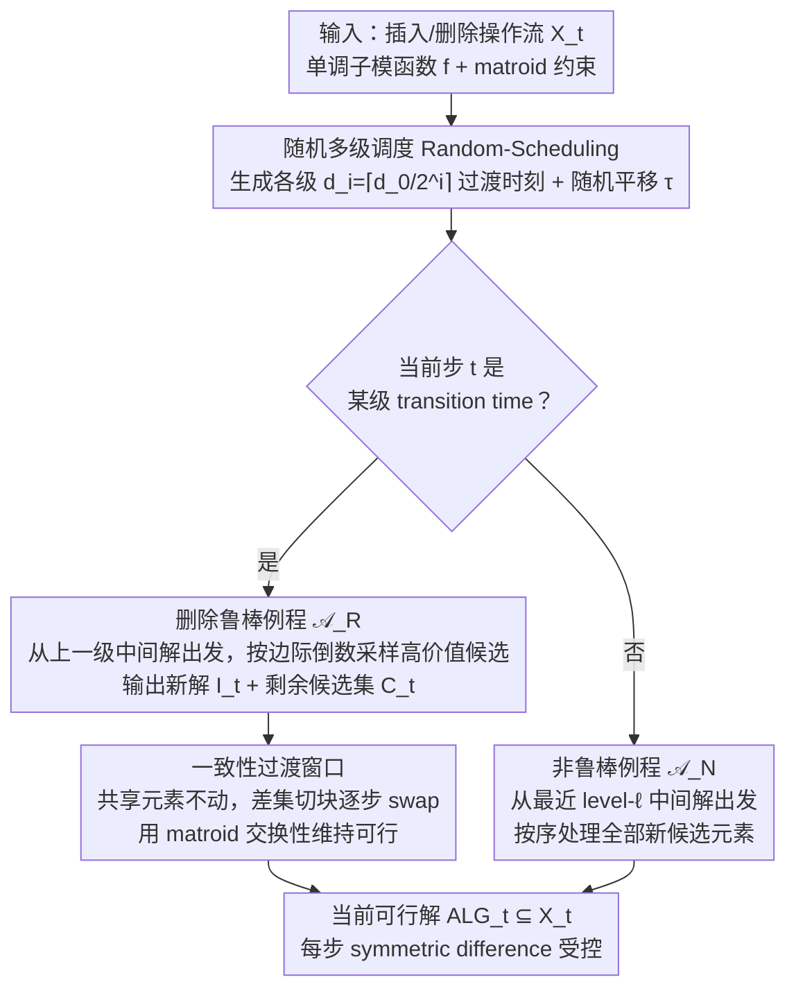

# A General Framework for Dynamic Consistent Submodular Maximization

**会议**: ICML2026  
**arXiv**: [2606.04946](https://arxiv.org/abs/2606.04946)  
**代码**: 论文未提供代码  
**领域**: 优化 / 子模最大化 / 动态算法  
**关键词**: 子模最大化、动态算法、一致性、删除鲁棒、Matroid 约束  

## 一句话总结
这篇论文给出了 fully dynamic 子模最大化的一般一致性框架，在允许插入和删除的流式环境中，首次为 cardinality 与 matroid 约束同时实现常数近似和次线性级别的 worst-case 每步解变动。

## 研究背景与动机
**领域现状**：子模最大化常用于数据摘要、推荐、主动学习、稀疏选择等任务。传统动态算法更关注更新后能否快速维护近似最优解，而近期 consistent optimization 还要求每次更新后给用户展示的解不要大幅改变。

**现有痛点**：已有一致性子模最大化主要研究 insertion-only 场景。只插入时，旧解通常不会因为新元素出现而立刻失效；但 fully dynamic 场景还包含删除，一个关键元素被删后，最优解可能需要整体重构。直接重跑动态算法会有好近似，却可能一次替换掉大量元素。

**核心矛盾**：近似性希望解快速跟随当前最优，稳定性希望每一步只改少量元素。插入和删除会让当前最优值上下波动，无法依赖 insertion-only 中常用的单调性分析；matroid 约束还限制了可交换元素集合，使修复旧解更困难。

**本文目标**：构造一个模块化框架，只要给定合适的 robust submodular routine 和 non-robust routine，就能在 fully dynamic 环境下维护高价值可行解，并把每步 symmetric-difference 变化控制在小规模。

**切入角度**：作者借用 deletion-robust 子模最大化中的 coreset 思想，但不是预先知道删除数，而是维护多个 robustness levels；同时用随机调度把不同 level 的重算分散到 transition windows 中，避免一次性大规模替换。

**核心 idea**：周期性地为不同删除鲁棒级别重算候选解，并在短窗口内逐块过渡，让“全局重构”被摊成多次小变动。

## 方法详解
论文考虑一个 oblivious adversary 给出的操作序列，每步插入或删除一个元素。算法在每个时间 $t$ 维护可行解 $ALG_t\subseteq X_t$。目标有两个：近似性要求 $\mathbb{E}[f(ALG_t)]\geq \alpha f(OPT_t)$；一致性要求相邻解的 symmetric difference $|ALG_t\triangle ALG_{t-1}|$ 被某个小量 $C$ 控制。

### 整体框架
框架由三部分组成：Random-Scheduling、鲁棒例程（robust routine）$\mathcal{A}_R$、非鲁棒例程（non-robust routine）$\mathcal{A}_N$。Random-Scheduling 根据最大和最小鲁棒参数 $d_0,d_\ell$ 生成多级 transition times，每一级对应一个删除鲁棒级别（deletion robustness level）。某个 transition time 到来时，算法调用鲁棒例程重新计算该级别的中间解和剩余候选集，并在随后的过渡窗口里把解逐步切换过去；在普通时间步（不在任何过渡窗口内），算法从最近一次最细级别（level $\ell$）transition 留下的中间解出发，用非鲁棒例程处理新候选元素。

关键不只是何时重算，更是如何展示解。过渡窗口（transition window）内，算法不立刻把旧解替换成新解，而是把新旧差集切成若干块，每一步只换一块，并始终保持 matroid 可行性。这样，即使内部中间解变化很大，用户看到的 $\text{ALG}_t$ 也只发生受控变化。

### 关键设计

**1. 随机多级调度 Random-Scheduling：把"何时重算"离线定好**

fully dynamic 的麻烦在于删除规模未知且随时间变化——删 1 个还是删 $k$ 个事先不知道。框架不去猜单一删除预算，而是同时维护一族鲁棒级别 $d_i=\lceil d_0/2^i\rceil$（从最大 $d_0$ 递减到最小 $d_\ell$），让不同级别分别防御不同规模的删除。Random-Scheduling 在算法开始时一次性把时间轴递归切块：level 0 按长度 $d_0$ 分段、每段开头留出长 $\varepsilon' d_0$ 的过渡窗口，剩余区间再递归二分给下一级，直到最细级别 $d_\ell$；最后对所有时刻做一次均匀随机的循环平移 $\tau$。这个随机平移是分析的关键——它保证任意固定时刻落入过渡窗口的概率至多 $\varepsilon$（Lemma 3.2），从而能把"过渡期内近似性变差"的损失平均掉；调度同时保证各级过渡窗口互不重叠。高鲁棒级别重算频率低、低鲁棒级别重算更勤，恰好匹配"大删除少见、小删除频繁"的直觉。

**2. 删除鲁棒例程 $\mathcal{A}_R$ 与剩余候选集：留住一个抗删除的候选残集**

每到一个 transition time，框架就调用鲁棒例程 $\mathcal{A}_R$，输入是上一级的中间解 $I_{t'}$、候选集 $X_t\setminus(X_{t'}\setminus C_{t'})$ 和该级鲁棒参数 $d_i$，输出更新后的解 $I_t$ 和一个**剩余候选集** $C_t$。它的核心是 deletion-robust coreset 的采样思想：matroid 情形用 Robust-Swap，按元素边际贡献 $f(u\mid I)$ 的**倒数**为概率采样候选（边际越小越可能被换进来，避免解过度依赖少数高价值元素），并不断滤掉边际不够高的候选，直到候选数降到 $d/\varepsilon$ 以下才停；cardinality 情形用更简单的 Robust-Greedy，单一鲁棒级别即可。之所以要留下 $C_t$ 而不是把候选用尽，是因为这些"留着没用完"的高价值元素正是删除发生后的修补储备——当某个支配性元素被删，可以从 $C_t$ 里用很少的变动补回价值，而不必重建整个解。

**3. 非鲁棒例程 $\mathcal{A}_N$：普通步上的轻量跟进**

绝大多数时间步并不是 transition time，这些普通步由非鲁棒例程 $\mathcal{A}_N$ 处理：它从最近一次最细级别（level $\ell$）transition 留下的中间解 $I_{t'}$ 出发，把候选集 $X_t\setminus(X_{t'}\setminus C_{t'})$ 里的元素**全部**按固定顺序处理一遍（matroid 用 Swap：仅当某元素边际贡献至少是被替换元素的两倍时才换入），不采样、不提前停止。它不负责抗删除（那是 $\mathcal{A}_R$ 已经铺好的底子），只负责让解快速吸收新插入的元素、维持近似性。两类例程通过候选集 $X_t\setminus(X_{t'}\setminus C_{t'})$ 衔接：上一级输出的、仍然活跃的候选会被下一级例程继续处理，形成层级化的解维护。

**4. 一致性过渡窗口：把一次大重构摊成多步小替换**

鲁棒例程算出的新解 $I_t$ 可能和当前解 $\text{ALG}_\text{old}$ 差很多，直接替换会让单步的 symmetric difference 大到 $\Theta(k)$，违反一致性。过渡窗口的做法是：新旧解的共同元素 $\text{Shared}_t=\text{ALG}_\text{old}\cap I_t$ 始终不动，只把 $I_t\setminus\text{ALG}_\text{old}$ 和 $\text{ALG}_\text{old}\setminus I_t$ 各切成 $\varepsilon' d_i$ 个等大的块，在接下来的 $\varepsilon' d_i$ 步里每步换入一块、换出一块，于是窗口内第 $j$ 步维护的解是 $\text{ALG}_t=X_t\cap(\text{Shared}_t\cup I_t^{:j}\cup \text{ALG}_\text{old}^{j:})$，并用 matroid 的交换性质保证每一步都可行。这一机制把"算法内部为了近似性可以大改"和"对外暴露的解必须稳定"彻底解耦——内部中间解怎么重算都行，用户看到的解每步只变 $O(1/\varepsilon^2)$（cardinality）或 $O(\log k/\varepsilon^2)$（matroid）个元素。

### 损失函数 / 训练策略
这篇是理论算法论文，没有神经网络训练损失。它的“目标函数”是 monotone submodular function $f$，约束包括 cardinality 或 matroid independent set。算法使用 value oracle 和 matroid feasibility oracle；分析同时给出近似比、一致性和摊还 oracle 调用复杂度。

## 实验关键数据

### 主实验
论文没有经验实验，主结果是理论保证。下面用结果表替代传统主实验表，关注 fully dynamic 设定下的近似比与一致性。

| 设定 | 本文算法 | 近似保证 | 一致性保证 | 相比已有工作的意义 |
|------|----------|----------|------------|--------------------|
| Cardinality constraint | ConsistentCardinality | $1/2-3\varepsilon$ | $O(1/\varepsilon^2)$ | fully dynamic 下接近已知动态子模最大化的 $1/2$ 水平，同时保持常数级每步变动 |
| Rank-$k$ matroid constraint | ConsistentMatroid | $1/4-7\varepsilon$ | $O(\log k/\varepsilon^2)$ | 匹配 streaming matroid 中经典 $1/4$ 近似级别，但允许删除且只需对数级一致性 |
| Fully dynamic generic framework | Random scheduling + robust/non-robust routines | 由例程决定 | 由 transition window 与 $d_i$ 决定 | 把一致性动态算法拆成可复用模板 |
| Prior insertion-only cardinality | 常数 recourse 算法 | 约 0.51 或理论上界 | 常数一致性 | 不处理删除，最优值单调性更强 |

### 消融实验
作为理论论文，它没有 empirical ablation；可把框架组件的作用视为分析型消融。

| 配置 / 组件 | 关键指标 | 说明 |
|-------------|----------|------|
| 去掉 robust routine | 删除后可能一次失去关键元素 | 不能保证候选集中仍有足够价值的替代元素，fully dynamic 场景会崩 |
| 去掉多级 robustness | matroid 下删除尺度难覆盖 | 单一级别要么重算太频繁，要么对大删除不鲁棒，难得到 $O(\log k/\varepsilon^2)$ |
| 去掉 transition window | 近似仍可好，但一致性失控 | 新旧解直接替换时 symmetric difference 可达 $\Theta(k)$ |
| 去掉 random shift | 某些固定时间总落在 transition | 近似分析无法用“非 transition 概率至少 $1-\varepsilon$”来控制损失 |
| Cardinality 专用 Robust-Greedy | $1/2-3\varepsilon$，$O(1/\varepsilon^2)$ | 利用 uniform matroid 的简单结构，只需单一鲁棒级别 |

### 关键发现
- fully dynamic 的难点主要来自删除，而不是插入。删除一个支配性元素可能迫使最优解整体变化，必须提前保留鲁棒候选结构。
- matroid 约束比 cardinality 约束难很多，因为可交换元素受独立性约束限制；这解释了为什么 matroid 结果是 $1/4$ 而 cardinality 是 $1/2$。
- 一致性不是摊还意义，而是 worst-case 每一步的 symmetric difference，这比许多动态算法的 amortized update 更贴近用户面对稳定推荐/摘要时的需求。

## 亮点与洞察
- 框架的模块化很强。调度、一致性过渡和子模例程被拆开，使得未来如果有更好的 robust routine，可以直接替换并继承一致性机制。
- 用随机 shift 分散 transition loss 是一个简洁但有效的技巧。它不强行保证每个时刻都处于最佳近似状态，而是保证固定时间有高概率不在过渡期。
- 论文把 deletion-robust coreset 思想搬到 online fully dynamic 场景，并通过多个 robustness levels 处理未知、变化的删除规模，这一点比静态 deletion-robust 更贴近实际流式系统。

## 局限与展望
- 结果主要是理论保证，缺少真实数据摘要、推荐或主动学习任务上的运行时间和稳定性实验。实际 oracle 成本可能较高，尤其 matroid 情况下 independence oracle 调用可观。
- 近似比仍是常数级，matroid 下只有 $1/4-O(\varepsilon)$。如果应用对质量非常敏感，可能需要结合更强的 offline 或 dynamic submodular routine。
- 框架假设 adversary oblivious，且分析中使用随机化。面对 adaptive adversary 或非单调子模函数时，保证不能直接套用。
- transition window 内的逐块交换需要实现细节支持，尤其在复杂 matroid 中如何高效找可行交换块，仍有工程挑战。

## 相关工作与启发
- **vs insertion-only consistent submodular maximization**: 之前工作能做到常数一致性和较好近似，但依赖只插入的单调结构；本文扩展到插入和删除同时存在，代价是更复杂的鲁棒调度。
- **vs deletion-robust submodular maximization**: deletion-robust 方法通常给定一个固定删除预算 $d$；本文需要在线维护多个 $d_i$，因为未来删除规模未知且随时间变化。
- **vs fully dynamic submodular algorithms**: 经典 fully dynamic 算法重视摊还更新时间，可能周期性大幅改变解；本文把“用户看到的解变化量”作为第一等指标。
- **vs online submodular maximization with preemption**: preemption 允许替换新鲜元素但丢弃后不能回收，目标不同；本文在动态活动集合中维护当前可用元素的稳定解。

## 评分
- 新颖性: ⭐⭐⭐⭐☆ fully dynamic + consistency + matroid 约束的组合很有难度，框架设计也有复用价值。
- 实验充分度: ⭐⭐☆☆☆ 这是纯理论论文，缺少实际数据实验；不过定理和复杂度分析较完整。
- 写作质量: ⭐⭐⭐⭐☆ 技术 overview 清楚，算法组件层次分明，但证明较多且符号链较长。
- 价值: ⭐⭐⭐⭐☆ 对稳定数据摘要、推荐列表和动态选择问题有理论意义，尤其提醒动态优化不能只看近似和更新时间。

<!-- RELATED:START -->

## 相关论文

- [\[ICML 2026\] Budget-Feasible Mechanisms for Submodular Welfare Maximization in Procurement Auctions](budget-feasible_mechanisms_for_submodular_welfare_maximization_in_procurement_au.md)
- [\[NeurIPS 2025\] A Unified Approach to Submodular Maximization Under Noise](../../NeurIPS2025/optimization/a_unified_approach_to_submodular_maximization_under_noise.md)
- [\[NeurIPS 2025\] Online Two-Stage Submodular Maximization](../../NeurIPS2025/optimization/online_two-stage_submodular_maximization.md)
- [\[ICLR 2026\] Rethinking Consistent Multi-Label Classification Under Inexact Supervision](../../ICLR2026/optimization/rethinking_consistent_multi-label_classification_under_inexact_supervision.md)
- [\[CVPR 2026\] Dynamic Momentum Recalibration in Online Gradient Learning](../../CVPR2026/optimization/dynamic_momentum_recalibration_in_online_gradient_learning.md)

<!-- RELATED:END -->
