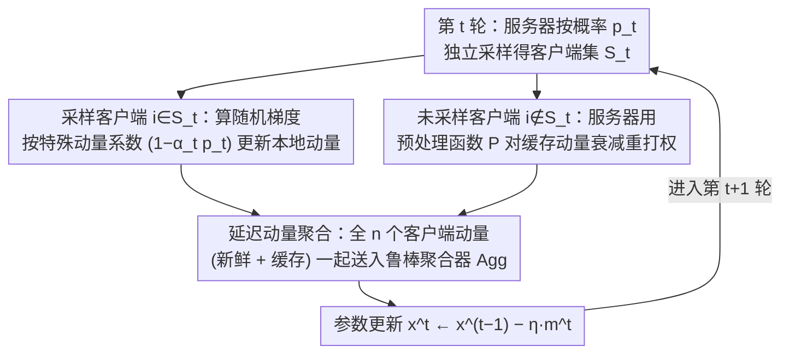

# Delayed Momentum Aggregation: Communication-efficient Byzantine-robust Federated Learning with Partial Participation

**会议**: ICML 2026  
**arXiv**: [2509.02970](https://arxiv.org/abs/2509.02970)  
**代码**: 暂未公开  
**领域**: 优化 / 联邦学习  
**关键词**: 联邦学习, 拜占庭鲁棒, 部分参与, 延迟动量, 鲁棒聚合

## 一句话总结
针对部分参与下"采样客户端中拜占庭客户端临时占多数"会击垮已有鲁棒聚合的痛点，本文提出延迟动量聚合原则——服务器把当轮新动量与未被采样客户端的最近一次缓存动量一起送入鲁棒聚合器，将全局拜占庭比例 $\delta<1/2$ 永远延续到每一轮聚合，并据此设计 DeMoA 优化器，在 $p=0.1$、$\delta=0.2$ 的极端设置下仍能稳定训练 ResNet-18/CIFAR-10。

## 研究背景与动机

**领域现状**：拜占庭鲁棒联邦学习的"标配"是鲁棒聚合器（Krum / 坐标中位数 / RFA / CCLIP）加上客户端本地动量做方差缩减——前者隔离单点恶意更新，后者把 ALIE 这类时序累积攻击和正常随机噪声区分开。已有理论几乎都假设全客户端参与。

**现有痛点**：实际系统因带宽、电量和可用性限制必须部分参与，而"部分参与 + 鲁棒聚合"的朴素组合会失效。原因很尖锐：即使全局拜占庭比例 $\delta<1/2$，独立采样的某些轮里采样集本身就是拜占庭多数（"Byzantine majority round"），任何只看当轮输入的鲁棒聚合器都无法分辨好坏；在 $p=0.1, \delta=0.2$ 时这种灾难轮在第一个 epoch 就会出现，FedAvg/FedCM 直接崩。

**核心矛盾**：通信效率（小 $p$）和鲁棒性的根本冲突——降低参与率会指数提高出现拜占庭多数轮的概率。Allouah 等 2024 给了部分参与的特征化但要求 $p$ 太大且没解决多数轮；Malinovsky 等 2024 用方差缩减加裁剪能抗多数轮但依赖深度学习里不实用的大 minibatch 或全梯度。

**本文目标**：找到一个既能容忍拜占庭多数轮、又适配深度学习常规 minibatch、且不增加任何通信开销的方案。

**切入角度**：服务器手里其实留着每个客户端上一次发来的动量缓存。如果把这批缓存当作"虚拟当轮更新"一起进鲁棒聚合，则聚合器面对的就是全 $n$ 个客户端，拜占庭比例永远等于全局 $\delta$，多数轮就被消灭了。

**核心 idea**：用"延迟动量聚合"把鲁棒聚合的视角从"采样子集"恢复为"全局集合"，并通过精心选择动量系数和延迟修正让这个看似简单的拼接在理论上仍然收敛。

## 方法详解

### 整体框架
DeMoA 维持的是同步 FL 的标准外壳：每轮 $t$ 服务器独立以概率 $p_t$ 采样每个客户端得到 $\mathcal{S}_t$，被采样者用本地数据算一次随机梯度并更新自己的动量后回传，未被采样者的动量则由服务器侧"重打权"以模拟同样的衰减节奏。然后服务器把所有 $n$ 个客户端的动量（无论新鲜的还是缓存的）一起送进 $(\delta,c)$-鲁棒聚合器 $\mathrm{Agg}$，输出 $\bm{m}^t$ 作为下一步参数更新方向：$\bm{x}^t \leftarrow \bm{x}^{t-1} - \eta\,\bm{m}^t$。整体增加的状态只有"服务器为每个客户端缓存一份动量向量"，通信量与 FedAvg 相同。

### 关键设计

**1. 延迟动量聚合原则：把鲁棒聚合的视角从采样子集恢复为全集**

部分参与下崩溃的根因是：即便全局拜占庭比例 $\delta<1/2$，某些轮被采样的子集 $\mathcal{S}_t$ 里拜占庭就是多数，任何只看当轮输入的鲁棒聚合器都分辨不出好坏。作者注意到服务器其实留着每个客户端上一次发来的动量缓存，于是把这批缓存当作"虚拟当轮更新"一起送进聚合器：对未被采样的客户端 $i\notin\mathcal{S}_t$，取其最近一次被采样时刻 $t-\tau(i,t)$ 的动量 $\bm{m}_i^{t-\tau(i,t)}$ 经预处理 $\mathcal{P}$ 后参与，即聚合 $\{\bm{m}_i^t\}_{i\in\mathcal{S}_t}\cup\{\mathcal{P}(\bm{m}_i^{t-\tau(i,t)},i,t)\}_{i\notin\mathcal{S}_t}$。这样聚合器每轮面对的都是全 $n$ 个客户端，拜占庭比例永远等于全局 $\delta$，"拜占庭多数轮"这条失败路径被从根上消灭；而小步长下延迟动量是 $\nabla f_i(\bm{x}^t)$ 的良好近似，诚实客户端的信号持续可见，还顺带缓解非 IID 漂移——关键是缓存本就在服务器侧，零额外通信。

**2. 特殊动量系数 $(1-\alpha_t p_t)$：把采样噪声与动量噪声在方差意义上解耦**

直接照搬 FedCM 的动量系数 $(1-\alpha_t)$ 会让系数本身随采样随机化，引入与历史动量范数 $\|\bm{m}_i^{t-1}\|^2$ 挂钩的方差，迭代中可能发散。作者改用 $(1-\alpha_t p_t)$：被采样者 $\bm{m}_i^t=(1-\alpha_t p_t)\bm{m}_i^{t-1}+\alpha_t\nabla f_i(\bm{x}^{t-1};\xi_i^t)$，未采样者 $\bm{m}_i^t=(1-\alpha_t p_t)\bm{m}_i^{t-1}$。引入指示变量 $r_i^t\sim\mathrm{Ber}(p_t)$ 后，期望递推恰好等价于标准动量 $(1-\alpha_t p_t)\bm{m}_i^{t-1}+\alpha_t p_t\nabla f_i$，而方差只剩 $\alpha_t^2 p_t(1-p_t)\|\nabla f_i\|^2$，砍掉了那个依赖历史动量范数的爆炸项。本质是把"显式动量"与"采样导致的隐式动量"在期望意义上合并到同一个有效参数 $\alpha_t p_t$ 上——只动一个标量，就把延迟方差控制住。

**3. 预处理函数 $\mathcal{P}$：去掉隐式动量效应，让延迟分析不依赖有界梯度**

延迟了 $\tau(i,t)$ 轮的缓存动量若直接进聚合，会被双重计数、引入异步方法里那种需要"有界梯度"才成立的隐式动量项。作者给出闭式修正

$$\mathcal{P}(\bm{m}_i^{t-\tau(i,t)},i,t)=\Big[\prod_{s=t-\tau(i,t)+1}^{t}(1-\alpha_s p_s)\Big]\bm{m}_i^{t-\tau(i,t)},$$

相当于让缓存动量沿"如果一直没被采样"的轨迹自然衰减到第 $t$ 轮，再喂给鲁棒聚合器。这样收敛分析就不再依赖有界梯度假设，并且把 MIFA 看成 $\alpha=1$、$\mathrm{Agg}$ 取均值、$\mathcal{P}=\text{id}$ 的退化特例——预处理正是把"延迟动量"与"鲁棒聚合"真正连起来的那座桥。

### 损失函数 / 训练策略
DeMoA 不改训练损失，只换优化器；步长 $\eta$、动量 $\alpha_t$ 与采样概率 $p_t$ 按 Theorem 3.1 给的耦合取法选择，实现时只需在 FedAvg 框架的"averaging"那一步替换为带缓存动量的鲁棒聚合即可。

## 实验关键数据

### 主实验

设置 $n=25$ 客户端、$\delta=0.2$、CCLIP 鲁棒聚合，在 IID 与非 IID 数据上对比 FedAvg、FedCM、Byz-VR-MARINA-PP 与 DeMoA。

| 数据集 | 参与率 $p$ | 度量 | FedAvg / FedCM | Byz-VR-MARINA-PP | DeMoA |
|--------|-----------|------|----------------|------------------|-------|
| MNIST (ConvNet) | 0.5 | 拜占庭多数首次出现 | epoch 3 后崩溃 | 稳定但精度更低 | 全程最高 |
| CIFAR-10 (ResNet-18) | 0.1 | 拜占庭多数首次出现 | 第 1 个 epoch 即崩 | 高方差、非 IID 偶发灾难性失败 | 稳定收敛、最高精度 |

DeMoA 在五种攻击（ALIE、Bit-Flipping、IPM、Label-Flipping、Mimic）和四种聚合器（CM、Krum、RFA、CCLIP）的几乎所有组合上拿到了最高的最终精度，且方差最小。

### 消融 / 分析

| 配置 | 现象 | 解读 |
|------|------|------|
| 无拜占庭 $\delta=0$、$p=0.5$、naive avg | DeMoA 仍优于 FedCM、Byz-VR-MARINA-PP | 延迟动量充当隐式正则，缓解非 IID 漂移 |
| 替换动量系数 $(1-\alpha_t p_t)\to (1-\alpha_t)$ | 方差出现 $\alpha_t^2 p_t(1-p_t)\|\bm{m}_i^{t-1}\|^2$ 项 | 解释为何朴素照搬动量会被采样噪声放大 |
| 去掉预处理 $\mathcal{P}$（退化为 MIFA + naive avg） | 鲁棒常数 $c=\infty$、理论变空 | 说明预处理是把延迟动量与鲁棒聚合连起来的桥 |
| $\delta$ 接近 $\min(1/2, 1/(60c(B^2+\alpha(1-p))))$ | 部分聚合器下性能下降 | 越过对应聚合器击穿点，理论与现象自洽 |

### 关键发现
- 失败模式定位准确：FedAvg/FedCM 的崩溃严格发生在"第一次拜占庭多数轮"之后，从机理上验证了延迟动量聚合解决的正是这个失败点。
- 部分参与下的收敛率 $\frac{1}{T}\sum\mathbb{E}\|\nabla f(\bm{x}^t)\|^2 = \mathcal{O}(c\delta\zeta^2 + \cdots)$ 中的非消失项 $\mathcal{O}(c\delta\zeta^2)$ 与全参与下界同阶，没有像分散式 gossip 那样被通信稀疏性放大 $1/\gamma^2$。
- 在过参数化 $(\zeta=0,B)$-异质性假设下（推论 3.2），非消失项消失，速率回到 i.i.d. 最优率。

## 亮点与洞察
- 用"扩大聚合输入集合"这一极简操作把"拜占庭多数轮"问题降维成全参与问题，把通信效率与鲁棒性的冲突拆掉，且零通信开销。
- 动量系数 $(1-\alpha_t p_t)$ 是教科书级别的小改动——只动一个标量就让两种随机源（采样、动量更新）在方差意义上解耦，可直接迁移到任何"部分参与 + 动量"的优化器。
- 预处理函数 $\mathcal{P}$ 提供了"延迟动量等价于不延迟"的闭式映射，把异步/延迟优化里需要"有界梯度"才能成立的结论搬到了同步部分参与下不需要这一假设的设定。

## 局限与展望
- 服务器需为每个客户端常驻一份动量向量，当 $n$ 巨大时内存可观；论文建议把通信压缩自然嵌入 $\mathcal{P}$，但尚无系统分析。
- 收敛速率仍含 $\Gamma = (1-p)\cdot\Theta(1+B^2+c\delta G)/(G(1-60c\delta B^2))$ 项，在极小 $p$ 加上重异质性时常数会变大；过参数化能消除非消失项但理论上仍受 $\Gamma$ 影响。
- 实验只覆盖到 ResNet-18/CIFAR-10 与 ConvNet/MNIST，未在大模型或大规模联邦上验证；对采样器只研究了独立伯努利，更复杂的客户端选择策略（聚类采样、power-of-choice）留作未来工作。
- 拜占庭比例 $\delta$ 上界 $\min(1/2, 1/(60c(B^2+\alpha(1-p))))$ 在某些聚合器（小 $c$、低 $B$）下足够宽，但对高度异质的数据可能偏紧；针对延迟动量的自适应攻击也未做系统评估。

## 相关工作与启发
- **vs Allouah et al. 2024（部分参与首篇）**：他们刻画了所需参与率但要求 $p$ 较大且不处理拜占庭多数轮、且不带动量易被时序攻击拖死；本文用缓存动量主动消灭多数轮并保留动量抗时序攻击。
- **vs Malinovsky et al. 2024（Byz-VR-MARINA-PP）**：他们靠 MARINA 类方差缩减加裁剪可抗多数轮，但需要大 batch 或全梯度且裁剪带来偏差；DeMoA 在常规 minibatch 下既稳定又精度更高。
- **vs MIFA / Fedvarp / CA2FL（缓存类方法）**：动机是处理客户端不可用而非拜占庭鲁棒，仅分析 SGD，朴素套用动量会触发隐式动量效应；DeMoA 把它们视为退化情况并给出修正。
- **vs OrMo（异步动量 SGD）**：思路上启发了预处理函数 $\mathcal{P}$，但 OrMo 依赖有界梯度假设，本文在部分参与同步设定下去掉了这一强假设。

## 评分
- 新颖性: 待评
- 实验充分度: 待评
- 写作质量: 待评
- 价值: 待评

<!-- RELATED:START -->

## 相关论文

- [\[NeurIPS 2025\] Layer-wise Update Aggregation with Recycling for Communication-Efficient Federated Learning](../../NeurIPS2025/optimization/layer-wise_update_aggregation_with_recycling_for_communication-efficient_federat.md)
- [\[ICML 2026\] HO-SFL: Hybrid-Order Split Federated Learning with Backprop-Free Clients and Dimension-Free Aggregation](ho-sfl_hybrid-order_split_federated_learning_with_backprop-free_clients_and_dime.md)
- [\[ICML 2026\] Learning Locally, Revising Globally: Global Reviser for Federated Learning with Noisy Labels](learning_locally_revising_globally_global_reviser_for_federated_learning_with_no.md)
- [\[NeurIPS 2025\] Efficient Federated Learning against Byzantine Attacks and Data Heterogeneity via Aggregating Normalized Gradients](../../NeurIPS2025/optimization/efficient_federated_learning_against_byzantine_attacks_and_data_heterogeneity_vi.md)
- [\[ICML 2025\] The Panaceas for Improving Low-Rank Decomposition in Communication-Efficient Federated Learning](../../ICML2025/optimization/the_panaceas_for_improving_low-rank_decomposition_in_communication-efficient_fed.md)

<!-- RELATED:END -->
