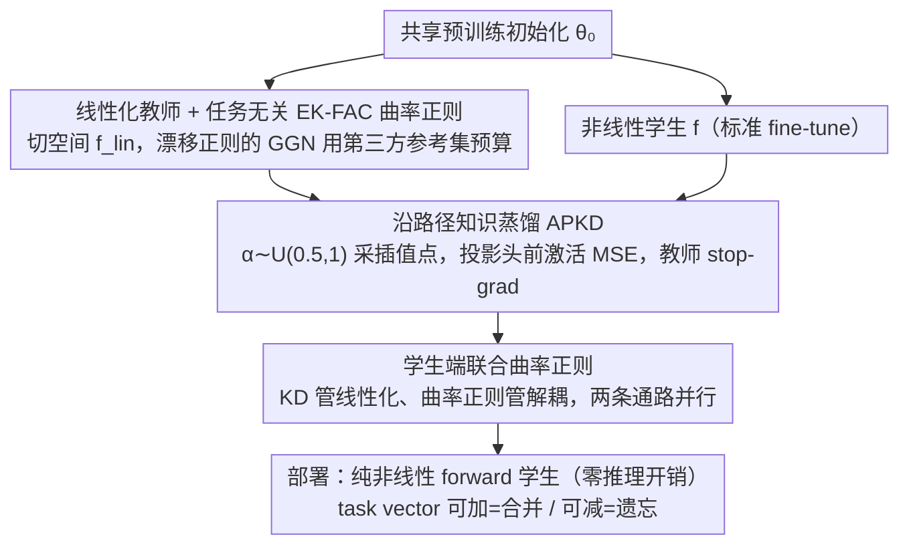

# Distilling Linearized Behavior into Non-Linear Fine-Tuning for Effective Task Arithmetic

**会议**: ICML 2026  
**arXiv**: [2605.18993](https://arxiv.org/abs/2605.18993)  
**代码**: https://github.com/apanariello4/merge-and-rebase  
**领域**: 模型合并 / 模型压缩 / Task Arithmetic  
**关键词**: task arithmetic, linearization, knowledge distillation, weight disentanglement, EK-FAC

## 一句话总结
本文提出 DELTA：在线把"切空间线性化教师"的中间激活蒸馏到普通非线性学生 + EK-FAC 曲率正则 + 沿插值路径采样，让常规非线性 fine-tune 出来的 task vector 也具备线性化模型那种"可叠加、低干扰、对缩放鲁棒"的性质，同时不引入任何推理开销。

## 研究背景与动机

**领域现状**：Task arithmetic（Ilharco 2022）把不同任务 fine-tune 出的权重差 $\bm\tau_t=\bm\theta_t-\bm\theta_0$ 作为 task vector，通过 $\bm\theta_0+\sum_t\alpha_t\bm\tau_t$ 在权重空间做加（合并任务）或减（机器遗忘）。其有效性强依赖 weight disentanglement：施加 $\bm\tau_t$ 对其他任务输入的预测应近乎不变。Ortiz-Jimenez 等发现在切空间 fine-tune（线性化模型 $f_{\mathrm{lin}}(\bm x;\bm\theta)=f(\bm x;\bm\theta_0)+\mathrm J_{\bm\theta}f(\bm x;\bm\theta_0)(\bm\theta-\bm\theta_0)$）能天然得到更解耦的 task vector。

**现有痛点**：线性化路径有三个明显代价——(i) Jacobian-vector product 让训练和推理成本各翻倍；(ii) 把优化锁在切空间损害表达力，单任务精度天花板较低；(iii) 已有去干扰正则（τJp 需要其它任务的训练数据，TAK 需要其它任务的 KFAC 因子）默认任务集闭集已知，新任务进入要全部重算。非线性 fine-tune 表达力强但 task arithmetic 表现极差（ViT-B/32 8-Vision 上绝对精度只有 32%，线性版 77%）。

**核心矛盾**：表达力（非线性）和 task arithmetic 的可组合性（线性）这两件好事似乎不能兼得，而合并能力又强依赖切空间结构。

**本文目标**：让普通非线性 fine-tune 出来的学生也满足"对权重扰动近线性"和"支持集局部化（in-domain 改、out-of-domain 不动）"两条核心条件，从而拿到合并性能，但不付推理代价、也不需要别的任务的数据/统计。

**切入角度**：本文的观察是——"权重空间的近线性"是个参数空间的性质，但可以通过"激活空间的目标"来诱导。如果让非线性学生的隐层激活去匹配线性化教师的激活，优化就会被偏向到"对权重扰动近线性"的解。

**核心 idea**：用线性化老师 + 在线特征蒸馏 + 沿插值路径采样 + EK-FAC 曲率正则联合训练非线性学生，把"线性化收益"装进一个推理时仍是普通非线性 forward 的模型里。

## 方法详解

### 整体框架
对每个任务 $t$ 同时维护两个模型：教师 $f_{\mathrm{lin}}(\bm x;\bm\theta_t^T)$ 走切空间线性化、学生 $f(\bm x;\bm\theta_t^S)$ 走标准非线性 fine-tune。两者共享同一预训练初始化 $\bm\theta_0$，在同一次反传里联合优化（不是先训老师再蒸学生），并且都加 EK-FAC 曲率正则。教师负责给出"低干扰目标激活"，学生通过对教师沿插值路径采样的多个 snapshot 做特征 MSE 蒸馏来抓住"线性化行为"。

### 关键设计

**1. 线性化教师 + 任务无关 EK-FAC 曲率正则：把教师推到对任意未来任务都低干扰的方向**

task arithmetic 的可组合性依赖 weight disentanglement，所以教师必须朝一个"对其它任意输入分布扰动都小"的方向走，才不会跟未知未来任务的 task vector 互相挤压。教师损失写成 $\mathcal L^T_t = \mathcal L_{\text{task}} + \beta^T\,\mathcal L_{\text{drift}}(\bm\theta_t^T)$，其中 representation drift 在线性化下有闭式 $\mathcal L_{\text{drift}}(\bm\theta_t)\propto (\bm\theta_t-\bm\theta_0)^\top \bm G_t(\bm\theta_0)(\bm\theta_t-\bm\theta_0)$，$\bm G_t$ 是 GGN 矩阵。关键的不同在于：本文不在已知任务集上算 GGN（那等于假设任务闭集已知），而是在一个第三方参考数据集 $\mathcal D_\Omega$ 上一次性预算 EK-FAC 近似 $\mathrm{GGN}_{\mathrm{EK\text{-}FAC}}^l=(U_A^l\otimes U_G^l)S^l(U_A^l\otimes U_G^l)^\top$（视觉用 ImageNet-21k 15% 子集，文本用 C4 的 $10^5$ 样本），让正则项变成"对一般输入分布"的解耦目标。相比 τJp 要别的任务的训练数据、TAK 要别的任务的 KFAC，换成 reference dataset 后新任务到来不必重训旧 task vector，也不暴露用户私有数据；EK-FAC 还比 KFAC 多建模 Kronecker 特征基下的特征值，曲率估计更准。

**2. 沿路径知识蒸馏（APKD）：把线性化行为蒸到整段插值路径上而非单点**

线性化教师的"对权重扰动近线性"性质要转移到非线性学生身上，而且不能只在 $\alpha=1$ 这一个权重点成立。本文蒸的不是 logits，而是最后投影头之前的隐藏激活，准则用 MSE；更关键的是每步 SGD 都从 $\alpha\sim\mathcal U(0.5,1)$ 采一个插值点，让教师和学生都按 $\bm\theta_0+\alpha\bm\tau$ 的状态算激活并对齐：

$$\mathcal L_{\text{KD}}=\mathbb E_{\alpha}\Big[\tfrac{1}{B}\sum_i\big\|f(\bm x_i;\bm\theta_0+\alpha\bm\tau_t^S)-\mathrm{SG}[f_{\mathrm{lin}}(\bm x_i;\bm\theta_0+\alpha\bm\tau_t^T)]\big\|_2^2\Big]$$

教师上加 stop-gradient，避免反传污染。固定 $\alpha{=}1$ 的传统 KD 只在一个点对齐，学生会在路径其它位置漂离线性行为；APKD 把整段线性轨迹喂给学生，相当于对一个"线性化教师族"做集成蒸馏，因此 T5 上的 $\alpha$-sweep 鲁棒性提升非常明显——部署时不必依赖验证集去精调缩放系数。

**3. 学生端联合曲率正则：把"线性化"和"解耦"拆成两条独立通路**

光蒸馏还不够，学生本身也要被推向支持集局部化（in-domain 大改、out-of-domain 接近预训练）。学生损失 $\mathcal L^S_t=\mathcal L_{\text{task}}(\bm\theta_t^S)+\beta_1\mathcal L_{\text{KD}}+\beta_2\mathcal L_{\text{drift}}(\bm\theta_t^S)$：蒸馏项把学生限制在近线性区域，曲率项在这区域里明确控制解耦。作者的诊断（Fig. 6）揭示了为什么两者缺一不可——"只蒸馏"贡献了线性化但解耦弱，"只曲率正则"贡献了解耦但线性化弱，必须两条通路一起上才能既近线性又支持局部化。这也解释了学生为何能反超教师：它在切空间外保留了非线性的表达力，但激活又被约束回线性化教师走过的区域。同一架构既能用 full FT 当学生，也能换 LoRA 学生配 full FT 教师——后者让教师在富表达空间找方向、学生在低秩高效子空间复刻，天然适配"训练富表达、部署高效"的工业链路。

### 损失函数 / 训练策略
教师与学生在同一次反传里联合优化（非先训教师再蒸学生），两者共享预训练初始化 $\bm\theta_0$ 且都加 EK-FAC 曲率正则。教师损失 $\mathcal L^T_t = \mathcal L_{\text{task}} + \beta^T\mathcal L_{\text{drift}}$；学生损失 $\mathcal L^S_t = \mathcal L_{\text{task}} + \beta_1\mathcal L_{\text{KD}} + \beta_2\mathcal L_{\text{drift}}$。推理时学生是普通非线性 forward，无任何额外开销。

## 实验关键数据

### 主实验
8-Vision / 14-Vision / 6-NLI 三个 benchmark 上的 task addition 绝对精度对比，$\alpha{=}1$ 直接相加，DELTA 在 4 个 backbone 上全面胜出：

| 方法 | 8V ViT-B/32 Abs. | 14V ViT-L/14 Abs. | 14V ViT-B/32 Abs. | 6-NLI T5-Base Abs. |
|------|------|------|------|------|
| Pre-trained | 48.4 | 65.0 | 57.8 | 61.7 |
| Individual fine-tune | 92.8 | 95.8 | 90.2 | 85.9 |
| Non-Linear FT (Ilharco 2022) | 32.0 | 45.3 | 15.6 | 42.0 |
| Linear FT (Ortiz-Jimenez 2023) | 77.4 | 88.0 | 73.7 | 76.0 |
| τJp (Yoshida 2025) | 85.0 | 90.9 | 85.3 | 82.5 |
| TAK (Porrello 2025b) | 86.0 | 91.6 | 84.3 | 79.1 |
| **DELTA (ours)** | **88.3** | **92.7** | **85.9** | 82.3 |

LoRA 学生 + full FT 教师组合下，DELTA 在 8V ViT-B/32 拿 87.5 / 99.5 normalized，把第二名 Core+TSV-M 的 77.9 直接拉开 9.6 个点。

### 消融实验

| 配置 | 8V ViT-B/32 task arithmetic 趋势 | 说明 |
|------|------------------------------------|------|
| 非线性 FT baseline | 32.0 abs | 线性化与解耦都缺，task arithmetic 完全失败 |
| Student + 蒸馏 + 曲率正则（DELTA full） | 88.3 abs | 两组件齐全 |
| Student + 仅蒸馏（无曲率） | 接近 DELTA 但有差距 | linearization error 接近零，但 support localization 弱 |
| Student + 仅曲率（无蒸馏） | 最接近 DELTA | 解耦最强，但 linearization error 上升 |
| APKD off（固定 $\alpha{=}1$ 蒸馏） | linearization error 明显上升，T5 上 $\alpha$-sweep 鲁棒性变差 | 单点对齐丢失沿路径性质 |
| Task negation 9.6% target / 62.1% control | DELTA 优于其它非线性方法，落后于纯线性 τJp/TAK | 线性化在 subtraction 上仍有残余优势 |

### 关键发现
- "蒸馏负责线性化、曲率正则负责支持集局部化"——是两条独立通路，两者都做才能在 task addition 上接近天花板。
- DELTA 学生反超线性化教师：T5 上每个单任务学生都比教师高，合并后平均精度也更高，说明非线性表达力没被 KD 吃掉，反而被引导到了一个"近线性但更富表达"的中间态。
- LoRA 学生 + full FT 教师是个意外强的组合，在 8V ViT-B/32 拿 normalized 97.9，远超所有 post-hoc merging（Iso-C / TSV-M / Core Space）。
- $\alpha$-sweep 鲁棒性：DELTA 在 $\alpha\in[0.5,1]$ 区间几乎平的曲线，其它非线性合并方法在偏离 1 时迅速崩；这意味着部署时不必依赖验证集调系数。
- 推广到生成式 LLM：LLaMA-3.2-1B + DPO，把 helpfulness 和 verbosity 两个偏好向量按 $\bm\theta_{\text{mix}}=\bm\theta_0+\bm\tau_{\text{help}}+\lambda_2\bm\tau_{\text{verb}}$ 组合，Distilled DPO 的 reward Pareto 前沿贴近 Linear DPO，且 preference accuracy 超过 DPO-Mixed 和 Non-Linear DPO。

## 亮点与洞察
- "参数空间性质用函数空间目标诱导"这个角度本身就值得记：本文给出了一个干净的实证证据——激活级 MSE + curvature reg 真的能让非线性模型表现出"对权重扰动近线性"，作者推测原因是优化被压住在 $\bm\theta_0$ 附近，一阶 Taylor 在那里本就有效，再叠加 simplicity bias，模型自然偏向最简单（即近线性）的拟合机制。
- 蒸馏 vs 曲率正则的"分工"诊断（Fig. 4/5）是极漂亮的实验设计，把"模型表现"反向归因到两个可解释的性质上。
- 用 reference dataset 替代任务专属统计，让方法真正可以增量上新任务而不破坏已学 task vector——这是 task arithmetic 落地的关键工程突破。
- LoRA 学生 + full FT 教师的非对称配对天然适配"训练富表达、部署高效"的工业链路，且性能比 post-hoc 合并强得多。

## 局限与展望
- 训练成本翻三倍、显存翻两倍（教师 + 学生 + 沿路径采样 + EK-FAC 预计算），论文承认这是核心瓶颈。
- Task negation 上仍逊于纯线性 τJp/TAK，说明 subtraction 里"严格线性"还有红利没被复刻。
- 曲率正则依赖 reference dataset $\mathcal D_\Omega$ 的代表性，append 里虽有敏感性 ablation 但跨域（如视觉 reg 用在医学）仍待验证。
- Impact statement 自己点出，更高效的合并能力也是双刃剑，可能让不安全行为更容易被组合传染。
- Distilled DPO 是 preliminary，curvature 还没接上，生成式 LLM 上的端到端版本是明显的后续工作。

## 相关工作与启发
- **vs Linear FT (Ortiz-Jimenez 2023)**：他们直接在切空间训练，本文用切空间模型当教师把性质蒸到非线性学生，推理时省一半 cost，task addition 上还更高。
- **vs τJp (Yoshida 2025)**：τJp 在线性化下用其它任务训练数据正则化 representation drift；DELTA 把数据依赖换成 reference dataset + EK-FAC，task agnostic 化。
- **vs TAK (Porrello 2025b)**：TAK 用 KFAC 也实现了 dataless，但仍要求所有任务的 KFAC 因子；DELTA 共享一个 reference 矩阵，可增量加任务。
- **vs Iso-C / TSV-M / Core Space**：这些是 post-hoc 合并，依赖学生 fine-tune 完才纠偏；DELTA 在训练里就把 task vector 推到解耦区域，对 LoRA 设定提升尤其显著（normalized acc 高 14+ 点）。
- **vs DPO (Rafailov 2023)**：DPO 把多偏好压成单一标量目标；本文方向是训练每个偏好向量再在推理时按 $\lambda$ 组合，让 Pareto 前沿可控。

## 评分
- 新颖性: ⭐⭐⭐⭐ "用激活空间约束诱导参数空间性质 + 沿路径蒸馏"这一组合是新的，单组件不算新。
- 实验充分度: ⭐⭐⭐⭐⭐ 视觉 8/14-task、6-NLI、ViT-B/32 与 L/14、T5-Base、LoRA、DPO 生成式 LLM 全覆盖，诊断 ablation 区分了蒸馏 vs 曲率正则的功能。
- 写作质量: ⭐⭐⭐⭐⭐ 把"为什么线性化好"和"线性化代价"摆得很清，Tab. 1 的对照表一眼看出 DELTA 在哪几格才打 ✓。
- 价值: ⭐⭐⭐⭐⭐ 把 task arithmetic 从研究 demo 拉到可部署阶段（推理无开销 + 任务可增量），LoRA 实验显示对工业链路友好。

<!-- RELATED:START -->

## 相关论文

- [\[ICML 2026\] Learning a Zeroth-Order Optimizer for Fine-Tuning LLMs](learning_a_zeroth-order_optimizer_for_fine-tuning_llms.md)
- [\[ICML 2025\] Provable In-Context Vector Arithmetic via Retrieving Task Concepts](../../ICML2025/optimization/provable_in-context_vector_arithmetic_via_retrieving_task_concepts.md)
- [\[ICCV 2025\] Zeroth-Order Fine-Tuning of LLMs in Random Subspaces](../../ICCV2025/optimization/zeroth-order_fine-tuning_of_llms_in_random_subspaces.md)
- [\[ICML 2026\] Bayesian Gated Non-Negative Contrastive Learning](bayesian_gated_non-negative_contrastive_learning.md)
- [\[ICML 2026\] On the Expressive Power of GNNs to Solve Linear SDPs](on_the_expressive_power_of_gnns_to_solve_linear_sdps.md)

<!-- RELATED:END -->
