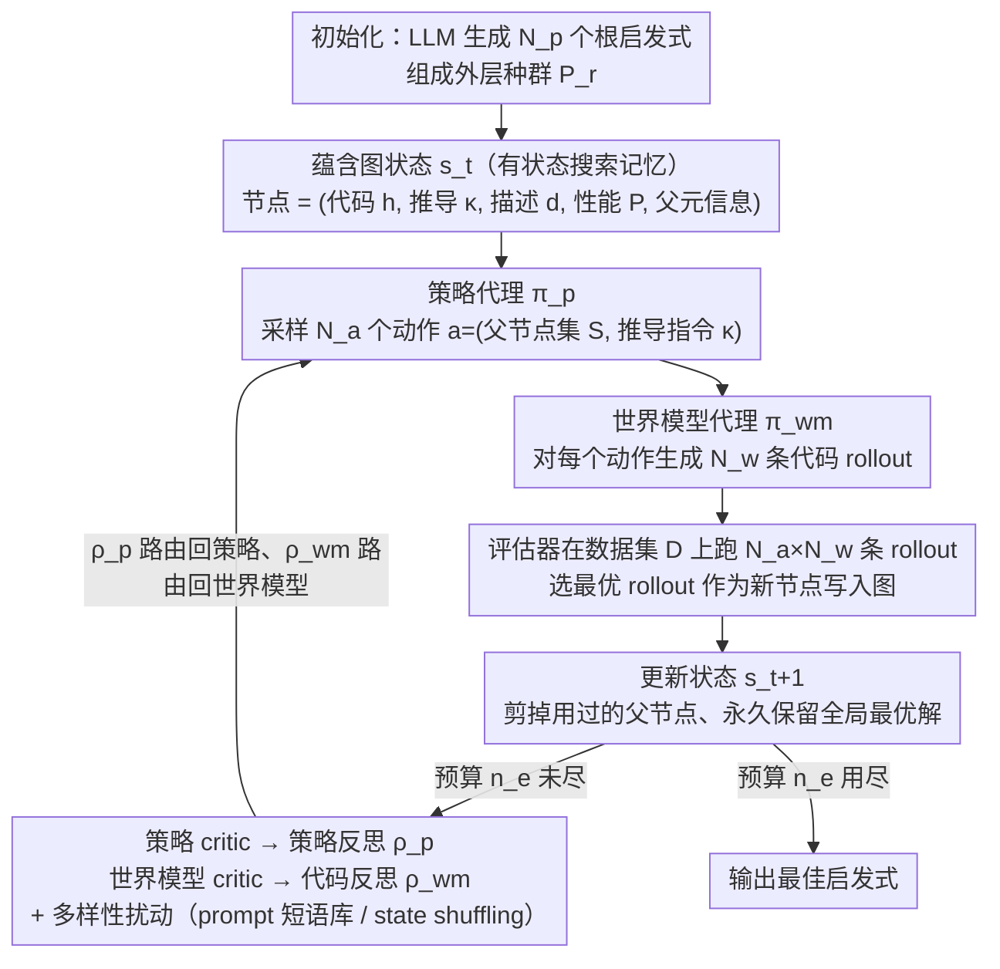

# PathWise: Planning through World Model for Automated Heuristic Design via Self-Evolving LLMs

**会议**: ICML 2026  
**arXiv**: [2601.20539](https://arxiv.org/abs/2601.20539)  
**代码**: 待确认  
**领域**: 优化 / LLM 用于组合优化 / 自动启发式设计  
**关键词**: 自动启发式设计, 多智能体 LLM, 蕴含图, 世界模型, 组合优化

## 一句话总结
PathWise 把 LLM 自动启发式设计（AHD）重新建模成一条在"蕴含图"上展开的序列决策过程，由策略 / 世界模型 / 双评价四个 LLM 智能体协作，用反思替代梯度更新，在 TSP、CVRP、KP、装箱等问题上以 50% 的评估预算超过 FunSearch、EoH、ReEvo、HSEvo、MCTS-AHD 等主流基线。

## 研究背景与动机

**领域现状**：自动启发式设计（AHD）的目标是给一类组合优化问题（COP）自动找出一个高质量的启发式程序 $h:\mathcal{X}\to\mathcal{S}$，传统做法基于遗传规划（GP）用人工算子在语法树上演化，最近 FunSearch / EoH / ReEvo / HSEvo 这一支把 LLM 当作"高级算子"嵌进进化循环，MCTS-AHD 这一支把生成过程组织成蒙特卡洛树。

**现有痛点**：群体式方法用固定的选拔 / 替换规则，容易在中间淘汰有潜力的解，过早收敛；树式方法虽然有层级，但选点和扩展靠 UCT 这种纯性能统计，看不到"两个启发式之间在语义上有什么关系"；两条路线都把每一步生成当作独立或弱耦合的采样，prompt 模板是写死的，不会根据搜索历史调整，于是出现大量"换皮 rediscovery"、相似启发式被反复采样、LLM 调用预算被严重浪费。

**核心矛盾**：搜索本质上是个有记忆的推理过程——一个启发式好坏的语义、它是如何从父代演化来的、哪些 edit 模式管用，这些信息应当被显式建模并跨步重用；但现有框架既没有这样的状态表示，也没有把"高层策略"和"低层代码合成"分开，更没有让 critic 反馈分别路由回不同角色。

**本文目标**：(1) 给 LLM-AHD 设计一种结构化的状态表示，把推导历史压缩进搜索状态；(2) 把策略规划、代码合成、反思评价拆成不同角色并协调；(3) 在 prompt 层引入多样性，让 critic 能看到"对比"。

**切入角度**：作者借用文本蕴含图（entailment graph）的想法，把每个候选启发式当作一个节点，把"从一组父节点经由一段自然语言推导得到子节点"当成一条带标注的有向边——这样的图既是搜索轨迹的紧凑记忆，又能作为 LLM 的可读上下文。配合 hao-etal-2023-reasoning 提出的"LLM 作为世界模型"视角，刚好可以把策略 / 世界模型 / critic 这套 RL-like 接口搬过来，但全程不更新任何参数，只通过自然语言反思来迭代。

**核心 idea**：用蕴含图替代群体或 MCTS 树作为"状态"，用一个 LLM 策略采样高层进化动作（选哪些父节点 + 用什么 derivation rationale），用一个 LLM 世界模型把动作落到具体代码上，再用两个 critic LLM 把每步结果路由回对应角色，做"无梯度"的自我演化。

## 方法详解

PathWise 把启发式发现整体看成一个 MDP $(\mathbb{S},\mathbb{A},\mathbb{T},\mathbb{R})$：状态 $s_t$ 是当前蕴含图加上 frontier；动作 $a_t=(S,\kappa)$ 由一组被选中的父节点 $S\subseteq s_t$ 和一段自然语言推导指令 $\kappa$ 组成；转移 $\mathbb{T}$ 由世界模型把 $(S,\kappa)$ 编译成一个新启发式并把对应节点和边写进图；奖励 $\mathbb{R}$ 是新生成启发式在数据集 $\mathcal{D}$ 上的负代价 $P(h;\mathcal{D})=\mathbb{E}_{x\sim\mathcal{D}}[-f(h(x))]$。整套 MDP 只是结构骨架，并不做任何梯度优化，强化通过 critic 写出的自然语言反思来实现。

### 整体框架

PathWise 在两层时间尺度上调度：外层迭代 $r$ 维护一个根节点群体 $\mathcal{P}_r$，规模为 $\mathcal{N}_p$；内层迭代 $t$ 在以 $\mathcal{P}_r$ 为根的局部蕴含图 $G_t=(V_t,E_t)$ 上逐步扩展。一个内步包括四个 LLM 角色协同——策略代理 $\boldsymbol{\pi}_p$ 采样 $N_a$ 个候选动作，世界模型代理 $\boldsymbol{\pi}_{wm}$ 对每个动作生成 $N_w$ 条代码 rollout，evaluator 把所有 $N_a\cdot N_w$ 条 rollout 跑一遍数据集，选出 $(i_\star,j_\star)=\arg\max_{i,j}P(\hat{h}^{(i,j)};\mathcal{D})$ 作为这一步新增节点 $v_\star$；之后策略 critic $\boldsymbol{\pi}_{p\_critic}$ 和世界模型 critic $\boldsymbol{\pi}_{wm\_critic}$ 各自写一段路由反思，喂给下一内步的对应角色。状态更新规则 $s_{t+1}=(s_t\cup\{v_\star\})\setminus(S^{(i_\star)}\setminus\{v^\star\})$ 把被使用的父节点剪掉但永远保留全局最佳 $v^\star$，既鼓励探索新分支，又不丢掉历史最优。

每个节点本身是个五元组 $(h,\kappa,d,P(h;\mathcal{D}),\mathrm{PM})$：代码 $h$、生成它的推导文本 $\kappa$、算法的自然语言描述 $d$、性能 $P$、父节点元信息 $\mathrm{PM}=\{(d_k,P(h_k;\mathcal{D}))\mid v_k\in S\}$。父元信息只放描述和分数、不放代码，从源头上压住 prompt 上下文长度。

### 关键设计

**1. 蕴含图作为有状态搜索记忆：把整条搜索轨迹压成一张 LLM 读得懂的图**

群体式方法（FunSearch/EoH）直接丢弃中间体、信息流失，MCTS-AHD 虽全留却靠纯访问统计（UCT）选点、看不到语义——两者都把每步生成当成弱耦合采样，导致大量"换皮 rediscovery"和预算浪费。PathWise 借 NLP 里的文本蕴含图来同时拿"压缩"和"语义"两样东西：每个候选启发式是一个节点，每条边 $S\xRightarrow{\kappa}v_\star$ 同时编码"父节点集合 + 一段自然语言推导理由 $\kappa$"，于是进化动作变成一阶逻辑式的蕴含步，LLM 既能看到某个解是怎么从父辈演化来的、也能看到祖先/同辈的分数对比。外层用群体框架把图限制在以 $\mathcal{P}_r$ 为根的子图内、避免 MCTS 那样无界生长；剪枝规则 $s_{t+1}=(s_t\cup\{v_\star\})\setminus(S^{(i_\star)}\setminus\{v^\star\})$ 把用过的父节点剪掉但永远保留全局最佳 $v^\star$，frontier 不爆炸又不丢历史最优。这样后续决策就能基于"哪条推导路径有效"，而不是"哪个节点被访问得多"。

**2. 策略 / 世界模型双层动作分解：把"想用什么 trick"和"写出能跑的代码"拆给两个角色**

如果一个 prompt 同时承担"设计语义级编辑"和"合成可运行代码"，上下文一长、代码质量就被削弱，固定算子模板（如 EoH 那几种 crossover/mutation）又限死了创造空间。PathWise 因此把动作拆成两层：策略代理在状态和策略反思条件下采 $N_a$ 个动作 $a_t^{(i)}=(S^{(i)},\kappa^{(i)})\sim\boldsymbol{\pi}_p(\cdot\mid s_t,\rho_p(t))$，其中 $\kappa$ 是自由文本指令（既能是"crossover"，也能是"在父节点 A 里把贪心规则换成模拟退火"这种自创算子）；世界模型代理再对每个动作生成 $N_w$ 条代码 rollout $(\hat h^{(i,j)},\hat d^{(i,j)})\sim\boldsymbol{\pi}_{wm}(\cdot\mid\{(h_k,d_k)\}_{v_k\in S^{(i)}},\kappa^{(i)},\rho_{wm}(t))$，最后由评估打分挑出唯一节点写进图。解耦后策略专心做语义编辑、世界模型专心做实现，两类失败模式（策略想歪了 vs 代码写错了）也就能被两个 critic 分头诊断。

**3. 路由反思 + 多样性扰动：让 critic 的反馈各回各家，同时防止角色塌缩成单一模式**

如果用一个 critic 给所有 prompt 混合反馈，两个角色会互相串扰；只用最优 rollout 做反馈又会让世界模型缺负例对比。PathWise 把反思按角色路由：策略 critic 聚合每个动作下 rollout 的平均奖励 $R_p(a_t^{(i)})=\frac{1}{N_w}\sum_{j=1}^{N_w}P(\hat h^{(i,j)};\mathcal{D})$ 和描述 bundle，给策略写 $\rho_p(t+1)$；世界模型 critic 只对比 best/worst 两条 rollout、输出 $\rho_{wm}(t+1)$。多样性上再加两套机制：一是 prompt 扰动短语库 $\Phi_p,\Phi_{wm}$，注入率按 $\varepsilon(\ell)=\varepsilon^{init}+(\varepsilon^{final}-\varepsilon^{init})\cdot\ell/n_e$（$\varepsilon^{init}=0.5,\varepsilon^{final}=0.25$）衰减——它比温度采样更精准，能在保持任务描述精确的同时只对"探索方向"加噪；二是 state shuffling，每次 prompt 随机打乱 $s_t$ 内节点顺序、消除 LLM 的位置偏置。消融显示这两个几乎零成本的 trick 分别治好了"模式塌缩"和"位置偏置"两个隐性 bug。

### 训练策略

PathWise 不更新任何 LLM 参数，是 training-free 框架。外层迭代上限 $\mathcal{N}_r$，内层有显式评估预算 $n_e$；论文报告 PathWise 用 $n_e=500$ 评估即可在 TSP/CVRP 上超过所有基线在 $n_e=1000$ 的结果。每个内步消耗 $N_a\cdot N_w$ 次评估（外加少量 critic 调用），但因为蕴含图剪枝、状态紧凑、反思路由，整体收敛速度更快、方差更低。

## 实验关键数据

### 主实验

覆盖 7 个 COP：TSP（构造式）、CVRP（蚁群 / 神经组合）、KP、BPP、JSSP 等；与 FunSearch、EoH、ReEvo、HSEvo、MCTS-AHD 在 GPT-4o-mini / GPT-5-nano (low/medium reasoning) 三种 backbone 下比较；PathWise 用 $n_e=500$，所有基线 $n_e=1000$。

| 任务 / 测试集 | 指标 | LKH-3 / 最优 | MCTS-AHD ($n_e=1000$) | HSEvo ($n_e=1000$) | **PathWise ($n_e=500$, GPT-4o-mini)** |
|--------|------|------|------|------|------|
| TSP $N=50$ | Obj↓ / Gap | 5.687 / – | 6.358 / 11.80% | 6.429 / 13.05% | **6.245 / 9.81%** |
| TSP $N=100$ | Obj↓ / Gap | 7.767 / – | 8.839 / 13.80% | 8.903 / 14.63% | **8.758 / 12.76%** |
| TSP $N=200$ | Obj↓ / Gap | 10.709 / – | 12.403 / 15.82% | 12.359 / 15.41% | **12.276 / 14.63%** |
| KP $N=200,W=25$ | Obj↑ / Gap | 57.132 / – | 57.020 / 0.20% | – | **57.082 / 0.09%** |
| KP $N=500,W=25$ | Obj↑ / Gap | 90.763 / – | 89.061 / 1.88% | – | **90.719 / 0.05%** |

在 GPT-5-nano (medium) 下 PathWise 同样在 TSP 各规模上拿到最低 gap（如 $N=200$ 时 12.132 vs MCTS-AHD 12.254），并在 KP $N=500$ 上做到 0.04% 的 gap，接近 OR-Tools 最优。

### 消融实验

| 配置 | 现象 | 说明 |
|------|---------|------|
| Full PathWise | 收敛最快、方差最低 | 完整四角色 + 路由反思 + 多样性扰动 |
| w/o 路由反思（共享 critic） | 收敛曲线明显抖动，最终 gap 上升数个百分点 | 两个角色的反馈被混淆，策略改了不该改的、世界模型也跟着乱调代码 |
| w/o 多样性扰动 ($\varepsilon=0$) | 策略反复选同一对父节点、世界模型 rollout 高度相似 | critic 看不到对比，反思退化为重复评论 |
| w/o state shuffling | 父节点选择对位置敏感，前面的节点被过度采用 | 印证 (Li et al., 2024) 等位置偏置研究 |
| 替换为单 critic | 反馈质量明显下降，最终启发式更平庸 | 单 critic 无法同时兼顾策略层语义和代码层质量 |

### 关键发现
- 同样 LLM backbone 下，PathWise 用一半评估预算就稳定超过 MCTS-AHD / HSEvo / ReEvo，说明蕴含图带来的"有记忆搜索"远比 UCT 统计或群体替换更高效。
- 收敛曲线方差远小于基线（论文 Figure 1），表明角色分工 + 路由反思的稳定性收益不仅是均值上的——它显著降低了对初始化和 LLM 采样随机性的依赖。
- backbone 扩展性强：从 GPT-4o-mini 换到 GPT-5-nano（low / medium reasoning），PathWise 在所有规模上都拿到最低 gap，说明框架本身没有过度依赖某种特定 LLM 的提示风格。
- 在大规模实例（TSP $N=200$、KP $N=500$）上提升幅度最大，呼应作者主张的"compact stateful memory 在长序列搜索中更有价值"的论点。

## 亮点与洞察
- **把蕴含图引进 AHD**：原本是 NLP 推理（Dalvi et al., 2021）里的工具，作者把它和进化搜索缝起来，得到的不是"另一个 MCTS"而是一个可解释的、节点带语义描述的搜索轨迹，极大方便了 critic 写出有内容的反思。
- **训练-free 的 actor-critic 类比**：通篇用 MDP 描述但不做梯度优化，把 RL 里的 actor / critic / world model 全部用 LLM + 自然语言代替，给所有"不能 fine-tune 的黑盒模型"提供了一个可迁移的迭代搜索模板，可以原样搬到代码合成、prompt 优化、agent workflow 设计等任务。
- **prompt 扰动衰减 + state shuffling**：两个小 trick 都几乎零额外计算，却同时解决了"LLM 模式塌缩"和"位置偏置"两大隐性 bug，是非常值得复用的工程经验。

## 局限与展望
- 蕴含图随内步线性增长，对 LLM 上下文长度有现实压力；论文用父元信息压缩、剪枝规则、population 限制三重防御，但在更大问题（如 TSP $N\geq 500$ 自定义算子）上长上下文可能仍是瓶颈。
- 评估代价主要在跑启发式（$N_a\cdot N_w$ 次评估每步），COP 评估便宜所以可行；若搬到训练-评估单步即昂贵的任务（如 LLM agent benchmark），$n_e=500$ 也未必划算。
- critic 反思是文本，对失败模式的"理解"完全寄托在 LLM 自身的判断上；当 LLM backbone 较弱（如 GPT-4o-mini 在某些复杂 CVRP 上），反思可能流于表面，作者也观察到此时 PathWise 的优势相对收窄。
- 框架只在群体内做局部蕴含图，跨外层迭代的图是断的；保留跨群体的更长 term memory 可能进一步降低 LLM 调用数。

## 相关工作与启发
- **vs FunSearch / EoH**：他们用固定算子模板 + LLM 做 mutation，本文用自然语言 derivation rationale $\kappa$ 让策略自创算子，并把推导历史显式编码进蕴含图。
- **vs ReEvo**：ReEvo 也有 reflection 机制，但 reflection 全局共享、不路由；PathWise 拆成策略 critic 和世界模型 critic 两路，反馈对象更精准。
- **vs MCTS-AHD**：MCTS-AHD 用 UCT + 单路径扩展做无界生长的搜索树，PathWise 用蕴含图 + 群体根 + 剪枝规则做有界且语义化的搜索图，单步成本更低、收敛更快。
- **vs (hao-etal-2023-reasoning) "LLM as world model"**：本文把这种 reasoning 视角搬到 AHD 场景，并把 world model 和 policy 拆开、加 critic 路由，是该思想在搜索任务上的具体化实现。

## 评分
- 新颖性: ⭐⭐⭐⭐ 把蕴含图、世界模型、双 critic 这三件已知工具组合到 AHD 里属于结构性创新，单个组件并非全新
- 实验充分度: ⭐⭐⭐⭐ 覆盖 TSP / CVRP / KP 等多个 COP、三种 LLM backbone、完整消融
- 写作质量: ⭐⭐⭐⭐ 公式 / 算法 / 图示对应清晰，MDP 和 entailment 两套语言并行有点冗余但不影响理解
- 价值: ⭐⭐⭐⭐ 给所有 training-free 的 LLM 搜索任务提供了可直接复用的"图状态 + 角色分工 + 路由反思"模板

<!-- RELATED:START -->

## 相关论文

- [\[NeurIPS 2025\] Automated Algorithm Design via Nevanlinna-Pick Interpolation](../../NeurIPS2025/optimization/automated_algorithm_design_via_nevanlinna-pick_interpolation.md)
- [\[ICML 2026\] Memory-Efficient LLM Pretraining via Minimalist Optimizer Design](memory-efficient_llm_pretraining_via_minimalist_optimizer_design.md)
- [\[ICML 2026\] Learning a Zeroth-Order Optimizer for Fine-Tuning LLMs](learning_a_zeroth-order_optimizer_for_fine-tuning_llms.md)
- [\[ICML 2026\] TPV: Parameter Perturbations Through the Lens of Test Prediction Variance](tpv_parameter_perturbations_through_the_lens_of_test_prediction_variance.md)
- [\[ICLR 2026\] Test-Time Meta-Adaptation with Self-Synthesis](../../ICLR2026/optimization/test-time_meta-adaptation_with_self-synthesis.md)

<!-- RELATED:END -->
