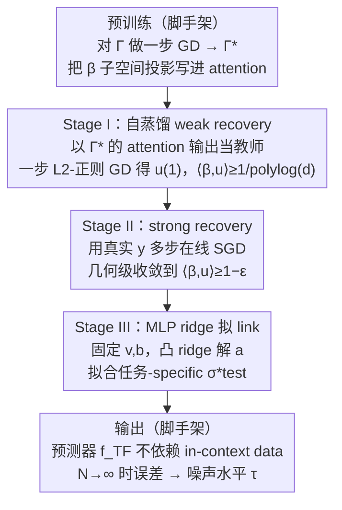

# Test time training enhances in-context learning of nonlinear functions

**会议**: ICML 2026  
**arXiv**: [2509.25741](https://arxiv.org/abs/2509.25741)  
**代码**: 无  
**领域**: 学习理论 / Transformer / 测试时训练  
**关键词**: in-context learning、test-time training、single-index model、general exponent、LoRA

## 一句话总结
本文给单层 softmax-attention transformer + LoRA 测试时微调的组合建立了首个严格泛化界，证明在 single-index 多项式任务上 TTT 把 ICL 的样本复杂度从 $r^{\Theta(\mathrm{ie}(\sigma_*))}$ 压到 $r^{\Theta(\mathrm{ge}(\sigma_*))}$ 并允许 link 函数逐任务变化、推理误差可随上下文长度 $\to$ 噪声水平。

## 研究背景与动机
**领域现状**：ICL 是预训练 transformer 的「不更新权重靠 prompt 解新任务」能力，理论上已被广泛分析——线性回归、单 index 模型、causal 结构、softmax 注意力下的 feature learning 等都已有界。但 ICL 的能力被预训练数据分布、layer norm、softmax 这些架构因素硬卡。

**现有痛点**：现有 ICL 理论（如 Nishikawa et al. 2025）证明的是 $\mathrm{loss}=o_d(1)$ 随维度 $d\to\infty$ 趋零，但 $d$ 是固定的；当上下文长度 $N\to\infty$ 时它们给不出 loss 趋零的保证，因为 softmax attention 的分母会收敛到一个含所有 Hermite 系数的期望，结构性偏差永远在。同时这些理论假设 link 函数 $\sigma_*$ 全任务固定，只允许特征向量 $\beta$ 变化，限制了表达任务多样性的能力。

**核心矛盾**：ICL 在「随 $N\to\infty$ 渐近精确」和「适应任务间 link 函数差异」两个维度都被 softmax 注意力本身的形态卡死了；要突破必须在推理时让一部分参数动起来。

**本文目标**：(i) 用 TTT 把 ICL 推到任务-specific link 函数也能学得动；(ii) 给出明确的 $N_{\text{test}}$ 收敛率而不仅是 $d\to\infty$ 极限；(iii) 把样本复杂度从 CSQ 上界 $r^{\mathrm{ie}(\sigma_*)}$ 压到更紧的 SQ 量级 $r^{\mathrm{ge}(\sigma_*)}$，对偶/偶函数 $\mathrm{ge}\le 2$。

**切入角度**：在预训练阶段 attention 矩阵 $\Gamma^\star$ 已经学到 $\beta$ 所在 $r$ 维子空间投影；TTT 阶段用 LoRA 在 $\Gamma^\star$ 上叠加 $\mathbf{u}^\top\mathbf{u}$，再分三阶段（weak recovery / strong recovery / MLP 拟 link）逐步对齐到任务参数。

**核心 idea**：把 attention 层在预训练时学到的「子空间投影 + general exponent 降幂」能力当作 TTT 的「教师信号」（自蒸馏），用它做 weak recovery，从而绕开 SGD 直接学 $\beta$ 的 $\mathrm{ie}$ 量级样本壁垒。

## 方法详解

### 整体框架
模型：单层 softmax attention + ReLU MLP，参数化为 $\mathbf{W}^{KQ}=\mathrm{diag}(\Gamma,1)$、$\mathbf{W}^{FV}=[\mathbf{O}\;\mathbf{v}]$，输出 $f_{\mathrm{IC}}(\Gamma,\mathbf{X}_N,\mathbf{y}_N,\mathbf{x})=\sum_j a_j\sigma(v_j\cdot\text{attn}(\Gamma)+b_j)$。预训练只对 $\Gamma$ 做一步 GD，得 $\Gamma^\star$。测试时把 attention 改成 LoRA 形式 $\Gamma_u=\Gamma^\star+\mathbf{u}^\top\mathbf{u}$ 并将 prompt 切成 4 段 $(N_1,N_2,N_3,N_4)$ 分别用于 weak recovery、strong recovery、MLP 训练。最终预测器 $f_{\mathrm{TF}}(\mathbf{x},\hat{\mathbf{u}},\mathbf{v},\mathbf{a},\mathbf{b})=\sum_j a_j\sigma(v_j\langle\hat{\mathbf{u}},\mathbf{x}\rangle+b_j)$ 不依赖 in-context data，因此可绕开 softmax 渐近偏差。整套流程是一条「预训练打底 → 测试时三阶段逐步对齐」的串行管线：预训练把方向子空间投影写进 $\Gamma^\star$（脚手架），随后三个测试时阶段分别完成 weak recovery、strong recovery 与 link 函数拟合，最终拼出与 in-context data 解耦的预测器。

### 关键设计

**1. 预训练利用 + 自蒸馏 weak recovery：站在预训练肩膀上绕过样本壁垒**

直接用真实标签 $y$ 训 LoRA 受 link 函数的 information exponent $\mathrm{ie}(\sigma_*)$ 制约，对高阶 Hermite 信号太弱，样本量需求随之飙升。本文的巧招是不用真实 $y$，而是把预训练后的 attention 输出 $g(\Gamma^\star,\mathbf{X}_{N_1},\mathbf{y}_{N_1},\mathbf{w}_i)$ 当教师信号，对新采样的 query $\mathbf{w}_i$ 做一步 $L_2$-正则 GD，把 $\mathbf{u}^{(0)}$ 推到 $\mathbf{u}^{(1)}$，达成 $\langle\beta,\mathbf{u}^{(1)}\rangle\ge 1/\mathrm{polylog}(d)$ 的 weak recovery。这个教师信号之所以强，靠的是一个核心引理 $\mathrm{ie}(\mathrm{He}_{\mathrm{ge}(\sigma_*)})=\mathrm{ge}(\sigma_*)$：预训练后的 attention 已经能在 in-context 内计算 $\langle\beta,\mathbf{x}\rangle^{\mathrm{ge}(\sigma_*)}$，于是信号强度从 $r^{-(\mathrm{ie}-1)}$ 提升到 $r^{-(\mathrm{ge}-1)}$，样本复杂度被从 $r^{\mathrm{ie}(\sigma_*)}$ 压到更紧的 $r^{\mathrm{ge}(\sigma_*)}$（偶函数情形 $\mathrm{ge}\le 2$）。用 attention 自蒸馏既避免了 catastrophic forgetting，又把"学方向 $\beta$"的代价整整降了一个量级。

**2. Strong recovery 的几何级收敛：把对齐精度从弱推到强**

weak recovery 只把信号强度做到 $\Theta(1/\mathrm{polylog}(d))$，离精确恢复还差得远。这一步用 $N_3$ 步在线 SGD 接着把 $\langle\beta,\mathbf{u}^{(n)}\rangle$ 推到 $\ge 1-\varepsilon$。关键观察是：weak recovery 之后信号强度已经与 $\mathrm{ge}(\sigma_*)$ 解耦，论文进一步证明误差 $1-\langle\beta,\mathbf{u}^{(n)}\rangle$ 一旦小到某阈值就转入几何级衰减，于是把样本数从 Lee et al. 2024 线性收敛上界的 $\Theta(\varepsilon^{-2})$ 紧化到 $\Theta(\varepsilon^{-1}\log\varepsilon^{-1})$。"弱恢复 → 强恢复"两段分析本身是单 index 模型理论的标准技术，本文的额外贡献是用几何级收敛把强恢复段的样本数上界做得更紧。

**3. MLP 层 ridge 训 link 函数：把"学非线性"和"学方向"解耦**

方向 $\beta$ 由 attention 层负责后，剩下的任务-specific 非线性 $\sigma_*^{\text{test}}$ 交给 MLP 层用 $N_4$ 个上下文样本拟合。做法是固定 $\mathbf{v},\mathbf{b}$ 为随机，只让 $\mathbf{a}$ 解一个凸的 ridge 回归：

$$\mathbf{a}^\star=\arg\min\frac{1}{2N_4}\sum_t\big(f_{\mathrm{TF}}(\mathbf{x}_t,\mathbf{u}^{(N_3+1)},\mathbf{v}^\star,\mathbf{a},\mathbf{b}^\star)-y_t\big)^2+\frac{\lambda_2}{2}\|\mathbf{a}\|^2$$

凸性保证了可解，Rademacher 复杂度给出 $O(N_4^{-1/2})+O(m^{-1/2})$ 的泛化界。把"学方向（attention）"与"学形状（MLP）"分开，既是单 index 理论里证明严谨界的常用技术，更是 TTT 相对标准 ICL 的核心优势所在——正是这一层让 link 函数可以逐任务变化，而标准 ICL 的 link 全程被钉死。注意最终预测器 $f_{\mathrm{TF}}(\mathbf{x},\hat{\mathbf{u}},\mathbf{v},\mathbf{a},\mathbf{b})=\sum_j a_j\sigma(v_j\langle\hat{\mathbf{u}},\mathbf{x}\rangle+b_j)$ 不再依赖 in-context data，这正是它能绕开 softmax 渐近偏差、拿到"$N\to\infty$ 时误差 $\to$ 噪声水平 $\tau$"保证的原因。

### 损失函数 / 训练策略
预训练：$\Gamma$ 做一步 GD + $\lambda_{pt}$ 正则。TTT stage I：自蒸馏一步 GD + $\lambda_1$ 正则。stage II：多步 online SGD 学 $\mathbf{u}$。stage III：ridge 学 $\mathbf{a}$。关键复杂度约束：$T_{pt},N_{pt}=\tilde\Omega(r^2 d^{Q+2})$，$N_1,N_{\text{new}}=\tilde\Omega(r^{\mathrm{ge}(\sigma_*)+2})$，$N_2=\tilde\Theta(r^2)$。

## 实验关键数据

### 主实验
用 2 层 GPT-2 在控制实验中验证（$d=r=4$，$\sigma_*^t(z)=\frac{1}{\sqrt{3!}}\mathrm{He}_3(z)+\frac{c_t}{\sqrt{4!}}\mathrm{He}_4(z)$，$c_t\sim U(-0.5,0.5)$）。

| 设定 | 上下文长度 | ICL 预测误差 | TTT 预测误差 | 备注 |
|------|-----------|--------------|--------------|------|
| Link 函数任务间变化 | 短 ($N$ 小) | 高 | TTT 早期不稳但开始下降 | TTT 高学习率引入初期波动 |
| Link 函数任务间变化 | 中 | 高（plateau） | 显著低 | TTT 持续下降 |
| Link 函数任务间变化 | 长 ($N$ 大) | 仍高 | 接近噪声水平 | ICL 渐近偏差暴露 |

关键观察：ICL 误差在 link 函数变化场景下随 $N$ 增长不下降，TTT 则持续逼近噪声水平 $\tau$。

### 消融实验

| 配置 | 现象 |
|------|------|
| 固定 $r=4$，$d\in\{4,8,16\}$ | TTT 收敛曲线几乎重合，说明样本复杂度只与内在维度 $r$ 相关，与 $d$ 无关 |
| 跳过 Stage I 自蒸馏 | 直接用 $y$ 训 $\mathbf{u}$，样本量需求飙升到 $r^{\mathrm{ie}(\sigma_*)}$ |
| Link 任务间固定（标准 ICL setting） | TTT 优势消失，标准 ICL 已足够 |

### 关键发现
- **TTT 的优势集中在 link 函数任务间变化场景**：固定 link 时 ICL 就能学；但 link 一变，attention 层学到的方向投影还能复用，必须靠 MLP 测试时更新才能拟合新非线性。
- **几何级强恢复**首次把单 index 模型的样本复杂度上界从 $\varepsilon^{-2}$ 紧化到 $\varepsilon^{-1}\log\varepsilon^{-1}$，对 SGD 学非线性的理论是个有用补充。
- **不依赖 in-context data 做最终预测**是关键的设计选择——它换来了「$N\to\infty$ 时误差 → $\tau$」的渐近保证，避免了 softmax 注意力的结构性偏差。

## 亮点与洞察
- **「自蒸馏 + LoRA」的样本复杂度跳跃**：把 attention 自身当 weak recovery 的教师，等价于免费把 $\mathrm{ie}\to\mathrm{ge}$ 减幂，是一个非常优雅的「预训练 → 测试时」桥梁。
- **「学方向（attention）」 vs 「学形状（MLP）」的清晰职责划分**：理论上很干净，工程上也对应「冻 backbone + 只在测试时微调 head」的常用做法。
- **首次在非线性 ICL 场景给出 $N$-相关收敛率**：Gozeten 2025 只覆盖线性 transformer + 线性数据，本文把 TTT 理论拓展到 softmax attention + 多项式 link 函数，是这一方向的里程碑。

## 局限与展望
- 仅证明 single-index 多项式 link，更一般的多 index 或非多项式 link 待扩展。
- 假设测试时 $\beta$ 来自与预训练同一子空间，分布漂移（如 $\mathrm{Supp}(\beta)_{\text{test}}\ne\mathrm{Supp}(\beta)_{pt}$）未覆盖。
- 算法把 attention 与 MLP 层的训练显式拆成两阶段，与实际「整体一起训」做法不同，理论结论是否扩展到联合训练仍开放。
- 控制实验维度 $d=4,r=4$ 很小，大模型/真实任务下 TTT 增益是否仍由相同机理主导未验证。

## 相关工作与启发
- **vs Gozeten et al. 2025**: 把 TTT 理论从线性 transformer + 线性数据扩到 softmax + 非线性多项式 link，首次证明 TTT 的「学 link」优势。
- **vs Nishikawa et al. 2025**: 同样用单层 softmax attention 单 index 框架，但 Nishikawa 只能给 $o_d(1)$ 的渐近界，本文给出 $N$-显式收敛率并把 link 设为任务可变。
- **vs Lee et al. 2024**: 后者证明 SQ 学习到 $r^{\mathrm{ge}(\sigma_*)}$ 复杂度，本文用 attention 自蒸馏 + LoRA 把这一界搬到 transformer 场景。
- **vs Akyürek et al. 2025（empirical TTT）**: 给经验上 ICL+TTT 的成功提供首个非线性理论解释。
- **启发**: 「测试时只动 attention 之外的一小撮参数」的范式在工程上有强复用价值，理论侧也提示后续工作可在 multi-index、distribution shift 上推广本文框架。

## 评分
- 新颖性: ⭐⭐⭐⭐ 首个 softmax + 非线性 link 下 TTT-ICL 收敛理论，框架可拓展
- 实验充分度: ⭐⭐⭐ 控制实验直观验证理论核心断言，但规模有限
- 写作质量: ⭐⭐⭐⭐ 问题/证明结构清晰，proof sketch 易读
- 价值: ⭐⭐⭐⭐ 给 TTT 这一热门方向首次提供非线性理论 footing，对算法/分析两侧都有指导

<!-- RELATED:START -->

## 相关论文

- [\[ICLR 2026\] Test-Time Meta-Adaptation with Self-Synthesis](../../ICLR2026/optimization/test-time_meta-adaptation_with_self-synthesis.md)
- [\[ICML 2026\] Learning Context-Conditioned Predicate Semantics via Prototype Feedback](learning_context-conditioned_predicate_semantics_via_prototype_feedback.md)
- [\[ICML 2025\] Training Dynamics of In-Context Learning in Linear Attention](../../ICML2025/optimization/training_dynamics_of_in-context_learning_in_linear_attention.md)
- [\[CVPR 2025\] Test-Time Augmentation Improves Efficiency in Conformal Prediction](../../CVPR2025/optimization/test-time_augmentation_improves_efficiency_in_conformal_prediction.md)
- [\[ICML 2026\] Enhancing LLM Training via Spectral Clipping](enhancing_llm_training_via_spectral_clipping.md)

<!-- RELATED:END -->
