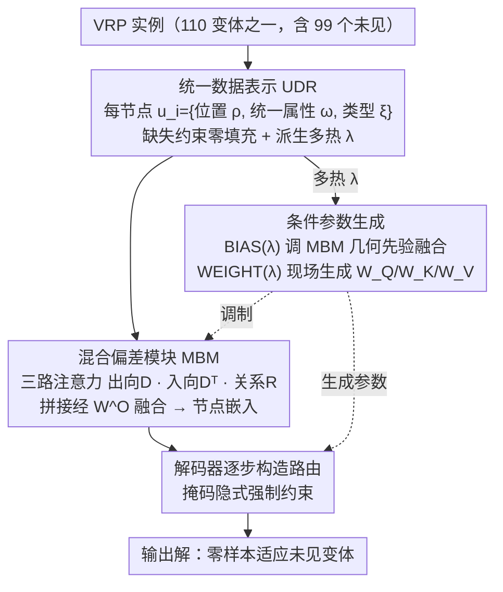

# URS：统一的神经路由求解器

**会议**: ICML 2026  
**arXiv**: [2509.23413](https://arxiv.org/abs/2509.23413)  
**代码**: https://github.com/CIAM-Group/URS  
**领域**: 组合优化 / 神经求解器 / 车辆路由问题  
**关键词**: 路由问题, 零样本泛化, 统一表示, 多任务学习

## 一句话总结
提出统一数据表示（UDR）和混合偏差模块（MBM）来替代问题枚举——使单个神经模型能无需微调地零样本泛化到 110 个 VRP 变体（99 个未见过）。

## 研究背景与动机

**领域现状**：车辆路由问题（VRP）是重要组合优化问题。最近的神经组合优化（NCO）方法在特定问题上表现突出，但多任务神经求解器主要采用两类策略——（1）约束组合方法（将 VRP 变体视为不同约束组合，依赖人工预定义问题标签）；（2）适配器微调（虽减少重训但仍需额外微调，无法零样本泛化）。

**现有痛点**：现有方法的问题边界由人工指定的约束集固定，无法覆盖开放式 VRP 约束空间。维护问题分类法需要大量领域专家知识。约束空间是组合的、开放的，单纯枚举约束组合导致模型膨胀。

**核心矛盾**：如何在不依赖问题枚举的情况下，用单个模型同时解决数十个甚至百个 VRP 变体，并对完全未见过的变体保持泛化能力？

**本文目标**：构建第一个能用单一模型无需任何微调处理 100+ 个 VRP 变体的神经求解器，包括 99 个未见过的变体。

**切入角度**：尽管 VRP 变体差异大，但它们在数据层面共享通用的结构表示。从数据表示统一的角度重新思考而非约束枚举的角度。

**核心 idea**：用统一数据表示（UDR）和多热问题表示（multi-hot $\lambda$）替代离散问题标签，通过数据统一而非问题枚举来实现跨问题泛化。

## 方法详解

### 整体框架
URS 基于编码器-解码器架构（采用 AM），核心创新在于三个层面统一——（1）数据层 UDR；（2）编码层 MBM 捕捉多种几何先验；（3）解码层基于多热问题表示 $\lambda$ 的条件参数生成。让模型适应不同问题约束而非显式编码。

### 关键设计

**1. 统一数据表示（UDR）：用一套节点特征容下所有 VRP 变体，从根上取消"问题枚举"**

现有多任务求解器把每个 VRP 变体当成一组人工约束标签，新约束就得新加一类，模型随之膨胀。URS 换了个起点：既然这些变体在数据层面共享通用结构，那就把所有约束折进同一套节点特征。每个节点写成 $\mathbf{u}_i=\{\bm{\rho}_i, \bm{\omega}_i, \bm{\xi}_i\}$——位置标识 $\bm{\rho}_i=\{\eta_i, x_i, y_i\}$ 兼容对称/非对称图，统一属性集 $\bm{\omega}_i=\{\delta_i, \epsilon_i, \mu_i, e_i, l_i, s_i\}$ 一口气覆盖需求、奖励、惩罚、时间窗等（某个变体不涉及的属性就零填充），节点类型标识 $\bm{\xi}_i\in\{0,1\}^5$ 区分仓库/客户等角色；再从中派生出一个多热表示 $\bm{\lambda}$ 标记当前问题哪些特征是活跃的。这样设计的好处是约束变成"数据"而非"架构"：遇到新约束只需通过掩码函数在解码时隐式强制，完全不用改模型结构，也就绕开了维护问题分类法所需的大量专家知识。

**2. 混合偏差模块（MBM）：一个注意力框架同时吃下对称距离、非对称距离和关系约束**

VRP 变体的几何先验五花八门——有的对称、有的非对称、有的还带额外关系矩阵。传统做法（如 MatNet）用平行层分别处理非对称性，复杂度高。MBM 把标准注意力替换成三路并行：分别对出向距离矩阵 $\bm{D}$、入向距离矩阵 $\bm{D}^{\mathrm{T}}$ 和可选关系矩阵 $\bm{R}$ 算注意力，再把三路输出拼接后用一个学习矩阵 $W^O$ 融合：

$$\hat{\mathbf{h}}_i^{(\ell)}=\big[\bar{\mathbf{h}}_i^{(0)},\, \bar{\mathbf{h}}_i^{(1)},\, \bar{\mathbf{h}}_i^{(2)}\big]\,W^O.$$

这套统一设计让对称、非对称、关系三类几何约束共享一个编码框架，以低得多的成本拿到更好的节点嵌入，而不必像 MatNet 那样为非对称性单开一套平行层。

**3. 条件参数生成：让多热表示 $\bm{\lambda}$ 现场捏出解码器参数，实现真正的零样本适应**

UDR 和 MBM 解决了"怎么表示问题"，最后一步要解决"怎么让同一个模型对没见过的问题也输出合理策略"。URS 不走适配器微调那条需要二次训练的路，而是让 $\bm{\lambda}$ 直接驱动两个轻量网络：偏差网络 $\mathrm{BIAS}(\bm{\lambda})=\max(1, (\bm{\lambda}W_1+\mathbf{b}_1)W_2+\mathbf{b}_2)$ 调节 MBM 中各几何先验的融合程度，超网络 $\mathrm{WEIGHT}(\bm{\lambda})$ 则直接生成解码器的投影矩阵 $W_Q(\bm{\lambda}), W_K(\bm{\lambda}), W_V(\bm{\lambda})$。于是面对一个全新变体，只要给出它的 $\bm{\lambda}$，模型当场算出对应参数、一步到位，不需要任何微调——这正是 URS 能零样本泛化到 99 个未见变体的机制所在。

## 实验关键数据

### 主实验（见过问题）

| 数据集 | URS | 最佳 MTL 基线 | 提升 | 求解时间 |
|--------|------|-------------|------|---------|
| TSP100 | 0.57% | POMO 0.13% | 相当 | 6s |
| CVRP100 | 1.81% | ReLD-MTL 1.42% | 轻微劣化 | 6s |
| ATSP100 | 2.26% | 基线 3.05%+ | +显著优于 GOAL | 1.1m |
| CVRPTW100 | 6.13% | MVMoE 3.14% | 牺牲，换泛化 | 8s |

### 零样本泛化（未见问题）

| 问题类型 | URS 性能 | MVMoE | 提升 | 说明 |
|---------|--------|--------|------|------|
| CVRPBP（未见） | 12.95% | 13.95% | +1.0pp | 复杂多约束 |
| MDOCVRPBPTW（未见） | 26.31% | 63.77% | +37.5pp | 极难：多仓+开放+时窗 |
| APDCVRP（未见） | 7.03% | × | 无基线 | 非对称+接送 |
| SPCTSP（未见） | -2.37% | × | 甚至超最优 | 优先级 TSP |

### 关键发现
- 99 个未见 VRP 变体平均超越现有多任务方法。
- 在复杂多约束组合上优势明显（+37pp）。
- 甚至在 SPCTSP 上超越启发式算法。
- 7000 节点大规模实例上仍保持合理求解时间。

## 亮点与洞察
- **数据统一 vs 问题枚举**：根本性思路转变——从"为每个约束组合设计标签"转向"用通用特征空间表示所有约束让模型学会权衡"。
- **混合偏差模块的通用性**：同一注意力机制框架通过多路设计兼容对称距离、非对称距离、关系约束。
- **零样本泛化的实证证据**：在 99 个完全未见的问题上无需任何微调就能工作，大多数超越有专门训练的基线。

## 局限与展望
- 见过问题的精度折扣——TSP/CVRP 等标准问题上 URS 略逊于单任务模型。
- 超大规模可扩展性未知——最大 7000 节点，实际可能数万。
- 约束满足度分析不足——对边界约束的优化程度未深入分析。
- 未来方向：知识蒸馏；集成搜索策略；在其他组合优化域验证方法通用性。

## 相关工作与启发
- **vs 约束组合法（MVMoE、MTPOMO）**：穷举约束组合导致问题覆盖有限（≤48 个）；URS 统一表示开放兼容覆盖 110+。
- **vs 适配器微调法（GOAL、TSP-FT）**：需为每个新问题微调适配器参数不是真正零样本；URS 条件参数生成一步到位。
- **通用启发**：证明神经网络可像启发式算法一样处理"问题族"的开放空间。

## 评分
- 新颖性: ⭐⭐⭐⭐⭐  数据表示统一角度解决跨问题泛化，paradigm 级创新。
- 实验充分度: ⭐⭐⭐⭐⭐  110 VRP 变体（99 未见）全面评测 + 消融 + 可扩展性至 7000 节点。
- 写作质量: ⭐⭐⭐⭐  方法清晰、表格详实；细节略臃肿。
- 价值: ⭐⭐⭐⭐⭐  首次将 100+ VRP 变体统一到单一模型，对物流调度等实际应用具重大价值。

<!-- RELATED:START -->

## 相关论文

- [\[ICML 2026\] Neural QAOA$^2$: Differentiable Joint Graph Partitioning and Parameter Initialization for Quantum Combinatorial Optimization](neural_qaoa2_differentiable_joint_graph_partitioning_and_parameter_initializatio.md)
- [\[ICML 2026\] Towards Understanding Continual Factual Knowledge Acquisition of Language Models: From Theory to Algorithm](towards_understanding_continual_factual_knowledge_acquisition_of_language_models.md)
- [\[ICML 2026\] Distribution-Free Uncertainty Quantification for Continuous AI Agent Evaluation](distribution-free_uncertainty_quantification_for_continuous_ai_agent_evaluation.md)
- [\[ICML 2026\] On the Expressive Power of GNNs to Solve Linear SDPs](on_the_expressive_power_of_gnns_to_solve_linear_sdps.md)
- [\[ICML 2026\] Follow-the-Perturbed-Leader for Decoupled Bandits: Best-of-Both-Worlds and Practicality](follow-the-perturbed-leader_for_decoupled_bandits_best-of-both-worlds_and_practi.md)

<!-- RELATED:END -->
