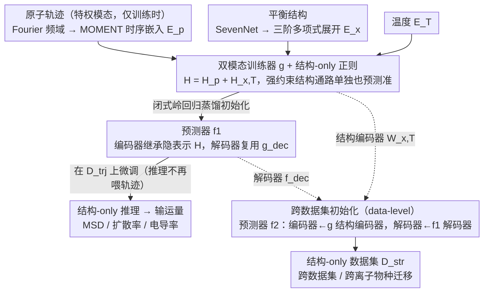

# Teaching Molecular Dynamics to a Non-Autoregressive Ionic Transport Predictor

**会议**: ICML 2026  
**arXiv**: [2605.09311](https://arxiv.org/abs/2605.09311)  
**代码**: https://github.com/jykim-git/MD.git (有)  
**领域**: AI for Science / 材料预测 / 辅助模态学习  
**关键词**: 离子输运、分子动力学、辅助模态学习、闭式岭回归初始化、特权信息

## 一句话总结
本文把昂贵的原子轨迹当作训练时的「特权辅助模态」，用一个双模态训练器先吃轨迹学动力学，再通过闭式岭回归把它的隐藏表示蒸到一个只看平衡结构的非自回归预测器上，在锂离子均方位移预测上比自回归 SOTA 快 200× 且更准。

## 研究背景与动机
**领域现状**：预测电池材料的离子输运性质（MSD、扩散率、电导率）目前主要靠分子动力学（MD）模拟：从平衡结构出发数值积分牛顿方程，得到原子轨迹再算输运量。MLIP 加速过后单条材料仍要几小时。机器学习社区有两类替代方案——自回归 MD 加速（LiFlow 等，逐步生成轨迹）和非自回归材料性质预测（MatFormer、ComFormer、DenseGNN 等，结构 → 性质单次前传）。

**现有痛点**：
- 自回归方案推理慢且会累积误差导致轨迹发散；
- 非自回归方案推理快但牺牲精度，因为它们看不到动力学信息；
- 现有方法各自只能吃「有轨迹」或「只有结构」的一种数据集，但真实场景中两种数据都很稀缺，无法互相支援。

**核心矛盾**：离子输运本质是长时间动力学（罕见跳跃事件 + 振动背景），但要快推理就必须从静态结构出发；想吃动力学又要快推理本身就是「输入模态 vs 推理代价」的根本矛盾。同时小样本场景下传统 KD 的迭代优化方差大，难以可靠迁移知识。

**本文目标**：(i) 让一个非自回归预测器学到动力学先验，但推理时不需要轨迹；(ii) 同时利用「带轨迹」和「不带轨迹」两类数据集；(iii) 在轨迹数据极少的小样本场景仍能稳定迁移知识。

**切入角度**：把原子轨迹定位为「特权信息」/「辅助模态」（auxiliary modality learning, AML），只在训练时存在；用预训练科学基础模型（SevenNet 提结构嵌入、MOMENT 提时序嵌入）提供强先验，避免在稀缺数据上从零学；用闭式岭回归代替迭代优化做模态对齐，规避小样本下 SGD 的方差爆炸。

**核心 idea**：「特权动力学模态 + 闭式蒸馏 + 跨数据集表示初始化」三件套，让结构-only 预测器隐式继承轨迹学到的动力学表征。

## 方法详解

### 整体框架
两层 auxiliary modality learning：(1) **Model-level** —— 先在带轨迹的数据集 $\mathcal{D}^{trj}$ 上训一个双模态训练器 $g$（同时吃轨迹嵌入 $\mathbf{E}_\mathbf{p}$、结构嵌入 $\mathbf{E}_\mathbf{x}$、温度嵌入 $\mathbf{E}_T$），然后用闭式岭回归把 $g$ 的合并隐藏表示 $\mathbf{H}=\mathbf{H}_\mathbf{p}+\mathbf{H}_{\mathbf{x},T}$ 蒸到预测器 $f_1$ 的编码器上，再 finetune；(2) **Data-level**（可选）—— 给只有结构的数据集 $\mathcal{D}^{str}$ 训预测器 $f_2$ 时，编码器从 $g$ 的结构编码器初始化、解码器从 $f_1$ 的解码器初始化，把轨迹数据集学到的动力学知识跨数据集迁移。

### 关键设计

**1. 双模态训练器 $g$ + 结构-only 正则：逼结构编码器在有轨迹时也学到真东西**

如果直接拿轨迹和结构一起训，轨迹信号太强、结构编码器会偷懒成"占位符"，后面想把知识蒸到结构-only 模型时就什么都没得继承。$g$ 含两个线性层 $\mathbf{W}_\mathbf{p}$（轨迹）、$\mathbf{W}_{\mathbf{x},T}$（结构+温度），相加得 $\mathbf{H}$ 后过 MLP 解码；关键在损失里加一项"只用结构嵌入也要预测准"的辅助约束 $\mathcal{L}(\hat y^i,y_s^i)+\lambda_b\mathcal{L}(\hat y^i_{\mathbf{x},T},y_s^i)$，强行让结构通路单独扛起预测任务。结构嵌入还用 SevenNet 节点+边特征聚合后做三阶多项式展开 $\mathbf{E}_\mathbf{x}=[\mathbf{E}_{a,s};\mathbf{E}_{a,s}\odot\mathbf{E}_{a,s};\mathbf{E}_{a,s}^{\odot 3}]$ 补线性层表达力。有了这层正则，结构编码器才被推着学到与动力学相关的有用表示，为下一步闭式蒸馏留下可继承的内容。

**2. 闭式岭回归蒸馏初始化：用一锤定音的解析解替代方差大的迭代 KD**

把 $g$ 的隐藏表示 $\mathbf{H}^i$ 迁到只看结构的预测器 $f_1$ 的编码器，传统 KD 走迭代梯度优化，但离子输运只有几十到几百个样本，SGD 在 data-scarce 下方差极大、调学习率/早停都不稳。作者改成解一个岭回归

$$\mathbf{W}^{trj}=\Big(\sum_i(\mathbf{X}^i)^\top\mathbf{X}^i+\lambda_r\mathbf{I}\Big)^{-1}\Big(\sum_i(\mathbf{X}^i)^\top\mathbf{H}^i\Big),$$

用 Cholesky 直接算到浮点精度，解码器直接复用 $g_{\text{dec}}$；之后在轨迹数据集上微调时不再喂轨迹，只用结构-温度嵌入。闭式解无需调优、一步到位，是小样本场景下比迭代蒸馏更稳的天然选择。

**3. 跨数据集初始化（data-level AML）：编码器走结构通路、解码器走轨迹通路的交叉初始化**

要把轨迹学到的动力学先验迁到完全没有轨迹的结构-only 数据集 $\mathcal{D}^{str}$，直接复用 $\mathbf{W}^{trj}$ 行不通——它因为闭式拟合 $\mathbf{H}$ 已经被绑死在轨迹分布上，泛化差。作者的处理是交叉初始化：$f_2$ 的编码器 $\mathbf{W}^{str}$ 从 $g$ 的结构编码器 $\mathbf{W}_{\mathbf{x},T}$ 起步（它在结构-only 正则下学到的表示更通用），解码器则从 $f_1$ 的 $f_{\text{dec}}^{trj}$ 起步（它捕捉了从隐表示到输运性质的稳健映射）。这样"编码器取通用结构通路、解码器取稳健轨迹通路"，恰好避开了 $\mathbf{W}^{trj}$ 偏向轨迹分布的问题，让动力学知识能跨数据集甚至跨离子物种迁移。

### 损失函数 / 训练策略
全程用 $L_1$ 损失预测 $\log_{10}$ 尺度的输运量；双模态训练器额外加 $\lambda_b$ 加权的结构-only 辅助项；闭式初始化用 $\lambda_r$ 控制拟合 vs 过拟合。三个数据集分别是 Dataset 1（MD 算的 Li-MSD，trajectory-based）、Dataset 2（MD 算的多元素扩散率，结构-only，Na 留作未见物种测试）、Dataset 3（真实实验的 Li 电导率，结构-only）。

## 实验关键数据

### 主实验

| 方法 | 类型 | Dataset 1 推理时间(s) | MAE@600K | MAE@800K | MAE@1000K | MAE@1200K |
|------|------|----------------------|----------|----------|-----------|-----------|
| LiFlow (Nam 2025) | 自回归 | 2910 | 0.378 | 0.392 | 0.457 | 0.407 |
| MatFormer | 非自回归 | 22 | 0.604 | 0.685 | 0.894 | 1.207 |
| ComFormer | 非自回归 | 14 | 0.451 | 0.531 | 0.642 | 0.760 |
| DenseGNN | 非自回归 | 29 | 0.412 | 0.472 | 0.531 | 0.523 |
| **Ours** | 非自回归 | **14** | **0.344** | **0.367** | **0.402** | **0.390** |

比 LiFlow 快约 200×，同时所有温度的 MAE 都比 LiFlow 还低（动力学知识没丢）。

跨数据集结果：

| 方法 | Dataset 2 MAE($\log_{10}D_{Na}$)@2500K | Dataset 3 MAE($\log_{10}\sigma_{Li}$)@300K |
|------|----------------------------------------|--------------------------------------------|
| MatFormer | 0.651 | 2.090 |
| ComFormer | 0.517 | 2.150 |
| DenseGNN | 0.312 | 2.048 |
| **Ours** | **0.064** | **1.388** |

Dataset 2 上提升 5× 量级，Dataset 3 真实实验数据也降了 0.66 MAE。

### 消融实验

| 配置 | Dataset 1 MAE@600K |
|------|-------------------|
| Full | 0.344 |
| w/o model-level AML | 0.395 |

论文还在附录中验证了：去掉结构-only 正则项 → 闭式蒸馏后结构编码器无用；去掉跨数据集 data-level AML → Dataset 2/3 提升大幅消失；用迭代 SGD 替代闭式解 → data-scarce 场景下精度下降。

### 关键发现
- **动力学先验是可蒸馏的**：即使推理时完全没有轨迹，也能继承轨迹学到的振动+跳跃模式，关键在于用 Fourier 把轨迹转到频域 + MOMENT 时序基础模型抽紧致表示。
- **跨数据集迁移甚至跨离子物种成立**：Na 离子在训练时被排除，仍能从 Li 数据学到的表示中受益。
- **小数据 + 强先验**：在几百样本规模上，闭式解 + 预训练基础模型嵌入远胜从头训深网络。

## 亮点与洞察
- **「特权信息 + 闭式蒸馏」的实用组合**：把 LUPI 框架落地到材料科学场景，且明确小数据下用闭式解比 SGD 蒸馏稳，是一个值得推广的「小样本知识迁移」配方。
- **多项式嵌入补线性层**：用 $[\mathbf{E}; \mathbf{E}^{\odot 2}; \mathbf{E}^{\odot 3}]$ 把线性映射变成有限阶非线性，配合 SevenNet 的强先验，避免引入更多参数即可获得表达力。
- **跨数据集编码器/解码器交叉初始化**：避免「闭式蒸馏后编码器被绑死在源域」的坑，思路可迁移到任何「先在富域 pretrain 再迁到贫域」的场景。

## 局限与展望
- 闭式解需要 $D\times D$ 矩阵求逆，嵌入维度大时仍需谨慎；当前用线性层+多项式展开是巧妙避开。
- 只在 Li / Na 等少数离子物种上验证，更复杂的多元素共扩散场景需进一步验证。
- 真实实验 Dataset 3 上 MAE 仍达 1.388（量级误差！），说明 sim-to-real 仍是开放问题，需要更多实验数据 + 域自适应。
- 假设轨迹长度 $L$ 一致，对变长轨迹/温度斜坡等更复杂 MD 协议需重新设计 Fourier 表示。

## 相关工作与启发
- **vs LiFlow（autoregressive）**: 后者通过生成模型逐步采样原子轨迹再算输运量，慢且会累积误差；本文直接 NAR 预测且更准。
- **vs MatFormer / ComFormer / DenseGNN**: 同为非自回归结构 → 性质，但纯结构输入无法学动力学；本文用 AML 注入。
- **vs 传统 KD (Hinton 2015)**: 用迭代梯度做 logit 蒸馏；本文用闭式表示蒸馏适配 data-scarce。
- **vs LUPI / Generalized Distillation**: 第一次把原子轨迹定位为材料预测的特权模态。
- **启发**: 在生物医学、化学等数据稀缺但有「昂贵 oracle」（如湿实验、量子模拟）的场景，这种「pretrain on rich modality, distill via closed form, transfer across datasets」的范式很值得复用。

## 评分
- 新颖性: ⭐⭐⭐⭐ 首次把原子轨迹做成特权模态 + 闭式蒸馏，思路在 AI4Science 里很新颖
- 实验充分度: ⭐⭐⭐⭐ 三个数据集覆盖 sim+real，对比了自回归和多种 NAR baseline，ablation 完整
- 写作质量: ⭐⭐⭐⭐ 动机三段（cost/accuracy/data scarcity）清晰，方法图示直观
- 价值: ⭐⭐⭐⭐ 200× 加速 + 跨数据集迁移，对电池材料筛选有直接工程价值

<!-- RELATED:START -->

## 相关论文

- [\[ICML 2026\] Speculative Sampling for Faster Molecular Dynamics](speculative_sampling_for_faster_molecular_dynamics.md)
- [\[NeurIPS 2025\] FlashMD: Long-Stride, Universal Prediction of Molecular Dynamics](../../NeurIPS2025/physics/flashmd_long-stride_universal_prediction_of_molecular_dynamics.md)
- [\[ICML 2026\] Understanding Catastrophic Forgetting In LoRA via Mean-Field Attention Dynamics](understanding_catastrophic_forgetting_in_lora_via_mean-field_attention_dynamics.md)
- [\[ICML 2025\] Teaching LLMs to Speak Spectroscopy](../../ICML2025/physics/teaching_llms_to_speak_spectroscopy.md)
- [\[ICML 2025\] Universal Neural Optimal Transport](../../ICML2025/physics/universal_neural_optimal_transport.md)

<!-- RELATED:END -->
