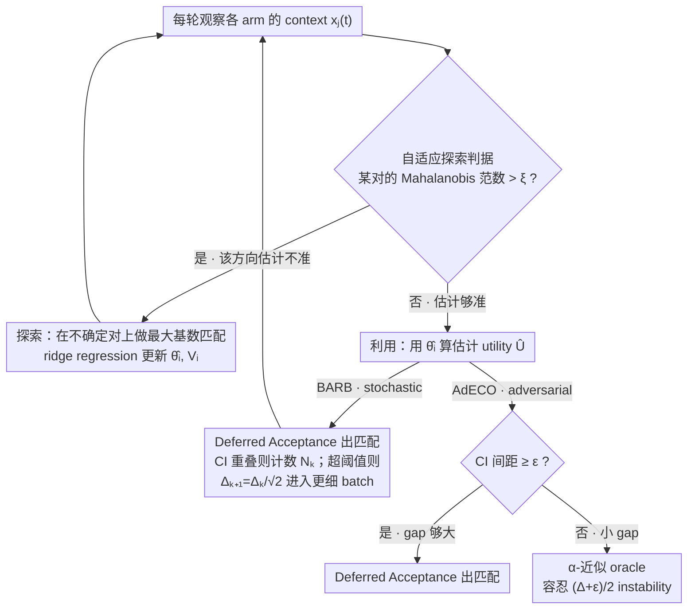

# Adaptive Bandit Algorithms for Contextual Matching Markets

**会议**: ICML 2026  
**arXiv**: [2605.28290](https://arxiv.org/abs/2605.28290)  
**代码**: 无  
**领域**: 强化学习 / 上下文 bandit  
**关键词**: contextual bandit, matching market, stable matching, regret bound, adaptive exploration  

## 一句话总结
本文研究带上下文的在线匹配市场，把玩家对动态 arm context 的线性偏好作为 bandit 学习目标，提出适用于 stochastic contexts 的 BARB 和 adversarial contexts 的 AdECO，并给出 player-optimal stable regret 的自适应上界与紧的 $\tilde O(T^{2/3})$ 级别理论结果。

## 研究背景与动机
**领域现状**：双边匹配市场用来建模学校录取、劳动市场、医疗住院医匹配和平台派单等问题。经典 Gale-Shapley 算法假设双方偏好已知，并能找到稳定匹配。近年来，bandit learning in matching markets 研究把一侧偏好设为未知，通过重复匹配和反馈逐步学习。

**现有痛点**：很多已有工作假设偏好 profile 是静态的，或需要知道最小 gap、协方差结构、环境数量等先验。但真实平台中，job/task 的 context 每轮都变，工人对任务的效用由固定偏好向量和动态 context 共同决定；少量 context 变化可能只轻微改变一个玩家的 utility，却完全重排稳定匹配 benchmark，导致其他玩家 regret 暴涨。

**核心矛盾**：匹配市场中的学习不是单个 reward 最大化。算法要同时学习每个玩家的线性偏好、保持稳定或近稳定匹配，并控制每个玩家相对于 player-optimal stable matching 的 regret。小 utility gap 或 ties 会让稳定 benchmark 本身变得脆弱，尤其在 adversarial contexts 下，传统 regret 可能不可控。

**本文目标**：在 stochastic context 和 adversarial context 两种设定下，设计无需知道真实 gap 或协方差结构的 adaptive algorithms，并给出对每个玩家都成立的 regret guarantee。

**切入角度**：作者为 stochastic setting 定义概率型 minimum preference gap $\Delta_{min}$，允许偶发小 gap，而不是要求所有轮次都有确定下界；为 adversarial setting 定义 $\alpha$-approximate $\Delta$-optimal stable regret，在大 gap 时对齐精确稳定 benchmark，小 gap 时转向近似稳定 benchmark。

**核心 idea**：用 Mahalanobis norm 判断当前 context 是否还需要探索，结合最大基数匹配收集信息、Gale-Shapley 做 exploitation，并在 adversarial small-gap 情况下调用 approximation oracle。

## 方法详解
论文的基本模型有 $N$ 个 players 和 $K$ 个 arms，且 $N\leq K$。arm 对 player 的偏好固定、严格且已知；player 对 arm 的偏好未知且随 context 改变。每轮 $t$，每个 arm $a_j$ 出现 context $x_j(t)\in\mathbb{R}^d$，玩家 $p_i$ 对它的真实 utility 是 $U_{i,j}(t)=\theta_i^\top x_j(t)$。若被匹配，平台观察到带噪 reward $y_{i,j}(t)=U_{i,j}(t)+\epsilon_{i,j}(t)$。

### 整体框架
给定真实 utility matrix $U(t)$ 和 arm-side preferences，存在一组稳定匹配 $S_t$。论文用玩家最偏好的稳定匹配 $\mu_t^*$ 作为 benchmark，并定义每个玩家 regret：$Reg_i(T)=\sum_{t=1}^T U_i^*(t)-\mathbb{E}[\sum_{t=1}^T y_i(t)]$。目标不是最大化总 reward，而是每个玩家都尽量接近自己在 player-optimal stable matching 中能得到的效用。

stochastic setting 中，每个 arm context 从固定未知分布独立采样。作者定义 minimum preference gap $\Delta_{min}$ 为满足 $P(\delta_{min}\geq\Delta)\geq 1-\log T/(T\Delta^2)$ 的最大 gap。它来自 exploration cost $O(\log T/\Delta^2)$ 和 exploitation 小 gap 概率代价 $O(\zeta T)$ 的平衡。

adversarial setting 中，context 可以任意甚至适应性选择。由于 adversary 可以让 gap 长期接近 0，精确 stable regret 不再可行。论文用 $\epsilon$-stable matching 和 approximation oracle 定义可处理的近似 regret：当 $\delta_{min}(t)>\Delta$ 时仍比较 $U_i^*(t)$，当 gap 小时比较 $\alpha U_i^\epsilon(t)$。

两种设定共享同一套**按轮决策的骨架**：每轮先用 Mahalanobis 不确定性判断"该探索还是该利用"——探索就在不确定的 player-arm 对上做最大基数匹配收集样本、用 ridge regression 更新偏好估计；利用就在估计 utility 上跑匹配。BARB（stochastic）和 AdECO（adversarial）只在"利用"分支的处理上不同：前者靠 overlap 计数逐步收紧候选 gap，后者在小 gap 时切到近似 oracle。

### 关键设计
**1. 自适应探索：用 Mahalanobis 不确定性决定何时探索**

这是 BARB 与 AdECO 共用的探索骨架，对应框架图里"自适应探索判据 → 最大基数匹配"那条回环。痛点在于：不知道真实 $\Delta_{min}$ 时，固定探索长度（如 ETC）要么探索过度、要么精度不足，且对 context covariance 退化非常敏感。本文的做法是每轮对每个 player-arm 对计算 Mahalanobis 范数 $\|x_j(t)\|_{V_i(t)^{-1}}$——它衡量当前 context 落在玩家估计椭球里的不确定度；只要存在某对超过阈值 $\xi$，就说明该方向的 utility 估计还不够准，于是把"所有不确定对"组成二分图、做**最大基数匹配**，一轮内同时给尽量多玩家收集有效样本，再用 ridge regression 更新 $V_i$ 与 $\hat\theta_i$；否则转入利用阶段。它之所以有效，是因为经典线性 bandit 置信界保证 $\|\theta_i-\hat\theta_i\|_{V_i}\leq\eta$，从而 $|U-\hat U|\leq\eta\cdot\|x\|_{V_i^{-1}}$——Mahalanobis 范数直接上界了 utility 估计误差，按它触发探索就能自适应任意 covariance，不必预先知道哪些方向难学。

**2. BARB：批次化 regret balancing 与 overlap 驱动的 gap 缩小（stochastic）**

针对 stochastic contexts，要在无先验的情况下把估计精度逐步逼到匹配真实 $\Delta_{min}$ 的程度。BARB 按 batch 运行：第 $k$ 个 batch 维护候选 gap $\Delta_k$ 和探索阈值 $\xi_k=\Delta_k/\eta$。利用阶段用估计 utility 跑 Deferred Acceptance 得到匹配，同时为各 arm 的估计 utility 构造置信区间；若 top-$(N{+}1)$ 名的区间经常重叠（说明当前精度排不开序），就累加计数器 $N_k$，一旦 $N_k$ 超过阈值 $3\log T/(16\Delta_k^2)$ 就令 $\Delta_{k+1}=\Delta_k/\sqrt{2}$、进入更细的 batch。关键在于它不预知 $\Delta_{min}$，而是把"排序是否经常分不开"当作精度不足的信号来逐步收紧——探索轮数由 elliptical potential lemma 控制、重叠轮数由停止阈值控制，两边一平衡就得到 $O(\log^2 T/\Delta_{min}^2)$ 的 player-optimal stable regret。

**3. AdECO：稳定 / 近似稳定 oracle 切换（adversarial）**

针对 adversarial contexts：adversary 可以长期制造接近 0 的 gap，此时坚持精确 player-optimal stable benchmark 会让 regret 不可控。AdECO 的探索沿用设计 1 的 Mahalanobis 触发，区别只在利用分支——进入利用后先看各 arm 置信区间的间距：若 $\geq\epsilon$（gap 够大）就调用 Gale-Shapley 得精确稳定匹配；若 $<\epsilon$（小 gap）则改调 $\alpha$-approximation oracle，允许 $(\Delta+\epsilon)/2$ 级 instability tolerance。这样做的道理是：小 gap 下 ties 本身不可辨识，强求精确稳定毫无意义；切到近似稳定 benchmark 后目标重新可解，于是即便面对任意 context，仍能给出 $O(Nd\log^2T/(\Delta-\epsilon)^2 + (\Delta+\epsilon)T/2)$ 的 $\alpha$-approximate $\Delta$-optimal stable regret，取 $\Delta=O(T^{-1/3})$ 即得 $T^{2/3}$ 级保证。

### 损失函数 / 训练策略
这是一篇在线学习理论论文，没有神经网络损失。偏好估计使用 ridge regression。对于玩家 $i$，只用其参与探索的轮次 $G^{(i)}$ 更新 $V_i(t)=\lambda I+\sum_{s<t,s\in G^{(i)}}x_{i_s}x_{i_s}^\top$ 和 $\hat\theta_i(t)=V_i(t)^{-1}\sum_{s<t,s\in G^{(i)}}x_{i_s}y_{i,i_s}$。经典线性 bandit 置信界保证 $\|\theta_i-\hat\theta_i(t)\|_{V_i(t)}\leq\eta$ 高概率成立，因此 $\|x_j(t)\|_{V_i(t)^{-1}}$ 可以直接控制 utility 估计误差。

Regret 分析主要依赖 elliptical potential lemma：探索轮次数由 $\sum\|x\|_{V^{-1}}$ 控制，exploitation 中 confidence intervals 不重叠时 GS 不产生 player-optimal stable regret，重叠轮次数由 batch stopping threshold 控制。

## 实验关键数据

### 主实验
论文主要贡献是理论 regret guarantee，数值实验用于验证 BARB/AdECO 收敛。下面按定理整理主结果。

| 设置 / 算法 | Regret 指标 | 上界 / 下界 | 关键条件 | 含义 |
|-------------|-------------|-------------|----------|------|
| Stochastic contexts / BARB | player-optimal stable regret | $O(\log^2 T / \Delta_{min}^2)$ | bounded contexts、sub-Gaussian noise、bounded $\theta_i$ | 不需要知道真实 gap 或协方差结构 |
| Stochastic + covariance lower bound | player-optimal stable regret | $O(\log T /(\tilde\lambda^2\Delta_{min}^2))$ | context covariance 最小特征值 $\geq\tilde\lambda$ | 结构更好时可去掉一个 log 因子 |
| Stochastic asymptotic upper | 每个玩家 regret | $\tilde O(T^{2/3})$ | 小 gap CDF 近 0 处至多线性 | instance-independent 上界 |
| Stochastic lower bound | 至少一个玩家 regret | $\Omega(T^{2/3})$ | 构造 $N=K=3$ 实例 | 证明 $T^{2/3}$ 速率紧 |
| Adversarial contexts / AdECO | $\alpha$-approx. $\Delta$-optimal stable regret | $O(Nd\log^2T/(\Delta-\epsilon)^2 + (\Delta+\epsilon)T/2)$ | 任意 context，给定 oracle | 取 $\Delta=O(T^{-1/3}),\epsilon=\Delta/2$ 得 $O(T^{2/3})$ |

数值实验设置为 $T=200k$、20 次独立试验、$N=K=4$、context dimension $d=3$。在最小协方差特征值较小的 stochastic 场景中，BARB 的 cumulative regret 低于 ETC 和 Batched-ETC；当协方差结构较好时，BARB 与 ETC 接近，但 BARB 不依赖事先知道协方差，因此鲁棒性更好。

### 消融实验
论文没有传统模型消融，分析重点是不同算法与 benchmark 选择的对比。

| 算法 / 设计 | 适用场景 | 需要先验 | 行为 | 主要优劣 |
|-------------|----------|----------|------|----------|
| ETC | stochastic contexts | 需要选固定探索长度 | 先探索再长期利用 | 简单，但对协方差和 gap 敏感 |
| Batched-ETC | stochastic + 正定协方差 | 依赖协方差结构假设 | 批次化探索-提交 | 可得 $O(\log T/(\tilde\lambda^2\Delta_{min}^2))$，但结构假设更强 |
| BARB | stochastic contexts | 不需要 $\Delta_{min}$ 或协方差先验 | batch 内自适应探索/利用，并缩小候选 gap | 最稳健，理论上多一个 log 因子 |
| AdECO | adversarial contexts | 需要 $\Delta,\epsilon$ 和近似 oracle | 大 gap 用 GS，小 gap 用 approximation oracle | 在任意 context 下仍有 $O(T^{2/3})$ 级 guarantee |

### 关键发现
- minimum preference gap 的概率定义是关键。它比“所有轮次都有确定 gap”更现实，也能解释为什么最终 instance-independent 速率是 $T^{2/3}$。
- BARB 的探索触发不是按轮数，而是按 context 在当前估计椭球中的不确定性。这使它能适配任意 context covariance，不需要预先知道哪些方向难学。
- adversarial setting 必须放松 benchmark。若 adversary 长期制造小 gap，坚持精确 player-optimal stable regret 会导致理论上不可控。
- 数值实验支持理论直觉：当 covariance 退化时，固定探索设计容易失败，BARB 的 adaptive exploration 更稳。

## 亮点与洞察
- 论文把 matching market 的稳定性约束和 contextual linear bandit 的置信椭球结合得很紧密，算法设计与 regret proof 之间对应清楚。
- $\Delta_{min}$ 的定义不是随便换 gap，而是从探索 regret 与小 gap 概率造成的 exploitation regret 平衡推出来的。
- AdECO 对小 gap 的处理很务实：不是假装可以分辨所有 ties，而是换成近似稳定 benchmark，承认问题本身的不可辨识性。
- player-level regret 比 social regret 更贴合匹配市场公平性，因为稳定匹配关注的是每个参与者是否有 justified envy，而不是单一总效用。

## 局限与展望
- 理论和算法主要是 centralized platform 版本；论文虽讨论 decentralized extension，但完整分析更复杂，实际平台中的通信和策略行为还未充分处理。
- AdECO 依赖离线 $\alpha$-approximation oracle。oracle 的计算复杂度、近似质量和实际可实现性会影响部署。
- 实验以合成市场为主，缺少真实劳动/任务平台数据验证。真实数据中 arm-side preferences 也未必固定且已知。
- 线性 utility 假设便于理论分析，但真实偏好可能包含非线性、交互项和战略响应。未来可考虑 generalized linear 或 representation learning 版本。

## 相关工作与启发
- **vs 静态偏好 matching bandits**: 既有工作多学习固定 preference profile；本文处理 context 每轮变化的动态偏好。
- **vs Li et al. 2022 contextual matching**: 先前方法需要已知 gap 或 covariance 结构；BARB 通过 batch gap shrinking 和 Mahalanobis 探索消除这些先验。
- **vs contextual combinatorial bandits**: CCB 关注选择 super arm 的总 reward；本文关注双边稳定匹配和每个玩家的 player-optimal stable regret。
- **启发**: 在带 equilibrium/stability benchmark 的 bandit 问题中，先定义可学习且可辨识的 regret benchmark，往往比直接套标准 bandit regret 更重要。

## 评分
- 新颖性: ⭐⭐⭐⭐ 将 contextual bandit、stable matching 和自适应 gap 学习结合，理论设定有特色。
- 实验充分度: ⭐⭐⭐ 主要是理论论文，数值实验能验证趋势但真实数据和消融较少。
- 写作质量: ⭐⭐⭐⭐ 定理结构清楚，算法动机充分，但符号和 proof sketch 较密。
- 价值: ⭐⭐⭐⭐ 对在线平台匹配、bandit theory 和稳定匹配学习有明确理论价值。

<!-- RELATED:START -->

## 相关论文

- [\[AAAI 2026\] Provably Efficient Multi-Objective Bandit Algorithms under Preference-Centric Customization](../../AAAI2026/reinforcement_learning/provably_efficient_multi-objective_bandit_algorithms_under_preference-centric_cu.md)
- [\[NeurIPS 2025\] Thompson Sampling for Multi-Objective Linear Contextual Bandit](../../NeurIPS2025/reinforcement_learning/thompson_sampling_for_multi-objective_linear_contextual_bandit.md)
- [\[ICML 2026\] Plug-and-Play Benchmarking of Reinforcement Learning Algorithms for Large-Scale Flow Control](plug-and-play_benchmarking_of_reinforcement_learning_algorithms_for_large-scale_.md)
- [\[ICML 2026\] Turning Bias into Bugs: Bandit-Guided Style Manipulation Attacks on LLM Judges](turning_bias_into_bugs_bandit-guided_style_manipulation_attacks_on_llm_judges.md)
- [\[ICML 2026\] RL4RLA: Teaching ML to Discover Randomized Linear Algebra Algorithms Through Curriculum Design and Graph-Based Search](rl4rla_teaching_ml_to_discover_randomized_linear_algebra_algorithms_through_curr.md)

<!-- RELATED:END -->
