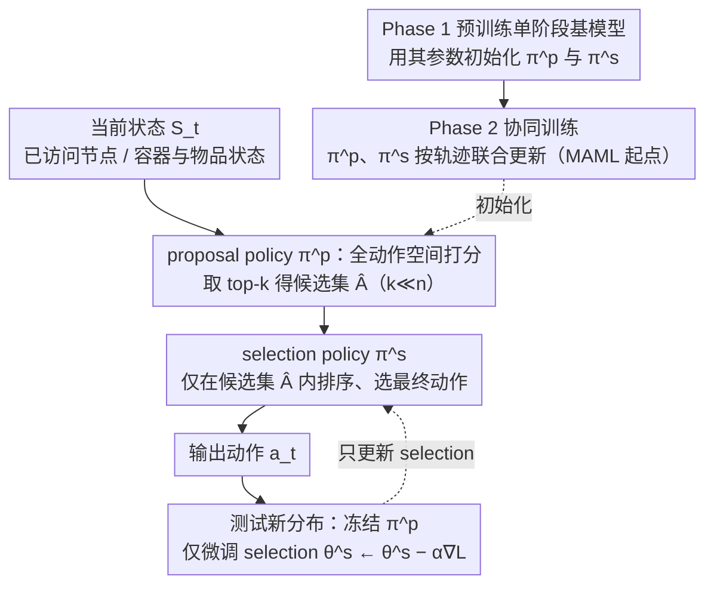

# ASAP: Exploiting the Satisficing Generalization Edge in Neural Combinatorial Optimization

**会议**: ICML2026  
**arXiv**: [2501.17377](https://arxiv.org/abs/2501.17377)  
**代码**: 未公开；论文说明实现包含在补充材料中  
**领域**: 组合优化 / 神经优化  
**关键词**: 神经组合优化, 分布外泛化, 在线适配, 两阶段决策, 元学习  

## 一句话总结
ASAP 发现神经组合优化中“找出一组有希望的动作”比“直接选中唯一最优动作”更容易跨分布泛化，并用 proposal-selection 两阶段策略和 MAML 初始化让 3D-BPP、TSP、CVRP 神经求解器在分布变化时更稳、更快适配。

## 研究背景与动机
**领域现状**：组合优化里的 3D 装箱、旅行商问题和车辆路径规划都是典型 NP-hard 问题。传统精确求解器能给最优解但代价高，手工启发式速度快但迁移性有限，近年的神经组合优化则把求解过程建模为序列决策，用 DRL 策略逐步构造解。

**现有痛点**：这类神经策略在训练分布上通常表现不错，但一旦测试实例的节点分布、物品尺寸、问题规模或业务模式变化，策略就容易退化。现实物流和排产场景恰恰经常处在动态分布里，因此只在固定分布上训练一个“会直接选动作”的策略不够可靠。

**核心矛盾**：作者的关键观察是，策略在 OOD 场景下未必能稳定判断“哪一个动作最好”，但仍能较稳地把最优动作放进 top-k 候选集合里。也就是说，粗粒度的 satisficing 判断比精确排序更可迁移，泛化能力和最终选择能力不应由同一个单阶段策略同时承担。

**本文目标**：论文希望把候选生成和最终选择拆开，让模型先生成一个小而高质量的动作集合，再由另一个可快速调整的策略在集合内选择最终动作。这样既保留神经求解器的速度，也让在线适配只发生在更小的动作空间中。

**切入角度**：作者先用 MCTS 近似最优策略做实证分析，发现普通 DRL 策略的 top-k 集合在跨分布 3D-BPP 中仍有较高概率包含 MCTS 选择的动作，但具体 top-1 排名会错位。这个现象直接支持“保留候选、重学选择”的结构设计。

**核心 idea**：用一个稳定的 proposal policy 负责跨分布保留候选动作，用一个轻量的 selection policy 负责局部分布内排序，并在新分布上只快速微调 selection policy。

## 方法详解
ASAP 的核心不是替换某一个具体求解器，而是给现有 DRL 神经组合优化策略加一个两阶段决策外壳。它可以套在 3D-BPP 的 PCT 上，也可以套在 TSP/CVRP 的 POMO、INViT 上：原来策略一步从完整动作空间里采样动作，现在先由 proposal policy 产生候选集合，再由 selection policy 在候选集合内做最终选择。

### 整体框架
输入是当前组合优化状态，例如 TSP/CVRP 中的已访问节点、当前位置和剩余容量，或 3D-BPP 中的容器状态、当前物品和可行放置位置。输出仍然是一个动作，例如下一个访问节点或当前物品的放置方案。

整个流程分成三个阶段。第一，proposal policy 根据当前状态在完整动作空间上打分，取 top-k 或采样得到候选集合。第二，selection policy 只接收这个候选集合，并在候选集合内采样最终动作。第三，在部署到新分布时，proposal policy 固定不动，selection policy 使用原 DRL 基线的损失做少量在线更新。

这个拆分利用了作者提出的 Satisficing Generalization Edge：候选集合是否覆盖好动作是较稳定的跨分布能力，候选之间的精确排序是更依赖测试分布的能力。ASAP 因此把前者交给冻结的 proposal，把后者交给可适配的 selection。

### 关键设计
**1. Satisficing Generalization Edge 与两阶段决策：把"选中唯一最优"改成"先包含一批好动作，再在其中选"**

作者的核心观察是：OOD 时策略未必能稳定判断"哪个动作最好"，但仍能较稳地把最优动作放进 top-k 候选集合里——粗粒度的 satisficing 判断比精确排序更可迁移。MCTS 预实验印证了这点：跨分布 3D-BPP 上，普通 DRL 策略的 top-k 集合仍有较高概率包含 MCTS 选中的动作，只是 top-1 排名会错位。ASAP 据此把决策拆两步：proposal policy 生成大小 $k\ll n$ 的候选集合 $\hat A$，selection policy 只在 $\hat A$ 内选最终动作。理论分析（Theorem 4.2/4.3）说明，只要原策略对最优动作的概率高于随机猜测阈值，二阶段选择最优动作的概率就能优于单阶段，且 proposal inclusion 对概率扰动更稳。这一拆分的本质是：泛化能力和最终选择能力不该由同一个单阶段策略同时扛，先保留候选就能降低因 top-1 排名错误导致整步决策失败的风险。

**2. Proposal / Selection 解耦架构：覆盖高质量候选与细粒度判别交给两个不同策略**

把"覆盖"和"排序"这两种能力解耦后，还得让它们在架构上真正分开。proposal policy 在完整动作空间上打分、输出候选集合，selection policy 只在候选集合上建模条件分布 $\pi^s(a\mid s,\hat A)$——在 3D-BPP 里它筛选可行放置动作，在路由问题里筛选下一节点或路径构造动作。解耦的好处在部署阶段最明显：如果所有参数一起适配，新分布的小样本交互很容易让模型过拟合、破坏已有泛化能力；冻结 proposal 后，在线学习只处理候选内部排序，样本需求大幅降低。消融里 "Tune All"（全参数在线更新）反而弱于只更新 selection（73.7 vs 74.2），印证了冻结 proposal 的必要性。

**3. 两阶段训练与 MAML 初始化：给两个策略一个稳定起点，并把"少量梯度步变好"写进初始化**

两个策略若都从随机初始化开始会互相拖累——proposal 初期漏掉好动作 selection 无法弥补，selection 初期反馈混乱 proposal 也学不到可靠候选。ASAP 因此 Phase 1 先训一个普通单阶段基模型、用它的参数初始化 proposal 和 selection，Phase 2 再让两者协同训练，给整个系统一个稳定起点。更进一步，作者把不同输入分布看成元学习任务，用 MAML 训一个"遇到新分布后少量梯度步就能变好"的初始化：每个 meta-iteration 先在某分布的小批实例上做内循环更新，再用更新后的策略收集轨迹更新全局初始化。这样得到的初始化不只在训练分布上强，而是天生易于在新分布上通过少量交互改善。不过消融也显示 MAML 不是收益的唯一来源——proposal-selection 拆分本身（w/o MAML 73.5）就已超过 MAML-only（72.0），两者叠加才最好。

### 损失函数 / 训练策略
ASAP 不重新发明每个任务的损失，而是继承被增强基线的 DRL 训练目标。PCT、POMO、INViT 原本如何用轨迹回报训练，ASAP 就在 proposal-selection 结构上复用相应损失。

训练分为预训练、协同调优、测试时适配三步。预训练阶段学习一个普通单阶段策略；协同调优阶段 proposal 生成候选、selection 产生动作，两者根据交互轨迹一起更新；测试时遇到新分布时，只更新 selection 的参数 $\theta^s \leftarrow \theta^s - \alpha \nabla L_{adapt}$，proposal 的参数保持固定。

MAML 版本把每种实例分布作为一个任务。每个 meta-iteration 中，模型先在某个分布的小批实例上做内循环更新，再用更新后的策略收集轨迹并更新全局初始化。这样得到的初始化并不只是在训练分布上强，而是更容易在新分布上通过少量交互改善。

## 实验关键数据

### 主实验
论文在两个大类任务上评估：在线 3D-BPP 使用空间利用率 Uti，TSP/CVRP 使用相对精确或强启发式解的 optimality gap。模型只在小规模、均匀分布训练，再评估分布变化和规模变化下的零样本泛化与在线适配。

| 任务 / 场景 | 基线 | ASAP 版本 | 关键结果 | 说明 |
|--------|------|----------|------|------|
| 3D-BPP ID-Large 离散 | PCT 70.0% -> 70.2% | PCT+ASAP+MAML 73.5% -> 74.2% | 空间利用率明显更高 | 同样在线适配后，ASAP 提升到 74.2% |
| 3D-BPP ID-Small 离散 | GOPT 84.5% -> 84.7% | PCT+ASAP+MAML 86.5% -> 87.4% | 超过强基线 | 候选-选择拆分在 ID 小物品上也有效 |
| 3D-BPP OOD-Small 离散 | PCT 约 79.5% | PCT+ASAP w/o MAML 81.8% | OOD 仍提升 | 主文强调 ASAP 在分布外场景保持优势 |
| Clustered TSP-1000 | POMO 57.25% -> 68.23% | POMO+ASAP w/o MAML 47.88% -> 40.01% | 适配方向从退化变为改善 | 普通 POMO 在线更新后 gap 反而恶化 -10.98 个点 |
| Clustered TSP-1000 | INViT-1V 14.30% -> 14.43% | INViT+ASAP w/o MAML 11.01% -> 8.12% | 大规模路由泛化更稳 | ASAP 把适配收益提升到 2.89 个点 |
| Implosion CVRP-500 | INViT-1V 13.32% -> 13.33% | INViT+ASAP w/o MAML 12.08% -> 9.51% | selection 适配效果突出 | baseline 基本停滞，ASAP 改善 2.57 个点 |

### 消融实验
| 配置 | 关键指标 | 说明 |
|------|---------|------|
| PCT baseline | ID-Large 离散 70.0% -> 70.2% | 单阶段策略只有很小适配收益 |
| PCT+MAML | ID-Large 离散 71.7% -> 72.0% | 元学习初始化本身有帮助，但不是全部来源 |
| PCT+ASAP w/o MAML | ID-Large 离散 72.9% -> 73.5% | 只做 proposal-selection 拆分就超过 MAML-only |
| PCT+ASAP w/ MAML | ID-Large 离散 73.5% -> 74.2% | 两阶段结构与元学习叠加效果最好 |
| ASAP w/ MAML Tune All | ID-Large 离散 73.5% -> 73.7% | 全参数在线更新弱于只更新 selection，说明冻结 proposal 有必要 |
| k=1 | OOD-Small 离散 +0.9% | 候选集合太小接近单阶段，收益受限 |
| k=3 / k=5 | OOD-Small 离散 +2.2% / +2.3% | 小候选集合已能捕捉多数好动作 |
| k=10 | OOD-Small 离散 +1.4% | 候选再大后收益不稳定，说明需要控制候选规模 |

### 关键发现
- 最关键的发现是 proposal 集合比 top-1 动作更跨分布稳定。MCTS 近似最优动作经常落在普通策略的 top-k 候选中，即使该策略在精确排序上已经失准。
- ASAP 的收益不是单纯来自 MAML。MAML-only 提升了初始化，但 proposal-selection 拆分带来的候选过滤和局部适配提供了更大的结构性收益。
- 只更新 selection policy 通常比全参数更新更好。全参数微调会破坏 proposal 中已有的泛化候选能力，尤其在在线样本有限时更容易过拟合。
- 计算开销相对小。3D-BPP 中 ASAP 的推理时间只比 PCT 多约 0.1 分钟量级；路由任务中 POMO+ASAP 的训练时间从 CVRP-50 的 6h55m 增到 7h7m，属于很小的工程代价。
- 候选集合大小存在甜点区。$k=3$ 到 $k=5$ 在 3D-BPP OOD-Small 上已经非常强，过大的 $k$ 会把选择问题重新变难，也削弱“缩小动作空间”的优势。

## 亮点与洞察
- 论文最漂亮的点是把神经组合优化的泛化问题拆成“覆盖能力”和“排序能力”。很多 OOD 失败不是模型完全不知道什么动作好，而是无法在相近候选中给出正确局部排序。
- ASAP 的适配策略很克制：固定 proposal，只调 selection。这比常见的全模型 test-time fine-tuning 更符合结构假设，也更能解释为什么在线更新不会轻易把模型带偏。
- 这个框架对基线友好。它不是只为某个专门架构设计，而是能接到 PCT、POMO、INViT 这类不同任务和模型上，说明“先提案、再选择”是一个可复用的决策模式。
- 理论和实证互相支撑。Theorem 4.2 给出二阶段优于单阶段的条件，Theorem 4.3 解释 proposal inclusion 对概率扰动更稳，MCTS 预实验则把这个抽象性质落到 3D-BPP 的具体动作分布上。

## 局限与展望
- ASAP 依赖 proposal policy 不能漏掉真正关键动作。如果测试分布变化太大，top-k 候选集合覆盖率下降，selection policy 再强也无法恢复被过滤掉的动作。
- 候选集合大小 $k$ 仍是重要超参数。虽然论文给了敏感性分析，但不同问题、不同规模、不同动作空间下的最优 $k$ 可能需要重新调。
- 在线适配需要与环境交互并计算梯度，这在某些实时系统中仍可能有延迟或安全成本。论文展示的时间开销较小，但工业部署还要考虑失败动作的代价和在线数据质量。
- 实验集中在 3D-BPP、TSP、CVRP 三类构造式问题。未来可以看它是否适用于更一般的组合搜索，例如 MILP 变量选择、调度、图匹配或多智能体路径规划。
- 理论分析为了可处理性做了简化假设，例如 proposal 与 selection 使用同一基础概率时的最坏情形。更贴近实际协同训练动态的理论仍有扩展空间。

## 相关工作与启发
- **vs POMO / AM 类神经路由求解器**: 这些方法直接在完整动作空间构造解，ASAP 则把它们包装成候选生成器和候选选择器。优势是 OOD 时不会把所有泛化压力压在一次 top-1 决策上。
- **vs INViT / LEHD 等泛化架构**: 这些工作主要从编码器或解码器结构上提高跨规模、跨分布泛化，ASAP 更像决策过程层面的改造，可以与它们叠加。
- **vs MAML / Omni-TSP 等元学习适配方法**: 元学习关注好初始化，ASAP 进一步规定哪些参数应该在线更新。论文结果说明“可适配结构”比“全模型好初始化”更稳。
- **vs learning-to-prune / predict-and-search**: 这些方法通常服务于传统搜索或精确求解器，ASAP 则把 pruning-like 的候选过滤直接放进神经 DRL 决策循环里。
- **启发**: 在许多 AI 决策任务里，可以先训练一个跨域稳定的候选生成器，再把分布特定的选择逻辑留给轻量适配模块。这个思路对推荐、工具调用、agent action selection 都有迁移价值。

## 评分
- 新颖性: ⭐⭐⭐⭐☆ 两阶段候选-选择并非全新范式，但用 satisficing generalization edge 解释神经组合优化 OOD 失败很有洞察。
- 实验充分度: ⭐⭐⭐⭐⭐ 覆盖 3D-BPP、TSP、CVRP、多分布、多规模、消融、敏感性和时间开销，证据链比较完整。
- 写作质量: ⭐⭐⭐⭐☆ 主线清晰，理论和实验配合得好，但表格极多且部分符号排版较拥挤。
- 价值: ⭐⭐⭐⭐⭐ 对神经组合优化的实际部署很有价值，尤其适合分布会变、又不能从头训练的物流和路径规划场景。

<!-- RELATED:START -->

## 相关论文

- [\[NeurIPS 2025\] Complexity Scaling Laws for Neural Models using Combinatorial Optimization](../../NeurIPS2025/reinforcement_learning/complexity_scaling_laws_for_neural_models_using_combinatorial_optimization.md)
- [\[ICML 2025\] Preference Optimization for Combinatorial Optimization Problems](../../ICML2025/reinforcement_learning/preference_optimization_for_combinatorial_optimization_problems.md)
- [\[ICML 2026\] Learning to Search and Searching to Learn for Generalization in Planning](learning_to_search_and_searching_to_learn_for_generalization_in_planning.md)
- [\[ICML 2026\] Learning to Approximate Uniform Facility Location via Graph Neural Networks](learning_to_approximate_uniform_facility_location_via_graph_neural_networks.md)
- [\[ICML 2026\] Bilevel Optimization over Saddle Points of Zero-Sum Markov Games](bilevel_optimization_over_saddle_points_of_zero-sum_markov_games.md)

<!-- RELATED:END -->
