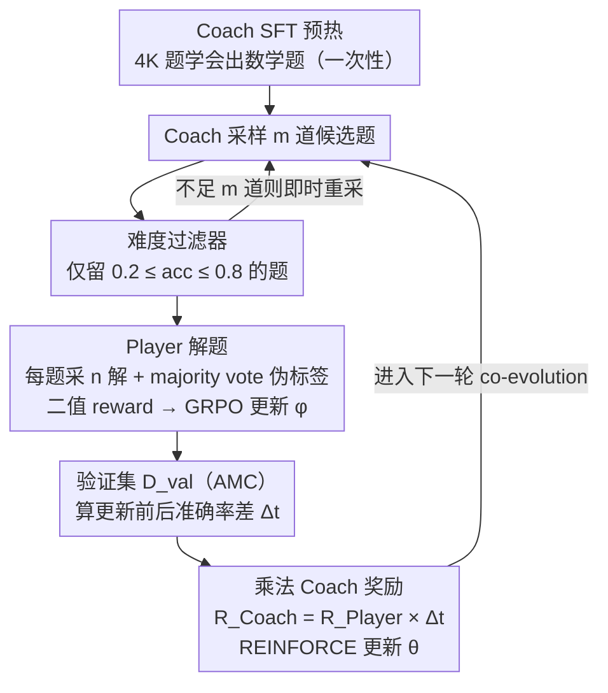

# CPMöbius: Iterative Coach–Player Reasoning for Data-Free Reinforcement Learning

**会议**: ICML 2026  
**arXiv**: [2602.02979](https://arxiv.org/abs/2602.02979)  
**代码**: https://github.com/thunlp/CPMobius  
**领域**: LLM 推理 / 强化学习 / Self-play  
**关键词**: 数据无关 RL, Coach-Player, 课程生成, GRPO, 多智能体协作

## 一句话总结
把 self-play 从"对抗"换成"协作": Coach 出题、Player 解题、Coach 拿"Player 进步幅度 × Player 解题率"作为奖励, 在完全不用外部训练数据的条件下让 Qwen2.5-Math-7B-Instruct 在六个数学 benchmark 上总均分 +4.9、OOD +5.4, 超过 RENT/R-Zero 等已有 unsupervised 方法。

## 研究背景与动机
**领域现状**：LLM 推理能力提升主流靠 SFT + RLVR (Reinforcement Learning with Verifiable Rewards) 在高质量人工题集上反复 fine-tune; OpenAI o1、DeepSeek-R1 等都依赖海量数学/代码题。Self-play 给出新方向, 通过模型自己生成训练信号实现"无外部数据"训练, 代表工作 R-Zero、AbsoluteZero 等多采取对抗设定 —— 一方出题刁难另一方。

**现有痛点**：(1) 对抗自博弈极不稳定, 出题方为了"难倒" Player 会逐渐生成无意义或不可学题目 (collapse), R-Zero 在 OpenMath-Nemotron 上甚至彻底训不动; (2) 纯熵最小化方法 (RENT) 用模型自己的置信度当 reward, 没有外部进度信号, 提升幅度有限 (Qwen2.5-Math-7B 上仅 +3.4); (3) 大多数 self-play 工作没有 explicit 课程信号, 难度随机漂移。

**核心矛盾**：Self-play 想要"开放、自适应、永远在最近发展区", 但对抗机制天生在"出题方收益 = 解题方失败"上拉扯, 越训越糟; 而完全无监督又缺少进步度量, 容易被自身置信度欺骗。

**本文目标**：找到一种 self-play 范式, 既不依赖外部数据, 又能产生稳定、可学、单调递增难度的课程, 让 Player 数学推理能力持续提升。

**切入角度**：受人类体育教练-球员关系启发 (教练奖励来自球员成长, 不是赢球员), 作者将出题方与解题方设计为协作而非对抗 —— Coach 的奖励直接绑到 Player 的"进步幅度", 出"难倒 Player"的题反而拿不到奖励, 从机制上排除 collapse。

**核心 idea**：用"乘法奖励" $R^{\text{Coach}}_i = R^{\text{Player}}_i \cdot \Delta_t$ 让 Coach 同时追求"题被 Player 解出 + Player 整体能力上涨", 把自博弈从零和拉回正和。

## 方法详解

### 整体框架
CPMöbius 让两个独立策略 $\pi_\theta^{\text{C}}$ (Coach, 出题) 与 $\pi_\phi^{\text{P}}$ (Player, 解题) 在一个迭代循环里协同进化 (co-evolve)。流程在一次性的 **Coach SFT 预热**之后进入主循环: (1) Coach 采样 $m$ 道候选题, 经**难度过滤器**只保留 Player 解题率落在 $[0.2, 0.8]$ 的题、不够则即时重采; (2) 对每道保留的题, Player 采 $n$ 个解, majority voting 得伪标签 $y_i^*$, 算每个解的二值 reward 与 GRPO 优势并更新 $\phi$; (3) 在固定的小验证集 $\mathcal{D}_{\text{val}}$ (实验用 AMC) 上算更新前后准确率差 $\Delta_t$ 作为"学习进度"信号; (4) Coach 用**乘法奖励** $R^{\text{Coach}}_i = R^{\text{Player}}_i \cdot \Delta_t$ 经 REINFORCE 更新 $\theta$, 再回到 (1)。除一次性预热外, 整个循环不碰任何外部题集。

### 关键设计

**1. 乘法 Coach 奖励：用一个乘积同时排除"题太难"和"题太水"两种崩溃**

对抗式 self-play 的死穴在于出题方的收益等于解题方的失败——为了难倒 Player, Coach 会越出越偏, 最终生成无意义或不可学的题 (collapse)。CPMöbius 把 Coach 奖励改成乘积 $R^{\text{Coach}}_i = R^{\text{Player}}_i \cdot \Delta_t$: 第一个因子 $R^{\text{Player}}_i = \frac{1}{n}\sum_j r_{i,j}$ 是该题 Player 的平均解题率, 第二个因子 $\Delta_t = \text{Acc}_{\text{val}}(\pi_{\phi_{t+1}}^{\text{P}}) - \text{Acc}_{\text{val}}(\pi_{\phi_t}^{\text{P}})$ 是 Player 这一步训练在验证集上带来的真实准确率提升。两个因子是"与"的关系——题太难没人解则 $R^{\text{Player}}=0$, 题没带来进步则 $\Delta_t \le 0$, 任一为零或负都让这道题的奖励塌成零甚至变成惩罚。于是 Coach 被迫去出"既能被解出、又能推动 Player 整体能力上涨"的题, 把自博弈从零和的对抗拉回正和的协作, 从机制上堵死了 collapse; 同时 $\Delta_t$ 这个外部进度信号比 RENT 用模型自身置信度当 reward 更接近真实的学习进度。

**2. 难度过滤器：把每一批训练题钉在 Player 的最近发展区**

GRPO 在 reward 全 0 或全 1 的 batch 上优势会归零、梯度消失, 所以"已经会的题"和"完全不会的题"对训练都是无信息样本。难度过滤器在 Coach 把题提交给训练前先做一次廉价 rollout: 对每个候选 $x_i$ 让 Player 跑 $n$ 次, 算 majority voting 准确率 $acc_i = \frac{1}{n}\sum_j \mathbb{I}[y_{i,j} = y_i^*]$, 只有落在 $[0.2, 0.8]$ 的题才留下, 超出区间就丢弃并即时重采, 直到凑够 $m$ 道。这样每批数据都落在"积极尝试且部分成功"的区间, 既给 GRPO 保证了非空的训练信号, 也把 Coach 偶发的极端难度题挡在门外, 与人类课程学习"始终略高于当前水平"的直觉一致。

**3. Coach SFT 预热：先把"怎么出题"教会, 再开始 co-evolution**

直接拿 base model 当 Coach 会生成歧义或无解的题目, 让 $\Delta_t$ 信号噪声爆炸、整个循环失稳。CPMöbius 在协同进化前先用 4K 条 PRIME Eurus-2-RL-Data 给 Coach 做一次轻量 SFT, 只训练它"出格式规整、有诊断性的数学题"这项基本教学技能, 不接触验证集和测试集。论文据此把"data-free"严格限定在 co-evolution 阶段——预热注入的是"怎么出题"的技能而非"数学知识", 之后全程零外部数据。消融显示去掉预热 (w/o Coach Warm-up) 直接从 28.8 掉到 23.7 (−5.1, 三个模块里影响最大), 说明这步虽小却是循环能稳定起步的前提。

### 损失函数 / 训练策略
Player 用 GRPO: 对每题 $n$ 个解, 优势 $A_{i,j} = (r_{i,j} - \text{mean})/\text{std}$, 在 trust region 内更新; Coach 用 REINFORCE: $\nabla_\theta J = \frac{1}{m}\sum_i R^{\text{Coach}}_i \nabla_\theta \log \pi_\theta^{\text{C}}(x_i)$。验证集固定为 AMC (难度适中, 既不饱和也不稀疏), 实验也用 Minerva / OlympiadBench 验证选择鲁棒。所有训练在 verl 框架, 4–8 张 A800-80GB, batch=16, rollout=16。

## 实验关键数据

### 主实验
在 Qwen2.5-Math-1.5B / OpenMath-Nemotron-1.5B / OctoThinker-3B-Hybrid-Zero / Qwen2.5-Math-7B-Instruct 四个 base 上, 用 AMC + AIME 2024/2025 + Minerva + MATH + Olympiad 共 6 个 benchmark 评估。

| Base / Method | Avg | OOD Avg | Minerva | MATH | Olympiad |
|---------------|-----|---------|---------|------|----------|
| Qwen2.5-Math-1.5B base | 23.3 | 19.8 | 16.3 | 56.2 | 23.4 |
| + R-Zero (Iter 3) | 27.1 | 24.7 | 19.3 | 62.4 | 26.8 |
| + RENT | 27.1 | 24.7 | 19.0 | 62.2 | 27.1 |
| **+ CPMöbius** | **28.8** | **26.8** | **28.0** | **63.1** | 26.9 |
| Qwen2.5-Math-7B-Instruct base | 35.8 | 33.0 | 34.6 | 78.0 | 37.4 |
| + RENT | 39.2 | 37.6 | 38.8 | 83.8 | 38.8 |
| **+ CPMöbius** | **40.7** | **38.4** | **44.9** | **84.2** | 38.3 |

最显著提升在 Minerva: Qwen-1.5B 16.3→28.0 (+71.8%), Qwen-7B 34.6→44.9 (+29.8%), 说明 AMC 训练出的能力对 OOD 数学领域迁移性强。R-Zero 在 OpenMath-Nemotron-1.5B 上彻底训崩 (table 中标"–"), 而 CPMöbius 仍能把它从 59.5 推到 62.1。

### 消融实验

| 配置 | Avg | OOD Avg | 关键发现 |
|------|-----|---------|----------|
| Full CPMöbius | 28.8 | 26.8 | 完整框架 |
| w/o Coach Update | 25.3 | 23.1 | Coach 固定后退化为静态课程, -3.5 |
| w/o Coach Warm-up | 23.7 | 21.2 | 基础模型当 Coach 出题质量差, -5.1 |
| w/o Instruction Filter | 24.9 | 22.5 | 不过滤难度后 GRPO 梯度噪声大, -3.9 |

### 关键发现
- 三个消融模块缺一不可, Coach Warm-up 影响最大 (–5.1); 难度过滤 (–3.9) 与 Coach Update (–3.5) 紧随其后, 说明协作机制的每一环都贡献明显。
- 训练动态: Player 答题一致性单调下降 (Coach 越来越敢出难题), 同时 problem length 单调上升而 Player response length 下降 (Player 解题越来越简洁) —— 课程难度与解题效率同时改善。
- 把验证集从 AMC 换成 Minerva / OlympiadBench, CPMöbius 仍能提升, 说明协作不是"AMC 数据外泄"。
- 对 RL 已优化的 Qwen-7B-Instruct 仍能 +4.9, 对 SFT 5.5M 样本的 OpenMath-Nemotron 仍能 +2.6, 表明 CPMöbius 能突破已有训练 paradigm 的天花板。

## 亮点与洞察
- **乘法奖励 = 数学上排除 collapse**: 这是论文最干净的设计 —— 用一个标量乘积同时绑定"局部信号 (题被解)"与"全局信号 (能力涨)", 让 collapse 与 reward-free 都不可能。这个思路可直接迁到代码/推理任何"过程能力可验证"的任务。
- **AMC 作为 $\Delta_t$ 信号源是个高 ROI 选择**: 既不饱和也不稀疏的难度带, 给 Coach 提供了"高信号-低方差"反馈, 选 benchmark 当 reward proxy 这件事本身值得记下来。
- **"Data-free" 的边界定义诚实**: 论文把 warm-up 显式排除在"data-free"声明之外, 这种用词节制在 self-play 论文里很难得; 也提醒 reader 评估 self-play 工作必看是否有"初始化数据泄露"。
- **没有 reward model**: 完全靠 verifiable reward (数学答案对错) + 验证集准确率差, 避免了 RLHF 类方法的 reward hacking, 同时也限定了适用范围 (必须可程序化判对错)。

## 局限与展望
- 作者坦承方法依赖"答案可验证", 目前只在数学上验证, 扩展到 code、定理证明、长文写作需重新设计 verifier。
- AMC 验证集只有 ~40 题, $\Delta_t$ 信号粒度粗、噪声大, 实测 $\Delta_t$ 训练曲线波动明显; 后续可考虑 ensemble 多个验证集、或用 EWMA 平滑。
- Coach 与 Player 同源 (起点同 base), 没有探索异构 Coach (比如更大模型做 Coach) 的潜力, 协作架构未必需要对称。
- 训练成本: 4–8 张 A800 训练 Coach + Player 两个模型, 实际比"用同等算力 SFT 一批高质量数据"是否更省, 论文没正面回答。

## 相关工作与启发
- **vs R-Zero (对抗 self-play)**: R-Zero 用 challenger 难倒 solver, 在 OpenMath-Nemotron 上彻底崩盘, CPMöbius 在所有 4 个 base 上稳定提升; 协作 > 对抗在不可学题目处更稳健。
- **vs RENT (熵最小化)**: RENT 用模型自置信度当 reward, Qwen-7B 上 +3.4, CPMöbius +4.9 且 OOD 高 +0.8; 外部 progress signal 比内部 confidence signal 更可靠。
- **vs SFT on curated data**: CPMöbius 不需任何外部题集, 在所有 base 上仍超越 base + RENT/R-Zero; 对算力受限但 GPU 充足的实验室是不错的"零数据 RL"方案。
- **vs RLHF**: 都用 RL 优化策略, 但 CPMöbius 不需 reward model, 也不需人类偏好数据; 它给"可验证任务的 RL"提供了 self-play 模板。

## 评分
- 新颖性: ⭐⭐⭐⭐ 协作 self-play + 乘法奖励是清晰原创的设计, 但 difficulty filter / 验证集进步度量都有先例; 整合得很优雅。
- 实验充分度: ⭐⭐⭐⭐ 4 base × 6 benchmark + 3 消融 + 验证集鲁棒 + 训练动态可视化, 但缺少计算成本 vs SFT 直接对比。
- 写作质量: ⭐⭐⭐⭐ 4 步循环 + figure 2 把架构讲得很清晰, 公式与 ablation 对应明确; "data-free"边界说明诚实。
- 价值: ⭐⭐⭐⭐ 给数学推理 RL 提供"零数据课程生成"的实用方案, 思想可迁移到任何 verifiable 任务, 已开源代码降低复现门槛。

<!-- RELATED:START -->

## 相关论文

- [\[ICML 2026\] How Reasoning Evolves from Post-Training Data: An Empirical Study Using Chess](how_reasoning_evolves_from_post-training_data_an_empirical_study_using_chess.md)
- [\[ICML 2026\] Single-Rollout Hidden-State Dynamics for Training-Free RLVR Data Selection](single-rollout_hidden-state_dynamics_for_training-free_rlvr_data_selection.md)
- [\[ICML 2026\] Revisiting Regularized Policy Optimization for Stable and Efficient Reinforcement Learning in Two-Player Games](revisiting_regularized_policy_optimization_for_stable_and_efficient_reinforcemen.md)
- [\[ICML 2026\] D$^2$Evo: Dual Difficulty-Aware Self-Evolution for Data-Efficient Reinforcement Learning](d2evo_dual_difficulty-aware_self-evolution_for_data-efficient_reinforcement_lear.md)
- [\[CVPR 2026\] See It, Say It, Sorted: An Iterative Training-Free Framework for Visually-Grounded Multimodal Reasoning in LVLMs](../../CVPR2026/reinforcement_learning/see_it_say_it_sorted_an_iterative_training-free_framework_for_visually-grounded_.md)

<!-- RELATED:END -->
